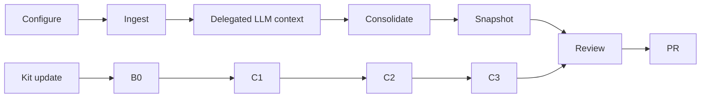

# Wiki Viva — setup and operation

Use this skill in repositories that use or are adopting Wiki Viva Kit. The
deterministic pipeline owns extraction, indexing, audits and read models. The
agent owns contextual reading and writes only reviewable proposals; no embedded
LLM client is required.

## Start every session

1. Read repository [AGENTS.md](../../AGENTS.md) and [wiki.config.yaml](../../wiki.config.yaml).
2. Inspect `git status`, current branch, worktrees and relevant open PRs.
3. Resolve the configured memory root, root entity and context hubs.
4. Preserve user changes and avoid competing with an active worktree.
5. Keep public-kit fixtures synthetic and private consumer data private.

## Lifecycle



### Configure

Set `repo_id`, `owner_label`, `root_entity`, contexts, paths and privacy policy
in `wiki.config.yaml`. Shared code must not hardcode a consumer path or context.

### Ingest and read

Use [wiki_ingest.py](../../scripts/wiki_ingest.py): `python3 scripts/wiki_ingest.py --source <source> --context <context>`.
Inspect the generated context request, perform the deep read, persist the
cache result through the repo's LLM-context skill, then consolidate. Never
invent provenance or store access credentials.

### Compile and review

Regenerate operational, input-stage, semantic and snapshot read models with the
repo commands. Review the conceptual Markdown and UI diff. A green low-level
test does not replace rendered-cockpit readback for visual work.

## Upgrade a downstream consumer

The certification state machine is retired. Do not create release subjects,
lanes, capsules, attestations, receipts or exact matrices. Do not edit frozen
`upgrade-package.yaml` to satisfy retired tests.

Run B0 from the kit checkout:

```sh
python3 scripts/wiki_sync_from_kit.py \
  --kit . --consumer /path/to/consumer --dry-run
```

Review the add/change/remove list and the C2/C3 commands. Then create a focused
consumer branch and apply:

```sh
python3 scripts/wiki_sync_from_kit.py \
  --kit . --consumer /path/to/consumer \
  --c3-command "python3 scripts/consumer_migration.py"
```

- C1 copies only Git-tracked paths allowed by `sync-manifest.yaml`, byte-for-byte
  with executable mode. It prunes only paths previously managed by `kit.lock`.
- C2 runs deterministic kit-owned generators.
- C3 is explicit and consumer-owned. Omit it when no adapter/config/domain
  migration is required; never guess.
- `kit.lock` is portable and contains no host path, private route or evidence.
- Re-run B0: a stable consumer should show no C1 delta.
- Run the consumer's audit, pytest, Vitest/TypeScript/build and local operator.
- Use the PR for review, rollback and human promotion.

Privacy/secret failures remain fail-closed. Personal data is valid in a private
wiki but not in a public export; access secrets are blocked everywhere.

## Release the kit

A release is a tag plus release notes and an **Upgrading** section. Run the
normal project CI and use a human-reviewed PR. Never push or publish when the
operator has not authorized publication.

## Core gates

```sh
python3 scripts/wiki_audit.py --check
python3 scripts/wiki_audit.py --public-export --check
python3 scripts/wiki_check_methodology_coverage.py --check
python3 scripts/wiki_operation_compile.py --check
python3 scripts/wiki_input_stage.py --check
python3 scripts/wiki_semantic_inventory.py --check
python3 scripts/wiki_web_snapshot.py --check-contract
python3 scripts/wiki_pack.py validate --all
python3 -m pytest tests/
npm --prefix apps/wiki-cockpit test
npm --prefix apps/wiki-cockpit exec -- tsc -p apps/wiki-cockpit/tsconfig.json --noEmit
npm --prefix apps/wiki-cockpit run build
```

Focused playbooks remain in the [.skills index](../README.md); use only the ones required by
the current operation.
