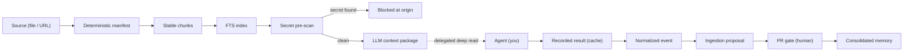

# Wiki Viva — set up and operate the living wiki

Use this skill whenever you work in a repo that uses (or should use) the **wiki
viva kit**: a living operational wiki in Markdown/Git with a deterministic
Python core, honesty gates in CI, and the deep reading (LLM) delegated to *you*,
the agent running the repo — there is no LLM client in the toolkit.

This is the **single entry point**. It covers the whole lifecycle — adopt →
configure → ingest → deep read → consolidate → cockpit → gates → PR — and links
to the focused playbooks for depth. You do not need any other skill installed to
operate; the others ([listed below](#deeper-references)) are optional detail.

> **Portability.** The links here point at the kit's invariant parts — the
> deterministic [CLIs](../../scripts/), the [core](../../wiki_core/) and
> [wiki.config.yaml](../../wiki.config.yaml) — the same in every repo. The
> *configurable* pages (the memory root, the cockpit, the meta-wiki, the command
> reference) live at whatever paths this repo declares in
> [wiki.config.yaml](../../wiki.config.yaml); [AGENTS.md](../../AGENTS.md) routes
> to them at this repo's real paths. Refer to those by role and let
> [AGENTS.md](../../AGENTS.md) and the config resolve them.

## The model in one picture

Everything left of the dashed arrow is deterministic Python you can re-run for
free. The deep read is the only model step, and it is yours.

## How to start, every session

1. Confirm the repo root and read [wiki.config.yaml](../../wiki.config.yaml):
   `language`, `contexts`, `paths` (English defaults, or a localized layout
   pinned per repo), the privacy policy and the gates.
2. Open [AGENTS.md](../../AGENTS.md) — it routes to this repo's root memory
   index (the MOC) and its cockpit page at their real paths. Read the root index,
   then the cockpit if it exists.
3. The wiki **documents itself**: the meta-wiki (linked from
   [AGENTS.md](../../AGENTS.md)) is the official documentation, kept honest by
   the same gates. Read it when you need the *why*, not just the *how*.
4. Pick the lifecycle step you are in (below) and open the matching reference.

## Lifecycle

| Step | What you do | Reference |
| --- | --- | --- |
| **Adopt / configure** | Copy the kit into a repo, set `wiki.config.yaml` + `wiki.targets.yaml`, declare contexts, choose English defaults or pin a localized layout | [reference/setup.md](reference/setup.md) |
| **Configure a source** | Create the source page + its config page (ingestion/search/business rules), register it; model meetings/cards/calendar as linked entities | [reference/sources.md](reference/sources.md) |
| **Ingest** | Turn a source into manifest → chunks → index → pre-scan → context package → event → proposal | [reference/operating.md](reference/operating.md) |
| **Deep read** | Perform the delegated LLM pass over the emitted package and record the result | [reference/operating.md](reference/operating.md) + [wiki-llm-context-agent](../wiki-llm-context-agent/SKILL.md) |
| **Consolidate** | Move the proposal through the gate, open the PR (the human gate) | [reference/operating.md](reference/operating.md) |
| **Cockpit + gates** | Recompile the cockpit and run the honesty gates before the PR | [reference/gates-and-privacy.md](reference/gates-and-privacy.md) |

## Rich representation is the default

Pages and architectures **illustrate by default** — Markdown tables for any
enumerated structured facts, and Mermaid diagrams for structure and flow
(`flowchart` for pipelines/architecture, `stateDiagram-v2` for the gate,
`sequenceDiagram` for agent↔human exchanges, `er`/`classDiagram` for the
ontology, `mindmap`/`flowchart` for a map of contents, `timeline` for history).
Prose carries nuance; it does not carry structure that a table or a diagram
shows better. Architecture, flow, relationship and process pages should each
carry at least one diagram. The page conventions live in the templates
(`obsidian-conventions`, reached via [AGENTS.md](../../AGENTS.md)); the templates
ship the skeletons, so a generated page starts with the scaffold.

## Hard rules (never break these)

- **Connectedness: bring information WITH links.** A person, source, decision or
  tool named in prose becomes a link to its page — a title with no link is a
  defect (the auditor warns on unlinked known-entity mentions). People get pages
  with contacts and a sourced perspective; mentions link to them. Canonical
  sources are first-class pages, indexed in the source registry (generated by
  `wiki_source_registry.py`) with their ingestion state and last update.
- **Write about the subject, not the process.** The deep-read produces specific
  content (quadrants, entities, relationships, context-fit), never filler or
  meta-narration. A not-yet-read proposal carries a pending marker, not fake text.
- **Single purpose per page.** Heavy ingestion/business rules live in a linked
  config page (`config_ref:`), not inline in the content page.
- **Determinism stays in the toolkit, intelligence stays in you.** Never add an
  LLM client to the Python. The pipeline emits a context package; you read and
  record the result.
- **Access secrets are blocked everywhere.** Tokens, passwords, keys, cookies
  never get versioned. The pre-scan blocks at the origin (exit `2`).
- **Privacy by boundary.** Personal data (PII) is welcome on private pages and
  raises no warning; it only blocks at the public boundary (`--public-export`).
- **Canonical memory changes go through a `wiki/<theme>` branch and a PR.** Never
  hand-edit the generated cockpit page — recompile it.
- **Gates must be green before the PR**, and stay deterministic (zero tokens).

## Deeper references

The kit ships focused playbooks; this skill orchestrates them. Reach for one
when you need the full procedure for a single step:

- [wiki-memory-router](../wiki-memory-router/SKILL.md) — load the wiki and route context.
- [wiki-ingestion-agent](../wiki-ingestion-agent/SKILL.md) — source → event → proposal.
- [wiki-llm-context-agent](../wiki-llm-context-agent/SKILL.md) — the delegated LLM pass.
- [wiki-operation-compiler](../wiki-operation-compiler/SKILL.md) — the daily cockpit.
- [wiki-source-auditor](../wiki-source-auditor/SKILL.md) — source traceability.
- [wiki-privacy-publication](../wiki-privacy-publication/SKILL.md) — private vs public.
- [wiki-raw-drive](../wiki-raw-drive/SKILL.md) — raw sources from a single Drive folder (never versioned).

Agent-facing entry point and per-repo router for every configurable page:
[AGENTS.md](../../AGENTS.md). The full CLI catalog is the command-reference page
in the meta-wiki (linked from [AGENTS.md](../../AGENTS.md)).
