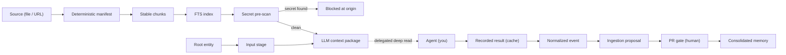

# Wiki Viva — set up and operate the living wiki

Use this skill whenever you work in a repo that uses (or should use) the **wiki
viva kit**: a living operational wiki in Markdown/Git with a deterministic
Python core, honesty gates in CI, and the deep reading (LLM) delegated to *you*,
the agent running the repo — there is no LLM client in the toolkit.

This is the **single entry point**. It covers the whole lifecycle — adopt →
configure → ingest → deep read → consolidate → cockpit → gates → PR — and links
to the focused playbooks for depth. You do not need any other skill installed to
operate; the others ([listed below](#deeper-references)) are optional detail.

> **Portability.** The links here point at the kit's invariant parts — the
> deterministic [CLIs](../../scripts/README.md), the [core](../../wiki_core/README.md) and
> [wiki.config.yaml](../../wiki.config.yaml) — the same in every repo. The
> *configurable* pages (the memory root, the cockpit, the meta-wiki, the command
> reference) live at whatever paths this repo declares in
> [wiki.config.yaml](../../wiki.config.yaml); [AGENTS.md](../../AGENTS.md) routes
> to them at this repo's real paths. Refer to those by role and let
> [AGENTS.md](../../AGENTS.md) and the config resolve them.

## The model in one picture

Everything left of the dashed arrow is deterministic Python you can re-run for
free. The deep read is the only model step, and it is yours.

## How to start, every session

1. Confirm the repo root and read [wiki.config.yaml](../../wiki.config.yaml):
   `language`, `root_entity`, `contexts`, `paths` (English defaults, or a
   localized layout pinned per repo), the privacy policy and the gates.
2. Open [AGENTS.md](../../AGENTS.md) — it routes to this repo's root memory
   index (the MOC), configured root entity and cockpit page at their real paths.
   Read the root index, the root entity, then the cockpit if it exists.
   If the task is a resume, review or consolidation round, also read the top
   "Short-term memory" section of the operational pass before opening older
   execution pages.
3. The wiki **documents itself**: the meta-wiki (linked from
   [AGENTS.md](../../AGENTS.md)) is the official documentation, kept honest by
   the same gates. Read it when you need the *why*, not just the *how*.
4. Pick the lifecycle step you are in (below) and open the matching reference.

## Lifecycle

| Step | What you do | Reference |
| --- | --- | --- |
| **Adopt / configure** | Copy the kit into a repo, set `wiki.config.yaml` + `wiki.targets.yaml`, declare contexts, choose English defaults or pin a localized layout | [reference/setup.md](reference/setup.md) |
| **Upgrade a downstream repo** | Reuse an exact upstream certification capsule, compute the consumer delta, run consumer-always/affected gates and promote through a reversible canary | [downstream-migration-two-lane-strategy.md](../../docs/references/guides/downstream-migration-two-lane-strategy.md) + [wiki-viva-v8-downstream-upgrade.md](../../docs/references/guides/wiki-viva-v8-downstream-upgrade.md) |
| **Migrate existing pages** | Inventory legacy Markdown pages, add reviewed v6.2 frontmatter, register page types and reconnect the graph | [wiki-viva-v6.2-migration.md](../../docs/references/guides/wiki-viva-v6.2-migration.md) |
| **Canonicalize entities** | Merge duplicated people/projects/sources into one canonical page, keep aliases there and update inbound links | [canonical-entity-navigation.md](../../docs/references/guides/canonical-entity-navigation.md) |
| **Configure a source** | Create the source page + its config page (ingestion/search/business rules), register it; model meetings/cards/calendar as linked entities | [reference/sources.md](reference/sources.md) |
| **Compile input stage** | Recompile the generated root/channel/source catalog before source routing or setup-sensitive ingestion | [reference/operating.md](reference/operating.md) |
| **Ingest** | Turn a source into manifest → chunks → index → pre-scan → input-stage-aware context package → event → proposal | [reference/operating.md](reference/operating.md) |
| **Deep read** | Perform the delegated LLM pass over the emitted package and record the result | [reference/operating.md](reference/operating.md) + [wiki-llm-context-agent](../wiki-llm-context-agent/SKILL.md) |
| **Create typed pages** | Use [wiki_new.py](../../scripts/wiki_new.py) with `wiki.page-types.yaml`; do not start typed pages from blank files, and keep relation pages under a declared `moc_parent` hub | [reference/operating.md](reference/operating.md) |
| **Consolidate** | Generate the event + integration packet with [wiki_consolidate.py](../../scripts/wiki_consolidate.py), integrate into the target pages, close `consolidated_into` and `impact_closure`, then move the proposal through the gate and open the PR (the human gate) | [reference/operating.md](reference/operating.md) |
| **Check quality/cost** | Run [wiki_quality_report.py](../../scripts/wiki_quality_report.py) to inspect density, repetition, consolidation gaps and cost/cache telemetry without enforcing a hard budget | [reference/gates-and-privacy.md](reference/gates-and-privacy.md) |
| **Operational pass + cockpit + gates** | Recompile the source/action/context pass, recompile the cockpit and run the honesty gates before the PR | [reference/gates-and-privacy.md](reference/gates-and-privacy.md) |

## Rich representation is the default

Pages and architectures **illustrate by default** — Markdown tables for any
enumerated structured facts, and Mermaid diagrams for structure and flow
(`flowchart` for pipelines/architecture, `stateDiagram-v2` for the gate,
`sequenceDiagram` for agent↔human exchanges, `er`/`classDiagram` for the
ontology, `mindmap`/`flowchart` for a map of contents, `timeline` for history).
Prose carries nuance; it does not carry structure that a table or a diagram
shows better. Architecture, flow, relationship and process pages should each
carry at least one diagram. The page conventions live in the templates
(`obsidian-conventions`, reached via [AGENTS.md](../../AGENTS.md)); the templates
ship the skeletons, so a generated page starts with the scaffold.

## Hard rules (never break these)

- **Ingesting = integrating.** A source is only `ingested` when the wiki's
  concepts reflect the new information: deep-read results are consolidated
  ([wiki_consolidate.py](../../scripts/wiki_consolidate.py)), targets updated
  incrementally, conflicts/ambiguities resolved or recorded, the event's
  `consolidated_into` closed, and every `affected_pages.must_update` entry
  closed in `impact_closure` as updated, no-change with reason or blocked with
  reason — cataloging the source is NOT ingesting (the audit + CI enforce this).
- **v6.2 graph/types/perspectives.** Run
  [wiki_page_graph.py](../../scripts/wiki_page_graph.py) for graph/impact checks
  when debugging links; page types live in
  [wiki.page-types.yaml](../../wiki.page-types.yaml); perspective-aware deep
  reads use `context_deep_read.v3` and must report every required perspective.
- **v6.3 quality/cost telemetry.** Run
  [wiki_quality_report.py](../../scripts/wiki_quality_report.py) before applying
  a new ingestion pattern to private data. Cost is measured for control and
  comparison, not as a hard budget gate; pages should be dense, well linked and
  avoid literal repetition unless the repeated fact is reframed by a different
  perspective, context or zoom level. The report also flags relation pages
  without a declared hierarchy parent (`moc_parent`/parent hub).
- **v6.8 root/input stage.** A repo starts from a configured `root_entity` page
  that defines the semantic top entity, integral perspective bundle, input
  channels, processes and target pages. Run
  [wiki_input_stage.py](../../scripts/wiki_input_stage.py) `--check`/`--write`
  whenever root/channel/source config changes; the LLM package inherits this
  context.
- **Hierarchy before execution.** Keep the top navigation conceptual: root MOC →
  context/domain hub → subdomain/entity hub → relation/evidence pages →
  execution/event pages. New actions, claims, decisions, meetings, people,
  projects, sources and source configs must declare `moc_parent`; `source_refs`
  is provenance, not navigation.
- **Legacy migration is review-first.** Use
  [wiki_migration_inventory.py](../../scripts/wiki_migration_inventory.py) and
  the v6.2 migration guide to plan frontmatter migration; do not rewrite
  existing memory pages automatically without a reviewed patch.
- **Connectedness: bring information WITH links.** A person, source, decision or
  tool named in prose becomes a link to its page — a title with no link is a
  defect (the auditor warns on unlinked known-entity mentions). People get pages
  with contacts and a sourced perspective; mentions link to them. One real
  entity gets one canonical page; merge duplicates, keep supported aliases there
  and update inbound links in the same PR. Canonical sources are first-class
  pages, indexed in the source registry (generated by `wiki_source_registry.py`)
  with their ingestion state, last update and next suggested refresh. For local
  navigation, link concrete files (`README.md`/`index.md`) instead of directory
  targets; the audit warns on directory links because Obsidian may treat them as
  new notes.
- **Consolidate into hubs before creating parallel pages.** The context hub
  carries the current synthesis and points down to relation/evidence/execution
  pages. Do not spread a general concept across many sibling pages when one hub
  plus typed children is enough.
- **Quadrants are anchor-relative projections.** Classify a page from the
  selected center, not globally from the wiki root. A nested root/template page
  becomes the center for its descendants; use `parent_projection:` on nested
  centers and `subject_ref`/`subject_role` or `projection_overrides:` on pages
  when local semantics and parent-facing semantics differ.
- **Write about the subject, not the process.** The deep-read produces specific
  content (quadrants, entities, relationships, context-fit), never filler or
  meta-narration. A not-yet-read proposal carries a pending marker, not fake text.
- **Single purpose per page.** Heavy ingestion/business rules live in a linked
  config page (`config_ref:`), not inline in the content page.
- **Determinism stays in the toolkit, intelligence stays in you.** Never add an
  LLM client to the Python. The pipeline emits a context package; you read and
  record the result.
- **Access secrets are blocked everywhere.** Tokens, passwords, keys, cookies
  never get versioned. The pre-scan blocks at the origin (exit `2`).
- **Privacy by boundary.** Personal data (PII) is welcome on private pages and
  raises no warning; it only blocks at the public boundary (`--public-export`).
- **Certify once, adopt by delta.** A downstream migration reuses upstream
  proof only when `source_sha`, `package_sha256`, `portable_tree_sha256`,
  `consumer_B0`, `consumer_C3`, `command_registry_sha256` and
  `toolchain_sha256` match the immutable capsule and unfinished-attempt state.
  A completed adoption receipt is historical evidence for its original
  PR/human gate; it never authorizes a second promotion or a completed-run
  `--resume`. A new attempt still runs current consumer privacy, semantic,
  adapter, snapshot, canary, diff and rollback/report proof. Unknown path or
  contract impact escalates to the full lane. The certified runner version
  includes the byte/mode digest of its Python/schema/probe execution closure;
  the toolchain binds the actual runner interpreter, its resolved Python
  dependencies and the Chromium engine actually launched by Playwright.
  Generate Lane A visual authority with
  [wiki_visual_evidence.py](../../scripts/wiki_visual_evidence.py) `capture`
  from the exact clean source: its
  sorted manifest must cover every
  package visual profile and bind each PNG to a canonical record containing
  source/package/browser identity plus count-only console/network evidence.
  After `certify`, independently run
  [wiki_upgrade.py](../../scripts/wiki_upgrade.py) `verify-capsule` with the
  sealed authority and out-of-band attestation digest before `plan`. Treat
  public-safe quiet/TAP gate reporters as command-registry authority; a passing
  log that exposes a host path is a failed certification artifact.
  Preserve the `acceptance_anchor_sha256`
  emitted by `plan` outside `.wiki-viva/`; pass it back to every `adopt` or
  `--resume`. Never derive trust again from a restored anchor file and never
  recreate a missing anchor. After the selected real canary completes, capture
  the emitted `canary_completion_anchor_sha256` outside `.wiki-viva/` and pass
  it to every post-canary resume; never accept a locally resealed result ledger
  as completion authority. The acceptance-attempt identity binds the canonical
  SHA-256 of the complete exact preflight object, including its internal
  `preflight_sha256`; a changed, coherently resealed preflight is a different
  attempt and cannot reuse the original anchor. If an execution plan already
  exists, every `--resume` must first replay the registered C2 commands from C1
  in a disposable clone and prove exact path-set, Git-mode and blob equality
  before reusing any stored gate result. Gate selection is recomputed from the sealed package
  and impact registry, including package-required background promotion gates
  and dependency closure. A migration already started with a v2 package
  keeps every declared `migration.required_gates` entry blocking; v3
  classification never rewrites its historical evidence. Toolkit-owned
  portable wiki skill packages are byte-equal C1. The downstream
  [AGENTS.md](../../AGENTS.md) and every
  non-`wiki-*` repo-local skill are consumer-owned C3; update their routing with
  the adapter delta. Consumer base and `.local` page-type/template registries
  are also C3 merge surfaces. Config localization grants no broad memory or
  references-root exception. Derive the config-bound C3 authority exclusively
  from the committed `consumer_B0:wiki.config.yaml` blob and accept exactly
  three roles: the exact `command_reference_page`, the exact
  `operational_pass_page`, and inert Markdown descendants of the configured
  `references_root/releases/**` subtree (`release_records`). Never derive or
  widen that authority from the worktree, C1, C2 or C3. Require every such
  artifact to be a regular UTF-8 `.md` blob with mode `100644`, secret-clean and
  owned only by C3; C1/C2 placement, executable mode, binary data or any other
  descendant fails closed. Bind the derived-authority digest into plan, state,
  receipt and report, and invalidate the attempt when it changes. Rc21 is
  historical non-promotional proof after downstream rehearsal exposed this
  missing boundary. Exact local rc22 source
  `7e72664fb6871d906addbddb6ed5b2e7f1fec33c` is its corrected successor. Its
  tracked `candidate` status authorizes only a separately attested local
  downstream-QA capsule, never public release or production promotion. Do not amend,
  regenerate or reclassify any already sealed v2 C3 or receipt.
  Require direct single-parent B0->C1->C2->C3 edges;
  bind all four commits in receipt and state; recompute edge paths, modes and
  blobs from Git; and regenerate all C3-bound receipts whenever those files
  change. Reject symlinks, submodules and special boundary entries. Scan public
  evidence keys, values, routes and gate output literally and through bounded
  repeated percent-decoding; unresolved nested encoding fails closed. Follow the
  [two-lane strategy](../../docs/references/guides/downstream-migration-two-lane-strategy.md).
- **Canonical memory changes go through a `wiki/<theme>` branch and a PR.** Never
  hand-edit generated operational pages — recompile the cockpit with
  [wiki_operation_compile.py](../../scripts/wiki_operation_compile.py) and the
  source/action/context pass with
  [wiki_operational_pass.py](../../scripts/wiki_operational_pass.py).
- **Gates must be green before the PR**, and stay deterministic (zero tokens).

## Deeper references

The kit ships focused playbooks; this skill orchestrates them. Reach for one
when you need the full procedure for a single step:

- [wiki-memory-router](../wiki-memory-router/SKILL.md) — load the wiki and route context.
- [wiki-ingestion-agent](../wiki-ingestion-agent/SKILL.md) — source → event → proposal.
- [wiki-llm-context-agent](../wiki-llm-context-agent/SKILL.md) — the delegated LLM pass.
- [wiki-operation-compiler](../wiki-operation-compiler/SKILL.md) — the daily cockpit.
- [wiki-source-auditor](../wiki-source-auditor/SKILL.md) — source traceability.
- [wiki-privacy-publication](../wiki-privacy-publication/SKILL.md) — private vs public.
- [wiki-raw-drive](../wiki-raw-drive/SKILL.md) — raw sources from a single Drive folder (never versioned).

Agent-facing entry point and per-repo router for every configurable page:
[AGENTS.md](../../AGENTS.md). The full CLI catalog is the command-reference page
in the meta-wiki (linked from [AGENTS.md](../../AGENTS.md)).
