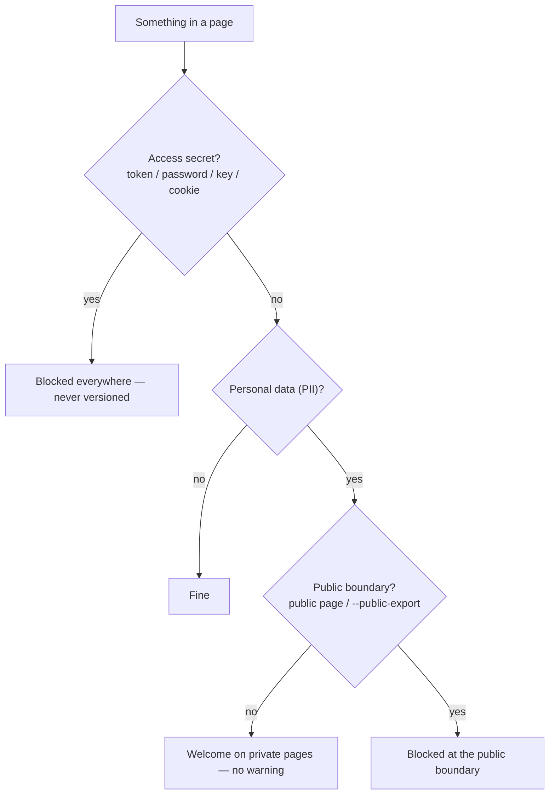

# Gates and privacy — keeping the wiki honest

The wiki's claims about freshness, coverage and traceability are **verified in
CI**, not asserted in prose. The gates are deterministic (zero model tokens) and
run the same locally and in [.github/workflows/wiki.yml](../../../.github/workflows/wiki.yml).
Run them before every PR.

## The honesty gates

| Gate | What it verifies | Command |
| --- | --- | --- |
| Contract audit | Frontmatter, clickable local links, secrets blocked everywhere, PII at the public boundary, cockpit, ingestion events with quadrants, gate state, visibility promotion, LLM-pass gate, log update | [wiki_audit.py](../../../scripts/wiki_audit.py) `--check` |
| Methodology coverage | Presence **and content** of the method (pages, templates, scripts, config), real use of the perceptive layer, an executed LLM pass (not a plan) | [wiki_check_methodology_coverage.py](../../../scripts/wiki_check_methodology_coverage.py) `--check` |
| Cockpit freshness | The cockpit page equals a recompile at HEAD (deterministic view) | [wiki_operation_compile.py](../../../scripts/wiki_operation_compile.py) `--check` |
| Input stage freshness | The generated root/channel/source staging page equals a recompile at HEAD | [wiki_input_stage.py](../../../scripts/wiki_input_stage.py) `--check` |
| Source registry freshness | Canonical source registry equals source page frontmatter | [wiki_source_registry.py](../../../scripts/wiki_source_registry.py) `--check` |
| Consolidation closed | Ingesting = integrating: a deep-read-complete source needs its event and at least one non-source `consolidated_into` target; each non-source target references the source back, source identity targets stay acyclic, and candidate claims are linked or explicitly waived (`sem_claim`) | [wiki_consolidate.py](../../../scripts/wiki_consolidate.py) `--check` + [wiki_audit.py](../../../scripts/wiki_audit.py) `--check` |
| Quality and hierarchy | Dense pages, low repetition, closed events, operational coverage and relation pages routed through `moc_parent`/parent hubs when configured | [wiki_quality_report.py](../../../scripts/wiki_quality_report.py) `--check` |
| Tests | The deterministic core behaves | `python3 -m pytest tests/` |

Useful audit modes:

- `--public-export --check` — pre-publication: PII becomes an error on **any**
  page, not just public ones. Run this before exporting anything publicly.
- `--strict-local` — requires that links to gitignored derived/raw artifacts
  actually exist on disk.

If a gate fails, fix the cause — do not weaken the gate. A green gate is a real
guarantee; a disabled gate is a silent lie.

## Privacy — two independent axes

- **Access secrets** — always blocked, in any file, by the detectors and the
  auditor. The ingestion pre-scan blocks them at the origin (exit `2`).
- **Personal data (PII)** — names, amounts, counterparties, tax ids: welcome on
  private pages (that is the point of operational memory); blocked only at the
  public boundary. Detail: the privacy page in the meta-wiki (routed from
  [AGENTS.md](../../../AGENTS.md)) and
  [wiki-privacy-publication](../../wiki-privacy-publication/SKILL.md).

## The gate state machine (proposals)

Proposals move through explicit states; transitions are recorded in
`gate_history`. The exact states and edges are documented (and enforced) in the
gates-and-audit page of the meta-wiki (routed from
[AGENTS.md](../../../AGENTS.md)); use [wiki_gate.py](../../../scripts/wiki_gate.py)
to transition, and never edit `gate_state` by hand.
