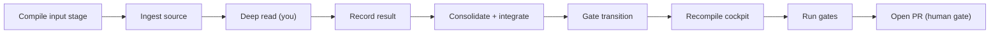

# Operating — the daily loop

The loop is: **input stage → ingest → deep read → consolidate + integrate →
cockpit → gates → PR**. All commands are deterministic and re-runnable; the
model steps — the deep read and the integration it feeds — are yours. The full per-CLI catalog is the
command-reference page in the meta-wiki (linked from [AGENTS.md](../../../AGENTS.md)).



## 1. Compile the input stage

The input stage is a deterministic catalog compiled from the configured root
entity, input channels, source pages and source configs. It does not fetch
external systems; it makes source routing explicit before the LLM package is
emitted.

```sh
python3 scripts/wiki_input_stage.py --check
python3 scripts/wiki_input_stage.py --write
python3 scripts/wiki_input_stage.py --ready
```

## 2. Ingest a source

End-to-end orchestrator (manifest → text/chunks → index → secret pre-scan → LLM
context package → score event):

```sh
python3 scripts/wiki_ingest.py --source data/raw/example.pdf --context system
python3 scripts/wiki_ingest.py --source X.md --context system --dry-run
```

Exit `2` means a **secret was found in the source** — it is blocked at origin;
remove the secret upstream, never version it. PII is only reported (it is welcome
on a private page). To create just the PR-ready proposal Markdown, use
[wiki_new_ingest.py](../../../scripts/wiki_new_ingest.py); for individual stages
(manifest, text, index) see the command reference.

## 3. Deep read (delegated LLM pass)

The pipeline emits a `*-llm-context-request.json` package; **you** read each
chunk and produce the structured result, then record it. For repo-local source
pages, the package includes root entity, input channel, inherited perspectives
and target pages from the input stage.

```sh
python3 scripts/wiki_llm_context_pass.py --source X.pdf --context system --emit-request
# ... you read the package and produce the result object/array ...
python3 scripts/wiki_llm_context_pass.py --record-result result.json --context system
python3 scripts/wiki_llm_context_pass.py --source X.pdf --context system --check
```

Provenance is enforced: the gate (`--check`) fails while any chunk lacks a
recorded result and `required_context_pass` is on. A mere *plan* is never accepted
as proof of an executed pass. Detail: [wiki-llm-context-agent](../../wiki-llm-context-agent/SKILL.md).
For batch/cheap processing, export pending requests with
[wiki_export_batch.py](../../../scripts/wiki_export_batch.py) (Anthropic Message
Batches format).

## 4. Consolidate and INTEGRATE (the missing half)

Recording the deep read is **not** ingesting — ingesting = integrating. A source
is only done when the wiki's concepts reflect the new information. Generate the
normalized event and the integration packet from the recorded deep read with
[wiki_consolidate.py](../../../scripts/wiki_consolidate.py):

```sh
python3 scripts/wiki_consolidate.py --source <source_id> --emit-event --packet
# optional: --source-page <path> / --source-ref <page_id> of the canonical source page
```

`--emit-event` generates the normalized event from the llm-cache (quadrants
filled — never placeholders —, claims/decisions/actions candidates, and
`consolidated_into: []` for you to close); `--packet` emits the integration
packet (gitignored) with the related pages, overlapping claims and potential
conflicts per claim/entity, so you integrate with context instead of re-reading
the whole wiki.

Then **you integrate**, guided by the packet:

- update the target hubs/concept pages incrementally before creating parallel
  relation pages;
- create/update load-bearing claim pages, using the conflict fields
  (`supersedes` / `superseded_by` / `conflicts_with` / `conflict_resolution`)
  when claims collide, and declare the target hub in `moc_parent`;
- resolve or record **every** conflict and ambiguity the packet surfaces;
- fill the event's `consolidated_into` — each target page must reference the
  source back in `source_refs`.

Close the loop with the gates:

```sh
python3 scripts/wiki_audit.py --check          # audit_consolidation: closed events, reverse refs, claims
python3 scripts/wiki_consolidate.py --check    # fails while a deep-read-complete source is unintegrated (CI)
python3 scripts/wiki_quality_report.py --check # fails configured quality/hierarchy thresholds
python3 scripts/wiki_consolidate.py --all-pending   # list what is still waiting
```

Only then does the source page get `ingestion_state: ingested` +
`last_ingested_at` + a row in its ingestion log, and the source registry is
regenerated.

## 5. Move the proposal through the gate

Proposals live flat under the ingestion dir and move through states via
[wiki_gate.py](../../../scripts/wiki_gate.py):

```sh
python3 scripts/wiki_gate.py --list
python3 scripts/wiki_gate.py --transition <proposal>.md --to approved --reason "reviewed"
python3 scripts/wiki_gate.py --rebase --rebase-key <logical-target>   # supersede older pending proposals
```

Resolved proposals/events can be moved to the immutable archive with
[wiki_archive.py](../../../scripts/wiki_archive.py). The approval cycle is the
git-approvals page in the meta-wiki (routed from [AGENTS.md](../../../AGENTS.md)).

## 6. Recompile the cockpit

Never hand-edit the cockpit — recompile it from real Git/memory state:

```sh
python3 scripts/wiki_operation_compile.py --write    # regenerate the cockpit page
python3 scripts/wiki_operation_compile.py --check    # CI: fails if semantically stale
python3 scripts/wiki_input_stage.py --write          # regenerate root/channel/source stage
python3 scripts/wiki_input_stage.py --check          # CI: fails if stale
python3 scripts/wiki_operational_pass.py --write     # regenerate source/action/context pass
python3 scripts/wiki_operational_pass.py --check     # CI: fails if stale
```

## 7. Run the gates and open the PR

```sh
python3 scripts/wiki_audit.py --check
python3 scripts/wiki_consolidate.py --check                  # every deep-read source integrated
python3 scripts/wiki_quality_report.py --check               # quality/hierarchy thresholds
python3 scripts/wiki_check_methodology_coverage.py --check   # when methodology files changed
python3 scripts/wiki_operation_compile.py --check
python3 scripts/wiki_input_stage.py --check
python3 scripts/wiki_operational_pass.py --check
python3 -m pytest tests/ -q
python3 scripts/wiki_pr_summary.py                           # paste into the PR
```

Canonical memory changes go on a `wiki/<theme>` branch; the PR is the human gate.
Gate semantics and privacy: [gates-and-privacy.md](gates-and-privacy.md).

## Optional layers

- **Karma / vitality** (append-only by-product):
  ```sh
  python3 scripts/wiki_score.py --add --event ingestar_fonte_valida --actor owner --context system
  python3 scripts/wiki_score.py --summary
  ```
- **Information → Insight cycle**: gather signals about a theme and emit an
  insight proposal with [wiki_insight_job.py](../../../scripts/wiki_insight_job.py).
- **Raw via Drive**: keep raw sources (statements, invoices) in one Drive folder,
  never versioned — [wiki-raw-drive](../../wiki-raw-drive/SKILL.md) and
  [wiki_drive_publish.py](../../../scripts/wiki_drive_publish.py).
- **Toolkit drift** (multi-repo kit): backport fixes between branches with
  [wiki_toolkit_drift.py](../../../scripts/wiki_toolkit_drift.py) `--check`.
