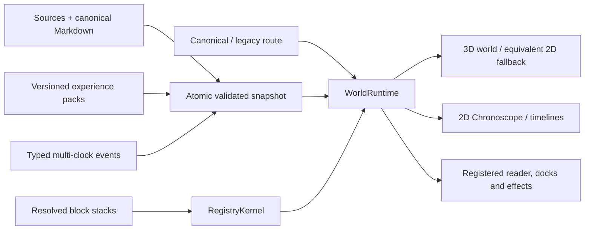

# Wiki Viva Kit (Living Wiki Kit)

A Markdown/Git-first **living operational wiki** with a deterministic Python core,
honesty gates in CI, and deep reading delegated to the AI agent that runs the
repo (Claude, Codex, Gemini or any other) — no LLM client embedded in the code.

Your wiki is one **navigable living world**, not a file tree or a collection of
dashboard islands. Every entity is a real page. The active center remains a
real page while registered views change geometry, lenses change semantic
projection and overlays encode one selected metric. Color follows the active
overlay through semantic tokens — it is not a permanent area/context hue.
Shape expresses kind, lines express typed relations and every motion/effect
must be backed by snapshot data and a declared purpose.



The bundled demo uses synthetic sample data — no account, no
tokens: `npm --prefix apps/wiki-cockpit install && npm --prefix
apps/wiki-cockpit run dev`, then open `http://localhost:5173/demo` — a title
screen offers **start from zero** (the genesis tutorial: found a world in an
empty void and watch the interface materialize block by block), the **full
world**, or complete **Study/Research** and **Personal Finance** pack
showcases.

The unified v8 runtime is currently a blocked release candidate, not a published
consumer release. See the
[v8 release note](docs/references/releases/wiki-viva-v8.md) for the exact
remaining gates and do not migrate a downstream repo until its public SHA is
pinned in the upgrade package.

## Registered views, one world

The native v8 views are **Quadrants**, **Radar**, **Sources**, **Work** and
**Timeline/Chronoscope**.
They preserve the same real center and keyed entity identities while changing
only registered geometry/encoding behavior. Chronoscope is a real 2D temporal
view over typed clocks; it never substitutes Git activity for semantic event
time. **Atlas**, **Focus**,
**Districts** and **Trails** remain compatibility views while their documented
questions migrate into the unified runtime; legacy links normalize with visible
warnings and canonical writers never emit deprecated route forms.

The URL carries shareable semantic state (`center`, `view`, `lens`, `overlay`,
optional real family group/page/reader/dock and `tray=packet|missions`). Hover, camera vectors, safe-area
rectangles and density tiers remain ephemeral/derived and do not pollute links.
Reader, dock and tray form one primary-surface slot; a hand-written conflict
normalizes with `dock > reader > tray` precedence. Back, refresh and share
therefore restore meaning rather than component-local state.

The interface lives **in** the world and is selected by the template block
stack through registered modules (see
[modular blocks](docs/references/guides/modular-blocks.md)). Components render
runtime selectors and dispatch typed interactions; they do not own transport,
route history or a parallel dock router. Empty-world founding, create, reader,
source, gates, work and fallback flows use the same interaction grammar.

The official language of this project is **English**. Generated pages and
artifacts (cockpit, ingestion proposals) are rendered in the language configured
in [wiki.config.yaml](wiki.config.yaml) (`language: en|pt`).

## What it does

- **Memory layer** in [memories/](memories/index.md): consolidated, auditable
  Markdown pages with frontmatter contracts (freshness, visibility, gate).
- **Root entity + input stage**: a configured top page defines the wiki's
  subject, integral perspective bundle, input channels, source configs and
  default target pages before ingestion starts.
- **Ingestion pipeline**: source → deterministic manifest → stable chunks →
  FTS index → secret pre-scan (blocks BEFORE persisting) → input-stage-aware
  LLM context package → normalized event → proposal that enters the human gate
  (GitHub PR).
- **Honesty gates in CI**: contract audit, methodology coverage, cockpit
  freshness, required LLM pass, freshness budget, quality/hierarchy telemetry,
  doc-code drift — all deterministic (zero model tokens).
- **Operational cockpit** ([memories/operations.md](memories/operations.md)):
  compiled daily, self-verifiable (`--check` fails if semantically stale).
- **Local web cockpit** ([apps/wiki-cockpit](apps/wiki-cockpit)): a Vite/React
  + Three.js interface over generated snapshot JSON and a localhost-only
  allowlisted operator API. Static/sample mode needs no GitHub token or cloud
  account; mutating workflows remain proposal/PR-oriented.
- **Temporal kernel + Chronoscope**: `temporal_graph.json` keeps occurrence,
  recording, validity, due, completion, verification, ingestion and
  supersession clocks distinct, with explicit precision, conflicts and
  provenance. The browser loads it lazily and integrity-checks it before use.
- **Experience-pack kit**: declarative, versioned packages add namespaced page
  types, templates, blocks, views, commands, operations, temporal profiles,
  EN/PT-BR copy and synthetic demos without patching or weakening the core.
  The first conformance pack is Study/Research; Personal Finance proves a
  denser, recurring-time vertical using public synthetic data.
- **Adaptive visual system**: a light `luminous-observatory` and dark
  `night-mission-control` theme plus focus, balanced and command density modes
  keep the same information grammar across desktop, mobile and fallback.
- **Hierarchical navigation**: root MOC -> context/domain hub -> typed
  relation/evidence pages, with `moc_parent` checked by the quality report.
- **OKF interoperability**: export the rich Wiki Viva memory tree as an Open
  Knowledge Format v0.1 bundle, check conformance, preview imports, and generate
  a local HTML viewer without changing the internal page contracts. The adapter
  follows Google's [Open Knowledge Format announcement](https://cloud.google.com/blog/products/data-analytics/how-the-open-knowledge-format-can-improve-data-sharing/)
  and the [knowledge-catalog reference project](https://github.com/GoogleCloudPlatform/knowledge-catalog).
- **Karma layer**: 8-dimension operational scoring as a by-product, append-only,
  no toxic leaderboard.

## The human gate, in-world

Approving, adding knowledge, creating pages, inspecting block stacks, source
sync, health checks and local Codex jobs are **registered surfaces inside the world**
(`?dock=approve|intake|gates|codex|work|source|create|blocks`) — deep-linkable
URL state, not separate pages. The gate shows changed **content pages first**
(title · area · state, per-file diffs on demand), repository code collapsed
into one crate, every honesty check with its real status and output, and a
one-click **"Fix with Codex"** brief when a check fails. The cockpit prepares;
GitHub decides.

## Quickstart

```sh
pip install -r requirements.txt

# 1. Configure your repo profile and root entity
$EDITOR wiki.config.yaml          # language, root_entity, contexts, gates
$EDITOR wiki.targets.yaml         # context -> pages/entities map
$EDITOR memories/system/wiki-viva-kit.md
python3 scripts/wiki_input_stage.py --write

# 2. Ingest a source end to end
python3 scripts/wiki_ingest.py --source path/to/source.md --context example

# 3. Run the gates (same ones CI runs)
python3 scripts/wiki_audit.py --check
python3 scripts/wiki_quality_report.py --check
python3 scripts/wiki_check_methodology_coverage.py --check
python3 scripts/wiki_operation_compile.py --check
python3 scripts/wiki_input_stage.py --check
python3 scripts/wiki_web_snapshot.py --check-contract
python3 scripts/wiki_pack.py validate --all
npm --prefix apps/wiki-cockpit run check:architecture
npm --prefix apps/wiki-cockpit run check:assets
npm --prefix apps/wiki-cockpit run check:bundle
npm --prefix apps/wiki-cockpit run check:release-matrix

# 4. Compile the daily cockpit
python3 scripts/wiki_operation_compile.py --write

# 5. Optional: exchange the wiki through Open Knowledge Format
python3 scripts/wiki_okf_export.py --out tmp/okf-bundle --clean
python3 scripts/wiki_okf_check.py --bundle tmp/okf-bundle --check
python3 scripts/wiki_okf_visualize.py --bundle tmp/okf-bundle
python3 scripts/wiki_okf_import.py --bundle tmp/okf-bundle --context system --dry-run

# 6. Optional: run the local web cockpit
python3 scripts/wiki_web_snapshot.py --out data/derived/wiki/web-snapshot --clean
python3 scripts/wiki_web_server.py --host 127.0.0.1 --port 8765
cd apps/wiki-cockpit && npm install && npm run dev:proxy
npm run check:snapshot-api
```

The local operator server serves snapshot JSON, allowlisted checks, source
pre-triage, the ingestion wizard and proposal-branch Git workflows. Mutating Git
and ingestion write steps are dry-run first in the UI and stay oriented around
`wiki/<topic>` branches plus draft PRs; hosted deployments are later adapters,
not a prerequisite for local operation.

For a real/private cockpit, `npm run dev` is not enough: start Vite with the API
proxy (`npm run dev:proxy`, equivalent to `WIKI_COCKPIT_PROXY_API=1 vite`) so
`/api/snapshot/pages.json` reaches the Python operator on `127.0.0.1:8765`.
The app blocks sample fallback outside `/demo`; `check:snapshot-api` must return
JSON before any visual validation is trusted.

The proxy is also the default browser trust boundary: the operator sends no
`Access-Control-Allow-Origin` header by default, and `dev:proxy` forwards its
same-origin requests without a browser `Origin`. Vite itself has CORS disabled
for both dev and preview, so an unrelated app on another loopback port cannot
read the proxy or a private preview snapshot. Only a deliberately trusted
direct browser client should opt in before starting the server, for example
`WIKI_COCKPIT_CORS_ORIGINS=http://127.0.0.1:5173 python3
scripts/wiki_web_server.py`. Entries are exact comma-separated `http(s)`
loopback origins. Wildcards, remote hosts, credentials, paths, queries and
fragments fail closed at startup. A configured origin can read the operator
nonce and submit mutations, so granting one is a security decision.
`GET /api/health` makes that boundary machine-readable as
`wiki_web_server.v6`, `operator_security_v2`, `cors_default_deny_v1` and
`wiki_operator_security.v2`. The cockpit refuses mutations against the older
v1 contract and asks the operator to be restarted; origin-less local clients
such as `curl` and the same-origin proxy remain supported.

The deep reading itself is performed by the agent that runs the repo: the
pipeline emits a `*-llm-context-request.json` package; the agent records results
back with `scripts/wiki_llm_context_pass.py --record-result` (provenance is
enforced). For batch/cheap processing, export pending requests with
`scripts/wiki_export_batch.py` (Anthropic Message Batches format, −50%).

## Downstream upgrades: certify once, adopt by delta

Upgrades use two proof lanes. Lane A certifies one immutable portable source
with its package, portable-tree, command-registry and toolchain digests. Lane B
freezes a consumer baseline, verifies a byte-equal C1 import, regenerates C2,
applies consumer-owned C3 adapters, selects gates from a versioned path/contract
impact registry and reaches a reversible real canary before the PR/human gate.

An adoption receipt can be reused only when all seven fields match exactly:
`source_sha`, `package_sha256`, `portable_tree_sha256`, `consumer_B0`,
`consumer_C3`, `command_registry_sha256` and `toolchain_sha256`. Secret/private
audit, public-evidence redaction, input stage, semantic inventory, adapter
identity, snapshot contract, real canary, diff and rollback/report verification
always rerun. Unknown path or contract impact selects the full matrix and Lane
A; it never guesses a fast path.

The normative contract, schemas, impact registry, resumable-runner behavior and
transition rule are in the
[two-lane downstream migration guide](docs/references/guides/downstream-migration-two-lane-strategy.md).
That guide's runner-acceptance section is authoritative: local contract tests
do not make a capsule or v3 receipt production-ready while a listed blocker is
open.
A migration already running under package schema v2 retains every declared
`migration.required_gates` entry as blocking. V3 does not rewrite its evidence
retroactively.

## Official documentation — the wiki documents itself

There is no separate doc site. The official documentation **is the living wiki
documenting itself** — same Markdown pages, same frontmatter contracts, same
honesty gates in CI. This is dogfooding: if the method works, the kit's own
documentation is the proof, and it goes stale the moment the gates say it does.

So the entry point is not a static manual — **open
[memories/index.md](memories/index.md) and you are already inside the living
wiki.** From there, the meta-wiki (under [memories/system/wiki/](memories/system/wiki/index.md))
is the context that explains how the wiki itself works:

| Page | Covers |
| --- | --- |
| [Default open-source process](docs/references/guides/default-open-source-process.md) | Complete default model: entities, ingestion, gates and PR flow |
| [Web cockpit deployment adapters](docs/references/guides/web-cockpit-deployment.md) | Runtime config plus Vercel read-only and GCP controlled-operator examples |
| [v8 runtime architecture](docs/references/guides/wiki-viva-v8-runtime-architecture.md) | World grammar, state/effects, registries, snapshot, budgets and security |
| [Temporal kernel](docs/references/guides/temporal-kernel.md) | Multi-clock event contract, precision, pagination, adapters and privacy |
| [Experience-pack authoring](docs/references/guides/experience-pack-authoring.md) | Pack schema, lifecycle, composition, gates and runtime boundary |
| [Pack showcase demos](docs/references/guides/experience-pack-showcase-demos.md) | Deterministic Study/Research and Personal Finance demo worlds |
| [Registry-first extensions](docs/references/guides/extending-the-kit.md) | Add blocks, sources, primitives, people, surfaces and interactions |
| [Two-lane downstream migration](docs/references/guides/downstream-migration-two-lane-strategy.md) | Certify a portable release once, adopt by consumer delta, canary and generated evidence |
| [v8 downstream upgrade](docs/references/guides/wiki-viva-v8-downstream-upgrade.md) | Inventory, preflight, allowlisted import, reports, waves and rollback |
| [v8 release candidate](docs/references/releases/wiki-viva-v8.md) | Version matrix, breaking changes, compatibility and current blockers |
| [Root entity](memories/system/wiki-viva-kit.md) | Semantic top page for this kit and its integral quadrants |
| [Input stage](memories/system/input-stage.md) | Generated catalog of root entity, channels, source configs and target pages |
| [Meta-wiki index](memories/system/wiki/index.md) | Map of all documentation |
| [Architecture](memories/system/wiki/architecture.md) | Principles and module map |
| [Daily operation](memories/system/wiki/daily-operation.md) | The daily loop |
| [Ingestion flow](memories/system/wiki/ingestion-flow.md) | Source → consolidation |
| [Gates & audit](memories/system/wiki/gates-and-audit.md) | The honesty gates |
| [Privacy](memories/system/wiki/privacy.md) | PII free in private; secrets always blocked |
| [Costs](memories/system/wiki/operation-costs.md) | Where money goes + levers |
| [Command reference](memories/system/wiki/command-reference.md) | Every `wiki_*` CLI (gated against drift) |

Agent-facing entry point: [AGENTS.md](AGENTS.md).

## Related projects and reference material

- **Open Knowledge Format (OKF)**: Wiki Viva v6.6+ targets OKF v0.1 as described
  in the Google Cloud [OKF article](https://cloud.google.com/blog/products/data-analytics/how-the-open-knowledge-format-can-improve-data-sharing/)
  and the [GoogleCloudPlatform/knowledge-catalog](https://github.com/GoogleCloudPlatform/knowledge-catalog)
  project. OKF is the exchange layer; Wiki Viva remains the richer operational
  memory model.
- **Reference pattern**: Andrej Karpathy's
  [LLM Wiki](https://gist.github.com/karpathy/442a6bf555914893e9891c11519de94f)
  article describes the persistent Markdown wiki pattern that inspired this
  toolkit's source -> synthesis -> schema workflow.

## Layout

The tree is **English by default**: `memories/` (the wiki, one hub per context),
`memories/system/ingestion/` (proposals, `events/`, `archive/`),
`docs/references/` (templates, references, snapshots), `data/raw/` and
`data/derived/wiki/` (gitignored caches). Every directory and file name is
configurable via `paths.*` in [wiki.config.yaml](wiki.config.yaml) — see
`WikiConfig` in [wiki_core/config.py](wiki_core/config.py) for the full key
list. Localized repos pin their own names there (e.g. a Portuguese repo sets
`paths: {memory_root: memorias}`); the code never hardcodes layout paths.

## Principles

1. **Determinism first** — everything that can be deterministic is (hashing,
   chunking, index, gates). Intelligence lives in the agent, not in the toolkit.
2. **Honesty gates that bite** — claims about freshness/coverage are verified in
   CI, not asserted in prose.
3. **Privacy by boundary** — personal data is welcome on private pages; access
   secrets are blocked everywhere; PII blocks at the public boundary
   (`--public-export`).
4. **Human gate** — memory changes ship via PR (`wiki/<topic>` branches),
   reviewed by the owner.
5. **Language by config** — code and docs in English; generated pages in the
   configured language.
6. **Root-driven operation** — setup starts by declaring the main entity and its
   integral perspectives; source channels inherit that context deterministically.
7. **Interop by adapter** — OKF is an exchange layer. The internal wiki keeps the
   richer `page_type`, perspective, privacy and PR-gate contracts.
8. **One runtime grammar** — real pages are entities; view, lens, overlay,
   region and surfaces remain registered projections/controls around a real
   center, with equivalent 3D and 2D fallback semantics.
9. **Time without invention** — occurrence, recording, validity and workflow
   clocks remain separate; missing time stays visibly missing.
10. **Extensions by contract** — packs compose through versioned namespaces,
    slots and immutable receipts; they never gain arbitrary execution or a way
    around privacy, secret, asset or human-review gates.

## License & contributing

**MIT** — free for any use, modification and redistribution; see
[LICENSE](LICENSE). Contributions are welcome under the same terms: see
[CONTRIBUTING.md](CONTRIBUTING.md). Personal-context-free by design — this
branch carries no personal data and its git history is clean (orphan).
