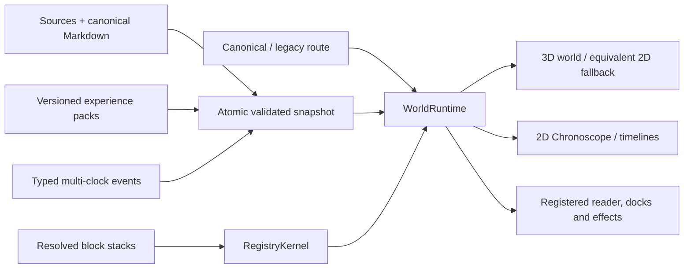

# Wiki Viva Kit (Living Wiki Kit)

A Markdown/Git-first **living operational wiki** with a deterministic Python core,
honesty gates in CI, and deep reading delegated to the AI agent that runs the
repo (Claude, Codex, Gemini or any other) — no LLM client embedded in the code.

Your wiki is one **navigable living world**, not a file tree or a collection of
dashboard islands. Every entity is a real page. The active center remains a
real page while registered views change geometry, lenses change semantic
projection and overlays encode one selected metric. Color follows the active
overlay through semantic tokens — it is not a permanent area/context hue.
Shape expresses kind, lines express typed relations and every motion/effect
must be backed by snapshot data and a declared purpose.



The bundled demo uses synthetic sample data — no account, no
tokens: `npm --prefix apps/wiki-cockpit install && npm --prefix
apps/wiki-cockpit run dev`, then open `http://localhost:5173/demo` — a title
screen offers **start from zero** (the genesis tutorial: found a world in an
empty void and watch the interface materialize block by block), the **full
world**, or complete **Study/Research** and **Personal Finance** pack
showcases.

That direct npm command is an interactive development surface. Release-bearing
builds and gates use `python3 scripts/wiki_node_workspace.py run <script>`: the
wrapper reads the tracked platform-neutral policy, materializes a clean C1 only
with the external Lane A authority and its separately trusted digest, executes
allowlisted scripts/arguments, checks post-command drift and emits path-free
receipts. A consumer never captures a replacement authority.

The unified v8 runtime is not a published consumer release. Rc26 is frozen
failed-certification evidence, rc27 is frozen failed-validation evidence,
rc28/rc29 were rejected before validation, and rc30 was rejected before its
complete matrix after real-data visual QA exposed ambiguous repeated
root-quadrant group labels. The first exact rc31 validation passed 1,740
Python and 517 frontend checks, then
failed closed on stale deterministic operational-pass output before browser;
rc31 is now immutable failed-validation evidence. Rc32 exact source
`ed073dee5fbf05343b36db1fdc061a24d0220cb9` then stopped in its first full
Python validation with 2 contract failures after 1,744 passes and 3 skips;
frontend and browser were not started. Rc32 is immutable failed-validation
evidence. Rc33 exact source
`539eb19b958a4159eecb2c5a7afd6ceaabcbb086` passed Python, frontend, Node and
all applicable static gates, then stopped fail-closed at 98/102 in its first
strict browser matrix. It is immutable failed-validation evidence with no
candidate, capsule or adoption authority. Rc34 exact source
`533d286869c478bd157b066d7882388b99fde2f7` passed its wholly new exact
validation at metadata subject `2afd435c7cc955ae7a922b1d46eac355472ca0e6`:
1,746 Python checks with 3 declared skips in 1,113.61 seconds, 518 frontend and
115 Node checks, every applicable static gate, and first/only strict browser
run `public-mrlafqnv-689884b2-50ea-4a30-bb21-9eb2c776f861` at 102/102 with no
failure, skip, retry or flaky cell in 6.5 minutes. Its separately reviewed
local-QA candidate metadata subject was
`59be853af5416ce84c4ca89e7272bb64eb909b2b`, but read-only downstream QA
exposed RT-170 before any productive capture or certification attempt. Rc34 is
immutable `historical_precapture_rejected`; no visual manifest, certification,
capsule, receipt, trust anchor or Lane B authority exists. Rc35 exact source
`52491dfd6c3a81f0356fb64a9e01e41dd71e07a0` passed its wholly new exact
validation at metadata subject `55910c379b64060451fb8fb93eb85d47b9245122`:
1,754 Python checks with 3 declared skips in 1,271.55 seconds, 518 frontend and
115 Node checks, every applicable static gate, and first/only strict browser
run `public-mrlderie-ab48db4f-1355-47e9-bdc2-69f96f4bda85` at 102/102 with no
failure, skip, retry or flaky cell in 386.565 seconds. Its separately reviewed
but uncommitted local-QA candidate package-file/canonical/tree identities were
`3cea5015b2be7bfc34b951553c5d2ab0a4d45098f6360699b5a66c36d929e636` /
`e7a3c44876ed8265db0123cce6cfd23ce8cb9d1d6579a4fb89ba27ea29eef0e8` /
`1c8e6f696ce705a3a5be04633051d793785bea9a2933b6f103c236c401d0255c`,
521 entries; no candidate metadata subject was committed. Pre-capture static
contract review plus focused public synthetic tests then exposed RT-171:
capture record v1 did not bind the rendered view/runtime, and canary summary v1
used positional routes without exact native route, view, runtime or
`canary_viewport` authority. Rc35 is immutable
`historical_precapture_rejected`. Its exact validation remains historical
evidence, but no capture directory, visual manifest, capsule, receipt,
attestation, downstream plan, import or Lane B authority was created.

Rc36 exact source `8f96e1fd58258df64174229d81ee6a330ba9d2b1` passed its first
and only complete exact validation at metadata subject
`3db3f9f43c8e73fe583b93fba4ea6b9f63bdc5bd`: 23/23 recorded gates, 1,782
Python checks with 3 declared skips in 1,082.23 seconds, 518 frontend checks,
123 Node checks and browser run
`public-mrlis0t7-bfd938c4-5799-4c19-b7b0-e7df20d75651` at 102/102. These
exact-validation receipts remain historical evidence. Their validation result /
toolchain / runner-payload identities are `5585819e...` / `6728f464...` /
`03a75c40...`; their validation-subject package-file / canonical-package /
portable-tree identities are `47c3dc7d...` / `81a3b600...` / `53ffdf8b...`.
The corrected candidate package-file / canonical-package / portable-tree
identities are `8343066a...` / `8ee7e597...` / `4dc31eff...`. Candidate
metadata subject `ac0f49afe28a5bf84003b58c537ac1727dab7008` produced manifest
`6199d1001ba98c2c772323069765ddc695cc8971f6d7e03390e496de64551808`,
then its first/only Lane A run failed closed at 101/102 browser cells. After a
desktop dense-stress drill-down and back, a visible target was not the hit-test
owner at its center because camera settlement lagged the released spatial cue.
The certification stream / browser gate log / browser run result / Playwright
report identities are `a95d70853be927ad29a6e98e619f62faad1dffa3dfc60f11299ca803f2e8f545` /
`2d5405db94d8ba9af0d72d3cad564205d5af660513be29c1f7953cf746e77256` /
`2b1c678a7e3bd46d7dc1a27c0e8cbf9a21269c781b8cb1b4bd17fc3bcd1ffa33` /
`bb69c7acb697bbd33619765f30b6dc32851ef16c3675c5f4eaac1c7a29601c05`.
Rc36 is immutable `historical_certification_failed`: no capsule, receipt,
attestation, trust anchor, downstream plan, import, adoption or Lane B
authority exists, and the subject is never retried, reused, relabeled,
promoted or imported.

RT-172 forms a sequence-bound successor: spatial readiness waits for matching
morph and camera acknowledgements, rejects stale callbacks and only then
crosses the compositor barrier. Exact source
`d87af15b4aa850d1a50dc867f74e07ba09d0e89f` passed rc37's first and only
complete validation at metadata `775fe5bc9437da5ec9311704731f4342d515fc16`:
23/23 gates in 1,652 seconds, including 1,782 Python passes plus 3 declared
skips, 522 frontend passes, 123 Node passes and browser 102/102 first-attempt
with no skip or retry. `wiki-viva-v8-rc37` / `candidate` had candidate
package-file / canonical-package / portable-tree identities `6d409da4...` /
`1af897ce...` / `77799ece...` (521 entries), with `package_is_pinned=true`.
Its first productive capture, Lane A 11/11 and independent capsule verifier
then passed once. Manifest `3be7599a...` and capsule/receipt/attestation
`f5ae8e04...` / `90cd0c27...` / `c7a1a4fe...` remain immutable historical
evidence. RT-173 was exposed only when a disposable clean C1 had no
`node_modules` and no sealed authority capable of materializing them; the Node
C2 generator could not resolve TypeScript until a manual `npm ci`. Preserve
rc37's receipts, but do not use them as executable Lane B authority. Rc38 then
failed its one exact matrix at `operational_pass`; validation result
`7441b7ef...` and both stable Git subjects remain immutable failed-validation
evidence. Rc39 then passed 14/15 in its only exact matrix before the default
Vitest result cache changed the sealed dependency tree; result `a9aaad50...`
and both stable Git subjects remain immutable chronology under
`WAIVER-CLASS-B-RC39`, a non-invalidating cache/harness waiver. The next direct
correction was
`wiki-viva-v8-rc40`, pinned to exact source
`0e24881aff89f3ae0624fa3e5d27d600248e37a3` and validation metadata
`1bfcfe3f72e54ea8d592554a625d8f3ff606c088`. Its only exact matrix stopped
at `portable_python`: `1942 passed, 3 skipped, 1 failed` after the dependency-
wave adoption finished all 12 gates but the final receipt verifier exceeded
180 seconds while rereading 115 C1 paths through 358 bounded Git processes.
Validation-result / identity / log are `4e6035d9...` / `c711fa41...` /
`547c004d...`; Git subjects stayed stable. `WAIVER-CLASS-B-RC40` classifies the
outer-bound timeout as non-invalidating performance/harness evidence. Rc40 is
immutable chronology and is not retried. Its one direct corrective successor
is now separately pinned as
`wiki-viva-v8-rc41` / `validation_pending` at exact source
`f42b624049e310100218bf4f99e3ea418b066689`; the complete focused component
passed 181/181 in 2161.24 seconds. Package-file/canonical/tree are
`2908e9e8...` / `9eee2d18...` / `0b7063d0...` (528 entries). The single live
scoreboard is `1/5`: exact
validation is pending; capsule, private canary and private-main readback are
blocked.
Draft PR #61 remains stale and public push/publication remains unauthorized.
Private PR #211 remains historical v2; only a fresh rc41/v3 adoption may start
after the new capsule and attestation verify fail-closed.
The rc41 apparatus is frozen under `RT-174-DEFERRED-APPARATUS`: no edits to
`wiki_upgrade.py`, `upgrade_lanes.py` or lane tests before private-main
readback. Rc41 is the last subject and receives one exact run; Class B is
waived with evidence, while only Class A identity/privacy/secret/data-corruption
evidence may invalidate it and permit one fix plus one rerun.
See the [v8 release note](docs/references/releases/wiki-viva-v8.md)
for the exact remaining gates. An exact `source_sha` alone is not adoption
authority. Do not start downstream adoption until the Lane A capsule and
external attestation verify fail-closed and the applicable consumer human gate
is satisfied. Standing private approval satisfies only the private consumer
gate after technical green; public promotion remains separate and unauthorized.

## Registered views, one world

The native v8 views are **Quadrants**, **Radar**, **Sources**, **Work** and
**Timeline/Chronoscope**.
They preserve the same real center and keyed entity identities while changing
only registered geometry/encoding behavior. Chronoscope is a real 2D temporal
view over typed clocks; it never substitutes Git activity for semantic event
time. **Atlas**, **Focus**,
**Districts** and **Trails** remain compatibility views while their documented
questions migrate into the unified runtime; legacy links normalize with visible
warnings and canonical writers never emit deprecated route forms.

The URL carries shareable semantic state (`center`, `view`, `lens`, `overlay`,
optional real family group/page/reader/dock and `tray=packet|missions`). Hover, camera vectors, safe-area
rectangles and density tiers remain ephemeral/derived and do not pollute links.
Reader, dock and tray form one primary-surface slot; a hand-written conflict
normalizes with `dock > reader > tray` precedence. Back, refresh and share
therefore restore meaning rather than component-local state.

The interface lives **in** the world and is selected by the template block
stack through registered modules (see
[modular blocks](docs/references/guides/modular-blocks.md)). Components render
runtime selectors and dispatch typed interactions; they do not own transport,
route history or a parallel dock router. Empty-world founding, create, reader,
source, gates, work and fallback flows use the same interaction grammar.

The official language of this project is **English**. Generated pages and
artifacts (cockpit, ingestion proposals) are rendered in the language configured
in [wiki.config.yaml](wiki.config.yaml) (`language: en|pt`).

## What it does

- **Memory layer** in [memories/](memories/index.md): consolidated, auditable
  Markdown pages with frontmatter contracts (freshness, visibility, gate).
- **Root entity + input stage**: a configured top page defines the wiki's
  subject, integral perspective bundle, input channels, source configs and
  default target pages before ingestion starts.
- **Ingestion pipeline**: source → deterministic manifest → stable chunks →
  FTS index → secret pre-scan (blocks BEFORE persisting) → input-stage-aware
  LLM context package → normalized event → proposal that enters the human gate
  (GitHub PR).
- **Honesty gates in CI**: contract audit, methodology coverage, cockpit
  freshness, required LLM pass, freshness budget, quality/hierarchy telemetry,
  doc-code drift — all deterministic (zero model tokens).
- **Operational cockpit** ([memories/operations.md](memories/operations.md)):
  compiled daily, self-verifiable (`--check` fails if semantically stale).
- **Local web cockpit** ([apps/wiki-cockpit](apps/wiki-cockpit)): a Vite/React
  + Three.js interface over generated snapshot JSON and a localhost-only
  allowlisted operator API. Static/sample mode needs no GitHub token or cloud
  account; mutating workflows remain proposal/PR-oriented.
- **Temporal kernel + Chronoscope**: `temporal_graph.json` keeps occurrence,
  recording, validity, due, completion, verification, ingestion and
  supersession clocks distinct, with explicit precision, conflicts and
  provenance. The browser loads it lazily and integrity-checks it before use.
- **Experience-pack kit**: declarative, versioned packages add namespaced page
  types, templates, blocks, views, commands, operations, temporal profiles,
  EN/PT-BR copy and synthetic demos without patching or weakening the core.
  The first conformance pack is Study/Research; Personal Finance proves a
  denser, recurring-time vertical using public synthetic data.
- **Adaptive visual system**: a light `luminous-observatory` and dark
  `night-mission-control` theme plus focus, balanced and command density modes
  keep the same information grammar across desktop, mobile and fallback.
- **Hierarchical navigation**: root MOC -> context/domain hub -> typed
  relation/evidence pages, with `moc_parent` checked by the quality report.
- **OKF interoperability**: export the rich Wiki Viva memory tree as an Open
  Knowledge Format v0.1 bundle, check conformance, preview imports, and generate
  a local HTML viewer without changing the internal page contracts. The adapter
  follows Google's [Open Knowledge Format announcement](https://cloud.google.com/blog/products/data-analytics/how-the-open-knowledge-format-can-improve-data-sharing/)
  and the [knowledge-catalog reference project](https://github.com/GoogleCloudPlatform/knowledge-catalog).
- **Karma layer**: 8-dimension operational scoring as a by-product, append-only,
  no toxic leaderboard.

## The human gate, in-world

Approving, adding knowledge, creating pages, inspecting block stacks, source
sync, health checks and local Codex jobs are **registered surfaces inside the world**
(`?dock=approve|intake|gates|codex|work|source|create|blocks`) — deep-linkable
URL state, not separate pages. The gate shows changed **content pages first**
(title · area · state, per-file diffs on demand), repository code collapsed
into one crate, every honesty check with its real status and output, and a
one-click **"Fix with Codex"** brief when a check fails. The cockpit prepares;
GitHub decides.

## Quickstart

```sh
pip install -r requirements.txt

# 1. Configure your repo profile and root entity
$EDITOR wiki.config.yaml          # language, root_entity, contexts, gates
$EDITOR wiki.targets.yaml         # context -> pages/entities map
$EDITOR memories/system/wiki-viva-kit.md
python3 scripts/wiki_input_stage.py --write

# 2. Ingest a source end to end
python3 scripts/wiki_ingest.py --source path/to/source.md --context example

# 3. Run the gates (same ones CI runs)
python3 scripts/wiki_audit.py --check
python3 scripts/wiki_quality_report.py --check
python3 scripts/wiki_check_methodology_coverage.py --check
python3 scripts/wiki_operation_compile.py --check
python3 scripts/wiki_input_stage.py --check
python3 scripts/wiki_web_snapshot.py --check-contract
python3 scripts/wiki_pack.py validate --all
python3 scripts/wiki_node_workspace.py run check:architecture
python3 scripts/wiki_node_workspace.py run check:assets
python3 scripts/wiki_node_workspace.py run check:bundle
python3 scripts/wiki_node_workspace.py run check:release-matrix

# 4. Compile the daily cockpit
python3 scripts/wiki_operation_compile.py --write

# 5. Optional: exchange the wiki through Open Knowledge Format
python3 scripts/wiki_okf_export.py --out tmp/okf-bundle --clean
python3 scripts/wiki_okf_check.py --bundle tmp/okf-bundle --check
python3 scripts/wiki_okf_visualize.py --bundle tmp/okf-bundle
python3 scripts/wiki_okf_import.py --bundle tmp/okf-bundle --context system --dry-run

# 6. Optional: run the local web cockpit
python3 scripts/wiki_web_snapshot.py --out data/derived/wiki/web-snapshot --clean
python3 scripts/wiki_web_server.py --host 127.0.0.1 --port 8765
cd apps/wiki-cockpit && npm install && npm run dev:proxy
npm run check:snapshot-api
```

The local operator server serves snapshot JSON, allowlisted checks, source
pre-triage, the ingestion wizard and proposal-branch Git workflows. Mutating Git
and ingestion write steps are dry-run first in the UI and stay oriented around
`wiki/<topic>` branches plus draft PRs; hosted deployments are later adapters,
not a prerequisite for local operation.

For a real/private cockpit, `npm run dev` is not enough: start Vite with the API
proxy (`npm run dev:proxy`, equivalent to `WIKI_COCKPIT_PROXY_API=1 vite`) so
`/api/snapshot/pages.json` reaches the Python operator on `127.0.0.1:8765`.
The app blocks sample fallback outside `/demo`; `check:snapshot-api` must return
JSON before any visual validation is trusted.

The proxy is also the default browser trust boundary: the operator sends no
`Access-Control-Allow-Origin` header by default, and `dev:proxy` forwards its
same-origin requests without a browser `Origin`. Vite itself has CORS disabled
for both dev and preview, so an unrelated app on another loopback port cannot
read the proxy or a private preview snapshot. Only a deliberately trusted
direct browser client should opt in before starting the server, for example
`WIKI_COCKPIT_CORS_ORIGINS=http://127.0.0.1:5173 python3
scripts/wiki_web_server.py`. Entries are exact comma-separated `http(s)`
loopback origins. Wildcards, remote hosts, credentials, paths, queries and
fragments fail closed at startup. A configured origin can read the operator
nonce and submit mutations, so granting one is a security decision.
`GET /api/health` makes that boundary machine-readable as
`wiki_web_server.v6`, `operator_security_v2`, `cors_default_deny_v1` and
`wiki_operator_security.v2`. The cockpit refuses mutations against the older
v1 contract and asks the operator to be restarted; origin-less local clients
such as `curl` and the same-origin proxy remain supported.

The deep reading itself is performed by the agent that runs the repo: the
pipeline emits a `*-llm-context-request.json` package; the agent records results
back with `scripts/wiki_llm_context_pass.py --record-result` (provenance is
enforced). For batch/cheap processing, export pending requests with
`scripts/wiki_export_batch.py` (Anthropic Message Batches format, −50%).

## Downstream upgrades: certify once, adopt by delta

Upgrades use two proof lanes. Lane A certifies one immutable portable source
with its package, portable-tree, command-registry and toolchain digests. Lane B
freezes a consumer baseline, verifies a byte-equal C1 import, regenerates C2,
applies consumer-owned C3 adapters, selects gates from a versioned path/contract
impact registry and reaches a reversible real canary before the PR/human gate.
Portable `.skills/wiki-*/**` remain byte-equal C1, while downstream `AGENTS.md`,
the consumer's `.skills/README.md` and non-`wiki-*` repo-local skills are
explicit consumer-owned C3 routing.
Consumer base and `.local` page-type/template registries are also C3 merge
surfaces. Localized technical pages use a separate fail-closed authority derived
only from the committed `consumer_B0:wiki.config.yaml` blob: the exact
`command_reference_page`, exact `operational_pass_page`, and inert Markdown
`release_records` below the configured `references_root/releases/**` subtree.
The worktree and C1/C2/C3 cannot widen this three-role authority. Each artifact
is a regular UTF-8 `.md` blob with mode `100644`, secret-clean and C3-only;
executable, binary, non-Markdown or C1/C2 placement is rejected. Its digest is
bound to plan, state, receipt and report.
B0->C1->C2->C3 must be three direct single-parent edges with no
intermediate or merge commit.
The runner identity includes a byte/mode digest of its Python and schema
closure, and the toolchain probe must run through the same interpreter that is
executing the runner. Every Python alias in the command registry must resolve
to that probed interpreter; an ambient PATH resolution to another Python fails
certification closed. `plan` creates one first-write acceptance-clock anchor per
exact attempt; `adopt` requires the SHA-256 captured out of band from that plan
and never recreates a missing anchor. The real canary creates a second
first-write completion anchor over its canonical result projection; every
post-canary resume requires that separately captured digest. Receipt and state
also bind B0/C1/C2/C3, whose three direct edges, changed paths, modes and blobs
are recomputed from Git; symlinks, submodules and special entries are rejected.
Public evidence is scanned literally and through bounded repeated
percent-decoding so encoded private routes or host paths cannot escape.

Cockpit commands in the release registry run only through
`wiki_node_workspace.py`. The tracked
`apps/wiki-cockpit/node-workspace.lock.json` is
`wiki_viva_node_workspace_policy.v2`: it binds package/lock hashes, the package
manager, allowed scripts/arguments and the fixed install policy, while omitting
host paths, platform, installed Node/npm and `node_modules` identity. Lane A
alone runs `capture-authority` from an exact clean source. It forces the fixed
install and writes `wiki_viva_node_workspace_authority.v1` outside Git with the
policy/source, platform, resolved Node/npm and complete dependency-tree summary.
The wrapper consumes that path-free authority and its trusted digest,
materializes clean C1, rechecks authority after every command and returns a
canonical receipt without host-local paths. A different platform/toolchain must
certify a new capsule; a consumer may not capture or reuse a substitute.

New Lane A certification seals `wiki_viva_upgrade_release_capsule.v2` and a
five-entry `wiki_viva_toolchain_probe.v2` in canonical order: `browser`, `node`,
`npm`, `python`, `runner`. Capsule v1 remains verifiable as immutable
historical evidence but is never rewritten into v2.

The seven fields below are the exact identity required to validate a Lane B
receipt or resume an unfinished run:
`source_sha`, `package_sha256`, `portable_tree_sha256`, `consumer_B0`,
`consumer_C3`, `command_registry_sha256` and `toolchain_sha256`. Secret/private
audit, public-evidence redaction, input stage, semantic inventory, adapter
identity, snapshot contract, real canary, diff and rollback/report verification
always rerun in a new attempt. A completed adoption receipt is immutable
historical evidence for its original PR/human gate, never authorization to
replay promotion or call `--resume` again. Unknown path or contract impact
selects the full matrix and Lane A; it never guesses a fast path. Selection is
canonical: package-required promotion gates and their dependencies cannot be
removed by caller-supplied input.
The external acceptance anchor binds the canonical digest of the complete
preflight object. On every resume with a materialized execution plan, C2 is
replayed from C1 in a disposable clone and must match the complete committed
path set, Git modes and blob digests before any cached gate result is reusable.
Lane A creates its visual authority with `wiki_visual_evidence.py capture` on
the exact clean source, covering every package visual profile with strict PNG
and record-backed source/toolchain/console/network proof. `verify-capsule` then
reopens the sealed authority with the out-of-band attestation SHA-256 before
Lane B may plan; successful gate logs containing host-local paths are rejected.
The v2 visual contract validated during rc36 uses
`wiki_visual_evidence_capture.v2` for Lane A and
`wiki_viva_canary_visual_summary.v2` for Lane B. Each profile binds its
canonical native route, observed view, v8 runtime and exact capture/canary
viewport; stale v1 or coherently resealed mismatches fail closed. Rc36's failed
certification does not authorize reuse: its RT-172 successor must prove the
same contract again from its new immutable source.

The normative contract, schemas, impact registry, resumable-runner behavior and
transition rule are in the
[two-lane downstream migration guide](docs/references/guides/downstream-migration-two-lane-strategy.md).
That guide's runner-acceptance section is authoritative: local contract tests
do not make a capsule or v3 receipt production-ready while a listed blocker is
open.
A migration already running under package schema v2 retains every declared
`migration.required_gates` entry as blocking. V3 does not rewrite its evidence
retroactively. Rc21 is retained as historical non-promotional local evidence
because downstream rehearsal exposed the missing config-bound authority and an
over-broad release-record surface. Rc22 corrected that trust boundary and
passed its pre-capture local stack, but the first productive Chromium capture
stopped fail-closed when its legacy mobile route normalized to Quadrants rather
than Timeline. No rc22 visual manifest, capsule, attestation or Lane B
authority was minted; the subject must not be retried, relabeled, promoted or
imported. Rc23 corrected the native routes, but its first complete validation
stopped fail-closed because one synthetic CLI authority helper still fabricated
the legacy desktop route. No candidate, manifest, capsule or adoption authority
existed; rc23 is not retried or relabeled. Rc24 exact source
`39d490231c00cbc0cf0374c6b1dd3d16f23a2406` passed exact validation, a
first-attempt four-profile productive capture and 102/102 Lane A browser cells,
but certification stopped fail-closed when `demo_drift` and `portable_python`
used ambient `python3` instead of the probed Python 3.12.4 interpreter. No
capsule, receipt, trust or adoption authority was minted; rc24 is immutable
`historical_certification_failed` and must never be retried, reused, relabeled
or imported. Rc25 exact source
`c741e3d0ad409ac9baea8b136e3819952bb0657b` then failed its first complete
validation with 1,708 passed, 3 skips and 5 public synthetic contract failures;
the strict browser matrix was not started and no candidate, capture or capsule
exists. Rc25 is immutable `historical_validation_failed`. Rc26 exact source
`da3a9a0495db974e409f5af6413401c31851e071` passed 1,728 Python, 516
frontend, 115 Node, the static stack, 102/102 strict browser, its first
four-profile productive capture and all six Lane A commands. Certification
still failed closed before attestation because the successful Python warning
summary exposed a host-local interpreter-library path. Rc26 is immutable
`historical_certification_failed`; no capsule, receipt, attestation, trust or
Lane B authority exists. Rc27 exact source
`ba7ee19457436993edc7ff8a838b34c5b864fd98` then failed its first complete
warnings-as-errors validation with 46 public synthetic resource-lifecycle
failures after 1,693 passes and 3 skips; browser and later stages were not
started. Rc27 is immutable `historical_validation_failed`. Rc28 source
`31cad3bc8aa9cf45d4842103307baff678ddeeb7` was rejected before validation
because its portable transition guides were stale. Rc29 source
`905e377220a409bee6e1977d3c0e6262bdc27914` was also rejected before
validation because one portable skill remained state-stale and public fixtures
retained private-lineage labels. Rc30 source
`bc44255b22d65b8c9869ec45759afd4dac1355b9` was pinned only for validation,
then downstream real-data visual QA found four distinct root-quadrant family
controls with the same visible and accessible label. Rc30 was rejected before
its complete matrix; no candidate, capture, capsule or adoption authority
exists. Rc31 exact source
`6fa9b907d5dfc748e94d182ac3704b226142552e` passed 1,740 Python and 517
frontend checks, then failed operational-pass freshness before browser. Rc31
is immutable failed-validation evidence. Rc32 exact source
`ed073dee5fbf05343b36db1fdc061a24d0220cb9` closed that fixed-point defect but
failed its first full Python validation on two stale truth-contract
expectations. Rc32 is immutable failed-validation evidence. Rc33 exact source
`539eb19b958a4159eecb2c5a7afd6ceaabcbb086` passed 1,746 Python checks with 3
declared skips, all 517 frontend and 115 Node checks, and every applicable
static gate, then its first strict browser matrix stopped at 98/102 with four
failures in 330.49 seconds: three focus-scope accessible-name/breadcrumb
regressions and one short-phone pointer collision. The extra adapter-manifest
diagnostic appended outside the Lane A registry was
`inapplicable_gate/orchestration_invalid`, not an rc33 source failure. Rc33 is
immutable failed-validation evidence; no candidate, capture, capsule or Lane B
authority exists. Rc34 exact source
`533d286869c478bd157b066d7882388b99fde2f7` passed 1,746 Python checks with 3
declared skips in 1,113.61 seconds, all 518 frontend and 115 Node checks, every
applicable static gate, and its first/only strict browser run
`public-mrlafqnv-689884b2-50ea-4a30-bb21-9eb2c776f861` at 102/102 with no
failure, skip, retry or flaky cell in 6.5 minutes at validation subject
`2afd435c7cc955ae7a922b1d46eac355472ca0e6`. Its separately reviewed local-QA
candidate metadata subject was `59be853af5416ce84c4ca89e7272bb64eb909b2b`.
Read-only downstream QA then found RT-170 before productive capture: B0 relied
on C1-only toolkit commands/equality, expected pre-C1 drift was not treated as
prospective import inventory, domain repair could enter C3, and the evidence
root was not derived from the exact plan-path parent. Rc34 is immutable
`historical_precapture_rejected`; no productive capture, visual manifest,
certification, capsule, receipt, trust anchor or Lane B authority exists.
Rc35 exact source `52491dfd6c3a81f0356fb64a9e01e41dd71e07a0` then passed its
wholly new exact validation at metadata subject
`55910c379b64060451fb8fb93eb85d47b9245122`: 1,754 Python with 3 declared
skips, 518 frontend, 115 Node, every applicable static gate and first/only
browser 102/102. Its reviewed but uncommitted candidate identities were
`3cea5015...` / `e7a3c448...` / `1c8e6f69...`, 521 entries. RT-171 rejected
that boundary before capture because record v1 and canary summary v1 did not
bind the exact native view/runtime/canary viewport contract. Rc35 is immutable
`historical_precapture_rejected`; no capture directory, visual manifest,
capsule, receipt or Lane B authority exists.

Rc36 exact source `8f96e1fd58258df64174229d81ee6a330ba9d2b1` and metadata
subject `3db3f9f4...` retain their valid 23/23 exact-validation receipts. The
corrected candidate metadata subject `ac0f49af...` and manifest `6199d100...`
then reached its first/only Lane A run, where the strict browser matrix stopped
at 101/102 on the RT-172 camera/spatial settlement race. Stream `a95d7085...`,
browser gate log `2d5405db...`, browser run result `2b1c678a...` and Playwright
report `bb69c7ac...` preserve that failure. Rc36 is immutable
`historical_certification_failed`; it minted no capsule, receipt, attestation,
trust anchor or Lane B authority and is never retried or reused. The prior
`7f1c859d...` metadata boundary and capture `e314296c...` remain separately
rejected and non-reusable.

Historical rc37 was `wiki-viva-v8-rc37` / `candidate`, pinned to exact source
`d87af15b4aa850d1a50dc867f74e07ba09d0e89f`. Its first/only complete exact
validation passed 23/23 at metadata `775fe5bc...`, including browser 102/102
first-attempt; validation-result/identity are `e409a148...` / `68d11b2a...`.
Candidate package/tree are `1af897ce...` / `77799ece...`, 521 entries, with
`package_is_pinned=true`. Its productive manifest `3be7599a...`, Lane A 11/11
and capsule/receipt/attestation `f5ae8e04...` / `90cd0c27...` /
`c7a1a4fe...` remain immutable and verifiable for rc37. RT-173 subsequently
proved that those bytes could not materialize the missing clean-C1 dependency
tree, so they are history rather than executable adoption authority. Draft PR
#61 is stale and public push remains unauthorized. Rc38 failed exact validation
at `operational_pass`; rc39 passed 14/15 before default Vitest cache output
correctly tripped the sealed dependency tree. Both remain immutable history.
Rc40 then failed its only exact matrix at `portable_python` because the final
Git receipt verifier's path-by-path process audit exceeded the bounded test
runtime; result `4e6035d9...` and stable subjects remain immutable history. The
one current corrective successor is rc41 at source `f42b6240...`; its single
scoreboard is `1/5`, and no fresh v3 adoption starts before its capsule verifies
fail-closed.
Private PR #211 remains historical v2.
Standing private-main approval is downstream-only and
never weakens technical gates or the generic public PR/human gate.
No existing v2 C3 or receipt is amended to reach it.

## Official documentation — the wiki documents itself

There is no separate doc site. The official documentation **is the living wiki
documenting itself** — same Markdown pages, same frontmatter contracts, same
honesty gates in CI. This is dogfooding: if the method works, the kit's own
documentation is the proof, and it goes stale the moment the gates say it does.

So the entry point is not a static manual — **open
[memories/index.md](memories/index.md) and you are already inside the living
wiki.** From there, the meta-wiki (under [memories/system/wiki/](memories/system/wiki/index.md))
is the context that explains how the wiki itself works:

| Page | Covers |
| --- | --- |
| [Default open-source process](docs/references/guides/default-open-source-process.md) | Complete default model: entities, ingestion, gates and PR flow |
| [Web cockpit deployment adapters](docs/references/guides/web-cockpit-deployment.md) | Runtime config plus Vercel read-only and GCP controlled-operator examples |
| [v8 runtime architecture](docs/references/guides/wiki-viva-v8-runtime-architecture.md) | World grammar, state/effects, registries, snapshot, budgets and security |
| [Temporal kernel](docs/references/guides/temporal-kernel.md) | Multi-clock event contract, precision, pagination, adapters and privacy |
| [Experience-pack authoring](docs/references/guides/experience-pack-authoring.md) | Pack schema, lifecycle, composition, gates and runtime boundary |
| [Pack showcase demos](docs/references/guides/experience-pack-showcase-demos.md) | Deterministic Study/Research and Personal Finance demo worlds |
| [Registry-first extensions](docs/references/guides/extending-the-kit.md) | Add blocks, sources, primitives, people, surfaces and interactions |
| [Two-lane downstream migration](docs/references/guides/downstream-migration-two-lane-strategy.md) | Certify a portable release once, adopt by consumer delta, canary and generated evidence |
| [v8 downstream upgrade](docs/references/guides/wiki-viva-v8-downstream-upgrade.md) | Inventory, preflight, allowlisted import, reports, waves and rollback |
| [v8 release status](docs/references/releases/wiki-viva-v8.md) | Version matrix, breaking changes, compatibility and current blockers |
| [Root entity](memories/system/wiki-viva-kit.md) | Semantic top page for this kit and its integral quadrants |
| [Input stage](memories/system/input-stage.md) | Generated catalog of root entity, channels, source configs and target pages |
| [Meta-wiki index](memories/system/wiki/index.md) | Map of all documentation |
| [Architecture](memories/system/wiki/architecture.md) | Principles and module map |
| [Daily operation](memories/system/wiki/daily-operation.md) | The daily loop |
| [Ingestion flow](memories/system/wiki/ingestion-flow.md) | Source → consolidation |
| [Gates & audit](memories/system/wiki/gates-and-audit.md) | The honesty gates |
| [Privacy](memories/system/wiki/privacy.md) | PII free in private; secrets always blocked |
| [Costs](memories/system/wiki/operation-costs.md) | Where money goes + levers |
| [Command reference](memories/system/wiki/command-reference.md) | Every `wiki_*` CLI (gated against drift) |

Agent-facing entry point: [AGENTS.md](AGENTS.md).

## Related projects and reference material

- **Open Knowledge Format (OKF)**: Wiki Viva v6.6+ targets OKF v0.1 as described
  in the Google Cloud [OKF article](https://cloud.google.com/blog/products/data-analytics/how-the-open-knowledge-format-can-improve-data-sharing/)
  and the [GoogleCloudPlatform/knowledge-catalog](https://github.com/GoogleCloudPlatform/knowledge-catalog)
  project. OKF is the exchange layer; Wiki Viva remains the richer operational
  memory model.
- **Reference pattern**: Andrej Karpathy's
  [LLM Wiki](https://gist.github.com/karpathy/442a6bf555914893e9891c11519de94f)
  article describes the persistent Markdown wiki pattern that inspired this
  toolkit's source -> synthesis -> schema workflow.

## Layout

The tree is **English by default**: `memories/` (the wiki, one hub per context),
`memories/system/ingestion/` (proposals, `events/`, `archive/`),
`docs/references/` (templates, references, snapshots), `data/raw/` and
`data/derived/wiki/` (gitignored caches). Every directory and file name is
configurable via `paths.*` in [wiki.config.yaml](wiki.config.yaml) — see
`WikiConfig` in [wiki_core/config.py](wiki_core/config.py) for the full key
list. Localized repos pin their own names there (e.g. a Portuguese repo sets
`paths: {memory_root: memorias}`); the code never hardcodes layout paths.

## Principles

1. **Determinism first** — everything that can be deterministic is (hashing,
   chunking, index, gates). Intelligence lives in the agent, not in the toolkit.
2. **Honesty gates that bite** — claims about freshness/coverage are verified in
   CI, not asserted in prose.
3. **Privacy by boundary** — personal data is welcome on private pages; access
   secrets are blocked everywhere; PII blocks at the public boundary
   (`--public-export`).
4. **Human gate** — memory changes ship via PR (`wiki/<topic>` branches),
   reviewed by the owner.
5. **Language by config** — code and docs in English; generated pages in the
   configured language.
6. **Root-driven operation** — setup starts by declaring the main entity and its
   integral perspectives; source channels inherit that context deterministically.
7. **Interop by adapter** — OKF is an exchange layer. The internal wiki keeps the
   richer `page_type`, perspective, privacy and PR-gate contracts.
8. **One runtime grammar** — real pages are entities; view, lens, overlay,
   region and surfaces remain registered projections/controls around a real
   center, with equivalent 3D and 2D fallback semantics.
9. **Time without invention** — occurrence, recording, validity and workflow
   clocks remain separate; missing time stays visibly missing.
10. **Extensions by contract** — packs compose through versioned namespaces,
    slots and immutable receipts; they never gain arbitrary execution or a way
    around privacy, secret, asset or human-review gates.

## License & contributing

**MIT** — free for any use, modification and redistribution; see
[LICENSE](LICENSE). Contributions are welcome under the same terms: see
[CONTRIBUTING.md](CONTRIBUTING.md). Personal-context-free by design — this
branch carries no personal data and its git history is clean (orphan).
