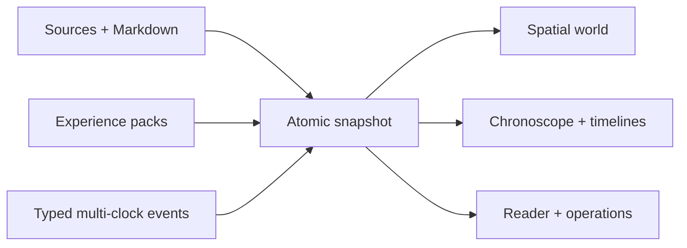

# Wiki Viva Kit

A Markdown/Git-first living operational wiki with a deterministic core,
privacy-aware honesty gates, a dense visual cockpit and deep reading delegated
to the AI agent operating the repository. No LLM client is embedded.

The wiki is one navigable world rather than a set of dashboard islands. Pages
remain canonical Markdown; registered views project the same world as spatial
quadrants, timelines, graph relations, source provenance and operational work.



## Try the public synthetic demo

```sh
npm --prefix apps/wiki-cockpit ci
npm --prefix apps/wiki-cockpit run dev
```

Open `http://localhost:5173/demo`. The demo contains synthetic Study/Research
and Personal Finance scenarios and requires no account, token or private data.

## What the kit provides

- deterministic source manifests, extraction, chunking and local search;
- secret detection everywhere and PII checks at public boundaries;
- delegated LLM context packages with auditable consolidation;
- typed relations, temporal events and multiple timeline projections;
- a responsive React/Three.js cockpit with equivalent information surfaces;
- declarative experience packs with synthetic conformance fixtures;
- per-PR gates, operational compilation and Git-native review history.

## Quickstart

```sh
python3 -m venv .venv
. .venv/bin/activate
python3 -m pip install -r requirements.txt
python3 scripts/wiki_audit.py --check
python3 scripts/wiki_web_snapshot.py --check-contract
```

Edit `wiki.config.yaml` to define the repository id, owner label, root entity,
memory root, contexts and privacy boundary. See [docs/README.md](docs/README.md)
and the [Wiki Viva skill](.skills/wiki-viva/SKILL.md).

## Downstream upgrading

The previous subject/lane/capsule/attestation machine is retired. Its final
`upgrade-package.yaml` is frozen as historical documentation; it is not a
current gate.

The supported flow is a single consumer PR:

```sh
# B0: readable and mutation-free
python3 /path/to/wiki-viva-kit/scripts/wiki_sync_from_kit.py \
  --kit /path/to/wiki-viva-kit --consumer /path/to/consumer --dry-run

# C1 + C2; add one or more explicit consumer-owned C3 commands when required
python3 /path/to/wiki-viva-kit/scripts/wiki_sync_from_kit.py \
  --kit /path/to/wiki-viva-kit --consumer /path/to/consumer \
  --c3-command "python3 scripts/consumer_migration.py"
```

The command is idempotent, copies only Git-tracked kit-owned paths, regenerates
declared derived artifacts and writes `kit.lock`. It never copies consumer
memory or configuration and never invents C3 domain changes. The PR itself is
the reversible boundary. Run the kit's normal CI, the consumer's own gates and
obtain human approval before promotion.

Full instructions: [downstream upgrade runbook](docs/references/guides/wiki-viva-v8-downstream-upgrade.md).

## Release policy

A kit release consists of:

1. a Git tag;
2. release notes describing product and contract changes;
3. an **Upgrading** section with required consumer migrations;
4. green normal CI: audit, pytest, Vitest, TypeScript and production build;
5. a human-reviewed PR.

No capsule, receipt or exact-matrix rite is required.

## Privacy

Personal data belongs in private consumer wikis and needs no warning there.
Public pages/exports must remain public-safe. Access secrets—tokens, passwords,
private keys, cookies and equivalent credentials—are blocked everywhere.

## Repository layout

| Path | Purpose |
| --- | --- |
| `wiki_core/` | Deterministic core and contracts |
| `scripts/` | `wiki_*` command-line operations |
| `apps/wiki-cockpit/` | Visual cockpit and local operator |
| `memories/` | Public synthetic canonical wiki |
| `docs/` | Guides, templates and references |
| `packs/` | Declarative experience packs |
| `.skills/` | Portable agent playbooks |

## Normal gates

```sh
python3 scripts/wiki_audit.py --check
python3 scripts/wiki_audit.py --public-export --check
python3 -m pytest tests/
npm --prefix apps/wiki-cockpit test
npm --prefix apps/wiki-cockpit exec -- tsc -p apps/wiki-cockpit/tsconfig.json --noEmit
npm --prefix apps/wiki-cockpit run build
```

Core changes should use public synthetic fixtures first. Private repositories
are downstream QA, never the source of public examples.

## License

See [LICENSE](LICENSE) and [CONTRIBUTING.md](CONTRIBUTING.md).
