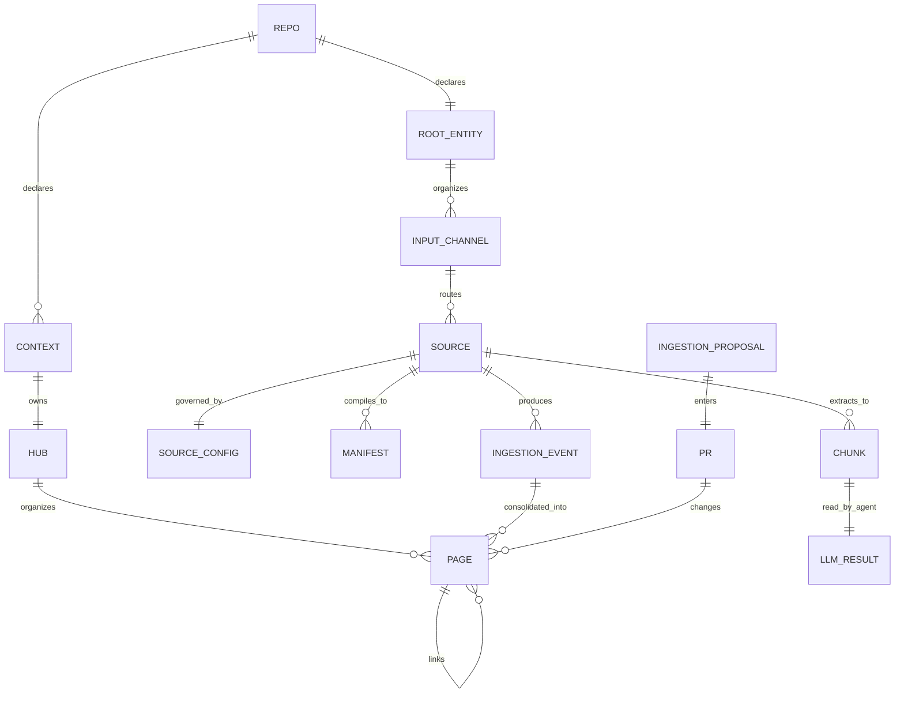
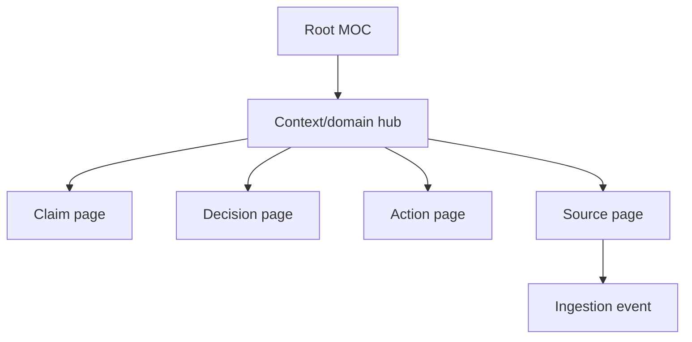
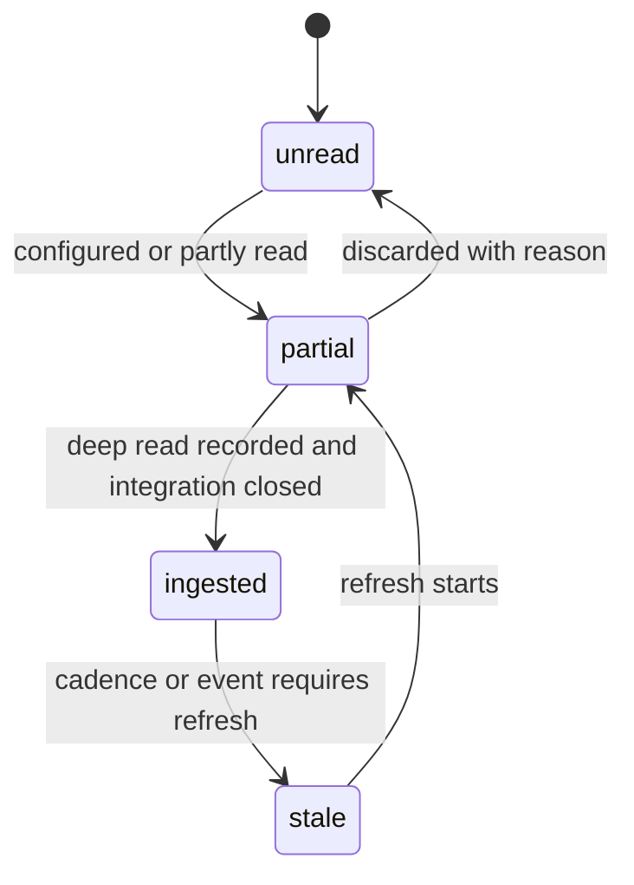
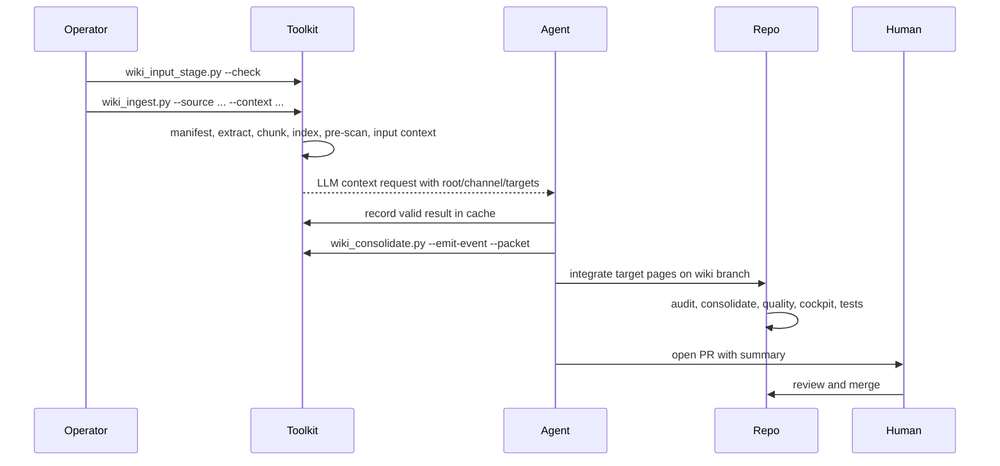
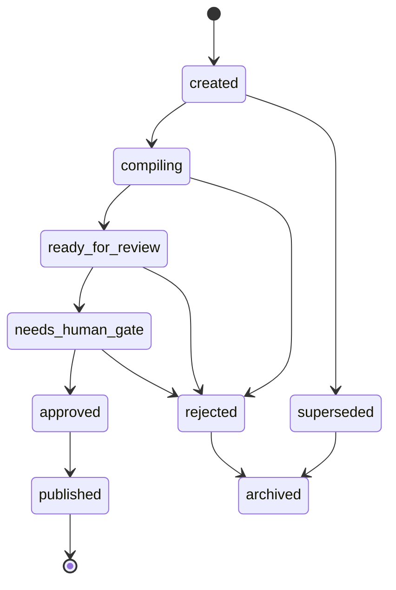

# Default open-source process

This guide is the complete default process for operating Wiki Viva Kit as an
open-source Markdown/Git living wiki. It describes the default entities, the
ingestion lifecycle, the human gate, the deterministic gates, and the boundaries
between public reusable toolkit behavior and downstream private wiki content.

It is intentionally a reference guide, not a status page. Live method pages,
the root memory and the command-reference page are resolved from
`wiki.config.yaml`; the implementation lives in
[wiki_core](../../../wiki_core/__init__.py) and [scripts](../../../scripts/wiki_ingest.py).

## Executive model

Wiki Viva Kit is a repository pattern:

- Markdown pages are the canonical memory.
- Git history is the audit trail.
- Pull Requests are the human gate.
- Python performs deterministic compilation, checking, indexing and reporting.
- The agent performs the semantic deep read and integration work.
- Derived artifacts are reproducible cache, not canonical truth.
- Secrets are blocked everywhere; personal data is allowed only according to the
  configured privacy boundary.

The default open-source process is:

```mermaid
flowchart LR
    Configure["Configure repo profile"] --> Source["Register source"]
    Configure --> Root["Declare root entity"]
    Root --> Stage["Compile input stage"]
    Stage --> Source
    Source --> Ingest["Run deterministic ingest"]
    Ingest --> Read["Agent deep read"]
    Read --> Consolidate["Consolidate result"]
    Consolidate --> Integrate["Integrate into target pages"]
    Integrate --> Compile["Recompile cockpit"]
    Compile --> Gates["Run deterministic gates"]
    Gates --> PR["Open PR"]
    PR --> Review["Human review"]
    Review --> Main["Merge to main"]
```



The invariant is simple: `main` is approved memory. A `wiki/<topic>` branch is a
proposal until a human approves and merges it.

## Default repository shape

The open-source kit ships with English paths by default. Downstream repos can
localize names through [wiki.config.yaml](../../../wiki.config.yaml), but the
default layout is:

| Path | Role |
| --- | --- |
| [wiki_core](../../../wiki_core/__init__.py) | Deterministic Python core. |
| [scripts](../../../scripts/wiki_ingest.py) | `wiki_*` CLIs that expose the core. |
| [tests](../../../tests/test_wiki_pipeline.py) | Unit and fixture tests for the reusable kit. |
| Configured `paths.memory_root` | Living wiki: canonical Markdown memory. |
| Configured `root_entity.page` | Semantic root entity for this consumer. |
| Configured `root_entity.input_stage_page` | Generated root/channel/source staging page. |
| Configured system/method pages | The kit documents its local operating model. |
| `WikiPaths.ingest_dir` | Proposals, normalized events and archived ingestion records. |
| Configured `paths.references_root` | Perennial guides, templates, release notes, synthetic fixtures and snapshots. |
| Consumer-owned wiki templates | Page contracts resolved from the configured template and page-type registries, used by `wiki_new.py` and by humans. |
| `data/raw/` | Local raw-source cache, gitignored by default. |
| `data/derived/wiki/` | Deterministic manifests, chunks, indexes, requests, cache and reports. |
| Portable `.skills/wiki-*` packages | Agent playbooks. |
| [.github/workflows/wiki.yml](../../../.github/workflows/wiki.yml) | CI gate wiring. |
| [wiki.config.yaml](../../../wiki.config.yaml) | Repo profile, paths, privacy and gate settings. |
| [wiki.page-types.yaml](../../../wiki.page-types.yaml) | Typed page registry and required frontmatter. |
| [wiki.targets.yaml](../../../wiki.targets.yaml) | Local context-to-target map used by ingestion proposals. |

Only the configured memory and reference roots,
the toolkit code, config and tests belong in Git. Raw and derived artifacts are
cache unless a specific metadata mirror is intentionally versioned.

## Layers of truth

The system separates four layers so operators do not confuse evidence, cache,
drafts and approved memory.

| Layer | Examples | Canonical? | Reviewed by |
| --- | --- | --- | --- |
| Raw source | A downloaded PDF, export, email, spreadsheet or URL capture | No | Operator before ingestion |
| Derived cache | Manifest, chunks, FTS index, LLM request, LLM result cache, integration packet | No | Deterministic gates |
| Proposal | Ingestion proposal, normalized event, branch diff | Not yet | CI plus human PR review |
| Approved memory | Merged pages on `main` | Yes | Human gate |

The most important rule follows from this table: an extracted source, a cached
LLM result or a green local command is not approved memory. It becomes memory
only after integration into target pages and merge into `main`.

## Entity model

Wiki Viva entities are Markdown pages plus frontmatter. There is no hidden
database, ORM or service. IDs, links and page types create the graph.



### Repository profile

The repository profile is [wiki.config.yaml](../../../wiki.config.yaml). It
declares identity (`repo_id`, `owner_label`), language, contexts, paths,
privacy, approvals, LLM request parameters, freshness and audit policy. Code
reads this profile through [wiki_core/config.py](../../../wiki_core/config.py)
and [wiki_core/paths.py](../../../wiki_core/paths.py).

The default open-source profile uses:

| Setting | Default meaning |
| --- | --- |
| `language: en` | Generated artifacts are written in English. |
| `root_entity.page` | Semantic top page for the wiki's subject. |
| `root_entity.input_stage_page` | Generated staging page for channels and sources. |
| `contexts: example` | The kit includes a small example context. |
| `default_visibility: private_self` | Downstream memories default to private. |
| `private_sensitive_allowed: true` | PII is permitted on private pages. |
| `approval.gate: github_pr` | The human gate is the Pull Request. |
| `approval.branch_prefix: wiki/` | Proposal branches use the tool-neutral prefix. |
| `llm.required_context_pass: true` | A context request with chunks must have recorded results. |
| `audit.forbid_access_secrets: true` | Access secrets are blocked everywhere. |

### Root entity

The root entity is the first semantic page of a wiki. It answers what this wiki
serves: a person, team, company, project, product or community. The open-source
kit dogfoods this model through its configured `root_entity.page`.

The root page carries:

| Area | Examples |
| --- | --- |
| Identity and scope | What the entity is, what it owns, what is out of boundary. |
| Integral quadrants | Q1 declared/lived intent (upper-left), Q2 outputs/evidence of the root holon (upper-right), Q3 shared meaning/roles-as-lived (lower-left), Q4 systems/processes/governance (lower-right). Source basis: Integral Life's [Four Quadrants](https://integrallife.com/four-quadrants/) and [Guided Tour](https://integrallife.com/the-four-quadrants-a-guided-tour/). |
| Perspective bundle | Required and optional perspectives inherited by sources. |
| Input channels | Document streams, tools, folders, chats, calendars, issue trackers. |
| Source map | Which canonical source/config pages feed which target pages. |

The root entity does not replace context hubs or typed pages. It makes their
relationship explicit before the first ingestion.

### Input stage

[wiki_input_stage.py](../../../scripts/wiki_input_stage.py) compiles the root
entity, input-channel pages, canonical source pages and source-config sidecars
into the configured `root_entity.input_stage_page`. The input stage
does not fetch external tools. It only stages what has already been declared so
the next LLM context package receives the right inherited perspectives, channel
metadata and target pages.

| Input-stage output | Use |
| --- | --- |
| Root entity | Default top-page impact and perspective bundle. |
| Channels | Systems/document streams that sources belong to. |
| Sources | Canonical source pages, states, configs and target pages. |
| Ready inputs | Sources with current material staged or already clean enough for ingestion (`staged` / `ready_for_ingest`). |
| Warnings | Missing config/channel links to fix before ingestion. |

### Context

A context is a top-level area of memory. Each configured context must have a hub
page at `<memory_root>/<context>/index.md`; the context hub is the first page to
update when a source changes the
meaning of that domain.

Contexts are not tags. They are operational ownership boundaries. They decide
freshness cadence, target pages, and where integration should land.

### Root MOC and hubs

The root map of content is the index under configured `paths.memory_root`. It
links the major hubs. Hubs carry the current synthesis for a context or domain.
Typed relation pages should point back to a hub through `moc_parent`; provenance
through `source_refs` does not replace navigation through a parent hub.

The default navigation shape is:



### Page

A page is a Markdown file with frontmatter. Its minimum identity fields are
controlled by [wiki.page-types.yaml](../../../wiki.page-types.yaml), but most
pages include:

| Field | Meaning |
| --- | --- |
| `page_id` | Stable identifier used by relations. |
| `page_type` | Contract name, validated against [wiki.page-types.yaml](../../../wiki.page-types.yaml). |
| `context` | Operational context that owns the page. |
| `visibility` | Privacy/export boundary. |
| `updated_at` | Last semantic update date. |
| `stale_after_days` | Freshness expectation. |
| `source_refs` | Provenance links to source pages or IDs. |
| `moc_parent` | Navigation parent, usually a hub. |
| `related_pages` | Explicit graph neighbors. |

Typed pages should be created from templates with
[wiki_new.py](../../../scripts/wiki_new.py), not from blank files.

### Source

A source page is a canonical node for something the wiki may read: a document,
repo, URL, exported email, table, meeting, card or external artifact. Its
consumer-owned `source` template is resolved from the configured template and
page-type registries. Important fields are:

| Field | Meaning |
| --- | --- |
| `source_type` | Reference, memory, artifact, raw, no-ingest or local repo-specific class. |
| `ingestion_state` | `unread`, `partial`, `ingested` or `stale`. |
| `last_ingested_at` | Last completed integration date. |
| `refresh_policy` | Recurring, event-driven, on-demand or archival. |
| `refresh_cadence_days` | Suggested cadence for source registry refresh. |
| `config_ref` | Optional link to source-specific rules. |
| `source_refs` | Upstream provenance when this source derives from another source. |

The source-registry page resolved by `WikiPaths.source_registry_page` lists
sources, state, last update and next suggested refresh.

### Source config

A `source_config` page keeps ingestion/search/business rules out of the content
page. It is the correct place for:

- How to fetch or refresh the source.
- What to extract.
- What to never copy.
- Domain deduplication rules.
- Required and optional perspectives for the deep read.
- Privacy boundaries.

The consumer-owned `source_config` template is resolved from the configured
template and page-type registries, and the source onboarding procedure is
summarized in [.skills/wiki-viva/reference/sources.md](../../../.skills/wiki-viva/reference/sources.md).

### Typed relation pages

The default typed relation pages are declared in
[wiki.page-types.yaml](../../../wiki.page-types.yaml). They include `action`,
`claim`, `decision`, `meeting`, `person`, `project`, `source`,
`source_config`, `perspective`, `relationship_map`, `dashboard`,
`ingestion_event`, `source_registry`, `source_catalog`, `system_log` and
`operational_rule`.

The key rule is one real entity, one canonical page. If a source mentions a
person, project, claim or decision already represented in the wiki, update the
canonical page instead of creating a duplicate. The practical rules live in
[canonical-entity-navigation.md](canonical-entity-navigation.md).

### Perspective

A perspective page defines a reusable viewpoint for deep reads. It declares the
source types it applies to, what it extracts, target page types and
correspondence rules. During a source read, required perspectives from the source
config are merged into the LLM context request so the agent reads the source with
the right lenses.

### Ingestion proposal

An ingestion proposal is Markdown under `WikiPaths.ingest_dir`. It is
not the final memory. It carries source references, quadrants, privacy risks,
target pages and gate state. It moves through the state machine with
[wiki_gate.py](../../../scripts/wiki_gate.py).

### Ingestion event

An ingestion event is the normalized record that a source was read. It captures
the integral quadrants, candidate claims, decisions, actions, risks,
uncertainties and the `consolidated_into` closure list. Its consumer-owned
`ingestion_event` template is resolved from the configured template and
page-type registries. The event is not closed until it has at least one
non-source target and every non-source target page it changed references the
source back. Source identity targets use the event/lifecycle closure and must
not self-reference.

### Operational cockpit and operational pass

The page resolved by `WikiPaths.operation_page` is a generated dashboard. The
page resolved by `WikiPaths.operational_pass_page` is a broader
source/action/context compilation. Neither should be hand-edited. They are
recompiled by [wiki_operation_compile.py](../../../scripts/wiki_operation_compile.py)
and [wiki_operational_pass.py](../../../scripts/wiki_operational_pass.py).

### System log

The page resolved by `WikiPaths.log_page` is append-only. When a change touches
the configured memory root, the log must record the
memory-layer change. Documentation under configured `paths.references_root` can
be maintained as reference material, but once memory pages change the log gate
applies.

## IDs and references

The kit avoids ambiguous prose-only references by using stable IDs and
deterministic hashes.

| ID | Produced by | Purpose |
| --- | --- | --- |
| `page_id` | Page frontmatter | Stable relation target. |
| `source_id` | [source_manifest.py](../../../wiki_core/source_manifest.py) | Stable source identity from source path/content hash. |
| `chunk_id` | [chunking.py](../../../wiki_core/chunking.py) | Stable excerpt identity. |
| `cache_key` | [llm/cache.py](../../../wiki_core/llm/cache.py) | Idempotent key for one deep-read result. |
| `dedup_key` | [score/karma.py](../../../wiki_core/score/karma.py) | Avoids double-counting score events. |
| `rebase_key` | [gate/state_machine.py](../../../wiki_core/gate/state_machine.py) | Supersedes older competing proposals. |

Use Markdown links for file paths. Use `page_id` arrays for semantic relations.
Use `source_refs` for provenance. Use `moc_parent` for navigation.

## Default source lifecycle

The source lifecycle is explicit:



The source becomes `ingested` only when all of these are true:

- The source has a manifest.
- Extracted chunks exist, unless the source legitimately has no local semantic
  content.
- Any required deep-read result is recorded in the cache.
- A normalized event exists.
- The event has `consolidated_into` closed.
- Target pages reference the source back in `source_refs`.
- Conflicts and uncertainties are resolved or recorded.
- The source page has `last_ingested_at` and an ingestion-log row.
- The source registry is regenerated when source metadata changes.

If any of these are missing, the correct state is `unread`, `partial`, `stale`,
or a documented non-ingestion outcome.

## Ingestion lifecycle

The ingestion lifecycle has deterministic steps, one delegated semantic step,
and one human gate.



### 1. Compile the root/input stage

Before reading sources, keep the root-driven staging page current:

```sh
python3 scripts/wiki_input_stage.py --write
python3 scripts/wiki_input_stage.py --check
python3 scripts/wiki_input_stage.py --ready
```

This catches unlinked input channels and stale source-config routing before the
agent spends semantic work on the wrong target pages.

### 2. Register or identify the source

For repeatable sources, create a source page and optional source config first.
For one-off files, the ingestion command can still generate a deterministic
manifest, but durable operation benefits from a source page because it gives the
source a home, a refresh policy and an ingestion log.

Useful commands:

```sh
python3 scripts/wiki_source_registry.py --write
python3 scripts/wiki_source_registry.py --check
```

### 3. Manifest

[wiki_extract_source_manifest.py](../../../scripts/wiki_extract_source_manifest.py)
and [source_manifest.py](../../../wiki_core/source_manifest.py) classify the
source and compute a stable `source_id`. The manifest records hash, size, type,
risk and initial visibility. It is derived cache.

### 4. Text extraction and chunking

[wiki_extract_text.py](../../../scripts/wiki_extract_text.py) and
[extractors/text.py](../../../wiki_core/extractors/text.py) produce text from
supported local formats. [chunking.py](../../../wiki_core/chunking.py) splits
that text into stable chunks with configured target size and overlap.

### 5. Index

[wiki_build_index.py](../../../scripts/wiki_build_index.py) and
[index/sqlite.py](../../../wiki_core/index/sqlite.py) build the local FTS index.
This enables retrieval, inspection and context-package assembly without turning
the repository into a database service.

### 6. Pre-scan

The pre-scan runs the detectors before semantic work advances:

- Access secrets block the source at origin with exit code `2`.
- PII is informational on private pages when `private_sensitive_allowed: true`.
- PII becomes an error at the public boundary or under `--public-export`.

The detectors are in [wiki_core/detectors](../../../wiki_core/detectors/__init__.py),
and the privacy model is documented in the consumer's configured method pages.

### 7. LLM context request

[context_pass.py](../../../wiki_core/llm/context_pass.py) builds the context
request. The request contains chunks, prompt version, schema version, required
keys, quadrants, perspective instructions, cache status and, for repo-local
source pages, the v4 root/input-stage fields: `root_entity`, `input_channel`,
`quadrant_map`, `target_pages` and `input_stage_status`. The pipeline writes a
`*-llm-context-request.json` file under derived artifacts.

The Python code does not call a model. It emits the package the agent must read.

### 8. Delegated deep read

The agent reads the request and produces structured results. Each result must
include all required keys, filled quadrants and `sensitivity.has_pii`. The result
is recorded with:

```sh
python3 scripts/wiki_llm_context_pass.py --record-result result.json --context example
python3 scripts/wiki_llm_context_pass.py --source path/to/source.md --context example --check
```

The gate checks recorded results, not intentions. A plan to read the source is
not a deep read.

### 9. Consolidation packet and normalized event

[wiki_consolidate.py](../../../scripts/wiki_consolidate.py) turns recorded cache
results into a normalized event and an integration packet:

```sh
python3 scripts/wiki_consolidate.py --source <source_id> --emit-event --packet
python3 scripts/wiki_consolidate.py --all-pending
```

The event captures what the source says. The packet helps the agent find related
pages, overlapping claims and conflicts. Both exist to support integration, not
to replace it.

### 10. Integration into memory

Integration is the semantic step that makes ingestion real. The agent updates
the target hub first, then typed pages as needed. It must:

- Preserve provenance through `source_refs`.
- Keep navigation through `moc_parent`.
- Merge into canonical entity pages instead of creating duplicates.
- Resolve or explicitly record conflicts.
- Close `consolidated_into` in the event.
- Update the source page state, last ingestion date and ingestion log.
- Regenerate the source registry when source metadata changes.

Ingesting means integrating. A source that was read but not reflected in target
pages is still pending.

### 11. Proposal gate state

Ingestion proposals and related proposal files move through an explicit state
machine:



Operate it with:

```sh
python3 scripts/wiki_gate.py --list
python3 scripts/wiki_gate.py --transition <proposal>.md --to ready_for_review --reason "compiled"
python3 scripts/wiki_gate.py --rebase --rebase-key <logical-target>
```

The state machine is implemented in
[gate/state_machine.py](../../../wiki_core/gate/state_machine.py).

### 12. Cockpit and operational pass

After memory changes, recompile the generated operational surfaces:

```sh
python3 scripts/wiki_operation_compile.py --write
python3 scripts/wiki_operational_pass.py --write
```

Then check them:

```sh
python3 scripts/wiki_operation_compile.py --check
python3 scripts/wiki_operational_pass.py --check
```

These generated pages are not manual notes. They are resumable state compiled
from the repository.

### 13. PR and merge

Open a PR from the `wiki/<topic>` branch. Include:

- Sources consulted.
- Pages changed.
- Privacy risks and public-boundary status.
- Validation commands run.
- Pending items and blocked sources.
- Conceptual diff: what changed in the wiki's meaning.

Generate a mechanical summary with:

```sh
python3 scripts/wiki_pr_summary.py
```

The human reviewer approves or requests changes. Only the merge to `main`
promotes the proposal to approved wiki memory.

## Deterministic gates

The default local gate suite before a PR is:

```sh
python3 scripts/wiki_audit.py --check
python3 scripts/wiki_check_methodology_coverage.py --check
python3 scripts/wiki_operation_compile.py --check
python3 scripts/wiki_operational_pass.py --check
python3 scripts/wiki_source_registry.py --check
python3 scripts/wiki_input_stage.py --check
python3 scripts/wiki_consolidate.py --check
python3 scripts/wiki_quality_report.py --check
python3 -m pytest tests/ -q
python3 scripts/wiki_pr_summary.py
git diff --check
```

The gates are intentionally zero-token. They do not judge whether a synthesis is
conceptually right; they judge whether the repository obeys the mechanical
contract.

| Gate | What it protects |
| --- | --- |
| [wiki_audit.py](../../../scripts/wiki_audit.py) | Frontmatter, links, secrets, PII boundary, gate state, LLM pass, log updates. |
| [wiki_check_methodology_coverage.py](../../../scripts/wiki_check_methodology_coverage.py) | Required method pages, templates and perceptive-layer use. |
| [wiki_operation_compile.py](../../../scripts/wiki_operation_compile.py) | Cockpit freshness. |
| [wiki_operational_pass.py](../../../scripts/wiki_operational_pass.py) | Source/action/context operational pass freshness. |
| [wiki_source_registry.py](../../../scripts/wiki_source_registry.py) | Canonical source registry freshness. |
| [wiki_input_stage.py](../../../scripts/wiki_input_stage.py) | Root entity, input channel and source-config staging freshness. |
| [wiki_consolidate.py](../../../scripts/wiki_consolidate.py) | Deep-read-complete sources are integrated. |
| [wiki_quality_report.py](../../../scripts/wiki_quality_report.py) | Density, repetition, hierarchy, open integration and quality telemetry. |
| [pytest](../../../tests/test_wiki_pipeline.py) | Reusable toolkit behavior. |
| [wiki_pr_summary.py](../../../scripts/wiki_pr_summary.py) | Reviewer-ready diff summary. |
| `git diff --check` | Whitespace and patch hygiene. |

Detailed gate documentation belongs in the consumer's configured method pages.

## Privacy defaults

The open-source default process uses a two-axis privacy model:

| Axis | Default rule |
| --- | --- |
| Access secrets | Always blocked in any versioned file. |
| Personal data | Allowed on private pages; blocked at the public boundary. |

This is deliberate. An operational wiki may need private facts, but it must never
commit credentials. Before publishing a slice outside the repo, run:

```sh
python3 scripts/wiki_audit.py --check --public-export
```

The open-source kit itself should stay public-safe: examples, docs and fixtures
must not contain private downstream references, realistic credentials, personal
identifiers or individualized authenticated links.

## Default adoption flow

For a new open-source or downstream repo, the default setup is:

1. Copy or template the kit files.
2. Install dependencies:

   ```sh
   pip install -r requirements.txt
   ```

3. Edit [wiki.config.yaml](../../../wiki.config.yaml): identity, language,
   root entity, contexts, privacy, paths and gates.
4. Create or adapt the configured root entity page and input-channel pages.
5. Edit [wiki.targets.yaml](../../../wiki.targets.yaml): context target pages and
   entity IDs.
6. Create one hub per configured context.
7. Keep or remove the example context deliberately.
8. Compile the generated staging pages:

   ```sh
   python3 scripts/wiki_input_stage.py --write
   python3 scripts/wiki_source_registry.py --write
   ```

9. Run the baseline gates:

   ```sh
   python3 scripts/wiki_audit.py --check
   python3 scripts/wiki_check_methodology_coverage.py --check
   python3 scripts/wiki_operation_compile.py --check
   python3 scripts/wiki_input_stage.py --check
   python3 -m pytest tests/ -q
   ```

10. Start operational work on a `wiki/<topic>` branch.

Localized repos should not rename code or CLIs. They pin path names in
[wiki.config.yaml](../../../wiki.config.yaml) and keep deterministic code
portable.

## Daily operating loop

The default daily loop is:

1. Read the root entity, input stage, cockpit and operational pass.
2. Pick one thematic block.
3. Work on a `wiki/<topic>` branch.
4. Compile the input stage, then ingest or update sources.
5. Integrate into hubs and typed pages.
6. Recompile generated input/registry/operational pages.
7. Run gates.
8. Open or update the PR.
9. Human reviews.
10. Merge to `main`.

The detailed daily loop belongs in the consumer's configured method pages.

## OKF interoperability

Open Knowledge Format support is an adapter layer, not a replacement for the
internal wiki contract. The internal model keeps richer `page_type`, context,
privacy, provenance, perspective and PR-gate semantics. OKF export/check/import
lets another tool consume or preview a portable bundle.

Useful commands:

```sh
python3 scripts/wiki_okf_export.py --out tmp/okf-bundle --clean
python3 scripts/wiki_okf_check.py --bundle tmp/okf-bundle --check
python3 scripts/wiki_okf_visualize.py --bundle tmp/okf-bundle
python3 scripts/wiki_okf_import.py --bundle tmp/okf-bundle --context system --dry-run
```

The adapter code is [okf.py](../../../wiki_core/okf.py).

## What is deliberately not in the default kit

The default open-source process excludes these by design:

- No embedded LLM client in Python.
- No mandatory database service.
- No automatic connector credentials.
- No direct writes to `main` for canonical memory changes.
- No raw private data in the public toolkit.
- No acceptance of access secrets in Git, even on private pages.
- No claim that green gates prove semantic correctness.
- No promotion of a source to `ingested` without integration.

External services, browsers, Drive, Gmail, calendars, Jira or custom connectors
belong to the operator or agent layer. The kit models the results as sources,
pages, links and audited proposals.

## Definition of done

A process change is done when:

- The relevant doc, template, skill or code path is updated.
- The change is discoverable from [README.md](../../../README.md), the
  configured reference root, the meta-wiki, or the command reference.
- New core behavior has a test or synthetic fixture.
- Public docs contain no private downstream references.
- Memory-layer changes, if any, have an append-only log entry.
- Generated cockpit/operational surfaces are recompiled when memory changed.
- The local gates pass or any failure is explicitly explained.
- A human can review the PR and understand the conceptual diff.

A source ingestion is done when:

- The source has a canonical page or documented one-off rationale.
- Manifest, chunks and index were generated when applicable.
- Secrets did not pass the pre-scan.
- Required LLM results were recorded in cache.
- The normalized event exists and has filled quadrants.
- Integration updated target hubs/pages.
- Conflicts, uncertainties and no-change outcomes are explicit.
- `consolidated_into` has at least one non-source target; reverse `source_refs`
  are closed on non-source targets, while source identity lineage stays acyclic.
- Source state and registry are updated.
- Gates pass before PR review.

## Common failure modes

| Failure | Correct response |
| --- | --- |
| A source was cataloged but not integrated | Keep it `partial`; run consolidation and update target pages. |
| A deep-read request exists but no result is cached | Record validated results or leave the proposal pending. |
| A relation page has no hub parent | Add `moc_parent`; provenance alone is not navigation. |
| Two pages represent one entity | Merge into the canonical page and update inbound links. |
| A public doc includes private downstream references | Replace with public-safe examples and run `--public-export`. |
| The cockpit was hand-edited | Recompile it from scripts and keep the generated output. |
| CI is green but the synthesis is weak | Treat it as a conceptual review problem; gates are not semantic approval. |
| A secret appears in a source | Stop, remove it upstream, and do not version it. |

## Canonical references

- [README.md](../../../README.md): project entry point.
- [AGENTS.md](../../../AGENTS.md): agent operating contract.
- [wiki.config.yaml](../../../wiki.config.yaml): repo profile.
- [wiki.page-types.yaml](../../../wiki.page-types.yaml): page-type registry.
- [wiki.targets.yaml](../../../wiki.targets.yaml): local ingestion target map.
- Configured method pages: architecture, ingestion flow, gates, privacy and PR
  governance.
- Configured `paths.command_reference_page`: CLI catalog.
- [canonical-entity-navigation.md](canonical-entity-navigation.md): entity
  navigation rules.
- [source-refresh-cadence.md](source-refresh-cadence.md): source refresh rules.
