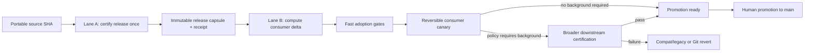
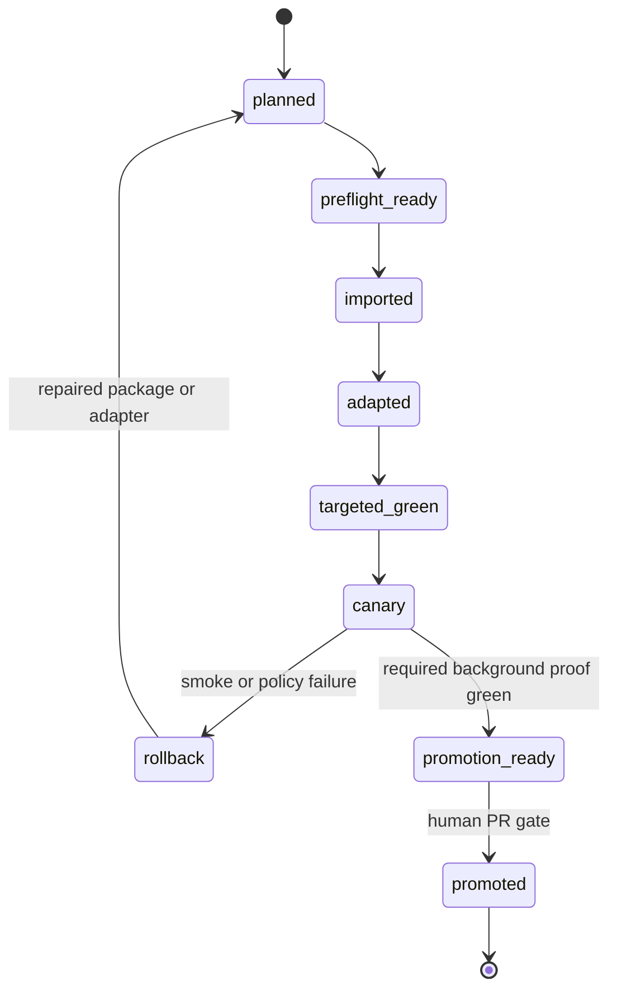

# Two-lane downstream migration strategy

This is the normative strategy for moving a certified Wiki Viva Kit release
into a downstream repository. It separates work that proves the **portable
release** from work that proves the **consumer delta**. A consumer must not pay
the full release-certification cost again when the imported bytes, public
release receipt and toolchain identity are unchanged.

The detailed v8 commands, three reviewable Git boundaries, evidence schema and
rollback procedure remain in the
[downstream upgrade runbook](wiki-viva-v8-downstream-upgrade.md). This document
decides **which proof belongs to which lane** and what may be reused.

> Transitional rule: this strategy does not silently weaken an existing
> package. Until a package and runner implement the gate classes below, every
> gate currently listed in `migration.required_gates` remains blocking. An
> agent may not skip a declared gate merely because this guide exists.

## Outcome



The target steady state is:

`certified capsule -> read-only preflight -> exact import -> local adaptation -> targeted proof -> canary -> [policy-required background proof] -> human promotion`

The background step is conditional only when the sealed policy declares no
selected `background_certification` gate as `required_for_promotion`. When one
is required, a canary may support a reversible `compat` merge, but it does not
become `promotion_ready` and cannot make v8 the promoted default until that
background proof passes.

The expected fast path is measured in minutes, not hours. That is an operating
budget, not permission to hide failures or fabricate evidence.

## Non-negotiable invariants

1. **Certify once per immutable subject.** The expensive public Python,
   frontend, browser, bundle, asset and release matrices bind to one exact
   source SHA, package digest, portable-tree digest, command-registry digest,
   toolchain digest and clean tree. A downstream consumer references that
   capsule; it does not reproduce the same proof.
2. **Adopt by exact consumer delta.** Downstream gates prove the difference
   between the frozen consumer baseline and the final adaptation commit, plus
   the imported bytes' equality to the certified public subject.
3. **Fail closed on uncertainty.** If the planner cannot classify a changed
   path, cannot verify a receipt or cannot prove that an affected surface is
   unchanged, it selects the full certification lane.
4. **Privacy and secret gates are never reusable.** Secret detection, private
   audit, public-evidence redaction and access-boundary checks run against the
   current consumer every time.
5. **Consumer semantics are never inferred from upstream green tests.** Input
   stage, semantic inventory, adapter identity, snapshot integrity and a real
   consumer smoke journey run on the final consumer subject.
6. **Evidence comes from execution.** Commands, exit codes, output hashes,
   screenshots, dimensions, console/network state and subject SHAs are emitted
   by the runner. Manual transcription cannot produce a complete report.
7. **Canary is reversible.** A new runtime reaches private real data behind an
   explicit `v8` activation with `compat`/`legacy` fallback and ordered Git
   rollback. Flags never weaken route, secret, privacy or sample-fallback
   invariants.
8. **Technical migration and domain content stay separate.** Runtime/import
   adapters belong to the migration PR. New meetings, finance records, company
   notes or other domain material use a later content PR.
9. **Human review remains the promotion gate.** Automation proves integrity;
   it does not authorize publication, merge or irreversible operations.

## Lane A — upstream release certification

Run Lane A once for an exact portable release subject. It owns:

- complete portable Python and frontend suites;
- the full synthetic browser/release matrix;
- demos, experience-pack conformance and fallback fixtures;
- architecture, assets, bundle and release-matrix checks;
- public-audit, secret-control and public-export fixture coverage inside the
  portable test suite;
- exact visual baselines for package-owned profiles;
- package/schema validation and rollback tooling tests.

The exact public repository audits are separate pre-certification and PR gates:
run `wiki_audit.py --check` and `wiki_audit.py --public-export --check` against
the source that is being reviewed. They do not become reusable capsule receipts
through the consumer-owned `audit` or `public_evidence_redaction` IDs. The
capsule seals only gates explicitly classified as `upstream_certified`; if a
release policy needs the capsule itself to attest an audit CLI, it must declare
a distinct upstream-certified gate and recertify the package. Lane B still
reruns its current consumer audit and redaction gates every time.

Lane A emits an immutable release capsule:

| Field | Required meaning |
| --- | --- |
| `source_sha` | Exact public commit containing the portable payload. |
| `package_sha256` | Canonical digest of the package that declares import and gate policy. |
| `portable_tree_sha256` | Digest of the allowlisted, blocklist-filtered Git tree. |
| `command_registry` + `command_registry_sha256` | Sorted gate ID/class/command registry plus its canonical digest. |
| `toolchain` + `toolchain_sha256` | Exact resolved Python distributions, Node, Playwright package plus launched Chromium engine, and runner identities with their canonical digest. The runner version embeds the byte/mode digest of `scripts/wiki_upgrade.py`, `scripts/_common.py`, `scripts/_git_subject.py`, `scripts/wiki_toolchain_probe.py`, `wiki_core/**/*.py` and the runtime JSON schemas. |
| `gate_receipt_sha256` | Hash of executed commands, exit codes and output hashes. |
| `visual_manifest_sha256` | Hash of package-owned screenshots and comparison metadata. |
| `capsule_sha256` | Canonical digest of the complete unsigned capsule. |
| `status` | `certified`; pending, historical or locally invented labels are not adoption authority. |

The capsule contract is
[`wiki-upgrade-release-capsule-v1.schema.json`](../schemas/wiki-upgrade-release-capsule-v1.schema.json).
`wiki_core.upgrade_lanes.verify_release_capsule` verifies schema closure,
canonical hashes, public-safety, command provenance and one executed passing
result for every `upstream_certified` command. It fails closed; sealing a
payload does not turn unexecuted proof into evidence.

Shape validation alone is not certification. The Lane A executor must derive
`portable_tree_sha256` from the pinned allowlist/blocklist Git tree, derive
`visual_manifest_sha256` from an actual verified manifest and emit each gate
result from the command process/log it ran. A caller typing
`provenance: executed` is not execution authority. Until that derivation is
runner-produced and covered by negative fixtures, a locally sealed capsule is
a contract test artifact, not reusable release evidence.

Any change to the subject, package digest, portable tree, command registry,
schema or declared toolchain invalidates the capsule and requires a new Lane A
run.

### Lane A -> Lane B handoff authority

Lane A does not hand off a branch name or a prose claim that CI passed. It
hands off one immutable release-authority bundle containing the canonical
package, capsule, portable subject/tree, impact registry, command registry,
toolchain identity, visual manifest, executed gate receipts and attestation.
The attestation digest travels through a separately reviewed channel so that a
consumer cannot make a locally sealed capsule trusted by copying files into an
authority directory.

Before planning any consumer mutation, Lane B must:

1. obtain that immutable bundle, its independently supplied raw archive
   SHA-256 and the independently supplied attestation digest;
2. verify the raw archive before extraction, execute the restored byte-equal
   runner, then recompute the capsule, package, portable tree, registry,
   command, toolchain, visual and receipt digests fail-closed;
3. freeze `consumer_B0` and compile the read-only conceptual C1/C2/C3 delta;
4. emit a handoff receipt that binds the verified Lane A authority to that B0,
   the exact selected/omitted gates and the plan digest; and
5. require `adopt --resume` to consume the same authority and plan, with no
   fallback to a live branch, mutable checkout or newly invented capsule.

The handoff is accepted only when `plan` can explain the exact consumer delta
and gate derivation without mutating the consumer. Private paths, routes,
payloads and consumer receipts never flow back into the public capsule. A
missing artifact, mismatched digest, unknown impact or changed plan rejects the
handoff and names Lane A or Lane B, the affected contract and the next action.

## Lane B — downstream adoption by delta

Lane B starts from a clean consumer baseline and one certified capsule. It
owns only consumer-specific proof:

1. freeze the baseline and compile the read-only preflight;
2. import portable bytes exactly from the capsule subject;
3. regenerate consumer artifacts;
4. apply consumer-owned configuration, adapters and release record;
5. compute the exact B0 -> C3 path and semantic delta;
6. select gates from the matrix below;
7. activate a reversible consumer canary;
8. emit the adoption receipt and migration report;
9. promote through the consumer PR/human gate.

The reviewed import/regeneration/adaptation workflow creates three distinct
commits. `plan` is read-only for Git/tracked state and writes only ignored
planning evidence; after the operator reviews that sealed plan, `adopt`
materializes and verifies each boundary atomically from its declared source
bytes and commands:

| Boundary | Owns | Must not own |
| --- | --- | --- |
| C1 faithful import | Portable files byte-equal to Lane A, including toolkit-owned `.skills/wiki-*/**`. | Memory, consumer config, tests or generated data. |
| C2 regenerated artifacts | Deterministic snapshot/demo/build artifacts declared by the package. | Hand-authored content or local policy. |
| C3 downstream adaptations | Consumer config, base plus `.local` page-type/template registries, adapters, `AGENTS.md`, non-`wiki-*` repo-local skills, consumer-owned tests, semantic repairs and localized release record. | Modified portable core, toolkit-owned `wiki-*` skills or private evidence sidecars. |

The broad `.skills/*/**` consumer namespace is resolved by portable precedence:
an exact package-allowed `.skills/wiki-*/**` path is C1 and is rejected from C3;
every other declared repo-local skill is C3. This lets a consumer update its
router and operating policy without forking the toolkit skill, while keeping
the imported `wiki-*` playbooks byte-equal to the Lane A capsule.

### Exact config-bound C3 authority

Static C3 allowlists do not authorize an entire localized memory or references
root. The only paths that configuration may add to C3 are derived exclusively
from the immutable Git blob at `consumer_B0:wiki.config.yaml`. The runner reads
that blob through Git, applies the package's closed role policy and seals the
result before any mutation. It never consults the live worktree or the later
C1, C2 or C3 version of the config to derive or widen ownership.

The config-bound policy contains exactly three roles:

| Role | B0-derived authority | Required Git/content contract |
| --- | --- | --- |
| `command_reference_page` | The one exact path named by `paths.command_reference_page`. | Regular UTF-8 Markdown `.md`, mode `100644`, inert and secret-clean. |
| `operational_pass_page` | The one exact path named by `paths.operational_pass_page`. | Regular UTF-8 Markdown `.md`, mode `100644`, inert and secret-clean. |
| `release_records` | Markdown descendants only beneath the B0-configured `paths.references_root` plus `/releases/`. | Every descendant is an inert UTF-8 `.md` regular blob with mode `100644`; executable, binary and sibling paths are rejected. |

The sealed package must declare
`contract_versions.consumer_c3_authority = wiki_viva_upgrade_consumer_c3_authority.v1`.
Each role maps one-to-one to its impact contract:
`command_reference_page` to `wiki_consumer_command_reference.v1`,
`operational_pass_page` to `wiki_consumer_operational_pass.v1`, and
`release_records` to `wiki_consumer_release_record.v1`. A missing, duplicate or
ambiguous package/impact mapping selects Lane A and the complete matrix because
the release policy itself must be repaired and recertified.

These are C3-only technical surfaces. A matching localized path in C1 or C2 is
still a boundary violation, and domain content elsewhere in the same roots is
not adaptation authority. The canonical authority object and its SHA-256 bind
the plan, mutation/resume state, adoption receipt and private migration report.
A different B0 config blob, derived path, role contract or authority digest
invalidates all C3-bound evidence. Unknown path or contract impact selects the
complete Lane A/full-matrix path; it never guesses a localized fast path. A
missing, malformed or unsafe `wiki.config.yaml` blob at B0 is instead a Lane B
baseline failure: `plan` stops before mutation, the consumer repairs B0 and
creates a new plan. Re-running Lane A cannot repair an invalid consumer config;
Lane A is required only when the sealed package/impact mapping itself is
missing or ambiguous.

This ownership rule is prospective. If a migration was already sealed under
v2 without consumer `AGENTS.md` or router changes in C3, do not append those
paths, amend C3 or regenerate its receipts. Finish that exact v2 subject with
its complete original gate matrix. After it reaches consumer `main`, create a
new v3 follow-up plan whose fresh B0/C1/C2/C3 chain imports any changed
toolkit-owned `wiki-*` skill in C1 and owns downstream `AGENTS.md`, router and
non-`wiki-*` local-skill adaptations in C3. Domain content remains a different
PR and authority surface.

All seven identity terms must match before an unfinished run may resume or a
receipt may be validated:

| Exact reuse key | Bound authority |
| --- | --- |
| `source_sha` | Lane A portable source commit. |
| `package_sha256` | Lane A package and migration policy. |
| `portable_tree_sha256` | Lane A imported byte set. |
| `consumer_B0` | Frozen consumer baseline before C1. |
| `consumer_C3` | Final consumer adaptation subject on which gates ran. |
| `command_registry_sha256` | Exact command IDs/classes/bodies used by both lanes. |
| `toolchain_sha256` | Exact resolved Python distributions, Node version, Playwright package plus launched Chromium engine, and byte/mode runner closure. |

The first, second, third, sixth and seventh terms must also equal the verified
Lane A capsule. `consumer_B0` and `consumer_C3` belong only to Lane B. A change
to either consumer commit invalidates Lane B gate, canary, resume and report
receipts without rewriting still-valid proof for the unchanged Lane A capsule.
Equality is necessary but not replay authority: once the overall adoption is
complete, its receipt becomes immutable historical evidence for the original
PR/human gate and `--resume` fails closed. Policy-driven reexecution requires a
new consumer subject and plan identity.

## Gate classes

Schema `wiki_viva_upgrade_package.v3`, defined by
[`wiki-upgrade-package-v3.schema.json`](../schemas/wiki-upgrade-package-v3.schema.json),
classifies every gate instead of presenting one undifferentiated blocking
list. Its `gate_policies` bind class, command ID, asserted contracts, reuse
policy, dependencies, resource group and promotion policy. The literal
`required_gates`/`gate_commands` mapping remains in v3 as a compatibility and
completeness boundary, not as permission to discard the class model.

| Class | Execution rule | Examples |
| --- | --- | --- |
| `upstream_certified` | Reuse only from a verified Lane A capsule with identical source, package, portable tree, command registry and toolchain. | Full portable suite, synthetic 102-cell browser matrix, demos, asset and bundle proof. |
| `consumer_always` | Run on every final downstream subject. | Toolkit drift, secret/private audit, public evidence redaction, input stage, semantic inventory, adapter check, snapshot contract, diff check, report/rollback verification. |
| `affected` | Run when the path/contract impact map selects the surface. Unknown impact escalates to full. | Focused Python modules, frontend components, route/navigation cells, packs, operator security, visual profiles. |
| `canary` | Run against the served real consumer snapshot before promotion. | Boot, canonical navigation, search/read, Timeline, fallback, console/network and privacy smoke. |
| `background_certification` | Run after targeted gates and before final promotion when policy requires broader consumer confidence. | Full private Python suite or broad consumer browser matrix. |

No reusable receipt may contain only a human label such as `green`. It must
bind the exact subject, package, command registry, toolchain and output hashes.

The following gates are **never reusable**, even if an upstream capsule or a
path derivation says otherwise:

- `audit` (including current secrets/private boundary checks);
- `public_evidence_redaction`;
- `input_stage` and `semantic_inventory`;
- `adapter_identity` and `snapshot_contract`;
- `real_canary`;
- `diff_check`;
- `rollback_report_verification`.

They are selected on every Lane B subject. A verifier rejects an omission of
any of them before considering the claimed reason.

## Affected-surface decision matrix

The planner uses both changed paths and declared contract changes. Path-only
heuristics are insufficient.

| Consumer delta | Mandatory focused proof | Escalate to full consumer certification when |
| --- | --- | --- |
| Content/frontmatter only | Audit, semantic inventory, input stage, snapshot contract and one canonical navigation/read smoke. | Page types, route identity, privacy classification or large graph closure changes. |
| Local labels/tokens/density | Adapter identity, frontend unit tests, desktop/mobile/fallback screenshots and visual smoke. | Layout primitives, interaction geometry or accessibility ownership changes. |
| Consumer-owned Python tests/fixtures | Changed test modules plus the contract suite they represent. | A fixture exposes a portable runtime defect or required contract cannot be identified. |
| Snapshot/data adapter | Adapter check, snapshot build/contract, temporal parity, Timeline and fallback smoke. | Schema version, temporal identity, source lifecycle or redaction behavior changes. |
| Pack install/configuration | Pack validate, composition hash, pack fixture and its declared journeys. | Pack runtime, shared blocks or registry composition code changes. |
| Route/navigation/search | Focused frontend tests plus every affected browser cell and back/forward persistence. | Shared world state, history ownership, keyboard model or selection semantics change. |
| Operator/security | Security contract, restart/readback, nonce/CORS tests and operator journeys. | Any portable server/security code changed or a capability was added. |
| Portable core/package/schema | No fast path. | Always: produce a new Lane A capsule first. |

The planner records the selected and omitted gates with machine-readable
reasons. An omitted gate without a verified upstream receipt or an explicit
`not_affected` derivation blocks the migration report.

The versioned implementation is the sealed
`docs/references/upgrades/wiki-viva-v8/impact-registry.yaml` authority artifact,
checked against
[`wiki-upgrade-impact-registry-v1.schema.json`](../schemas/wiki-upgrade-impact-registry-v1.schema.json).
It maps path patterns and contract IDs to surfaces, dependencies and gates.
Dependencies are followed transitively. An unrecognized path **or** contract,
a dependency cycle, an incomplete full-matrix catalog or a portable-core
surface selects the complete registry and marks `requires_lane_a=true`.

## Canary and promotion states



Rules:

- state transitions bind one package digest and one ancestry-ordered B0/C1/C2/C3 chain;
- a changed C3 invalidates targeted, canary and background receipts;
- private `main` may be the canary environment only when activation is
  independently reversible and the human explicitly selected that policy;
- if broad background validation is required by policy, `canary` may be merged
  only in `compat` mode and cannot become the default v8 runtime before it is
  green;
- a failed canary returns to `compat`/`legacy` or reverts C3 -> C2 -> C1; it
  never weakens safety gates to stay online.

## Automation contract

The open-source kit provides one resumable migration orchestrator rather than
requiring an agent to assemble evidence by hand. Lane A executes and seals only
`upstream_certified` gates. Its capsule still binds the complete command
registry because Lane B must verify the same package-wide command identity, but
no consumer/background result can appear in `certified_gates`, the Lane A
attestation or its certification receipt. First generate and independently
verify the create-once visual authority from the exact clean source; it must
cover every package profile and bind each PNG to a canonical source/package/
Chromium plus count-only console/network record. Then certify and independently
reopen the sealed capsule:

Every native release profile and browser fixture enters through the canonical
`?view=<native>` route and proves `data-runtime-mode="v8"`. Positional deep
links belong only to explicit compatibility coverage and must prove
`data-runtime-mode="compat"`; a screenshot without runtime identity is not
release evidence.

```sh
python3 /path/to/clean-public-subject/scripts/wiki_visual_evidence.py capture \
  --package /path/to/upgrade-package.yaml \
  --source-root /path/to/clean-public-subject \
  --source-sha <exact-source-sha> \
  --out-dir /path/to/verified-visual-authority

python3 /path/to/clean-public-subject/scripts/wiki_visual_evidence.py verify \
  --package /path/to/upgrade-package.yaml \
  --source-root /path/to/clean-public-subject \
  --source-sha <exact-source-sha> \
  --visual-root /path/to/verified-visual-authority

python3 /path/to/clean-public-subject/scripts/wiki_upgrade.py certify \
  --package /path/to/upgrade-package.yaml \
  --impact-registry /path/to/impact-registry.yaml \
  --source-root /path/to/clean-public-subject \
  --visual-root /path/to/verified-visual-authority \
  --visual-manifest-ref visual-manifest.json \
  --out-dir /path/to/new-immutable-release-authority \
  --attestation-authority-id <reviewed-authority-id>

python3 /path/to/clean-public-subject/scripts/wiki_upgrade.py verify-capsule \
  --package /path/to/upgrade-package.yaml \
  --capsule /path/to/new-immutable-release-authority/release-capsule.json \
  --impact-registry /path/to/impact-registry.yaml \
  --authority /path/to/new-immutable-release-authority/release-authority.json \
  --trusted-attestation-sha256 <out-of-band-sha256> \
  --kit-root /path/to/clean-public-subject
```

Every successful upstream command log is itself public evidence. The package's
quiet Pytest and TAP Vitest reporters are part of the sealed command registry;
a passing log that contains a host-local path is rejected, not redacted after
the fact.

The downstream operator uses the independently verified out-of-band attestation
digest emitted by that run. The operator-facing Lane B workflow is:

```sh
python3 /path/to/restored-release-authority/public-kit/scripts/wiki_upgrade.py plan \
  --package /path/to/restored-release-authority/upgrade-package.yaml \
  --capsule /path/to/restored-release-authority/release-capsule.json \
  --impact-registry /path/to/restored-release-authority/impact-registry.yaml \
  --authority /path/to/restored-release-authority/release-authority.json \
  --trusted-attestation-sha256 <out-of-band-sha256> \
  --kit-root /path/to/restored-release-authority/public-kit \
  --consumer-root /path/to/consumer \
  --consumer-b0 <B0> \
  --preflight-command 'audit::python3 scripts/wiki_audit.py --check' \
  --c2-generator-command 'demo_snapshot::python3 scripts/wiki_build_demo.py' \
  --c2-generator-command 'visual_baselines::npm --prefix apps/wiki-cockpit run test:visual:update' \
  --c3-adapter-command 'consumer-adapter::/path/to/reviewed-consumer-adapter.sh' \
  --out /path/to/consumer/.wiki-viva/upgrade/plan.json

python3 /path/to/restored-release-authority/public-kit/scripts/wiki_upgrade.py adopt \
  --plan /path/to/consumer/.wiki-viva/upgrade/plan.json \
  --package /path/to/restored-release-authority/upgrade-package.yaml \
  --capsule /path/to/restored-release-authority/release-capsule.json \
  --impact-registry /path/to/restored-release-authority/impact-registry.yaml \
  --authority /path/to/restored-release-authority/release-authority.json \
  --trusted-attestation-sha256 <out-of-band-sha256> \
  --trusted-acceptance-anchor-sha256 <sha256-emitted-by-plan> \
  --kit-root /path/to/restored-release-authority/public-kit \
  --consumer-root /path/to/consumer \
  --mode canary
```

This is the first `adopt` invocation and therefore never uses `--resume`. For a
split CI handoff, append `--pause-before-canary`; only an interrupted or
explicitly paused run may continue with `--resume`. A later post-canary resume
also requires the separately held completion anchor below.

The first invocation that reaches the real canary emits
`canary_completion_anchor_sha256`. Capture it outside `.wiki-viva/`. Any later
resume, including the background job, adds:

```sh
  --trusted-canary-completion-anchor-sha256 <sha256-emitted-after-real-canary>
```

`plan` emits `acceptance_anchor_sha256` after atomically claiming one
first-write clock for the exact capsule, B0, impact inputs, canonical digest of
the complete exact preflight object and mutation intent. The acceptance-attempt
identity binds that outer canonical preflight digest as well as the embedded
`preflight_sha256`, so replacing and coherently resealing preflight creates a
different attempt and cannot reuse the original external anchor.
The caller must freeze that value outside the consumer evidence directory; CI
uses a job output and the externally hashed handoff archive. A second plan for
the same attempt reuses the original timestamp. `adopt` verifies the exact
external digest before C1 and never creates or replaces a missing anchor.
Deleting the local anchor can only be detected as tampering when the digest is
still held out of band, so the self-hash of the plan is integrity metadata, not
clock authority.

The completion anchor is independently first-write and binds the plan, exact
seven-term identity, canary completion timestamp and canonical selected-canary
result projection. A post-canary resume verifies the caller-held digest before
reusing the result. Deleting, recreating or coherently resealing the local
result/anchor files cannot establish a new completion time.

The runner contract is:

- verify the Lane A capsule before touching the consumer;
- verify the active runner closure byte-for-byte against the capsule toolchain,
  using the exact interpreter executing the runner rather than a different PATH
  alias, before package validation, preflight, C1 or resume;
- bind the reviewed preflight produced before C1, then emit the exact
  post-chain conceptual plan before gates/canary execution;
- after explicit plan review, create C1 from the capsule's byte-exact portable
  projection, create C2 only from the registered generators and create C3 only
  from the reviewed consumer adapter commands, one direct single-parent atomic
  commit per boundary with no intermediate or merge commit;
- during initial materialization, replay each registered C2 generator from C1
  in a disposable clone, retain the real command log and require equality of
  the complete path set, Git modes and blob digests with committed C2;
- recompute the canonical affected-gate set from the package plus versioned
  impact registry, adding every package-required promotion gate and dependency;
- execute independent gates in parallel with bounded resources;
- stream progress instead of remaining silent during long browser runs;
- cache only gate results from an overall run that is still incomplete and
  whose complete identity key matches;
- automatically capture the package-declared visual profiles;
- write receipts, screenshots and reports only to ignored consumer evidence
  paths;
- on every resume with an existing execution plan, replay the complete
  registered C2 command set from C1 in a disposable clone and prove exact path,
  mode and blob equality before evaluating or reusing any gate result;
- resume completed gates after interruption only while the overall run remains
  incomplete, without reusing stale results;
- bind B0/C1/C2/C3 in both receipt and state, then independently recompute each
  direct Git edge, changed path, mode and blob before accepting evidence;
- verify rollback in a disposable clone before declaring `promotion_ready`.

`plan` is read-only for Git/tracked state and writes ignored canonical planning
evidence only after printing the lane, affected contracts, selected/omitted
gates, invalidation reasons and conceptual diff. `adopt` must refuse an
unreviewed or stale plan. Its resume checkpoint
binds both `identity_sha256` and `plan_sha256`; it may skip only a completed gate
whose receipt still matches the current seven-term identity, command digest,
output digest and final C3 subject.

The runner reports phase, active gate, completed/total gates, elapsed time and
failure ownership while independent gates run under bounded resource groups.
Visual capture records the configured profile, PNG hash/dimensions, sanitized
console and network summaries and final C3. Generated plan, checkpoint,
receipts, raw logs and screenshots live only in ignored/untracked consumer
evidence roots. The generated JSON/Markdown migration report contains only
path-free typed aggregates and hashes derived from that evidence; manual or
fabricated evidence is rejected.

### Runner acceptance status

The local implementation now closes the runner contract with public synthetic
fixtures: Lane A derives its portable tree, visual authority, toolchain and
command outputs; `plan` binds the read-only pre-mutation decision; `adopt`
creates and verifies distinct ancestry-ordered B0/C1/C2/C3 boundaries; the DAG
scheduler honors dependencies/resource groups; C2 is replayed from executed
generators; current-C3 canary evidence includes PNG/console/network data; resume
rejects stale identity; and rollback/report verification runs in a disposable
clone. C1 excludes every declared C2 surface by construction, the final
evidence subject includes non-ignored untracked files in its cleanliness proof,
and reports bind the exact lane, mode, selected gates and boundary
digests/counts. Toolchain proof includes the sorted resolved Python
distribution digest and a Chromium process launched by the recorded Playwright
package; the portable probe is part of the runner payload closure. The command
reference, schemas and negative controls cover those paths.

This implementation evidence does **not** certify the current v8 release. The
tracked `candidate` status exists only to mint a separately attested local
downstream-QA capsule; no production Lane A capsule or production v3 adoption
receipt exists until the exact public subject is promoted through its own
PR/human gate. The migration already
in flight remains on its complete v2 `migration.required_gates` matrix.

Rc21 and rc22 are now immutable historical non-promotional evidence. Rc21's
public UI regression proof remains useful, but a downstream rehearsal exposed
that its static C3 policy could not represent the three localized roles above
and that its broad release-record surface did not fail closed on
executable/non-Markdown descendants. Rc22 corrected that trust boundary and
passed its pre-capture local deterministic stack. Its first productive
Chromium capture then stopped fail-closed because the legacy
`/demo/w/timeline?tour=0` profile normalized to Quadrants instead of the native
Timeline. No rc22 visual manifest, capsule, attestation or Lane B authority was
minted. Its validation-pending and candidate package/tree pairs each reproduce
exactly, but the earlier prose mixed their package-bound tree digests; that
stale pairing is not reusable evidence. Rc22 must never be retried, promoted, imported, relabeled or used to
mint a capsule. Rc23 corrected the native routes, but its first complete
validation stopped with 41 setup errors from the one synthetic CLI helper that
still fabricated the legacy desktop route. No candidate, manifest, capsule,
attestation or Lane B authority existed; rc23 must not be retried or relabeled.
Rc24 is prospective and unpinned until a later metadata boundary seals its
exact source; public publication remains a separate human
decision.

### Sanitized in-flight v2 checkpoint

As of 2026-07-14, the current authorized private technical PR is the transition
checkpoint, not v3 proof. Its original 22-gate v2 matrix passed without
reduction, its four
real canary profiles and generated private/public-redacted reports passed, and
rollback restored the frozen baseline in a disposable clone. The two
deterministic hosted jobs pass. The hosted visual matrix remains fail-closed at
100/102 on the only completed standard Apple Silicon attempt. A later attempt
was cancelled during browser installation, so the current aggregate visual
check is cancelled/non-green. A separate first-attempt Intel diagnostic closed
92/102 after software rendering and WebGL context failures. Consumer `main` is
therefore unchanged.

The private `AGENTS.md` and router improvement discovered during this review
are deliberately excluded from that sealed C3. They belong to a fresh v3
follow-up after the v2 promotion, and cannot be used to rewrite or reissue the
current receipts. Rc21's historical reclassification, rc22's failed capture,
rc23's failed validation and the prospective rc24 contract do not amend that v2 subject, reduce its
original matrix or invalidate
receipts that still describe their exact frozen subject. Concurrent domain
material remains a separate content PR. No
private repository name, PR number, domain label, branch, SHA, route, path,
payload or screenshot is part of this public checkpoint.

The minimum identity key for unfinished-run gate reuse and receipt validation
is:

`source_sha + package_sha256 + portable_tree_sha256 + consumer_B0 + consumer_C3 + command_registry_sha256 + toolchain_sha256`

Changing any term invalidates the receipt. An unchanged completed receipt still
cannot be resumed or reused to promote twice.

## Required negative controls

Public synthetic fixtures must prove that the system rejects:

- a capsule/receipt with divergent source, package, portable-tree, command or
  toolchain digest;
- an unknown path or contract that attempts to retain the fast lane;
- results captured before the final C3 changed;
- an omitted gate without exact capsule proof or impact derivation;
- manual, placeholder or fabricated command evidence;
- a resume checkpoint whose identity or plan is stale;
- a host path, private evidence root, private route, secret or private value in
  a public capsule/receipt, mapping key or gate output after bounded repeated
  percent-decoding as well as in its literal representation;
- a file placed in the wrong C1/C2/C3 boundary, domain content inside a
  technical boundary, a symlink/submodule/special Git entry, or a C1 file that
  is not byte-and-mode-equal to Lane A;
- rollback/report proof that was not executed against final C3.

## CI topology

The public synthetic workflow separates four responsibilities:

1. **upstream certification** — capsule, command registry, toolchain and
   package-owned portable proof;
2. **fast adoption** — read-only planning, impact selection, exact boundaries,
   receipts and resume behavior on a synthetic consumer;
3. **canary** — resume the exact fast-adoption consumer, run a reversible served
   journey with browser evidence, then persist `--pause-before-background`;
4. **background certification** — depend on canary and resume that same
   consumer/run handoff for broader consumer suites, rollback and final reports.

Every job that verifies the browser toolchain installs the exact Playwright
package and Chromium engine before launching the probe. Pull-request filters
cover the complete portable authority and runner closure — including bootstrap
helpers, probe, requirements, all `wiki_core`, runtime schemas and runner CLI
tests — so a dependency-only change cannot bypass this workflow.

Background completion policy remains explicit in `gate_policies`; moving work
to a separate job does not make a `required_for_promotion` failure optional.
Branch protection and the PR/human gate consume all required job conclusions.

### Strict visual runner authority

The exact browser release matrix is not assigned to a standard hosted label by
assumption. Repository variable `WIKI_VIVA_STRICT_VISUAL_RUNNER` must name one
unique `wiki-viva-strict-visual-*` label on an isolated ARM64 macOS self-hosted
runner. The job additionally requires `self-hosted`, `macOS` and `ARM64`; a
separately reviewed consumer adapter is required for an eligible hosted larger
runner. The policy job fails when the variable is absent or outside the prefix,
and rejects fork-origin pull requests before any strict job can be dispatched.
It accepts push execution only from `main`. Runtime renderer attestation,
performance budgets and the zero-retry/zero-skip contract still decide whether
that configured runner is capable; a label is routing authority, not proof.

Registering a self-hosted runner is an operator security decision. It requires
explicit authorization, a dedicated execution identity, least-privilege
credentials, a clean or ephemeral workspace and no execution of untrusted fork
code. The public workflow uses read-only contents permission, disables checkout
credential persistence and treats absent evidence uploads as errors. Same-repo
pull requests are a collaborator-trusted boundary; consumers needing a stronger
review boundary must move certification behind an approved environment or a
protected manual release workflow. Standard pools may remain useful as
diagnostics or background evidence, but a failed standard-pool result cannot be
retried, waived or relabeled as strict certification.

## Time and feedback budgets

These phase targets diagnose a poor migration experience; they are not a
reason to terminate an honest gate early. Every v3 Lane B adoption must reach
the real current-C3 canary in **<= 20 minutes** as a contractual fast-path
acceptance criterion; the public `ordinary_no_core_change` fixture is the
required conformance example. The continuous wall
clock starts when the read-only `plan` command starts and stops only when the
selected real-canary gates complete. It survives `--resume` and cross-job
handoffs: queue or wait time after `plan` counts instead of silently pausing the
clock. C1/C2/C3 and every selected pre-canary gate are inside the measurement.
Phase targets may overlap because independent gates run in parallel; the
20-minute total supersedes their arithmetic sum.

| Stage | Target feedback budget |
| --- | ---: |
| Read-only preflight and plan | <= 2 minutes |
| Exact import + deterministic regeneration | <= 5 minutes |
| Consumer-always + affected gates | <= 10 minutes |
| Canary smoke + visual profiles | <= 5 minutes |
| Post-canary report/rollback compilation diagnostic | <= 1 minute |
| Plan-to-real-canary fast path | <= 20 minutes total |

Work completed before `plan`, plus explicitly classified
`background_certification`, final report generation, rollback verification and
the later human PR gate, are outside this plan-to-canary metric while remaining
mandatory for promotion. If the limit is exceeded, the runner still completes
background evidence, reports and rollback, but seals a blocked receipt with
status `exceeded`, elapsed milliseconds, Lane B, the affected acceptance-budget
contract and the next action. It cannot be reused or relabeled as a passing
fast path. An older v2 run is preserved on its historical contract and is not
retroactively timed as v3.

Longer full downstream suites run as an explicitly visible background lane.
The runner reports current gate, completed/total cells, elapsed time and
estimated remaining work; silence is not a release protocol.

## PR and ownership rules

Use separate PRs for separate authority:

1. **Public release PR:** portable implementation and Lane A certification.
2. **Consumer migration PR:** exact import, generated artifacts and consumer
   adapters only.
3. **Consumer content PRs:** domain material imported or authored by people or
   other agents after the technical migration is stable.
4. **Promotion PR/change:** flips the default runtime only after required
   canary/background receipts and human review.

A content contribution discovered during migration is recorded and queued; it
does not enter C1/C2/C3 merely because its branch already exists.

## Definition of done for the simpler migration system

- one command produces the read-only adoption plan and affected-gate list;
- one resumable command executes the reviewed plan and generates all evidence;
- the downstream run never repeats a verified upstream gate without a recorded
  invalidation reason;
- every omitted gate is justified by a valid capsule or impact derivation;
- every v3 plan seals the plan-to-canary budget, and the ordinary no-core-change
  conformance adoption reaches canary within 20 minutes;
- failures name the owning lane, affected contract and exact next action;
- rollback is verified, not described only in prose;
- private evidence remains ignored/untracked and public projection is safe;
- final promotion still requires the human gate.
