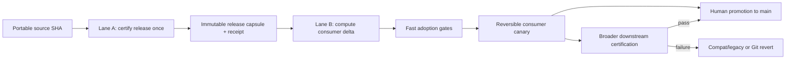
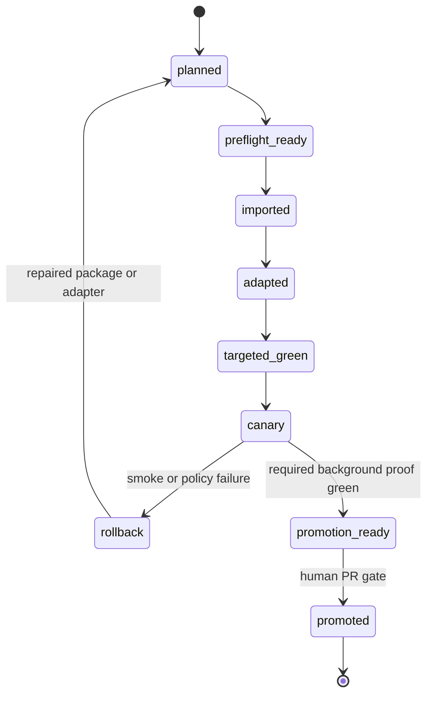

# Two-lane downstream migration strategy

This is the normative strategy for moving a certified Wiki Viva Kit release
into a downstream repository. It separates work that proves the **portable
release** from work that proves the **consumer delta**. A consumer must not pay
the full release-certification cost again when the imported bytes, public
release receipt and toolchain identity are unchanged.

The detailed v8 commands, three reviewable Git boundaries, evidence schema and
rollback procedure remain in the
[downstream upgrade runbook](wiki-viva-v8-downstream-upgrade.md). This document
decides **which proof belongs to which lane** and what may be reused.

> Transitional rule: this strategy does not silently weaken an existing
> package. Until a package and runner implement the gate classes below, every
> gate currently listed in `migration.required_gates` remains blocking. An
> agent may not skip a declared gate merely because this guide exists.

## Outcome



The target steady state is:

`certified capsule -> read-only preflight -> exact import -> local adaptation -> targeted proof -> canary -> promotion`

The expected fast path is measured in minutes, not hours. That is an operating
budget, not permission to hide failures or fabricate evidence.

## Non-negotiable invariants

1. **Certify once per immutable subject.** The expensive public Python,
   frontend, browser, bundle, asset and release matrices bind to one exact
   source SHA, package digest, portable-tree digest, command-registry digest,
   toolchain digest and clean tree. A downstream consumer references that
   capsule; it does not reproduce the same proof.
2. **Adopt by exact consumer delta.** Downstream gates prove the difference
   between the frozen consumer baseline and the final adaptation commit, plus
   the imported bytes' equality to the certified public subject.
3. **Fail closed on uncertainty.** If the planner cannot classify a changed
   path, cannot verify a receipt or cannot prove that an affected surface is
   unchanged, it selects the full certification lane.
4. **Privacy and secret gates are never reusable.** Secret detection, private
   audit, public-evidence redaction and access-boundary checks run against the
   current consumer every time.
5. **Consumer semantics are never inferred from upstream green tests.** Input
   stage, semantic inventory, adapter identity, snapshot integrity and a real
   consumer smoke journey run on the final consumer subject.
6. **Evidence comes from execution.** Commands, exit codes, output hashes,
   screenshots, dimensions, console/network state and subject SHAs are emitted
   by the runner. Manual transcription cannot produce a complete report.
7. **Canary is reversible.** A new runtime reaches private real data behind an
   explicit `v8` activation with `compat`/`legacy` fallback and ordered Git
   rollback. Flags never weaken route, secret, privacy or sample-fallback
   invariants.
8. **Technical migration and domain content stay separate.** Runtime/import
   adapters belong to the migration PR. New meetings, finance records, company
   notes or other domain material use a later content PR.
9. **Human review remains the promotion gate.** Automation proves integrity;
   it does not authorize publication, merge or irreversible operations.

## Lane A — upstream release certification

Run Lane A once for an exact portable release subject. It owns:

- complete portable Python and frontend suites;
- the full synthetic browser/release matrix;
- demos, experience-pack conformance and fallback fixtures;
- architecture, assets, bundle and release-matrix checks;
- public audit, secret controls and public-export fixtures;
- exact visual baselines for package-owned profiles;
- package/schema validation and rollback tooling tests.

Lane A emits an immutable release capsule:

| Field | Required meaning |
| --- | --- |
| `source_sha` | Exact public commit containing the portable payload. |
| `package_sha256` | Canonical digest of the package that declares import and gate policy. |
| `portable_tree_sha256` | Digest of the allowlisted, blocklist-filtered Git tree. |
| `command_registry` + `command_registry_sha256` | Sorted gate ID/class/command registry plus its canonical digest. |
| `toolchain` + `toolchain_sha256` | Exact Python, Node, browser and runner identities plus their canonical digest. |
| `gate_receipt_sha256` | Hash of executed commands, exit codes and output hashes. |
| `visual_manifest_sha256` | Hash of package-owned screenshots and comparison metadata. |
| `capsule_sha256` | Canonical digest of the complete unsigned capsule. |
| `status` | `certified`; pending, historical or locally invented labels are not adoption authority. |

The capsule contract is
[`wiki-upgrade-release-capsule-v1.schema.json`](../schemas/wiki-upgrade-release-capsule-v1.schema.json).
`wiki_core.upgrade_lanes.verify_release_capsule` verifies schema closure,
canonical hashes, public-safety, command provenance and one executed passing
result for every `upstream_certified` command. It fails closed; sealing a
payload does not turn unexecuted proof into evidence.

Shape validation alone is not certification. The Lane A executor must derive
`portable_tree_sha256` from the pinned allowlist/blocklist Git tree, derive
`visual_manifest_sha256` from an actual verified manifest and emit each gate
result from the command process/log it ran. A caller typing
`provenance: executed` is not execution authority. Until that derivation is
runner-produced and covered by negative fixtures, a locally sealed capsule is
a contract test artifact, not reusable release evidence.

Any change to the subject, package digest, portable tree, command registry,
schema or declared toolchain invalidates the capsule and requires a new Lane A
run.

## Lane B — downstream adoption by delta

Lane B starts from a clean consumer baseline and one certified capsule. It
owns only consumer-specific proof:

1. freeze the baseline and compile the read-only preflight;
2. import portable bytes exactly from the capsule subject;
3. regenerate consumer artifacts;
4. apply consumer-owned configuration, adapters and release record;
5. compute the exact B0 -> C3 path and semantic delta;
6. select gates from the matrix below;
7. activate a reversible consumer canary;
8. emit the adoption receipt and migration report;
9. promote through the consumer PR/human gate.

The reviewed import/regeneration/adaptation workflow creates three distinct
commits. `plan` is read-only; after the operator reviews that sealed plan,
`adopt` materializes and verifies each boundary atomically from its declared
source bytes and commands:

| Boundary | Owns | Must not own |
| --- | --- | --- |
| C1 faithful import | Portable files byte-equal to Lane A. | Memory, consumer config, tests or generated data. |
| C2 regenerated artifacts | Deterministic snapshot/demo/build artifacts declared by the package. | Hand-authored content or local policy. |
| C3 downstream adaptations | Consumer config, adapters, consumer-owned tests, semantic repairs and localized release record. | Modified portable core or private evidence sidecars. |

An adoption receipt is reusable only when all seven identity terms match
exactly:

| Exact reuse key | Bound authority |
| --- | --- |
| `source_sha` | Lane A portable source commit. |
| `package_sha256` | Lane A package and migration policy. |
| `portable_tree_sha256` | Lane A imported byte set. |
| `consumer_B0` | Frozen consumer baseline before C1. |
| `consumer_C3` | Final consumer adaptation subject on which gates ran. |
| `command_registry_sha256` | Exact command IDs/classes/bodies used by both lanes. |
| `toolchain_sha256` | Exact Python/Node/browser/runner toolchain. |

The first, second, third, sixth and seventh terms must also equal the verified
Lane A capsule. `consumer_B0` and `consumer_C3` belong only to Lane B. A change
to either consumer commit invalidates Lane B gate, canary, resume and report
receipts without rewriting still-valid proof for the unchanged Lane A capsule.

## Gate classes

Schema `wiki_viva_upgrade_package.v3`, defined by
[`wiki-upgrade-package-v3.schema.json`](../schemas/wiki-upgrade-package-v3.schema.json),
classifies every gate instead of presenting one undifferentiated blocking
list. Its `gate_policies` bind class, command ID, asserted contracts, reuse
policy, dependencies, resource group and promotion policy. The literal
`required_gates`/`gate_commands` mapping remains in v3 as a compatibility and
completeness boundary, not as permission to discard the class model.

| Class | Execution rule | Examples |
| --- | --- | --- |
| `upstream_certified` | Reuse only from a verified Lane A capsule with identical source, package, portable tree, command registry and toolchain. | Full portable suite, synthetic 102-cell browser matrix, demos, asset and bundle proof. |
| `consumer_always` | Run on every final downstream subject. | Toolkit drift, secret/private audit, public evidence redaction, input stage, semantic inventory, adapter check, snapshot contract, diff check, report/rollback verification. |
| `affected` | Run when the path/contract impact map selects the surface. Unknown impact escalates to full. | Focused Python modules, frontend components, route/navigation cells, packs, operator security, visual profiles. |
| `canary` | Run against the served real consumer snapshot before promotion. | Boot, canonical navigation, search/read, Timeline, fallback, console/network and privacy smoke. |
| `background_certification` | Run after targeted gates and before final promotion when policy requires broader consumer confidence. | Full private Python suite or broad consumer browser matrix. |

No reusable receipt may contain only a human label such as `green`. It must
bind the exact subject, package, command registry, toolchain and output hashes.

The following gates are **never reusable**, even if an upstream capsule or a
path derivation says otherwise:

- `audit` (including current secrets/private boundary checks);
- `public_evidence_redaction`;
- `input_stage` and `semantic_inventory`;
- `adapter_identity` and `snapshot_contract`;
- `real_canary`;
- `diff_check`;
- `rollback_report_verification`.

They are selected on every Lane B subject. A verifier rejects an omission of
any of them before considering the claimed reason.

## Affected-surface decision matrix

The planner uses both changed paths and declared contract changes. Path-only
heuristics are insufficient.

| Consumer delta | Mandatory focused proof | Escalate to full consumer certification when |
| --- | --- | --- |
| Content/frontmatter only | Audit, semantic inventory, input stage, snapshot contract and one canonical navigation/read smoke. | Page types, route identity, privacy classification or large graph closure changes. |
| Local labels/tokens/density | Adapter identity, frontend unit tests, desktop/mobile/fallback screenshots and visual smoke. | Layout primitives, interaction geometry or accessibility ownership changes. |
| Consumer-owned Python tests/fixtures | Changed test modules plus the contract suite they represent. | A fixture exposes a portable runtime defect or required contract cannot be identified. |
| Snapshot/data adapter | Adapter check, snapshot build/contract, temporal parity, Timeline and fallback smoke. | Schema version, temporal identity, source lifecycle or redaction behavior changes. |
| Pack install/configuration | Pack validate, composition hash, pack fixture and its declared journeys. | Pack runtime, shared blocks or registry composition code changes. |
| Route/navigation/search | Focused frontend tests plus every affected browser cell and back/forward persistence. | Shared world state, history ownership, keyboard model or selection semantics change. |
| Operator/security | Security contract, restart/readback, nonce/CORS tests and operator journeys. | Any portable server/security code changed or a capability was added. |
| Portable core/package/schema | No fast path. | Always: produce a new Lane A capsule first. |

The planner records the selected and omitted gates with machine-readable
reasons. An omitted gate without a verified upstream receipt or an explicit
`not_affected` derivation blocks the migration report.

The versioned implementation is the sealed
`docs/references/upgrades/wiki-viva-v8/impact-registry.yaml` authority artifact,
checked against
[`wiki-upgrade-impact-registry-v1.schema.json`](../schemas/wiki-upgrade-impact-registry-v1.schema.json).
It maps path patterns and contract IDs to surfaces, dependencies and gates.
Dependencies are followed transitively. An unrecognized path **or** contract,
a dependency cycle, an incomplete full-matrix catalog or a portable-core
surface selects the complete registry and marks `requires_lane_a=true`.

## Canary and promotion states



Rules:

- state transitions bind one package digest and one ancestry-ordered B0/C1/C2/C3 chain;
- a changed C3 invalidates targeted, canary and background receipts;
- private `main` may be the canary environment only when activation is
  independently reversible and the human explicitly selected that policy;
- if broad background validation is required by policy, `canary` may be merged
  only in `compat` mode and cannot become the default v8 runtime before it is
  green;
- a failed canary returns to `compat`/`legacy` or reverts C3 -> C2 -> C1; it
  never weakens safety gates to stay online.

## Automation contract

The open-source kit provides one resumable migration orchestrator rather than
requiring an agent to assemble evidence by hand. Lane A executes and seals only
`upstream_certified` gates. Its capsule still binds the complete command
registry because Lane B must verify the same package-wide command identity, but
no consumer/background result can appear in `certified_gates`, the Lane A
attestation or its certification receipt:

```sh
python3 scripts/wiki_upgrade.py certify \
  --package /path/to/upgrade-package.yaml \
  --impact-registry /path/to/impact-registry.yaml \
  --source-root /path/to/clean-public-subject \
  --visual-root /path/to/verified-visual-authority \
  --visual-manifest-ref visual-manifest.json \
  --out-dir /path/to/new-immutable-release-authority \
  --attestation-authority-id <reviewed-authority-id>
```

The downstream operator then uses the out-of-band attestation digest emitted by
that run. The operator-facing Lane B workflow is:

```sh
python3 scripts/wiki_upgrade.py plan \
  --package /path/to/upgrade-package.yaml \
  --capsule /path/to/release-capsule.json \
  --impact-registry /path/to/impact-registry.yaml \
  --authority /path/to/release-authority \
  --trusted-attestation-sha256 <out-of-band-sha256> \
  --kit-root /path/to/wiki-viva-kit \
  --consumer-root /path/to/consumer \
  --consumer-b0 <B0> \
  --preflight-command 'audit::python3 scripts/wiki_audit.py --check' \
  --c2-generator-command 'demo_snapshot::python3 scripts/wiki_build_demo.py' \
  --c2-generator-command 'visual_baselines::npm --prefix apps/wiki-cockpit run test:visual:update' \
  --c3-adapter-command 'consumer-adapter::/path/to/reviewed-consumer-adapter.sh' \
  --out .wiki-viva/upgrade/plan.json

python3 scripts/wiki_upgrade.py adopt \
  --plan .wiki-viva/upgrade/plan.json \
  --package /path/to/upgrade-package.yaml \
  --capsule /path/to/release-capsule.json \
  --impact-registry /path/to/impact-registry.yaml \
  --authority /path/to/release-authority \
  --trusted-attestation-sha256 <out-of-band-sha256> \
  --kit-root /path/to/wiki-viva-kit \
  --consumer-root /path/to/consumer \
  --mode canary \
  --resume
```

The runner contract is:

- verify the Lane A capsule before touching the consumer;
- bind the reviewed preflight produced before C1, then emit the exact
  post-chain conceptual plan before gates/canary execution;
- after explicit plan review, create C1 from the capsule's byte-exact portable
  projection, create C2 only from the registered generators and create C3 only
  from the reviewed consumer adapter commands, one atomic commit per boundary;
- replay each registered C2 generator from C1 in a disposable clone, retain
  the real command log and require byte-for-byte equality with committed C2;
- compute the affected-gate set from a versioned impact registry;
- execute independent gates in parallel with bounded resources;
- stream progress instead of remaining silent during long browser runs;
- cache only receipts whose complete identity key matches;
- automatically capture the package-declared visual profiles;
- write receipts, screenshots and reports only to ignored consumer evidence
  paths;
- resume completed gates after interruption without reusing stale results;
- verify rollback in a disposable clone before declaring `promotion_ready`.

`plan` is read-only and writes a canonical plan only after printing the lane,
affected contracts, selected/omitted gates, invalidation reasons and conceptual
diff. `adopt` must refuse an unreviewed or stale plan. Its resume checkpoint
binds both `identity_sha256` and `plan_sha256`; it may skip only a completed gate
whose receipt still matches the current seven-term identity, command digest,
output digest and final C3 subject.

The runner reports phase, active gate, completed/total gates, elapsed time and
failure ownership while independent gates run under bounded resource groups.
Visual capture records the configured profile, PNG hash/dimensions, sanitized
console and network summaries and final C3. Generated plan, checkpoint,
receipts, raw logs and screenshots live only in ignored/untracked consumer
evidence roots. The generated JSON/Markdown migration report contains only
path-free typed aggregates and hashes derived from that evidence; manual or
fabricated evidence is rejected.

### Runner acceptance status

The local implementation now closes the runner contract with public synthetic
fixtures: Lane A derives its portable tree, visual authority, toolchain and
command outputs; `plan` binds the read-only pre-mutation decision; `adopt`
creates and verifies distinct ancestry-ordered B0/C1/C2/C3 boundaries; the DAG
scheduler honors dependencies/resource groups; C2 is replayed from executed
generators; current-C3 canary evidence includes PNG/console/network data; resume
rejects stale identity; and rollback/report verification runs in a disposable
clone. The command reference, schemas and negative controls cover those paths.

This implementation evidence does **not** certify the current v8 release. Its
versioned package remains `validation_pending`, so no production Lane A capsule
or reusable v3 adoption receipt exists until the exact releasable public subject
is certified and promoted through its own PR/human gate. The migration already
in flight remains on its complete v2 `migration.required_gates` matrix.

The minimum receipt cache key is:

`source_sha + package_sha256 + portable_tree_sha256 + consumer_B0 + consumer_C3 + command_registry_sha256 + toolchain_sha256`

Changing any term invalidates the receipt.

## Required negative controls

Public synthetic fixtures must prove that the system rejects:

- a capsule/receipt with divergent source, package, portable-tree, command or
  toolchain digest;
- an unknown path or contract that attempts to retain the fast lane;
- results captured before the final C3 changed;
- an omitted gate without exact capsule proof or impact derivation;
- manual, placeholder or fabricated command evidence;
- a resume checkpoint whose identity or plan is stale;
- a host path, private evidence root, private route, secret or private value in
  a public capsule/receipt;
- a file placed in the wrong C1/C2/C3 boundary, domain content inside a
  technical boundary or a C1 file that is not byte-equal to Lane A;
- rollback/report proof that was not executed against final C3.

## CI topology

The public synthetic workflow separates four responsibilities:

1. **upstream certification** — capsule, command registry, toolchain and
   package-owned portable proof;
2. **fast adoption** — read-only planning, impact selection, exact boundaries,
   receipts and resume behavior on a synthetic consumer;
3. **canary** — resume the exact fast-adoption consumer, run a reversible served
   journey with browser evidence, then persist `--pause-before-background`;
4. **background certification** — depend on canary and resume that same
   consumer/run handoff for broader consumer suites, rollback and final reports.

Background completion policy remains explicit in `gate_policies`; moving work
to a separate job does not make a `required_for_promotion` failure optional.
Branch protection and the PR/human gate consume all required job conclusions.

### Strict visual runner authority

The exact browser release matrix is not assigned to a standard hosted label by
assumption. Repository variable `WIKI_VIVA_STRICT_VISUAL_RUNNER` must name one
unique `wiki-viva-strict-visual-*` label on an isolated ARM64 macOS self-hosted
runner. The job additionally requires `self-hosted`, `macOS` and `ARM64`; a
separately reviewed consumer adapter is required for an eligible hosted larger
runner. The policy job fails when the variable is absent or outside the prefix,
and rejects fork-origin pull requests before any strict job can be dispatched.
It accepts push execution only from `main`. Runtime renderer attestation,
performance budgets and the zero-retry/zero-skip contract still decide whether
that configured runner is capable; a label is routing authority, not proof.

Registering a self-hosted runner is an operator security decision. It requires
explicit authorization, a dedicated execution identity, least-privilege
credentials, a clean or ephemeral workspace and no execution of untrusted fork
code. The public workflow uses read-only contents permission, disables checkout
credential persistence and treats absent evidence uploads as errors. Same-repo
pull requests are a collaborator-trusted boundary; consumers needing a stronger
review boundary must move certification behind an approved environment or a
protected manual release workflow. Standard pools may remain useful as
diagnostics or background evidence, but a failed standard-pool result cannot be
retried, waived or relabeled as strict certification.

## Time and feedback budgets

These are design budgets used to detect a poor migration experience, not a
reason to terminate an honest gate early.

| Stage | Target feedback budget |
| --- | ---: |
| Read-only preflight and plan | <= 2 minutes |
| Exact import + deterministic regeneration | <= 5 minutes |
| Consumer-always + affected gates | <= 10 minutes |
| Canary smoke + visual profiles | <= 5 minutes |
| Evidence/report compilation | <= 1 minute |
| Ordinary no-core-change adoption | <= 20 minutes total |

Longer full downstream suites run as an explicitly visible background lane.
The runner reports current gate, completed/total cells, elapsed time and
estimated remaining work; silence is not a release protocol.

## PR and ownership rules

Use separate PRs for separate authority:

1. **Public release PR:** portable implementation and Lane A certification.
2. **Consumer migration PR:** exact import, generated artifacts and consumer
   adapters only.
3. **Consumer content PRs:** domain material imported or authored by people or
   other agents after the technical migration is stable.
4. **Promotion PR/change:** flips the default runtime only after required
   canary/background receipts and human review.

A content contribution discovered during migration is recorded and queued; it
does not enter C1/C2/C3 merely because its branch already exists.

## Definition of done for the simpler migration system

- one command produces the read-only adoption plan and affected-gate list;
- one resumable command executes the reviewed plan and generates all evidence;
- the downstream run never repeats a verified upstream gate without a recorded
  invalidation reason;
- every omitted gate is justified by a valid capsule or impact derivation;
- ordinary no-core-change adoption reaches canary within the 20-minute budget;
- failures name the owning lane, affected contract and exact next action;
- rollback is verified, not described only in prose;
- private evidence remains ignored/untracked and public projection is safe;
- final promotion still requires the human gate.
