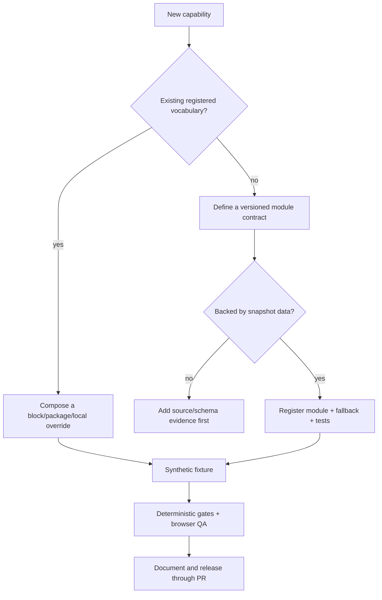

# Extending Wiki Viva Kit

Start from the semantic capability you need, not from a component or button.
Most extensions are declarations in the template/block vocabulary. Runtime code
is necessary only when the extension introduces new behavior that no registered
module provides.

The public v8 package is still a blocked release candidate. Treat the registry
contract below as the acceptance boundary: missing module metadata or generic
hosts must be implemented and tested in the kit before downstream authors rely
on them.

Current support is deliberately asymmetric. Authors can compose validated page
types, templates, blocks and experience packs, and can select runtime modules
already shipped by the trusted core. They cannot install arbitrary runtime code.
In particular, `sceneSystems`, `relationTypes`, `operatorCommands` and `effects`
are declarative-only descriptors today: adding an entry does not activate a
renderer, relation validator, command or effect. The future installable boundary
is the not-yet-shipped `wiki_runtime_extension.v1`; until it has ownership,
capability, consumer, fallback, lifecycle and rollback contracts, it is not a
plugin ABI.



## Non-negotiable invariants

- A real page is an entity. A quadrant, lens, overlay, region, family group,
  effect or surface is not.
- Components render runtime selectors and dispatch registered interactions;
  they do not own route state, transport or browser history.
- Visual behavior is derived from snapshot/block/runtime data. Decorative
  motion cannot invent semantic status.
- Static demo mode cannot execute writes. Operator writes are capability-
  guarded, localhost-first, idempotent, redacted and human-gated.
- Local/private adapters may extend public contracts but cannot weaken route,
  secret, privacy, operator or sample-fallback boundaries.
- A private-only core bug first becomes a synthetic public regression fixture.

The full model is in
[wiki-viva-v8-runtime-architecture.md](wiki-viva-v8-runtime-architecture.md).

## Future runtime module contract — not a v8 plugin ABI

When new runtime behavior is genuinely required, the public core change must
eventually satisfy this contract before it can become an installable extension:

| Field | Required meaning |
| --- | --- |
| `id` / contract version | Stable canonical identifier and independently reviewable version. |
| owner/layer | View, overlay, interaction, surface, scene system, primitive, effect, command or relation vocabulary. |
| dependencies | Required/optional modules and snapshot capabilities/paths. |
| incompatibilities | Exclusive slots or modules that cannot be active together. |
| ordering | Deterministic priority only where order has semantic meaning. |
| lifecycle | Initialization, cleanup, abort/dispose behavior. |
| feature flag | Rollout mode and compatibility behavior. |
| fallback | Accessible 2D/text behavior and failure reason. |
| explain | Redacted diagnostic: why this module exists/is active. |
| tests/migration | Synthetic fixtures, state tests, visual route and deprecation window. |

Duplicate IDs, cycles, missing dependencies/capabilities and incompatible
active modules are validation failures before rendering.

## Add a block

Use a block when an anchor/type needs to select existing interpretation,
interface, gate or skill behavior.

```yaml
blocks:
  local.block.customer-review.v1:
    kind: interface
    surface: panels
    scope:
      default_mode: descendants
    config:
      primitive_pack: review_first
```

Place a reusable public block in `wiki.templates.yaml`; place a downstream-only
block in `wiki.templates.local.yaml`; or use a `template_block` page when the
definition itself belongs to reviewed wiki memory. Attach it through a page
type, package or anchor frontmatter whose type permits blocks.

Authoring sequence:

1. choose only IDs from the published block/registry vocabulary;
2. declare scope and required snapshot inputs;
3. attach to a synthetic anchor and verify resolved origin/stack;
4. verify the selected surface/primitive/fallback exists in all input modes;
5. run audit, template tests, demo drift and visual QA.

YAML may compose registered behavior; it cannot introduce arbitrary code, CSS,
commands, data fields or semantic IDs. See
[modular-blocks.md](modular-blocks.md) for resolution rings and derived output.

## Add a canonical source

A source is a real page plus an optional configuration sidecar. Do not create a
frontend-only source card.

1. Create the source page with the registered source page type/template.
2. Link `config_ref` when extraction/search/business rules are source-specific.
3. Register channel, refresh policy, target pages and required perspectives.
4. Add an adapter reference/config — never credentials — when the source needs
   a new transport.
5. Produce a synthetic public adapter fixture before shared core behavior.
6. Verify lifecycle, freshness and last-attempt states separately.
7. Confirm raw extraction/indexing is never labelled `ingested`; integration
   and impact closure are required.

The source dock is selected by its block stack and source lifecycle capability;
adding a source does not require a new dock or route.

## Add a visual primitive

First prefer a registered primitive/pack. A block chooses the primitive by ID
and supplies only supported configuration.

A new primitive contract needs:

- stable ID and supported slots;
- exact snapshot/block input fields;
- semantic purpose and absence behavior;
- overlay-color/token mapping (color represents the active metric, not context);
- accessible text and non-color equivalent;
- reduced-motion behavior;
- 2D fallback;
- node/line/label/particle cost and degradation threshold;
- synthetic normal/stress fixtures and visual evidence.

If no source field supports the proposed mark, stop: visual inference is not a
data contract. Register the primitive in the public kit, then let blocks select
it. A local override may choose a public primitive but cannot register arbitrary
private rendering code that weakens budgets or accessibility.

## Add a person module

A person remains a canonical typed page, not a scene-only avatar.

1. Reuse the public `person` page contract unless a real new subtype is needed.
2. Put public-safe type/template changes in the kit; private-only fields and
   labels live in the local template/page-type extension.
3. Attach interpretation blocks for identity/intent, relations and evidence as
   required by the anchor.
4. Store source-backed relationship/cadence/commitment data on canonical pages
   or linked events; do not create an independent UI store.
5. Verify person selection, read and explicit recenter as distinct interactions.
6. Use a synthetic person fixture for public tests and redact private names in
   downstream visual QA.

Creating a person module must not require a new route grammar, dock or center
type. Its page ID is already a valid center when the page contract allows it.

## Add a page type

A new type needs a validation contract, Markdown body template and template
registry entry. Declare whether it is creatable, can anchor blocks, its local
projection defaults, required subpages/skills and fallback representation.

If a type cannot be created honestly through `wiki_new.py`, mark it
`creatable: false`. Generated/system types and ingestion events are never
offered as human-seeded content.

## Add a surface or interaction to the public core

The v8 implementation pattern is registry-first, but a new surface/interaction
is still a reviewed public-core contribution rather than a downstream plugin.
Do not follow the pre-v8 recipe of
adding one ID to the router, one branch to the app shell and another button to a
command bar.

For a surface:

1. define its input/output, focus/modal behavior and capability requirements;
2. register it in the surface registry with fallback and diagnostics;
3. let a block stack select it;
4. render it through the generic registered-surface host;
5. test focus restore, mobile occupancy, keyboard/fallback parity and route
   hydration if shareable.

For an interaction:

1. declare semantic and visual effects separately;
2. document mouse, touch, keyboard, command/deep-link and fallback behavior;
3. dispatch one typed event through `WorldRuntime`;
4. keep I/O in a registered effect/resource and reduce typed receipts;
5. test invalid transitions, history mode, retries/abort/idempotency and visual
   acknowledgement.

If adding one extension still requires unrelated manual branches, the registry
host is incomplete; fix the public architecture instead of documenting the
coupling as an extension API. Do not advertise downstream installation until
`wiki_runtime_extension.v1` has an end-to-end consumer and rollback proof.

## Public/private adapter decision

| Change | Public kit | Local adapter |
| --- | --- | --- |
| New reusable vocabulary/contract/gate | Required first. | Consume pinned public release. |
| Labels, enabled stacks, local templates | Public defaults. | Extend locally. |
| Private page fields/source config | Synthetic schema example only. | Keep private. |
| Core bug found with private data | Reproduce synthetically. | Do not patch shared core locally. |
| Operator capabilities | Secure public contract. | Narrow allowlist/localhost configuration. |
| Density policy | Public maximum budgets. | May be stricter, never looser. |

## Definition of done

- Contract/version, owner, dependencies, capability and fallback are explicit.
- Synthetic fixture covers success, absence, failure and compatibility paths.
- State/effect tests prove semantic invariants and stale/duplicate work safety.
- Architecture, snapshot, bundle and demo-drift gates pass.
- Desktop, mobile and forced-fallback browser evidence is clean and reproducible.
- EN/ES/PT labels and accessibility/reduced-motion behavior are covered.
- Public/private boundary and downstream rollback are documented.
- Guides/release notes describe the extension without requiring readers to
  reverse-engineer implementation internals.

Use the [downstream upgrade runbook](wiki-viva-v8-downstream-upgrade.md) to ship
the extension to consumers only after its public release SHA is pinned.
