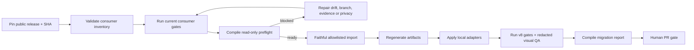

# Wiki Viva v8 downstream upgrade runbook

Use this runbook to upgrade a repository that consumes Wiki Viva Kit. It is a
review-first migration: the public kit supplies contracts and read-only checks;
the consumer owns its content, configuration, private evidence and PR.

This runbook implements the detailed v8 mechanics under the normative
[two-lane migration strategy](downstream-migration-two-lane-strategy.md). The
public release is certified once; a downstream consumer proves its exact delta,
current privacy/semantic invariants and reversible canary. Until the package
declares reusable and affected gate classes, however, its existing
`migration.required_gates` list remains fully blocking.

The machine-readable package lives in the public kit checkout under the v8
upgrade metadata directory. Do not start a downstream import while its
`release.status` is blocked or its `source_sha` is not an exact public commit.



## Package artifacts

| Artifact | Purpose | Publication boundary |
| --- | --- | --- |
| `upgrade-package.yaml` | Release pin, contract versions, allowlist, blocklist, gates and compatibility window. | Public kit checkout. |
| `impact-registry.yaml` | Versioned path + contract → surface → transitive gate selection. Unknown impact selects the full matrix and Lane A. | Public kit checkout; its canonical SHA is pinned by package v3. |
| `wiki-upgrade-release-capsule-v1.schema.json` | Immutable Lane A capsule binding source, package, portable tree, command registry, toolchain, executed gate receipts and visual manifest. | Public certification output only; a locally invented capsule has no authority. |
| `consumer-inventory.yaml` | Public-safe wave/status inventory. | Private paths, remotes, SHAs and drift filenames stay redacted. |
| `gate-evidence.example.json` | Exact current-gate receipts consumed by the legacy v2 preflight. | Store a filled private copy only under a git-ignored, untracked consumer evidence root; never commit it to the branch. |
| `migration-evidence.example.yaml` | Required post-import evidence. | Public export requires hashed/generic routes and no private content. |
| `docs/references/schemas/wiki-migration-evidence-v2.schema.json` | Deep input contract for commit, screenshot and rollback evidence. Portable: every faithful public import carries it next to `wiki_core/upgrade.py`. | Public kit checkout and every consumer; filled private evidence stays downstream. |
| `migration-report.schema.json` | Stable output contract for CI/PR tooling. | Public kit checkout. |

Inspection, inventory, preflight and `wiki_upgrade.py plan` are read-only with
respect to the consumer Git/tracked subject. `plan` writes only its sealed plan,
first-write clock anchor and preflight evidence under an ignored output boundary.
`wiki_upgrade.py adopt` is the deliberate Git mutation boundary: after plan
review it creates and verifies the atomic C1/C2/C3 commits, runs the selected
gates and writes ignored evidence.

The current validation boundary is declared by `upgrade-package.yaml`. Package
schema v3 keeps the validator-v5 migration-evidence boundary and adds
`gate_policies`, `command_registry_sha256` and the sealed impact-registry
reference. A tracked `candidate` package may mint a separately attested local
downstream-QA capsule; it still cannot authorize public release or production
promotion without the public human gate.

### Receipt identity and transition rule

Lane A certifies the immutable public subject. Lane B binds that capsule to the
consumer. These seven terms must match before an unfinished run may resume or a
receipt may be validated:

```text
source_sha + package_sha256 + portable_tree_sha256 + consumer_B0 + consumer_C3
+ command_registry_sha256 + toolchain_sha256
```

The capsule supplies all terms except `consumer_B0` and `consumer_C3`; the
adoption receipt supplies all seven. A changed C3 makes every prior consumer
gate, resume checkpoint, canary and report stale, while unchanged Lane A proof
remains attached to its exact public subject. A completed adoption receipt is
immutable historical evidence for its original PR/human gate, not replay
authority: the runner refuses a completed-run `--resume`. Reexecution requires
a new consumer subject and plan identity.

Do not apply v3's smaller affected-gate selection retroactively. Any migration
whose plan/preflight began under package schema v2 continues to execute every
entry in its original `migration.required_gates` list. Those receipts remain
valid only for their exact original subject. Finish and report that migration
under v2; use v3 only for a new plan.

The same transition rule applies to ownership discovered late. If consumer
`AGENTS.md`, its router or another non-`wiki-*` local skill was not included in
the sealed v2 C3, do not amend C3 or regenerate the v2 receipt. Promote or roll
back that exact subject first. Then create a fresh v3 follow-up from the new B0:
toolkit-owned `.skills/wiki-*/**` remain byte-equal C1, while consumer
`AGENTS.md`, router and non-`wiki-*` local skills belong to C3. Concurrent
domain content stays in its own later content PR.

### Exact config-bound C3 authority for new v3 plans

A localized layout is not a wildcard C3 permission. Before mutation, `plan`
reads the immutable Git blob at `consumer_B0:wiki.config.yaml` and derives a
closed authority with exactly three roles:

| Role | Exact B0-derived surface | Contract |
| --- | --- | --- |
| `command_reference_page` | `paths.command_reference_page` | One inert UTF-8 Markdown `.md` regular blob, mode `100644`. |
| `operational_pass_page` | `paths.operational_pass_page` | One inert UTF-8 Markdown `.md` regular blob, mode `100644`. |
| `release_records` | `<paths.references_root>/releases/**` | Only inert UTF-8 `.md` descendants committed as regular `100644` blobs. |

The sealed package contract is
`contract_versions.consumer_c3_authority = wiki_viva_upgrade_consumer_c3_authority.v1`.
The three roles must map exactly once to
`wiki_consumer_command_reference.v1`,
`wiki_consumer_operational_pass.v1` and
`wiki_consumer_release_record.v1`, respectively. Missing, duplicate or
ambiguous package/impact mapping selects Lane A and the full matrix because the
release policy must be repaired and recertified.

The live worktree and the C1/C2/C3 config versions are not authority and cannot
widen these paths. Executable mode, binary/NUL data, invalid UTF-8, secrets,
non-Markdown release descendants or any domain-content sibling fails closed.
All three roles are C3-only; placing them in C1 or C2 is a boundary error even
when the bytes would otherwise match. The canonical authority SHA-256 is bound
to the plan, mutation/resume state, receipt and private report. Any B0 config or
authority change requires a new plan and invalidates every C3-bound result.
Unknown path or contract impact selects Lane A and the full matrix. A missing,
malformed or unsafe `wiki.config.yaml` at B0 is instead a Lane B baseline
failure: `plan` stops before mutation, the consumer repairs B0 and creates a new
plan. Re-running Lane A does not repair invalid consumer configuration; it is
required when the sealed package/impact mapping itself is defective.

### Rc21 -> rc22 correction boundary

Rc21 is historical non-promotional local evidence. It retains its exact public
mobile/visual proof, but a synthetic downstream rehearsal exposed a missing
config-localized C3 authority and an over-broad release-record surface. It must
not be promoted, imported, relabeled or used to mint a production capsule.
Exact local rc22 source `7e72664fb6871d906addbddb6ed5b2e7f1fec33c`
implements the three-role authority, productive visual provenance, hardened
resume/evidence reads and their negative fixtures and passed the complete local
stack. Its tracked `candidate` status is local-QA-only. This runbook claims no
rc22 capsule at the pre-certification checkpoint and grants no public
publication authority.

### Lane A -> Lane B handoff checklist

A real handoff is an immutable release authority, not a branch name, mutable
checkout or pasted green-test summary. Lane A supplies the canonical package,
release capsule, portable subject/tree, sealed impact registry, command
registry, toolchain identity, visual manifest, executed gate receipts and
attestation. Both the raw archive SHA-256 and the attestation SHA-256 are
delivered through separately reviewed channels. Verify the raw archive digest
before extraction; only then execute the byte-equal runner restored from it.

Run the exact public source audits as pre-certification/PR gates. The capsule
seals only commands classified as `upstream_certified`; the consumer-owned
`audit` and `public_evidence_redaction` IDs are not reusable Lane A receipts and
must run again on every Lane B subject. A capsule that must attest a public
audit CLI needs a separately declared upstream-certified gate.

Before `plan`, the downstream operator must verify every supplied digest and
capsule contract fail-closed, freeze `consumer_B0`, and retain a handoff receipt
that binds the trusted authority, B0 and canonical plan digest. `plan` is
accepted only when it prints the exact C1/C2/C3 delta, affected contracts,
selected/omitted gates and invalidations without mutation. `adopt --resume`
is valid only after an interruption or declared pause and must use the same
authority, attestation and plan; it may not fall back to the live kit checkout.
Mismatch, unknown impact or missing authority stops before C1 and reports the
owning lane, affected contract and next action. No private consumer path,
route, payload or receipt is copied into the public capsule.

### Current private v2 transition checkpoint

As of 2026-07-14, the current authorized private technical PR remains an
in-flight v2 migration. Its exact C1/C2/C3 ownership is 74/836/21 paths; all 22
originally required gates, four real canary profiles, generated
private/public-redacted reports and disposable-clone rollback passed. Its two
deterministic hosted jobs pass, but the hosted visual matrix is still 100/102
on the only completed standard Apple Silicon attempt. A later attempt was
cancelled during browser installation, so the aggregate visual check is
currently cancelled/non-green. A separate first-attempt Intel diagnostic
closed 92/102 after software rendering and WebGL context failures. Consumer
`main` is unchanged.

Do not modify this C3 to add `AGENTS.md` or router work. Open that consumer
policy update as a new v3 follow-up after the v2 promotion and preserve all v2
receipts exactly. Keep concurrent domain content in a separate content PR. This
checkpoint deliberately omits private repository, PR number, domain label,
branch, SHA, path, route, payload and screenshot details.

## Choose the migration contract before executing

| Situation | Authoritative path | Evidence rule |
| --- | --- | --- |
| Migration already started under package schema v2 | Continue sections 2-9 of this legacy path, including the complete original `migration.required_gates` matrix, manual boundary review and v2 report compiler. | Keep all private gate/preflight/report inputs ignored and untracked; never reclassify or rewrite existing receipts. |
| New migration under a certified package schema v3 | Use `wiki_upgrade.py plan`, review its conceptual diff, then run `wiki_upgrade.py adopt` and `--resume` only after interruption or a declared CI pause. | `plan` executes/binds read-only preflight; `adopt` owns C1/C2/C3, gates, canary, receipts, reports and rollback. No manual gate-evidence or report transcription completes v3. |

The shared ownership, privacy and human-PR rules below apply to both contracts.
Sections explicitly marked **v2 only** are retained so an in-flight migration
can finish without changing its rules; a new v3 run must not execute that
manual evidence path in parallel with the runner.

## 1. Pin the public source

The release owner changes the package only after the release commit exists:

1. set `release.source_sha` to the exact public 40-character SHA;
2. set `release.status` to a non-blocked candidate/released state;
3. confirm the release note names the same SHA and contract versions;
4. rerun the public gates at that SHA.

`main`, `HEAD`, a branch name or `REQUIRED_AT_RELEASE` is not a release pin.

## 2. Validate inventory and prepare the consumer branch

```sh
python3 scripts/wiki_upgrade_inventory.py --check
git -C /path/to/consumer status --short
git -C /path/to/consumer switch -c wiki/upgrade-v8
```

Inventory fields cover repository type, kit version, localized layout, runtime,
operator capabilities, local templates/adapters, privacy risk, drift and wave.
A private consumer can appear publicly by a stable generic ID; exact local path,
remote, owner and consumer SHA belong only in its private preflight/report.

## 3. Record current gates — v2 only

Run the consumer's current gates before importing anything. Copy
`gate-evidence.example.json`, replace `consumer_head`, and record the exact
commands and statuses. The standard v8 preflight set is:

```sh
python3 scripts/wiki_toolkit_drift.py --ref-path /path/to/wiki-viva-kit --check
python3 scripts/wiki_audit.py --check
python3 scripts/wiki_input_stage.py --check
python3 -m pytest tests/
git diff --check
```

The drift command is package-aware in `--ref-path --check` mode. It reads the
canonical upgrade-package blob from one captured reference HEAD, verifies that
the declared full `release.source_sha` is a direct ancestor commit, disables
Git replacement objects and compares only paths selected by the package's
`portable_import` allow/block contract. Consumer-owned tests, workflows,
configuration, runtime adapters and memory are therefore preserved rather than
misreported as toolkit drift. A missing, modified or uncommitted package,
unavailable/non-commit source, unsafe ignore or authority mismatch exits
fail-closed; the command never falls back to the historical prefix comparison.

The preflight intentionally consumes receipts rather than executing arbitrary
commands declared by a downstream repository. Evidence is accepted only when
its `consumer_head` equals the checkout's current HEAD. Record toolkit drift as
`pass` when zero or `reviewed` when the exact non-zero delta is the planned
public import/adaptation set. `semantic_inventory` may be `reviewed` only when
the package explicitly authorizes it and the receipt carries a positive bounded
finding count, one opaque SHA-256 fingerprint, a non-empty note and
`planned_boundary=downstream_adaptations`. This exception exists so consumer
content references can be repaired in the third reviewable boundary without a
fourth pre-import commit. Audit, input stage, pytest and diff remain pass-only;
the final migration report still requires `semantic_inventory=pass`.

## 4. Compile read-only preflight — v2 only

Run the preflight from the KIT checkout (its package, inventory and pinned
`source_sha` are the authority), pointing `--kit-root` at that same checkout
and `--consumer-root` at the downstream repository:

```sh
python3 scripts/wiki_upgrade_preflight.py \
  --kit-root /path/to/wiki-viva-kit \
  --consumer-root /path/to/consumer \
  --consumer-id <inventory-id> \
  --checked-on 2026-07-09 \
  --gate-evidence /path/to/consumer/gate-evidence.json \
  --check
```

A consumer whose `privacy_risk` is not `public_safe` must also produce the
authoritative unredacted sidecar. Pass a consumer-root-relative `.json` path
that is git-ignored and untracked (the conventional location is
`output/wiki-upgrade/preflight-report.json`):

```sh
python3 scripts/wiki_upgrade_preflight.py \
  --kit-root /path/to/wiki-viva-kit \
  --consumer-root /path/to/consumer \
  --consumer-id <inventory-id> \
  --checked-on 2026-07-09 \
  --gate-evidence /path/to/consumer/gate-evidence.json \
  --private-evidence-ref output/wiki-upgrade/preflight-report.json \
  --check
```

The report is then written atomically only to that sidecar — never echoed to
stdout — and `consumer_before.preflight.report_ref` in the migration evidence
must reference exactly that file. Without an accepted sidecar the core forces
the redacted projection and the checked migration report cannot bind. A ref
that is tracked, not ignored or unsafely named is rejected before anything is
written.

Validator v5 also requires `consumer_before.memory_root` and
`consumer_before.references_root` as safe repository-relative paths. Both must
match the consumer's `configured_layout` and the exact `layout` captured by the
authoritative preflight; a localized root such as `docs/referencias` is valid,
but a self-attested or mismatched root is not. The two roots must be disjoint so
that the broad private-memory adaptation surface cannot bypass the narrower
release-record rule.

For evidence that may leave a private repo, add `--redact`. Redacted output
keeps aggregate counts and hashes only deliberately scoped identifiers such as
the consumer HEAD or snapshot ID. It emits neither local paths, drift filenames
nor one guessable hash per private worktree entry.

Preflight blocks when any of these are false:

- exact public release/SHA is ready;
- the pinned commit object exists in the kit checkout; portable drift is read
  from that exact Git tree, never from later files at the checkout's `HEAD`;
- branch uses `wiki/` and the worktree is clean;
- current-gate evidence belongs to current HEAD and passes;
- portable drift is zero or explicitly reviewed for the candidate wave;
- a required real snapshot exists;
- privacy risk is known and required redaction is active.

Snapshot schema drift and local overrides are explicit warnings. A warning is
an adaptation decision, never permission to overwrite local files.

This preflight is the pre-mutation decision artifact. A v3 runner must bind it
to the later C1/C2/C3 plan; a post-C3 inventory alone cannot claim that the
conceptual diff was reviewed before the import.

## 5. Import only portable files — manual v2 path

The blocklist wins over the allowlist. Toolkit-owned `.skills/wiki-*/**` are
portable C1 bytes, while `AGENTS.md` and all other repo-local skills are
consumer-owned C3 routing policy. In particular, the default import never
includes memory roots, `wiki.config.yaml`, targets, local templates, raw/cache
data, private snapshots, `.env` files, credentials, downstream evidence or the
consumer-owned `apps/wiki-cockpit/public/wiki-cockpit.config.json` runtime
configuration or `wiki.adapter-manifest.json` adapter identity. It also never
copies `wiki.packs.lock.yaml` or `.wiki-viva/`:
the public registry and pack sources are portable, while installed-pack state,
receipts and immutable bundles belong to the consumer.

Use a reviewed file-transfer/diff workflow and stage only paths accepted by
`portable_import`. Keep three commit boundaries:

1. `import: faithful Wiki Viva v8 public kit at <SHA>` — portable files only;
2. `build: regenerate v8 snapshot/demo artifacts` — only reproducible artifacts;
3. `adapt: preserve downstream layout/templates/operator policy` — local
   configuration, adapters, `AGENTS.md`, non-`wiki-*` repo-local skills and the
   consumer-owned release record, with conflict warnings recorded.

For v3, do not stage or commit these boundaries manually. Review the same
ownership in `plan`; after approval, `adopt` materializes and verifies the
three direct single-parent atomic commits from package bytes, registered
generators and declared C3 adapter commands. An intermediate or merge commit
between B0/C1/C2/C3 is a hard failure even when the net file diff looks valid.

The release record is authored only in the third commit and only below the
configured `<references_root>/releases/**` subtree, for example
`docs/referencias/releases/<release-id>.md`. It records the pinned public
release plus downstream decisions; it is neither a faithful import nor a
generated artifact. A release record must be an inert UTF-8 Markdown `.md`
regular file committed with mode `100644`; scripts, executable files and binary
payloads are rejected. Files beside `releases/` remain rejected, as do any
release paths that the package itself classifies as portable. Canonical path
checks, secret scanning and migration-evidence exclusions still apply.

For a v3 run, that subtree and the two exact configured technical pages are the
sealed B0-derived roles above, not manually asserted paths. They never belong
to C1 or C2, and editing `wiki.config.yaml` in C3 cannot authorize its own
postimage. The v2-only validator language in this section remains solely for a
frozen v2 migration and must not be used to rewrite its evidence.

If a consumer reveals a core bug, stop. Reproduce it with synthetic public data
and fix/test it in `wiki-viva-kit` before importing the corrected public SHA.

## 6. Apply local adapters without weakening invariants

Allowed local specialization includes display labels, i18n, enabled block
stacks, reviewed merges into consumer base and `.local` template/page-type
registries, source-adapter references, density policies inside public budgets
and localhost operator capability configuration. In v3 those registry merges
must be declared C3 adapter commands; they are blocked from byte-equal C1.

Compile those consumer-owned files into the tracked adapter identity, commit
the manifest/config/adapters together, and verify the clean subject before the
browser gate:

```sh
python3 scripts/wiki_adapter_manifest.py build --file <tracked-adapter> [--file <tracked-adapter> ...]
git add wiki.adapter-manifest.json <tracked-adapter> apps/wiki-cockpit/public/wiki-cockpit.config.json
git commit -m "adapt: bind downstream adapter identity"
python3 scripts/wiki_adapter_manifest.py check
```

The runtime config must publish both
`adapter_manifest: "wiki.adapter-manifest.json"` and the compiled
`adapter_hash`. See the
[adapter manifest contract](downstream-adapter-manifest.md).

Local overrides must not weaken route grammar, turn quadrants/regions into
entities, bypass `WorldRuntime`, disable secret scanning, allow sample fallback
on a real route, relax operator security or cross the public/private boundary.

### Seal and execute the v3 adoption plan

Before C1 exists, `plan` itself executes the package-required read-only B0
preflight and a package with a certified Lane A capsule and sealed impact
registry compiles one sealed, reviewable plan.
`plan` never mutates the consumer Git/tracked subject; it writes only sealed,
ignored planning evidence. After explicit review, `adopt` owns the atomic
C1/C2/C3 commits and refuses any byte or ownership drift:

```sh
python3 /path/to/clean-public-subject/scripts/wiki_visual_evidence.py capture \
  --package /path/to/upgrade-package.yaml \
  --source-root /path/to/clean-public-subject \
  --source-sha <exact-source-sha> \
  --out-dir /path/to/verified-visual-authority

python3 /path/to/clean-public-subject/scripts/wiki_visual_evidence.py verify \
  --package /path/to/upgrade-package.yaml \
  --source-root /path/to/clean-public-subject \
  --source-sha <exact-source-sha> \
  --visual-root /path/to/verified-visual-authority

python3 /path/to/clean-public-subject/scripts/wiki_upgrade.py certify \
  --package /path/to/upgrade-package.yaml \
  --impact-registry /path/to/impact-registry.yaml \
  --source-root /path/to/clean-public-subject \
  --visual-root /path/to/verified-visual-authority \
  --visual-manifest-ref visual-manifest.json \
  --out-dir /path/to/new-immutable-release-authority \
  --attestation-authority-id <reviewed-authority-id>

python3 /path/to/clean-public-subject/scripts/wiki_upgrade.py verify-capsule \
  --package /path/to/upgrade-package.yaml \
  --capsule /path/to/new-immutable-release-authority/release-capsule.json \
  --impact-registry /path/to/impact-registry.yaml \
  --authority /path/to/new-immutable-release-authority/release-authority.json \
  --trusted-attestation-sha256 <out-of-band-sha256> \
  --kit-root /path/to/clean-public-subject

python3 /path/to/restored-release-authority/public-kit/scripts/wiki_upgrade.py plan \
  --package /path/to/restored-release-authority/upgrade-package.yaml \
  --capsule /path/to/restored-release-authority/release-capsule.json \
  --impact-registry /path/to/restored-release-authority/impact-registry.yaml \
  --authority /path/to/restored-release-authority/release-authority.json \
  --trusted-attestation-sha256 <out-of-band-sha256> \
  --kit-root /path/to/restored-release-authority/public-kit \
  --consumer-root /path/to/consumer \
  --consumer-b0 <B0> \
  --preflight-command 'audit::python3 scripts/wiki_audit.py --check' \
  --c2-generator-command 'demo_snapshot::python3 scripts/wiki_build_demo.py' \
  --c2-generator-command 'visual_baselines::npm --prefix apps/wiki-cockpit run test:visual:update' \
  --c3-adapter-command 'consumer-adapter::/path/to/reviewed-consumer-adapter.sh' \
  --out /path/to/consumer/.wiki-viva/upgrade/plan.json
```

The visual bundle must exactly and uniquely cover the package profiles with
record-backed PNG/source/package/Chromium/console/network evidence; hand-authored
manifest claims are insufficient. `verify-capsule` reopens package, portable
tree, command/impact registry, live toolchain, visual records, gate outputs,
attestation and certification receipt without a consumer and emits a path-free
summary. Successful Lane A gate logs are also public evidence: the versioned
quiet/TAP reporters must prevent host-path output rather than relying on later
redaction.

Review the proposed C1/C2/C3 ownership, changed paths/contracts, selected and
omitted gates, capsule reuse, invalidations and conceptual diff. The plan must
bind the accepted preflight and fail closed on an unavailable capsule,
dirty/ambiguous baseline, unknown impact or unsafe evidence path; it must never
silently fall back to the live kit checkout instead of the pinned source.
`preflight_sha256` seals the exact unsigned execution payload. The
acceptance-attempt identity separately hashes the complete exact preflight
object, including that internal digest; replacing and coherently resealing
preflight therefore creates a different attempt and cannot reuse the original
external acceptance anchor.
Repeat `--c2-generator-command ID::COMMAND` for the package's independent
generators. The runner replays them from C1 in a disposable clone, retains the
real output log and accepts C2 only when the generated bytes match exactly; a
hand-authored `provenance: executed` sidecar is not evidence. Repeat
`--c3-adapter-command ID::COMMAND` for every reviewed consumer-owned adapter;
the runner accepts no undeclared C3 mutation.

The resumable v3 path executes the reviewed plan and generates its evidence:

```sh
python3 /path/to/restored-release-authority/public-kit/scripts/wiki_upgrade.py adopt \
  --plan /path/to/consumer/.wiki-viva/upgrade/plan.json \
  --package /path/to/restored-release-authority/upgrade-package.yaml \
  --capsule /path/to/restored-release-authority/release-capsule.json \
  --impact-registry /path/to/restored-release-authority/impact-registry.yaml \
  --authority /path/to/restored-release-authority/release-authority.json \
  --trusted-attestation-sha256 <out-of-band-sha256> \
  --trusted-acceptance-anchor-sha256 <sha256-emitted-by-plan> \
  --kit-root /path/to/restored-release-authority/public-kit \
  --consumer-root /path/to/consumer \
  --mode canary
```

Capture `acceptance_anchor_sha256` from the successful `plan` summary and keep
it outside `.wiki-viva/`. The anchor is first-write for the exact attempt, so a
second identical plan keeps the original start time. `adopt` and every resume
must receive that captured value; they reject a missing, replaced or
coherently rewritten anchor before C1 and never derive trust from the restored
file itself. In CI the digest is a job output bound into the externally hashed
handoff archive.

The canary invocation emits `canary_completion_anchor_sha256` after the exact
selected real-canary projection completes. Keep that digest outside
`.wiki-viva/` as a second first-write authority. Any subsequent invocation adds
`--trusted-canary-completion-anchor-sha256 <captured-sha256>`; a post-canary
resume rejects a missing, replaced or coherently resealed completion anchor.

For split CI, the canary job adds `--pause-before-background`. The background
job depends on canary, downloads that exact same consumer/run handoff and runs
the same command with `--resume` plus the externally captured canary-completion
digest; it must never start from a fresh public-only checkout or manufacture a
second consumer identity.

Use `--resume` only after the first adoption invocation was interrupted or
stopped at `--pause-before-canary`/`--pause-before-background`. A completed run
fails `completed_run_not_resumable`; use its generated report in the original
PR/human gate rather than invoking the runner again.

`--resume` is not a bypass. The checkpoint must match both the canonical plan
digest and the complete seven-term receipt identity. Before reusing one result,
if a materialized execution plan exists, the runner first reruns every
registered C2 command from C1 in a disposable clone and requires exact equality
of the complete C2 path set, Git modes and blob digests. Missing or divergent
replay fails before gates. The runner then rechecks both external anchors, the complete B0/C1/C2/C3 direct Git
chain, the canonical package/impact-selected gate set, the command digest,
byte-equal runner/toolchain closure and output digest. The toolchain probe uses
the same Python interpreter that is executing the runner. A stale
result is invalidated and rerun; a stale or modified plan is rejected.
Each boundary projection binds regular-file mode plus blob digest; symlinks,
submodules and special entries fail closed. Public keys, values, canary routes
and gate output are checked literally and after bounded repeated
percent-decoding.

Every v3 Lane B plan has a contractual plan-to-real-canary wall-clock budget of
**<= 20 minutes**; `ordinary_no_core_change` is the required public conformance
case, not a switch that weakens other plans. Timing starts when the read-only
`plan` command starts and stops when the selected current-C3 real-canary gates
complete. The clock survives `--resume` and cross-job handoffs, so queue or
wait time after `plan` counts. C1/C2/C3, `consumer_always`, `affected` and
canary work are inside the clock. Work before `plan`, plus explicit
`background_certification`, final report generation, rollback verification and
the later human gate, are outside this metric but remain mandatory. A breach
still completes those later proofs, then seals a blocked receipt with status
`exceeded`, elapsed milliseconds, Lane B, the affected contract and the next
action; it cannot be silently paused, reused or relabeled as a passing fast
path. Existing v2 evidence is not retroactively benchmarked against this v3
contract.

## 7. Run post-import gates and visual QA

For an in-flight v2 migration, the exact commands listed in
`migration.required_gates` remain one complete blocking matrix. At minimum,
record drift, audit, methodology coverage, operation/input-stage compilers,
Python tests, snapshot contract, architecture, bundle, demo drift and
`git diff --check`. The v8 package additionally requires the public-export
privacy boundary, `wiki_pack.py validate --all`, asset provenance, exact
release-matrix contract and the subject-bound downstream browser gate.

For a new v3 plan, the runner reads the package's five gate classes and the
sealed impact registry. It may reuse only verified `upstream_certified` proof;
it always runs `consumer_always`, selects `affected` through path + contract
impact, runs `canary` on the final served consumer and schedules declared
`background_certification`. Unknown path/contract impact or any portable-core
surface selects the full catalog and requires a new Lane A capsule.
Every selected background gate marked `required_for_promotion` must pass before
the run becomes `promotion_ready`; a reversible `compat` merge after canary is
not promotion of v8 as the default runtime.

These gate IDs can never be omitted or reused: `audit`,
`public_evidence_redaction`, `input_stage`, `semantic_inventory`,
`adapter_identity`, `snapshot_contract`, `real_canary`, `diff_check` and
`rollback_report_verification`. An omission is valid only with exact capsule
proof for an upstream gate or the current impact derivation for an unaffected
gate. Every other omission blocks promotion.

The downstream preflight/browser attestation must match the snapshot's exact
temporal-event, temporal-graph and experience-pack-composition versions, the
composition semantic hash and the explicit active-pack set. An empty set is a
valid declared state; omission is not. A private Finance pilot begins with
`install personal-finance --dry-run`, review of the conceptual diff and an
explicit mutation on the existing `wiki/*` branch. It never begins by copying
the public kit's empty lock.

Downstream visual evidence covers desktop, mobile and forced fallback. Each
entry records route/center reference, viewport, browser, screenshot, console,
network and `sample_fallback=false`. A public report uses
`route:sha256:<digest>`, `center:sha256:<digest>` or a public fixture ID — never
private titles, values, authenticated URLs or raw console/network payloads.

### Restart/security replay

An operator started before the v6/default-deny payload is not valid downstream
evidence, even if its health response contains a Codex block. Stop both old
processes normally and use two terminals from the consumer checkout:

```sh
# terminal 1 — repository root
python3 scripts/wiki_web_server.py --host 127.0.0.1 --port 8765

# terminal 2 — repository root
npm --prefix apps/wiki-cockpit run dev:proxy
```

From `apps/wiki-cockpit/`, run the shared, nonce-safe readback:

```sh
node --input-type=module <<'NODE'
import { validateOperatorHandshake } from "./src/contracts/operatorSecurity.js";
const response = await fetch("http://127.0.0.1:5173/api/health", {
  headers: { accept: "application/json" }, cache: "no-store"
});
const result = validateOperatorHandshake(await response.json());
if (!response.ok || !result.ok) {
  console.error(result.errors.join("; ") || `health failed: ${response.status}`);
  process.exit(1);
}
console.log("operator handshake current: v6 / security v2 / default-deny CORS");
NODE
```

The accepted contract is `wiki_web_server.v6`,
`wiki_operator_security.v2`, a present nonce under
`X-Wiki-Operator-Nonce`, attempt keys under `X-Wiki-Attempt-Key`, bounded
`post_only` mutations, browser-origin default `deny`, exact loopback allowlist
opt-in and all three required capabilities: `operator_security_v2`,
`cors_default_deny_v1` and `action_state_transitions_v1`. In the cockpit, open
Codex diagnostics and choose **Re-verify** / **Re-verificar**; the operator rung
must recover without reload. Record the exact downstream preflight and 2/2
browser receipt only after this readback passes.

## 8. Compile the migration report — v2 only

Generate a fillable evidence document:

```sh
python3 scripts/wiki_upgrade_report.py --template \
  > /path/to/consumer/wiki-v8-migration-evidence.yaml
```

Compile and validate it:

```sh
python3 scripts/wiki_upgrade_report.py \
  --evidence /path/to/consumer/wiki-v8-migration-evidence.yaml \
  --consumer-root /path/to/consumer \
  --kit-root /path/to/wiki-viva-kit \
  --json-out /path/to/consumer/wiki-v8-migration-report.json \
  --markdown-out /path/to/consumer/wiki-v8-migration-report.md \
  --verify-rollback \
  --check
```

`--kit-root` is required with `--check`: boundary byte-equality and the final
drift-zero proof are verified against the pinned public tree in that checkout.

Checked gate claims are never self-declared. Each `gates[]` entry must use the
exact command registered in the package's `migration.gate_commands`, and
`gates_receipt_ref` must point to a git-ignored, untracked JSON receipt of the
executed runs (conventional location `output/wiki-upgrade/gate-receipts.json`)
recording command provenance, exit code and output hash per gate and pinning the
final migration boundary as `captured_consumer_head`. A v3 adoption receipt
also binds the capsule, impact derivation, plan digest, complete seven-term
identity, C1/C2/C3 ownership, omissions, resume state and executed
rollback/report verification.

Add `--public-export` only after routes/evidence are redacted. That mode blocks
PII, access-secret patterns, absolute local paths, URL query strings and raw
route/center identifiers.

The checked report cannot be `complete` without distinct, ancestry-ordered,
single-parent commits for all three package-declared boundaries
(`faithful_public_import`, `regenerated_artifacts`, `downstream_adaptations`).
In v5 no declared boundary is optional: `omitted_boundaries` must be empty and
each boundary diff must exactly equal its declared path array. The evidence's
memory and references roots must also bind to the configured and preflight
layouts.
The package digest, validator version and captured consumer HEAD must match;
every screenshot must be a real repo-relative PNG bound by SHA-256, byte count,
dimensions and the final migration HEAD. The command must contain every
non-null migration SHA in reverse boundary order, and `--verify-rollback` must
restore the previous Git tree in a disposable clone. Compilation without
`--check` remains useful for drafting, but it is not release evidence.

The resumable runner keeps raw command/browser evidence private and writes a
path-free JSON/Markdown report containing typed aggregates and hashes from that
same execution. It must also capture package-declared PNG profiles, dimensions
and hashes plus sanitized console/network summaries. Plan, checkpoint, logs,
screenshots, receipts and reports remain ignored/untracked; manual
transcription cannot make the report complete.

## 9. Roll back per repository

First-line recovery is runtime-level: switch the adaptation from `v8` to
`compat` or `legacy`, preserving the same route grammar and safety boundaries.
Do not disable secret/publication/sample-fallback gates.

Second-line recovery is commit-level:

```sh
git revert --no-commit <adaptation-commit> <artifact-commit> <import-commit>
git diff -- wiki.config.yaml wiki.targets.yaml wiki.templates.local.yaml memories/ memorias/
git commit -m "revert: roll back Wiki Viva v8 import"
```

For the current v8 contract all three boundaries are mandatory and ancestry
ordered; a missing C1, C2 or C3 blocks the report instead of being omitted.
Review the diff before committing; the portable import never owned local
configs or memory roots. If only generated private artifacts are wrong,
revert/regenerate the artifact commit rather than blindly reverting public
core. The runner executes this reverse-order rollback in a disposable clone and
compares the restored tree to B0 before declaring it verified.

## 10. Advance waves

The order is public kit, private pilot, wave 1, wave 2. A later wave starts only
after the previous one has a complete migration report and every discovered
core bug has a synthetic public regression test. Repositories remain paused
when drift, dirty worktrees, secret-adjacent configuration, missing gates or
unredactable QA prevent honest evidence.
