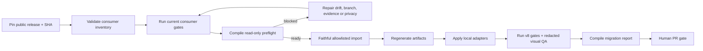

# Wiki Viva v8 downstream upgrade runbook

Use this runbook to upgrade a repository that consumes Wiki Viva Kit. It is a
review-first migration: the public kit supplies contracts and read-only checks;
the consumer owns its content, configuration, private evidence and PR.

The machine-readable package lives in the public kit checkout under the v8
upgrade metadata directory. Do not start a downstream import while its
`release.status` is blocked or its `source_sha` is not an exact public commit.



## Package artifacts

| Artifact | Purpose | Publication boundary |
| --- | --- | --- |
| `upgrade-package.yaml` | Release pin, contract versions, allowlist, blocklist, gates and compatibility window. | Public kit checkout. |
| `consumer-inventory.yaml` | Public-safe wave/status inventory. | Private paths, remotes, SHAs and drift filenames stay redacted. |
| `gate-evidence.example.json` | Exact current-gate receipts consumed by preflight. | Store the filled copy in the consumer branch or local evidence directory. |
| `migration-evidence.example.yaml` | Required post-import evidence. | Public export requires hashed/generic routes and no private content. |
| `migration-evidence.schema.json` | Deep input contract for commit, screenshot and rollback evidence. | Public kit checkout; filled private evidence stays downstream. |
| `migration-report.schema.json` | Stable output contract for CI/PR tooling. | Public kit checkout. |

The Python tools are read-only unless an explicit output path is supplied. They
never copy toolkit files and never change the consumer checkout.

## 1. Pin the public source

The release owner changes the package only after the release commit exists:

1. set `release.source_sha` to the exact public 40-character SHA;
2. set `release.status` to a non-blocked candidate/released state;
3. confirm the release note names the same SHA and contract versions;
4. rerun the public gates at that SHA.

`main`, `HEAD`, a branch name or `REQUIRED_AT_RELEASE` is not a release pin.

## 2. Validate inventory and prepare the consumer branch

```sh
/opt/anaconda3/bin/python scripts/wiki_upgrade_inventory.py --check
git -C /path/to/consumer status --short
git -C /path/to/consumer switch -c wiki/upgrade-v8
```

Inventory fields cover repository type, kit version, localized layout, runtime,
operator capabilities, local templates/adapters, privacy risk, drift and wave.
A private consumer can appear publicly by a stable generic ID; exact local path,
remote, owner and consumer SHA belong only in its private preflight/report.

## 3. Record current gates

Run the consumer's current gates before importing anything. Copy
`gate-evidence.example.json`, replace `consumer_head`, and record the exact
commands and statuses. The standard v8 preflight set is:

```sh
/opt/anaconda3/bin/python scripts/wiki_toolkit_drift.py --ref-path /path/to/wiki-viva-kit --check
/opt/anaconda3/bin/python scripts/wiki_audit.py --check
/opt/anaconda3/bin/python scripts/wiki_input_stage.py --check
/opt/anaconda3/bin/python -m pytest tests/
git diff --check
```

The preflight intentionally consumes receipts rather than executing arbitrary
commands declared by a downstream repository. Evidence is accepted only when
its `consumer_head` equals the checkout's current HEAD. Record toolkit drift as
`pass` when zero or `reviewed` when the exact non-zero delta is the planned
public import/adaptation set. `semantic_inventory` may be `reviewed` only when
the package explicitly authorizes it and the receipt carries a positive bounded
finding count, one opaque SHA-256 fingerprint, a non-empty note and
`planned_boundary=downstream_adaptations`. This exception exists so consumer
content references can be repaired in the third reviewable boundary without a
fourth pre-import commit. Audit, input stage, pytest and diff remain pass-only;
the final migration report still requires `semantic_inventory=pass`.

## 4. Compile read-only preflight

```sh
/opt/anaconda3/bin/python scripts/wiki_upgrade_preflight.py \
  --consumer-root /path/to/consumer \
  --consumer-id <inventory-id> \
  --checked-on 2026-07-09 \
  --gate-evidence /path/to/consumer/gate-evidence.json \
  --check
```

For evidence that may leave a private repo, add `--redact`. Redacted output
keeps aggregate counts and hashes only deliberately scoped identifiers such as
the consumer HEAD or snapshot ID. It emits neither local paths, drift filenames
nor one guessable hash per private worktree entry.

Preflight blocks when any of these are false:

- exact public release/SHA is ready;
- the pinned commit object exists in the kit checkout; portable drift is read
  from that exact Git tree, never from later files at the checkout's `HEAD`;
- branch uses `wiki/` and the worktree is clean;
- current-gate evidence belongs to current HEAD and passes;
- portable drift is zero or explicitly reviewed for the candidate wave;
- a required real snapshot exists;
- privacy risk is known and required redaction is active.

Snapshot schema drift and local overrides are explicit warnings. A warning is
an adaptation decision, never permission to overwrite local files.

## 5. Import only portable files

The blocklist wins over the allowlist. In particular, the default import never
includes memory roots, `wiki.config.yaml`, targets, local templates, raw/cache
data, private snapshots, `.env` files, credentials, downstream evidence or the
consumer-owned `apps/wiki-cockpit/public/wiki-cockpit.config.json` runtime
configuration or `wiki.adapter-manifest.json` adapter identity. It also never
copies `wiki.packs.lock.yaml` or `.wiki-viva/`:
the public registry and pack sources are portable, while installed-pack state,
receipts and immutable bundles belong to the consumer.

Use a reviewed file-transfer/diff workflow and stage only paths accepted by
`portable_import`. Keep three commit boundaries:

1. `import: faithful Wiki Viva v8 public kit at <SHA>` — portable files only;
2. `build: regenerate v8 snapshot/demo artifacts` — only reproducible artifacts;
3. `adapt: preserve downstream layout/templates/operator policy` — local
   configuration and adapters, with conflict warnings recorded.

If a consumer reveals a core bug, stop. Reproduce it with synthetic public data
and fix/test it in `wiki-viva-kit` before importing the corrected public SHA.

## 6. Apply local adapters without weakening invariants

Allowed local specialization includes display labels, i18n, enabled block
stacks, local template/page-type extensions, source-adapter references, density
policies inside public budgets and localhost operator capability configuration.

Compile those consumer-owned files into the tracked adapter identity, commit
the manifest/config/adapters together, and verify the clean subject before the
browser gate:

```sh
python3 scripts/wiki_adapter_manifest.py build --file <tracked-adapter> [--file <tracked-adapter> ...]
git add wiki.adapter-manifest.json <tracked-adapter> apps/wiki-cockpit/public/wiki-cockpit.config.json
git commit -m "adapt: bind downstream adapter identity"
python3 scripts/wiki_adapter_manifest.py check
```

The runtime config must publish both
`adapter_manifest: "wiki.adapter-manifest.json"` and the compiled
`adapter_hash`. See the
[adapter manifest contract](downstream-adapter-manifest.md).

Local overrides must not weaken route grammar, turn quadrants/regions into
entities, bypass `WorldRuntime`, disable secret scanning, allow sample fallback
on a real route, relax operator security or cross the public/private boundary.

## 7. Run post-import gates and visual QA

The exact commands are listed in `migration.required_gates` in the package.
At minimum, record drift, audit, methodology coverage, operation/input-stage
compilers, Python tests, snapshot contract, architecture, bundle, demo drift and
`git diff --check`. The v8 package additionally requires the public-export
privacy boundary, `wiki_pack.py validate --all`, asset provenance, exact
release-matrix contract and the subject-bound downstream browser gate.

The downstream preflight/browser attestation must match the snapshot's exact
temporal-event, temporal-graph and experience-pack-composition versions, the
composition semantic hash and the explicit active-pack set. An empty set is a
valid declared state; omission is not. A private Finance pilot begins with
`install personal-finance --dry-run`, review of the conceptual diff and an
explicit mutation on the existing `wiki/*` branch. It never begins by copying
the public kit's empty lock.

Downstream visual evidence covers desktop, mobile and forced fallback. Each
entry records route/center reference, viewport, browser, screenshot, console,
network and `sample_fallback=false`. A public report uses
`route:sha256:<digest>`, `center:sha256:<digest>` or a public fixture ID — never
private titles, values, authenticated URLs or raw console/network payloads.

### Restart/security replay

An operator started before the v6/default-deny payload is not valid downstream
evidence, even if its health response contains a Codex block. Stop both old
processes normally and use two terminals from the consumer checkout:

```sh
# terminal 1 — repository root
python3 scripts/wiki_web_server.py --host 127.0.0.1 --port 8765

# terminal 2 — repository root
npm --prefix apps/wiki-cockpit run dev:proxy
```

From `apps/wiki-cockpit/`, run the shared, nonce-safe readback:

```sh
node --input-type=module <<'NODE'
import { validateOperatorHandshake } from "./src/contracts/operatorSecurity.js";
const response = await fetch("http://127.0.0.1:5173/api/health", {
  headers: { accept: "application/json" }, cache: "no-store"
});
const result = validateOperatorHandshake(await response.json());
if (!response.ok || !result.ok) {
  console.error(result.errors.join("; ") || `health failed: ${response.status}`);
  process.exit(1);
}
console.log("operator handshake current: v6 / security v2 / default-deny CORS");
NODE
```

The accepted contract is `wiki_web_server.v6`,
`wiki_operator_security.v2`, a present nonce under
`X-Wiki-Operator-Nonce`, attempt keys under `X-Wiki-Attempt-Key`, bounded
`post_only` mutations, browser-origin default `deny`, exact loopback allowlist
opt-in and all three required capabilities: `operator_security_v2`,
`cors_default_deny_v1` and `action_state_transitions_v1`. In the cockpit, open
Codex diagnostics and choose **Re-verify** / **Re-verificar**; the operator rung
must recover without reload. Record the exact downstream preflight and 2/2
browser receipt only after this readback passes.

## 8. Compile the migration report

Generate a fillable evidence document:

```sh
/opt/anaconda3/bin/python scripts/wiki_upgrade_report.py --template \
  > /path/to/consumer/wiki-v8-migration-evidence.yaml
```

Compile and validate it:

```sh
/opt/anaconda3/bin/python scripts/wiki_upgrade_report.py \
  --evidence /path/to/consumer/wiki-v8-migration-evidence.yaml \
  --consumer-root /path/to/consumer \
  --json-out /path/to/consumer/wiki-v8-migration-report.json \
  --markdown-out /path/to/consumer/wiki-v8-migration-report.md \
  --verify-rollback \
  --check
```

Add `--public-export` only after routes/evidence are redacted. That mode blocks
PII, access-secret patterns, absolute local paths, URL query strings and raw
route/center identifiers.

The checked report cannot be `complete` without distinct, ancestry-ordered
before/import and every non-null artifact/adaptation boundary that exists in
`--consumer-root`. Every omitted optional boundary needs an explicit reason.
The package digest, validator version and captured consumer HEAD must match;
every screenshot must be a real repo-relative PNG bound by SHA-256, byte count,
dimensions and the final migration HEAD. The command must contain every
non-null migration SHA in reverse boundary order, and `--verify-rollback` must
restore the previous Git tree in a disposable clone. Compilation without
`--check` remains useful for drafting, but it is not release evidence.

## 9. Roll back per repository

First-line recovery is runtime-level: switch the adaptation from `v8` to
`compat` or `legacy`, preserving the same route grammar and safety boundaries.
Do not disable secret/publication/sample-fallback gates.

Second-line recovery is commit-level:

```sh
git revert --no-commit <adaptation-commit> <artifact-commit> <import-commit>
git diff -- wiki.config.yaml wiki.targets.yaml wiki.templates.local.yaml memories/ memorias/
git commit -m "revert: roll back Wiki Viva v8 import"
```

Omit commits that were not created. Review the diff before committing; the
portable import never owned local configs or memory roots. If only generated
private artifacts are wrong, revert/regenerate the artifact commit rather than
blindly reverting public core.

## 10. Advance waves

The order is public kit, private pilot, wave 1, wave 2. A later wave starts only
after the previous one has a complete migration report and every discovered
core bug has a synthetic public regression test. Repositories remain paused
when drift, dirty worktrees, secret-adjacent configuration, missing gates or
unredactable QA prevent honest evidence.
