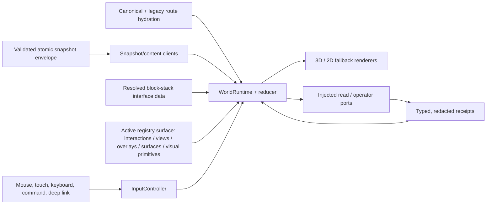
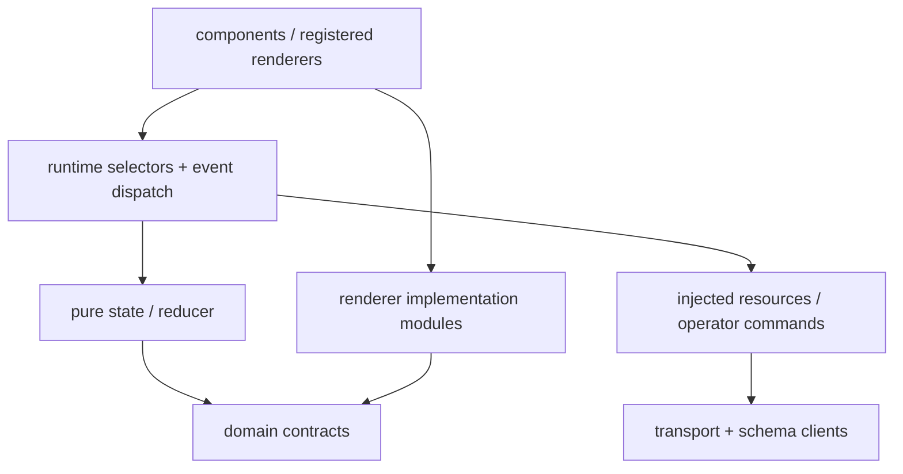

# Wiki Viva v8 runtime architecture

Wiki Viva v8 exposes one living world, not a collection of unrelated dashboard
routes. Real pages remain entities; view, lens, overlay, region and UI surfaces
are projections or controls around an active real-page center.

This page is the v8 acceptance contract. A registry field, boundary or failure
behavior described here that is not yet enforced in code/tests remains a release
blocker; documentation does not make an incomplete implementation compatible.

## World grammar

| Concept | Owns | Never becomes |
| --- | --- | --- |
| Center | A real page ID that defines the current local world. | A quadrant, region, group, lens or visual node. |
| View | Registered geometry such as quadrants, radar, sources or work. | An entity or metric. |
| Lens | Semantic projection such as Q1–Q4, type, relations or source state. | A center or geometry. |
| Overlay | Metric encoding such as attention, freshness, actions, ownership, evidence or quality. | A relayout or entity. |
| Group | A real family grouping (`family:*`) within the world. | A synthetic replacement center. |
| Selection / hover | Explicit selection or ephemeral inspection. | Implicit recentering. |
| Reader / dock | Registered content and work surfaces. | A second navigation system. |
| Fallback | Equivalent 2D rendering of the same semantic state. | Silent sample data or a route reset. |

Canonical writers emit `center`, `view`, `lens`, `overlay`, optional `group`,
real-page selection/reader and registered dock state. Legacy routes normalize at
the hydration boundary, emit warnings and never write deprecated forms back.

## State ownership

| Partition | Examples | Persistence |
| --- | --- | --- |
| Shareable semantic | center, view, lens, overlay, family group, selected page, reader, dock, explicit fallback | Canonical URL and reducer. |
| Ephemeral interaction | hover, inspection, region focus, search text, camera intent | Runtime memory only. |
| Derived render | coordinates, visible labels, safe area, density tier, collision result | Recomputed from snapshot/runtime/viewport. |
| Async resources | snapshot/content loads, retries, jobs, command attempts | Injected resource/operator ports plus result events. |
| Diagnostics | warnings, bounded transition trace, timings, origin and module failures | Redacted and local by default; exportable as QA evidence. |

History uses `pushState` only for durable semantic layers. Hover, safe-area,
camera interpolation and performance tiers do not write history. Normalization
uses replace and produces a canonical share URL.

## Interaction state machine

| Verb | Semantic effect | Rejected behavior |
| --- | --- | --- |
| Inspect | Set hover/inspection only. | Route, reader, dock or camera travel. |
| Select | Select a real entity/member/group. | Implicit center change. |
| Read | Open a real page in the reader. | Silent recenter. |
| Recenter | Change center through an explicit action. | Synthetic/visual center IDs. |
| Set view | Change registered geometry around the same center. | Lens/overlay mutation by coincidence. |
| Set lens | Change semantic projection. | Entity or center creation. |
| Set overlay | Change data-backed encoding without relayout. | Decorative status invention. |
| Open surface | Open one registered dock and restore focus on close. | Component-local navigation state. |
| Execute command | Request a capability-guarded effect with preview/receipt. | Fabricated success or implicit publish. |

Mouse, touch, keyboard, command/search, route hydration and fallback controls
dispatch the same registered interactions with documented desktop/mobile/
fallback behavior.

## Atomic snapshot and failure contract

The runtime accepts one revision-pinned `wiki_web_snapshot.v2` bundle. Its
manifest carries snapshot ID, source SHA, capabilities, schema versions,
ordered payload metadata, SHA-256/size integrity and bundle hash. Required
payloads and content sidecars must match that revision before commit.

A clean source records its exact Git SHA. A dirty or non-Git source records
`uncommitted:<sha256>` and never claims a clean `source_commit`; the digest is
content-bound to the configured source root so sibling generated output cannot
create a self-referential revision. Writers assemble and validate the complete
bundle in a managed sibling revision store, including content sidecars. The
validated directory is immutable and named by its canonical bundle hash. The
public compatibility path is a relative symlink into that store; activation is
one atomic pointer replacement, so the path is never removed between renames.
Revision installation and flat-history archive are no-clobber operations
(`RENAME_EXCL` on Darwin, `RENAME_NOREPLACE` on Linux): an existing regular,
broken-symlink or external-target entry at the exact SHA is validated and never
replaced. Only an exact owned bundle may be reused.
Concurrent publishers serialize store bootstrap, marker writes, activation and
pruning through a sibling lock opened from a repository-pinned directory file
descriptor. Revision leases require an exact SHA-256 and pin
`parent -> store -> leases -> lock` one component at a time with
`openat`/`O_NOFOLLOW`; a supplied leaf, leases or store symlink and an unowned
store/revision fail without opening an external path.

Filesystem readers must resolve the pointer **once**, acquire the revision's
cross-process shared lease and read every declared artifact from that pinned
directory. Validation inventories the complete tree without following
symlinks, rejects undeclared files/directories and non-regular entries, and
reads the manifest, ownership marker and payloads through descriptor-pinned
`openat`/`O_NOFOLLOW` chains. Each pinned file is read twice with stable
inode/size metadata; those exact bytes drive JSON parsing, integrity checks and
the bundle rehash. The owner repo, `manifest.repo.repo_id`, directory SHA,
manifest SHA and recomputed SHA must all agree. Reopening `out_dir/<file>` for every artifact is compatibility
access, not a revision pin; such a reader must still validate the envelope and
reject a torn load. Cleanup retains the active revision plus two recent
inactive revisions and uses non-blocking exclusive leases, so a pinned reader
can temporarily defer deletion without allowing cleanup to race its files. The
next publication or an explicit prune closes the bound after that lease exits.
Retention ranks only revisions whose directory name, ownership marker,
manifest hash and recomputed bundle hash all agree; invalid or unowned SHA-like
directories are preserved for review outside the retention count. Zero-byte
lease lock tombstones are retained to avoid an unlink/open race.

Before pointer commit, every revision file and directory is flushed with
`fsync`; the revision store is flushed after installation. After rename or
exchange commits, both the source activation directory and destination parent
are flushed before archive/prune. Archiving likewise flushes its source parent
and revision-store destination. Any post-commit source/destination/store fsync,
archive or prune failure is returned as a cleanup warning and recovery path —
it never turns an already-visible commit into a false failed publication. To
avoid losing ownership between marker unlink and `rmdir`, the publisher first
creates and fsyncs a parent-side receipt inside the owned revision store. The
receipt binds repo, kind, activation name and cleanup name to a random 128-bit
ID plus SHA-256 binding. Only then is the activation container renamed to
`.cleanup-*`, flushed, unmarked and removed. Reconciliation deletes an empty
cleanup directory only when its separate receipt validates; an arbitrary empty
prefix match is preserved. A receipt left after successful `rmdir` is reported
and retired on the next serialized publication. Invalid receipts and ambiguous
non-empty trees remain untouched. Health counts activation containers, empty or
owned cleanup containers, orphan receipts and invalid receipts separately.

An existing flat snapshot directory is migrated without an absence window by
an atomic name exchange: `renamex_np(RENAME_SWAP)` on Darwin and
`renameat2(RENAME_EXCHANGE)` on Linux. There is no two-rename fallback. A live
migration on a platform without that primitive fails closed with the previous
directory untouched. Live revision publication itself is supported only on
Darwin/Linux because pruning also requires POSIX cross-process leases. On
Windows, `mode=static`/`publication=auto` and explicit `--flat-build` produce an
offline flat artifact; local-operator/live publication fails before creating a
pointer or revision store. Flat artifacts must never be regenerated in a path
being served: their hosting/release layer owns atomic deployment.

The filesystem publisher and operator API are different surfaces. Health
advertises `filesystem_snapshot_publication_v1` under `snapshot_publication`.
`/api/snapshot` continues to use `live_repository_build_cache` and explicitly
reports `uses_published_snapshot_pointer: false`; it does not claim to serve the
active filesystem revision. Filesystem health resolves and validates one
revision while holding its shared lease, so concurrent publish/prune cannot
manufacture a transient invalid state. Cold validation performs the full
inventory/owner/repo/SHA pass. A successful result is cached for at most one
second; every warm lookup still recomputes the no-follow metadata fingerprint
before reuse. Health reports `cache_hit`, artifact count, measured
`duration_ms`, a 100 ms observation budget and `within_budget`; the budget is a
diagnostic, not a claim that slow storage can be interrupted safely mid-read.

Operational limits are explicit: default retention is active + two valid
inactive revisions; leased, invalid and recovery trees may temporarily exceed
it; there is no automatic byte quota. A filesystem reader tries at most eight
times with exponential waits from 2 ms capped at 50 ms (162 ms total waiting),
then returns contention instead of spinning. Live atomicity requires the store,
activation pointer and exchange entries to share a filesystem that implements
the declared rename and directory-`fsync` primitives.

| Failure | Required behavior |
| --- | --- |
| Missing/corrupt payload | Reject the bundle and show a diagnostic/fallback reason. |
| Cleanup/archive after pointer commit | Return `committed: true` plus typed cleanup warning/recovery; reconcile safely later. |
| Unsupported live-directory migration | Fail before changing the active directory; perform a reviewed offline migration on Darwin/Linux. |
| Stale response | Discard by request/snapshot revision; retain the prior valid world. |
| Unsupported previous schema | Run the documented boundary migrator or block with a compatibility warning. |
| Real/private API failure | Never substitute the public sample snapshot silently. |
| WebGL loss | Pause/dispose resources, restore from semantic state or enter labelled 2D fallback. |
| Optional module failure | Isolate it, record a redacted diagnostic and use its declared fallback. |

The operator server refuses non-loopback binds. The request `Host` and
mutation `Origin` guards are defense in depth, not substitutes for the
`127.0.0.1`/`localhost`/`::1` bind boundary.

## Registry kernel

The runtime-active registry surface is narrower than the original v8 design:
interactions, views, overlays, surfaces and installed visual primitives are
consumed by runtime validation, route hydration, the reducer or the navigator.
Duplicate IDs are rejected, view/overlay availability is kernel-derived and
block-stack payloads configure interface behavior through their validated
snapshot read model.

`sceneSystems`, `relationTypes`, `operatorCommands` and `effects` are currently
**declarative-only descriptors** in `RegistryKernel`. They do not have a
versioned install/uninstall ABI, dependency graph, lifecycle or end-to-end
consumer and must not be described as runtime plugins. Typed relations are
enforced by the backend snapshot vocabulary; operator work executes through
the injected application/server ports; renderer helpers remain direct
implementation modules. Block stacks do not install any of these four
descriptor families.

The future extension contract is `wiki_runtime_extension.v1`: owned and
namespaced contributions, core compatibility, dependencies/conflicts,
capabilities, reducer/effect and fallback adapters, deterministic composition,
missing-consumer rejection, lifecycle receipts and uninstall/upgrade tests.
Until that contract lands, adding a descriptor does not activate a module.

## Layer boundaries

- Components render selectors and dispatch events; they do not call transport,
  semantic route helpers or browser history directly.
- Renderer helpers must remain pure over declared inputs and may not write the
  semantic route; they are implementation modules, not installed registry
  extensions in the current ABI.
- Clients own transport/integrity/schema validation, not React or Three.js.
- State/reducers do no I/O and read no DOM/Three.js capabilities.
- Injected operator/resource ports execute work and return receipts; the
  declarative `effects` registry is not their active dispatcher.

`python3 scripts/wiki_node_workspace.py run check:architecture` is the sealed
public boundary gate. Direct `npm --prefix apps/wiki-cockpit ...` remains an
interactive development convenience, not release evidence. Existing explicitly
registered legacy debt is not permission to add new coupling.

## Effects, security and receipts

The active operator/server boundary, rather than the declarative `effects`
registry, owns capability checks, snapshot revision, attempt/idempotency keys,
timeout/abort behavior, confirmation, redaction and receipts. Late reads cannot
overwrite newer routes or snapshots; write retry cannot duplicate work. A
future runtime-extension ABI must prove the same contract before an effect can
be installed through the kernel.

Static demo mode exposes no write transport. Operator mode is loopback-only by
default, validates Host/Origin, uses capability/CSRF protection, accepts only
allowlisted bounded commands and creates draft/proposal output. Merge,
publication, destructive action and external contact remain explicit human
gates.

The local mutation handshake is `wiki_web_server.v6` with
`operator_security_v2`, `cors_default_deny_v1`,
`action_state_transitions_v1`, `filesystem_snapshot_publication_v1` and
`wiki_operator_security.v2`. It preserves origin-less CLI and same-origin proxy
requests, denies browser CORS trust by default, and permits only exact loopback
origins configured explicitly at startup. A cockpit paired with the prior v1
security contract fails closed and asks for an operator restart before POST.

## Source lifecycle

Source state has separate lifecycle, freshness and last-attempt axes. Raw
extraction/indexing is never labelled ingested; ingestion requires deep read,
integration, impact closure and accepted adoption or reviewed no-change.
Particle/halo/line effects may visualize only real lifecycle/evidence data.

## Performance and bundle budgets

| Budget | Desktop | Mobile / degradation |
| --- | --- | --- |
| Interactive nodes | 250 normal / 800 stress | 120 normal / 350 stress; compact/summarize above budget. |
| Visible relation lines | 600 | 220; prioritize center/selection evidence. |
| Visible labels | 80 | 35; collision prune by priority. |
| Particles/effects | 300 | 80; disable effects before semantic marks. |
| Frame rate minimum | 30 FPS sustained | 24 FPS sustained; compact/fallback below. |
| Route usability | 3 seconds | 4 seconds; show honest pending/fallback, never blank. |
| Initial JS | 300 kB gzip | Same shell; optional capabilities load on demand. |
| Single lazy JS | 300 kB gzip | Split capability or record a reviewed engine exception. |
| Initial CSS | 90 kB minified / 25 kB gzip | Consolidate tokens/specialized styles. |

Bundle warnings are blockers; raising Vite's warning threshold is not a fix.

## Public/private adapter

Public defaults load first; local overrides may extend labels, blocks,
templates, page types, adapters and operator capabilities. They cannot weaken
route/entity semantics, runtime ownership, secret scanning, operator security,
public/private export or sample-fallback blocking. A private-only core defect is
reproduced with synthetic public data before shared code changes.

For adoption and rollback, use the
[downstream upgrade runbook](wiki-viva-v8-downstream-upgrade.md). For extension
authoring, use [extending-the-kit.md](extending-the-kit.md).
