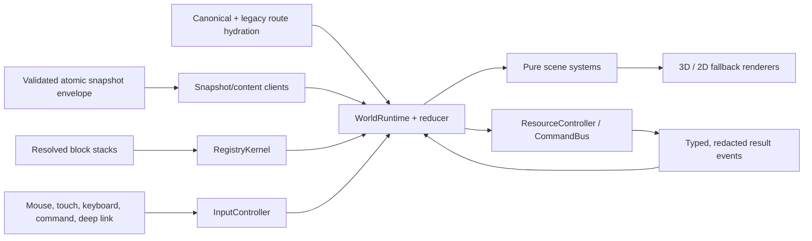
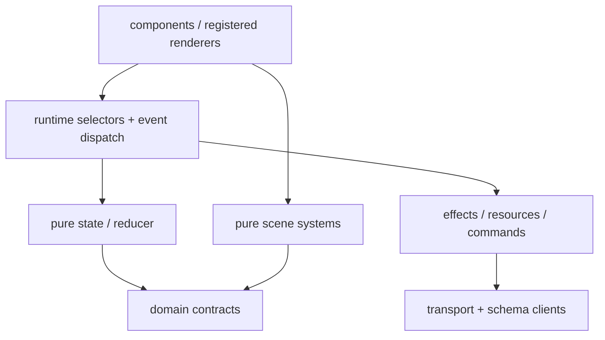

# Wiki Viva v8 runtime architecture

Wiki Viva v8 exposes one living world, not a collection of unrelated dashboard
routes. Real pages remain entities; view, lens, overlay, region and UI surfaces
are projections or controls around an active real-page center.

This page is the v8 acceptance contract. A registry field, boundary or failure
behavior described here that is not yet enforced in code/tests remains a release
blocker; documentation does not make an incomplete implementation compatible.

## World grammar

| Concept | Owns | Never becomes |
| --- | --- | --- |
| Center | A real page ID that defines the current local world. | A quadrant, region, group, lens or visual node. |
| View | Registered geometry such as quadrants, radar, sources or work. | An entity or metric. |
| Lens | Semantic projection such as Q1–Q4, type, relations or source state. | A center or geometry. |
| Overlay | Metric encoding such as attention, freshness, actions, ownership, evidence or quality. | A relayout or entity. |
| Group | A real family grouping (`family:*`) within the world. | A synthetic replacement center. |
| Selection / hover | Explicit selection or ephemeral inspection. | Implicit recentering. |
| Reader / dock | Registered content and work surfaces. | A second navigation system. |
| Fallback | Equivalent 2D rendering of the same semantic state. | Silent sample data or a route reset. |

Canonical writers emit `center`, `view`, `lens`, `overlay`, optional `group`,
real-page selection/reader and registered dock state. Legacy routes normalize at
the hydration boundary, emit warnings and never write deprecated forms back.

## State ownership

| Partition | Examples | Persistence |
| --- | --- | --- |
| Shareable semantic | center, view, lens, overlay, family group, selected page, reader, dock, explicit fallback | Canonical URL and reducer. |
| Ephemeral interaction | hover, inspection, region focus, search text, camera intent | Runtime memory only. |
| Derived render | coordinates, visible labels, safe area, density tier, collision result | Recomputed from snapshot/runtime/viewport. |
| Async resources | snapshot/content loads, retries, jobs, command attempts | Resource/effect controller plus result events. |
| Diagnostics | warnings, bounded transition trace, timings, origin and module failures | Redacted and local by default; exportable as QA evidence. |

History uses `pushState` only for durable semantic layers. Hover, safe-area,
camera interpolation and performance tiers do not write history. Normalization
uses replace and produces a canonical share URL.

## Interaction state machine

| Verb | Semantic effect | Rejected behavior |
| --- | --- | --- |
| Inspect | Set hover/inspection only. | Route, reader, dock or camera travel. |
| Select | Select a real entity/member/group. | Implicit center change. |
| Read | Open a real page in the reader. | Silent recenter. |
| Recenter | Change center through an explicit action. | Synthetic/visual center IDs. |
| Set view | Change registered geometry around the same center. | Lens/overlay mutation by coincidence. |
| Set lens | Change semantic projection. | Entity or center creation. |
| Set overlay | Change data-backed encoding without relayout. | Decorative status invention. |
| Open surface | Open one registered dock and restore focus on close. | Component-local navigation state. |
| Execute command | Request a capability-guarded effect with preview/receipt. | Fabricated success or implicit publish. |

Mouse, touch, keyboard, command/search, route hydration and fallback controls
dispatch the same registered interactions with documented desktop/mobile/
fallback behavior.

## Atomic snapshot and failure contract

The runtime accepts one revision-pinned `wiki_web_snapshot.v2` bundle. Its
manifest carries snapshot ID, source SHA, capabilities, schema versions,
ordered payload metadata, SHA-256/size integrity and bundle hash. Required
payloads and content sidecars must match that revision before commit.

A clean source records its exact Git SHA. A dirty or non-Git source records
`uncommitted:<sha256>` and never claims a clean `source_commit`; the digest is
content-bound to the configured source root so sibling generated output cannot
create a self-referential revision. Writers assemble and validate the complete
bundle in a sibling temporary directory, including content sidecars, then
promote it as one directory with rollback to the previous valid bundle.

| Failure | Required behavior |
| --- | --- |
| Missing/corrupt payload | Reject the bundle and show a diagnostic/fallback reason. |
| Stale response | Discard by request/snapshot revision; retain the prior valid world. |
| Unsupported previous schema | Run the documented boundary migrator or block with a compatibility warning. |
| Real/private API failure | Never substitute the public sample snapshot silently. |
| WebGL loss | Pause/dispose resources, restore from semantic state or enter labelled 2D fallback. |
| Optional module failure | Isolate it, record a redacted diagnostic and use its declared fallback. |

The operator server refuses non-loopback binds. The request `Host` and
mutation `Origin` guards are defense in depth, not substitutes for the
`127.0.0.1`/`localhost`/`::1` bind boundary.

## Registry kernel

Views, overlays, interactions, surfaces, scene systems, visual primitives,
effects, operator commands and typed relations are registered modules. A module
contract declares a stable ID/version, owner/layer, dependencies,
incompatibilities, capabilities/snapshot paths, deterministic priority when
needed, lifecycle, feature flag, fallback, explanation hook, tests and
deprecation metadata.

Kernel validation blocks duplicates, missing required dependencies, cycles,
unknown capabilities and incompatible active modules before rendering. Block
stacks select registered modules declaratively; UI components do not import all
possible systems and branch manually.

## Layer boundaries

- Components render selectors and dispatch events; they do not call transport,
  semantic route helpers or browser history directly.
- Scene systems are pure over declared inputs; they do not import React
  surfaces, operator clients or semantic route writers.
- Clients own transport/integrity/schema validation, not React or Three.js.
- State/reducers do no I/O and read no DOM/Three.js capabilities.
- Effects execute declared work and return receipts; they do not invent
  semantic data absent from snapshot/command inputs.

`npm --prefix apps/wiki-cockpit run check:architecture` is the public boundary
gate. Existing explicitly registered legacy debt is not permission to add new
coupling.

## Effects, security and receipts

Every effect declares kind, inputs, required capability, snapshot revision,
idempotency key, timeout/retry/abort policy, confirmation, redaction, result
events and rollback/compensation. Late reads cannot overwrite newer routes or
snapshots; write retry cannot duplicate work.

Static demo mode exposes no write transport. Operator mode is loopback-only by
default, validates Host/Origin, uses capability/CSRF protection, accepts only
allowlisted bounded commands and creates draft/proposal output. Merge,
publication, destructive action and external contact remain explicit human
gates.

## Source lifecycle

Source state has separate lifecycle, freshness and last-attempt axes. Raw
extraction/indexing is never labelled ingested; ingestion requires deep read,
integration, impact closure and accepted adoption or reviewed no-change.
Particle/halo/line effects may visualize only real lifecycle/evidence data.

## Performance and bundle budgets

| Budget | Desktop | Mobile / degradation |
| --- | --- | --- |
| Interactive nodes | 250 normal / 800 stress | 120 normal / 350 stress; compact/summarize above budget. |
| Visible relation lines | 600 | 220; prioritize center/selection evidence. |
| Visible labels | 80 | 35; collision prune by priority. |
| Particles/effects | 300 | 80; disable effects before semantic marks. |
| Frame rate minimum | 30 FPS sustained | 24 FPS sustained; compact/fallback below. |
| Route usability | 3 seconds | 4 seconds; show honest pending/fallback, never blank. |
| Initial JS | 300 kB gzip | Same shell; optional capabilities load on demand. |
| Single lazy JS | 300 kB gzip | Split capability or record a reviewed engine exception. |
| Initial CSS | 90 kB minified / 25 kB gzip | Consolidate tokens/specialized styles. |

Bundle warnings are blockers; raising Vite's warning threshold is not a fix.

## Public/private adapter

Public defaults load first; local overrides may extend labels, blocks,
templates, page types, adapters and operator capabilities. They cannot weaken
route/entity semantics, runtime ownership, secret scanning, operator security,
public/private export or sample-fallback blocking. A private-only core defect is
reproduced with synthetic public data before shared code changes.

For adoption and rollback, use the
[downstream upgrade runbook](wiki-viva-v8-downstream-upgrade.md). For extension
authoring, use [extending-the-kit.md](extending-the-kit.md).
