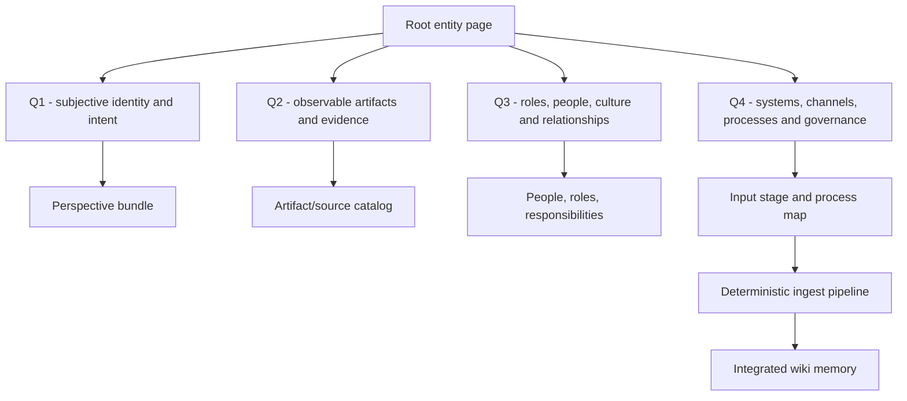
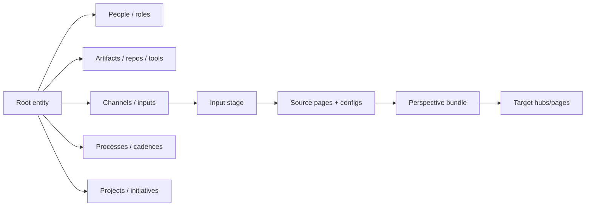
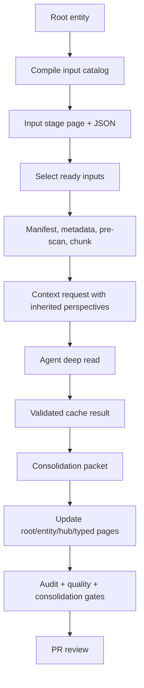

# Proposal - Integral root entity and input stage refactor

This proposal plans a refactor of Wiki Viva's initial configuration around one
load-bearing **root entity** page. The root entity is the first semantic object
of a wiki: a person, team, company, community, project, product or institution.
It declares the wiki's central perspectives, entities, channels, processes,
artifacts and input sources before individual ingestions start.

The goal is to make a new wiki simpler to bootstrap and easier to operate at
scale: instead of scattering source configs, perspectives and context hubs, the
root entity becomes the map from which the source/input pipeline is compiled.

## Why this refactor

The current kit has strong primitives: contexts, hubs, `moc_parent`, sources,
source configs, perspectives, typed pages, source registry, page graph, LLM
context requests, consolidation packets and gates. The weak point is the first
configuration experience.

Today an operator must decide several things separately:

- Which page is the real starting point of the wiki.
- Which contexts exist.
- Which source pages and source configs represent the real inputs.
- Which perspectives should be injected into each source.
- Which people, roles, artifacts, channels, tools and processes define the
  operational domain.
- Which target pages should absorb future source updates.

That separation is flexible, but it makes the first wiki setup harder than it
needs to be. It also hides an important truth: in an operational wiki, inputs
only make sense relative to the entity whose world they describe.

## Core thesis

A living wiki should start from an integral root entity:



The root entity does not replace typed pages. It declares the topology that makes
typed pages useful.

## Scope

In scope:

- Add a first-class root entity concept for initial wiki setup.
- Define richer root templates for person, team and company archetypes.
- Make integral quadrants part of the root template and the perspective bundle.
- Compile a single input stage from root entity declarations, source pages and
  source configs.
- Let source ingestion inherit default perspectives and target contexts from the
  root entity.
- Keep deterministic preprocessing in Python and semantic synthesis in the
  agent.
- Preserve the current PR/human gate model.

Out of scope:

- No embedded LLM client in Python.
- No bundled Slack, Jira, Gmail, Drive or calendar client credentials.
- No private downstream examples in the open-source kit.
- No automatic rewrite of an existing personal wiki without a reviewed migration.
- No claim that a root template can model every organization perfectly on day
  one.

## Target mental model

The operator should be able to answer one starting question:

> What is the entity whose operational memory this wiki serves?

From that answer, the wiki can scaffold:

- the root page;
- default contexts;
- central people/roles/responsibilities;
- canonical artifacts/outputs and separate coordination tools/platforms;
- communication channels;
- process flows;
- source pages;
- source configs;
- required perspectives;
- target hubs and integration obligations.

## Archetypes

The same model should work for a person, team or company, with different
template overlays.

| Archetype | Root page answers | Typical child entities | Typical input channels |
| --- | --- | --- | --- |
| Person | Who is this person, what contexts do they operate in, what roles and projects define their life/work, what channels contain memory | Companies, projects, people, personal roles, responsibilities, documents, accounts, routines | Email, Drive folders, calendar, chats, documents, financial exports, notes |
| Team | What is this team for, who belongs to it, what roles they play, what artifacts/processes they own | Members, roles, responsibilities, projects, initiatives, services, repos, boards, recurring meetings | Repos, issue tracker, chat channels, calendar, meeting notes, docs, dashboards |
| Company | What the company does, how it is structured, what processes govern work, what products/assets/capabilities exist | Teams, products, departments, processes, systems, external partners, governance forums | Repos, work-management tools, Slack/Chat, Drive, meetings, CRM, support systems, email |

The template must be generic, but the resulting page is specific. A personal wiki
can make the top page a `person`-shaped root entity. A team wiki can make it a
team-shaped root entity. A company wiki can make it a company-shaped root entity.

## Integral quadrant template

Use the four integral quadrants as the root template's organizing skeleton. The
quadrants are not decorative; each one creates fields, entity lists, source
obligations and perspective defaults.

| Quadrant | Generic question | Person root | Team root | Company root |
| --- | --- | --- | --- | --- |
| Q1 - Interior individual | What is the first-person view, intent, identity, priorities and constraints? | Self-description, values, current focus, personal preferences, decision style, boundaries | Team purpose, shared intent from the team's own perspective, working agreements | Company mission, strategic intent, identity, leadership narrative |
| Q2 - Exterior individual | What observable behavior, direct output, owned artifact or evidence belongs to this root entity as a single holon? | Documents as evidence, deliverables, accounts, personal artifacts, activity traces and metrics. | Owned codebases, services as deliverables, dashboards as evidence, docs, tickets as output records, owned assets. | Products, assets, reports, operational artifacts and measurable outputs. |
| Q3 - Interior collective | What shared meaning, roles, relationships, culture and expectations shape behavior? | Social contexts, companies, family/community roles, collaborators, communication norms. | Members as participants, roles, responsibilities, rituals, team norms, stakeholder relations. | Teams, departments, roles, governance forums, culture, stakeholder map. |
| Q4 - Exterior collective | What systems, channels, tools, processes and institutions coordinate the work? | Email, calendar, Drive, WhatsApp, processes, routines, external portals. | Slack/Chat, Jira/board, calendar, recurring meetings, PDLC/agile flow, Drive folders, CI and release workflow. | Operating model, PDLC/processes, CRM/ERP, support systems, document systems, governance cadence. |

Boundary rule: Q2 is not "all tools". A repo, document or dashboard is Q2 only
when treated as an owned artifact/output/evidence. A tool/platform used for
coordination, governance, communication, workflow, identity, storage or
infrastructure is Q4.

Each quadrant should have:

- narrative summary;
- canonical child entity lists;
- linked source/input channels;
- required perspectives;
- integration target pages;
- refresh cadence;
- privacy/publication boundary.

## Proposed root entity page type

Introduce one registered page type, tentatively `root_entity`, or promote the
existing `holon` template into a registered first-class type. The decision can be
made during implementation, but the contract should be stable.

Recommended direction:

- Keep `holon` as the generic concept of a whole/part context.
- Add `root_entity` as the configured entry entity of a wiki.
- Let `root_entity` use archetype overlays: `person`, `team`, `company`,
  `project`, `community`, `product`.

Conceptual frontmatter:

```yaml
---
page_id: root-entity-example
page_type: root_entity
title: "Root entity - example"
root_entity_type: person   # person | team | company | project | community | product
context: example
visibility: private_self
updated_at: YYYY-MM-DD
stale_after_days: 30
moc_parent: memories/index.md
primary_contexts:
  - example
integral_quadrants:
  q1: enabled
  q2: enabled
  q3: enabled
  q4: enabled
perspective_bundle:
  required:
    - perspective-identity-intent
    - perspective-artifacts-evidence
    - perspective-roles-relationships
    - perspective-systems-processes
input_stage_ref: memories/system/input-stage.md
source_refs: []
related_holons: []
roles: []
responsibilities: []
claims: []
decisions: []
actions: []
---
```

This root page should be the first page a human reads after `memories/index.md`.
In a mature repo, `memories/index.md` may become a small technical MOC that
points to the root entity as the semantic start page.

## Root entity body contract

The root template should be richer than current context pages.

Required sections:

1. Identity and scope.
2. Integral quadrant map.
3. People, roles and responsibilities.
4. Artifacts, repositories-as-outputs and evidence.
5. Channels and input sources.
6. Processes and cadences.
7. Projects and initiatives.
8. Perspective bundle.
9. Source ingestion map.
10. Privacy and publication boundaries.
11. Open questions and blocked sources.
12. Related pages.

Suggested diagram:



## Perspective bundle

Perspectives should stop being only globally available pages under
`memories/system/perspectives`. They should also be assembled into a root-level
bundle that says which lenses define this wiki's default read.

Proposed core bundle:

| Perspective | Quadrant | Extracts | Target pages |
| --- | --- | --- | --- |
| `perspective-identity-intent` | Q1 | intent, priorities, constraints, preferences, subjective stance | root entity, person/team/company page, decisions, claims |
| `perspective-artifacts-evidence` | Q2 | owned artifacts, repos-as-output, docs-as-evidence, direct outputs, behavior, metrics | source pages, project pages, artifact pages, claims |
| `perspective-roles-relationships` | Q3 | people as participants, roles, responsibilities, relationships, rituals, culture | person, role, responsibility, meeting, relationship map |
| `perspective-systems-processes` | Q4 | channels, recurring processes, governance, coordination tools/platforms, workflows, queues | process, source_config, operation, project, initiative |
| `perspective-privacy-publication` | Boundary | PII, secrets, public-safe summaries, publication constraints | public candidate pages, privacy checklist |

Source configs can add or remove perspectives, but the root bundle provides the
default inheritance.

## Input stage

Add a deterministic input stage between root configuration and source ingestion.
The input stage is the single place where all channels are listed, classified and
prepared before deeper analysis.

It should answer:

- Which inputs exist?
- Which entity/context/process does each input belong to?
- Which source page and source config govern it?
- Which quadrants and perspectives apply?
- Which privacy boundary applies?
- Which refresh cadence applies?
- Which target pages should absorb changes?
- Which inputs are blocked, stale, unread, staged or ready?

Conceptual generated page:

```text
memories/system/input-stage.md
```

Conceptual derived artifact:

```text
data/derived/wiki/input-stage/input-catalog.json
```

The page is human-readable and reviewable. The JSON is used by scripts.

## Input channel model

Do not make every connector a core feature. Model the channel; let agents or
external tools fetch source material.

| Channel type | Examples | Core responsibility | Agent/connector responsibility |
| --- | --- | --- | --- |
| Repository | Git repo, service repo, infra repo | Model source page, config, ownership, cadence and target pages | Fetch files, summarize diffs, open PR context |
| Work tracker | Jira, Linear, GitHub Issues | Model board/project/card pages, process mapping and status fields | Pull selected issues/cards |
| Communication | Slack, Google Chat, WhatsApp, Discord | Model channel, privacy, people, process relevance and search windows | Export/search conversations |
| Meetings/calendar | Calendar, recurring ceremonies, notes | Model meetings, cadence, participants, decisions and action flow | Fetch event data and transcripts |
| Documents | Drive folders, Docs, Sheets, PDFs | Model folder/source hierarchy, document class, refresh and privacy | Fetch files and extract text |
| Email | Gmail, shared inbox | Model labels/search rules, participants, privacy and target contexts | Search/read selected threads |
| Dashboard/report | BI, metrics exports | Model metric ownership, cadence and interpretation rules | Export report snapshots |

The open-source kit should provide contracts and staging. Connector
implementations remain optional.

## Input stage statuses

Use explicit statuses so a source list cannot pretend to be processed.

| Status | Meaning |
| --- | --- |
| `declared` | The input exists in the root/entity model but has no source page yet. |
| `configured` | Source and source_config exist; no current raw/source material has been staged. |
| `staged` | Raw/current material exists in cache or external source reference; pre-scan not complete. |
| `blocked` | Access, secret, permission or human decision blocks progress. |
| `ready_for_ingest` | Pre-scan and metadata are clean enough to run ingest. |
| `ingesting` | Deterministic pipeline or deep read is in progress. |
| `integrated` | Source changes were integrated into target pages. |
| `no_ingest` | Explicitly decided not to ingest, with reason. |

The input stage can be generated from source pages and config, then hand-edited
only where human judgment is needed.

## Pipeline after refactor

The target pipeline:



Key change: the context request no longer depends only on source config or CLI
flags. It can inherit:

- root entity ID;
- root archetype;
- quadrant map;
- perspective bundle;
- input channel metadata;
- process map;
- target pages;
- privacy boundary;
- freshness/cadence contract.

## Configuration shape

Add a small root configuration block to [wiki.config.yaml](../../../wiki.config.yaml).

Conceptual example:

```yaml
root_entity:
  page: memories/example/index.md
  entity_type: team
  input_stage_page: memories/system/input-stage.md
  perspective_bundle:
    required:
      - perspective-identity-intent
      - perspective-artifacts-evidence
      - perspective-roles-relationships
      - perspective-systems-processes
    optional:
      - perspective-privacy-publication
  default_target_strategy: root_then_context_hub
```

This block should be optional for backwards compatibility. Existing repos can
keep operating without it until migration.

## Page types to register or enrich

The current templates include concepts that are not all registered as page
types. This refactor should make the core entity topology explicit.

| Page type | Action | Why |
| --- | --- | --- |
| `root_entity` | Add | One semantic entry point per wiki. |
| `holon` | Register or keep as supporting type | Whole/part context model already has a template. |
| `role` | Register | Roles are central to Q3 and team/company modeling. |
| `responsibility` | Register | Responsibilities connect people, roles and processes. |
| `initiative` | Register/enrich | Teams and companies organize work below the root. |
| `process` | Add | Q4 needs first-class process pages, not prose only. |
| `artifact` | Add or model through `source`/`project` | Q2 needs owned artifacts, repos-as-outputs, evidence and direct outputs; coordination tools belong to Q4. |
| `input_channel` | Add or generate | Input stage needs channel-level metadata. |
| `source_config` | Enrich | It should inherit defaults from root entity and input stage. |
| `perspective` | Enrich | It should declare quadrant, inheritance, target obligations and version. |

Implementation can start with `root_entity`, `process`, `input_channel` and
registered `role`/`responsibility`; avoid creating a large ontology before
synthetic pilots prove the shape.

## Template plan

Add or refactor templates in [docs/references/templates/wiki](../templates/wiki/page-contract.md):

| Template | Purpose |
| --- | --- |
| `root-entity.md` | Base root contract and integral quadrants. |
| `root-person.md` | Overlay for personal wiki root page. |
| `root-team.md` | Overlay for team root page. |
| `root-company.md` | Overlay for company/institution root page. |
| `process.md` | Workflow/cadence/governance contract. |
| `input-channel.md` | Channel metadata, privacy, refresh and target mapping. |
| `artifact.md` | Repo/tool/document/system artifact ownership and evidence. |
| `perspective.md` | Add quadrant, inheritance and target obligation fields. |
| `source-config.md` | Add inherited root bundle, input channel and process map sections. |

The templates should be rich enough to guide the first setup, but not so
verbose that every downstream wiki has to delete half the page.

## Source config inheritance

Current source config discovery reads a `source_config` page linked to a source.
Refactor it into a three-layer merge:

1. Root entity defaults.
2. Input channel defaults.
3. Source-specific config.

Merge order:

```text
root_entity perspective bundle
  -> input_channel perspective/process/privacy defaults
  -> source_config explicit overrides
  -> CLI flags for one-off additions
```

Acceptance behavior:

- Required perspectives dedupe in stable order.
- Source-specific config can add required perspectives.
- Source-specific config can skip a root perspective only with a reason.
- Input channel can define search windows and refresh cadence.
- Privacy boundary cannot be loosened by a child config without a publication
  gate.

## Deterministic input compiler

Add a new deterministic compiler, tentatively:

```text
wiki_core/input_stage.py
scripts/wiki_input_stage.py
```

Core responsibilities:

- Read root entity page and configured root entity block.
- Read source pages and source configs.
- Read input channel pages if they exist.
- Expand inherited perspectives.
- Resolve target pages and context hubs.
- Check missing source pages/config pages.
- Emit JSON catalog.
- Render a human-readable input-stage page.
- Expose `--check` to fail when the generated page/catalog diverges.

Possible commands:

```sh
python3 scripts/wiki_input_stage.py --write
python3 scripts/wiki_input_stage.py --check
python3 scripts/wiki_input_stage.py --format json
python3 scripts/wiki_input_stage.py --ready
```

The compiler should not fetch external data. It only compiles the declared input
model.

## Context request changes

Extend the LLM context request with root/input metadata:

```json
{
  "root_entity": {
    "page_id": "root-entity-example",
    "entity_type": "team",
    "path": "memories/example/index.md"
  },
  "input_channel": {
    "page_id": "input-channel-team-chat",
    "channel_type": "communication",
    "process_refs": ["process-pdlc-example"]
  },
  "quadrant_map": {
    "q1": ["perspective-identity-intent"],
    "q2": ["perspective-artifacts-evidence"],
    "q3": ["perspective-roles-relationships"],
    "q4": ["perspective-systems-processes"]
  },
  "target_pages": []
}
```

This gives the agent enough context to read a source as part of a coherent
entity/process system, not as an isolated document.

Versioning:

- New request schema: `wiki_llm_context_pass.v4`.
- New input-stage schema: `wiki_input_stage.v1`.
- Prompt bump only if the result schema changes; otherwise keep prompt bump
  optional and limited to instructions.

## Consolidation changes

The integration packet should identify root-level impacts:

- root entity update needed;
- affected quadrant sections;
- affected processes;
- affected channels;
- affected artifacts/repos-as-outputs and coordination tools/platforms;
- affected people/roles/responsibilities;
- affected projects/initiatives;
- target hubs and typed pages.

The consolidation gate should fail if a source changes root-level structure but
the root entity or relevant hub is not updated or explicitly marked `no_change`
with reason.

## Migration strategy

Do not rewrite existing wikis in one pass. Use a staged migration.

| Phase | Goal | Output |
| --- | --- | --- |
| 0. Proposal | Agree on model and sequence | This plan |
| 1. Shapes and templates | Add page types and root templates | `root_entity`, `process`, `input_channel` templates and registry entries |
| 2. Root config | Add optional `root_entity` block and loader | Config tests and backwards compatibility |
| 3. Input compiler | Generate input catalog/stage from root/source/config pages | `wiki_input_stage.py --write/--check` |
| 4. Inheritance | Merge root, channel and source perspectives | Source config tests |
| 5. Context request | Include root/input metadata in requests | E2E context-pass fixture |
| 6. Consolidation | Add root/quadrant/process impact to packets | Consolidation tests and audit gate |
| 7. Pilots | Run synthetic person/team/company pilots | Fixture wikis with no private data |
| 8. Migration docs | Document downstream migration | Guide and skill updates |

## Implementation checklist

[ ] Add `root_entity`, `process` and `input_channel` to
[wiki.page-types.yaml](../../../wiki.page-types.yaml).

[ ] Create root templates and overlays under
[docs/references/templates/wiki](../templates/wiki/page-contract.md).

[ ] Enrich [perspective.md](../templates/wiki/perspective.md) with quadrant,
inheritance and target-obligation metadata.

[ ] Enrich [source-config.md](../templates/wiki/source-config.md) with inherited
root bundle, channel/process mapping and explicit skip-with-reason rules.

[ ] Add config support for optional `root_entity` in
[wiki_core/config.py](../../../wiki_core/config.py).

[ ] Add `wiki_core/input_stage.py` and
`scripts/wiki_input_stage.py` for deterministic input-stage compilation.

[ ] Extend [wiki_core/source_config.py](../../../wiki_core/source_config.py) to
merge root, channel and source-level perspectives.

[ ] Extend [context_pass.py](../../../wiki_core/llm/context_pass.py) request
metadata with root entity, input channel, quadrant map and target pages.

[ ] Extend [wiki_consolidate.py](../../../scripts/wiki_consolidate.py) to
surface root/quadrant/process impact in the integration packet.

[ ] Add audit or quality checks so root-impact changes cannot bypass the root
entity or hub update.

[ ] Add synthetic fixture wikis for `person`, `team` and `company` roots.

[ ] Update skills and docs after runtime behavior exists.

## Synthetic pilots

Use public-safe synthetic fixtures only.

### Person pilot

Root entity: a fictional individual.

Inputs:

- personal Drive-like document folder;
- calendar export;
- email-like thread;
- chat-like notes;
- project notes.

Acceptance:

- root page lists social contexts, roles, projects and channels;
- input stage compiles all channels;
- source configs inherit the root perspective bundle;
- one source updates a project page and the root entity;
- no private identifiers appear.

### Team pilot

Root entity: a fictional product team.

Inputs:

- repository;
- issue tracker sample;
- chat channel sample;
- recurring meeting notes;
- process page for an agile/PDLC-like flow.

Acceptance:

- root page lists members, roles, owned artifacts, channels and process cadence;
- input stage maps each channel to process and quadrant;
- one meeting source updates roles/actions/process state;
- one repo source updates artifact/project state.

### Company pilot

Root entity: a fictional company.

Inputs:

- team directory sample;
- process map sample;
- product/repository catalog;
- governance meeting sample;
- document folder sample.

Acceptance:

- root page maps teams, products, governance and systems;
- company process pages own Q4;
- source configs inherit company-level privacy and publication constraints;
- consolidation packet includes root/team/process impact.

## Validation plan

Run after implementation PRs:

```sh
python3 scripts/wiki_audit.py --check
python3 scripts/wiki_check_methodology_coverage.py --check
python3 scripts/wiki_operation_compile.py --check
python3 scripts/wiki_consolidate.py --check
python3 scripts/wiki_quality_report.py --check
python3 scripts/wiki_input_stage.py --check
python3 -m pytest tests/ -q
python3 scripts/wiki_audit.py --check --public-export
git diff --check
```

For the proposal-only PR, the normal audit/test suite is enough. Runtime changes
must add tests at each phase.

## Risks and controls

| Risk | Control |
| --- | --- |
| Root entity becomes a huge unmaintainable page | Keep root as synthesis and index; move details into typed child pages. |
| Personal wiki root leaks private data into public kit examples | Use synthetic fixtures only; run `--public-export`. |
| Teams and companies need different shapes | Use archetype overlays, not hardcoded special cases. |
| Source config inheritance becomes hard to debug | Emit resolved perspective/config summary in input-stage JSON. |
| Connectors are mistaken for core toolkit responsibilities | Keep connector fetching out of Python core; model only pages/config/status. |
| Quadrants become decorative labels | Make each quadrant own fields, sources, perspectives and target obligations. |
| Existing wikis break | Make `root_entity` config optional and migrate incrementally. |
| Root page conflicts with root MOC | Keep technical MOC and semantic root separate at first; allow later merge by config. |

## Open design decisions

1. Should the long-term top page be `memories/index.md` with `page_type:
   root_entity`, or should `memories/index.md` stay a technical MOC that points
   to a separate root entity page?
2. Should `holon` be promoted as the root concept, or should `root_entity` be a
   clearer public-facing type with `holon` as a supporting ontology type?
3. Should `input_channel` be a persisted page type, a generated row in the input
   stage, or both?
4. Should process pages be required for team/company roots, or only recommended?
5. Should context hubs be generated from the root entity topology, or manually
   curated after scaffolding?

## Acceptance criteria

- A new wiki can be bootstrapped from one root entity page plus config.
- The root page explicitly covers all four quadrants.
- Person, team and company archetypes have public-safe templates.
- The input stage lists all declared inputs in one place.
- Source configs inherit perspectives from root and channel defaults.
- LLM context requests carry root/input/quadrant metadata.
- Consolidation packets identify root, quadrant, process and channel impact.
- A source cannot silently update process or entity structure without touching
  the root/hub or recording a no-change reason.
- Existing repos without `root_entity` config continue to pass gates.
- Synthetic pilots prove the model without private data.

## Recommended sequence

Start with templates and registry, not runtime behavior. The first PR should make
the ontology visible: root entity, process, input channel, richer perspectives
and source config inheritance contract. The second PR should add the deterministic
input compiler. Only after the input stage exists should context requests and
consolidation packets inherit root-level metadata.

This order keeps the refactor simple: model first, deterministic compiler
second, LLM/request schema third, integration gates fourth.
