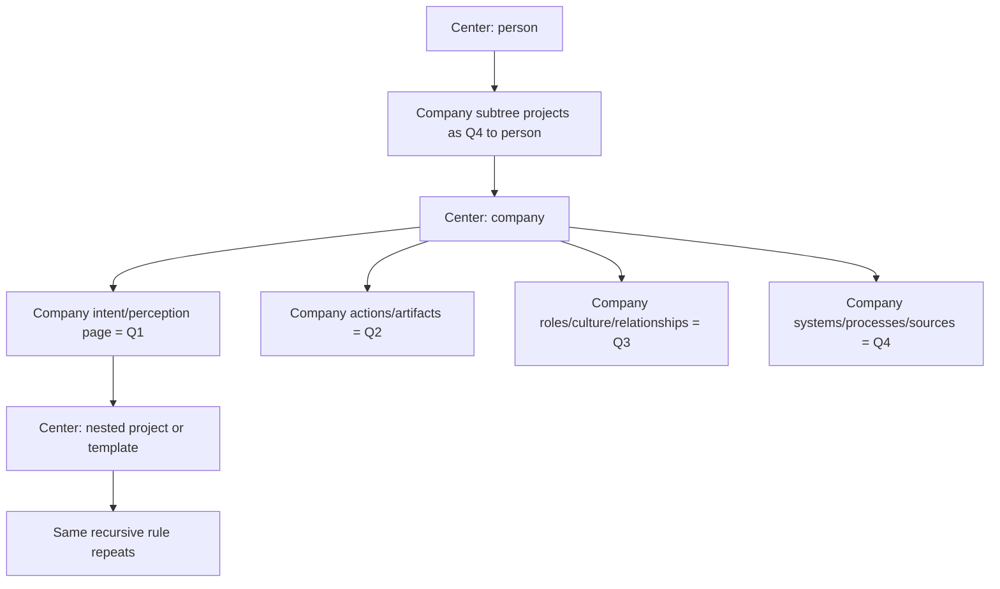

# Plan - Recursive Quadrant Centers and Anchor-Relative Classification

Updated on: 2026-07-07.

This plan fixes the remaining conceptual bug in the modular quadrant work:
quadrants cannot be a single global page classification relative to the top
wiki root. A quadrant assignment is always a projection from a chosen center.
The same page may legitimately be Q4 for a person root, because it belongs to a
company/system in that person's world, and Q1 for the company root, because it
describes that company's own perception, intent, goals or identity.

## Problem Statement

The current implementation still treats a page's quadrant mostly as a property
of the page itself:

- [wiki_core/template_blocks.py](../../../wiki_core/template_blocks.py) uses
  `_page_quadrants()` and page-type/default overrides to decide where a page
  lives.
- The selected quadrant map still tends to behave as if the world root is the
  stable reference point.
- A nested anchor, such as a company, team, project, source or template page
  with `wiki.block.quadrants.v1`, does not fully become the center of its own
  quadrant interpretation.
- The frontend receives `quadrant_assignments` as a flat anchor payload, but the
  semantics still do not distinguish "how this page appears to this center"
  from "what this page is about internally".

That breaks the user's desired model:

- If a person root is the center, a company can be Q4: a
  system/institution/tooling structure in that person's operational world.
- If that company is the center, a page about the company's goals, perception
  or positioning is Q1: the company's own interior/intent quadrant.
- If a project inside the company becomes the center, its same surrounding
  pages must be reprojected again relative to that project.
- Selecting any template page that carries quadrants must put that page in the
  middle and classify its below/related pages around it.

## Core Thesis

Quadrants are not page attributes. They are anchor-relative projections.



The engine must answer a different question:

> Given center A and candidate page B, which quadrant describes B's role in A's
> world, and why?

Not:

> What quadrant is B globally?

## Scope

In scope:

- Refactor quadrant classification to be relative to the active anchor/center.
- Preserve recursive centers: root entities, context hubs, holons, projects,
  sources and template pages that attach `wiki.block.quadrants.v1`.
- Allow the same page to have multiple quadrant projections under different
  centers.
- Add deterministic provenance for each projection: direct self role,
  through-nested-center role, explicit override, relation edge, fallback, or
  unknown.
- Extend the bundled demo with nested entity examples that prove the model.
- Plan downstream private-wiki migration without copying private content into
  the public kit.
- Update UI, snapshots, tests and gates so visual green means semantic green.

Out of scope for this plan:

- Copying personal/private pages into the open-source demo.
- Hand-classifying every private page inside this plan document.
- Weakening privacy, PR gate, LLM pass, source provenance or freshness gates.
- Replacing the four canonical AQAL quadrants with a new taxonomy.

## Vocabulary

### Center

A center is the page currently used as the point of reference for a quadrant
map. It can be:

- The configured wiki root entity.
- A nested `root_entity`, such as a company, person, team, product or project.
- A `context_hub`, `holon`, `project`, `source` or another type that can anchor
  blocks.
- A page whose resolved block stack contains `wiki.block.quadrants.v1`.
- A template page that deliberately acts as an interpretation center.

### Candidate

A candidate is a page considered for placement around the active center.

### Nearest Center

The nearest center is the closest ancestor anchor of a candidate page in the
`moc_parent` chain, after resolving both page IDs and paths.

### Projection

A projection is a record:

```yaml
center: company-acme
page: company-acme-positioning
quadrant: q1
subject_center: company-acme
through_center: null
basis: self_role
sub_lens: intencao
confidence: deterministic
```

The same page can have another projection:

```yaml
center: kim-root
page: company-acme-positioning
quadrant: q4
subject_center: company-acme
through_center: company-acme
basis: nested_center_projection
sub_lens: sistemas
confidence: deterministic
```

### Self Role

The candidate describes the center itself. Page type and content role apply
directly:

- Q1: identity, perception, goals, intent, priorities, decisions, insights,
  strategy as experienced by the center.
- Q2: actions, behavior, artifacts, output, evidence, deliverables produced by
  the center.
- Q3: people, roles, culture, meetings, relationships, shared meaning inside or
  around the center.
- Q4: systems, processes, tools, sources, governance, automation and operating
  infrastructure coordinating the center.

### Parent Role

The candidate belongs to a nested center. The parent sees the nested center as
an entity in its own world, and the candidate inherits that nested center's
parent projection unless a more specific rule says otherwise.

Example:

- `person-root` center sees `company-x` as Q4.
- `empresa-x/estrategia.md` is Q1 when `empresa-x` is center.
- The same `empresa-x/estrategia.md` projects as Q4 when `person-root` is
  center, because it is part of the company subsystem in the person's world.

## Required Contract Changes

### 1. Replace Global Home Quadrant With Anchor-Relative Projection

Current behavior to retire:

- `_page_quadrants(world, page, overrides)` returns a page's quadrant without
  knowing which center is asking.
- Frontend fallback maps page type to quadrant when no anchor assignment is
  available.
- `home_quadrant` behaves like a global page placement.

New behavior:

- Add a deterministic function, conceptually:

```python
project_quadrant(world, center, page) -> QuadrantProjection
```

- `home_quadrant` remains only a self-role default for candidates whose nearest
  center is the active center.
- Parent/nested projections must be computed from the relationship between
  center, nearest center and candidate.
- A page can exist in several quadrant maps with different quadrants and all
  assignments must carry `basis`.

Likely code areas:

- [wiki_core/template_blocks.py](../../../wiki_core/template_blocks.py)
- [wiki_core/facets.py](../../../wiki_core/facets.py)
- [wiki_core/templates_registry.py](../../../wiki_core/templates_registry.py)
- [wiki_core/graph/page_graph.py](../../../wiki_core/graph/page_graph.py)
- [apps/wiki-cockpit/src/scene/facets.ts](../../../apps/wiki-cockpit/src/scene/facets.ts)
- [apps/wiki-cockpit/src/scene/perspectives.ts](../../../apps/wiki-cockpit/src/scene/perspectives.ts)
- [apps/wiki-cockpit/src/components/WorldView.tsx](../../../apps/wiki-cockpit/src/components/WorldView.tsx)

### 2. Add Explicit Parent Projection Metadata

Some nested centers have obvious defaults, but entity type alone is not enough.
A company can be a Q4 system for a person, a Q3 partner community, or a Q2
artifact/product depending on the relationship.

Add optional frontmatter on anchor pages:

```yaml
parent_projection:
  quadrant: q4
  sub_lens: sistemas
  reason: "Operational/company system in the parent person's world."
```

Rules:

- `parent_projection` applies when an ancestor center sees this anchor or pages
  inside this anchor.
- It is inherited by descendants when the ancestor center is outside this
  anchor's subtree.
- It can be overridden by a direct edge or explicit `projection_overrides`.
- It must not be required for every center. Defaults should exist by page type
  and entity type, but the report must flag uncertain cases.

Default suggestions:

| Nested center type | Default parent projection | Rationale |
| --- | --- | --- |
| `root_entity_type: person` | Q3 | Person as relationship actor in parent world. |
| `root_entity_type: team` | Q3 | Team as social/cultural collective. |
| `root_entity_type: company` | Q4 | Company as institution/system around a person or project, unless explicitly relational. |
| `root_entity_type: product` | Q2 | Product as produced artifact, unless it is an operating platform. |
| `root_entity_type: project` | Q1 or Q2 | Needs explicit role: intent/initiative vs active output. |
| `source` | Q4 | Sources are systems/input infrastructure. |
| `tool` | Q4 | Tools coordinate work. |
| `template_block` | Q4 | Blueprint/system capability. |
| `context_hub` | q0 area by default | Area hubs span quadrants unless explicitly projected. |

### 3. Add Subject Metadata For Pages About Another Center

Some pages live physically under one folder but describe another entity. Add
optional page frontmatter:

```yaml
subject_ref: empresa-x
subject_role: interior_intent
```

or:

```yaml
subject_ref: kim-root
subject_role: evidence_output
```

Rules:

- If `subject_ref` equals the active center, classify by `subject_role` or page
  type as direct self role.
- If `subject_ref` belongs to a nested center below the active center, classify
  through that nested center's parent projection.
- If `subject_ref` points outside the active center's subtree, classify by the
  explicit relation edge or report as cross-center ambiguity.

Supported `subject_role` vocabulary:

| Role | Default quadrant |
| --- | --- |
| `interior_intent` | Q1 |
| `perception` | Q1 |
| `goal` | Q1 |
| `decision` | Q1 |
| `observable_action` | Q2 |
| `artifact_output` | Q2 |
| `evidence` | Q2 |
| `relationship` | Q3 |
| `role_culture` | Q3 |
| `meeting_shared_meaning` | Q3 |
| `system_process` | Q4 |
| `source_input` | Q4 |
| `tool_governance` | Q4 |

### 4. Preserve Multi-Projection Instead Of Forcing One Home

`observed_quadrants` and `home_quadrant` currently imply page-level multi-home.
Keep them, but reinterpret them:

- `home_quadrant` means "direct self role when this page is evaluated inside
  its nearest center".
- `observed_quadrants` means "this page has multiple self roles inside its
  nearest center".
- New `projection_overrides` can express center-specific placement:

```yaml
projection_overrides:
  person-root:
    quadrant: q4
    reason: "This company strategy is part of the person-root company-system context."
  empresa-x:
    quadrant: q1
    reason: "This page describes the company's own intent."
```

The override must be audited:

- Referenced centers must exist.
- Quadrants must be canonical `q1..q4`.
- Overrides must include a short reason.
- The public export path must not leak private details.

### 5. Change Snapshot Shape

Current `block_stacks.json` stores per-anchor `derived.quadrant_assignments`.
Replace or extend it with projection-rich data:

```json
{
  "anchors": {
    "kim-root": {
      "derived": {
        "quadrant_assignments": {
          "q1": ["kim-goals"],
          "q2": ["kim-public-bio"],
          "q3": ["person-x"],
          "q4": ["empresa-x", "empresa-x-strategy"]
        },
        "quadrant_projections": {
          "empresa-x-strategy": {
            "quadrant": "q4",
            "subject_center": "empresa-x",
            "through_center": "empresa-x",
            "basis": "nested_center_projection",
            "parent_projection": "q4",
            "local_quadrant_under_subject": "q1"
          }
        }
      }
    },
    "empresa-x": {
      "derived": {
        "quadrant_assignments": {
          "q1": ["empresa-x-strategy"],
          "q2": ["empresa-x-deliverable"],
          "q3": ["empresa-x-team"],
          "q4": ["empresa-x-source"]
        }
      }
    }
  }
}
```

Compatibility:

- Keep `quadrant_assignments` for existing frontend consumers.
- Add `quadrant_projections` for UI explanations, audit reports and future
  migration tooling.
- Add `center_tree` or `anchor_tree` to the payload so the UI can navigate
  center -> nested center -> nested center.

## Algorithm Design

### Phase A - Build The Anchor Tree

1. Load all pages and resolved template block stacks.
2. Mark any page with a quadrants block as an anchor.
3. Add any page type whose template `can_anchor_blocks: true` and whose stack
   enables quadrants.
4. Resolve each anchor's parent anchor by walking `moc_parent`.
5. Detect cycles and orphan anchors.
6. Emit `anchor_tree` with:

```yaml
anchor_id:
  parent_anchor: kim-root
  path: memorias/empresas/empresa-x.md
  page_type: root_entity
  root_entity_type: company
  parent_projection: q4
  has_quadrants: true
```

### Phase B - Classify Direct Members

For a center C and candidate page P:

1. Find P's nearest anchor N.
2. If `N == C`, classify P by direct self role:
   - `projection_overrides[C]`
   - `subject_ref == C` plus `subject_role`
   - explicit `home_quadrant` / `observed_quadrants`
   - template `home_quadrant`
   - page type default
   - relation-edge fallback
   - q0 with warning
3. Attach `basis: self_role` or the more precise basis used.

### Phase C - Classify Nested Members

For a center C and candidate page P whose nearest anchor N is below C:

1. Compute N's role relative to C:
   - `projection_overrides[C]` on N
   - N's `parent_projection` if C is N's parent anchor
   - inherited projection through intermediate anchors
   - entity type default
   - relation-edge fallback between C and N
   - q0 with warning
2. Project P into C's map using N's role relative to C.
3. Record P's local quadrant under N if available.
4. Provide a UI explanation:

```text
Q4 here because it belongs to Company X, which is an operating system in the person root's world.
Inside Empresa X, this page is Q1 because it describes company intent.
```

### Phase D - Collapse Or Expand Nested Subtrees

The UI should not always flatten every descendant into the parent map. Add a
block config:

```yaml
blocks:
  - id: wiki.block.quadrants.v1
    config:
      nested_mode: summarize   # summarize|project_all|hide_nested
```

Modes:

- `summarize`: parent map shows nested center page as one node in its parent
  projection; child pages are visible only after entering the nested center.
- `project_all`: parent map also shows descendants, projected through the
  nested center role.
- `hide_nested`: parent map hides nested subtree entirely except relation lines.

Default should be `summarize` for readability. The audit/report can still
compute all projections.

### Phase E - Cross-Links And Related Pages

Some pages are not descendants but are related to the active center. Support a
separate relation scope:

```yaml
blocks:
  - id: wiki.block.quadrants.v1
    scope: descendants
    config:
      include_related: true
      related_edges: [source_ref, mentions, related_pages]
```

Rules:

- Descendant membership is primary and deterministic.
- Related pages appear with `basis: related_edge`.
- Related pages never silently override descendant placement.
- If a related page has its own nearest center, the same nested projection logic
  applies.

## Demo Changes

The bundled demo must prove recursion with synthetic data.

### Add A Nested Company Root

Add a fictional company below Alex Rivera:

```yaml
page_id: company-nova-labs
page_type: root_entity
root_entity_type: company
title: Nova Labs
moc_parent: memories/index.md
parent_projection:
  quadrant: q4
  sub_lens: sistemas
  reason: "A company operating system in Alex Rivera's consulting world."
blocks:
  - id: wiki.block.quadrants.v1
    scope: descendants
```

Expected behavior:

- In Alex's map, `company-nova-labs` appears in Q4.
- In Nova Labs' map, Nova Labs is centered.
- Nova Labs' own strategy/positioning page appears in Q1.

### Add Four Company-Local Pages

Under `company-nova-labs`:

| Page | Local quadrant when company is center | Projection when Alex is center |
| --- | --- | --- |
| `nova-labs-positioning` | Q1 | Q4 through company |
| `nova-labs-client-delivery` | Q2 | Q4 through company |
| `nova-labs-culture` | Q3 | Q4 through company |
| `nova-labs-operating-stack` | Q4 | Q4 through company |

### Add A Nested Project Or Product

Add a product/project under the company:

```yaml
page_id: project-signal-room
page_type: project
title: Signal Room
moc_parent: memories/companies/nova-labs.md
parent_projection:
  quadrant: q2
  reason: "A product/deliverable produced by Nova Labs."
blocks:
  - id: wiki.block.quadrants.v1
    scope: descendants
```

Expected behavior:

- In Alex's map, Signal Room projects through Nova Labs as Q4 or, if flattened
  with explicit override, Q4/q2 explanation.
- In Nova Labs' map, Signal Room appears as Q2.
- In Signal Room's own map, its requirements/intents are Q1, releases are Q2,
  user/community feedback is Q3 and deployment/source systems are Q4.

### Add A Template Page As A Center

Add a `template_block` or methodology/template page with attached quadrants:

```yaml
page_id: template-client-engagement
page_type: template_block
title: Client Engagement Template
moc_parent: memories/sistema/index.md
parent_projection:
  quadrant: q4
  reason: "A reusable system blueprint."
blocks:
  - id: wiki.block.quadrants.v1
    scope: descendants
```

Expected behavior:

- Selecting it puts the template page in the center.
- Its guide pages, required fields, examples and skills classify around that
  template center.
- In the parent system map, the template remains Q4.

### Demo Acceptance Criteria

- The Alex root map no longer pretends company intent pages are Q1 for Alex.
- Entering the company center shows those same intent pages as Q1.
- The UI explanation can show both facts at once.
- Visual baselines include at least one recursive center route.
- The genesis/tutorial route includes a step where adding a nested center makes
  a new quadrant map available.

## Personal Repository Migration Plan

The personal repo is the validation target, but not the proving ground for core
behavior. The generic behavior must ship in `wiki-viva-kit` first with synthetic
fixtures.

### Target Repository

`<private-personal-wiki-repo>`

Known constraints:

- `memorias/` is the consolidated operational truth.
- Google Drive and live systems remain canonical for raw/private sources.
- Private pages may contain personal data when operationally useful.
- Access secrets remain blocked everywhere.
- The current private checkout may contain unrelated branch work and must not
  be mixed with this migration.

### Private Anchor Inventory

Create a read-only report first:

```sh
python3 scripts/wiki_quadrant_projection_report.py --out data/derived/wiki/quadrant-projection-report.json
```

The report should inventory likely centers:

- Person root entity.
- Professional context.
- Companies, institutions and other organization pages present in the repo.
- Personal projects and public-speaking/project pages.
- Finance, documents, fiscal, costs and source hubs.
- Important source entities: mail, drive, sheets, finance exports, card and
  bank sources.
- Template/system pages and skills that should act as centers.

### Private Classification Principles

When the person root is the center:

- Q1: the person's identity, intentions, goals, professional positioning,
  preferences, decisions and personal perceptions.
- Q2: the person's produced artifacts and observable actions: CV, talks, reports,
  proposals, deliverables, implemented outputs.
- Q3: people, roles, relationships, meetings, communities and shared culture
  around the person.
- Q4: companies, institutions, tools, sources, finance systems, legal/fiscal
  processes, documents, automations and operational infrastructure.

When a company is the center:

- Q1: that company's intent, strategy, perception, positioning and goals.
- Q2: that company's outputs, services, artifacts and deliverables.
- Q3: that company's people, partners, clients, roles, culture and meetings.
- Q4: that company's systems, sources, processes, governance, tooling and
  operating stack.

When a source is the center:

- Q1: why the source matters and how it is interpreted.
- Q2: exported files, manifests, chunks and ingestion artifacts.
- Q3: stewards, owners, participants and human review cadence.
- Q4: source configs, pipelines, cursors, recipes, auth pointers and governance.

When a project is the center:

- Q1: project intent, success criteria, decisions and priorities.
- Q2: project actions, outputs, deliverables and evidence.
- Q3: stakeholders, meetings, roles and collaboration.
- Q4: source systems, tooling, process, cost and delivery governance.

### Private Migration Steps

1. Wait for a clean private branch or explicitly create a new migration branch.
2. Port the generic recursive quadrant engine from `wiki-viva-kit`.
3. Add `wiki.templates.local.yaml` only for private-specific type defaults and
   parent projection defaults.
4. Run the projection report in read-only mode.
5. Review ambiguous centers with explicit reasons instead of guessing.
6. Add `parent_projection`, `subject_ref`, `subject_role` or
   `projection_overrides` only where deterministic defaults are insufficient.
7. Regenerate the private cockpit snapshot.
8. Validate the person-root map, company maps, source maps and template/system
   maps in the live cockpit.
9. Run private gates until healthy:

```sh
python3 scripts/wiki_input_stage.py --check
python3 scripts/wiki_audit.py --check
python3 scripts/wiki_pr_summary.py
git diff --check
```

10. Only then prepare the private PR.

## UI And UX Changes

### Selected Center Must Be Real

When the user selects a page with quadrants:

- The page becomes the center of the quadrant map.
- The URL must preserve that center.
- Breadcrumbs should show the center chain.
- The map title and compass should name the active center.
- "Core / Structure" means structure for this center, not for the whole wiki.

Potential URL options:

- Reuse existing world grammar with locked page as center:
  `/w/quadrants/<context>/<group>/<centerId>`.
- Or add a query:
  `/w/quadrants?center=<pageId>`.

Decision recommendation:

- Prefer path grammar for shareable maps.
- Preserve `?reader=1` for reading a selected node inside that map.
- Avoid making center and reader the same state. A user can center a page
  without opening the reader, and can open another node while keeping the same
  center.

### Center Switching

Add commands:

- `Set as center`
- `Enter quadrant map`
- `Back to parent center`
- `Show projection reason`

In 3D:

- Center transition should morph the selected node to the middle.
- Nested center nodes should have a subtle "enterable" marker.
- The compass counts must update to the selected center's projections.

In 2D fallback:

- Group links should drill into nested centers when the group is a center.
- Node cards should show "Q4 here, Q1 inside Nova Labs" for projected nested
  pages when explanation data exists.

### Blocks Dock

The Blocks dock should show:

- Active center.
- Resolved block stack for active center.
- Quadrant block config.
- Nested mode.
- Projection warnings.
- Missing quadrants for that center only.
- A table of pages with:
  - local quadrant under nearest center,
  - projected quadrant under active center,
  - basis,
  - warning if ambiguous.

### Page Reader

The reader should display a small "Quadrant projection" panel:

```text
Current center: Alex Rivera
This page: Nova Labs positioning
Placement here: Q4 - Systems
Why: belongs to Nova Labs, which projects as Q4 in Alex Rivera's world.
Placement inside Nova Labs: Q1 - Identity and intent.
```

## Core Files To Change

### Python Core

- [wiki_core/template_blocks.py](../../../wiki_core/template_blocks.py)
  - Replace `_page_quadrants()` with anchor-relative projection.
  - Add `QuadrantProjection` data shape.
  - Build `anchor_tree`.
  - Add nested subtree modes.
  - Add projection warnings.
- [wiki_core/facets.py](../../../wiki_core/facets.py)
  - Keep canonical facet/quadrant mapping.
  - Remove any assumption that page type alone determines final placement.
  - Expose self-role defaults separately from projection logic.
- [wiki_core/templates_registry.py](../../../wiki_core/templates_registry.py)
  - Validate `parent_projection` defaults or type-level projection defaults.
  - Export center/anchor capabilities.
- [wiki_core/web/snapshot.py](../../../wiki_core/web/snapshot.py)
  - Include `anchor_tree` and `quadrant_projections` in snapshots.
- [wiki_core/llm/context_pass.py](../../../wiki_core/llm/context_pass.py)
  - Include active center projection context in LLM packages when ingesting for
    a specific center.
- New script:
  - `scripts/wiki_quadrant_projection_report.py`
  - read-only by default,
  - outputs JSON and optional Markdown,
  - flags ambiguous center roles, q0 overload and global-vs-local conflicts.

### Frontend

- [apps/wiki-cockpit/src/components/WorldView.tsx](../../../apps/wiki-cockpit/src/components/WorldView.tsx)
  - Track active center separately from selected reader page.
  - Use active center's projections for quadrant homes.
  - Add center switching controls.
- [apps/wiki-cockpit/src/scene/perspectives.ts](../../../apps/wiki-cockpit/src/scene/perspectives.ts)
  - Layout nodes from selected center projections.
  - Support summarize/project_all/hide_nested.
- [apps/wiki-cockpit/src/scene/facets.ts](../../../apps/wiki-cockpit/src/scene/facets.ts)
  - Restrict fallback logic to self-role defaults only.
- [apps/wiki-cockpit/src/components/BlocksDock.tsx](../../../apps/wiki-cockpit/src/components/BlocksDock.tsx)
  - Add projection inspection UI.
- [apps/wiki-cockpit/src/components/PageReader.tsx](../../../apps/wiki-cockpit/src/components/PageReader.tsx)
  - Add projection explanation panel.
- [apps/wiki-cockpit/src/router.ts](../../../apps/wiki-cockpit/src/router.ts)
  - Preserve center state in URL.
- [apps/wiki-cockpit/src/types.ts](../../../apps/wiki-cockpit/src/types.ts)
  - Add `QuadrantProjection`, `AnchorTree`, `NestedMode`.

### Templates And Fixtures

- [wiki.templates.yaml](../../../wiki.templates.yaml)
  - Add projection defaults and nested quadrant config.
  - Clarify `home_quadrant` as self-role only.
- [wiki.page-types.yaml](../../../wiki.page-types.yaml)
  - Add field type validation for `parent_projection`, `subject_ref`,
    `subject_role`, `projection_overrides`.
- [docs/references/templates/wiki/root-entity.md](../../../docs/references/templates/wiki/root-entity.md)
  - Document recursive center behavior.
- [docs/references/templates/wiki/template-block.md](../../../docs/references/templates/wiki/template-block.md)
  - Document template pages as possible centers.
- [docs/references/fixtures/demo-wiki/](../../../docs/references/fixtures/demo-wiki)
  - Add nested company, nested project/product and template-center examples.
- [scripts/wiki_build_demo.py](../../../scripts/wiki_build_demo.py)
  - Generate the recursive demo fixtures and staged tutorial.

## Tests And Validation

### Unit Tests

Add tests in [tests/test_template_blocks.py](../../../tests/test_template_blocks.py):

- A company intent page projects Q4 for a person root and Q1 for the company
  center.
- A project page projects Q2 for a company and has its own Q1/Q2/Q3/Q4 map when
  centered.
- `parent_projection` overrides entity defaults.
- `projection_overrides` override inherited parent projection with required
  reasons.
- `subject_ref` and `subject_role` classify pages outside the nearest folder.
- `summarize`, `project_all` and `hide_nested` produce different parent maps.
- Cycles in anchor tree fail safely with warnings, not crashes.
- q0 overload is reported when too many pages lack projection basis.

Add tests in [tests/test_web_snapshot.py](../../../tests/test_web_snapshot.py):

- Snapshot includes `anchor_tree`.
- Snapshot includes `quadrant_projections`.
- Existing `quadrant_assignments` compatibility remains.

Add tests in frontend:

- Router preserves active center separately from reader page.
- World layout uses selected center projections.
- PageReader shows dual projection explanation.
- BlocksDock lists projection basis and warnings.

### Demo Tests

Extend [tests/test_build_demo.py](../../../tests/test_build_demo.py):

- Demo has nested company root.
- Alex root sees company subtree as Q4.
- Company root sees company intent page as Q1.
- Nested project becomes a center.
- Final stage snapshot equals full demo page set.

### Visual Tests

Extend [apps/wiki-cockpit/e2e/visual-regression.spec.ts](../../../apps/wiki-cockpit/e2e/visual-regression.spec.ts):

- Add recursive company-center route screenshot.
- Add projection explanation screenshot.
- Add center switching flow:
  - open Alex root,
  - enter company center,
  - verify Q1 count changes,
  - open one company intent page,
  - verify reader explanation says Q4 here / Q1 inside company.

### Private Validation

After kit implementation is green:

- Run private projection report.
- Inspect the person-root map.
- Inspect company/institution maps.
- Inspect source maps.
- Inspect template/system maps.
- Confirm there is no private data in public fixtures.
- Run private gates.

## Implementation Order

1. Add the recursive quadrant contract document and tests first.
2. Add `QuadrantProjection` and anchor tree data structures.
3. Refactor Python classification behind existing `quadrant_assignments`
   compatibility.
4. Add projection report CLI.
5. Add demo nested company/project/template fixtures.
6. Regenerate demo snapshots.
7. Update frontend routing and selected-center state.
8. Update WorldView, layout, BlocksDock and PageReader.
9. Update tests and visual baselines.
10. Run full open-source validation.
11. Only after merge or stable PR, migrate the private repo in a clean branch.

## Validation Checklist

Open-source:

```sh
python3 scripts/wiki_consolidate.py --check
python3 scripts/wiki_audit.py --check
python3 scripts/wiki_check_methodology_coverage.py --check
python3 scripts/wiki_operation_compile.py --check
python3 scripts/wiki_input_stage.py --check
python3 -m pytest tests/
npm --prefix apps/wiki-cockpit test
npm --prefix apps/wiki-cockpit run build
npm --prefix apps/wiki-cockpit run test:visual
git diff --check
```

Private downstream:

```sh
python3 scripts/wiki_quadrant_projection_report.py --out data/derived/wiki/quadrant-projection-report.json
python3 scripts/wiki_input_stage.py --check
python3 scripts/wiki_audit.py --check
python3 scripts/wiki_pr_summary.py
git diff --check
```

## Acceptance Criteria

- No function treats quadrant as only a global page property.
- Every quadrant assignment in snapshot can explain its center and basis.
- A page can be Q4 for a person root and Q1 for a company without duplication
  or manual contradiction.
- Selecting a template page with quadrants centers that page and reclassifies
  its below/related pages around it.
- The bundled demo contains nested center examples and tests them.
- The private migration can report ambiguous classifications before writing.
- The visual cockpit makes the active center obvious.
- Green tests include semantic nested-center checks, not only screenshot
  stability.

## Risks And Guardrails

- Risk: too much flattening makes parent maps noisy.
  - Guardrail: default `nested_mode: summarize`.
- Risk: entity-type defaults hide wrong assumptions.
  - Guardrail: projection report flags inferred defaults and asks for explicit
    `parent_projection` on important centers.
- Risk: private pages get migrated in a dirty branch.
  - Guardrail: downstream migration waits for a clean branch or explicit owner
    approval.
- Risk: frontend and backend disagree on fallback classification.
  - Guardrail: frontend consumes `quadrant_projections`; static page-type maps
    become display fallbacks only.
- Risk: q0 becomes a dumping ground again.
  - Guardrail: report q0 counts per center and fail or warn above threshold.
- Risk: related/cross-linked pages become misleading.
  - Guardrail: descendant projections are primary; related projections carry
    `basis: related_edge` and explanation.

## Open Questions

- Should the URL encode active center as a path segment or query parameter?
  Recommendation: path segment for shareable maps, reader as query state.
- Should private repo defaults treat all company roots as Q4 under the person
  root, or only operational/company-system pages with explicit
  `parent_projection`?
  Recommendation: default company root to Q4 but require report review for
  high-importance companies.
- Should parent maps show nested descendants by default?
  Recommendation: no. Show nested center summary by default, with an optional
  `project_all` mode for audit/debug views.
