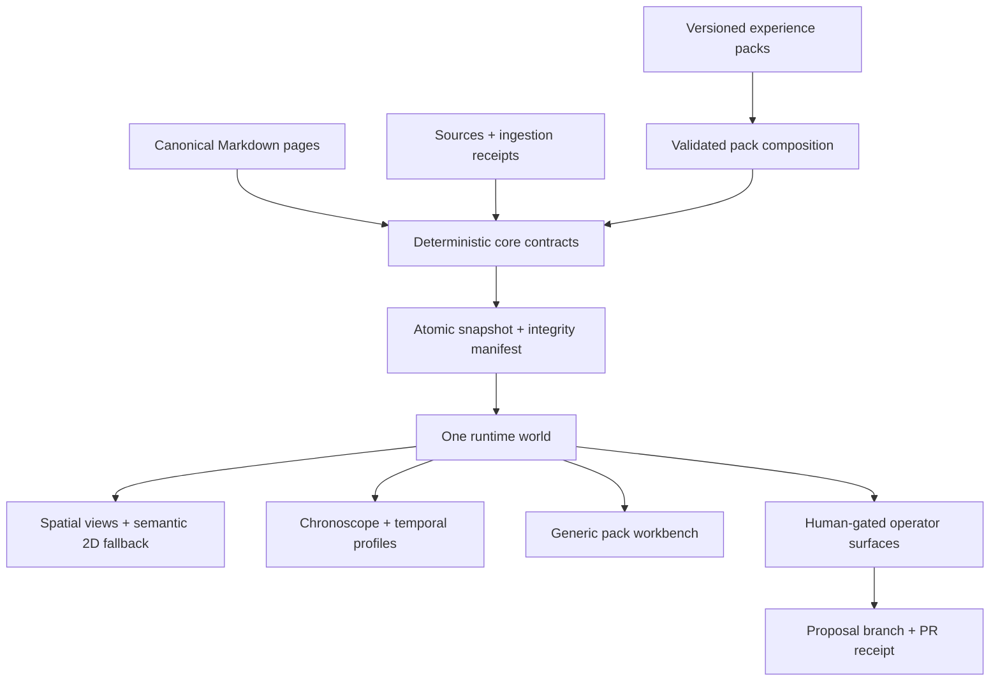
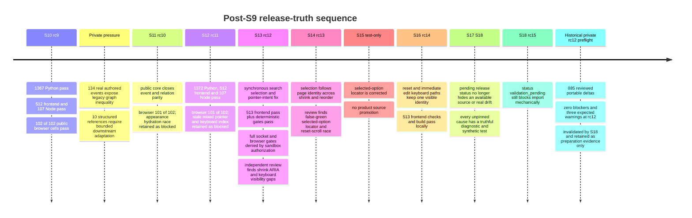

# Plan - Wiki Viva Release Truth, Temporal World and Experience Packs

Updated on: 2026-07-15.

## Executive Decision

The public/private pair remains blocked. Historical S19 source
`198471c3cf4176d7a046c5ceb8dd053f1be1ee58`, packaged as
`wiki-viva-v8-rc16`, completed the then-declared public stack and received a
current-run E3 inspection on 2026-07-13. Those results remain immutable,
subject-bound evidence, but rc16 will never be promoted: its browser receipt
used Node 26 instead of the declared Node 22 and private rehearsal exposed
RT-146, a release-authority defect in the final downstream drift gate.

RT-146 proved that the S19 `wiki_toolkit_drift --ref-path` entrypoint compared
mutable checkout bytes through hard-coded legacy prefixes. It therefore
counted consumer-owned tests and workflows that the package forbids importing,
could omit other portable surfaces, and did not bind its verdict to the
committed canonical package plus exact pinned portable Git tree. The first
correction was exact S20
`3f96b03e451e09227205546678cfa8e902afb2fd`, packaged as
`wiki-viva-v8-rc17`. Before its full stack, downstream policy exposed RT-147:
validator v4 rejected the mandatory localized private release record, while
the first v5 draft admitted arbitrary executable payloads below the configured
release subtree. S20/rc17 is therefore historical non-adoption evidence.

The next correction was exact S21
`8a95ed94c424759f6b218038f8b5f6141c3cc079`, packaged as
`wiki-viva-v8-rc18`. Validator v5 binds both
configured roots to preflight, requires them to be disjoint and admits only
UTF-8 Markdown release records committed as inert `100644` data. The complete
upgrade suite passes 105/105, including secret, executable, sibling, overlap,
portable-path and localized-memory regressions. Its exact metadata subject
`8dc7b6dfef601c127a2d826ad9708517825fc455` then passed gates 1–12 under
Node 22, including 1,428/1,428 Python tests, before gate 13 stopped at 510/513
frontend tests. RT-148 proved those three keyboard failures were a harness
contract: a clean Node 22 profile correctly opened the first-run modal tour,
which captured Enter before the tests' command bar. Node 26 had masked the
missing fixture state through incompatible experimental localStorage behavior.
rc18 is retained as negative first-attempt evidence and will not be retried.

The historical S22 correction was
`e01a4ed91e3e4c2f1746539418d3faebec775204`, packaged as
`wiki-viva-v8-rc19`. It isolates all three
keyboard contracts with explicit `tour=0`, including the internal Back/route
hydration URL. It also closes RT-149: while the guided-tour modal is open, the
world command bar and background instruments are now `inert` and
`aria-hidden`, then restored on close. It also refuses to stack the tour over
an existing reader, dock or tray and preserves all seven visible tour anchors.
Node 22 passed the focused file 17/17 and the frontend suite 516/516. A
concurrent downstream review independently found the same two reader-test
isolation and inspired the public check; the public synthetic fix also covers
the newer dense-search contract without importing private content.

Exact metadata subject `2023ee714cfbdb9f48b22c7cd3d818fb9dc8d2b8`
passed the complete official Node 22 stack once: 21/21 gates, 1,428 Python,
516 frontend, 107 Node and 102/102 first-attempt browser cells with zero skip,
retry, flaky result or subject drift. That visual manifest binds six
baseline comparisons, nineteen accepted manual captures and the explicit
seven-anchor tour contract to S22. This closes local validation, but it is not
yet release authority: `release_candidate` makes `package_is_pinned=true` and
mechanically lets downstream preflight pass. RT-150 therefore keeps the
canonical package at `status: validation_pending` until the validated payload
and a subsequent reviewed promotion boundary are published through public CI
and merged to public `main`.

The public-first rule above records the historical rc19 policy. On 2026-07-13,
an explicit execution decision authorized one corrected **private-first v2**
exception after the shared defect had been reproduced and fixed locally with
public synthetic fixtures. The corrected public source and v2 package remain
local-only: public push, PR mutation, merge, tag and E5 are still unauthorized.
The in-flight consumer adoption therefore keeps the complete original v2 gate
matrix and cannot borrow the later v3 gate classes retroactively.

That authorized adoption completed a fresh read-only preflight, a direct
C1 -> C2 -> C3 ownership chain, all 22 required gates, four real visual canary
profiles, generated private/public-redacted reports and an executed disposable
rollback. Those v2 subjects and receipts remain valid historical evidence, but
the associated consumer PR is not rc36/v3 and must not be promoted as if it
were. Its hosted attempts remain diagnostic: one standard macOS run closed
100/102 and one standard Intel probe closed 92/102 under software rendering /
WebGL loss. Neither result is rewritten, retried or used as fresh authority.

The current v2 C3, PR and receipts are frozen. Fresh rc36/v3 adoption starts
from the consumer's current approved `main`, not from that C3, after the rc36
capsule verifies independently. It creates a new B0/C1/C2/C3 chain, new plan
clock, canary anchor, receipts, real-data canary, reports and rollback proof.
Toolkit-owned `.skills/wiki-*/**` and the scoped root-quadrant label correction
arrive byte-equal in C1; consumer `AGENTS.md`, router and non-`wiki-*` local
skills remain C3. Standing private merge approval satisfies only the later
human authorization boundary; every technical, privacy, canary and rollback
gate remains fail-closed. Concurrent Claude/IFC, Audrey and other domain
content remain separate until the rc36/v3 merge and private-main readback close.

The first exact v3 trust boundary was rc20 at
`1a9bd7ce2ddb5236d0d3d8e414f03946e6c78cbc`. Its full local stack was green,
but downstream real-data UX pressure subsequently exposed RT-151: at a
390 x 844 viewport, filtering the Timeline, selecting an event and scrolling
could collapse the mobile grid rows while their children overflowed, visually
interleaving the result list and inspector. The private pixels, routes and
content remain private. The defect was minimized into a public synthetic
fixture and fixed in exact rc21 source
`db3bba4957f551cc7c2d261561a45d0c606fdd05` by using normal block flow and one
scroll model at the mobile breakpoint. Exact rc21 then passed 1,632 Python
tests, 516 frontend tests, 115 Node gates and 102/102 first-attempt public
browser cells with zero skip or retry. That remains valid historical RT-151
evidence. RT-152 later proved that rc21 lacked the exact config-bound C3
authority and fail-closed release-record boundary, so rc20 and rc21 are both
historical non-promotional subjects. Rc21 must not be promoted, imported,
relabeled or used to mint a capsule. Exact local rc22 source
`7e72664fb6871d906addbddb6ed5b2e7f1fec33c` corrected RT-152 and passed its
pre-capture local deterministic stack, but RT-153 was discovered by the first
productive Chromium capture: the legacy mobile profile normalized to Quadrants
instead of the native Timeline. Capture stopped fail-closed before a visual
manifest, capsule, attestation or Lane B authority existed. Rc22 is therefore
historical failed-capture evidence and must not be retried, relabeled,
promoted or imported. Exact rc23 source
`ba42b95c93c3383162bf105703d5d6d4ea688e3e` corrected the four certification
profiles, but RT-154 stopped its first complete validation at 1,670 passed,
1 skipped, 2 warnings and 41 setup errors. Every error came from the same stale
synthetic CLI helper, which still fabricated the legacy desktop route and was
correctly rejected by the exact capture-record contract. No candidate, visual
manifest, capsule, attestation or Lane B authority existed. Rc23 is therefore
historical failed-validation evidence and must not be retried or relabeled.
Rc24 exact source `39d490231c00cbc0cf0374c6b1dd3d16f23a2406` passed its complete
local deterministic/browser validation at metadata subject
`e912c095e42ba56b97ec3179fd20cdd71779db87`. Its first productive capture then
verified all four declared profiles, and the browser gate inside its first
Lane A certification wave passed 102/102 with zero skip or retry. The same
wave nevertheless failed `demo_drift` and `portable_python`: the registered
`python3` spelling resolved through ambient `PATH` to Python 3.13 without
`yaml`/`pytest`, while the toolchain probe had bound the runner's Python 3.12.4
environment. No capsule, certification receipt, trust anchor or release
authority was written. Rc24 is therefore immutable
`historical_certification_failed` evidence. RT-156 fixes interpreter
resolution in a new source, while RT-157 closes the root skill-index C3 gap.
Rc25 pinned those corrections at exact source
`c741e3d0ad409ac9baea8b136e3819952bb0657b`, but its first complete Python
validation ended with 1,708 passed, 3 skips, 2 warnings and 5 failures in
921.24 seconds. RT-159 through RT-161 capture the temporal-schema ambiguity,
noncanonical inventory target and portable-to-consumer Markdown link exposed
by that run. The strict browser matrix was not started; no candidate, capture,
capsule or adoption authority exists. Rc25 is immutable failed-validation
evidence. Rc26 exact source
`da3a9a0495db974e409f5af6413401c31851e071` passed its complete deterministic
and first-attempt 102/102 strict-browser validation at metadata subject
`7afa7ece276197c3e7dc746dfa35c17990687ed4`. Its first productive capture
verified all four declared profiles and sealed visual manifest
`6681e1f751ecd157854a4c3d78360a79f981100a4eda97ec377189ea9566614f`.
All six registered Lane A commands then returned zero, but the transactional
public-evidence scanner rejected the raw portable-Python log because a
successful warning summary contained a host-local interpreter-library path.
That unmodified 2,621-byte log has SHA-256
`4fbf2a19cd2633d03464354257d43c229efbfa46f77dbc6cf05a7ad1a26e85b7`.
No capsule, receipt, attestation, trust anchor or Lane B authority was minted;
rc26 is immutable `historical_certification_failed` evidence. RT-162 was
implemented in exact rc27 source
`ba7ee19457436993edc7ff8a838b34c5b864fd98`, with validation metadata
`b4967e1bb7c1d8a2ecc3440fd253b02be2045d87`: the unsafe multiprocessing
`fork` fixture became `spawn`, portable Python was registered as
`python3 -m pytest -q -W error tests/` and synthetic host-path negatives were
expanded. Its first and only complete Python validation nevertheless ended
with 46 failures, 1,693 passes, 3 skips and no separately reported warnings in
1,025.93 seconds. Twelve of the other fourteen recorded gates returned zero;
the semantic-inventory and snapshot-contract outcomes are indeterminate
because their supervising handles were lost, while the 516 frontend and 115
Node checks and the other retained results were green. Browser, candidate,
productive capture and certification were never started. RT-163 classifies the
failures as 12 Codex-job subprocess/thread/pipe lifecycle defects, 33 Git
`cat-file --batch` stream-lifecycle defects and one web-snapshot reader-lease
defect. Rc27 is immutable `historical_validation_failed` evidence. Rc28 source
`31cad3bc8aa9cf45d4842103307baff678ddeeb7` implemented the public-synthetic
lifecycle corrections and its 159 affected checks pass with warnings as
errors, but a pre-pin audit found stale transition claims in two portable C1
guides. Rc28 was rejected before validation. Rc29 source
`905e377220a409bee6e1977d3c0e6262bdc27914` corrected those guides, but the
complete portable audit found a state-stale portable skill and private-lineage
labels in public fixtures, so rc29 was also rejected before validation. Rc30
bound exact public-safe source
`bc44255b22d65b8c9869ec45759afd4dac1355b9` only for validation. Before its
complete matrix started, downstream real-data visual QA exposed RT-164: four
distinct root-quadrant projections of one family had identical visible and
accessible labels because render-time presentation discarded the canonical
region context. Rc30 is therefore immutable pre-validation-rejection evidence;
no browser, candidate, productive capture, capsule or adoption authority
exists. Rc31 exact source
`6fa9b907d5dfc748e94d182ac3704b226142552e` preserved RT-164 and was pinned
only for validation as `wiki-viva-v8-rc31` / `validation_pending`. Its first
complete exact validation passed 1,740 Python and 517 frontend checks, then
failed closed because the versioned operational-pass dashboard was not equal
to a deterministic recompile. Browser and later stages were not started;
rc31 is immutable `historical_validation_failed`. RT-165 also exposed that a
date-changing operational-pass generation indexed its own stale record and
required two writes to reach a fixed point. Rc32 was pinned only for exact
validation at source `ed073dee5fbf05343b36db1fdc061a24d0220cb9`: the
one-write fixed point is source-formed with public synthetic data and the
artifact is regenerated. Its first full Python validation then stopped with
2 truth-contract failures after 1,744 passes and 3 skips in 1,201.51 seconds;
frontend, browser and later stages were not started. Rc32 is immutable
`historical_validation_failed`. Rc33 source
`539eb19b958a4159eecb2c5a7afd6ceaabcbb086` and validation metadata
`a3aae4b1aa5ef53b5e74983d396a744d22f3b514` passed 1,746 Python with 3
declared skips, 517 frontend, 115 Node and all applicable static gates. Its
first/only browser matrix then ended 98/102 with four failures in 330.49
seconds, so rc33 is immutable `historical_validation_failed`. RT-169 scopes
the quadrant prefix to root-overview labels and passes 518 frontend plus the
focused 4/4 formerly failing browser cases. Rc34 exact source
`533d286869c478bd157b066d7882388b99fde2f7` then passed its complete exact
validation at metadata subject `2afd435c7cc955ae7a922b1d46eac355472ca0e6`:
1,746 Python tests with 3 declared skips, 518 frontend tests, 115 Node gates,
every applicable static gate and the first/only strict browser matrix at
102/102 with zero failure, skip, retry or flaky result. Candidate metadata
subject `59be853af5416ce84c4ca89e7272bb64eb909b2b` bound package-file,
canonical-package and 521-entry portable-tree identities
`a62594490177830b24d7a65b70f5acbd7f033235e0a26ed4f6e4b84d4af7cac8` /
`b076019c6b890a0a54f2c5b4f6362bbe025f490d53eb588fdbd119bd74e7e5ea` /
`59fa6d660f0d0e43b880e34d72fb1b9c00485ec72828051c0d8eeb56a881671c`.
Before any productive capture or certification attempt, read-only downstream
QA exposed RT-170: B0 preflight depended on C1-only CLIs, treated expected
pre-C1 portable drift as a failed gate, allowed semantic repair where C3
forbids domain content and hardcoded the evidence root. Rc34 is therefore
immutable `historical_precapture_rejected`; no visual manifest, capsule,
attestation, receipt, trust anchor, plan, import or Lane B authority exists.

The successor to rc34 was the exact `wiki-viva-v8-rc35` source
`52491dfd6c3a81f0356fb64a9e01e41dd71e07a0`. It passed its wholly new exact
validation at metadata subject `55910c379b64060451fb8fb93eb85d47b9245122`:
1,754 Python checks with 3 declared skips in 1,271.55 seconds, all 518 frontend
and 115 Node checks, every applicable static gate, and first/only strict
browser run `public-mrlderie-ab48db4f-1355-47e9-bdc2-69f96f4bda85` at
102/102 with no failure, skip, retry or flaky cell in 386.565 seconds. The
browser run-result/report/build-manifest/gate-result hashes are
`f4dd1c23ce1512a3a944d867709c51f84b6356368cbe651b9b2e359bc841acc8` /
`64c94f15a4aa7980f4fe13bfe10a0301264789fca93bab530a5677927ebf5add` /
`d39fc981d2ff687a297f72cc6da5410fe159ddb2adddd79db00c0dec03a9646a` /
`079278e90ac01631783a18c92e69245aa3a89bd264db48a5995c47b4ebc7e6bd`.
The separately reviewed, but never committed, candidate projection had
package-file/canonical/tree
identities are `3cea5015b2be7bfc34b951553c5d2ab0a4d45098f6360699b5a66c36d929e636` /
`e7a3c44876ed8265db0123cce6cfd23ce8cb9d1d6579a4fb89ba27ea29eef0e8` /
`1c8e6f696ce705a3a5be04633051d793785bea9a2933b6f103c236c401d0255c`,
521 entries. RT-170 reduced B0 preflight to `diff_check`, bound prospective
portable drift as import inventory, keeps final-C3 `toolkit_drift` plus
`semantic_inventory` mandatory, derives the evidence root from the plan parent
and moves domain-content repair before a fresh B0. Pre-capture review then
found RT-171: visual evidence v1 did not bind the rendered runtime, downstream
canary used positional routes, and its summary omitted runtime identity. Rc35
is therefore immutable `historical_precapture_rejected`. Its candidate bytes
were reviewed but no candidate metadata subject was committed; no productive
capture, visual manifest, capsule, receipt, attestation, trust anchor,
downstream plan, import or Lane B authority exists. Never retry, relabel,
promote or import rc35.

The active exact source is `wiki-viva-v8-rc36` / `candidate` at
`8f96e1fd58258df64174229d81ee6a330ba9d2b1`. The source correction introduces
`wiki_visual_evidence_capture.v2`, `wiki_viva_canary_visual_summary.v2`,
native query routes, exact rendered `view`/`runtime_mode: v8` and an explicit
`canary_viewport` for every profile, including a final-state recheck after the
two-step interaction. Its first and only complete exact validation ran against
metadata subject `3db3f9f43c8e73fe583b93fba4ea6b9f63bdc5bd` and passed
23/23 gates: 1,782 Python checks with 3 declared skips in 1,082.23 seconds, 518
frontend checks, 123 Node checks and browser run
`public-mrlis0t7-bfd938c4-5799-4c19-b7b0-e7df20d75651` at 102/102 with no
failure, skip, retry or flaky cell. The result/toolchain/runner-payload hashes
are `5585819e...` / `6728f464...` / `03a75c40...`; Git subject stayed stable.

The validation-subject measurement binds package-file
SHA-256 `47c3dc7dff8336c7707a4c43cc37275aef3721e2b1a54109b94e64cbed6992f1`,
canonical-package SHA-256
`81a3b600f4cd6cd0f0d3abac0b886e9db15fdd3ad0120c9442ce7fc76cc07832`
and a 521-entry portable-tree SHA-256
`53ffdf8bc0a2c61f1bf7f426ba12e7e9a0c4995e92703a7264596b9f9a81594c`.
The command registry remains
`6e170423a544cdb735aef7d77ed70389846dc657dc905b69f6d2312e03458097`
and the impact registry remains
`92ce2ba62d728269a2c29323c9a433235f20cef790961f8ac6d5d1625942c0db`.
Those three validation-subject hashes remain history and are not relabeled as
candidate authority. The separate candidate package-file/canonical/tree
identities are `8343066af6b1c36e888750d560d71c4a34351fc04565f7d2b735e5053fd7df1b` /
`8ee7e597b495a9f5e4a2357758ccd279306170243f035051191ff9a7714b42b2` /
`4dc31eff8a5aef8b0e6e4f4b630908da889e0ecc1dd1de5f0706ec6d48776cc3`,
521 entries. `package_is_pinned=true`; this boundary permits productive capture
and Lane A certification only. No capture, manifest, capsule, attestation,
downstream plan, import or Lane B authority exists yet. Public push and
publication remain unauthorized.

The immediately preceding candidate metadata subject
`7f1c859d2b666f320b319094d02a551e94542926` bound package-file/canonical/tree
`4b3dd32b...` / `bca7d50a...` / `2f03cae7...` and produced productive visual
manifest `e314296c3105b6c943cd901cc4fc3c38867df69353a0fe37f0713d66838745f5`.
Its first certification preflight failed closed on `known_limitations[0]` at
8,372 characters against the schema maximum of 8,192, before any Lane A gate
ran. Failure stream SHA-256 is `1e816308...`; no capsule, receipt, attestation
or authority was minted. The package and capture are immutable rejected
evidence and cannot be reused. The corrected candidate is a new metadata
boundary of the same rc36; source pin and exact validation receipts remain
valid. This does not create rc37 or a competing plan.

### Placar operacional canônico

Este é o único placar de fechamento da cadeia atual. A estimativa crítica de
63% integrado, 72% público e 56% privado permanece uma avaliação de produto
datada; não substitui os cinco estados comprovados abaixo.

| Etapa | Estado | Evidência exata / próxima ação |
| --- | --- | --- |
| source pinned | ✅ concluído | `wiki-viva-v8-rc36` / `candidate` aponta ao source imutável `8f96e1fd58258df64174229d81ee6a330ba9d2b1`; candidate package-file/canonical/tree `8343066a...` / `8ee7e597...` / `4dc31eff...` (521 entradas); `package_is_pinned=true`; o PR público #61 continua remoto, antigo/conflitante e não representa a verdade local |
| exact validation | ✅ concluído | Primeira/única matriz integral sobre rc36: 23/23 gates, result `5585819e...`, 1.782 Python + 3 skips, 518 frontend, 123 Node e browser 102/102 sem failure/skip/retry/flaky |
| capsule verified | ⏳ pendente | Capturar os quatro perfis com record v2, summary v2 e route/view/runtime/canary_viewport exatos; certificar Lane A e verificar capsule/attestation fail-closed por digest externo |
| private canary | ⏳ pendente | Abrir adoção rc36/v3 nova a partir da `main` privada vigente; #211 permanece evidência v2 histórica; provar B0→C1→C2→C3, canary real e rollback |
| private main readback | ⏳ pendente | Após gates verdes, usar a autorização permanente de merge privado e validar visualmente a própria `main`; Claude/IFC e Audrey continuam separados |

Fechamento comprovado atual: **2/5 etapas para rc36**. Esse avanço não apaga a
validação exata rc35 nem qualquer receipt histórico válido. Não abrir rc37 nem
ampliar novos packs/abstrações antes de concluir as cinco etapas, salvo defeito
fail-closed que exija necessariamente um novo sujeito imutável.

O Playwright terminou as 102 células em 386.565 segundos. O checker pós-matriz
esperou mais 806.361 segundos porque o FileProvider precisava materializar
metadados Git e arquivos de cache marcados `dataless`; após liberar cache
regenerável e reiniciar os serviços de sincronização, o mesmo processo original
selou `status=passed`, `exit_code=0` e sujeito antes/depois idêntico. Isso é
evidência de atraso ambiental, não falha de source/gate. Futuras matrizes
seladas devem pré-materializar source, fechamento Git e toolchain; um checker
pendente nunca pode ser resumido manualmente como verde.

### Normative Lane A -> Lane B handoff and fast-path budget

Lane A hands off one immutable release-authority bundle, not a branch name or
a pasted green result. The bundle contains the canonical package, release
capsule, portable subject/tree, impact registry, command registry, toolchain
identity, visual manifest, executed upstream receipts and attestation. The raw
archive digest and attestation digest are delivered through separately reviewed
channels; Lane B verifies the raw archive before extraction and executes only
the byte-equal runner restored from that verified bundle.

Lane B must verify every digest fail-closed before mutation, freeze
`consumer_B0`, compile the exact conceptual C1/C2/C3 delta and gate derivation,
and bind the trusted authority plus plan digest in a handoff receipt. The
handoff is accepted only when read-only `plan` explains selected and omitted
gates, invalidations and unknown impact; `adopt --resume` must consume the same
authority and plan. It may not fall back to a mutable checkout or locally
invented capsule, and private consumer evidence never flows back into Lane A.

For every future v3 Lane B adoption, reaching the selected real current-C3
canary is a contractual **<= 20 minute** fast path;
`ordinary_no_core_change` is the required public conformance case, not a policy
selector. The continuous clock starts when read-only `plan` starts, survives
`--resume` and cross-job waits, and stops when canary gates complete. C1/C2/C3
and all selected pre-canary gates are included. Work before `plan`, plus background
certification, final reports, rollback and the later human gate, are outside
this metric but remain mandatory. A breach still completes those proofs and
seals a non-reusable blocked receipt with status `exceeded`, elapsed
milliseconds, lane, contract and next action. The in-flight v2 run retains its
historical contract and is not retroactively timed or reduced as v3.

### RT-170 — honest legacy-B0 planning and consumer preparation

Read-only downstream QA rejected rc34 before productive capture. A v3 plan
must be executable against the frozen older consumer, so B0 preflight cannot
invoke a toolkit CLI whose bytes arrive only in C1. Expected differences in
the portable projection are not preflight failure; they are the prospective
C1 import inventory bound into the plan. C1 must still prove exact bytes and
Git modes, and final-C3 `toolkit_drift` remains `consumer_always`, blocking and
never reusable.

The rc35 validation-source contract therefore made `diff_check` the only package B0
preflight gate. Final-C3 `semantic_inventory` also remains mandatory,
blocking and never reusable. If it, input-stage or snapshot validation exposes
domain-content debt, the runner stops with `consumer_prep_required`: repair and
merge that consumer-owned content first, freeze a new B0 and generate a new
plan. Domain content cannot enter C1, C2 or C3 under a reviewable exception.

The parent of the exact `plan --out` path is the single ignored/untracked
evidence root for mutation state, gate output, screenshots, receipts, reports
and the latest-run pointer. The runner must not hardcode a parallel root or
hide versioned consumer state. Standing approval for incremental private-main
merges removes only the downstream human-authorization blocker; every
technical fail-closed gate, privacy/secret audit, real canary, report and
rollback proof remains mandatory.

The historical rc35 pre-pin source-formation review was green without claiming release
validation: 126 upgrade/package checks, 153 authority/verifier checks and 90
resumable-CLI checks passed, with 3 declared skips. Audit and public-audit each
reported 0 errors and only the 6 known freshness warnings; package and consumer
inventory validation passed with `package_is_pinned=false`. These results prove
the RT-170 source boundary only. They cannot be relabeled as exact rc36
validation, candidate, capture, certification or downstream authority.

### RT-171 — runtime-bound visual authority and native-route canary evidence

Pre-capture static contract review found that
`wiki_visual_evidence_capture.v1` bound source, package, route, viewport,
browser, console and network evidence, but not the rendered workspace's
`data-runtime-mode`; a coherently resealed record could therefore attest a
compatibility runtime. Downstream canary also drove positional routes and
emitted `wiki_viva_canary_visual_summary.v1` without runtime identity.

The correction uses `wiki_visual_evidence_capture.v2`, binds exact profile,
native route, rendered view, `runtime_mode: v8` and `canary_viewport`, emits
`wiki_viva_canary_visual_summary.v2`, rejects v1/missing/compat/legacy,
wrong-view, wrong-route and wrong-viewport evidence, and rechecks the two-step
final state after interaction. Rc35 is rejected before capture; rc36 requires
a distinct pin and wholly new exact validation. The rc35 validation run and
all pre-existing historical receipts remain valid only for their original
subjects and schemas.

The implementation is substantial and the underlying philosophy is visible in
real data, but the baseline review reproduced release-blocking failures that
the green CI result did not represent. The bullets below are the **historical
baseline reproduction**, not a description of the latest worktree:

- the public zero-data Genesis journey reaches a runtime error;
- native keyboard Tab does not move DOM focus out of `BODY` in the spatial
  world;
- a blocked `public-export` report can still serialize the unsafe value that
  caused the block;
- the declared canonical `action_state` is not consumed consistently;
- WebKit repeatedly renders an interactive target below the 44 px contract,
  while CI retries convert the result to green;
- view-specific group and lens state leaks across views and survives shared
  URLs;
- the private pilot reports all ingestion events closed while most historical
  events are not typed or exposed through the visual lifecycle contract;
- release evidence in the private pilot is stale relative to the reviewed
  HEAD;
- five of the seven demo manifests are descriptions, not independently
  executable worlds;
- the current timeline is a truncated activity feed, not the temporal memory
  system implied by the product philosophy.

This plan is the single active contract for recovering release truth and then
extending Wiki Viva into a **truthful, temporal, composable experience
kernel**. It preserves the delivered v8 foundation, reopens its unsupported
completion claims, and sequences the larger creative work into reviewable PRs.

The original sequencing rule was to keep experience packs, assets and the
temporal world out of the oversized stabilization PR. The active worktree now
contains those layers together so they can be reviewed as one coherent kit,
but the rule still governs claims: none of the expansion is released until the
P0/P1 stabilization boundary, exact-subject evidence and downstream adoption
are complete.

### Historical release lineage — immutable subject-bound checkpoints

Implementation update after the clean-subject rerun: Waves 0–8 are committed
as public payload `S`, and the global adversarial freeze reports **no open
P0/P1 in the public payload**. The first exact browser attempt was deliberately
not waved through: **84/102 passed and 18 failed**. Route authority, browser
contracts and measured phone geometry were corrected in a second payload
commit. The final exact `S` then passed **102/102 public browser cells on the
first attempt, 0 skips, 0 retries, in 5.8 minutes**; **1,339/1,339 Python tests
with zero skips in 355.06 seconds**; **489/489 Vitest tests**; and **106/106
Node gate tests**. The production build, architecture, 42-asset, 26-snapshot,
pack, demo, bundle and matrix gates also pass; initial JavaScript is 162.38 kB
gzip. At that historical checkpoint nothing had yet been applied to the private
consumer. RT-35, RT-132 and
RT-133 are closed at the public P0/P1 boundary; the causal cycle/time-direction
and future-pagination attestations remain explicit P2. The package and this
plan form metadata envelope `M`, pinning the exact `S`; complete release truth
still requires exact private adoption `P`, external E5 and human gates.

Downstream pressure then exposed portability and release-truth gaps that were
not represented by the original exact `S`: synthetic demo contracts leaked
into localized consumers, portable guides linked to consumer-owned paths,
source integration guidance encouraged cyclic provenance, historical action
state had no non-fictional adoption path, migration rollback accepted arbitrary
text, and one demo person link resolved as missing. Those corrections form
exact payload `S2`. On its clean subject, `S2` passed **1,355/1,355 Python
tests**, **489/489 Vitest tests**, **106/106 Node gates** and **102/102 public
browser cells on the first attempt with 0 skips and 0 retries in 6.4 minutes**.
Normal audit reports **0 errors / 6 date-driven freshness warnings**; demo,
build, architecture, assets and bundle remain deterministic and green. Package
`wiki-viva-v8-rc3` pins `S2`; historical `S` receipts remain valid evidence for
their exact subject and are not rewritten.

The first real private audit then exposed a cross-parser boundary absent from
the synthetic consumer: the canonical action writer emitted YAML that PyYAML
accepted but the load-bearing flat frontmatter auditor rejected. Exact
`S3=8904d69daab1803043a89e553d78b95b57d2022f` fixed sequence indentation and
scalar wrapping and passed **1,356/1,356 Python tests**, but its clean browser
run was correctly blocked at **101/102** when one live operator manifest could
finish between a direct `popstate` and React's demo render. The boundary was
moved to the navigation event itself in exact
`S4=f7c9d0ad837b303e388b3b1c1dbaaeff9df3b1bb`. `S4` passed **1,356/1,356
Python tests**, **489/489 Vitest tests**, **106/106 Node gates** and **102/102
public browser cells on the first attempt with 0 skips and 0 retries in 5.9
minutes**. Audit remains **0 errors / 6 date-driven freshness warnings**;
methodology, operation, input stage, 26-payload snapshot, demo, packs, build,
architecture, assets and bundle are green. Package `wiki-viva-v8-rc4` pins
`S4`; `S3` remains rejected intermediate evidence, not a release candidate.

Downstream release pressure then found two attestation defects outside the
rc4 payload. Immediate predecessor
`S5=605ad66b9d9a011505704c72be506e03e680583a` closes RT-138 by shipping the
first-party asset license inside the portable asset tree instead of pointing
to an absent downstream `../../LICENSE`, and closes RT-139 by including pack
`presentation` when downstream E2E independently recomputes composition.
Exact `S5` passed **1,356/1,356 Python tests**, **489/489 Vitest tests** and
**106/106 Node gates** together with the deterministic non-browser stack.
At that historical checkpoint, exact payload
`S6=b852a992afa3eae64e220c461c2eff052572377c` closes RT-140: the Playwright
observer now classifies traffic using the route at request start and finish and
forces the real live-to-demo transition in its regression. Exact `S6` passed
**102/102 public browser cells on the first attempt with 0 skips and 0 retries
in 6.0 minutes**; retained result
`public-mrhjnxhu-0b3e0e14-d9d3-430c-9b11-8c03b3bb3fed/run-result.json`.
Package `wiki-viva-v8-rc5` pins `S6`. Exact S6 Python is green at
**1,356/1,356 tests in 346.27 seconds**, with the two known multiprocessing
warnings. S5's counts remain historical S5 evidence and are not promoted
across the commit boundary. Historical rc4/S4 remains intact.

The private-pilot replay then exposed two more proof-contract defects. Exact
`S7=fa83a70500b3b1d27074c54e70893405d61d9b87` closes RT-142: downstream
verification no longer invents `pages.snapshot_id`, verifies `pages.json`
through the manifest integrity entry, and accepts the current canonical action
migration kinds `action_state_canonicalized` and `action_contract_updated`.
Exact `S8=d0a6168cf8aa291d79047c28a0c61eb274b973f9` closes RT-143: the rendered-UI
observer now watches the atomic `/api/snapshot/boot` envelope actually consumed
by the cockpit instead of a deprecated manifest/pages/experience-pack fan-out.
Exact `S8` passed **102/102 public browser cells on the first attempt with 0
skips/retries in 5.9 minutes**; the adopted private S8 subject passed both
mandatory downstream cells on the first attempt with 0 skips/retries. Those
receipts remain S8 evidence and are not promoted to S9.

At its historical checkpoint, exact payload
`S9=b45378d37e96eed04fb355392d10bd8471c5fda7` closes the implementation side
of RT-144 after a real 390x844 inspection found that all five view controls
stayed inside the document while their labels overflowed their own 60 px
buttons. Mobile view icons are now hidden, spacing is tightened and the
Timeline geometry regression asserts five controls with zero inner-label
overflow. Package `wiki-viva-v8-rc8` pins S9. Exact S9 passed **102/102 public
browser cells on the first attempt with 0 skips/retries in 6.0 minutes**;
retained result
`public-mrhlap2k-c82be0c1-a378-4faf-a558-28d397bdfbad/run-result.json`. It also
passed **1,356/1,356 Python tests in 380.02 seconds** with the two known
multiprocessing/fork warnings, **489/489 frontend tests across 62 files in 3.13
seconds**, **106/106 Node gates in 12.46 seconds**, build, zero-violation/debt
architecture, 1/64 first-party asset inventory with 0 external assets, bundle
at 162.38 kB initial JavaScript gzip, release-matrix inventory 102+2, both
audits at 0 errors/6 known warnings, methodology, operation, input, deterministic
demo, 26-payload snapshot contract and pack validation. The private S9 adoption
passed **2/2 mandatory downstream cells on the first
attempt with 0 skips/retries in 7.8 seconds** after preflight observed 562
pages, 772 temporal events, one active pack and one adapter file. Manual
390x844 reinspection measured five 62 px controls with
`clientWidth == scrollWidth`, zero inner/document overflow, 44 px minimum
height and hidden icons. The real Timeline exposed 772 events across sanitized
lane counts 143/29/11/8/562/19. No S8 count is evidence for S9, and private
browser proof did not substitute for the separately executed public matrix. The same clean
private S9 subject also passed **1,117 Python tests with 1 explicit skip and 0
warnings in 144.62 seconds**, **489/489 frontend tests across 62 files in 3.74
seconds**, **106/106 Node gates in 14.398 seconds**, build, zero-debt
architecture, assets, bundle at 162.38 kB initial JavaScript gzip, methodology,
operation, input, demo, 26-payload snapshot contract and pack validation.
The official read-only `wiki_upgrade_preflight.py --check`, consuming gate
evidence bound to that exact private subject, then returned **ready with 0
blockers**, `drift_total=0`, all five required pre-import gates passing, a real
snapshot and one expected `local_overrides` warning. The redacted report is
kept in the private ignored evidence cache; its SHA-256 is
`0e38c895350097485f701f8a2285ed604d4744f626b4db34fef3a62bc9614e23`.

## Historical consolidated implementation ledger — S10 checkpoint

This section freezes the former S10 execution surface. Its counts and defect
captures remain historical evidence and are not current release authority. A
green worktree is still not an E5 release claim. The subject sequence is
deliberately split into portable payload `S`, public metadata envelope `M` and
private adoption `P`, so no commit attempts to contain its own SHA and no
private state becomes upstream proof.

### Post-S9 closure wave — historical S10 execution snapshot

This subsection superseded S9 **only as the active execution ledger at the
S10 checkpoint**. It does
not rewrite any S9 receipt or reuse an S9 count. The starting Git commit remains
`cd19770680bf3bdaa64d9c0decf1dae9e6d5cede`; all results below were produced
against the current uncommitted payload and are bound either to a recorded
worktree fingerprint or to the named command window. The private replay is the
next boundary and remains pending at this checkpoint.

#### Executive summary and direction decisions

- **Public core stays upstream.** Event compatibility, semantic inventory,
  search, migration evidence and operator-security corrections were made in
  this public repository with synthetic tests. No private page or value was
  used to prove shared behavior.
- **The wave is closure-only.** No new pack, rendering direction or speculative
  feature was added. Search was made operable over the already-delivered
  Timeline and pack surfaces by composing existing HUD layers.
- **Structured external references were resolved, not ignored.** Three docs
  paths that are not graph pages were removed from `related_pages`; their
  explanatory Markdown body links remain visible and clickable. The semantic
  gate therefore keeps a closed typed graph without discarding documentation.
- **Generated truth is separate.** The official demo builder regenerated the
  fixture/snapshot fan-out once after authorial changes. Visual baselines were
  updated only after expected/actual/diff inspection showed the new sixth gate
  and read-only demo copy, with the 1% raster tolerance unchanged.
- **S9 is historical.** It explains the lineage, but neither its 1,356 Python
  tests nor its 102 browser cells are cited as proof for this payload.
- **Claude is adjudicated, not awaited.** Its partial workflow produced no
  competing plan or repository write; useful findings already map to the RT
  ledger below. Process liveness is not treated as new evidence.

#### Read-only diff inventory and ownership

The first read-only inventory found 780 concrete changed paths: 57 authorial,
5 generator-owned fixture pages and 718 generated snapshot artifacts. The
official demo regeneration, deterministic operational-pass recompile and two
reviewed Darwin visual baselines expanded the stable pre-commit freeze to
**911 concrete changed paths**: 74 authorial (66 tracked + 8 untracked), 5
generator-owned fixture pages, 829 generated sample-snapshot artifacts, 2
reviewed Darwin baselines and 1 deterministic operational-pass artifact. The
index remained untouched: 903 tracked unstaged paths, 0 staged and 8 untracked;
the tracked shortstat was +7,115/-3,884 across 903 files and two binaries. The
next section binds those bytes to separate authorial and generated commits so
the plan never asks a commit to contain its own SHA.

| Front | Authorial sources | Generated or derived surfaces | Current tests | Remaining before `P` | Status / blocker | RT |
| --- | --- | --- | --- | --- | --- | --- |
| Event parity | `wiki_core/events.py`, frontmatter, consolidation, temporal compiler, page-type schema, event template and builder inputs | Five demo event pages plus closure, graph, temporal and snapshot projections | Focused Python plus full 1,367-test suite; deterministic demo/snapshot gates | Replay canonical and legacy identities against the private event corpus | Public candidate closed; legacy-only-repository compatibility remains partial | RT-09 partial; RT-10 public closed |
| Semantic inventory | New independent `wiki_core/semantic_inventory.py`, CLI, tests, gate/command wiring and documentation | Gate projection in demo actions/commands/gates and regenerated snapshots | CLI reports 1/1 authored event on four surfaces and 106/106 relations | Run the same aggregate/hash-only report in private | Public closed; private parity pending | RT-36 |
| Dense search UX | Search ranking, router state, World/Mission/Command composition, i18n, CSS and existing E2E cells | No new fixture family; existing dense, finance and study snapshots are reused | 512 Vitest; focused 3/3 Chromium + 1/1 WebKit; full public browser matrix | Real private titles/contexts, Portuguese copy and downstream mobile replay | Public closed; private replay pending | RT-29 |
| Migration/rollback | Deep v2 evidence/report schemas, validator/compiler, screenshot metadata verifier, CLI and tests | Real report deliberately not generated before the consumer is versioned | Focused migration controls and full Python suite | Three ordered consumer boundaries, real captures and disposable-clone rollback | Synthetic public contract closed; real `P` report pending | RT-33 |
| Operator restart/security | Shared v6/v2 security contract, client/capability logic, preflight/receipt wiring, SOP and existing downstream cell | No nonce or secret is persisted in generated evidence | 512 Vitest, 107 Node tests, real HTTP restart tests and 102+2 matrix contract | Execute old-process rejection → restart → re-verify against the private operator | Public contract closed; real restart replay pending | RT-48 |
| Historical action adoption | Existing canonical resolver/auditor and source-lifecycle scenarios | Source-lifecycle snapshot changed only as demo fan-out | Full Python/frontend/browser stacks | Real accepted-without-ref, conflicting forms, transition history and redaction replay | No new public implementation required; private diagnostic remains open | RT-47 |
| Visual evidence | Existing light/dark themes, density modes, WebGL/fallback, Timeline, packs, reader and Genesis | Two reviewed Darwin baselines plus immutable Playwright run artifacts | Historical S10 screenshots and exact S10 102-cell first-attempt run | Repeat the complete matrix on exact S18, then representative surfaces with private Portuguese data | Historical public E3 inspected; current S18 E3 and private E4 pending | RT-32/41/43/44 |

#### Semantic relation and event inventory

`wiki_semantic_inventory.v1` independently derives the expected set from
canonical Markdown and compares it with the runtime closure, temporal and graph
surfaces. It does not count body Markdown links as typed relations and does not
silently admit paths outside the page graph.

| Inventory | Expected/authored | Closure | Temporal | Graph | Difference |
| --- | ---: | ---: | ---: | ---: | ---: |
| Current public ingestion events | 1 | 1 | 1 | 1 | 0 |
| Current public closed events | 1 | 1 | n/a | n/a | 0 |
| Direct typed relations | 106 | n/a | n/a | 106 | 0 |
| Unresolved references | 0 | 0 | 0 | 0 | 0 |

The executable demo is a larger synthetic pressure surface: **five** ingestion
events all declare source identity and **three** are closed/consolidated. Tests
compare the same identities and `source_emission` relations across canonical
pages, `ingestion.json`, `temporal_graph.json` and `graph.json`. The official
builder reports seed `8008`, 107 instructional pages, 467 authored fixture
pages, 134 snapshot files, nine Genesis stages and eight scenarios; a second
`--check` reports no drift.

#### Search behavior and UX disposition

The dense search contract now proves:

- exact compound titles rank above reordered token matches;
- accents and punctuation fold for retrieval without changing rendered copy;
- type, context and current-world scope are URL-owned facets;
- the first 10 results expand deterministically by “show 10 more” and persist
  `search_limit` canonically;
- ArrowDown/Enter uses the current draft rather than the stale debounce;
- the input is a combobox with one controlled listbox and active descendant;
- Timeline and pack searches are never inside an inert subtree;
- the pack command bar contracts to search-only and reserves its measured
  height instead of exposing unrelated navigation behind the workbench;
- 390×844 measures zero document overflow and 44 px selects/results.

The first S10 navigation attempt exposed three real defects rather than
being promoted: Timeline/pack CSS left the live listbox at 0×0, the dense accent
assertion referenced a title from another fixture, and mobile selects measured
18 px. After the minimal fixes, the focused rerun passed 3/3 desktop and 1/1
WebKit mobile with retries disabled. The later complete matrix passed the same
cells on its first attempt.

#### Public validation matrix — historical S10 payload only

| Gate | Historical S10 result | Exact evidence / qualification |
| --- | --- | --- |
| Python | **1,367 passed**, zero failures/skips, two known warnings, 8m44s | `python3 -m pytest tests/`; historical S10 toolchain identity is retained in its receipt rather than a host path |
| Frontend | **64 files, 512/512 tests**, 3.65s Vitest | `npm test` |
| Node gates | **107/107**, 18.90s | `npm run test:gates` |
| Build | **pass**, 2,603 modules | Production Vite build; no build-only bypass |
| Architecture | **pass**, 0 violations / 0 legacy debt | `check:architecture` |
| Assets | **pass**, 1/64 first-party, 0 external | `check:assets`; no new visual asset was required in this closure wave |
| Bundle | **pass** | 163.32 kB initial JS gzip; 4.04 kB initial CSS gzip; lazy boundaries present |
| Release matrix contract | **102 public + 2 downstream** | Cardinality unchanged; no cell added to hide a regression |
| Browser release | **102/102**, first attempt, 0 skips, 0 retries, 6.3m | run `public-mrhpf5ba-56625710-41b2-4090-a5bf-a8b3e9bd9af1`; gate-result SHA-256 `afdfb34ff9e1d697fe93c736cc2f0f46f6d66c20842f7294806c2ee3cd7a8be0`; worktree fingerprint before/after `a90d4a3f130764c866ae8d41d134f2472d3c9d6ee36d0c630118fc320140a69c` |
| Audit | **pass**, 0 errors / 6 date-driven warnings | Normal and `--public-export`; no unsafe value in output |
| Method / operation / input | **pass** | Methodology, operation cockpit, operational pass, source registry and input-stage checks current after the CLI reference repair/recompile |
| Semantic inventory | **pass** | 1 event on four surfaces; 106/106 relations; zero unresolved/errors |
| Demo / snapshot / packs | **pass** | Demo seed 8008 current; 26-payload snapshot; 2 source packs and composition valid |
| Whitespace | **pass** | `git diff --check` |

The first full browser run is retained as negative evidence: **100/102 passed**
and the review/health visual baselines failed at about 2% changed pixels. Side-
by-side inspection showed only the legitimate sixth gate and explicit read-only
copy. The baselines were regenerated with the official Playwright update path;
the tolerance remained 1%. The exact second run above then passed 102/102.

`check:snapshot-api` was not claimed from a dead port: its isolated invocation
correctly failed because no operator listened on `127.0.0.1:5173`. Snapshot API
truth is instead covered by the 26-payload contract now and will be exercised
against the restarted private operator during `P`.

#### Historical S10 visual QA findings

All screenshots in this row were captured in the S10 execution. Automated
contrast cells require at least 4.5:1; the manual pass focused on hierarchy,
occlusion, density, touch geometry and interpretation rather than replacing
those computed checks.

| Surface | Current evidence | Judgment |
| --- | --- | --- |
| Dark desktop + dense WebGL search, 1280×900 | 1 canvas, 10 visible results, zero document overflow, exact-title ordering | Pass; internal result scroll is explicit and the world remains legible |
| Light desktop + appearance panel | Theme changes without route/world loss; menu remains inside viewport; zero overflow | Pass with P2 polish note: long theme names/descriptions truncate in the 420 px two-column menu |
| Finance Chronoscope + search | 19/19 events, search z-index 31, no inert ancestor, zero overflow | Pass; transient result card overlaps the title region by design and disappears with the query |
| Personal Finance cashflow | Workbench bottom clears the measured search-only command bar; result is actionable | Pass; no unrelated pack-behind navigation remains reachable |
| Study/Research evidence matrix | Same search-only bar, dark theme, two real results, zero overflow | Pass; capability/adapter limitation stays explicit instead of implying execution |
| Reader + forced 2D fallback | 0 canvas, fallback active, reader inside 1280 px viewport, zero overflow | Pass; direct content, hierarchy and actions remain readable |
| Genesis desktop | Centerless world and zero overflow | Pass as intentional emptiness; P2 opportunity to enlarge the founding cluster on wide screens after closure |
| Dense search 390×844 | Panel 324×388 px, 10 results, all sampled selects/options exactly 44 px, zero document overflow | Pass; overlay is information-dense but bounded and internally scrollable |
| Genesis 390×844 | Center absent, empty=true, choices 160×90 px and fallback choice 120×44 px, zero overflow | Pass; hierarchy and touch targets are clear |
| Locale | Current public matrix covers EN and pt-BR plus long-copy regression | Public pass; the manual E4 Portuguese read will be repeated on the private configured snapshot |

No console warning/error was observed in that historical in-app browser session.
WebGL, explicit fallback, light/dark, desktop/mobile, Timeline, both packs,
reader and Genesis were all visually inspected. VoiceOver remains a human gate
and is not inferred from ARIA or keyboard automation.

#### Execution timeline

1. Audited the moving diff read-only and separated authorial, fixture and
   generated fan-out.
2. Recovered the project direction and reconciled the partial Claude material
   into existing RTs without creating another plan.
3. Implemented the independent semantic inventory and resolved the three
   external structured references as visible body links.
4. Closed canonical event/closure/temporal/graph parity and regenerated the
   demo once through the official builder.
5. Implemented dense search ranking/facets/URL/keyboard semantics; reproduced
   and fixed Timeline, pack and mobile presentation defects.
6. Deepened migration schemas, screenshot metadata and disposable-clone
   rollback verification.
7. Centralized operator v6/v2 capability/security and restart semantics.
8. Ran the complete public Python, frontend, Node, deterministic and browser
   matrices; retained the initial 100/102 visual block and the final 102/102
   receipt.
9. Performed current-run desktop/mobile, light/dark, WebGL/fallback, Timeline,
   pack, reader and Genesis visual QA.
10. Next: freeze and commit authorial versus regenerated public bytes, build an
    exact payload receipt, import it into the private consumer, execute E4
    replay/report/rollback/restart, then reconcile this same plan.

#### Historical S10 RT disposition at its public/private boundary

| RT | Public S10 | Private P10 | Disposition recorded at the S10 checkpoint |
| --- | --- | --- | --- |
| RT-09 | Partial | Open | Canonical/legacy identities coexist in parsers and mixed fixtures; add a public legacy-only fixture if private replay proves the sibling-inference limitation |
| RT-10 | Closed | Open | Five demo events/three closed have exact cross-surface parity; replay private event inventory |
| RT-29 | Closed | Open | Dense search and all requested UX paths pass publicly; replay real titles/contexts/mobile/Portuguese |
| RT-33 | Closed synthetic contract | Open | Deep v2 schema and real rollback executor pass; compile/check real consumer JSON+Markdown with captures |
| RT-36 | Closed | Open | Semantic CLI/gate passes 1/1 and 106/106; run aggregate-only private parity |
| RT-47 | Unchanged public contract | Open diagnostic | Replay historical action conflicts and secret-shaped redaction privately; upstream only a minimized failing fixture if one appears |
| RT-48 | Closed | Open | v4/v1 rejection and v6/v2 restart are executable publicly; perform documented private restart and 2/2 downstream cells |

The S10 wave was therefore **publicly green but not complete** at that
checkpoint. It could become complete only after exact commits, exact payload import,
private real-data replay, sanitized migration receipts and the final
contradiction check in this same plan.

| Wave | Historical S10 implementation state | Acceptance boundary recorded at that checkpoint |
| --- | --- | --- |
| 0 — release truth | Exact matrix remains 102+2; rc9 pins exact public S10 while the paired private P10 is pending. | Finish P10 migration report/rollback/restart; human review/merge, VoiceOver, external E5 and tag authority remain separate. |
| 1 — public P0/P1 | Genesis 0, keyboard focus, action state, output containment, public projection, source/event vocabulary, semantic parity, stale operator, route identity, portable assets, composition and evidence integrity have synthetic regressions. | Exact S10 passes 1,367 Python, 512 frontend, 107 Node, 102 browser and every deterministic gate; historical ledgers remain on their subjects. |
| 2 — navigation/mobile/atomicity | One runtime grammar, surface singleton, mobile/fallback geometry, atomic content/snapshot activation, strict ports, primary-surface focus and cross-surface search are implemented. | Exact S10 public browser and then-current 390x844 QA passed; repeat against the then-planned private P10 and keep human accessibility review separate. |
| 3 — source/event truth | Typed source lifecycle and a multi-clock temporal graph replace the false equivalence between activity feed and semantic history. | Public fixtures valid; later `P` must measure real private events and keep private identifiers out of public evidence. |
| 4 — executable demos | Seven isolated base scenarios, nine Genesis stages (0–8) and the Study/Research plus Personal Finance showcases are built by deterministic fixture repositories. Their manifests bind 22 claims to 12 canonical routes. | `wiki_build_demo.py --check`, complete sidecars, empty contract errors and route-level browser journeys. |
| 5 — visual system | Light Luminous Observatory and dark Night Mission Control themes, Focus/Balanced/Command densities, semantic tokens, licensed asset manifest and reduced/forced-motion/color fallbacks are implemented. | Named browser cells cover every theme×density pair, zoom, forced colors, reduced motion, keyboard and mobile; VoiceOver remains an explicit human release gate. |
| 6 — temporal kernel | `wiki_temporal_event.v1`, `wiki_temporal_graph.v1` and lazy 2D Chronoscope are implemented with strict semantic/occurred/recorded modes, lanes, ranges, deep links and a complete inspector. | Integrity/torn/partial/unsupported/stale states fail visibly; `P` proves real scale and clocks. |
| 7 — experience-pack kernel | Registry, manifest, exact asset tree, lock, receipts, dependency/slot composition, POSIX operation lock, CAS, rollback and review-branch lifecycle are implemented. | Adversarial concurrency, orphan, drift, SVG, traversal, symlink, privacy and localized-memory-root tests pass; packs cannot execute arbitrary code or weaken gates. |
| 8 — starter packs | Study/Research conformance and Personal Finance vertical ship page types, templates, blocks, views, commands, operations, temporal descriptors, EN/PT-BR copy and public synthetic fixtures. A generic lazy `pack_view` makes canonical pages readable now. | Dedicated operation renderers/executors remain disabled until a separately versioned, human-gated adapter exists; the UI must never imply execution. |
| 9 — private adoption | The S9 pilot remains historical; exact S10 has not yet crossed the public/private boundary at this checkpoint. | Import S10 in faithful/artifact/adaptation commits, then prove 2/2 browser, full gates, semantic/search/event parity, restart and rollback with redacted receipts. |

### Current architecture of the extensible kit



The compositional rule is intentionally asymmetric: declarative packs may add
vocabulary, templates, views and operation descriptors, while only the trusted
core/operator boundary may execute a mutation. This lets the open-source kit
grow into complete use-case products — finance, teams, PDLC, notes, studies,
references and later domains — without turning installable content into an
arbitrary plugin execution channel.

## North Star

> One truthful world, many composable experiences, with time as a first-class
> dimension and every conclusion traceable to evidence.

Wiki Viva should behave like an extensible operating environment for Markdown
memory rather than one fixed dashboard:

- **truth before spectacle** — every visual encoding must map to inspectable
  data, state and evidence;
- **one world, multiple lenses** — views change interpretation, not identity;
- **pages are places** — any meaningful page can become a navigable center;
- **time is structural** — history, change, commitments, validity and
  provenance are navigable dimensions;
- **operations are reviewable** — writes become proposals, receipts and PRs;
- **packs compose** — vertical use cases install coherent schemas, views,
  workflows, fixtures, tests and visual language without forking the core;
- **dense does not mean opaque** — progressive disclosure, stable semantics,
  readable typography and accessible fallbacks protect interpretation;
- **public first, private proof** — shared behavior is proven with synthetic
  fixtures, then pressure-tested against real private data without publishing
  private content.

## Release Status At This Review

| Surface | Reviewed baseline | Automated state | Human/product state | Decision |
| --- | --- | --- | --- | --- |
| Stale public PR baseline | Draft PR #61 still points to remote head `31b94d81`, conflicts with current public `main` and represents neither rc35 history nor rc36 source `8f96e1fd...` | Its three remote checks belong only to that old SHA | Rc35 exact validation is historical and rc36 is pinned locally for new validation; neither may be projected onto the PR | Prepare reconciliation only after local Lane A closes; no push/publication without explicit authorization |
| Historical public payload `S` | Exact subject `b781882a11e8bbac3ae9684d199979a1f4ee1bf7` | 1,339 Python, 489 Vitest, 106 Node and 102/102 public browser cells pass; 0 skips/retries; matrix remains 102+2 | Its then-global adversarial verdict had no open public P0/P1; later source and private pressure superseded it | Historical release candidate only; never tag or use as current authority |
| Public pressure payload `S2` | Exact subject `f0936539ca44c34ff5eacf5817b22ff9451b9cef` | 1,355 Python, 489 Vitest, 106 Node and 102/102 public browser cells pass; 0 skips/retries; demo and audit remain deterministic | Portability, historical-action adoption, rollback truth and demo-link closure are executable contracts | Historical rc3 candidate; imported by the private pilot before the final pressure pass |
| Public renderer payload `S3` | Exact subject `8904d69daab1803043a89e553d78b95b57d2022f` | 1,356 Python pass; clean browser run blocks at 101/102 on a live→demo request race | Both action parsers accept canonical output, but browser closure is incomplete | Rejected intermediate; never promote or adopt as the final candidate |
| Public pressure payload `S4` | Exact subject `f7c9d0ad837b303e388b3b1c1dbaaeff9df3b1bb` | 1,356 Python, 489 Vitest, 106 Node and 102/102 public browser cells pass; 0 skips/retries; 26-payload snapshot, demo, packs, build and audit are deterministic | The real downstream renderer defect and the same-turn demo abort boundary are executable contracts | Historical rc4 candidate; evidence retained on its exact subject |
| Public attestation payload `S5` | Exact subject `605ad66b9d9a011505704c72be506e03e680583a` | 1,356 Python, 489 Vitest and 106 Node controls pass with the deterministic non-browser stack | Portable license existence and complete presentation-aware pack composition are executable contracts | Immediate deterministic predecessor; do not relabel its counts as S6 |
| Public observer payload `S6` | Exact subject `b852a992afa3eae64e220c461c2eff052572377c` | 1,356/1,356 Python tests pass in 346.27 seconds with two known warnings; 102/102 public browser cells pass first attempt; 0 skips/retries; 6.0 minutes | The observer measures route-at-start and route-at-finish and forces the actual live-to-demo boundary | Historical rc5 candidate; retain its exact evidence |
| Public contract payload `S7` | Exact subject `fa83a70500b3b1d27074c54e70893405d61d9b87` | Focused release-contract controls align pages integrity and temporal vocabulary | RT-142 is executable without inventing payload fields | Historical rc6 contract-alignment subject |
| Public atomic-observer payload `S8` | Exact subject `d0a6168cf8aa291d79047c28a0c61eb274b973f9` | 102/102 public plus 2/2 downstream browser cells pass first attempt with 0 skips/retries on paired exact subjects | The UI proof observes `/api/snapshot/boot`, the real atomic transport | Historical rc7 candidate; retain its exact receipts |
| Historical mobile-control payload `S9` | Exact subject `b45378d37e96eed04fb355392d10bd8471c5fda7` | Public 1,356 Python/489 frontend/106 Node/102 browser plus deterministic gates pass; private 1,117 Python/489 frontend/106 Node/2 browser plus deterministic gates pass | RT-144 mobile inner-control overflow is repaired and manually remeasured against real data | Historical rc8 pair; retain without promoting its counts to S10 |
| Historical post-S9 payload `S10` | Exact subject `2bf99150b2e1a5a305743144e10a9a939b4e01e1`; authorial predecessor `d15278f8fdf55d8ebb9e056188420277a1152713` | 1,367 Python, 512 frontend, 107 Node and 102/102 public browser cells plus audit, semantic, demo, snapshot, pack, architecture, assets and bundle gates pass | Semantic inventory, event equality, dense search, migration v2 and operator restart/security became public synthetic contracts | Historical rc9 candidate; later real-data and UX pressure superseded it as adoption target |
| Historical public payload `S18` | Exact source `f9defa5a0f156816fe419df6c8f208b9eea138e0`; package `wiki-viva-v8-rc15` | Focused frontend/build and upgrade controls passed, but the exact official stack and current visual evidence were incomplete | It repaired truthful pending-state diagnostics | Historical non-releasable candidate |
| Historical public payload `S19` | Exact source `198471c3cf4176d7a046c5ceb8dd053f1be1ee58`; pin subject `6ca0dba8b2772c970e0c6e5e20e18eb9ed742055`; package `wiki-viva-v8-rc16` | Then-declared 21-gate stack passed and E3 ran on 2026-07-13, but the browser receipt records Node 26, not Node 22 | RT-146 later proved the downstream drift gate was not trustworthy release authority | Never promote or import |
| Historical public payload `S20` | Exact source `3f96b03e451e09227205546678cfa8e902afb2fd`; package `wiki-viva-v8-rc17` | 34 focused RT-146 controls pass | Committed canonical-package and pinned portable-tree authority is implemented, but RT-147 invalidated the downstream release-record boundary | Never promote or import |
| Historical public payload `S21` | Exact source `8a95ed94c424759f6b218038f8b5f6141c3cc079`; package `wiki-viva-v8-rc18`; metadata subject `8dc7b6dfef601c127a2d826ad9708517825fc455` | Gates 1–12 pass under Node 22, including 1,428 Python; frontend stops at 510/513 on first attempt | Validator v5 is correct; RT-148 exposes three keyboard tests that did not isolate the first-run modal tour | Never retry, promote or import |
| Historical public payload `S22` | Exact source `e01a4ed91e3e4c2f1746539418d3faebec775204`; package `wiki-viva-v8-rc19`; validation subject `2023ee714cfbdb9f48b22c7cd3d818fb9dc8d2b8` | 21/21 Node 22 gates: 1,428 Python, 516 frontend, 107 Node and 102/102 first-attempt browser cells; exact visual manifest bound | Keyboard contracts isolate the separately tested tour; the modal isolates every background sibling without hiding its seven anchors or stacking over another modal | Locally validated historical evidence; superseded as the current downstream source and never published/promoted |
| Historical public v3 trust payload | Exact source `1a9bd7ce2ddb5236d0d3d8e414f03946e6c78cbc`; package `wiki-viva-v8-rc20` | 1,631 Python, 516 frontend, 115 Node and 102/102 first-attempt browser cells plus the two-lane trust controls passed locally | Capsule, impact, resume, rollback/report and synthetic negative contracts are executable, but later real-data pressure exposed RT-151 in the mobile Timeline | Historical diagnostic evidence only; never promote, import or relabel as passing RT-151 |
| Historical public RT-151 closure | Exact source `db3bba4957f551cc7c2d261561a45d0c606fdd05`; historical package `wiki-viva-v8-rc21` | 1,632 Python, 516 frontend, 115 Node and 102/102 first-attempt browser cells; 0 skips/retries in the browser matrix; package and portable-tree digests remain bound to that checkpoint | RT-151 is reproduced with public synthetic data and closed through mobile block flow plus explicit reading-order/containment geometry; RT-152 later invalidated rc21 as a migration/release candidate | Historical non-promotional evidence only; never promote, import, relabel or mint a capsule from rc21. A future certified rc36-or-later subject must supply its own complete exact proof |
| Historical public RT-152 closure / RT-153 failed capture | Exact rc22 source `7e72664fb6871d906addbddb6ed5b2e7f1fec33c`; candidate package `d7a6a005...`; package-bound portable tree `e27f8efd...`, 521 entries | Pre-capture stack: 1,703 Python, 516 frontend, 115 Node plus static/matrix contracts; productive Chromium capture stopped before a manifest when legacy Timeline normalized to Quadrants | Config-bound C3 and hardened evidence/resume contracts close RT-152; RT-153 proves that green contract tests did not certify the actual native visual route | Immutable failed-capture evidence; never retry, relabel, promote, import or mint a capsule from rc22 |
| Historical public RT-153 correction / RT-154 validation failure | Exact source `ba42b95c93c3383162bf105703d5d6d4ea688e3e`; package `wiki-viva-v8-rc23` / `validation_pending`; package/tree `a55126d8...` / `4ec21ffe...`, 521 entries | First complete validation at metadata commit `e9737149...` ended 1,670 passed, 1 skipped, 2 warnings and 41 setup errors in 725.49 seconds; exact-source reproduction reached the same route-contract signature | All four certification profiles use canonical native `view` routes, but one shared synthetic CLI authority helper still fabricated the legacy desktop route; review also found release specs entering compat without declaring that runtime | Immutable failed-validation evidence; no candidate, manifest, capsule, attestation or Lane B authority existed; never retry, relabel, promote or import rc23 |
| Historical public rc24 certification failure | Exact source `39d490231c00cbc0cf0374c6b1dd3d16f23a2406`; validation subject `e912c095e42ba56b97ec3179fd20cdd71779db87`; candidate metadata `ef8d930cff11ba4a8f9dc4ccfe6ea58785066c19`; package-file/canonical-package/tree `9fdcd298...` / `46494e1d...` / `b001f89c...`, 521 entries | Complete pre-candidate validation passed: 1,709 Python, 516 frontend, 115 Node and 102/102 browser. First productive capture verified four profiles with manifest `f6f2df7f...`. In the first certification wave, architecture, bundle, frontend and browser (102/102, 0 skip/retry, 6.5m) passed; `demo_drift` and `portable_python` failed because ambient `python3` diverged from the probed Python 3.12.4 dependency set | RT-156 proves that a versioned command string is insufficient unless its Python spelling executes through the probed interpreter. The raw YAML bytes digest `9fdcd298...` is not the canonical package identity `46494e1d...`; visual records and portable-tree authority bind the latter | Immutable `historical_certification_failed` evidence. No capsule, receipt, trust anchor or authority exists; never retry, reuse the capture, relabel, promote or import rc24 |
| Historical public rc25 validation failure | Exact source `c741e3d0ad409ac9baea8b136e3819952bb0657b`; validation metadata `f2c7665b451b91cb6095ae136b2b5763df67d458`; package-file/canonical-package/tree `d2a92739...` / `6988fd4a...` / `16705a38...`, 521 entries | First complete Python validation: 1,708 passed, 3 skips, 2 warnings and 5 failures in 921.24 s. Frontend 516, Node 115 and the full static stack passed; strict browser was not started | RT-159: `oneOf` temporal ambiguity without optional `date-time` checker. RT-160: inventory target was not the canonical release-at-source identity. RT-161: portable skill linked consumer-owned `.skills/README.md` | Immutable `historical_validation_failed`; no candidate, productive capture, capsule, receipt, trust or Lane B authority. Never retry, relabel, promote or import rc25 |
| Historical public rc26 certification failure | Exact source `da3a9a0495db974e409f5af6413401c31851e071`; validation subject `7afa7ece276197c3e7dc746dfa35c17990687ed4`; candidate package-file/canonical-package/tree `f2f384e5...` / `73cbca1b...` / `b27fbe27...`, 521 entries | Complete validation passed 1,728 Python, 516 frontend, 115 Node, static gates and 102/102 browser. First productive four-profile capture passed with manifest `6681e1f751ecd157854a4c3d78360a79f981100a4eda97ec377189ea9566614f`; all six Lane A commands returned zero, then the transaction rejected the 2,621-byte raw portable-Python log, SHA-256 `4fbf2a19cd2633d03464354257d43c229efbfa46f77dbc6cf05a7ad1a26e85b7`, for a host-local interpreter-library path in its warning summary | RT-162 proves successful command exits are insufficient when raw public evidence is unsafe; the scanner correctly failed closed without rewriting the log | Immutable `historical_certification_failed`; no capsule, receipt, attestation, trust or Lane B authority. Never retry, reuse the capture, relabel, promote or import rc26 |
| Historical public rc27 validation failure | Exact source `ba7ee19457436993edc7ff8a838b34c5b864fd98`; validation metadata `b4967e1bb7c1d8a2ecc3440fd253b02be2045d87`; package-file/canonical-package/tree `e092bd63422899b27fd2850d0965380b4fe91f3068a300aa0d773bcc0ae4983d` / `29225e6855eeec712c9e97f44a897127bbbc94b2e420d86fd6379082077565e0` / `0d31d17f3889092ecc68ca4ebdc93a48c9eb6df17c7b22f76ba019feb51e57d3`, 521 entries | First/only Python `-W error` validation: 46 failed, 1,693 passed, 3 skipped, 0 separately reported warnings in 1,025.93 s. Twelve of fourteen other recorded gates returned zero; semantic inventory and snapshot contract are indeterminate after their supervising handles were lost. Frontend 516 and Node 115 were green; strict browser was not started | RT-163: 12 Codex-job subprocess/thread/pipe lifecycle failures, 33 Git `cat-file --batch` stream-lifecycle failures and one web-snapshot reader-lease failure | Immutable `historical_validation_failed`; no candidate, productive capture, capsule, receipt, trust or Lane B authority. Never retry, relabel, promote or import rc27 |
| Rejected public rc28 source | Exact source `31cad3bc8aa9cf45d4842103307baff678ddeeb7`; draft package-file/canonical-package/tree `d3a71b46...` / `26f8f15e...` / `961eb6c4...`, 521 entries | Public synthetic RT-163 corrections and 159 affected checks passed, but two portable C1 guides still described the source as prospective/unpinned | Pre-pin truth audit rejected the contradictory portable subject before complete validation | Immutable pre-validation rejection. No validation pin, browser, candidate, capture, certification, capsule or downstream authority existed |
| Rejected public rc29 source | Exact source `905e377220a409bee6e1977d3c0e6262bdc27914`; draft package-file/canonical-package/tree `72ff75f4...` / `a7079189...` / `9dd92ec9...`, 521 entries | Corrected the two rc28 guides, but one portable skill stayed state-stale and public fixtures retained private-lineage labels | Complete portable/privacy audit rejected the subject before metadata pin or complete validation | Immutable pre-validation rejection. No browser, candidate, capture, certification, capsule or downstream authority existed |
| Rejected public rc30 validation source | Exact source `bc44255b22d65b8c9869ec45759afd4dac1355b9`; validation metadata `14ad7edb547b16c83482959e90dd2e14aecff598`; package-file/canonical-package/tree `a99e04d9...` / `adf99371...` / `af505d83...`, 521 entries | Preserved RT-163 and passed 27 cleanup Python checks plus 516 frontend, but downstream real-data visual QA exposed RT-164 before the complete matrix: four distinct root-quadrant family controls had the same visible and accessible label | The label resolver discarded canonical quadrant context; no complete validation or later release stage started | Immutable pre-validation rejection. No browser, candidate, capture, certification, capsule or downstream authority existed; never retry, relabel, promote or import rc30 |
| Historical public rc31 validation failure | Exact source `6fa9b907d5dfc748e94d182ac3704b226142552e`; validation metadata `6c8fce74d1ea84712ef5a443ac7bee5aa2cfc6ef`; package-file/canonical-package/tree `f87ff28b...` / `3b6df79c...` / `f0322662...`, 521 entries | RT-164 public/downstream checks pass; first complete exact validation then passed 1,740 Python with 3 skips and 0 separately reported warnings in 1,291.72 s plus 517 frontend checks. Audit/public-audit/methodology/operation/input/semantic/snapshot/packs/consolidation passed, then operational-pass freshness failed; browser was not started | RT-165: the tracked dashboard was stale and a date-changing generation was not one-write idempotent because it indexed its own old record | Immutable `historical_validation_failed`; no candidate, capture, certification, capsule or downstream authority. Never retry, relabel, promote or import rc31 |
| Historical public rc32 validation failure | Exact source `ed073dee5fbf05343b36db1fdc061a24d0220cb9`; metadata `5848f8f9e5ec059b1c3f880db0d7931a25920af9`; package `wiki-viva-v8-rc32` / `validation_pending`; package-file/canonical-package/tree `f88cb5fc625a28e2aff40518d895aa5668110838b2fd4179e53407f06ba2311d` / `8c07f05a680b1bd47994b3560067c28bcf5416aa2bc3546f1e698466940d2b81` / `7da9d6369550d45f368ee3ddb4f04382949f498fd0c2ff9350389243bd0fb82f`, 521 entries | Formation passed 198 focused checks and one-write operational-pass freshness. First/only full Python validation ended 2 failed, 1,744 passed and 3 skipped in 1,201.51 s; frontend and browser did not start | RT-167: one workflow assertion hardcoded legacy `python` after canonical `python3`. RT-168: release truth omitted the literal package ID | Immutable `historical_validation_failed`; no candidate, capture, capsule, downstream or public-promotion authority. Never retry, relabel, promote or import rc32 |
| Historical public rc33 validation failure | Exact source `539eb19b958a4159eecb2c5a7afd6ceaabcbb086`; metadata `a3aae4b1aa5ef53b5e74983d396a744d22f3b514`; package `wiki-viva-v8-rc33` / `validation_pending`; package-file/canonical-package/tree `300a78a6c9005059dfe07c6bbe98c268b34739a0aeed8d9f92eadd21dc1b4cb9` / `69dd37f9d6ed94b92751f6a83a4f4d15cbb1efe925d9bac9d286976a008e1a15` / `7964e884e019af57cc8d53322039635e66fb0233f407685fb258f3c24d76c847`, 521 entries | First/only exact stack passed 1,746 Python with 3 skips, 517 frontend, 115 Node and every applicable static gate; browser ended 98/102 with 4 failures, zero retry/skip in 330.49 s. The extra manual adapter command is `inapplicable_gate/orchestration_invalid`, not a selected required gate | RT-169: a root-overview quadrant prefix leaked into focused-lens names/breadcrumb assumptions and mobile pointer geometry | Immutable `historical_validation_failed`; no candidate, productive capture, capsule, attestation, receipt, downstream or promotion authority. Never retry, relabel, promote or import rc33 |
| Historical public rc34 pre-capture rejection | Exact source `533d286869c478bd157b066d7882388b99fde2f7`; validation subject `2afd435c7cc955ae7a922b1d46eac355472ca0e6`; candidate metadata `59be853af5416ce84c4ca89e7272bb64eb909b2b`; candidate package-file/canonical-package/tree `a62594490177830b24d7a65b70f5acbd7f033235e0a26ed4f6e4b84d4af7cac8` / `b076019c6b890a0a54f2c5b4f6362bbe025f490d53eb588fdbd119bd74e7e5ea` / `59fa6d660f0d0e43b880e34d72fb1b9c00485ec72828051c0d8eeb56a881671c`, 521 entries | First/only exact validation passed 1,746 Python with 3 declared skips in 1,113.61 s, 518 frontend, 115 Node, every applicable static gate and browser run `public-mrlafqnv-689884b2-50ea-4a30-bb21-9eb2c776f861` at 102/102 with 0 failures/skips/retries/flaky results in 6.5m. Read-only downstream QA then found four pre-capture contract defects: C1-only preflight CLIs, expected drift treated as failure, semantic repair admitted inside a domain-free C3 and a hardcoded evidence root | RT-169 remains exact validation evidence. RT-170 rejects the migration boundary before productive capture | Immutable `historical_precapture_rejected`; no productive capture, certification, visual manifest, capsule, attestation, receipt, trust, plan, import or Lane B authority. Never retry, relabel, promote or import rc34 |
| Historical public rc35 pre-capture rejection | Source `52491dfd6c3a81f0356fb64a9e01e41dd71e07a0`; validation metadata `55910c379b64060451fb8fb93eb85d47b9245122`; reviewed-but-uncommitted candidate projection package-file/canonical/tree `3cea5015b2be7bfc34b951553c5d2ab0a4d45098f6360699b5a66c36d929e636` / `e7a3c44876ed8265db0123cce6cfd23ce8cb9d1d6579a4fb89ba27ea29eef0e8` / `1c8e6f696ce705a3a5be04633051d793785bea9a2933b6f103c236c401d0255c`, 521 entries | First/only exact validation passed 1,754 Python with 3 declared skips in 1,271.55 s, 518 frontend, 115 Node, every applicable static gate and browser run `public-mrlderie-ab48db4f-1355-47e9-bdc2-69f96f4bda85` at 102/102 with 0 failures/skips/retries/flaky results in 386.565 s. Run-result/report/build-manifest/gate-result SHA-256: `f4dd1c23...` / `64c94f15...` / `d39fc981...` / `079278e9...`; exact subject stayed clean before/after | RT-170 is validated, but RT-171 found unbound runtime identity, positional canary routes and summary v1 before productive capture. No candidate metadata subject was committed | Immutable `historical_precapture_rejected`; no capture, certification, visual manifest, capsule, attestation, receipt, trust, plan, import or Lane B authority. Never retry, relabel, promote or import rc35 |
| Active rc36 candidate | Release `wiki-viva-v8-rc36` / `candidate`; exact source `8f96e1fd58258df64174229d81ee6a330ba9d2b1`; validation metadata `3db3f9f43c8e73fe583b93fba4ea6b9f63bdc5bd`; validation-subject package-file/canonical/tree `47c3dc7dff8336c7707a4c43cc37275aef3721e2b1a54109b94e64cbed6992f1` / `81a3b600f4cd6cd0f0d3abac0b886e9db15fdd3ad0120c9442ce7fc76cc07832` / `53ffdf8bc0a2c61f1bf7f426ba12e7e9a0c4995e92703a7264596b9f9a81594c`; candidate package-file/canonical/tree `8343066af6b1c36e888750d560d71c4a34351fc04565f7d2b735e5053fd7df1b` / `8ee7e597b495a9f5e4a2357758ccd279306170243f035051191ff9a7714b42b2` / `4dc31eff8a5aef8b0e6e4f4b630908da889e0ecc1dd1de5f0706ec6d48776cc3`, 521 entries | First/only exact matrix passed 23/23: 1,782 Python + 3 skips, 518 frontend, 123 Node and browser 102/102 with no failure/skip/retry/flaky. Result/toolchain/runner payload `5585819e...` / `6728f464...` / `03a75c40...` | RT-171 closes the pre-capture evidence ambiguity without reusing rc35 validation | `package_is_pinned=true`; capture and Lane A only. No manifest, capsule, attestation, adoption or public-promotion authority |
| Historical local public source for the v2 exception | Exact source `9822e5075fb81db85664ccb5e0de53558f6daf97`; package v2 canonical digest `d5e9ddbe17b826612b5d3b509a270ab0895f0f2e90dc1deb5f75565b374330bc` | Public suite passed 1,529 tests, with two declared skips and two warnings; package validation and public privacy boundary pass | Atomic operator-job publication and the two-lane migration contracts are covered by public synthetic fixtures | Historical authority for the frozen v2 QA only; never substitute it for rc36/v3 or publish it as current |
| Historical private S9 pilot | Sanitized exact S9 adoption checkpoint; branch, HEAD and raw result remain in the private receipt | 2/2 browser plus full private deterministic stack passed on a clean subject; historical upgrade preflight was ready with 0 blockers, drift 0 and one expected local-overrides warning | Real Timeline, 562 pages/772 events and mobile geometry pressure-tested S9 without public content leakage | Historical adoption proof; must not substitute for the frozen current v2 adoption or a future rc36-or-later v3 plan |
| Historical private v2 downstream adoption / PR #211 lineage | Fresh preflight had zero blockers; C1 imported 74 byte/mode-equal paths, C2 had 836 regenerated paths and C3 had 21 allowlisted consumer-owned technical paths; concurrent domain content excluded | Original 22-gate matrix, four real canary profiles, generated reports and disposable rollback passed locally; hosted attempts stopped at 100/102 and 92/102 under their recorded environments | Timeline real-data evidence and all v2 receipts remain intact | Frozen historical v2 evidence. Do not promote or relabel as rc36/v3; fresh adoption starts from current private `main` after verified capsule |
| Public demos | Seven executable base scenarios, nine Genesis stages and two pack showcases exist | Exact rc36 passed its first/only 102-cell public matrix with zero failure, skip, retry or flaky result, including demo, pack, Genesis, accessibility, compatibility, failure and source-lifecycle cells | Gallery, source/failure/compatibility/accessibility worlds and pack Chronoscope are concrete | Exact validation is closed; productive record-v2 capture and Lane A remain pending |
| Visual system | Light/dark themes, three densities, semantic tokens, licensed asset manifest, WebGL and 2D fallback render | Exact rc36 passed 102 browser cells including PT-BR, keyboard, touch, mobile, fallback, runtime identity and the RT-151/RT-164/RT-169/RT-171 regressions | Native/fallback/profile behavior has exact rc36 automation evidence; productive pixels, transition settling and VoiceOver still require direct review | Rc24/rc26 captures are historical; rc34/rc35 are rejected. Rc36 requires productive record-v2 capture, certification and human conceptual/privacy/VoiceOver review |

At historical machine-status commit `f849de26`, the local public branch changed 2,066
files with 486,397 additions and 10,913 deletions across 100 commits from the
locally recorded `origin/main`. This subject-bound snapshot is a review-size
signal, not a claim about later uncommitted plan bytes or unpushed remote PR
state. Exact source S18 changes the same 2,066-file surface with 486,558
additions and 10,913 deletions across 104 commits from the same locally
recorded `origin/main`; this is also a local review-size signal, not live
remote authority. The private pilot is also
a very large downstream diff; its exact Git metadata remains private. Generated
artifacts are a large majority of the public insertion volume. Passing tests
are necessary, but this diff size makes conceptual review, semantic drift
detection and evidence freshness explicit release requirements.

## What Was Reviewed

### Public kit

- branch, diff, PR state and remote checks;
- Python core, snapshot, upgrade, consolidation, event, template-block and
  operational-pass paths;
- React runtime, route state, reader, spatial scene, view geometry, mobile
  fallback and styles;
- all declared demo manifests and generated normal, dense and Genesis data;
- current unit, integration, architecture, bundle and Playwright gates;
- native browser journeys across entry, Genesis, world, guide, views, search,
  reader, nested centers, creation, missions, blocks, approval and intake;
- desktop and phone layouts;
- accessibility behavior observable through keyboard interaction, DOM state,
  geometry and screenshots;
- the historical proposal lineage and its changing product intent.

### Private downstream pilot

The private wiki was reviewed read-only with real data. Only aggregate,
non-identifying facts are recorded here:

- root-entity and context behavior;
- graph and collection membership;
- source and ingestion-event lifecycle;
- action state and receipts;
- snapshot contracts and temporal payload;
- real data pressure against recursive worlds and visual groupings;
- public-source SHA alignment, toolkit drift and release evidence;
- public/private gate parity;
- onboarding and local API behavior;
- editorial warnings and summary truncation.

No private screenshots, titles, names, source contents, paths or values are
part of this public plan.

### Evidence levels

| Level | Meaning | Allowed claim |
| --- | --- | --- |
| E0 | Historical plan or documentation intent | Explains why a capability exists; never proves it works |
| E1 | Static code or generated-payload inspection | Proves a contract or mismatch exists in the reviewed tree |
| E2 | Deterministic parser, unit or integration reproduction | Proves behavior under a controlled fixture |
| E3 | Current-run browser interaction and accepted screenshot | Proves the visible flow at one named browser, viewport and state |
| E4 | Sanitized current-run private-data validation | Proves the public design survives real downstream pressure without exposing data |
| E5 | Signed release receipt on exact public and private HEADs | Required before a release-readiness claim |

The current release has abundant E1/E2 evidence and several E3/E4 checks, but
does not yet have coherent E5 custody.

### Multi-agent consolidation rule

A second-agent report is a **review source**, not a new evidence level. Every
observation recovered from another coding agent must be classified as one of:

- independently reproduced in the current run;
- corroborated by code or an executable test;
- visual/architectural precedent requiring product judgment;
- unverified hypothesis awaiting E1-E4 evidence;
- refuted under the exact scenario that was alleged.

An independently reproduced observation reuses the existing RT finding when it
describes the same defect. A disagreement remains visible; it is not averaged
into a false consensus. Inline screenshots embedded in an agent transcript are
session context, not durable E3, until exported, inspected, hashed and attached
to the exact route/browser/viewport/revision.

### Claude checkpoint and adjudication

The parallel Claude workflow did not produce a second `.md` plan or edit the
repository. Its coordinator completed, but 37 verifier jobs ended at the usage
limit, so the adjudication set is incomplete:

| Checkpoint item | Value | Evidence status |
| --- | --- | --- |
| Local transcript bundle | Present in the local Claude project store; path, session ID, size and hash intentionally omitted | Local review source; not versioned release evidence |
| Workflow manifest, journal and scratchpad | Present locally; includes the lifecycle reproduction and volatile agent notes | Audit/reproduction input only; never a public release artifact |
| Agent coverage | 115 agents: 4 Understand complete, 8 Review complete, 63 of 100 Verify complete, 3 Vision complete; 78 results total | Useful breadth; incomplete vote set |
| Completed long-form material | Plan/release digest, intent archaeology, frontend map, backend map, pack assessment, timeline assessment and design research | All seven were recovered and routed into the matching sections of this plan |
| Review topology | 50 candidates and 63 verdicts: 21 double-confirmed, 1 confirmed unilaterally, 1 double-refuted, 2 refuted unilaterally, 8 split 1-1 and 17 without a verdict | Consensus is still a lead, not closure evidence; every adopted finding is rechecked in code or runtime |
| Visual material | Inline transcript images and attachment/workflow records are present, with duplication and mixed semantics | No numeric total is treated as stable; none were exported or accepted as durable screenshots |
| Coordinator state | Manifest says completed, while the six task cards remain stale at 3 complete, 1 in progress and 2 pending | Treat workflow completion as “coordinator stopped,” not as full verification completion |
| Repository writes | No Claude `Write`/`Edit`; no Claude-authored plan | Nothing to merge mechanically |

The recoverable local set comprises the transcript, workflow manifest and
journal, verifier artifacts, volatile scratchpad/reproduction scripts and six
stale task cards. A second read found no newer Claude artifact after that
checkpoint. Exact paths, UUIDs, sizes and hashes are intentionally kept out of
this public plan. These remain local, privacy-sensitive implementation records
rather than public release artifacts.

A third live check later on 2026-07-11 found the same boundary: the Claude
session was still stopped at its usage limit, its local cockpit preview was
still running, and the transcript, workflow manifest and journal were all
older than this canonical plan. No newer versioned file, verifier result or
repository write was available to consolidate. This negative-delta check is
important release evidence: an open preview and a completed coordinator label
do not imply that the interrupted adjudication resumed or that a second plan
exists.

A fourth process/filesystem check at 15:15 BRT found the Claude worker and its
local preview processes still alive but sleeping, with no new repository file,
workflow result, transcript delta or verifier artifact. The only recent local
session write was a small runtime plugin-inventory timestamp whose underlying
plugin record predated this review; it carries no project analysis and is not a
material to consolidate. Process liveness is therefore recorded separately
from project progress, and this check remains a verified no-delta rather than a
claim that Claude's interrupted work finished.

A fifth live filesystem/process check at 16:40 BRT found no Claude project-store
file written in the preceding 30 minutes. The same worker had been sleeping for
roughly eight hours and the public/private Vite previews were still alive. At
16:41 the local session refreshed its small plugin-inventory manifest, but the
only listed plugin record still carried its older 2026-07-09 update time; this
is runtime metadata, not project analysis. No plan, code edit, verifier result
or evidence manifest appeared. This closes the requested extra validation
round with another verified no-delta: the useful Claude material is the already
adjudicated set above, while current repository changes and test results belong
to this active implementation/review pass.

A sixth live process/filesystem check at 17:51 BRT again found no Claude
project-store write in the preceding 90 minutes and no repository material that
could be attributed to that workflow. The long-running worker remained alive
but sleeping. One local session manifest was refreshed at the time of the
check, yet its only plugin record still carried the older 2026-07-09 update
timestamp; its bytes are runtime inventory, not plan, code, verifier output or
visual evidence. The parallel-input boundary therefore remains unchanged: no
new Claude material exists to merge, and process liveness is not project
progress.

A seventh cross-check at 21:24 BRT reconciled the still-running Claude worker,
its working directory, the repository diff and every material file in the
local project store. The GUI was unavailable because the Mac session was
locked, so no interface state was treated as evidence. The filesystem record
is unambiguous: the last project transcript, workflow result, journal and
verifier artifacts remain the same interrupted 09:18 BRT set already
adjudicated above; the only July 11 write in the newer local-agent session is a
small plugin inventory refresh. There is still no Claude-authored `.md`, no
`Write`/`Edit` operation and no later test result to merge. This round therefore
consolidates zero new claims while preserving the seven previously recovered
long-form outputs and the executable findings already promoted into RT items.

An eighth process/filesystem checkpoint at approximately 23:05 BRT found the
same project boundary. The project transcript, workflow result and journal
still ended at the interrupted morning checkpoint; the only newer runtime write
was a plugin-inventory refresh with no project analysis. A separate clean,
detached Claude worktree was also inspected and proved to be historical July 1
material, not a hidden July 11 implementation branch. No Claude-authored plan,
repository edit, screenshot, test result or new finding existed to merge. This
is an eighth verified no-delta checkpoint, not evidence that the parallel task
completed.

A ninth read-only checkpoint at 03:24 BRT on 2026-07-12 resolved the apparent
contradiction. The visible Claude session stopped at its rate limit, but its
structured coordinator had completed seconds earlier and retained the aggregate
result object for all 115 started tasks: 22 findings promoted by its aggregator
(21 double-confirmed and one unilaterally confirmed), 28 rejected/divided/no-vote
buckets and three vision blocks for packs, timelines and design. This does not
erase the 37 absent verifier results recorded above; “coordinator completed” and
“verification complete” remain different claims. It still produced no
repository `Write`/`Edit`, no second plan and no newer project-store delta.
Revalidation against current code found one material residual: migration
rollback was accepted by string prefix instead of exact commit identity, and
the Markdown migration report omitted `fixtures_added` that existed in JSON.
Exact `S2` now requires every non-null migration SHA in reverse boundary order
with `git revert --no-commit`, executes that command in a disposable consumer
repository, proves return to the previous tree while preserving consumer
config, and renders regression fixtures in both report formats. Local workflow
paths, process IDs and hashes remain private review evidence and are
intentionally absent here.

A tenth read-only checkpoint at approximately 07:10 BRT on 2026-07-12 repeated
the process, filesystem, transcript, workflow and Git-worktree inspection. One
Claude worker still had the public repository as its current directory, but the
project transcript, workflow result, journal and verifier artifacts remained
unchanged since 09:18 BRT on 2026-07-11. The only fresher writes were local
session/plugin inventory metadata, not analysis, code, screenshots or tests.
Chronicle was running but its newest frame was more than seven hours old, so it
was used only to locate the named session and not as evidence of current work.
At that historical checkpoint, both canonical repositories were clean at their
then-exact S9 heads; the detached Claude worktree remained a clean historical
July 1 tree. Re-reading the
workflow schema confirmed 115 `started` events, 78 returned results and the
same 37 missing verifier completions. No new Claude-authored `.md`, `Write`,
`Edit`, commit, test receipt or finding exists to merge. The practical outcome
is zero new RT rows: the parallel material has already influenced the temporal
kernel, pack system, visual precedent register and the repaired Claude-derived
defects in this plan. The remaining internal downstream proof stays focused on
RT-09/10, RT-29, RT-33, RT-36, RT-47 and RT-48, independently of the dormant
Claude process.

An eleventh read-only Git reconciliation on 2026-07-12 inspected that detached
Claude worktree against current metadata commit `8b44bb19…`. It is clean at the
historical merge of public PR #44, has **zero exclusive commits**, sits 205
commits behind the current branch at the comparison boundary and contains no
file write newer than 2026-07-01. Its dashboard plan is an older ancestor of
the canonical, substantially expanded copy; importing it would regress later
Git/PR, local-execution, deploy, security and operation contracts. Therefore
there is nothing to cherry-pick or merge, no test evidence to inherit and zero
new RT rows. Its useful Setup Studio, contract interview, Quiet Reference
Library, Module Orbit/bento and 3D-to-living-world ideas are already routed
below as historical inspiration or future work, never current release scope.

For future local-only reconciliation, the material layout is discoverable as
`~/.claude/projects/<repository-slug>/<cli-session>.jsonl`, with the workflow
manifest under the session's `workflows/` directory and the journal/verifier
artifacts under `subagents/workflows/<workflow>/`. Concrete UUIDs, absolute
home paths and byte hashes stay out of this public plan; the versioned plan
records only the adjudicated, independently reproducible conclusions.

The seven recovered long-form outputs were consolidated, not copied:

| Recovered output | Canonical destination in this plan |
| --- | --- |
| Release/plan digest | Executive decision, release truth and execution waves |
| Intent archaeology | Product intent lineage and North Star |
| Frontend map | Navigation/UX ledger, accessibility and visual architecture |
| Backend map | Snapshot, operator, publication and migration contracts |
| Experience-pack assessment | Pack schema, lifecycle and starter verticals |
| Timeline assessment | Temporal kernel, chronoscope and life/provenance views |
| Design research | Visual system, asset register and dense-futurist direction |

Four additional Claude ideas remain valuable but deliberately sit beyond the
rc3 release boundary:

- **Setup Studio** — evolve the existing Blocks dock into a visual composer for
  blocks and packs, showing dependencies, conflicts, diff preview and a single
  brief-to-PR output path;
- **contract interview** — expose `interview_spec()` as a pack-extensible
  conversational wizard that previews the exact contract before any write;
- **Knowledge Garden / Quiet Reference Library** — add a calm pack for notes,
  journals, inbox and low-pressure references, distinct from Study/Research;
- **Module Orbit + bento docks** — explore an optional spatial map of installed
  modules, while the accessible 2D counterpart uses compact bento cards,
  tabular numerals and progressive disclosure. This is a P3 experiment, not a
  replacement for current docks or tokens.

The valuable output is therefore an input set that this plan adjudicates:

| Claude observation | Current adjudication | Plan treatment |
| --- | --- | --- |
| Genesis stage 0 crashes while later stages render | Independently reproduced | Preserve RT-01 and add a formal empty-world contract |
| Galaxy does not restore the root world | Independently reproduced | Preserve RT-07 and define field-by-field reset semantics |
| Search `Return` selected but did not open | Refuted with native `Enter`; current run opened the reader and focused it | Preserve the working atomic search contract; do not create a defect |
| Mobile coordinate tap failed | Refuted for the alleged coordinate, which was outside the 375x812 viewport | Keep RT-05 target-size evidence; do not call the out-of-bounds tap a product bug |
| Radar is dense and visually strong | Independently observed | Use Radar as a visual precedent, while fixing microtext/contrast |
| Sources is a distinct universe | The route exists, but independent replay found `/w/sources` rendering `data-scene-perspective=quadrants` with Quadrants active | Add RT-39 and view-identity tests; do not claim the native Sources view is selected |
| Private operator was down | Reclassified as a transient duplicate-port startup collision | Add lifecycle/readiness/cold-start requirements, not a crash claim |
| Default local CORS exposes the operator to another app on an allowlisted dev port | Independently reproduced in a real browser: origin `127.0.0.1:5173` read the handshake nonce and completed an authenticated POST; origin `127.0.0.1:5199` was blocked as the negative control | Add RT-46; make the recommended proxy same-origin, remove implicit trusted origins and require explicit opt-in for any direct cross-origin client |
| One invalid authored source lifecycle value blocks the complete snapshot | Independently reproduced from the recovered synthetic fixture; the fail-closed contract is correct, but the vocabulary is not validated at the authoring/audit boundary and the final error omits the bad field value | Add RT-47; keep snapshot rejection while moving an actionable enum diagnostic into page validation and audit |

Items that lost one adversarial vote or received no adjudication remain in a
reproduction queue. They include long post-action rebuilds, frameloop telemetry
false positives, worker churn, per-frame allocations, fallback slugs/i18n,
compat action synthesis and cross-dock `src` leakage. They are not confirmed
findings in this plan.

Public queue IDs preserve the incomplete topology without exposing local agent
records or pretending that an absent vote is a refutation:

| Queue ID | Adjudication class | Count | Reproduction owner | Promotion/discard condition |
| --- | --- | ---: | --- | --- |
| `CLAUDE-Q-SPLIT-*` | One confirm / one refute | 8 | Matching runtime or backend slice owner | Promote only after a minimized public fixture reproduces; discard only after the exact alleged scenario passes deterministically |
| `CLAUDE-Q-UNI-*` | One-sided result | 3 | Review coordinator | The confirmed Genesis-0 case is already RT-01; the two unilateral refutations remain non-actionable unless independently replayed |
| `CLAUDE-Q-NOVOTE-*` | No verifier result | 17 | Performance, i18n, compatibility and operator owners by topic | Keep out of the defect ledger until code inspection plus E2/E3 evidence exists; usage-limit absence is never evidence |

The local manifest is the lookup table from these public ranges to individual
candidates. It is intentionally not copied into the public repository.

To make the queue executable without exposing local IDs, the eight split
topics are: fallback/performance-gate semantics; real rollback versus string
validation; duration-dependent fixed waits; concurrent snapshot POSTs;
receipt TTL versus operation duration; Genesis scenario identity/seed;
central-cluster reveal; and prototype-key safety. The seventeen no-vote items
are grouped into four public work packets: compatibility routing/i18n;
fallback cap and accessible legend; rebuild/frameloop/feedback budgets; and
worker churn/per-frame allocation. None becomes an RT finding without code
inspection plus a minimized E2 or accepted E3 reproduction.

## Product Intent Recovered From The Proposal Lineage

The direction has evolved consistently, even when implementation arrived in
separate slices.

| Date | Proposal or implementation turn | Durable intention | What the current plan preserves or corrects |
| --- | --- | --- | --- |
| 2026-07-01 | 3D operational dashboard | Mission control, human-first operations, Git as a real gate, 3D for sensemaking and 2D for precision | Preserve the operations-room metaphor; make evidence and next action more prominent than decoration |
| 2026-07-02 | 3D navigation and one-world cockpit | Navigate in-world; eliminate route islands; map Approve, Add, Health and Codex to one grammar | Repair route-state ownership and make every exit/reset deterministic |
| 2026-07-03 | Sources, templates and facets | Sources become places; templates become visible; facets alter interpretation | Finish source-to-event visual truth and evolve template packages into real experience packs |
| 2026-07-07 | Recursive quadrant centers | Every eligible page can be a center; AQAL lenses are center-relative | Preserve recursive worlds; enforce invariants with real-data and URL tests |
| 2026-07-08 | Visual region grouping | Purpose-first grouping, attention summaries and hidden density | Correct action-state summaries so attention reflects canonical work |
| 2026-07-09 to 10 | Unified v8 living world | One runtime, one route grammar, blocks, overlays, registries and a private migration | Keep the foundation, reopen unsupported completion claims and decompose hotspots |
| 2026-07-11 | Current cross-repo review | Treat time, vertical use cases, visual themes and extension operations as product surfaces | Add a temporal kernel, executable demo laboratory and installable experience-pack system |

### Reference-only historical inputs recovered

Four local planning documents were recovered from the earlier design sequence.
They remain reference-only inputs until their durable decisions are implemented
or promoted to versioned repository contracts; this plan preserves decisions,
not local filenames, sizes or hashes. Exact source integrity remains in the
local review inventory.

| Historical input theme | Durable intention retained here |
| --- | --- |
| Flow reconstruction | Founding ritual, curated create palette, navigation never blocked, first-minute guidance and two-level reading |
| Spatial interface | Primary interaction in-world, camera/objects as interface and an explicitly declared 2D fallback |
| Genesis by templates | Deterministic Genesis stages, interface composed by stack, detachable gamification and template identity |
| Templates and blocks | Blocks, resolution rings, sub-lenses, relations, human/agent skills, intake, demo and full template contracts |

The Claude project memory also preserved four compact intent summaries. Their
sanitized decisions, rather than local basenames or transcript hashes, are:

| Intent summary | Decision recovered |
| --- | --- |
| Modular blocks | A template composes behavior and interface, not only fields |
| Agent missions | Missions are deterministic, evidence-derived and end at a human/Git gate |
| Cockpit UX principles | Simple and direct can still be stunning and information-dense; every graphic must be useful |
| Presentation grammar | The recovered baseline said hue=context, but the accepted v8 registry supersedes it: active overlay owns node body hue/ring; context owns position/label/keyline; shape owns kind; typed lines own relations. This adjudication prevents two meanings from competing for one color channel. |

Additional recovered semantic decisions are now explicit requirements:

- relationships mean memory, care and reciprocity, not a sales funnel or
  person score;
- Q1 sub-lenses cover perception, intention and identity;
- Q2 covers behavior, production and human capabilities;
- Q3 covers people, networks, encounters and culture;
- Q4 covers tools, processes, sources, automation, governance and agent skills;
- gamification, missions and ambient effects remain detachable layers;
- the demo must show the world being founded from zero rather than beginning
  only after a populated snapshot already exists.

The resulting trajectory is not “make the dashboard prettier.” It is:

```text
operational dashboard
  -> spatial living world
    -> registry-driven interaction runtime
      -> temporal memory engine
        -> composable experience operating system
```

## Verified Strengths To Preserve

The review found a strong foundation. The corrective work must not erase it.

### Method and philosophy

- The private pilot has a real semantic root rather than treating the
  technical index as the subject of the wiki.
- Recursive centers work across a large real graph: every sampled anchor had a
  non-empty local world.
- The root respects the four-quadrant model with no synthetic Q0 leakage.
- Sources, actions, collections, relationships and evidence are represented as
  typed operational objects rather than only prose.
- Non-terminal private actions currently have next actions; terminal private
  actions currently have receipts.
- The public/private boundary and “shared fix in public first” rule remain the
  correct governance model.

### Runtime and interaction

- Quadrants, Radar, Sources and Work have recognizably different geometries.
- Native Search Enter currently commits query and reader in one route
  transaction, clears an incompatible dock, survives the delayed query update
  and focuses the reader; nested-center flows are also functional in the normal
  public demo. Stabilization must preserve this behavior.
- The reader is materially more legible than earlier foreground/background
  states and exposes hierarchy and evidence context.
- Responsive mobile WebGL keeps core operations and search-to-reader usable on
  supported phones. The forced 2D renderer is a separate compatibility surface
  and still lacks visual parity.
- The Blocks and Missions surfaces demonstrate that modular behavior and
  operations can coexist in the world.
- Radar's rings and attention encodings are the strongest current visual
  direction for the Chronoscope and future pack surfaces, despite remaining
  microtext and distant-contrast debt.

### Engineering

- The historical Snapshot v2 baseline produced 24 validated payloads; exact
  S9 produced and validated the then-current 26-payload contract.
- Demo generation is deterministic for the scenarios that are materialized.
- Python and frontend unit coverage is broad.
- Bundle size remains controlled despite the implementation volume.
- Remote CI runs public and private variants.
- The private pilot provides valuable real-data pressure without being used as
  the public proving ground.
- The local operator already blocks sample data outside `/demo`, restricts the
  host to loopback, negotiates mutation capabilities, rotates a nonce and uses
  stable attempt keys for one replay after re-handshake. The remaining work is
  to prove repository/revision identity, lifecycle readiness and exact
  real-operator E2E.

## Confirmed Findings

### Severity contract

| Severity | Definition | Release effect |
| --- | --- | --- |
| P0 | Security/privacy failure, primary journey failure, keyboard trap, corrupt canonical truth or evidence that can leak rejected data | Must close before merge |
| P1 | Major semantic, navigation, mobile, atomicity, provenance or executable-coverage gap | Must close before release candidate approval |
| P2 | Maintainability, visual hierarchy, documentation, i18n, warning or quality debt with a safe workaround | Schedule before broad adoption |
| P3 | Strategic enhancement or optional sophistication | Deliver through follow-up capability PRs |

### Baseline defect ledger

Unless a row explicitly says otherwise, this ledger records the public
`31b94d81` baseline or the sanitized private checkpoint. Closure candidates and
the latest uncommitted worktree evidence live in the following section; this
separation prevents fixed worktree behavior from rewriting the historical
reproduction.

| ID | Severity | Confirmed behavior | Current evidence | Required closure proof |
| --- | --- | --- | --- | --- |
| RT-01 | P0 | Clicking the zero-data Genesis journey reaches `Invalid center ''` and the cockpit error boundary | E3 baseline screenshot; `RuntimeWorldView.tsx:30`; `WorldRuntime.ts:24-28`; baseline stage-0 snapshot has no pages/root | Click-driven E2E for all Genesis stages, including 0; no console/runtime error; valid empty-world contract |
| RT-02 | P0 | Native `Tab` from the spatial world leaves `document.activeElement` as `BODY` | E3 baseline browser reproduction; `SystemScene.tsx:1871-1887`; baseline E2E focuses controls programmatically | Keyboard-only journey from browser chrome to every primary operation, reader and exit in Chromium, WebKit and Firefox |
| RT-03 | P0 | A blocked public export can serialize the unsafe path/secret it detected, and the CLI writes before failing | E2 synthetic secret/path reproduction; `upgrade.py:1077-1173`; `wiki_upgrade_report.py:90-100` | Snapshot tests asserting forbidden raw values are absent from JSON, Markdown, stderr and saved artifacts |
| RT-04 | P0 | `action_state` is declared canonical but some rollups and compilers use editorial `status` | E2 contradictory state fixture; `template_blocks.py:1524-1528`; `wiki_operation_compile.py:432-440`; `operational_pass.py:960-968` | One resolver, one transition table, contradictory-field tests, receipts enforced consistently |
| RT-05 | P1 | WebKit renders an affected target at about 43.2-43.6 px; three of five no-retry repeats failed | E2 Playwright repeat; `mobile-parity.spec.ts:37-43,238-400`; retry at `playwright.config.ts:15` | Five consecutive no-retry passes per supported phone/browser with all targets at least 44x44 CSS px |
| RT-06 | P1 | Switching view preserves stale group/lens; URL refresh/share preserves the mismatch | E3 route reproduction; `WorldReducer.ts:34-38`; `WorldView.tsx:479-482,1723-1733` | Transition-table tests for every native view, group, lens, center, overlay and reader combination |
| RT-07 | P1 | “Galaxy” can be a no-op or partial reset because it does not reset every center/lens/world-group field; the second-round group journey cleared `group` but retained `lens=q2_pratica` | E1 `WorldView.tsx:1575-1583`; E3 screenshot SHA prefix `5e2336097db2` and URL readback | One root-reset action with exact canonical URL and history semantics |
| RT-08 | P1 | Snapshot promotion briefly removes the public directory between renames | E2 concurrent reader reproduction; `snapshot.py:2652-2657`; loader has no retry | Revisioned immutable directory plus atomic pointer swap; concurrent stress reader never sees absence or mixed revision |
| RT-09 | P1 | Most private historical ingestion events pass closure but are absent from the visual event contract | E4: 134 real events, 115 legacy-typed, only 19 canonical-typed; 15 unique events reached visually | Shared identity adapter; public legacy fixture; migrated private events; equality gate across closed, typed and visually reachable events |
| RT-10 | P1 | Event builder/template still emit `source_catalog`; demo events may parent to the technical index | E1 `consolidate.py:306-323`; `ingestion-event.md:5-8`; `wiki_build_demo.py:1060-1072` | Canonical `ingestion_event` page type and source parent in generator, template, demos and migration |
| RT-11 | P1 | Five of seven demo manifests are not independently materialized or exercised | E1/E2 `wiki_build_demo.py:60-71,1764-1774`; `snapshot.ts:81-104`; shallow manifest tests | Seven selectable snapshots; every declared assertion mapped to a test ID; expected failures actually asserted |
| RT-12 | P1 | Private release evidence refers to older SHAs/counts and current preflight is blocked | E4 exact-HEAD preflight; current release note count differs from current snapshot | Versioned sanitized receipt signed with public SHA, consumer HEAD, snapshot hash, command list and gate results |
| RT-13 | P1 | Timeline summary counts 581 private events but returns 160 with no truncation metadata | E4 payload inspection; `timeline.py:100-177` | Paginated temporal payload with total/returned/cursor/truncated fields and full semantic event classes |
| RT-14 | P1 | Reader searches for `source_ingested`, but the current timeline builder never emits it | E1 `PageReader.tsx:711-723`; timeline event kinds | Graph-derived provenance navigation or a tested temporal event contract that emits the promised relation |
| RT-15 | P1 | Baseline CI hid one flaky WebKit test and two skipped endpoint tests; current `playwright.config.ts` still enables one retry whenever `CI` is set | E2 baseline suite: 56 passed, 1 flaky, 2 skipped; E1 current CI config/workflow | Dedicated public and downstream release commands force `retries=0`, fail on first-attempt instability and prohibit skips in every required matrix |
| RT-16 | P2 | Runtime/UI responsibility is concentrated in very large modules | E1 line counts: `styles.css` 10,178; `perspectives.ts` 2,378; `SystemScene.tsx` 2,184; `WorldView.tsx` 2,105 | Decomposition by semantic ownership plus size/complexity budgets and unchanged contract tests |
| RT-17 | P2 | Architecture gate reports zero debt while not measuring complexity or state ownership | E1 architecture gate scope versus current hotspots | Add route ownership, complexity, module-size and generated-diff gates |
| RT-18 | P2 | Snapshot checker defaults to a port different from documented local startup | E4 clean-setup reproduction | One shared config source or explicit `--url`; README command passes unmodified |
| RT-19 | P2 | Private audit is green with 33 warnings, 8 stale pages and 6 pending LLM passes | E4 current checks | Warning budget, owners and expiry; separate informational warnings from release debt |
| RT-20 | P2 | 468 of 561 private snapshot summaries are truncated | E4 payload inspection | Lens-specific snippets and full sidecar fallback with visible truncation state |
| RT-21 | P2 | Visual controls contain hard-coded English and one mixed Portuguese string | E1 `WorldView.tsx` visual-controls area | Namespace every visible string and test EN/PT parity |
| RT-22 | P2 | The visual system is dark-only, uses many raw colors and has no automated contrast scanner | E1 CSS/token review and E3 screenshots | Semantic tokens, light/dark themes, axe/contrast checks and manual high-contrast review |
| RT-23 | P1 | Page graph default base can resolve to the feature branch upstream and report no change; the historical receipt wording could also call a clean checkout a release closure with `base_sha: null`, so “passed” did not prove comparison with a reviewed base | E2 default versus `--base main`; E2 clean synthetic receipt with `overall_status=passed`, `base_sha=None` | Explicit reviewed base SHA/ancestor in CI and every clean browser closure; base-less local evidence stays blocked and cannot use release wording |
| RT-24 | P2 | OKF gate passes while reporting seven broken internal links | E2 current report | Define zero broken internal links for release, or document a narrow typed waiver |
| RT-25 | P3 | Current “packages” only bundle known blocks; they do not install full experiences | E1 two current packages and block-existence validator | Versioned experience-pack manifest, CLI lifecycle, fixtures, views, operations and migrations |
| RT-26 | P1 | Synthetic demo surfaces enable “Create — drafts a PR” and present active Run/Run checks controls without an unmistakable read-only contract | E3 current demo interaction; mutation was deliberately not triggered during read-only audit | Disable mutations and network writes in public demo mode; show a clear explanation and add negative request assertions |
| RT-27 | P1 | The forced 2D fallback exposes links in the DOM but visually duplicates controls, adds an internal scrollbar and renders a sparse scatterplot with weak context | E3 forced-fallback screenshot and route | Purpose-built list/table/card/timeline fallback with semantic parity, one scroll model and the same canonical URL |
| RT-28 | P1 | A nested center breadcrumb shows only Galaxy and the active center, losing its ancestral path and the reason for recentering | E3 nested-center journey | Persistent state rail showing ancestry, current selection, lens and overlay plus a deterministic previous-center action |
| RT-29 | P1 | A generic safe query on real private data returned 136 results while a specific query returned one; no strong ranking or perceptual limit is visible | E4 sanitized search journey | Exact/title-first ranking, typed filters, scoped groups, bounded first page and explicit “show more” |
| RT-30 | P2 | Internal identifiers such as rendering primitive names and repository paths leak into reader copy; an approval empty state is contradictory | E3 reader and approval screenshots | Human-facing labels by default, technical details behind disclosure, and copy-state contract tests |
| RT-31 | P2 | View transitions can remain visually incomplete for roughly 1.4–1.8 seconds, forcing screenshot retries | E3 repeated view capture | A testable `visual_settled` signal derived from data, font, layout and animation completion |
| RT-32 | P1 | Portable-path normalization accepts interior traversal such as `../../wiki_core/evil.py`; case variants such as `.ENV` or `Secrets.txt` can also bypass the case-sensitive blocklist inside an allowed tree | E2 controlled calls to `portable_path_status`; `upgrade.py:254-279`; current v8 upgrade package | Canonical repository-relative path parser; reject absolute/empty/dot/`..` segments before globbing; case-fold sensitive-name policy; adversarial Windows/macOS/Linux tests |
| RT-33 | P1 | Migration evidence can claim non-distinct commit boundaries, while the human-readable report omits structured warnings and expiry windows | E1 `upgrade.py:976-1010,1057-1075,1187-1263` | Validate ordered, distinct, repository-existing commits and rollback target; render warnings/owners/windows identically in JSON and Markdown |
| RT-34 | P0 | The dynamic operator content endpoint combines metadata from its cached snapshot with Markdown read from the current filesystem, then labels both with the old `snapshot_id`; static generated sidecars are not affected | E1 chain through `server.py:112-126,293-301`, `content.py:153-168` and frontend revision check `snapshot.ts:321-329` | Resolve page body from the same immutable revision as the cached snapshot or issue a new revision; mutation-between-snapshot-and-reader test must reject mixed content |
| RT-35 | P1 | Edits made outside the operator — editor, Git or another agent — can remain invisible in the 10-minute snapshot cache with no stale indicator | E1 `server.py:112-133`; current multi-agent workflow | Revision/fingerprint-aware invalidation or filesystem/Git change detection; display snapshot age/revision; external-edit test refreshes within the declared budget |
| RT-36 | P1 | Frontmatter references are coalesced to one target set before typed edges are emitted; a shared `moc_parent`/`source_ref` target or page-ID/path normalization can silently lose hierarchy or provenance | E1 `page_graph.py:162`; `snapshot.py:1096-1124` | Preserve field/basis through graph compilation and emit both typed meanings; ID/path and duplicate-target fixtures prove navigation plus provenance |
| RT-37 | P1 | The only API/UI tests proving connection to the expected real repository are environment-optional and account for the two skipped endpoint tests in the current run | E1 `snapshot-origin.spec.ts:23-55`; current release suite | Dedicated private/release job starts the exact operator and requires repo ID, snapshot revision/hash, capabilities and rendered UI; absence becomes failure, not skip |
| RT-38 | P2 | Pixel baselines force `?visual=1` and therefore prove only the 2D fallback; browser locale is PT-BR but the data-driven English cockpit is not rendered in a dedicated PT journey | E1 `visual-regression.spec.ts:21-60`; `playwright.config.ts:33-45`; `App.tsx:1277`; PT unit coverage exists | Separate accepted WebGL and fallback baselines plus explicit EN/PT-BR browser fixtures with long copy, reader, docks, errors and mobile |
| RT-39 | P1 | Canonical `/w/sources` can render `data-scene-perspective="quadrants"`, mark Quadrants pressed and announce `Quadrants 2 pending` while the URL remains Sources | E3 1440x900 screenshot SHA prefix `9899626c47f4`, DOM/ARIA readback and clean console at `/demo/w/sources?tour=0` | One registered-view identity drives scene, active control, status copy, URL and accessibility tree; matrix test for every view |
| RT-40 | P2 | `AmbientDriver` overwrites layout-provided root scale and resolved opacity/emissive values with fixed animation bases, then does not restore them when motion is disabled | E1 `particles-layer.tsx:226-252`; node material bases; two-agent agreement | Animate relative to captured semantic values and restore on cleanup/disable; unit/visual test proves motion on/off preserves encoding |
| RT-41 | P2 | An unhandled operator POST exception can close the connection before `_send_json`, leaving its attempt receipt `in_flight` until expiry | E1 `server.py:95-110,165-177,308-365` | Top-level exception-to-sanitized-receipt boundary; attempt always ends complete/failed; replay and timeout tests |
| RT-42 | P0 | Snapshot CLI accepts an absolute/out-of-repo output path and full-directory promotion replaces then recursively deletes all prior contents without containment, ownership marker or confirmation; related OKF/deploy path resolvers also accept escaped bases | E1 `wiki_web_snapshot.py:28`; `snapshot.py:2639-2705`; `okf.py:324`; `deploy_bundle.py:16`; controlled code-path review | Restrict every output resolver to approved roots, require an ownership marker, refuse unrecognized non-empty directories and require an explicit force flag; destructive-path tests preserve user files |
| RT-43 | P2 | A missing object during `git cat-file --batch` can leave the reader waiting for a normal blob header before process failure is handled | E1/adversarial review consensus; `upgrade.py:430-450` | Parse `missing`/error batch records, bound the read and add a partial-clone/missing-object test |
| RT-44 | P2 | An explicit false `evidence_redaction_required` value can override a non-public-safe privacy classification | E1 `upgrade.py:782-795` | Most-restrictive-wins privacy resolver; contradictory policy fixture; public report remains redacted |
| RT-45 | P2 | Collection cycles can be emitted without diagnostics even when the declared vocabulary forbids cycles | E1 `collections.py:136` plus current contract inspection | Cycle detector with actionable path; allowed/forbidden-cycle fixtures and migration guidance |
| RT-46 | P1 | The operator's default CORS allowlist trusts any app served from loopback ports 5173/5174; that origin can read the full GET surface and `/api/health` nonce, then satisfy nonce and attempt-key checks for POST | E2 real-browser synthetic operator: origin 5173 read a 43-character nonce and POSTed `list_proposals` with 200; origin 5199 failed with browser `TypeError`; `server.py:31-45,144-192,222-239,318-352` | Default to no direct cross-origin trust; use the documented Vite same-origin proxy; require explicit origins only when deliberately configured; browser regression proves 5173 is blocked by default and an explicitly configured loopback origin works |
| RT-47 | P1 | The first source-lifecycle repair validates only last-attempt and pipeline vocabulary. It still accepts `adoption_state: accepted` without `accepted_ref`/closure, silently lets flattened values override contradictory nested values, has no transition/history contract, and can echo an invalid access-secret value in the earlier audit diagnostic | E2 typo fixtures plus independent accepted-without-ref, flattened-versus-nested and synthetic-secret diagnostics | One resolver and full nested schema; dependency/transition/history rules for lifecycle, pipeline and adoption; conflicts fail closed; arbitrary values are redacted before logging; snapshot and authoring audit share the same verdict |
| RT-48 | P1 | An operator process started before the CORS hardening advertises the same `wiki_web_server.v4`/`operator_security_v1` handshake as the new code, so the cockpit cannot distinguish an unsafe stale process | E1/E2 combined-diff review plus live stale-process health shape; client only checked the v1 capability | Bump server and security contract versions, advertise the default-deny capability, reject v1 before mutation and show an actionable restart state |
| RT-49 | P1 | Deploy-bundle publication promotes the full snapshot and private sidecars before checking `data_boundary`; refusal then deletes best-effort and prints private page paths in the error | E1 combined-diff review at `deploy_bundle.py`; focused refusal test covered only successful cleanup | Validate frozen in-memory artifacts before any output creation/promotion; emit count-only diagnostics; preserve a prior public bundle on refusal |
| RT-50 | P2 | Legacy snapshot recognition uses `all(...)` over a possibly empty error list, so a valid unmarked current snapshot can be accepted as legacy-owned | E1 `snapshot.py` legacy recognizer and vacuous-truth review | Require the exact non-empty legacy error set plus compatible repository identity; valid unmarked current outputs remain unowned |
| RT-51 | P1 | A writer now enforces the action transition table, but the PR audit accepts manual rewrites of `completion_receipt`/other governed support fields when state/history are unchanged; leaving `blocked` can retain stale `blocker_reason`; and the Windows lock branch can write `\0` through an external hardlink | E2 manual terminal-receipt rewrite returned zero diagnostics; blocked-to-open retained the reason; synthetic Windows branch changed an external empty file to `b'\x00'` | Bind every governed support-field change to append-only history and before/after hashes; make terminal receipts write-once; clear incompatible state fields; require single-link lock/evidence files; run the real Windows branch in CI |
| RT-52 | P2 | Output-safety claims mention symlink coverage, but the focused tests do not yet exercise a target symlink or an ancestor symlink | E1 combined test inventory | Add target- and ancestor-symlink fixtures proving escape refusal and preservation of external/user files |
| RT-53 | P1 | `tests/test_frontmatter.py` used module-level `importorskip("hypothesis")`, but `requirements.txt` did not install Hypothesis; a clean CI environment reported one skip while collecting none of the module's 29 cases | E2 clean-environment collection with the declared requirements; E1 workflow/dependency inspection | Declare Hypothesis as a test dependency and import it normally so absence fails collection; clean environment must collect 29 frontmatter cases and the public full suite must have zero skips |
| RT-54 | P2 | Four finance-only downstream tests lived in the generic public suite and intentionally skipped because their scripts do not exist in the kit | E2 `pytest -rs`; E1 public/private test and script inventory | Keep those tests with the downstream that owns the scripts; public release suite contains only executable generic contracts and reports zero skips |
| RT-55 | P2 | Atomic snapshot promotion tests cover one failed stage-to-target rename with successful rollback, but not old-to-backup failure, promotion-plus-rollback double failure, invalid staged artifacts before activation or an artifact name containing `../` | E1 `snapshot.py` promotion branches and current test inventory; recovered Claude consensus rechecked in code | Add four minimized negative-path tests proving no unsafe write, byte-identical prior snapshot where rollback is possible and preservation/reporting of the backup after a double failure |
| RT-56 | P2 | Two permission-boundary tests skip when executed as root because `chmod(0)` cannot make the fixture unreadable for that user | E1 `test_intake.py` and `test_web_snapshot.py`; environment-sensitive skip conditions | Inject the read/open failure or run a declared non-root cell so every supported CI/container environment executes the contract rather than silently skipping it |
| RT-57 | P0 | The project-level Chromium `testIgnore` replaced the global downstream ignore, so the public release command imported the required private/operator spec and failed before collecting a public test | E2 real `playwright --list`: missing downstream environment, 0 tests; with synthetic env, 66 tests in 13 files including two downstream cells | Closed public `testMatch`/ignore per project plus a real collection gate that proves zero downstream files in every public project |
| RT-58 | P0 | E5 fabrication is now blocked, but repository-authored gate JSON plus a raw “report” containing only `{scope, tests}` can still produce `overall_status=passed`; command/toolchain strings remain self-attested | E2 clean synthetic repository and second-round minimal raw-report probe | Keep receipt v1 closure-only; independently reparse the real report/stats/config/cell set or label the result self-attested rather than passed; enable E5 only through a separately verifiable external CI/reviewer attestation |
| RT-59 | P1 | The downstream gate checked snapshot ID/hash but ignored `source_commit`; it could test a stale or dirty snapshot while stamping the current consumer HEAD | E1/E2 manifest/preflight/spec trace; unit control omitted `source_commit` and still passed | Require non-null snapshot source commit equal to exact clean consumer HEAD, expected public version/SHA and adapter hash, plus snapshot/runtime/server versions, integrity and empty contract errors |
| RT-60 | P1 | Content-bound staged/unstaged/untracked/submodule hashing now exists, but Git index flags can hide tracked byte changes: `assume-unchanged` preserved `dirty=false` and an identical fingerprint after the file changed; `skip-worktree`/sparse and ignored execution inputs have the same honesty boundary | E2 controlled A/B probe with `git update-index --assume-unchanged`: `dirty_before_after=False False`, identical fingerprint, different bytes | Canonical fingerprint plus fail-closed `ls-files -v/--debug` audit for assume/skip flags; declare every ignored runtime input that can affect gates; bind and revalidate all fields before/after receipt generation |
| RT-61 | P1 | The Node Playwright parser now cross-checks stats/config and exact cells, but receipt normalization still accepts a raw JSON object with no Playwright suites/stats/config and trusts the repository-authored normalized gate | E2 contradictory real-format report plus second-round `{scope, tests}` raw report yielding closure passed; current exact collection is 68 public cells and 2 downstream cells | Independently reparse the raw report at receipt time or bind an externally signed runner result; exact versioned cells; zero missing/extra/skipped/flaky/retry tolerance; hash every parser/config dependency |
| RT-62 | P1 | Fixed report/gate paths and pre-check ordering still permit stale evidence after matrix/build/Playwright failure. The checker deletes the prior gate, writes only stderr on error and has no `run_id`, timestamps or atomic blocked JSON, contradicting the runbook | E2 missing-report run: exit 1, gate absent; direct-write path; stale files survive failures before checker entry | One wrapper creates an immutable unique run before preflight, records `in_progress`, always atomically ends `passed` or `blocked`, binds subject before/after plus freshness/provenance and never reuses stale output |
| RT-63 | P0 | Metadata projection is bounded, but the files it links are not: an artifact containing a synthetic access key or email, an unknown `kind`, a public report with PII, and a hardlink to external bytes all produced `overall_status=passed`, `publication_boundary=public_safe` | E2 controlled artifact/report/hardlink probes; artifact collector only hashed bytes while publication scan saw receipt metadata | Closed artifact registry and semantic schemas; one descriptor snapshot with `st_nlink==1`; secret scan always and PII scan at public boundary; reject opaque/binary direct artifacts in v1 and bind a scanned textual visual-evidence manifest instead |
| RT-64 | P2 | The published JSON Schema accepted `dirty=true`, empty reasons, green status and promoted E5 although the Python semantic validator rejected the contradictions | E2 JSON Schema versus runtime probe | Encode cross-field invariants with `if/then/allOf`, identify and hash the semantic validator, and test the contradictory fixture against both layers |
| RT-65 | P1 | Descriptor snapshot/readback closes the original TOCTOU on POSIX, but Windows evidence, Node path-safety and action-lock fallbacks still use pre-check-then-pathname operations without handle-final-path/reparse verification. Hardlink checks do not close a concurrent junction/ancestor swap | E1/E2 descriptor/hardlink chain plus Windows branch review; current Windows job has no junction-race control | Keep flat static build supported, but fail receipt evidence validation/mutation and action writes closed on Windows until handle-pinned/reparse-safe traversal and real junction-race tests exist; POSIX keeps no-follow descriptors, `st_nlink==1`, one-read parse/hash/size and atomic readback |
| RT-66 | P2 | Downstream preflight fetches had no timeout or response-size limit, so a loopback endpoint could hang the release job or exhaust memory | E1 `fetchJson` implementation | Abort deadline, bounded response bytes, content-type/JSON checks and a persisted blocked result for timeout/oversize controls |
| RT-67 | P1 | Browser evidence still lacks durable run identity/freshness, and toolchain hashes omit executed dependencies: Node omitted `scripts/_git_subject.py`; the Python semantic-validator hash covered only `release_receipt.py` although it imports config, detectors, upgrade/path policy and Git helpers | E1 workflow/checker/import trace plus stale-run reproduction | Unique run/attempt/ref provenance; Merkle manifest of every local executed dependency plus runtime/browser versions; reject zero/non-ancestor bases; keep self-authored provenance informational until externally signed |
| RT-68 | P1 | Genesis stages 1-7 can render the guide over the active Create dock; at stage 2 `.genesisCard` intercepts the “Create here” pointer and the journey cannot advance by mouse/touch | E3 real Playwright timeout at `/demo/genesis?stage=2&visual=1`; the existing green E2E covered only stage 0 | Non-blocking guide/layout plus complete Genesis 0→8 mouse/touch/keyboard E2E with every transition and zero writes |
| RT-69 | P1 | Demo mutation blocking has route TOCTOU at both read and write boundaries: the POST fix rechecked immediately before send/retry, but `requestHealth()` could still await runtime config and emit the operator GET after the URL had already crossed to `/demo/world` | E2 delayed-health unit reproduced the original POST; independent E3 Chromium repro with delayed runtime config rejected the mutation but logged `GET /operator/health` while `pagePath=/demo/world` | Revalidate after every async URL/config boundary and immediately before health/POST fetch; abort/cancel where a live request is already in flight; crossing to demo must emit no new operator GET, OPTIONS or POST |
| RT-70 | P1 | Entering `/demo` still starts a real snapshot load before loading the synthetic bundle, so a private downstream can read `/api/snapshot` in background while the banner promises synthetic isolation | E3 public network showed duplicate snapshot requests; E1 unconditional `loadSnapshotBundle({demo:false})`; write-only E2E ignored GET/OPTIONS | Never start real load in demo, abort it on universe crossing, and fail E2E on any `/api/**` request while demo routes load only synthetic assets |
| RT-71 | P0 | The new browser evidence helpers accepted any in-repository `--out`/`--clear` path and called `rmSync`; a mistyped `README.md` target could delete canonical tracked content before validation | E2 controlled argument/code-path review of `capture-git-subject.mjs` and `check-playwright-release.mjs` | Restrict mutation to canonical owned+ignored release-evidence roots, reject tracked files and target/ancestor symlinks, and prove a README sentinel remains byte-identical for every rejected target |
| RT-72 | P0 | Standalone revision pruning resolves the active pointer without the publication lock; a concurrent switch can make the newly active revision look inactive and be deleted | E2 deterministic A/B/C publisher-pruner barrier left the active symlink broken and the loader exhausted eight attempts | Hold the publication lease from active resolution through validation/removal; multiprocess barrier proves the pointed revision is never a prune candidate |
| RT-73 | P1 | Revision leases and the `leases/` directory follow symlinks; loading/pruning can create or remove lock files outside the repository | E2 target-lock and whole-leases-directory symlink repros produced/deleted external files while load returned success | Descriptor-pinned real leases directory, `openat`/`dir_fd` with `O_NOFOLLOW`, regular `fstat`, SHA-only lock names and zero external mutation tests |
| RT-74 | P1 | Prune treats any old 64-hex directory as generated and recursively deletes it without owner, manifest or hash validation | E2 unowned `000…000/keep.txt` sentinel was removed | Only owned, contract-valid revisions whose manifest/recomputed hash equals the directory name are eligible; unsafe candidates block or remain with diagnostics |
| RT-75 | P1 | An existing owned/valid revision directory can be stored under the wrong requested hash and then activated successfully; the next reader rejects the pointer/manifest mismatch | E2 copied A under hash-B, promoted B, loader failed | Requested bundle hash == directory name == manifest hash == recomputed artifact hash in both existing-target and concurrent-install branches |
| RT-76 | P1 | Server health advertises a resolve-once pinned reader, while `snapshot_payloads()` rebuilds from current Markdown and ignores the active revision | E2 active snapshot A versus served rebuilt B produced different snapshot IDs | Serve the pinned active bundle and activate on write, or remove the capability and state the weaker contract; API response identifies revision and cleanup status |
| RT-77 | P1 | Archive/prune failure after the atomic commit raises a failure even though the new pointer is already active, leaving callers/attempt receipts with false refusal semantics | E2 injected prune error: exception raised, pointer changed, new revision active | Explicit commit point; return committed success with cleanup warning/recovery path, reconcile owned leftovers later, and test archive/prune failures separately |
| RT-78 | P2 | Public receipt scanning treated opaque SHA-1/SHA-256 values as prose; a random digit run inside a valid digest could satisfy Luhn and nondeterministically block a safe receipt as a credit card | E2 full receipt slice failed once on a generated cryptographic digest; deterministic `4242424242424242`-prefixed SHA-256 control reproduced the false positive | Mask only exact opaque cryptographic digests in the publication scan while continuing to scan paths, labels, release IDs, waiver metadata and all other human-controlled strings; keep a positive control proving the same Luhn value is blocked in a release ID |
| RT-79 | P2 | The stage-2 mobile Create surface no longer overlaps the Genesis guide, but its internal template overview collapses to an approximately 50 px text column, wraps “area overview” word-by-word and makes the disabled CTA visually resemble an active action | E3 inspected 390×844 screenshot `04-genesis-stage2-create-mobile-responsive.png`, SHA-256 `37ee85385bc3…`; current overlap assertion only compares guide and outer surface | Responsive internal grid with a readable minimum content width, explicit disabled affordance/contrast and screenshot/geometry assertions for the inner template card, form and CTA at 360×800 and 390×844 |
| RT-80 | P2 | The new Genesis “keyboard 0→8” test uses `locator.press("Enter")`, which focuses each target programmatically; it proves keyboard activation but not reachable native Tab order, focus visibility or absence of traps. WebKit keyboard/mobile controls still cover only Genesis 0 | E1/E2 `snapshot-origin.spec.ts` activation helper versus `keyboard-genesis.spec.ts` and `mobile-parity.spec.ts` coverage | Add a real Tab/Shift+Tab journey with focus assertions through every Genesis stage, at least Chromium + WebKit desktop and one mobile/switch-compatible control; keep direct activation as a separate functional test |
| RT-81 | P2 | The new flat-build fallback originally had only a Darwin-hosted unit test that monkeypatched `sys.platform="win32"`; no workflow exercised Windows path, rename or permission semantics | E1 original workflow had three `ubuntu-latest` jobs; E2 four selected controls pass locally | A narrow `snapshot-flat-windows` job now covers flat static build, no live-store creation, unowned flat read and absolute-output CLI refusal. Keep this finding open until `windows-latest` runs green on the reviewed commit; live publication remains Darwin/Linux-only |
| RT-82 | P1 | Owned revision validation checked the manifest contract but not the exact on-disk/repository identity: a declared `pages.json` symlink to identical external bytes was accepted, an owned revision carrying undeclared `user-extra.txt` could be classified as valid and pruned, and an internally valid foreign-repo bundle was accepted when its owner marker named the expected repo | E2 independent minimized loader/prune/foreign-repo repros after the first RT-72–RT-77 fix | Validate exact regular-file inventory and `manifest.repo.repo_id == expected owner repo` before load/reuse/prune/health; reject every symlink and undeclared/missing/foreign file set; preserve adulterated revisions and external referents without read/write/delete side effects |
| RT-83 | P1 | The durability receipt/health claimed directories were synchronized before and after pointer commit, but the source `activation_dir` side of rename/exchange and some archive transitions were not explicitly fsynced after their directory entries changed | E1 post-commit fsync trace compared with the advertised durability object | Define the exact crash-consistency boundary; fsync both affected directories after rename/exchange/archive, add injected order/failure tests, and narrow health wording wherever the filesystem/host remains authoritative |
| RT-84 | P2 | Activation-container cleanup removed the ownership marker before `rmdir`; an injected failure in between left an empty unowned directory that the next reconciliation preserved forever | E2 step-failure reproduction against `_remove_owned_activation_container` | Make cleanup atomic/recoverably owned, or leave a durable tombstone that the next publisher can safely recognize; next-run reconciliation must remove the owned empty leftover without guessing |
| RT-85 | P1 | Receipt v1 requires public and downstream gates to match one subject SHA/tree/worktree even though the documented downstream command runs in the private consumer checkout, so the intended two-repository closure is impossible | E2 two real synthetic repos: consumer gate produced subject/tree/worktree mismatch blockers under the public receipt | Subject-bound public-kit closure receipt plus a separate subject-bound private-adoption receipt; downstream preflight binds the upstream public SHA; only an external promotion attestation combines the two receipt hashes |
| RT-86 | P1 | Canonical demo ingestion events now correctly parent to their source, but the root quadrant compiler's nested-anchor summarization removes the five events from Alex's Q2 world while four required browser cells still require `family:event`, an event representative and a fixed source representative at the root | E2 deterministic final public run: 63/68, then the same four hierarchy cells failed in isolation after the MissionCard control was fixed | Adjudicate one explicit product contract without reparenting: either project source-owned events into a declared root collection with provenance, or update the journeys to enter the source world before its events; regenerate fixtures and make 68/68 prove the chosen hierarchy |
| RT-87 | P1 | First-publication activation validates the target under the cooperative publication lease, then uses unconditional `os.replace(pointer, out_dir)`; an external writer that creates an unowned file in that interval is silently clobbered | E2 read-only adversarial hook immediately before the final replace: publication committed, target became the revision pointer and injected arbitrary bytes were lost | No-replace activation for an absent target and identity/CAS-safe exchange for an existing owned pointer; deterministic race test preserves external bytes and reports non-commit/blocker honestly |
| RT-88 | P1 | Prune originally deleted a validated victim by pathname. The first quarantine repair still called `shutil.rmtree(quarantine)` after its second identity check; swapping that random pathname inside `rmtree` again deleted the arbitrary replacement while the owned revision survived elsewhere | E2 original post-validation swap plus post-quarantine/pre-rmtree swap: sentinel removed, victim reported removed, no warning | Quarantine no-replace, then perform descriptor-relative no-follow recursive deletion from pinned parent/root fds with expected dev/ino/type checks. Recompare the parent entry before final rmdir; any replacement remains untouched and the owned recovery state is reported. Document the unavoidable portable compare-to-rmdir micro-window |
| RT-89 | P1 | Rename-before-receipt fixed pre-existing cleanup collisions, but the receipt still bound only names/ID/SHA. Swapping the owned cleanup after receipt fsync for an external empty directory let the next reconciliation inherit the valid receipt and delete the external inode | E2 pre-receipt collision, intent-to-rename swap and post-receipt/pre-marker swap; the last case left the external empty path receipt-valid and it disappeared on the next publication | Bind cleanup intent/receipt v2 to dev+ino+type as well as ID/names/repo/kind; open/fstat no-follow and require the same inode before marker unlink, empty rmdir and reconciliation. Mismatch preserves both pathname and stale receipt/recovery state; never delete by name alone |
| RT-90 | P2 | The one-second health metadata cache fingerprints inode/size/mtime but not ctime, so same-size corruption with restored mtime can return `full_inventory_owner_repo_and_hash_valid` until TTL expiry | E2 warm-cache rewrite repro: ctime changed, immediate health returned cache hit/full-valid, post-TTL health became invalid | Include `st_ctime_ns` and descriptor-stable metadata in the cache key or narrow the claim; same-size/restored-mtime corruption must invalidate immediately |
| RT-91 | P0 | The private-adoption receipt validates a downstream preflight internally but does not cross-bind its `consumer_head` and snapshot source commit/SHA to the gate/receipt subject. A coherent repository-authored artifact set can therefore attest another consumer SHA and still pass | E2 minimized temp-repo tamper: changed all three preflight SHAs to a different valid SHA, refreshed support/gate/terminal hashes, then obtained `overall_status=passed` and zero semantic validation errors | Python normalizer and semantic revalidation must require all downstream consumer/snapshot source identities to equal the exact private gate subject; keep the Node checker assertion as defense in depth and add a coherent-artifact tamper test |
| RT-92 | P1 | The visual-evidence manifest initially did not open linked images; the first repair checked strict PNG framing/CRCs/dimensions but still accepted a CRC-valid 74-byte file whose IDAT was not a zlib stream. Missing, mutated or non-decodable visuals could therefore satisfy the required artifact | E2 nonexistent-image fixture plus minimized corrupt-IDAT PNG: `_image_dimensions` returned 640x360 while zlib reported `incorrect header check` | Safely open no-symlink/no-hardlink PNG bytes, verify hash/size, metadata-free structure and bounded full pixel-stream decode with exact scanline/filter profile; bind capture dimensions and route/browser/viewport/state. Absence, mutation, corrupt IDAT, trailing stream or decompression bomb must fail; pixel-content privacy remains a human public-synthetic gate |
| RT-93 | P1 | Action transition audit binds state, governed support and append-only history but not the action identity. Changing only an existing action's `page_id` returns no diagnostic, and transition entries omit `page_id` | E2 minimized before/after action probe: `action-synthetic-review` became `action-reidentified` with `action_transition_diagnostics(...) == []` | Treat existing action `page_id` as immutable in receipt v1, include it in every new transition entry/receipt identity, validate appended entries against the audited/current ID and add rewrite/history-tamper tests |
| RT-94 | P0 | Python receipt validation accepts any safe-path, internally self-consistent release-matrix contract. The canonical test helper replaces the real 68+2 matrix with a derived one-public/one-downstream-cell contract and still obtains passed closure | E2 independent code/test trace plus coherent one-cell raw report/gate/terminal fixture; `_validate_release_matrix_contract` checked shape/minimums but not canonical tracked identity | Require the exact tracked matrix-contract path and bytes, include its JSON in the toolchain dependency manifest, re-read/hash it during semantic validation and add explicit one-cell shrinkage/alternate-path tamper tests |
| RT-95 | P1 | Toolchain file hashes are revalidated, but runtime/browser provenance is self-attested. Coherently changing Node/Python/Playwright versions to `99.99.99` and refreshing hashes still yields zero semantic errors; actual browser engine versions are absent | E2 minimized manifest/gate/terminal tamper against current receipt validator | Cross-check Python against the validator runtime, Playwright against canonical matrix/package lock and Node against the executing runner; capture actual browser engine identities/versions or explicitly mark them unverified and block release closure until a verifiable runner binds them |
| RT-96 | P1 | Gate and terminal timestamps are only checked for parse/order, not freshness relative to receipt creation. Coherently changing the run to 2000-01-01 while keeping a 2026 receipt still yields zero semantic errors, so stale same-subject browser evidence is replayable indefinitely | E2 coherent timestamp/hash tamper with unchanged receipt subject and `created_at` | Declare a bounded run duration and evidence-to-receipt window; require receipt creation at/after terminal finish within that window and keep production CLI clock-owned. Validate historical receipts by internal chronology, not by expiring them against today's wall clock |
| RT-97 | P0 | Public gate, raw Playwright, supporting and terminal JSON are scanned for access secrets only. Extra email/CPF fields can remain in those bound files, be discarded from the normalized projection and still yield `publication_boundary=public_safe` | E1 scope-insensitive `_assert_no_access_secret` calls plus coherent PII injection path; declared artifacts alone used the public secret+PII scanner | Every byte bound by a public receipt uses secret+PII scanning; private adoption remains secret-only. Positive tests inject PII into raw report, gate, support and terminal evidence and prove public refusal/private acceptance |
| RT-98 | P1 | Registered `snapshot_manifest` artifacts are checked only for a handful of fields. A five-field invented manifest with an arbitrary bundle hash passes without owned inventory, referenced files, recomputed bundle hash, repo or source identity | E2 direct `_validate_artifact_kind(kind='snapshot_manifest')` probe returned the v2 schema for the fabricated object | Remove the kind from receipt v1, or reuse the canonical full owned-snapshot validator and close over every artifact/repo/hash/source identity; minimal fake and referenced-file mutation controls must fail |
| RT-99 | P1 | The public release runner builds the current subject but local Playwright config uses `reuseExistingServer: !CI`; without forcing release mode, it can test an unrelated/stale server already listening on 4173 and stamp the current Git/toolchain | E1 `playwright.config.ts` and runner environment trace; production command does not set CI or a release-only no-reuse flag | Dedicated release-run environment, `reuseExistingServer:false`, run-owned/unique port and bound build/server provenance; a stale sentinel listener must make release execution block rather than be reused |
| RT-100 | P1 | Release-evidence paths are prechecked, then Node truncates/unlinks/rename-overwrites by pathname and the Python receipt CLI uses `os.replace`. A non-cooperating writer can insert or swap an unowned file between validation and mutation and have it clobbered | E1 final release-path implementation review; run evidence is already designed around unique immutable run directories | Make every gate/report/terminal/receipt output create-once and no-replace (`O_EXCL` or temp+link/no-replace); remove pre-delete/rewrite behavior. Any occupied path blocks and preserves bytes unless an explicit inode-pinned owned replacement protocol is introduced; add exact race/no-clobber controls |
| RT-101 | P1 | The snapshot graph flattened every frontmatter reference into one untyped list, then labeled every non-parent edge `source_ref`. Reciprocal `related_pages` and config/evidence links therefore became false provenance cycles and blocked the real public snapshot contract | E2 full deterministic gate rerun: three `forbidden relation cycle (source_ref)` paths across methodology source/config/coverage and the perceptive journal/map | Preserve frontmatter field provenance while compiling relations: only authored `source_refs` emit `source_ref`; `related_pages` emit an explicit cycle-tolerant relation; hierarchy and collection keep their own contracts; regression proves reciprocal related pages remain valid without weakening source-provenance cycle rejection |
| RT-102 | P1 | RT-99 gave the release runner a unique strict port, but three nested browser contexts and one intercepted snapshot fetch still hard-coded `127.0.0.1:4173`. The first real 68-cell wrapper therefore tested the dedicated server for most cells while three helpers crossed to a refused/stale port | E2 first full hardened wrapper: 65/68, with three exact `ECONNREFUSED 127.0.0.1:4173` failures; the same five affected cells passed on a dedicated non-4173 port after repair | Every helper derives its origin from the Playwright project/request that owns the run; forbid literal default origins inside release specs; keep strict unique port and no server reuse |
| RT-103 | P0 | Ad-hoc Playwright used `outputDir: ./test-results`; Playwright clears that directory at startup, so a normal diagnostic run deleted the supposedly immutable unique evidence under `test-results/release-runs` | E2 filesystem readback: prior blocked run directories disappeared immediately after a direct focused run; release writer create-once guarantees cannot protect a parent recursively owned by another cleanup process | Give disposable local Playwright artifacts a disjoint child directory that cannot contain `release-runs`; encode non-containment in the Node gate; release artifacts remain unique/create-once and no later diagnostic may target their ancestor |
| RT-104 | P2 | The zero-write Genesis cell redundantly drove a second keyboard-like journey with direct `locator.press`, conflating local-state/network proof with native navigation. Under the full GPU/browser sequence it stayed at stage 4 once, while the dedicated native Tab/Enter cells and 10 isolated repeats passed | E2 second full hardened wrapper: 67/68; isolated control 10/10; dedicated Chromium/WebKit keyboard journeys green in the same matrix | Keep native sequential keyboard proof in its dedicated cells; make the zero-write journey use one deterministic pointer path, retaining exact zero-network assertions and no Playwright retries |
| RT-105 | P1 | Exact core-generated temporal event IDs could be interpreted as payment-card candidates by the generic Luhn detector, blocking a public synthetic snapshot even though the opaque suffix was a deterministic digest | E2 Study/Finance snapshot build plus minimized exact-ID probe; arbitrary near-matches and authored values remain in scope for the scanner | Mask only the exact core-owned `evt_*_<24hex>` identity field for PII/entity scanning while retaining the full access-secret scan; near-match, authored-card and public-showcase controls must still fail closed |
| RT-106 | P1 | The canonical action writer records transition history as `from`/`to`/`at`, while the first temporal adapter read only `previous_state`/`next_state`/`recorded_at`; real action transitions could therefore disappear from Chronoscope while both isolated contracts appeared valid | E2 writer -> snapshot -> temporal integration trace; alias-only fixtures exposed the mismatch | Map the canonical writer vocabulary first, retain explicit compatibility aliases, and prove a real written transition reaches `wiki_temporal_graph.v1` with state, clock and provenance intact |
| RT-107 | P1 | A downstream adoption could self-assert any `adapter_hash` in runtime config because no canonical tracked adapter manifest reopened and hashed the exact private bridge files | E1 downstream preflight/config review; matching config/environment strings were sufficient without byte ownership | Compile a closed `wiki_downstream_adapter_manifest.v1` from explicit safe files; re-open and hash each file during preflight; forbid traversal, links, raw/derived/memory and sensitive paths; bind the canonical manifest hash to config and receipt |
| RT-108 | P1 | Static temporal verification accepted `returned_count == len(events)` and `event_count == total_count` without requiring `returned_count == total_count`, `truncated == false` or a terminal cursor; a 160-of-500 history could pass even though the cockpit has no pagination endpoint | E2 semantic review of Node preflight and frontend contract guard plus truncated-payload mutation | Declare static temporal snapshots complete-by-contract in core, frontend and downstream verifier; totals must reconcile, truncation must be false and cursor/remaining state terminal; add coherent truncated-payload controls |
| RT-109 | P1 | Downstream and frontend pack guards trusted a self-authored empty `contract_errors` list and a matching composition hash without independently rejecting duplicate/unordered packs and slots, unknown pack references, invalid namespaces or conflicting exclusive contributions | E2 coherent composition mutations over the downstream verifier and UI guard | Reapply the minimum canonical composition semantics in every trust boundary: unique sorted pack identities, namespaced unique contributions/slots, installed-pack references and coherent exclusive ownership; hash remains byte integrity, not semantic authority |
| RT-110 | P2 | Public docs taught `/w/<view>?center=...` as the canonical share grammar and described the old visual matrix, while writers emit `/w?view=<view>&center=...` and v8 also tests Timeline, packs, themes and density modes; philosophy copy also assigned node-body hue to context although runtime assigns it to the active overlay | E1 README/router/presentation-material cross-check against route writers, visual-encoding tests and the exact matrix | Make query-owned canonical grammar and the four-channel visual encoding explicit in code comments and guides; document the complete current release matrix and keep legacy positional routes visibly compatibility-only |
| RT-111 | P1 | Experience-pack receipts declared `next_lock_sha256`, but that field was outside `receipt_id` and the verifier accepted any 64 hex characters, so a tampered receipt could claim to bind a different final lock | E2 install followed by replacement with `00…00` still produced `status=valid` | Use a non-recursive canonical next-lock projection in receipt identity, recompute digest/ID for current and historical receipts, fail closed on v1/tamper and prove install/upgrade/disable/remove plus rollback |
| RT-112 | P1 | Operator attempts marked `in_flight` expired after 120 seconds and capacity eviction removed the oldest record regardless of state, allowing a long gate/ingestion/Git mutation to be claimed twice | E2 same key/path/hash returned `claimed` again at t+121; an all-active store evicted its first owner | Never expire or evict an active owner during process lifetime; expire/evict completed replay receipts only and return typed 503 when every capacity slot is active |
| RT-113 | P1 | Temporal ISO fractions were parsed and then truncated with `microsecond=0`, collapsing distinct `.100000Z` and `.900000Z` instants into one ordering/bound | E2 two sub-second inputs normalized to the same second | Preserve finite microsecond precision in canonical UTC and prove distinct round-trips/order |
| RT-114 | P1 | Temporal `before`/`after` accepted NaN and infinities; Python emitted non-standard JSON tokens that strict browser/schema readers cannot parse | E2 private and public events with non-finite floats passed parsing/serialization | Reject every non-finite scalar recursively and set `allow_nan=false` on temporal fingerprints/artifacts |
| RT-115 | P0 | A temporal event correctly blocked for public PII/secret still copied its raw `subject_ref` into the diagnostic, leaking the exact value into `temporal_graph.json` | E2 public CPF page produced no event but diagnostic retained the CPF; secret-shaped private control had the same path | Diagnostics expose only safe subject type plus opaque digest for every rejection/collision; positive tests prove raw CPF/token absence |
| RT-116 | P0 | Source-recipe validation detected credentials but `_source_record` still projected locator/platform/filters/auth/export data, and brief composition forwarded the invalid recipe toward Codex | E2 tokens in locator and nested `streams.filters.auth` remained in `source_entities.json` twice despite `recipe_ok=false` | Secret scan before projection; code-only errors; zero sensitive recipe projection; block brief composition/execution for every invalid recipe without echoing exception text |
| RT-117 | P1 | Content sidecars accepted YAML `.nan`/`.inf` frontmatter through `_json_safe` and `json.dumps` defaults, creating non-standard JSON or a late promotion failure | E2 non-finite custom frontmatter reached reader payload preparation | Reject non-finite frontmatter with a typed error, serialize with `allow_nan=false` and prove no sidecar/output promotion |
| RT-118 | P1 | The top-bar Appearance `<details>` owned pixels above an open Source/Work dock and intercepted its close button, so complete page→reader→dock journeys timed out | E3 Chromium retries showed `appearanceControl` at `elementFromPoint` over both close controls | Open dock owns a higher active layer while closing remains inert/below; assert physical hit ownership and complete both journeys |
| RT-119 | P0 | The tracked v1 upgrade package kept old `source_sha=dbd158…` while uncommitted metadata advertised temporal, pack, asset and adapter files absent from that Git tree | E2 `git cat-file` against the declared source plus package/test readback | Keep the historical v1 package byte-truthful; version new requirements as package v2 and create them only in metadata commit `M` that pins payload commit `S` |
| RT-120 | P1 | Git subject fingerprinting excludes ignored `.env*` and the release build inherited arbitrary `VITE_WIKI_*`, proxy and Node environment, so identical source subjects could produce/test different `dist` bytes | E1 Vite/runtime env trace and release runner `env: process.env`; ignored env files are outside the subject | Fail closed on semantic build env files/variables, build a generic runtime-configured dist, bind the normalized effective build inputs to the build manifest and independently validate them in the receipt |
| RT-121 | P1 | Malformed nested source-recipe shapes could raise during projection or let one bad recipe erase valid sibling sources instead of producing bounded structural diagnostics | E2 non-mapping ingest, list-valued filters and malformed target-page controls | Normalize only safe shapes, emit code-only structural errors, preserve valid siblings and block brief composition for the malformed source |
| RT-122 | P1 | Python preserved microseconds while browser/release validators compared millisecond `Date` values, so same-millisecond events and distant supported years could sort or bound differently across runtimes | E2 exact same-millisecond/far-year Python↔Node controls plus unsupported-fraction probes | Use canonical UTC strings and integer microseconds/`BigInt`; reject more than six fractional digits and non-interoperable before/after values |
| RT-123 | P0 | Diagnostic masking trusted strings that merely looked like generated `opaque-<hex>` IDs, allowing an authored CPF/card-shaped identifier to bypass whole-subject rehashing on a rejection path | E2 authored generated-looking identifiers under public/private structural failures | Carry unforgeable internal provenance for generated opaque IDs; rehash every authored subject and prove the raw identifier is absent from diagnostics/artifacts |
| RT-124 | P1 | Operator JSON responses could commit headers or attempt state before serialization rejected a set/NaN payload, leaving a broken connection, non-replayable failure or false attempt state | E2 unexpected set/non-finite response controls | Serialize with strict JSON before the commit boundary, finish only an active attempt and return a sanitized replayable 500 receipt |
| RT-125 | P0 | Toolkit-drift ignore patterns filtered the actual drift set, so a consumer could hide shared core/script/test/workflow changes and obtain a false-ready adoption report | E2 critical-surface ignore and ignored-match mutations | Ignore rules may classify/report noise but never remove real drift; any pattern targeting a critical surface blocks preflight and remains visible in the report |
| RT-126 | P1 | Asset validation could miss remote execution/hotlinks hidden in SVG CSS escapes, entity-obscured namespaces/attributes or active SVG elements; license rows were not fully byte-bound | E2 escaped CSS URL, entity-obscured href/namespace, SMIL/script/event and license-integrity controls; adversarial Chromium recheck | Conservatively reject active/remote/data SVG, bind asset and license hashes/SPDX metadata, and keep a formal XML-parser upgrade as non-blocking P2 defense in depth |
| RT-127 | P2 | Focus/visibility and request-time revalidation now close RT-35, but there is no continuous idle polling/filesystem watch; refresh is intentionally opportunistic on focus, visibility or the next request | E1 App lifecycle plus E2 external-edit, focus/visibility, demo-return, failure and removed-page controls | Consider an opt-in bounded idle watch with visible age and no demo/private cross-universe request; do not reopen the closed P0/P1 freshness contract |
| RT-128 | P1 | A terminal action could retain `next_action`, blocker fields, the opposite receipt or an imprecise completion time, creating contradictory machine truth even when the resolver chose a terminal state | E2 canonical transition and malformed-legacy repair controls | Receipt-v2 writer clears incompatible fields, binds the exact instant/identity/support diff, keeps receipts write-once and makes every validator/reader reject or hide contradictions |
| RT-129 | P1 | A clean Playwright receipt could be described as full release closure even though it binds only the browser matrix, not Python audits, packs, snapshots, assets, Vitest, bundle or human/E5 gates | E1 receipt evidence-scope and release-note wording review | Name the scope `browser_closure`; keep broader release manifest/authority explicitly unimplemented and block E5/release-ready language |
| RT-130 | P1 | Positional route writers and component-local packet/mission tray state could diverge from the canonical URL, survive malformed escapes and overlap reader/dock state during refresh/back/forward | E2 route parser/reducer/tray controls plus focused browser journeys | Emit only query-owned canonical routes, parse positional forms as compatibility input, fail malformed percent escapes closed and URL-own one tray under `dock > reader > tray` precedence |
| RT-131 | P2 | The release build now binds platform/architecture and the native Node executable hash, but Python and browser executable bytes are still version-bound rather than independently hashed | E1 builder/runtime manifest review | Bind executable hashes in a future runner revision or keep the limitation explicit; exact versions and external E5 remain required |
| RT-132 | P1 | A canonical action transition could regress `updated_at` with a non-monotonic timestamp, while delete/rename plus an untracked replacement with the same `page_id` or a malformed base action could be misclassified as creation and bypass append-only audit | E2 adversarial transition-time and base/current path-identity review after the first green action suites | Require strictly monotonic clocks, audit action identity across tracked path moves/deletes and treat malformed base actions as existing governed records; rerun focused and full action/snapshot gates |
| RT-133 | P1 | A rejected action/source history row could still advance the adapter's causal pointer, so the next accepted event emitted `caused_by` to an event that never entered the graph; state-preserving receipts could also be mislabeled as transitions or accepted without canonical receipt identity | E2 rejected-middle-row sequences, same-state kind controls, canonical receipt-ID probes and contract-integrity review | Advance causal state only after accepted emission; require canonical receipt IDs and truthful state-preserving kinds; validate every causal target against the complete graph before any static slice/pagination |
| RT-134 | P2 | Full-graph validation now rejects unresolved causal targets but does not yet reject self-reference, causal cycles or causes that occur after their effects | E1 causal validator scope after RT-133 closure | Add self/cycle detection and explicit clock-direction policy without weakening uncertainty/recorded-time semantics |
| RT-135 | P2 | Static payload generation validates causality against the full result before slicing, but a future paginated temporal API has no signed full-graph attestation contract | E1 static full-result validator and pagination roadmap | Require a full-graph fingerprint/attestation for future page cursors; do not infer global causal validity from one page |
| RT-136 | P1 | The action writer serialized valid PyYAML with indentless sequences and wrapped long scalars, while the load-bearing flat frontmatter parser requires indented list items and one-line scalars; real terminal-action repair therefore created pages the auditor could not read | E2 four exact legacy terminal actions regenerated from their Git baseline: the structured parser accepted them but the private audit produced 53 derived diagnostics | `S3` uses an audit-compatible safe dumper with indented sequences and a wide scalar boundary; focused real-page replay reports zero flat-parser and transition diagnostics, and `S4` retains the same 1,356-test closure |
| RT-137 | P1 | A direct history writer could enter `/demo` and dispatch `popstate` while a legitimate real snapshot confirmation was in flight; React's later effect cleanup sometimes lost the race, allowing one operator manifest response to finish under the synthetic route | E3 exact `S3` browser run blocked at 101/102 with one finished `/operator/snapshot/manifest.json`; screenshot, video, trace and request timing were retained in the blocked run | `S4` subscribes the abort boundary directly to navigation notifications, keeps effect cleanup as an idempotent second guard and strengthens the unit test to require same-turn abort for external history writers; exact browser closure is 102/102 with zero retry/skip |
| RT-138 | P1 | The first-party asset manifest licensed a shipped asset through `../../LICENSE`; that path exists upstream but is outside the portable asset tree and is absent after downstream installation, so an apparently licensed pack could fail its consumer asset gate | E2 exact downstream package installation plus asset-manifest validation reproduced the missing license path without using private content | `S5` ships `assets/FIRST_PARTY_ASSET_LICENSE.md` inside the portable tree and binds the manifest to that exact file; the S5 deterministic asset/non-browser stack passes |
| RT-139 | P1 | The mandatory downstream E2E independently recomputed experience-pack composition without the `presentation` field, so it could disagree with the canonical composition contract or attest a projection weaker than the runtime actually consumes | E2 downstream release-cell review compared the canonical pack composition with the independently recomputed projection | `S5` includes `presentation` in the downstream recomputation and keeps canonical/computed hashes equal; exact S5 Python, Vitest and Node controls pass |
| RT-140 | P1 | The Playwright demo-isolation observer classified every request seen after the final route became `/demo` as post-demo traffic, including legitimate real requests that both started and finished before the transition; a false positive could hide the difference between a bad observer and a real leak | E3 forced live-to-demo transition with request timing and route snapshots showed that the observer needed both request-start and request-finish authority | `S6` records the route at request start and completion, counts only traffic that crosses or begins inside the demo boundary and forces that transition in the regression; exact S6 browser closure is 102/102 first attempt with zero retry/skip |
| RT-141 | P2 | Pack operations create the runtime coordination file `.wiki-viva/pack-operation.lock`, but the portable contract does not ignore that path; a clean consumer can therefore gain an untracked lock after an otherwise read-only validation/install workflow | E2 downstream worktree inspection found a zero-byte runtime lock after pack operations; deleting it restored the intended clean boundary | Move the lock into an already ignored derived/runtime root or ship a narrow portable ignore rule plus lifecycle tests; keep it non-blocking for rc8 because it does not alter canonical content, weaken gates or enter the payload |
| RT-142 | P1 | The downstream verifier required `pages.snapshot_id`, a field absent from the real pages contract, and rejected current canonical action migration kinds, so a valid private snapshot could fail before browser execution | E2 exact private S6/S7 preflight reproduced the invented-field and vocabulary failures; code review bound snapshot identity to the manifest and pages bytes to its integrity row | `S7` removes the invented field, verifies canonical evidence for `pages.json` and admits `action_state_canonicalized` plus `action_contract_updated`; exact S9 passes 102 public and 2 downstream browser cells |
| RT-143 | P1 | The downstream rendered-UI test waited for separate manifest/pages/experience-pack responses even though the cockpit boots atomically through `/api/snapshot/boot`, causing a timeout while the real UI had already rendered | E3 trace/network inspection showed the atomic boot response and no deprecated fan-out; exact S8 then passed the paired public/downstream browser matrix | `S8` observes and validates the atomic envelope actually consumed by the UI; exact S9 independently repeats 102 public and 2 downstream cells, first attempt with zero skip/retry |
| RT-144 | P1 | At 390x844 the document had zero overflow, but the five 60 px view controls each had labels wider than their own boxes, visually colliding across the navigation row | E3 real private mobile inspection measured inner-control overflow; post-S9 reinspection measured five controls at 62 px with `clientWidth == scrollWidth`, zero inner/document overflow, 44 px minimum height and hidden icons | `S9` hides mobile view icons, tightens grid gap/padding and asserts exactly five controls with zero inner-label overflow; exact public browser and private manual geometry pass |
| RT-145 | P2 | Reloading or closing the private tab during a large `/api/snapshot/boot` response can log full `BrokenPipeError` or `ConnectionResetError` tracebacks from `_send_json -> self.wfile.write(body)`, even though the user intentionally disconnected | E4 private operator observation reproduced expected client-abort noise without UI failure, gate failure or response corruption for a connected client | Catch only expected disconnect exceptions around socket write/flush, keep serialization and unexpected server errors visible, and add an aborted-client regression proving clean observability and correct attempt lifecycle; non-blocking for S9 |
| RT-146 | P0 | The downstream `wiki_toolkit_drift --ref-path` release gate compared mutable checkout bytes through hard-coded legacy prefixes instead of the committed canonical upgrade package and its exact pinned `release.source_sha`; it could omit portable app/pack/skill/documentation surfaces, count consumer-owned tests/workflows, honor out-of-contract ignore behavior, compare replaced objects and disclose a local reference path | E1 review of the S19 CLI path; E2 package-allowlist, portable-byte mismatch, missing/mutated authority, unsafe-ignore, non-SHA/tree/object, non-ancestor, Git-replace and redacted-output controls; 34 focused tests pass on exact S20 | Load the canonical package committed at reference HEAD; require an exact direct commit SHA that is its ancestor; compare only the package `portable_import` projection with replacement objects disabled; preserve RT-125 fail-closed ignore semantics; fail on missing/invalid/mutated authority and redact the local reference path. S20 was not promoted; S21 inherits this correction and owns the complete Node 22 rerun |
| RT-147 | P0 | The private three-commit policy requires a localized release record below configured references, but validator v4 rejected it; the first v5 exception then admitted arbitrary files, including executable scripts, and overlapping memory/references roots could bypass sibling rejection | E1 private policy/runbook comparison; E2 localized `.md`, sibling, `.sh`, mode `100755`, secret, portable-path, overlapping-root, public-redaction and memory-regression controls; 105/105 upgrade tests pass on exact S21 | Bind memory/references roots to config and authoritative preflight; require disjoint canonical roots; admit only UTF-8 `.md` release records with final Git mode `100644`; keep secret, portable and evidence exclusions fail-closed; rerun the complete Node 22 stack on S21 before promotion |
| RT-148 | P0 | Three keyboard/search recovery tests implicitly depended on the first-run tour already being seen. In a clean official Node 22 profile the modal correctly opened and captured Enter, so only the debounced `?q=` write occurred; Node 26's incompatible experimental localStorage failure made `tourSeen()` fail closed to true and masked the missing fixture state | E1 exact rc18 first-attempt frontend log; E2 Node 22 3/14 reproduction versus Node 26 14/14; modal listener/search trace; concurrent downstream review independently found the same reader-test isolation; exact S22 passes Node 22 focused 17/17 and frontend 516/516 | Preserve the modal's keyboard ownership; set `tour=0` explicitly in every unrelated keyboard contract and its internal history URL; retain rc18 failure bytes without retry; rerun the complete stack only on S22/rc19 |
| RT-149 | P1 | `CoachMarks` owned focus and keyboard input as a modal, but the visible world remained reachable in the accessibility tree behind it. A naive reuse of `primarySurfaceOpen` then hid the tour's own anchors through existing CSS, and `?` could stack the coach over an existing reader/dock/tray | E1 surface-stack and CSS-anchor review; E2 Happy DOM contracts cover first-run opening, complete sibling `inert`/`aria-hidden`, restoration and no modal stacking; E3 focused Chromium traverses all seven anchors with non-zero geometry, blocks global shortcuts and restores focus to the tour button; exact S22 passes Node 22 focused 17/17 and frontend 516/516 | Keep CSS visibility state separate from background ownership; inert every sibling subtree except the coach overlay; refuse to open over another primary surface; retain visible anchors and modal keyboard ownership; require exact S22 full-stack/browser proof before promotion |
| RT-150 | P0 | A locally applied `release_candidate` label was described as editorially blocked until public merge, but `package_is_pinned()` treats that state as executable package authority. Documentation alone cannot revoke machine permission, and a package pin must never substitute for a verified Lane A capsule | E1 `wiki_core.upgrade.package_is_pinned` and the plan/capsule call chain; E2 rc26 stayed `validation_pending` through exact validation, then became `candidate` only in a separate seven-file metadata boundary after 1,728 Python, 516 frontend, 115 Node and 102/102 first-attempt browser checks passed on subject `7afa7ece...`; its later certification failed before any authority was minted | Candidate status permits productive Lane A capture/certification only. Rc26 is immutable failed-certification evidence. Every private v3 plan requires an independently verified capsule from a fresh rc36-or-later subject, external attestation, fresh consumer preflight and the applicable consumer human gate; standing private approval satisfies only that private gate after technical green. Public promotion remains separate; no package-only adoption path is authorized |
| RT-151 | P1 | At 390 x 844, the Timeline retained its desktop constrained grid after filtering, selecting and scrolling. Auto/minmax rows collapsed to near-zero heights while list and inspector children overflowed, interleaving two reading surfaces and making the selected detail unreadable | E1 real-data downstream reproduction with private pixels retained only in ignored evidence; E2 public synthetic before capture and computed grid-row diagnosis; E3 a focused Playwright regression filters Actions, selects an event, scrolls 350 px and proves DOM/visual order, containment, topmost readable detail and zero horizontal overflow; exact rc21 passes the complete deterministic stack and 102/102 first-attempt public browser cells | At the mobile breakpoint use normal block flow with one page scroll model and tokenized spacing; keep the inspector after the list in DOM and visual order; retain the regression in the package-owned cockpit suite; never publish private screenshots or relabel rc20 as passing this contract |
| RT-152 | P0 | Rc21's static C3 policy could not authorize the consumer-configured command-reference and operational-pass pages, while its broad release-record subtree could admit executable or non-Markdown descendants; widening the whole localized roots would create a domain-content escape hatch | E1 read-only downstream rehearsal against a synthetic localized layout; E2 config-bound authority fixtures cover exact roles, immutable B0 derivation, UTF-8 Markdown/mode constraints, live-config widening, C1/C2 placement, secret/binary/symlink/submodule negatives and receipt invalidation; integrated upgrade/security subset passed 375 tests with 3 declared skips on exact rc22 source | Derive exactly three C3 roles from the immutable `consumer_B0:wiki.config.yaml` blob, bind the authority digest through plan/state/receipt/report and reject every sibling, executable, binary or non-Markdown path; rc21 is immutable historical evidence and the running private v2 evidence remains untouched |
| RT-153 | P0 | Rc22's productive mobile visual profile used legacy `/demo/w/timeline?tour=0`; the router treats `timeline` as neither a positional compatibility perspective nor the native query view, so capture reached Quadrants and stopped before sealing. The candidate metadata also retained the validation-pending portable-tree digest even though portable attestation binds `package_sha256` | E2 the synthetic capture server now derives state from the real `view` query; focused visual/capsule tests fail on the old route and pass on canonical native routes; exact recomputation proves validation-pending package/tree `20a92e19...` / `7e70e7b3...` and candidate `d7a6a005...` / `e27f8efd...`, each with 521 entries; E3 the first rc22 productive capture is retained as the no-manifest failure attempt | Freeze rc22 without retry or relabel. Use canonical `/demo/w?view=<native>` routes for every certification profile, expose only bounded safe capture error codes and require a fresh exact source, complete matrix, productive capture, capsule and independent verifier before any Lane B plan. Rc23 later failed RT-154 and grants no authority |
| RT-154 | P0 | Rc23's four productive capture profiles were canonical, but the shared synthetic CLI authority helper still hardcoded the legacy desktop route. Its capture record was correctly rejected during fixture setup, so 41 tests across certify, verify-capsule and adopt/resume could not exercise their intended contracts | E1 exact source `ba42b95c...` hardcodes the stale route in `_build_synthetic_upgrade`, while `VISUAL_PROFILE_CONTRACTS.desktop.route` and `_visual_capture_record_metadata` require the canonical query route; E2 the first complete validation at metadata commit `e9737149...` ended 1,670 passed, 1 skipped, 2 warnings and 41 errors in 725.49 seconds, all with the same signature; package/tree `a55126d8...` / `4ec21ffe...`, 521 entries | Freeze rc23 as immutable failed-validation evidence without retry, relabel or promotion. Derive the fixture route directly from `VISUAL_PROFILE_CONTRACTS`, retain the old result as a negative checkpoint and form a fresh unpinned rc24 source before any new full validation |
| RT-155 | P0 | Seventeen release/browser checks described native v8 behavior while entering `/demo/w/quadrants...`; route hydration classifies a positional perspective with no `query.view` as `compat`, so a green spec could certify the compatibility runtime instead of the release runtime. Five intentional positional compatibility checks also lacked an explicit runtime assertion | E1 route hydration proves `!query.view && perspectiveExplicit` selects `compat` and emits the legacy-route warning; E2 inventory classifies 17 MUST_NATIVE occurrences across locale, desktop, mobile, fallback, Firefox, performance and UX specs, plus 5 INTENTIONAL_COMPAT occurrences in navigation and safe-area specs; E3 the native macOS fallback result was compared with its compat baseline at the same viewport, the intentional command-bar delta was reviewed, the baseline was regenerated once and the strict no-update rerun passed | Canonicalize every MUST_NATIVE entry to `/demo/w?view=quadrants...` and assert `data-runtime-mode=v8`; retain the five legacy deep links and assert `data-runtime-mode=compat`; keep the already explicit legacy visual/navigation regression controls unchanged |
| RT-156 | P0 | Lane A probed and recorded the runner's Python 3.12.4 dependency closure, but registered commands beginning with `python3` were later resolved again through ambient `PATH`. On rc24 that selected Homebrew Python 3.13 without `yaml` or `pytest`, so `demo_drift` and `portable_python` failed even though the versioned command registry and probe were individually valid | E2 rc24 first productive capture verified four profiles and its first certification wave retained exact public logs: architecture, bundle, frontend and browser 102/102 passed; the two Python gates failed with missing-module errors. Package-file SHA `9fdcd298...`, canonical package identity `46494e1d...`, tree `b001f89c...` and manifest `f6f2df7f...` remain exact-subject evidence; no capsule/receipt/trust/authority was emitted | Freeze rc24 as `historical_certification_failed`; never retry or reuse its capture. Normalize a leading registered `python`/`python3` through the same public alias accepted by the toolchain probe while retaining the original command text/hash, fail before launch when no alias resolves to the executing interpreter, and require the failure payload to instruct a new source/package subject |
| RT-157 | P0 | The broad consumer-skill pattern `.skills/*/**` deliberately requires a skill-name directory and therefore did not own the root `.skills/README.md`. A planned downstream skill-index update would be classified as unknown impact/Lane A or rejected from C3, contradicting the documented split between toolkit `wiki-*` skills and consumer routing documentation | E1 matcher and package/impact review; E2 public synthetic controls distinguish the literal root file from nested consumer and portable skill paths. The real downstream review remains redacted and supplies only the generic path/contract gap | Add literal `.skills/README.md` to C3 ownership, the `consumer_agent_routing` impact surface and the C3 boundary policy; preserve `.skills/wiki-*/**` as byte-equal C1 and `.skills/*/**` as nested local C3; recompute boundary/impact/package registry digests. Rc25 implemented the ownership but RT-161 found a portable link back into that C3 surface; rc26 closes the documentation boundary |
| RT-158 | P0 | The original v3 default wrote resumable state below `.wiki-viva/upgrade/` before C1, but the reviewed frozen v2 baseline did not ignore that subtree. The runner correctly refused evidence in a tracked/unignored location, while ignoring all of `.wiki-viva/` would also hide versioned pack state | E1 read-only downstream baseline audit; no private path, branch, content or receipt is published. Synthetic policy review proves that a pre-B0 ignored output subtree is required before `plan`/`adopt` mutation authority. RT-170 later proved that the fixed default itself was too narrow | Superseded by RT-170's portable rule: choose an ignored, untracked `plan --out` parent before freezing B0 and derive every run, receipt and report below that exact parent. `.wiki-viva/upgrade/` remains only one valid default, never a mandatory root; never ignore all `.wiki-viva/` because `.wiki-viva/packs/**` may be versioned |
| RT-159 | P0 | `temporal_value` used `oneOf` for year, month, day and a `format: date-time` branch. When the optional checker was absent, the format-only branch accepted every string and made valid imprecise dates match two alternatives | E2 rc25 first full validation failed `test_temporal`, static graph and pack showcase schema checks; 91 focused temporal/web-temporal controls pass after the fix, including a validator without `FormatChecker`; rc26 then passed the complete 1,728-test Python suite and exact static/browser stack | Closed in rc26 with `anyOf` plus an explicit RFC 3339 instant pattern in both standalone and embedded schemas; malformed public fixture negatives and snapshot-contract validation remain required |
| RT-160 | P0 | The downstream inventory target appended `-validation-pending`, but the canonical contract is exactly `release_id@source_sha_prefix`; metadata prose leaked into machine identity | E2 rc25 exact validation failed the package/inventory assertion at metadata subject `f2c7665b...`; rc26 inventory stayed exactly `wiki-viva-v8-rc26@da3a9a04` across focused and complete validation | Closed in rc26: release phase remains in status fields only, while the strict canonical identity assertion is retained |
| RT-161 | P0 | The portable `.skills/wiki-viva/SKILL.md` linked consumer-owned `.skills/README.md`, creating a nonportable dependency even though RT-157 correctly classified that file as C3 | E2 rc25 exact validation failed portable Markdown closure at `.skills/wiki-viva/SKILL.md:210`; rc26 passed focused closure controls and its complete exact suite without changing the closure checker or local-path audit | Closed in rc26: portable C1 documentation links the portable two-lane guide and names consumer routing surfaces semantically without requiring their C3 blobs |
| RT-162 | P0 | Rc26's full-suite multiprocessing fixture used `fork` while the suite already exercised multithreaded execution. Portable Python returned zero but emitted a successful warning summary containing a host-local interpreter-library path; command success therefore produced evidence that was not safe to publish | E2 the first productive four-profile capture passed with manifest `6681e1f751ecd157854a4c3d78360a79f981100a4eda97ec377189ea9566614f`; all six Lane A commands returned zero; the transactional scanner rejected the unmodified 2,621-byte portable-Python log, SHA-256 `4fbf2a19cd2633d03464354257d43c229efbfa46f77dbc6cf05a7ad1a26e85b7`, before attestation | Freeze rc26 as `historical_certification_failed` with no capsule, receipt, attestation, trust or Lane B authority. Exact rc27 source `ba7ee19457436993edc7ff8a838b34c5b864fd98` used `spawn`, executed `python3 -m pytest -q -W error tests/` and expanded synthetic scanner coverage for common runner roots, but RT-163 stopped its first validation. Never redact or rewrite a passing raw log into authority |
| RT-163 | P0 | Warnings-as-errors exposed three independent resource-lifecycle families that ordinary exit-code validation had not made authoritative: Codex jobs could leave subprocesses, threads or pipes alive; Git `cat-file --batch` helpers did not close their `Popen` streams deterministically; and one web-snapshot reader lease did not drain and close its child cleanly | E2 exact rc27 source `ba7ee19457436993edc7ff8a838b34c5b864fd98`, validation metadata `b4967e1bb7c1d8a2ecc3440fd253b02be2045d87`, package-file/canonical-package/tree `e092bd63422899b27fd2850d0965380b4fe91f3068a300aa0d773bcc0ae4983d` / `29225e6855eeec712c9e97f44a897127bbbc94b2e420d86fd6379082077565e0` / `0d31d17f3889092ecc68ca4ebdc93a48c9eb6df17c7b22f76ba019feb51e57d3`, 521 entries; first/only Python run ended 46 failed, 1,693 passed, 3 skipped and 0 separately reported warnings in 1,025.93 s: 12 Codex-job, 33 Git-batch and 1 reader-lease failures. Browser, candidate, capture and certification never started | Freeze rc27 as immutable `historical_validation_failed`. Exact rc28 source `31cad3bc8aa9cf45d4842103307baff678ddeeb7` implements RT-163 and its 159 affected checks pass with `-W error`, but pre-pin audit rejected stale portable guide claims. Exact rc29 source `905e377220a409bee6e1977d3c0e6262bdc27914` fixed the guides but was rejected for a state-stale portable skill and private-lineage fixture labels. Exact rc30 source `bc44255b22d65b8c9869ec45759afd4dac1355b9` preserves RT-163 with public-safe, state-stable portable truth but RT-164 stopped it before complete validation. The private v2 subject and receipts remain unchanged |
| RT-164 | P1 | Root Quadrants intentionally projects the same semantic family into multiple facet territories, but `labelTitleForNode` reduced every projection to the global family label. Four distinct controls therefore appeared duplicated and had identical accessible names even though their canonical IDs, counts and drill lenses were different | E1 public code path proves `region:<facet>:family:<family>` IDs and `{group, lens}` drill contracts while the renderer discarded the facet; E2 a public synthetic four-quadrant fixture expects unique `Q1`–`Q4` visible/accessibility titles and fails malformed region IDs closed to the base label; E3 disposable downstream real-data QA confirms four distinct counts and a Q1 click enters `q1_intencao`, with raw pixels/routes kept private and untracked | Rc30 was frozen before its complete matrix. Rc31 introduced stable `Q1`–`Q4` root marks, but rc33 proved the implementation scope was too broad because it also changed focused-lens family names. RT-169 preserves root disambiguation while constraining it to root-overview scene labels |
| RT-165 | P0 | Rc31's first complete validation found the tracked operational-pass dashboard stale. Reproduction then showed a deeper fixed-point defect: when the requested date changed, the generator read its own old page into `Latest updates`, wrote a new page from that stale self record and required a second write before `--check` passed | E2 exact rc31 source `6fa9b907d5dfc748e94d182ac3704b226142552e`, metadata `6c8fce74d1ea84712ef5a443ac7bee5aa2cfc6ef` and package-file/canonical-package/tree `f87ff28b...` / `3b6df79c...` / `f0322662...`, 521 entries. Python passed 1,740 with 3 skips and 0 separately reported warnings in 1,291.72 s; frontend passed 517; deterministic gates passed through consolidation, then operational-pass freshness exited 1. Disposable public reproduction proved write 1/check fails and write 2/check passes. Browser and later stages never started | Rc31 is frozen as immutable `historical_validation_failed`. Rc32 source `ed073dee5fbf05343b36db1fdc061a24d0220cb9` excludes the configured generated dashboard from its own recent-page projection and covers existing-stale and initially-missing targets; rc32 later failed separate truth contracts and rc33 later failed browser. A new rc36-or-later subject must preserve the one-write fixed point. Never satisfy the release by silently writing twice |
| RT-166 | P0 | The canonical package already classified `operational_pass` as mandatory `consumer_always`, but the root `AGENTS.md` local checklist omitted it and used a weaker Python command. CI ran operational-pass freshness but also used Python without `-W error`, while the strict visual job depended only on frontend and runner-policy jobs; a remote browser run could therefore become eligible after the deterministic audit/test job failed | E1 package/impact registry require `python3 scripts/wiki_operational_pass.py --check`, `python3 -m pytest -q -W error tests/`, reuse never and promotion blocking. Public workflow/guide inspection showed the three enforcement divergences. E2 workflow regressions parse the real YAML and require exact warning policy, operational-pass presence and `cockpit-visual` dependency on `audit-and-test`; the same test binds the root guide commands | Rc32 aligns the local guide and CI with the canonical registry and makes strict browser execution depend on deterministic audit/test success as well as cockpit and trusted-runner policy. The browser runner remains independently attested; hardware availability can never bypass a failed core gate |
| RT-167 | P0 | Rc32 correctly standardized the Ubuntu workflow on the versioned `python3` command, but an older page-graph workflow assertion retained two literal `python` spellings. The full suite therefore rejected the correct workflow because the test had become a second, stale command authority | E2 exact rc32 source `ed073dee5fbf05343b36db1fdc061a24d0220cb9`, metadata `5848f8f9e5ec059b1c3f880db0d7931a25920af9`; first/only full Python validation ended 2 failed, 1,744 passed and 3 skipped in 1,201.51 s. Focused reproduction isolates the legacy alias assertion while registry/workflow topology tests remain green | Freeze rc32 as immutable `historical_validation_failed`. Rc33 derives the page-graph command and interpreter alias from `impact-registry.yaml`; never revert the canonical workflow or add another hardcoded alias |
| RT-168 | P0 | The package/inventory truth contract requires the literal `release.id` in the release note, but rc32 prose used only the shortened “rc32” label. A human-readable abbreviation therefore diverged from the machine release identity | E2 the same rc32 full run failed `test_public_upgrade_package_and_inventory_are_valid`; adding the literal `wiki-viva-v8-rc32` satisfies that assertion and every later source/version/package/inventory assertion without weakening the test | Keep the assertion strict. Historical rc32 truth names the literal ID, and rc33's separate validation pin bound the literal exact `wiki-viva-v8-rc33` identity before its unrelated RT-169 browser failure |
| RT-169 | P0 | The RT-164 `Q1`–`Q4` disambiguation was encoded inside the generic family-title resolver, so it also prefixed a single family inside a selected quadrant. That changed the focused-lens accessible name and made a compact short-phone label tall enough to overlap the quadrant compass; one desktop breadcrumb assertion also incorrectly treated the root target label as the full hierarchy | E2 exact rc33 source `539eb19b958a4159eecb2c5a7afd6ceaabcbb086`, metadata `a3aae4b1aa5ef53b5e74983d396a744d22f3b514`, package-file/canonical-package/tree `300a78a6...` / `69dd37f9...` / `7964e884...`, 521 entries. Python passed 1,746 with 3 skips in 1,072.23 s; frontend 517, Node 115 and applicable static gates passed. First/only browser ended 98/102, 4 failed, 0 skipped/retried in 330.49 s. The manually appended adapter command is `inapplicable_gate/orchestration_invalid`, not a required-gate failure. E3 exact rc34 source `533d286869c478bd157b066d7882388b99fde2f7` and validation subject `2afd435c7cc955ae7a922b1d46eac355472ca0e6` passed 1,746 Python with 3 skips, 518 frontend, 115 Node, every applicable static gate and first/only browser 102/102 with zero failure/skip/retry/flaky result in 6.5m | Freeze rc33 as immutable `historical_validation_failed`. Rc34 carries the quadrant prefix as explicit root-overview `SceneLabel` context only; default/focused title resolution returns the concise family label, while breadcrumb tests assert facet and family as separate hierarchy elements. RT-169 is closed at exact validation; RT-170 later rejected rc34 before productive capture and does not invalidate this historical UI proof |
| RT-170 | P0 | Rc34's read-only downstream plan could not honestly start from a legitimate older B0: preflight required toolkit CLIs introduced only by C1, treated expected portable delta as a failed equality gate, allowed reviewable semantic repair even though C3 forbids domain content, and hardcoded a runner evidence root independent of the exact plan path | E1 package/runner review; E2 sanitized read-only downstream QA before any productive capture; E3 public synthetic controls cover legacy-safe preflight, prospective C1 inventory, mandatory final toolkit/semantic gates, custom ignored plan-parent state and `consumer_prep_required` for domain repair. Rc34 source/validation/candidate subjects are `533d2868...` / `2afd435c...` / `59be853a...`; candidate package-file/canonical/tree are `a6259449...` / `b076019c...` / `59fa6d66...`, 521 entries. Rc35 source/validation metadata are `52491dfd...` / `55910c37...`; its exact stack passed 1,754 Python plus 3 skips, 518 frontend, 115 Node, static gates and browser 102/102. Reviewed-but-uncommitted candidate package-file/canonical/tree were `3cea5015...` / `e7a3c448...` / `1c8e6f69...`, 521 entries | Freeze rc34 as immutable `historical_precapture_rejected`; no capture, certification or authority exists. Rc35 uses only `diff_check` at B0, binds prospective portable drift, requires final `toolkit_drift` plus `semantic_inventory`, derives all evidence below the plan parent and repairs domain debt before a new B0. Exact validation remains historical evidence; RT-171 later rejects rc35 before capture. Standing private merge approval removes only the later human blocker; do not push the public repo |
| RT-171 | P0 | Capture record v1 bound source/package/route/viewport/browser/console/network but not the rendered `data-runtime-mode`; downstream canary used positional routes and summary v1 omitted runtime, while bounded-but-wrong viewports were still accepted | E1 pre-capture contract review of Lane A capture and Lane B exporter; E2 public synthetic negatives reject record v1, missing/compat/legacy runtime, wrong native route, wrong rendered view and wrong profile viewport; E3 two-step browser control rechecks final runtime after interaction. Rc35 source/validation remain `52491dfd...` / `55910c37...`; candidate projection hashes `3cea5015...` / `e7a3c448...` / `1c8e6f69...` were never committed as a metadata subject | Freeze rc35 as immutable `historical_precapture_rejected`, with no capture/capsule/adoption authority. Source-form record v2, canary summary v2, native query routes and exact route/view/runtime/canary-viewport contracts from base `55910c37...`; then pin rc36 separately and run one wholly new exact validation. Do not push the public repo |

### Historical exact-public-subject closure overlay

The baseline ledger above remains immutable reproduction history. This overlay
records what was accepted on public `S` and the boundaries then owned by `P`,
human review or E5. Every disposition is frozen historical evidence. Rc21 is
now historical non-promotional proof; future release authority can exist only
for a separately certified exact rc36-or-later subject. Public closure never
promotes a browser-only receipt to full release authority.

| Finding | Historical disposition | Evidence present at that checkpoint | Gate then still required |
| --- | --- | --- | --- |
| RT-21 | **Partial — P2 open** | The new v8 world, visual-control, Timeline and pack surfaces use parity-checked EN/PT namespaces; the PT-BR WebGL/fallback/long-copy browser cells pass. Static inspection still finds legacy visible copy in `App`, `ErrorBoundary`, `PacketTray` and renderer/HUD paths, so this is not global i18n closure | Keep the tested v8 surfaces green, inventory the remaining legacy literals by owning surface, migrate them without changing semantics, and add a fail-closed visible-copy gate before claiming whole-cockpit parity |
| RT-32 | Public `S` closed; `P` pending | One canonical POSIX repo-relative parser rejects empty/dot/`..`, absolute, Windows-separator/drive and case-folded sensitive names before glob matching; the exact upgrade suite passed | Run the downstream import preflight against the pinned `S` tree |
| RT-33 | Exact `S2` closed; `P` pending | Migration boundaries must be distinct, repository-present and ancestry ordered; rollback now names every non-null SHA in reverse order, runs in a disposable consumer, preserves consumer config, and Markdown renders warnings plus regression fixtures consistently with JSON | Produce the real three-commit private migration report |
| RT-35 | **Public P0/P1 closed** | External HEAD/refs/index, dirty paths, config/wiki/pack/derived fingerprints, linked worktrees and same-size/restored-mtime rewrites participate in request-time freshness. Two clients receive typed snapshot conflicts; focus/demo-return/failure and removed-page paths revalidate without preserving an invalid reader. Exact Python/browser gates pass | Optional proactive idle polling remains RT-127 P2 |
| RT-36 | Public `S` closed; `P` pending | Field provenance survives graph compilation, so hierarchy, authored source evidence and reciprocal related links keep distinct typed meanings; exact snapshot/graph gates passed | Inventory real downstream relations after adoption |
| RT-38 | Public `S` closed; human gate remains | Dedicated PT-BR browser specs cover functional WebGL, explicit topology-equivalent fallback, long guidance, reader, approval warning and mobile controls. Exact browser cells and reviewed macOS baselines pass | Retain platform-specific rasters, cross-platform semantic attachments and human VoiceOver review |
| RT-40 | Public `S` closed | `AmbientDriver` captures semantic root/material baselines, animates relatively, adopts external baseline changes and restores values on disable/cleanup; its focused tests participate in 489/489 Vitest | Exact WebGL, reduced-motion and visual-baseline controls pass on `S` |
| RT-41 | Exact `S` closed | Top-level POST boundary converts unexpected exceptions into sanitized replayable 500 receipts, closes `in_flight` attempts and invalidates after dispatch; exact server/operator controls pass | Repeat with the private operator identity on `P` |
| RT-43 | Public `S` closed; `P` pending | Git batch parsing recognizes object-level `missing`/error headers, drains later records and bounds process exit; exact upgrade gates pass | Prove one downstream pinned-tree read during preflight |
| RT-44 | Public `S` closed; privacy review on `P` pending | Privacy resolution is most-restrictive-wins; explicit `false` cannot opt a private/unknown consumer out of redaction | Inspect the public migration artifact generated from `P` for zero private scalar leakage |
| RT-45 | Exact `S` closed | Collection and relation-cycle diagnostics carry actionable paths/edges and respect only explicit vocabulary permission; exact graph/snapshot gates pass | Preserve migration guidance in `M` |
| RT-55 | Exact `S` closed | Atomic publication covers activation failure, archive/recovery failure, invalid staged inventory and `../` artifact refusal; exact snapshot gates preserve prior bytes/external paths | Human recovery-language review remains non-blocking product polish |
| RT-110 | Exact `S` closed | README and release prose use query-owned canonical `/demo/w` routes, distinguish compatibility aliases, document five native views/themes/densities/Timeline/packs and describe overlay-vs-context channels | Keep documentation/link gates green through private adoption |
| RT-111 | Public `S` closed; `P` pending | Pack receipt v2 binds canonical next-lock projection, digest and identity; current/historical/removed receipts are revalidated and v1 fails closed. Exact pack gates pass | Run downstream Finance dry-run/install/disable/rollback lifecycle |
| RT-112 | Exact `S` closed | Active attempt owners never expire/evict; completed receipts alone yield capacity and an all-active store returns HTTP 503. Exact server/operator controls pass | Repeat exact operator journey after private adoption |
| RT-113 / RT-114 / RT-115 / RT-122 / RT-123 | Public `S` closed; `P` pressure pending | Temporal parser preserves UTC microseconds across Python/JS, uses integer/`BigInt` comparisons, rejects unsupported/non-finite values and opacifies rejected/colliding authored subjects. Exact temporal/snapshot gates pass | Pressure-test real private history without publishing identifiers |
| RT-116 | Exact S9 public/private automated preflight closed | Recipe secret scan happens before diagnostics; sensitive recipes project no fields and cannot compose a brief; public tests plus the private audit, full suite and official ready preflight pass | Preserve the fail-closed recipe boundary during the remaining authoring replay |
| RT-117 | Exact `S` closed | Reader frontmatter rejects non-finite values and content sidecars use `allow_nan=false`; exact content/snapshot gates pass | None at public P0/P1 boundary |
| RT-118 | Exact `S` closed | Active app docks own their hit pixels; exact Chromium route/overlay/dock cells pass | Repeat on private composition |
| RT-119 | Exact rc8 public/private automated closure | Package v2 declares the temporal/pack/asset/adapter contracts and pins exact payload `b45378d3…`; public S9 and the private pilot pass independently on exact subjects | Validate this metadata envelope, then retain human/E5/tag boundaries |
| RT-120 | **Exact `S` closed** | Release launchers reject semantic `.env`/Vite/proxy/Node variables, build in a fixed environment and bind normalized inputs plus platform/architecture/native Node identity. Exact build, bundle and public runner pass | RT-131 retains the non-blocking executable-hash residual |
| RT-121 | Exact S9 public/private automated preflight closed | Malformed recipe shapes emit bounded structural codes, never erase a valid sibling and cannot compose a source brief; exact source/snapshot/audit gates and the private ready preflight pass | Preserve diagnostics during the remaining authoring replay |
| RT-124 | Exact `S` closed | `_send_json` serializes strict JSON before headers/receipt commitment; set/NaN failures become sanitized replayable 500 results. Exact server/job controls pass | Repeat private operator journey |
| RT-125 | Exact S9 public/private preflight closed | Drift ignore patterns no longer filter drift; unsafe core ignore patterns block preflight. The official private read-only preflight is ready with drift 0, 0 blockers and all five current-gate receipts passing | Retain the redacted report hash and expected local-overrides warning |
| RT-126 | **Exact `S` closed** | Conservative SVG/CSS/entity scanner blocks active/remote/data references; manifest binds asset/license hash and SPDX metadata. Exact 42/42 asset and bundle gates pass | Formal XML parser hardening remains generic P2 defense in depth |
| RT-128 / RT-51 / RT-93 / RT-132 | **Exact `S` closed** | Action receipt v2 keeps v1 compatibility, governs terminal fields, binds exact monotonic time/identity across tracked moves/deletes and treats malformed base records as governed. Exact full Python and browser suites pass | Typed gate/blocker/waiver fields remain explicitly future work |
| RT-129 | Public scope truth closed; E5 pending | `browser_closure` is browser-only; exact 102/102 proof does not self-promote to release | Build a broader external release manifest or use E5 |
| RT-130 | Exact `S` closed | Registry-owned writer emits canonical `/w?view=...`; positional routes are compatibility reads; malformed escapes fail closed; one URL-owned tray obeys primary-surface precedence. Exact route/back-forward/share/focus cells pass | Repeat with private composition |
| RT-133 | **Exact `S` closed** | Rejected rows cannot advance causal pointers; state-preserving receipts emit truthful kinds; IDs are canonical; the full 141-event graph has zero dangling/false same-state transitions. Exact full suite passes | RT-134/135 retain causal-cycle/time-direction and future-pagination P2 work |
| RT-138 / RT-139 | **Exact `S5` closed** | The asset manifest points to a license shipped in the portable tree and downstream composition recomputation includes `presentation`; exact S5 passed 1,356 Python, 489 frontend and 106 Node controls plus deterministic non-browser gates | Repeat the portable install/composition proof on private `P` |
| RT-140 | **Exact S9 public/private closed** | Request observation binds route-at-start and route-at-finish; exact S6 first closed the regression, and then-current S9 independently passed 102 public plus 2 downstream browser cells on the first attempt | Preserve the observer and exact-subject receipts through human review |
| RT-141 | P2 future hygiene | Runtime pack coordination can leave `.wiki-viva/pack-operation.lock` untracked because no portable ignore rule owns it | Move it to an ignored runtime root or add a narrow portable ignore/lifecycle contract; non-blocking for rc8 |
| RT-142 | Exact S9 public/private closed | S7 removes invented `pages.snapshot_id`, checks `pages.json` against manifest integrity and accepts current action migration kinds; S9 passed 102+2 on paired subjects | Preserve exact-subject receipts through metadata/human review |
| RT-143 | Exact S9 public/private closed | The UI observer reads the atomic `/api/snapshot/boot` envelope; S9 passed 102 public plus 2 downstream cells first attempt with zero skip/retry | Preserve the atomic observer contract |
| RT-144 | Exact S9 public/private closed | CSS/test repair is committed; public S9 browser passes and manual private 390x844 proof measured five 62 px controls, zero inner/document overflow, 44 px minimum height and hidden icons | Human visual/accessibility review remains |
| RT-145 | P2 future observability | Expected client aborts during a large atomic boot response can emit full socket-disconnect tracebacks without affecting UX or gates | Narrowly suppress only `BrokenPipeError`/`ConnectionResetError` at write/flush and prove an aborted client does not hide serialization/server faults |

### Historical P0/P1 control matrix — original S/S9 checkpoint

This is the release-blocker index frozen at the original S/S9 checkpoint, not
the current rc15 disposition. The authoritative current deltas for RT-09/10,
29, 33, 36, 47 and 48 are in the final rc15 table below. This historical table
prevents later
rows from falling outside a historical “RT-01 through RT-56” checklist. Slice
codes are: `S` public portable payload and exact-subject proof; `M` metadata
commit created only after `S`; `P` exact private adoption; `E5` external signed
promotion/human authority. The disposition column records the exact historical
`S` rerun. For rows whose proof cell still describes the earlier focused gate,
the exact-`S` overlay is authoritative: 1,339 Python, 489 frontend, 106 Node and
102/102 public browser controls passed with zero required skip/retry. “Closed
at `S`” never means released; downstream, E5 and human gates remain independent.
The rc5 overlay is subject-specific: S5 owns the 1,356 Python / 489 frontend /
106 Node deterministic closure for RT-138/139, while S6 owns the 102/102
first-attempt browser closure for RT-140. Exact S6 Python is independently
green at 1,356/1,356 in 346.27 seconds; no row may silently transfer S5
evidence to S6.

| Finding | Sev | Owner role | Target slice | Historical disposition | Closure proof or pending gate |
| --- | --- | --- | --- | --- | --- |
| RT-01 | P0 | Runtime owner | S | Exact `S` closed | Empty-world contract plus Genesis cells. Exact-subject gate passed in the final 1,339/489/106/102 suite with 0 required skip/retry. |
| RT-02 | P0 | Accessibility owner | S | Exact `S` closed | Native Tab/focus restoration controls. Exact-subject gate passed in the final 1,339/489/106/102 suite with 0 required skip/retry. |
| RT-03 | P0 | Privacy owner | S | Exact `S` closed | Safe fail-closed projection and audits. Exact-subject gate passed in the final 1,339/489/106/102 suite with 0 required skip/retry. |
| RT-04 | P0 | Action owner | S | Exact `S` closed | Shared resolver plus receipt-v2 lifecycle/audit suites pass. Exact-subject gate passed in the final 1,339/489/106/102 suite with 0 required skip/retry. |
| RT-05 | P1 | Mobile UX owner | S | Exact `S` closed | Five no-retry WebKit repeats green. Exact-subject gate passed in the final 1,339/489/106/102 suite with 0 required skip/retry. |
| RT-06 | P1 | Route owner | S | Exact `S` closed | Reducer/route transition controls. Exact-subject gate passed in the final 1,339/489/106/102 suite with 0 required skip/retry. |
| RT-07 | P1 | Route owner | S | Exact `S` closed | Absolute Galaxy reset contract. Exact-subject gate passed in the final 1,339/489/106/102 suite with 0 required skip/retry. |
| RT-08 | P1 | Snapshot owner | S | Exact `S` closed | Immutable revision activation and reader stress controls. Exact-subject gate passed in the final 1,339/489/106/102 suite with 0 required skip/retry. |
| RT-09 | P1 | Downstream migration owner | P | Open | Migrate/compat-track real legacy events and prove equality gate on `P` |
| RT-10 | P1 | Source ontology owner | S→P | Public `S` closed; `P` pending | Canonical event generator/template/demo; downstream compatibility inventory pending |
| RT-11 | P1 | Demo owner | S | Exact `S` closed | Seven worlds, 22 claims and 12 routes exist. Exact-subject gate passed in the final 1,339/489/106/102 suite with 0 required skip/retry. |
| RT-12 | P1 | Downstream release owner | P→E5 | Private browser receipt closed; E5 pending | Exact S9 private operator/UI receipt exists with redacted public aggregates; broader deterministic manifest and external E5 remain. |
| RT-13 | P1 | Temporal owner | S→P | Exact S9 public/private closed | Static completeness passed publicly and against 772 real private events without publishing identifiers. |
| RT-14 | P1 | Temporal/provenance owner | S | Exact `S` closed | Reader uses emitted graph provenance. Exact-subject gate passed in the final 1,339/489/106/102 suite with 0 required skip/retry. |
| RT-15 | P1 | Release owner | S | Exact `S` closed | Zero-retry/skip policy implemented. Exact-subject gate passed in the final 1,339/489/106/102 suite with 0 required skip/retry. |
| RT-23 | P1 | Release owner | S→E5 | Exact clean browser closure closed; `E5` pending | Reviewed subject is clean and exact S9 browser closure passes; external authority remains pending |
| RT-26 | P1 | Demo security owner | S | Exact `S` closed | Demo mutation/read isolation controls. Exact-subject gate passed in the final 1,339/489/106/102 suite with 0 required skip/retry. |
| RT-27 | P1 | Fallback UX owner | S | Exact `S` closed | Semantic fallback exists. Exact-subject gate passed in the final 1,339/489/106/102 suite with 0 required skip/retry. |
| RT-28 | P1 | Navigation UX owner | S | Exact `S` closed | Ancestry/state-rail route controls. Exact-subject gate passed in the final 1,339/489/106/102 suite with 0 required skip/retry. |
| RT-29 | P1 | Search UX owner | P | Open | Real-data ranking/filter/bounded-results acceptance on adopted private build pending |
| RT-32 | P1 | Upgrade owner | S→P | Exact S9 public/private closed | Public upgrade controls and exact private import/preflight passed with 562 pages, 772 events, one pack and one adapter. |
| RT-33 | P1 | Migration owner | S2→P | Exact `S2` closed; `P` pending | Canonical rollback is executed synthetically and report parity is closed; real three-commit migration report pending |
| RT-34 | P0 | Snapshot owner | S | Exact `S` closed | Revision-bound body/hash and 409 controls. Exact-subject gate passed in the final 1,339/489/106/102 suite with 0 required skip/retry. |
| RT-35 | P1 | Operator freshness owner | S | Exact `S` closed | External/linked/same-size/two-client/focus/demo/failure/removed-page controls. Exact-subject gate passed in the final 1,339/489/106/102 suite with 0 required skip/retry. |
| RT-36 | P1 | Graph owner | S→P | Public `S` closed; `P` pending | Typed field provenance controls; full snapshot and downstream relation inventory pending |
| RT-37 | P1 | Downstream operator owner | P | Exact private S9 closed | Mandatory real repo/operator API+UI job passed 2/2 first attempt with 0 skips/retries on the clean private subject |
| RT-39 | P1 | Route/view owner | S | Exact `S` closed | Registry identity drives URL/HUD/a11y. Exact-subject gate passed in the final 1,339/489/106/102 suite with 0 required skip/retry. |
| RT-42 | P0 | Output-safety owner | S | Exact `S` closed | Containment/ownership/symlink preservation tests. Exact-subject gate passed in the final 1,339/489/106/102 suite with 0 required skip/retry. |
| RT-46 | P1 | Operator security owner | S | Exact `S` closed | Default-deny CORS and same-origin controls. Exact-subject gate passed in the final 1,339/489/106/102 suite with 0 required skip/retry. |
| RT-47 | P1 | Source lifecycle owner | S→P | Public `S` closed; `P` pending | Shared vocabulary/fail-close audits; downstream authoring replay pending |
| RT-48 | P1 | Operator security owner | S→P | Public `S` closed; `P` pending | Versioned stale-server rejection; restart E2E and downstream docs pending |
| RT-49 | P1 | Publication owner | S | Exact `S` closed | Pre-promotion boundary validation/count-only refusal. Exact-subject gate passed in the final 1,339/489/106/102 suite with 0 required skip/retry. |
| RT-51 | P1 | Action owner | S | Exact `S` closed | Receipt-v2 support-field, monotonic-time and tracked-path controls pass. Exact-subject gate passed in the final 1,339/489/106/102 suite with 0 required skip/retry. |
| RT-53 | P1 | Test-infra owner | S | Exact `S` closed | Hypothesis is mandatory. Exact-subject gate passed in the final 1,339/489/106/102 suite with 0 required skip/retry. |
| RT-57 | P0 | Browser release owner | S | Exact `S` closed | Public testMatch isolation exists. Exact-subject gate passed in the final 1,339/489/106/102 suite with 0 required skip/retry. |
| RT-58 | P0 | Release authority owner | S→E5 | Public `S` closed; `E5` pending | Receipt is browser-only; external full-release/E5 authority remains pending |
| RT-59 | P1 | Downstream release owner | P | Exact private S9 closed | Exact downstream receipt cross-binds source, public payload, snapshot and adapter identities; official preflight is ready with drift 0 |
| RT-60 | P1 | Release integrity owner | S | Exact `S` closed | Index flags/runtime inputs are checked. Exact-subject gate passed in the final 1,339/489/106/102 suite with 0 required skip/retry. |
| RT-61 | P1 | Release integrity owner | S | Exact `S` closed | Raw Playwright report is reparsed against canonical cells. Exact-subject gate passed in the final 1,339/489/106/102 suite with 0 required skip/retry. |
| RT-62 | P1 | Release integrity owner | S | Exact `S` closed | Unique create-once run lifecycle exists. Exact-subject gate passed in the final 1,339/489/106/102 suite with 0 required skip/retry. |
| RT-63 | P0 | Publication/privacy owner | S | Exact `S` closed | Closed artifact registry and byte scanning. Exact-subject gate passed in the final 1,339/489/106/102 suite with 0 required skip/retry. |
| RT-65 | P1 | Cross-platform safety owner | S→E5 | Public `S` closed; `E5` pending | POSIX descriptor safety and Windows fail-close policy exist; supported-runner proof pending |
| RT-67 | P1 | Release integrity owner | S→E5 | Exact runner closed; `E5` pending | Toolchain/input manifest and exact S9 runner are bound; external authority remains pending |
| RT-68 | P1 | Genesis UX owner | S | Exact `S` closed | Pointer/touch/keyboard stages repaired. Exact-subject gate passed in the final 1,339/489/106/102 suite with 0 required skip/retry. |
| RT-69 | P1 | Demo transport owner | S | Exact `S` closed | Async boundary revalidation/abort controls. Exact-subject gate passed in the final 1,339/489/106/102 suite with 0 required skip/retry. |
| RT-70 | P1 | Demo transport owner | S | Exact `S` closed | Demo bypasses live snapshot. Exact-subject gate passed in the final 1,339/489/106/102 suite with 0 required skip/retry. |
| RT-71 | P0 | Evidence-path owner | S | Exact `S` closed | Canonical owned ignored roots/no tracked deletion. Exact-subject gate passed in the final 1,339/489/106/102 suite with 0 required skip/retry. |
| RT-72 | P0 | Snapshot owner | S | Exact `S` closed | Publication lease spans prune. Exact-subject gate passed in the final 1,339/489/106/102 suite with 0 required skip/retry. |
| RT-73 | P1 | Snapshot owner | S | Exact `S` closed | Descriptor/no-follow lease directory. Exact-subject gate passed in the final 1,339/489/106/102 suite with 0 required skip/retry. |
| RT-74 | P1 | Snapshot owner | S | Exact `S` closed | Only owned contract-valid revisions prune. Exact-subject gate passed in the final 1,339/489/106/102 suite with 0 required skip/retry. |
| RT-75 | P1 | Snapshot owner | S | Exact `S` closed | Directory/manifest/recomputed hash equality enforced. Exact-subject gate passed in the final 1,339/489/106/102 suite with 0 required skip/retry. |
| RT-76 | P1 | Operator snapshot owner | S | Exact `S` closed | API serves pinned active bundle and boot aggregate. Exact-subject gate passed in the final 1,339/489/106/102 suite with 0 required skip/retry. |
| RT-77 | P1 | Snapshot owner | S | Exact `S` closed | Post-commit cleanup failure returns committed warning. Exact-subject gate passed in the final 1,339/489/106/102 suite with 0 required skip/retry. |
| RT-82 | P1 | Snapshot owner | S | Exact `S` closed | Exact regular inventory/repo identity/no links. Exact-subject gate passed in the final 1,339/489/106/102 suite with 0 required skip/retry. |
| RT-83 | P1 | Durability owner | S | Exact `S` closed | Both affected directories are fsynced and claims narrowed. Exact-subject gate passed in the final 1,339/489/106/102 suite with 0 required skip/retry. |
| RT-85 | P1 | Release authority owner | P→E5 | Exact public/private pair closed; `E5` pending | Separate exact-subject public/private receipts and ready private preflight exist; only the external signed combination remains pending |
| RT-86 | P1 | Demo/graph owner | S | Exact `S` closed | Source-owned event projections/routes repaired. Exact-subject gate passed in the final 1,339/489/106/102 suite with 0 required skip/retry. |
| RT-87 | P1 | Snapshot owner | S | Exact `S` closed | First activation no-clobber/CAS. Exact-subject gate passed in the final 1,339/489/106/102 suite with 0 required skip/retry. |
| RT-88 | P1 | Snapshot owner | S | Exact `S` closed | Descriptor-relative quarantine deletion. Exact-subject gate passed in the final 1,339/489/106/102 suite with 0 required skip/retry. |
| RT-89 | P1 | Snapshot owner | S | Exact `S` closed | Cleanup receipt binds inode/type. Exact-subject gate passed in the final 1,339/489/106/102 suite with 0 required skip/retry. |
| RT-91 | P0 | Downstream release owner | P | Exact private S9 browser closed | Consumer/snapshot/public-version/adapter cross-binding passed in 2/2 mandatory downstream cells; keep raw subject identity in the private receipt. |
| RT-92 | P1 | Visual evidence owner | S→E5 | Public `S` closed; `E5` pending | Bounded PNG decode/hash/metadata checks exist; exact visual manifest and human privacy gate pending |
| RT-93 | P1 | Action owner | S | Exact `S` closed | Page identity remains governed across tracked move/delete and malformed-base cases. Exact-subject gate passed in the final 1,339/489/106/102 suite with 0 required skip/retry. |
| RT-94 | P0 | Browser release owner | S | Exact `S` closed | Canonical tracked matrix is written/current at 102+2 and 106/106 Node gates pass. Exact-subject gate passed in the final 1,339/489/106/102 suite with 0 required skip/retry. |
| RT-95 | P1 | Toolchain owner | S→E5 | Exact runner closed; `E5` pending | Runtime versions/platform/arch/native Node identity and exact S9 runner pass; E5 remains pending |
| RT-96 | P1 | Release integrity owner | S | Exact `S` closed | Run/receipt chronology windows enforced. Exact-subject gate passed in the final 1,339/489/106/102 suite with 0 required skip/retry. |
| RT-97 | P0 | Publication/privacy owner | S | Exact `S` closed | Every public bound byte gets secret+PII scan. Exact-subject gate passed in the final 1,339/489/106/102 suite with 0 required skip/retry. |
| RT-98 | P1 | Snapshot/release owner | S | Exact `S` closed | Canonical owned snapshot validation reused. Exact-subject gate passed in the final 1,339/489/106/102 suite with 0 required skip/retry. |
| RT-99 | P1 | Browser release owner | S | Exact `S` closed | Release server is unique/no-reuse. Exact-subject gate passed in the final 1,339/489/106/102 suite with 0 required skip/retry. |
| RT-100 | P1 | Evidence-path owner | S | Exact `S` closed | Create-once/no-replace outputs. Exact-subject gate passed in the final 1,339/489/106/102 suite with 0 required skip/retry. |
| RT-101 | P1 | Graph owner | S | Exact `S` closed | Relation field provenance preserves semantics. Exact-subject gate passed in the final 1,339/489/106/102 suite with 0 required skip/retry. |
| RT-102 | P1 | Browser release owner | S | Exact `S` closed | Helpers derive run origin. Exact-subject gate passed in the final 1,339/489/106/102 suite with 0 required skip/retry. |
| RT-103 | P0 | Browser release owner | S | Exact `S` closed | Disposable and immutable evidence roots are disjoint. Exact-subject gate passed in the final 1,339/489/106/102 suite with 0 required skip/retry. |
| RT-105 | P1 | Temporal/privacy owner | S | Exact `S` closed | Only trusted core event IDs are opaque. Exact-subject gate passed in the final 1,339/489/106/102 suite with 0 required skip/retry. |
| RT-106 | P1 | Temporal/action owner | S→P | Exact S9 public/private closed | Public temporal gates pass; real Chronoscope exposes 29 sanitized action-lane events within 772 total events. |
| RT-107 | P1 | Downstream adapter owner | P | Exact private S9 browser closed | Preflight attested one tracked adapter file and the private adapter hash without publishing its path/content. |
| RT-108 | P1 | Temporal owner | S→P | Exact S9 public/private closed | Static totals/truncation/cursor invariants passed publicly and against 772 real temporal events. |
| RT-109 | P1 | Pack owner | S→P | Exact S9 public/private closed | Public pack validation passes; one active Personal Finance pack independently recomputes to canonical composition hash prefix `8e7cc1f9f7d2`. |
| RT-111 | P1 | Pack owner | S→P | Exact S9 public/private closed | Receipt v2 binds next-lock projection; public and private full suites, installed Finance validation and exact composition pass |
| RT-112 | P1 | Operator owner | S | Exact `S` closed | Active attempts never expire/evict. Exact-subject gate passed in the final 1,339/489/106/102 suite with 0 required skip/retry. |
| RT-113 | P1 | Temporal owner | S | Exact `S` closed | UTC microseconds preserved. Exact-subject gate passed in the final 1,339/489/106/102 suite with 0 required skip/retry. |
| RT-114 | P1 | Temporal owner | S | Exact `S` closed | Non-finite values rejected with strict JSON. Exact-subject gate passed in the final 1,339/489/106/102 suite with 0 required skip/retry. |
| RT-115 | P0 | Temporal/privacy owner | S | Exact `S` closed | Rejected subjects are opacified. Exact-subject gate passed in the final 1,339/489/106/102 suite with 0 required skip/retry. |
| RT-116 | P0 | Source/privacy owner | S→P | Exact S9 public/private automated preflight closed | Unsafe recipe projects nothing and cannot compose a brief; public controls plus private audit/full suite/ready preflight pass |
| RT-117 | P1 | Content owner | S | Exact `S` closed | Non-finite frontmatter typed refusal/no promotion. Exact-subject gate passed in the final 1,339/489/106/102 suite with 0 required skip/retry. |
| RT-118 | P1 | Surface UX owner | S | Exact `S` closed | Dock hit ownership and journeys pass focused. Exact-subject gate passed in the final 1,339/489/106/102 suite with 0 required skip/retry. |
| RT-119 | P0 | Upgrade/release owner | M→P | Exact rc8 public/private automated closure | Package v2 pins exact `b45378d3…`; public gates and private import/preflight pass without replacing protected local surfaces. |
| RT-120 | P1 | Build/release owner | S | Exact `S` closed | Fixed env/native Node-bound build passes focused. Exact-subject gate passed in the final 1,339/489/106/102 suite with 0 required skip/retry. |
| RT-121 | P1 | Source owner | S→P | Exact S9 public/private automated preflight closed | Structural code-only errors preserve valid siblings; exact public source suite and private audit/full suite/ready preflight pass |
| RT-122 | P1 | Temporal cross-runtime owner | S | Exact `S` closed | Integer/BigInt microsecond/far-year controls pass. Exact-subject gate passed in the final 1,339/489/106/102 suite with 0 required skip/retry. |
| RT-123 | P0 | Temporal/privacy owner | S | Exact `S` closed | Internal opaque provenance plus authored rehash controls. Exact-subject gate passed in the final 1,339/489/106/102 suite with 0 required skip/retry. |
| RT-124 | P1 | Operator owner | S | Exact `S` closed | Strict precommit serialization/replayable 500. Exact-subject gate passed in the final 1,339/489/106/102 suite with 0 required skip/retry. |
| RT-125 | P0 | Upgrade/release owner | S→P | Exact S9 public/private preflight closed | Ignore patterns cannot remove drift; official private preflight is ready with drift 0, 0 blockers and all required current gates passing |
| RT-126 | P1 | Asset/security owner | S | Exact `S` closed | 42/42 plus canonical gate and Chromium recheck. Exact-subject gate passed in the final 1,339/489/106/102 suite with 0 required skip/retry. |
| RT-128 | P1 | Action owner | S | Exact `S` closed | Contradictory terminal fields and exact transition identity/time repaired. Exact-subject gate passed in the final 1,339/489/106/102 suite with 0 required skip/retry. |
| RT-129 | P1 | Release semantics owner | S→E5 | Public `S` closed; `E5` pending | `browser_closure` is browser-only; broader manifest and E5 intentionally pending |
| RT-130 | P1 | Route/surface owner | S | Exact `S` closed | Canonical writer, URL tray and singleton precedence. Exact-subject gate passed in the final 1,339/489/106/102 suite with 0 required skip/retry. |
| RT-132 | P1 | Action owner | S | Exact `S` closed | 70 lifecycle, 65 audit, 6 endpoint and 113 snapshot/demo controls pass. Exact-subject gate passed in the final 1,339/489/106/102 suite with 0 required skip/retry. |
| RT-133 | P1 | Temporal owner | S | Exact `S` closed | 165 focused controls plus regenerated 141-event graph with zero dangling/false same-state events. Exact-subject gate passed in the final 1,339/489/106/102 suite with 0 required skip/retry. |
| RT-138 | P1 | Asset/packaging owner | S5→P | Exact S9 public/private closed | Portable first-party license exists; downstream asset validation passes with 1/64 first-party, 380 bytes and 0 external assets. |
| RT-139 | P1 | Pack/release owner | S5→P | Exact S9 public/private closed | Downstream E2E recomputes the complete presentation-aware composition against the exact private pack and adapter identities. |
| RT-140 | P1 | Browser release owner | S6→P | Exact S9 public/private closed | Request timing is bound to route start/finish; then-current S9 independently passed 102 public plus 2 downstream browser cells on first attempt. |
| RT-141 | P2 | Pack/runtime hygiene owner | future S | Open, non-blocking | Add a portable ignore contract for `.wiki-viva/pack-operation.lock`; do not misclassify runtime lock hygiene as rc8 release proof. |
| RT-142 | P1 | Downstream release owner | S7→P | Exact S9 public/private closed | Stop requiring the nonexistent `pages.snapshot_id`, attest `pages.json` through manifest integrity and accept `action_state_canonicalized` plus `action_contract_updated` in the temporal vocabulary. |
| RT-143 | P1 | Downstream browser owner | S8→P | Exact S9 public/private closed | Observe the atomic `/api/snapshot/boot` envelope consumed by the UI instead of waiting for the deprecated manifest/pages/experience-pack fan-out. |
| RT-144 | P1 | Mobile UX owner | S9→P | Exact S9 public/private closed | At 390x844, require exactly five view controls and zero `scrollWidth - clientWidth` label overflow inside every control; private manual proof measured five 62 px controls, 44 px minimum height and zero inner/document overflow. |
| RT-145 | P2 | Operator observability owner | future S | Open, non-blocking | Treat only expected client disconnects during socket write/flush as quiet termination; aborted-client regression must keep serialization and unexpected server errors observable. |

## Evidence Checkpoints — Historical Plus Current, Never E5

This table separates historical checkpoints, the failed first exact-subject
attempt and the accepted final `S`. Two earlier hardened browser failures
exposed RT-102/RT-104 before a 68-cell wrapper passed. The expanded 102-cell
contract then failed its first clean-subject attempt at 84/102; the failed run
is retained because it found a real compatibility-route defect, stale test
assumptions and measurable mobile occlusion. Only the corrected 102/102 run on
`b781882a11e8bbac3ae9684d199979a1f4ee1bf7` was promoted as the accepted proof
for that historical subject; it is not current S18 browser authority.

### Public kit

| Gate | Result | Interpretation |
| --- | --- | --- |
| Python methodology and snapshot gates | Pass; 26 snapshot payloads | Core deterministic contracts and expanded temporal/pack payload family work |
| Exact `S` full Pytest | 1,339 passed, 0 skipped in 355.06s; 2 fork deprecation warnings | Clean immutable public subject; warnings are Python multiprocessing fork deprecations, not test skips |
| Focused closure evidence | Action: 70 lifecycle, 65 audit, 6 endpoint, 113 snapshot/demo; RT-133 reviewer: 165; upgrade 60; server/jobs 68; release receipt 90; asset 42 | Direct evidence for final action/temporal adversarial closure plus portable import, freshness and browser-receipt truth |
| Frontend Vitest | 489/489 across 62 files | Exact component/runtime result, including canonical compatibility-route writes, route/tray ownership, invalid-page recovery, action reading, i18n, pack presentation, Timeline and ambient semantic-baseline ownership |
| Node/release controls | 106/106 gate tests; asset 42/42; canonical asset gate green; production build green | Tracked 102+2 contract is current; browser receipt still never substitutes for the other gates |
| Architecture gate | 0 reported violations/debt | Import/capability rules pass; complexity is not covered |
| Current hotspot sizes | `styles.css` 10,202; `perspectives.ts` 2,378; `SystemScene.tsx` 2,191; `WorldView.tsx` 2,132 lines | RT-16 remains open despite architecture-gate green |
| Bundle | Pass; initial JS 162.38 kB gzip | Exact `S` build is inside the explicit budgets |
| Wiki audit | Normal and public: 0 errors, 6 freshness warnings after the date crossed midnight | Publication safety passes; warnings remain visible rather than being rewritten as errors or hidden |
| Methodology/operation/input stage | Coverage complete; operation compile and input stage deterministic | Generated method surfaces match the worktree |
| Deterministic demo | 7 executable base scenarios, 22 bound claims, 12 canonical routes, 9 Genesis stages (0–8) and 2 pack showcases | Study: 6 pages/11 events/4 pack kinds; Finance: 11 pages/19 events/5 pack kinds; both temporal payloads have zero diagnostics |
| Targeted demo/Genesis matrix | Five RT-102-affected cells passed on a dedicated non-4173 port; the zero-write Genesis control passed 10/10 in isolation and again with the pointer-separated focused set; all with `retries=0` | Port ownership is now inherited from the actual run. Native keyboard and zero-write concerns are separate matrix cells instead of duplicate interaction drivers |
| Operator direct-CORS matrix | Default direct 5173 origin blocked; an explicitly configured 5173 origin completed handshake and authenticated `list_proposals` POST with 200 | Backend default-deny/explicit-opt-in contract works |
| Vite proxy CORS matrix | WebKit origin 5174 could not read proxy 5173 (`TypeError`); same-origin 5173 read `/api/health` with 200 | Vite's permissive loopback default is disabled; stale operator handshake still required a version bump |
| Historical Playwright release checkpoint | Hardened attempt 1: 65/68 exposed RT-102; attempt 2: 67/68 exposed RT-104; post-fix wrapper: 68/68 in 4.7 min, first attempt, 0 skipped, 0 retries | Useful defect history, but superseded as the complete matrix by later views/themes/locales/packs/demos |
| First exact `S`-sequence attempt | 84/102 passed; 18 failed | Rejected as release evidence; exposed the stale positional-route contract, locale/inert/diagnostic expectations and real short/tall-phone geometry defects |
| Final exact `S` public wrapper | 102/102 passed in 5.8 min; first attempt after correction; 0 skipped, 0 retries | Accepted browser-closure proof for `b781882a…`; run result `public-mrha530b-79ce7ec4-2880-4244-a30e-6e9b429627fd` |
| Immediate predecessor `S5` deterministic stack | 1,356/1,356 Python; 489/489 Vitest; 106/106 Node; deterministic non-browser gates green | Exact evidence for RT-138/139 on `605ad66b…`; these counts are not S6 proof |
| Historical `S6` exact stack | 1,356/1,356 Python passed in 346.27 s with two known warnings; 102/102 browser passed in 6.0 min, first attempt, 0 skipped, 0 retries | Accepted rc5 exact-subject proof for `b852a992…`; browser result `public-mrhjnxhu-0b3e0e14-d9d3-430c-9b11-8c03b3bb3fed` |
| S7 contract-alignment payload | Pages integrity replaces invented `pages.snapshot_id`; current action migration kinds enter the release vocabulary | RT-142 implementation evidence for `fa83a705…`; no S6/S8 count is relabeled as S7 proof |
| S8 atomic-boot observer payload | 102/102 public browser cells in 5.9 min and 2/2 mandatory downstream cells, both first attempt with 0 skips/retries | Accepted rc7 exact-subject browser proof for `d0a6168c…`; RT-143 closed on S8 |
| Historical S9 mobile-control payload | CSS/regression committed; public S9 passed 102/102 browser plus the full deterministic stack; private S9 passed 2/2 downstream cells in 7.8s and manual 390x844 proof measured five 62 px controls with zero inner/document overflow and 44 px minimum height | Accepted rc8 exact-subject public/private automated closure for `b45378d3…`; human visual/VoiceOver review remains |
| Historical S9 Playwright contract | Written and executed: 102 public cells in 17 specs + 2 downstream cells in 1 spec | S9 passed 102+2 on paired exact subjects, first attempt with 0 skips/retries |
| Snapshot contract and atomic publication | Real contract: 26 payloads; full Python suite green | Reciprocal related pages no longer fake provenance; descriptor-pinned deletion, CAS activation, ctime invalidation and recovery paths remain covered |
| WebKit affected case repeated 5x without retry | 5 passed in 39.1s after rebuilding `dist` | Global 45 px baseline plus targeted 47 px Q2-center rule closes RT-05; a rejected 50 px global attempt caused overlaps |
| Quadrant report | 4 anchors, 49 pages, 0 warnings | Synthetic AQAL contract passes |
| OKF | 49 concepts, 471 edges, 7 broken internal links | Structural result useful; release link gate insufficient |
| Git whitespace check | Clean | Patch formatting clean |

### Exact `S` visual and mobile closure

The four primary spatial baselines and the reader baseline were updated only
after the old expected image and new actual image were inspected side by side
at the same viewport/state. The accepted files then passed twice with
`retries=0`, no console errors, no failed network requests and no document
overflow.

| Baseline | Exact SHA-256 | Review disposition |
| --- | --- | --- |
| Radar | `9be1d47b0a642d457216933ce28aa8e04e0ad5464801e7d6476e81368603c3d2` | Intentional v8 world-density change; accepted |
| Atlas | `bcbd5c7072e917d531e5329e977d9ca52ca3446b2981130f21f053effc7cdefa` | Intentional v8 hierarchy/visual-grammar change; accepted |
| Districts | `51d838cd4d66a0225e00fbfdfeefe00977e7df48da659918509b635a380e8c6e` | Intentional semantic-collection change; accepted |
| Sources | `5ea489c00a3b89973d13bb6ecfc0b9fe11780bd0abd73705ba4f0f689a48d8a2` | Intentional source-lifecycle presentation change; accepted |
| Reader | `dbbcef8b61c0a0dfe3f4f5fbe08b453c51ac028cdccf1c8bd5b26d608e61d69f` | Reader foreground/continuity correction; accepted |

The failed 84/102 run also produced measurable mobile evidence rather than an
aesthetic guess. At `390x664`, usable world canvas height rose from **7 px to
48 px**; at `390x844`, from **74 px to 118 px**. The mobile navigator shrank
from 136 px to 100 px and the compass from 102 px to 54 px while retaining five
disjoint 44 px controls. The mission/filter surfaces no longer overlap, the
guide begins at y=130 with a 9 px gap below the 121 px top bar, Q2 landmarks own
their hit pixels and the forced-fallback core remains inside the viewport.
Focused proof passed 9/9 route cells, 7/7 WebKit mobile-parity cells, 2/2 guide
and six-viewport geometry controls, plus 5/5 visual baselines repeated twice.

### First private-adoption preflight — blocked usefully

The first redacted, read-only preflight against the clean private pilot did not
authorize import. It passed the pinned-source, branch, clean-worktree, real
snapshot and privacy checks, then reported the expected pre-upgrade delta:
**490 files only in `S`, 971 differing portable files and 25 consumer-only
portable files (1,486 total)**. Required gate evidence had not yet been recorded,
so that check also remained blocked by design.

More importantly, the new fail-closed policy rejected the historical
`.toolkit-drift-ignore`: it named core `tests/`, `scripts/` and the CI workflow,
which can no longer disappear from drift accounting. The resolution preserves
private capability without weakening the public contract:

1. public package v2 treats `.github/workflows/**` as consumer-owned deployment
   policy and never overwrites it;
2. the complete downstream test suite remains consumer-owned and blocked from
   import. Public core tests stay proven on exact `S`; the private suite must
   prove real data, locale and adapter behavior on exact `P`. Only a private
   executable script that currently occupies the portable `scripts/` surface
   moves under `private/**`;
3. `requirements.txt`, `wiki.templates.yaml` and `wiki.page-types.yaml` remain
   consumer-owned merge surfaces. The migration preserves private extensions,
   adds every public minimum dependency/contract and proves the merged result;
   it does not claim `wiki.page-types.local.yaml` support that the runtime does
   not currently implement;
4. the unsafe ignore file is removed; final migration evidence may say
   `toolkit_drift=pass` only at literal zero.

This is a real package-boundary improvement discovered by downstream pressure,
not a waiver. Workflow, dependency and base-registry policy are consumer-owned;
portable core remains byte-identical. The public payload SHA remains unchanged
because the correction is metadata/import policy in `M`; private structural
moves and semantic merges belong to the downstream adaptation boundary.

The same read-only pass corrected two gate-scope errors before any import:

- `wiki_audit.py --public-export` is intentionally hostile to private PII and
  cannot be required against the whole private repository. Preflight now uses
  the normal private audit; public-boundary proof is the separately redacted
  migration report validated with `wiki_upgrade_report.py --public-export`;
- the legacy `wiki_toolkit_drift.py` compares hard-coded prefixes and does not
  understand package-owned versus consumer-owned surfaces. RC2 evidence uses
  `compare_portable_files` against the package's exact `source_sha`, requiring
  literal zero after import. No ignore entry can convert drift into a pass.

### Historical exact S9 private-adoption checkpoint

The historical private browser receipt is exact for the adopted S9 payload, while
its consumer commit identity and raw result stay in the private report. Only
sanitized aggregates are published here:

| Proof | Exact result | Boundary |
| --- | --- | --- |
| Mandatory downstream browser matrix | 2/2 passed first attempt in 7.8s; 0 skipped; 0 retries | Proves rendered UI and operator identity on the private S9 subject; the public 102-cell receipt was executed independently |
| Downstream preflight | 562 pages; 772 temporal events; 1 active pack; 1 adapter file | Confirms non-sample real scale and the closed adapter/pack boundary without disclosing private titles, paths or values |
| Official upgrade preflight | `status=ready`; 0 blockers; drift 0; five required gate receipts pass; one expected `local_overrides` warning; redacted report SHA-256 `0e38c895350097485f701f8a2285ed604d4744f626b4db34fef3a62bc9614e23` | Closes the machine-readable import/preflight boundary while raw subject identity and the report stay in the private ignored evidence cache |
| Pack composition | Canonical Personal Finance composition hash prefix `8e7cc1f9f7d2` | Binds the active declarative composition; the full hash remains in the private receipt |
| Manual mobile 390x844 | Five view controls; each `clientWidth=scrollWidth=62`; inner overflow 0; document overflow 0; minimum height 44; icons hidden | Closes the observed RT-144 downstream geometry on current real data |
| Manual Timeline | 772 events; sanitized lane counts 143/29/11/8/562/19 | Proves the Chronoscope is non-empty and dense on current data without exposing event content |
| Python | 1,117 passed; 1 explicit skip; 0 warnings; 144.62s | Exact private deterministic subject, clean worktree |
| Frontend/Node | 489/489 across 62 files in 3.74s; 106/106 in 14.398s | Same exact private subject; counts are never attributed to public S9 |
| Build/architecture/assets/bundle | Build green; 0 architecture debt; asset report 1/64 first-party, 380 bytes, 0 external; initial JS 162.38 kB gzip | Private app packaging and static boundaries pass |
| Wiki deterministic gates | Audit 0 errors/35 known warnings; methodology, operation, input, demo, 26-payload snapshot contract and packs green | Warnings remain visible; no private scalar is published |

The complete public S9 browser, Python, frontend, Node and deterministic matrix
was executed independently and also passes. Neither exact-subject receipt
provides human merge, VoiceOver, tag or external E5 authority.

### Historical private downstream pilot checkpoint

All counts in this subsection predate the exact public `S` adoption and are
retained only as sanitized pressure-test lineage.

| Gate | Result | Interpretation |
| --- | --- | --- |
| Pytest | 1,112 passed, 1 explicit N/A in 192.26s; 66/66 finance characterization controls passed | The sole skip is the declared `karma_enabled: false` score-mirror case, not missing dependency/data; real derived-data characterization executed |
| Frontend Vitest | 395/395 passed | Public frontend parity preserved |
| Node gates | 15/15 passed | Static frontend contracts pass |
| Architecture gate | 0 reported violations/debt | Same measurement limitation as public |
| Bundle | Pass; initial JS 139.11 kB gzip, largest lazy/worker JS 53.89 kB gzip | No private-only bundle regression on the currently adopted SHA |
| Snapshot v2 | 24 payloads, contract valid | Payload family builds successfully |
| Demo drift | Deterministic, seed 8008 | Generated artifacts are repeatable |
| Operation/input/source/closure/quality/methodology | Pass | Deterministic gates green but event identity gap remains |
| Wiki audit | 0 errors, 33 warnings | Merge is not blocked by syntax; editorial/release debt remains |
| Real operator API/UI | 4/4 Chromium cells, `retries=0`; exact repo identity and 561 real pages rendered without demo banner/fallback | The current private philosophy and data pressure work; this does not attest the unadopted public candidate |
| Private full browser baseline | 58/59, `retries=0`; WebKit measured one mobile target at 43.988 px versus required 44 px | Exact downstream defect confirms why adoption is still needed; the corresponding current public cell passes with the 47 px deep-Q2 rule |
| Remote PR checks | 3/3 green | Exact remote HEAD is tested, but evidence receipt is stale |

### Historical second-round baseline runtime revalidation

These reproductions explain the original defect IDs. Later closure candidates
are adjudicated in the overlay above and do not rewrite this before-state.

| Journey | Current result | Consequence |
| --- | --- | --- |
| Nested source center -> Galaxy | URL and center remained unchanged | RT-07 independently confirmed |
| Genesis stage 0 | Error boundary with `Invalid center ''` | RT-01 independently confirmed |
| Genesis stages 1, 2, 5 and 8 | Rendered without the stage-0 crash | Empty-world bug is scoped, not a claim that all Genesis is broken |
| Search `marina` -> native Enter | Reader opened, URL gained `q`, page and `reader=1`, focus moved to the reader | Claude `Return` result refuted; preserve working contract |
| Mobile Sources target | Real touch context hit a 44x44 target and navigated | Out-of-viewport coordinate failure discarded; RT-05 remains based on WebKit repeats |
| Sources route | URL stayed Sources, but scene perspective, pressed control and mission status were all Quadrants | New RT-39 URL/runtime identity split |
| Private operator | Health and current snapshot endpoints returned 200 after a duplicate-port startup collision | Treat as lifecycle/readiness and cold-cache work, not an operator crash |

### Earlier worktree product/UX audit checkpoint

An earlier in-app-browser audit captured the uncommitted public worktree at 1440x900
and 390x664. The accepted images are local evidence under
`output/product-design-audit-2026-07-11-current/`; they are not durable release
screenshots until a reviewed visual manifest owns them.

| Step | Surface | Health | Current-run evidence and consequence |
| ---: | --- | --- | --- |
| 1 | Demo entry | Healthy with polish debt | Three safe paths are obvious and fictional-data copy builds trust; body type is small and the page uses excessive empty space |
| 2 | Empty Genesis | Mixed | Empty-world crash is gone and four root choices work; the founding plate and choices are too small for the available canvas |
| 3 | Genesis root form | Broken after stage 1 | The form is labeled and gated, but the tutorial plate can intercept the active Create action; the stage-2 real-click reproduction promoted this from visual risk to RT-68 |
| 4 | First materialized world | Mixed | The “interface appears from template” idea is legible; the central tutorial card and bottom command labels remain micro-scale |
| 5 | Full Radar world | Strong concept, weak reading scale | Dense spatial structure, condition, mission and quadrant health agree; many node labels and relation annotations require zoom-like effort |
| 6 | Sources view | Healthy identity, dense reading | URL, pressed Sources control and Sources mission agree in the current worktree, a closure candidate for RT-39; the source labels remain small |
| 7 | Search -> reader | Strongest surface | Enter opens and focuses the reader; hierarchy, honest freshness and actions are clear; repository path is exposed as primary copy and should move behind disclosure |
| 8 | Mobile reader | Healthy | Reader reflows, actions remain reachable and content scrolls; the demo banner consumes scarce vertical space |
| 9 | Mobile return from reader | Broken transition candidate | A unique close action left the node-detail dialog open; one attempt also changed Sources to Work, producing overlapping panels and internal IDs. Add a deterministic E2 reproduction before promoting to RT status |
| 10 | Clean mobile world | Healthy with interpretation debt | Navigation, lenses, search and actions fit the viewport; the spatial map itself is too small to interpret without opening a detail |
| 11 | Forced 2D fallback | Functionally rich, visually weak | Semantic links exist, but the surface still duplicates controls, uses an internal scrollbar and renders a sparse scatterplot; RT-27 remains open |

Cross-step evidence:

- no browser console warnings or errors appeared in the accepted session;
- the 921-character runtime-performance payload is `aria-hidden="true"`; its
  DOM presence is not treated as a confirmed screen-reader issue;
- screenshots cannot prove WCAG conformance, focus order or screen-reader
  announcements. Keyboard, contrast, zoom and assistive-technology gates remain
  separate requirements;
- the mobile close/route anomaly is evidence-backed but not yet adjudicated as
  a product defect because it needs a minimized repeatable test.

#### Second-round visual read after the demo/Genesis repair

A second in-app-browser pass used the same public synthetic demo after the
RT-26/68/69/70/79/80 implementation candidate. It does not replace final-HEAD
release evidence, but it supersedes the earlier stage-2 overlap/collapsed-card
diagnosis for the current worktree.

| Surface | Current adjudication | Evidence and consequence |
| --- | --- | --- |
| Genesis stage 0, desktop | Functionally healthy, visually underscaled | The four root choices are clear and the canvas is calm, but the founding decision occupies a very small central island inside a large empty field. Wave 5 should treat this as intentional ceremony: larger type/choices, clearer progression and more useful ambient context without pretending data already exists |
| Genesis stage 2 Create, 360 and 390 px | Closure candidate | The guide no longer blocks the Create surface; the inner overview has a readable column; the disabled CTA reads as unavailable; focused geometry crops are 336x531 and 366x531. Keep native Tab, touch and zero-network assertions as the behavioral proof |
| Genesis stage 3, mobile | Healthy transition | The created world is visible without the stage-2 panels colliding, supporting the “interface emerges from the template” concept |
| Full world, mobile | Dense but operable | Search, view/lens controls and action chrome fit at 390x844; spatial labels remain too small to interpret without opening detail, reinforcing the need for a task-oriented fallback and density modes |
| Demo gate, mobile | Healthy and honest | Synthetic/read-only boundaries are easy to understand and the primary choices remain reachable; the page can gain a stronger pack/kit preview and better use of vertical rhythm |
| Mission card secondary CTA | Historical defect capture, fixed candidate | One deterministic full-run capture showed a missing secondary CTA. Source and focused unit/E2E were corrected so the control remains visible but disabled/read-only with no handler in demo; the defect image is retained only to explain the correction and must not be promoted as final-state evidence |

The Product Design review therefore changes the implementation order, not the
design ambition: preserve the now-working interaction boundary, then improve
scale, hierarchy, information legibility and the semantic 2D/timeline
alternatives. The sparse Genesis canvas and dense full world are opposite ends
of the same density system, not unrelated pages.

### Public Wave 1 closure-candidate evidence

| Finding | Current implementation | Current proof | Remaining gate |
| --- | --- | --- | --- |
| RT-01 | Explicit `emptyWorld`, nullable center, literal `root_page_id: null`, declared Genesis-0-only envelope and mobile founding surface | Latest complete Vitest suite plus 7 cross-browser/touch E2E cells; regenerated deterministic stage 0 | Full release suite and conceptual diff review |
| RT-02 | Native non-wrapping DOM Tab traversal and reader-invoker focus restoration | Same 7-cell E2E matrix; WebKit Tab repeat was 3/3 in the focused implementation run | Full keyboard journey across every primary operation |
| RT-03 | Schema-aware fail-closed public projection with whole-object rescan and safe blocked receipts | 21 focused upgrade tests; 133 upgrade/detector/redaction/audit tests; public audit 0 errors | Full conceptual privacy review and public artifact inspection |
| RT-04 | Shared resolver now applies `action_state > state > status > body`, including bilingual `State:`/`Estado:` compatibility; operational records preserve raw/source/warnings | 114 focused tests across compiler, operational pass, template blocks and snapshot; contradictory and body-only cases pass | Full suite plus downstream contradiction/body-only replay |
| RT-05 | Global mobile target baseline remains 45 px; only the deeper active Q2 center receives 47 px before projection | WebKit mobile `repeat-each=5`, `retries=0`: 5/5 in 39.1s with overlap assertions; rejected global 50 px attempt documented | Full mobile/browser matrix after final bundle build |
| RT-34 | Single-read page hash, revision-bound content, 409/cache refresh on mismatch and sidecar freeze check | 65 focused snapshot/content/server/output tests; full Python suite | Concurrent real-operator stress at downstream scale |
| RT-42 / RT-49 | Repository containment/ownership plus deploy-boundary validation against frozen in-memory artifacts before any output promotion; refusal is count-only and preserves the previous public bundle | No-output, prior-bundle, escape/unowned and target/ancestor symlink controls participate in the 1,339-test final run | Exact-`S` repetition and human review of destructive-path UX |
| RT-46 / RT-48 | Backend default-deny, Vite same-origin enforcement and v2 stale-operator rejection are closure candidates | Server/Vite/browser origin and stale-contract controls participate in the final Python/Node/frontend runs | Mandatory real-operator API/UI cells and downstream startup proof on `P` |
| RT-39 | Sources route drives `view=sources`, pressed Sources control and Sources mission in the historical captured browser run | Historical exact-subject screenshot `06-sources-view-desktop.png`, URL/ARIA/DOM readback and clean console | Repeat on exact S18 in the full registered-view matrix plus refresh/share/back-forward proof |
| RT-47 | One shared source-lifecycle vocabulary, flattened-over-nested precedence, explicit legacy aliases and early audit diagnostics; unknown values remain raw and publication remains fail-closed | Full Python passes; normal/public audit 0 errors with 6 freshness warnings after midnight; deterministic demo check | Downstream authoring-diagnostic replay on `P` |
| RT-50 / RT-52 | Legacy adoption now requires a non-empty exact legacy hash-gap plus matching repository identity; common, snapshot, deploy and OKF paths reject target/ancestor symlinks while preserving external trees | 46 focused tests; explicit current-unmarked, compatible legacy and wrong-repo cases; target and ancestor symlink fixtures at all output layers; ruff/diff clean | Human review of destructive-path UX and downstream cache migration replay |
| RT-53 / RT-54 | Hypothesis is required and imported normally; four tests for scripts owned only by the private downstream were removed from the generic public suite while remaining downstream-owned | Final public Python suite: 1,339 passed, 0 skipped | Verify clean-`S` dependency install; keep downstream finance cases green after exact-version adoption |
| RT-58 / RT-60 / RT-61 / RT-63 / RT-64 / RT-65 / RT-78 | Receipt v1 is browser-evidence-only; raw evidence and allowlisted commands are required; the exact worktree/toolchain is hash-bound; files and test cells equal the tracked 102+2 matrix; public/private projections are typed and contradictory E5 is rejected | Release-receipt slice 90/90; Node gate suite 106/106; controlled dirty-content, fake E5, exact-cell, free-command, secret, schema, ignored/tracked and PII probes are encoded | Generate only the browser-closure status supported by clean `S`; external full-release/E5 authority remains intentionally unimplemented |

These are closure **candidates**, not release receipts. They do not erase the
baseline failures; they provide the exact before/after evidence that the human
gate must review.

The private operator's warm manifest/page responses were fast after cache
creation, while one cold manifest read exceeded ten seconds. This is a
performance/readiness signal, not proof of unavailability; cold and warm
budgets must be measured separately on the release job.

## Historical Sanitized Real-Data Pressure Findings

This subsection records the earlier private baseline that motivated the
current work. It is not the S9 inventory: the exact sanitized S9 checkpoint is
the 562-page, 772-event proof recorded in the active ledger above.

The private pilot demonstrates that the philosophy is worth continuing:

- 561 pages and 8 contexts are navigable through one semantic root;
- 109 tested anchors produce non-empty local worlds;
- 8,737 graph edges and 248 collection memberships create meaningful density;
- 19 canonical actions include open, in-progress, waiting, blocked and terminal
  states with valid next-action/receipt behavior in the current data;
- 134 ingestion events and dozens of sources provide a real provenance test;
- four manually authored timeline pages show real demand for temporal views.

It also exposes gaps that the synthetic normal demo does not:

- direct root-region summaries can show zero open work while descendant
  contexts contain non-terminal actions;
- legacy event types make closure look complete while visual provenance is
  incomplete;
- timeline payload caps become visible at real scale;
- a single generic summary is too short for most real pages;
- 33 audit warnings and stale pages need triage, ownership and expiry;
- release evidence drifts quickly when generated artifacts, shared core and
  private adapters evolve together.

Every one of these pressure classes needs a minimized public fixture before the
shared core is changed.

## UX And Visual Audit

### Full journey inventory across evidence strata

The eleven S10 worktree captures above are authoritative only for their exact
historical subject. The broader inventory below keeps earlier public and
sanitized downstream journeys visible without presenting baseline defects or
old visual passes as current S18 truth. None of these rows is current release
evidence.

| Step | Surface | Evidence stratum | Current adjudication | Next improvement or proof |
| --- | --- | --- | --- | --- |
| 1 | Demo entry | Historical public capture | Healthy with polish debt | Reduce empty space, increase explanatory type and show the kit/pack model sooner |
| 2 | Genesis start | Historical public capture + E2 | Empty-world crash fixed; founding state remains visually underscaled | Separate tutorial/form layers and enlarge root choices without obscuring the world |
| 3 | Full quadrants world | Historical public capture | Operationally dense but slow to scan | Establish stronger information hierarchy, luminance bands and label scaling |
| 4 | Guided tour start | Public baseline capture | Useful orientation; not re-captured after Wave 1 | Re-run with focus assertions and prevent competition with dense chrome |
| 5 | Guided tour completion | Public baseline capture | Informational completion only; not re-captured after Wave 1 | End in a concrete safe task and record the transition |
| 6 | Radar | Historical public capture | Strong visual concept with microtext debt | Add non-color legend/fallback and scalable annotations |
| 7 | Sources | Historical public capture | URL, control and mission identity agree; RT-39 closure candidate | Make lifecycle, freshness and ingestion failures visually dominant; run the full registered-view matrix |
| 8 | Work | Public baseline + current unit evidence | Spatial model exists; canonical action-state resolver is now a closure candidate | Re-capture totals with contradictory/body-only fixtures and test every mutation boundary |
| 9 | Search results | Current public replay | Native Enter opens and focuses the reader | Increase result prominence, add scopes/filters and retain atomic URL/focus semantics |
| 10 | Reader | Historical desktop/mobile captures | Strongest captured surface at that checkpoint | Move repository path behind disclosure; add temporal/provenance rail and explicit truncation |
| 11 | Nested center | Public baseline + E2 replay | Recursive world works, but Galaxy reset remains RT-07 | Prove deterministic root/reset, breadcrumb and back/forward semantics |
| 12 | Create gate | Public baseline capture | Reviewable-write intent is visible; operator trust contract changed after capture | Re-capture against v2 handshake and explain proposal, receipt and PR consequences |
| 13 | Missions | Public baseline capture | Useful dense overlay; not re-captured after Wave 1 | Add hierarchy/filters and preserve spatial context and focus |
| 14 | Blocks | Public baseline capture | Best proof of modular behavior | Add pack ownership, capability provenance and install/disable lifecycle |
| 15 | Approval empty state | Public baseline capture | Honest empty state | Explain how approvals arrive and provide one safe next action |
| 16 | Intake | Public baseline capture | Add is first-class, but flow evidence predates current operator/security work | Add source-type guidance, privacy classification, progress and receipt feedback |
| 17 | Mobile full world | Historical public capture + WebKit repeat | Controls fit; targeted Q2 active center now meets the rule without the overlap caused by a rejected global 50 px change | Improve map interpretation and run the final mobile matrix after the final build |
| 18 | Mobile reader | Historical public capture | Reader reflows and actions remain reachable | Verify 200%/400% zoom, long tables, screen-reader order and sticky-action overlap |
| 19 | Forced 2D fallback | Historical public capture | Functionally present but not parity-quality | Remove duplicate chrome/internal scrolling and replace sparse scatterplot with task-oriented semantic structure |
| 20 | Back/forward/refresh/share | Mixed public evidence | Reader restores in tested paths; registered-view and mobile close/route anomaly still need deterministic coverage | Add a route-state matrix for Genesis, views, center, query, reader and overlays |
| 21 | Private entry and onboarding | Sanitized downstream baseline | Real-data philosophy, root and review posture are understandable | Revalidate only after adoption of the exact reviewed public version |
| 22 | Private Sources and Work | Sanitized downstream baseline | Real density is valuable, but aggregates predate current lifecycle/action-state candidates | Replay canonical events and descendant action rollups after exact-version adoption |
| 23 | Private search to reader | Sanitized downstream baseline | Specific query reached a trustworthy reader | Add ranking, scopes, filters and bounded disclosure; re-run against adopted version |
| 24 | Private temporal scan | Sanitized downstream baseline | Dates/freshness exist but no native temporal affordance exists | Deliver the temporal kernel and test it at real-data scale |

### Visual diagnosis

The current style is recognizably a dark mission-control interface, but “dark”
is doing too much work. Many controls, borders, labels and nodes occupy a
narrow luminance band. This creates a paradox: the page is information-dense
but the information is not quickly rankable.

The next design system must distinguish at least five visual layers:

1. **world identity** — current center, context and lens;
2. **operational urgency** — blocked, waiting, stale, due and unsafe;
3. **evidence confidence** — source, verification, receipt and provenance;
4. **navigation affordance** — clickable place, group, view and exit;
5. **ambient structure** — relationships, inactive density and decorative
   depth.

Only the first four may compete for contrast. Ambient structure should support
orientation without becoming another foreground layer.

### Accessibility limits of this audit

The review checked visible states, DOM focus behavior, target geometry and
current automated suites. It did not establish WCAG conformance. Release still
requires:

- screen-reader journeys in VoiceOver/Safari and at least one cross-platform
  screen reader;
- 200% and 400% zoom/reflow;
- contrast checks for text, non-text controls, focus rings and state colors;
- forced-colors/high-contrast behavior;
- reduced-motion and vestibular-safety review;
- keyboard order through dialogs, reader, guide, docks and fallback;
- accessible names and descriptions for spatial nodes and relationships;
- touch target and overlap checks across the supported device matrix.

## Release Truth Recovery

### One browser-closure receipt, plus broader release and promotion authorities

The implemented `wiki_release_receipt.v1` is a **browser-evidence receipt**. On
a clean exact subject it may use `evidence_scope: browser_closure`, meaning only
that the tracked Playwright matrix and its bound build/run evidence closed. It
does not bind the Python audits, snapshot/pack/demo gates, Vitest, assets,
architecture, bundle, private adoption, human review or E5. Dirty/local forms
remain `local_uncommitted_closure`/`local_evidence`. A broader release manifest
is still required before external promotion can combine the independent gates:

```yaml
schema_version: wiki_release_receipt.v1
receipt_kind: public_release
publication_boundary: public_safe
release_id: v8-rc2
created_at: 2026-07-11T00:00:00Z
evidence_scope: local_uncommitted_closure
overall_status: blocked
reason_codes:
  - dirty_worktree
  - human_product_gate_pending
semantic_validator:
  id: wiki_release_receipt_semantic_validator.v1
  implementation_sha256: "<hash>"
  promotion_policy: closure_only_external_authority_required
  gate_policy: wiki_release_gate_policy.v1
subject:
  repository: wiki-viva-kit
  source_sha: "<full SHA>"
  tree_hash: "<hash>"
  dirty: true
  dirty_entry_count: 1
  worktree_fingerprint_version: wiki_git_worktree_fingerprint.v1
  worktree_fingerprint: "<hash>"
  staged_patch_sha256: "<hash>"
  unstaged_patch_sha256: "<hash>"
  untracked_state_sha256: "<hash>"
  untracked_entry_count: 0
  submodule_state_sha256: "<hash>"
artifacts:
  - id: snapshot-manifest
    kind: snapshot
    path: data/derived/wiki/web-snapshot/manifest.json
    sha256: "<hash>"
test_scopes:
  public_required:
    status: passed
    gates:
      - id: playwright-public
        command_id: playwright_public_release_v1
        worktree_fingerprint: "<same subject hash>"
        evidence_sha256: "<raw Playwright JSON hash>"
  downstream_required:
    status: blocked
    gates: []
waivers: []
review:
  human_product_gate: pending
  human_privacy_gate: passed
promotion:
  requested: evidence_only
  eligible: false
  status: not_requested
```

Rules:

- browser counts in prose release notes must be generated from this receipt;
  non-browser gate counts must come from their own exact-subject manifests and
  cannot be inferred from `browser_closure`;
- no receipt may claim green when a release suite contains an unwaived flaky
  or skip;
- every waiver is projected to bounded owner-role, reason-code, issue-ref and
  expiry fields; P0/P1 and required test cells remain non-waivable;
- the public receipt names the exact public SHA; the private internal adoption
  receipt names the exact downstream SHA; the public derivative carries only a
  sanitized downstream revision attestation;
- every v1 receipt is browser-evidence-only, whether clean or dirty; it is not
  a full-release receipt. E5 requires an external signed CI/reviewer attestation
  bound to this receipt plus the broader deterministic-gate/private subjects;
- generated drift, portable-core drift and private adapter drift must be
  reported separately;
- public receipts are secret/PII scanned and path-safe; private-adoption
  receipts remain internal and are still secret-scanned;
- screenshots belong to a visual manifest with route, viewport, browser,
  locale, theme, data scenario and hash;
- a current human decision is separate from automated pass/fail.

### Fail-closed public projection

The upgrade/report pipeline must use two distinct data structures:

```text
raw internal finding
  -> detector and policy decision
    -> sanitized public projection
      -> JSON/Markdown rendering
```

The renderer must never receive a rejected raw value. Redaction after rendering
is not sufficient. Tests must place synthetic secrets and PII in every
potential field, including paths, warnings, overrides, command output,
evidence labels and nested metadata.

## Local Operator Trust And Resilience Contract

The private cockpit is only truthful when it is connected to the intended
repository, revision and operator capabilities. Loopback is a transport
constraint, not authentication by itself.

Visible connection states:

```text
disconnected
  -> negotiating
    -> read_only | ready
    -> degraded | stale | outdated | wrong_repo | blocked
```

Handshake contract:

- verify exact `repo_id`, operator version, schema capabilities, snapshot ID,
  snapshot revision/hash and supported mutation contract;
- grant no direct browser CORS access by default; keep the Vite proxy strictly
  same-origin; permit an exact loopback origin only through deliberate opt-in,
  and test remote origins, other loopback apps, non-loopback Host values,
  missing nonce and invalid attempts;
- keep the nonce in memory and rotate it on restart. Same-origin proxy clients
  and trusted native/origin-less local clients may read it; no unrelated
  browser origin may do so;
- require the current server/security capability versions before enabling any
  mutation; a stale process is `outdated` and must be restarted;
- distinguish transport health, snapshot freshness, repository identity and
  write capability in the UI;
- never retry a mutation with a new attempt key; one re-handshake may replay
  the same idempotency key after nonce rotation;
- every outcome, including internal exception or client disconnect, closes the
  attempt with a sanitized receipt;
- receipts include public-safe repo identity, snapshot revision, operation,
  dry-run flag, result and timing, never private content or local paths.

Lifecycle and readiness contract:

- startup detects an existing listener and proves its PID/repository ownership
  before attempting replacement;
- duplicate startup is idempotent or exits with an actionable, non-destructive
  explanation;
- the proxy waits for health **and** the required snapshot revision, not only
  an open port;
- cold snapshot build time, warm latency and last successful generation are
  visible; a slow cold build is `negotiating`, not `disconnected`;
- shutdown drains or fails in-flight attempts deterministically;
- private release CI starts the exact operator, runs one read-only operation
  and one mutation in `dry_run`, then retains a sanitized receipt.

Required failure cells: no operator, old operator, wrong repo, stale snapshot,
missing capability, changed nonce, request timeout, duplicate listener,
mutation exception, response loss after commit and cold-cache rebuild. These
tests belong to the private release job; public CI uses a synthetic operator
fixture with the same protocol.

## Canonical State And Navigation Contract

### Runtime ownership

One pure reducer/runtime transition owns:

- `view`;
- `center`;
- `lens`;
- `group`;
- `worldGroup`;
- `selection`;
- `reader`;
- `dock`;
- `query` and active search result;
- `filter` and `packet`;
- `overlay`;
- `tour`;
- `density`;
- `timeline cursor/range`;
- focus-return target;
- history mode (`push`, `replace`, `none`).

Components emit intents; they do not normalize or write route state.

### Transition invariants

| Intent | Required state effect |
| --- | --- |
| `ENTER_CENTER(page)` | Center becomes page; clear incompatible group/selection; preserve only compatible lens; reader policy explicit |
| `SET_VIEW(view)` | Apply a view-specific allowed-state projection; remove stale group/lens fields |
| `SET_LENS(lens)` | Lens must be valid for current center and view; otherwise reject or normalize visibly |
| `OPEN_GROUP(group)` | Group must belong to current world/view; route becomes shareable |
| `OPEN_READER(page)` | Reader and selection update atomically; browser history behavior is specified |
| `CLOSE_READER` | Return focus to the invoker; do not reset unrelated world state |
| `COMMIT_SEARCH(query, result)` | Atomically write query, page/selection, `reader=1` and `dock=null`; supersede pending query-only navigation; focus the reader heading; no result means no page/reader mutation |
| `RETREAT` | Move up exactly one declared world/reader level without inventing browser history or erasing compatible state |
| `BROWSER_POP(state)` | Hydrate exactly the already-recorded state; never add another history entry |
| `GO_GALAXY` | Preserve registered view plus locale/theme/density; reset center, lens, group, worldGroup, selection, reader, dock, query, filter, packet and temporal cursor; restore the view's default overlay; write at most one history entry; focus the world heading |
| `SET_TIME_RANGE` | Preserve center/lens where valid; update temporal cursor atomically |
| `RESET_EXPERIENCE` | Return pack surfaces to defaults without deleting wiki data |

`GO_GALAXY` is an absolute root reset, not a synonym for `RETREAT` or browser
Back. Repeating it at the canonical root is idempotent. Search uses the browser
standard `Enter` key; automation aliases such as `Return` are not accepted as
evidence of a product failure without a matching DOM keyboard event.

### Keyboard model

The spatial scene needs an explicit accessible interaction pattern:

- native Tab moves among chrome, views, operations, reader and exit;
- arrow keys or WASD may move inside one roving-tabindex spatial composite;
- Enter/Space activates the focused node;
- Escape closes the topmost layer, then returns focus;
- focus is always visible;
- the scene container has one documented role and instructions;
- DOM focus must correspond to the visibly focused object;
- no global handler may prevent default Tab unless it moves DOM focus
  synchronously to a valid target.

### Genesis stage-0 contract

A Genesis stage-0 snapshot may contain zero pages and `root_id: null`. This is
valid only when the declared scenario/stage is Genesis 0; the normal v8 world
validator must not infer an empty-string center or build a regular centered
runtime.

Stage 0 renders only:

- a short explanation of what is being founded;
- root-entity choices or a safe interview path;
- previewable consequences of each choice;
- one deterministic advance action and one deterministic reset action.

It renders no compass, lens, dock, mission, synthetic center or pretend data.
Keyboard, touch and reduced-motion activation advance exactly one stage. Back
and reset return to the same byte-identical empty snapshot. Stage 1 begins only
after the root choice has produced a valid entity, first page and receipt.

### Native view semantic grammar

| View | Primary question | Dominant encoding | Must not become |
| --- | --- | --- | --- |
| Quadrants | Which dimension of this center am I interpreting? | Four AQAL domains and their registered sub-lenses | Urgency radar or generic folder grid |
| Radar | What needs attention now? | Freshness, age, urgency, confidence and priority in rings/bands | Generic graph with decorative circles |
| Sources | What supports what we know? | Source -> event -> claim/page -> decision/receipt provenance | Cadence checklist or file browser |
| Work | What needs to happen? | Canonical `action_state`, next step, blocker, owner and receipt | A kanban detached from wiki truth |
| Timeline | What changed, when, why and with what evidence? | Temporal lanes, validity, causality and uncertainty | Commit feed or fabricated playback |

Sources view owns provenance. The Source dock owns lifecycle, cadence, refresh
and ingestion operations. Freshness may be an explicit Sources overlay, but it
cannot replace the provenance question. One registered view identity must drive
the scene layout, active control, HUD/status copy, URL and accessibility tree.

## Canonical Action State

`action_state` becomes the only machine-readable lifecycle field:

```text
open -> in_progress -> waiting_human -> done
  |          |              |
  +-------> blocked <-------+
  |
  +-------> cancelled
```

Implemented v8 state-truth contract:

- `status` remains optional human copy and cannot alter lifecycle;
- terminal states are `done` and `cancelled`;
- every non-terminal state requires `next_action`, while every terminal state
  forbids it;
- `blocked` requires `blocker_reason`; `blocked_by`, blocker data, actionable
  fields and the opposite terminal receipt are cleared when they become
  incompatible with the next state;
- `done` requires `completion_receipt`; `cancelled` requires
  `cancellation_receipt`; terminal receipts are write-once;
- terminal `completed_at` equals the exact timezone-qualified transition
  instant recorded by the canonical writer;
- receipt-v2 transition history binds action identity, before/after state,
  support fields and exact instant, while v1 remains read-compatible;
- rollups aggregate descendants, not only direct page children;
- region summaries expose direct and recursive counts separately;
- fixtures include contradictory `status`/`action_state` and stale terminal
  fields; PageReader suppresses stale `next_action` on a terminal action;
- snapshot, operation compiler, operational pass, Work view, region groups,
  missions and reports all use the same resolver.

Future action-governance expansion, explicitly **not implemented or claimed by
v8**:

- a typed `gate_type` for `waiting_human`;
- typed `blocker_type` plus `unblock_condition` for `blocked`;
- an explicit terminal receipt-waiver object and authority.

Those fields require a new versioned action contract, templates, migration and
public-safe projection. Their earlier appearance in this plan was target-state
language, not evidence that current pages or validators already carry them.

## Source And Event Lifecycle Repair

### Canonical ontology

```text
source_config
  -> source
    -> ingestion_event
      -> proposal
        -> page/claim/action update
          -> receipt
```

An ingestion event is never a source catalog. A source catalog may group
sources, but cannot impersonate an event for closure convenience.

### Compatibility migration

1. Fix the public template and generator to emit `ingestion_event`.
2. Add one public fixture containing a legacy event and one canonical event.
3. Introduce `is_ingestion_event(page)` as the temporary single identity
   adapter used by closure, quality, graph, sources payload and timeline.
4. Emit a typed compatibility warning for each legacy event.
5. Migrate private legacy events in deterministic batches without changing
   page IDs, source relationships, timestamps, closure or receipts.
6. Remove the compatibility path only when all supported downstream repos
   report zero legacy events.

Required equality gate:

```text
closed ingestion events
  == typed-or-compatibility event nodes
  == events reachable from their source
  == events addressable in provenance
```

## Temporal Kernel

### Product decision

Time is not another optional dock. It becomes a core graph dimension with a
registered native view and pack-extensible profiles.

The existing `timeline.json` is renamed conceptually to
`activity_timeline.v1`. A new `wiki_temporal_graph.v1` carries semantic time.
The two may be shown together, but they answer different questions:

- activity timeline: “What did the repository/system record?”
- temporal graph: “What happened, when was it true, what changed, and what
  evidence supports it?”

### Current temporal truth boundary

The current `timeline.json` is a partial read model, not a rendered temporal
world. Missions and the world consume a small recent-activity summary, while
the reader asks for an event kind the builder does not emit (RT-14). Timestamp
coverage is also uneven across sources, pipeline stages, due actions, meetings
and monthly-close pages.

The Claude checkpoint measured provisional private aggregates — 32 of 46
sources with a sync timestamp, zero of 46 with pipeline-stage timestamps and 2
of 19 actions with `due_at`. These numbers are not promoted to E4 because they
were not remeasured by this review on the final exact SHA; the release receipt
must refresh them. Their planning consequence is valid: the UI must show
missing temporal precision instead of inventing dates.

There is no persisted historical snapshot series today. “World at time X” is
honest only when it is:

- reconstructed from a named Git revision with reconstruction limits shown;
- derived from typed temporal events with explicit validity; or
- read from a future immutable snapshot series created after this contract.

Playback must never interpolate an undocumented past.

### First temporal delivery slices

| Order | Surface | Why first | Closure signal |
| ---: | --- | --- | --- |
| T1 | Freshness/commitment horizon | Uses existing `updated_at`, `stale_after_days` and due semantics; high operational value | Accessible future queue and visual bands agree on totals |
| T2 | Page life and provenance trace | Repairs the dead reader lookup and connects source -> event -> page/claim -> decision/receipt | Reader trace is graph-derived and every step is addressable |
| T3 | World pulse HUD | Adds a compact recent-change summary without pretending to be full history | Counts link to filtered Timeline state |
| T4 | Context rivers | Compares typed events across contexts | Lanes share one Chronoscope and declare truncation |
| T5 | Monthly-closing tape | Proves pack-extensible temporal grammar through Finance | Synthetic normal/late/missing-source stories pass |
| T6 | Growth replay | Highest spectacle and highest truth risk | Git first-add reconstruction and uncertainty contract pass before animation |

### Temporal event contract

```yaml
schema_version: wiki_temporal_event.v1
event_id: evt_example
kind: decision_made
subject_refs:
  - page:decision-example
context_refs:
  - context:project
occurred_at: 2026-07-11T12:00:00-03:00
recorded_at: 2026-07-11T15:05:00Z
valid_from: 2026-07-11
valid_to: null
due_at: null
completed_at: null
verified_at: 2026-07-11T15:10:00Z
superseded_at: null
actor:
  kind: human
  ref: public-role-owner
source_refs:
  - source:meeting-note
evidence_refs:
  - page:receipt-example
caused_by:
  - event:prior-question
supersedes: []
before:
  state: proposed
after:
  state: approved
confidence: confirmed
visibility: public
```

### Time semantics

The system must distinguish:

- `occurred_at` — when the real-world event happened;
- `recorded_at` — when the wiki learned it;
- `valid_from` / `valid_to` — when a fact or state is considered true;
- `created_at` — when an object was created;
- `due_at` — when an obligation is due;
- `completed_at` — when work ended;
- `verified_at` — when evidence was checked;
- `ingested_at` — when a source entered the pipeline;
- `superseded_at` — when a claim/version stopped being current.

Missing precision must be explicit (`year`, `month`, `day`, `instant`) rather
than fabricated.

### Temporal relation types

- happened-before / happened-after;
- caused-by;
- decided-by;
- triggered;
- superseded;
- valid-during;
- overlaps;
- blocks / unblocks;
- scheduled-for;
- verified-by;
- ingested-from;
- published-as;
- version-of;
- part-of-period.

### Temporal views

| View | Core question | Primary encoding | 2D/fallback |
| --- | --- | --- | --- |
| Chronicle | What happened across this center? | Time rail with semantic lanes | Virtualized grouped list |
| Entity story | How did this person/project/topic evolve? | Centered event spine and state chapters | Expandable sections by period |
| Evidence braid | How did source become claim/decision/action? | Braided provenance strands | Ordered trace table |
| Decision-to-receipt | What decision created what work and outcome? | Branching causal timeline | Dependency tree plus dates |
| Source lifecycle | When was a source configured, ingested, refreshed and consolidated? | Lifecycle bands | Status history table |
| Freshness horizon | What is stale now or will become stale? | Future horizon and decay bands | Sorted due/stale queue |
| Before/after | What changed between two wiki revisions? | Ghosted world snapshots and delta trails | Semantic diff table |
| Playback | How did this world accumulate? | Scrubbable time cursor | Step controls and event list |
| Project plan | What is planned, blocked and completed over time? | Milestones, dependencies and swimlanes | Accessible Gantt-like table |
| Relationship cadence | When did interactions and commitments occur? | Calendar/rhythm heatmap | Period summary table |
| Finance calendar pack | When did inflows, obligations and reconciliations happen? | Period bands and anomaly markers | Month-by-month ledger summary |

### Chronoscope interaction

The primary temporal control is a **Chronoscope**:

- drag or keyboard-adjust a time window;
- zoom from years to instants;
- snap to meaningful events;
- compare current state to a selected past point;
- toggle recorded time versus occurred time;
- select lanes by entity, context, source, decision, action or pack;
- show “what changed since” from a stable cursor;
- generate a shareable URL with range, cursor, lanes, compare revision and
  center;
- preserve a non-animated table fallback;
- obey reduced-motion and avoid forced 3D travel.

An optional 3D “time tunnel” can be a theme surface, but is never the only
temporal interface.

### Temporal payload contract

Every paginated payload must include:

```json
{
  "schema_version": "wiki_temporal_graph.v1",
  "revision": "…",
  "total_count": 581,
  "returned_count": 160,
  "truncated": true,
  "next_cursor": "…",
  "range": {
    "from": "2020-01-01",
    "to": "2026-07-11"
  },
  "events": []
}
```

Silent caps are forbidden. Summary bands must declare whether they cover the
full result or only the returned page.

## Experience-Pack Architecture

### Why a new abstraction is required

Current template packages are useful attachment sugar: they validate that a
known set of blocks exists. A complete use case needs more:

- domain page types and templates;
- typed lifecycle and vocabulary;
- views, overlays, docks and commands;
- operations and scheduled jobs;
- source adapters and ingestion expectations;
- temporal profiles;
- gates and privacy policy;
- synthetic fixtures and executable demos;
- migration and upgrade rules;
- i18n, documentation and accessibility;
- visual theme slots and licensed assets.

Do not overload `block_package`. Introduce `experience_pack`.

The existing implementation is a useful seed, but its pack-like pieces are
spread across template registries, page types, perspective registries, demo
generation, collections, skills and downstream overrides. It lacks one
installable manifest, semantic version/dependencies, pack-owned i18n and visual
identity, per-pack demos, timeline profiles, discovery and lifecycle receipts.
The first kernel PR must unify those extension points rather than building a
parallel plugin system beside them.

### Proposed layout

```text
packs/
  finance/
    pack.yaml
    README.md
    page-types.yaml
    templates/
    blocks/
    views/
    overlays/
    operations/
    temporal/
    sources/
    policies/
    i18n/
    assets/
      manifest.yaml
    fixtures/
    demos/
    migrations/
    tests/
  team-os/
  pdlc/
  study-research/
```

### Pack manifest

```yaml
schema_version: wiki_experience_pack.v1
id: finance
name: Finance
version: 0.1.0
license: Apache-2.0
compatible_core: ">=8.1 <9"
capabilities:
  page_types:
    - transaction
    - account
    - obligation
    - reconciliation
    - monthly_closing
  blocks:
    - cashflow_period
    - category_variance
  views:
    - cashflow
    - reconciliation
    - monthly_closing_tape
  operations:
    - monthly_close
  temporal_profiles:
    - financial_calendar
dependencies: []
conflicts: []
privacy:
  default_visibility: private
  public_fixture_only: true
assets:
  manifest: assets/manifest.yaml
fixtures:
  - demos/normal
  - demos/failure
tests:
  contracts:
    - pack_contract
    - privacy_boundary
    - keyboard_navigation
migrations:
  install: migrations/0001-install.yaml
  upgrade: migrations/
```

### Pack lifecycle

```text
discover
  -> inspect permissions/capabilities
    -> preview synthetic demo
      -> dry-run install
        -> generate reviewable branch/PR
          -> validate
            -> activate
              -> upgrade/disable/remove with receipts
```

Required CLI:

```sh
python3 scripts/wiki_pack.py list
python3 scripts/wiki_pack.py inspect finance
python3 scripts/wiki_pack.py preview finance
python3 scripts/wiki_pack.py install finance --dry-run
python3 scripts/wiki_pack.py install finance --branch wiki/pack-finance
python3 scripts/wiki_pack.py validate finance
python3 scripts/wiki_pack.py upgrade finance --dry-run
python3 scripts/wiki_pack.py disable finance
python3 scripts/wiki_pack.py remove finance --dry-run
```

The CLI never mutates `main` directly. Installation and upgrades produce a
conceptual diff, migration receipt and PR checklist.

### Composition rules

- core vocabulary wins for shared concepts;
- pack namespaces isolate domain types and commands;
- dependencies are explicit and versioned;
- conflicts fail before mutation;
- two packs may contribute to the same view only through registered slots;
- pack order cannot silently change semantics;
- every added field declares type, visibility, fallback and migration;
- removal cannot delete user content; it disables rendering/operations and
  leaves an exportable data contract;
- arbitrary remote executable code is forbidden by default;
- pack lockfile pins exact versions and asset hashes;
- public fixtures are synthetic; private example data is never bundled;
- a pack cannot weaken core secrets/privacy gates.

### Starter pack portfolio

| Pack | Core objects | Primary operations | Distinct views | Temporal profile | Synthetic demo stories |
| --- | --- | --- | --- | --- | --- |
| Personal finance | accounts, transactions, obligations, categories, reconciliations, decisions | import, classify, reconcile, monthly close, forecast | cashflow, category variance, reconciliation board | financial calendar, due horizon, month comparison | normal month, missing source, duplicate, late close, privacy export |
| Team OS | people/roles, objectives, decisions, meetings, actions, risks | weekly review, decision log, ownership audit, retro | team map, commitment board, risk radar | cadence, decision-to-action, role history | new team, blocked dependency, handoff, retrospective |
| PDLC | opportunity, research, insight, initiative, experiment, release, outcome | discovery intake, prioritization, experiment, release review | funnel, evidence map, roadmap, outcome loop | hypothesis-to-outcome, release history | new idea, failed experiment, successful release, stale assumption |
| Study and research | source, note, concept, question, claim, citation, synthesis | capture, annotate, connect, review, synthesize | concept graph, evidence matrix, reading queue | learning history, spaced review, claim evolution | paper review, conflicting evidence, literature synthesis |
| Notes and Life OS | note, journal, area, goal, habit, person, event | daily capture, weekly review, commitment follow-up | daily cockpit, life areas, relationship map | journal, habit cadence, personal chronicle | empty start, busy week, overdue commitments |
| CRM and relationships | organization, person, interaction, opportunity, commitment | follow-up, meeting prep, pipeline review | relationship galaxy, pipeline, next-touch queue | interaction cadence, opportunity history | new contact, dormant relation, active opportunity |
| Governance and compliance | policy, control, meeting, decision, evidence, obligation, finding | agenda, review, evidence collection, remediation | control map, decision register, evidence gaps | control lifecycle, obligation calendar | audit prep, missing evidence, remediation closeout |

Each starter pack ships with at least:

- one minimal, one normal, one dense and one failure fixture;
- a complete keyboard-only story;
- a public-export privacy test;
- a timeline view;
- one mobile journey;
- installation, upgrade and removal receipts;
- EN and PT-BR copy;
- documentation for extension authors.

### Reference-pack sequence

Two different “first pack” needs are separated:

1. **Study and Research conformance pack** — the smallest low-privacy fixture
   used to prove manifest, install/upgrade/remove, composition, i18n, Timeline,
   keyboard and public-demo contracts.
2. **Personal Finance full vertical pack** — the first complete operational
   dogfood pack, using only synthetic public data upstream and then the private
   wiki as downstream pressure after public gates pass.

Finance is chosen for the first full vertical because it exercises the hardest
combination of privacy, recurring time, source reconciliation, receipts and
operator actions. It must not become the proving ground for untested shared
core behavior.

Finance v0.1 Definition of Done:

- canonical page types/templates for account, transaction, obligation,
  reconciliation and `monthly_closing`;
- import, classify, reconcile, close and forecast operations, with dry-run and
  human-Git gate semantics;
- a generic cadence-overdue provider or a typed monthly-close-due provider;
- cashflow, category variance, reconciliation and ledger/tape views;
- financial calendar, due horizon and month-comparison temporal profiles;
- one human skill and one agent skill with explicit permissions;
- a restrained ledger motif expressed through shared semantic tokens;
- mini-Genesis, minimal, normal, dense and failure demos, including missing
  source, duplicate transaction, late close and blocked public export;
- resolve-stack, interface-registry, snapshot, privacy, mobile, EN/PT-BR and
  install/upgrade/remove tests;
- migration from the current downstream `monthly_closing` convention without
  copying private data into the public fixture;
- public-core PR merged and pinned before private activation.

## Demo Laboratory

### Scenario contract

Every demo manifest becomes executable:

```yaml
id: source_lifecycle
snapshot: snapshots/source-lifecycle
start_route: /demo/source-lifecycle?view=sources
stories:
  - id: source_lifecycle.refresh_failure
    steps:
      - action: open_source
        target: source:example
      - assertion: lifecycle_visible
      - action: open_latest_event
      - assertion: expected_failure_explained
matrix:
  browsers: [chromium, webkit, firefox]
  viewports: [desktop, phone]
  renderers: [webgl, fallback]
```

Every `interaction`, `automated_assertion`, `expected_warning` and
`expected_failure` ID must map to executable code. Unbound IDs fail CI.

### Required base scenarios

1. walking skeleton;
2. normal operations;
3. dense stress;
4. source lifecycle;
5. failures and recovery;
6. compatibility/migration;
7. accessibility and adaptive fallback;
8. zero-data Genesis;
9. temporal history;
10. pack installation and composition.

### Demo gallery

The `/demo` entry evolves into a laboratory:

- filter by scenario, pack, density, browser requirement and learning goal;
- show the objects, expected operations and known intentional failures;
- start at a deterministic route;
- reset without cache/manual cleanup;
- expose a “show test story” panel;
- allow compare normal versus dense;
- never imply that a manifest is executable until its snapshot and tests exist.

## Visual System: Luminous Dense Futures

### Design direction

The desired aesthetic is **clear futurism**, not decorative sci-fi. It should
feel like an observatory where evidence, time and action are illuminated.

Two first-party themes:

- **Luminous Observatory** — light, cool neutral background, ink-like text,
  restrained spectral accents, subtle depth and excellent daylight reading;
- **Night Mission Control** — deep neutral background, higher foreground
  luminance than today, semantic glows used only for state and focus.

Both themes use the same semantic tokens and pass the same information without
depending on color alone.

### Semantic token layers

```text
foundation
  color, type, spacing, radii, elevation, motion
semantic
  surface, text, border, focus, state, evidence, urgency, confidence
component
  node, group, reader, dock, timeline, command, dialog, badge
experience
  pack accents and visualization palettes
```

Raw color values are forbidden in feature components. A token report must
detect unused tokens, raw colors and contrast failures.

### Density modes

- **Focus** — one task/reader, minimal ambient world;
- **Balanced** — default world plus essential operations;
- **Command** — maximum operational density for expert review.

Density changes presentation, not hidden semantics. All information remains
available and URLs may record the mode.

### Typography and reading

- body line length target: 60-80 characters;
- minimum body text: 16 CSS px at 100% zoom;
- metadata may be smaller only if it passes contrast and zoom/reflow;
- use tabular numerals for counts and dates;
- headings carry location and hierarchy, not just visual size;
- long tables get containment, sticky headers and a linear alternative;
- snippets vary by lens: decision, evidence, time, work and source;
- truncation is always visible and links to the complete sidecar.

### External asset policy

External assets are allowed when they communicate meaning. They must not be
hotlinked or introduced as untracked decoration.

Asset manifest fields:

```yaml
id: temporal-observatory-sky
kind: texture
source_url: "https://example.invalid/asset"
author: "Example Author"
license: CC0-1.0
license_url: "https://example.invalid/license"
retrieved_at: 2026-07-11
sha256: "<hash>"
local_path: assets/temporal-observatory-sky.ktx2
semantic_slot: world.ambient.temporal
fallback: solid-surface
alt: "Subtle temporal depth field"
budget:
  bytes: 250000
  dimensions: "2048x1024"
```

Rules:

- vendor and hash every production asset;
- record author, source, license and attribution;
- prefer CC0 or project-compatible licenses;
- use Lucide or the approved icon library for interface icons;
- use Image Generation for missing original artwork, then record its origin;
- optimize textures to KTX2 and models to GLB where applicable;
- define byte, draw-call and motion budgets;
- provide 2D, reduced-motion and no-asset fallbacks;
- no asset may encode essential meaning without text/shape backup;
- review assets on an approval board before implementation.

### Visual precedent register

The versioned register starts at
[`docs/references/visual-inspiration/index.md`](../visual-inspiration/index.md).
Each entry records primary source, review date, target surface, pattern to
borrow, pattern to reject, license/evidence state and whether anything was
lawfully copied. Current shortlist:

| Precedent | Product use | Decision |
| --- | --- | --- |
| NASA Open MCT | Shared Time Conductor, synchronized panels, live/historical clarity | Borrow the temporal contract and composable density, not aerospace decoration |
| Apple Liquid Glass | Luminous adaptive control/navigation layer | Glass is allowed for chrome and transient focus, never behind dense reading/tables |
| Palantir Blueprint | Dense desktop component behavior | Use as a density benchmark, not a dependency or mobile pattern; its own project says it is not mobile-first |
| Observable Plot | Accessible 2D timelines, facets and temporal comparisons | Candidate for a spike; native semantic views still own the questions |
| Drei Text / troika | Selected SDF labels in the 3D world | Prototype only for landmarks/selection; DOM owns complete text and accessibility |
| React Postprocessing | Restrained focus/glow for verified transitions | Optional capability behind performance/reduced-motion controls; no permanent bloom/noise |
| Mapbox Maki | Small cartographic landmarks for sources/event kinds | CC0 candidate; shape never carries state alone |
| IBM Plex | Sans/Mono candidate for dense multilingual reading and numerals | OFL candidate; test payload, Portuguese and long labels before adoption |
| Open Props | Token-scale and prototype reference | Do not import a second uncontrolled semantic-token system |

No external visual asset has been copied in this review. Dependency and asset
adoption requires a performance/accessibility spike, license verification at
the pinned version and an approved manifest entry.

### Graphic opportunities

- temporal star-field whose points are real events, not random decoration;
- provenance braids linking source, event, claim, decision and receipt;
- contour bands showing freshness decay;
- subtle world “weather” derived from gate, stale and blocker state;
- before/after ghost worlds during time comparison;
- relationship constellations with cadence arcs;
- pack-specific but token-governed visual motifs;
- generative cover art for contexts, stored as optional assets with accessible
  fallbacks;
- compact sparklines and micro-timelines in region cards;
- semantic particles only for verified transitions, never ambient noise.

## Architecture Refactor

### Claude architecture-gap disposition

The executable portion of the recovered Claude architecture critique is now
consolidated in the candidate implementation:

- page collection counts, collection edges and collection diagnostics consume
  one `CollectionCompilation`; snapshot construction no longer compiles the
  same membership inventory independently for each payload;
- graph edge identity uses an indexed set, so typed-edge deduplication is
  constant-time per emitted edge instead of scanning the complete edge list;
- deterministic demos pass `reference_date` through the public
  `build_snapshot` contract and no longer replace private snapshot functions;
- legacy view defaults and navigator availability consume the active
  `RegistryKernel`; the removed legacy mapping can no longer drift from the
  registered view defaults;
- shareable world transitions are projected through the runtime reducer and
  written once as a canonical route. `RuntimeWorldView` route hydration is the
  only shareable-state mutator, removing the previous component-write plus
  hydration double authority; a one-commit pending transaction buffer preserves
  both changes when two input events arrive before React rehydrates the route;
- an adversarial Sources/Work replay found the shell Appearance control above
  the fixed dock close button. Open app docks now own those overlapping pixels,
  and both parameterized journeys assert `elementFromPoint` ownership before
  closing the surface.

This does **not** turn every registry-shaped object into a supported plugin
ABI. `sceneSystems`, `relationTypes`, `operatorCommands` and `effects` still
contain declarative descriptions without an end-to-end consumer contract.
Treating those entries as installable extensions now would be a false promise
and silently changing their TypeScript shapes would be an incompatible API.
The follow-up must therefore be a versioned `wiki_runtime_extension.v1`
contract, not opportunistic wiring:

1. declare owned contributions, required core range, capabilities, presentation
   keys, reducer/effect hooks and fallback behavior in one extension manifest;
2. compile the manifest into the snapshot and experience-pack composition with
   deterministic ordering, namespace ownership and conflict diagnostics;
3. install contributions through one composition root and reject any declared
   registry entry that has no registered consumer;
4. execute commands only through the capability/idempotency/human-gate port,
   validate relation types against the snapshot vocabulary and bind scene
   systems to explicit renderer plus accessible-fallback adapters;
5. add contract tests for missing consumer, duplicate ownership, incompatible
   version, unavailable capability, fallback parity and uninstall/upgrade;
6. remove the old declarative-only entries only after a compatibility adapter
   proves one release of readback and rollback.

Focused evidence for the executable closure is 124 collection/snapshot/demo
Python tests, 488 frontend unit/component tests, the production TypeScript
build, the zero-violation architecture boundary gate and four first-attempt
Chromium route journeys covering rapid keyboard view changes, overlay
normalization and complete Sources/Work reader-to-dock flows.

### Target layers

```text
Markdown and source evidence
  -> deterministic truth core
    -> canonical graph and temporal graph
      -> versioned snapshot boundary
        -> registry-driven interaction runtime
          -> experience packs
            -> themes and licensed assets
              -> 3D, 2D and accessible fallback surfaces
```

### Decomposition targets

| Current hotspot | Target ownership |
| --- | --- |
| `WorldView.tsx` | world shell, route adapter, command bar, overlays, reader host, view registry host |
| `SystemScene.tsx` | scene canvas, spatial focus manager, node renderer, camera controller, input adapters |
| `perspectives.ts` | one module per registered view plus shared geometry primitives |
| `styles.css` | foundations, tokens, components, views, themes and accessibility overrides |
| `snapshot.py` | payload orchestrator plus one builder module per payload family |
| `template_blocks.py` | schema registry, evaluator, package compatibility and experience-pack adapter |
| `i18n.ts` | namespace loaders and typed key contracts |
| `wiki_build_demo.py` | fixture generator, scenario compiler, assertion binder and manifest writer |

### Architecture gates

- component/runtime module target under 600 lines; exception requires a dated
  waiver;
- cyclomatic and cognitive complexity budgets on changed functions;
- no direct route writes outside the route adapter;
- no raw snapshot-shape access outside typed selectors;
- no feature-specific color literals;
- no visible string outside i18n;
- generated artifacts reported separately from semantic source changes;
- generated artifact commit may not hide semantic code changes;
- changed-page graph uses an explicit base SHA;
- public/private drift report classifies core, allowlist, adapter and generated
  differences.

## Execution Program

### Wave 0 - Freeze and restore release truth

Goal: stop unsupported release claims and establish one exact evidence ledger.

Deliverables:

- mark the current v8 candidate as review-blocked;
- keep the public PR and the private adoption review in draft;
- create issues for every P0/P1 with evidence IDs from this plan;
- generate current public and sanitized private baseline receipts;
- separate generated versus semantic diff statistics;
- configure release CI to fail on flaky tests and unowned skips;
- require exact base SHA for changed-page and drift checks.

Exit:

- no document calls v8 release-ready;
- every blocking finding has owner, reproduction and closure test;
- public/private reviewed SHAs and artifact hashes are recorded.

### Wave 1 - Review and close public P0/P1 candidates

Goal: turn the uncommitted primary-journey, privacy, action, output and operator
corrections into narrow reviewed commits with non-stale evidence.

PR 1A — export projection (implemented candidate; review/receipt pending):

- construct fail-closed sanitized projection before rendering;
- test synthetic secrets/PII in every report field;
- prevent partial artifacts on failure or write a safe blocked receipt only.

PR 1B — action lifecycle (v8 state truth implemented candidate; typed governance expansion deferred):

- implement the shared `action_state` resolver and publish the transition
  vocabulary;
- migrate all compilers, region summaries, Work view and missions;
- add contradictory-field fixtures and receipt invariants;
- enforce receipt-v2 append-only transitions, write-once terminal receipts,
  exact terminal timestamps and clearing of incompatible fields at the current
  writer/audit/reader boundaries;
- defer `gate_type`, `blocker_type`, `unblock_condition` and terminal waiver to
  a new versioned contract instead of claiming they exist in v8.

PR 1C — keyboard, Genesis and demo isolation (reopened by RT-69/79/80):

- define empty-world runtime mode;
- make every Genesis stage click-executable;
- remove global Tab trap and implement roving spatial focus;
- route every operator read and mutation through a live/demo boundary checked
  after asynchronous config resolution and immediately before transport;
- abort live snapshot, health and polling requests when crossing into demo;
- keep the stage-2 mobile Create template/form/CTA readable and visibly inert;
- separate direct keyboard activation from a native Tab/Shift+Tab 0→8 journey
  with focus visibility in Chromium and WebKit.

PR 1D — migration and portable-import trust (open):

- reject non-canonical, traversal and absolute import paths before globbing;
- apply a case-insensitive sensitive-name policy on every supported platform;
- make most-restrictive privacy/redaction policy win;
- validate ordered, distinct commit boundaries against the consumer repo;
- render warnings and expiry identically in JSON and Markdown;
- handle missing Git batch objects without blocking.

PR 1E — snapshot containment, deploy boundary and revision truth
(reopened again by RT-87–RT-90 after the RT-72–RT-84 controls):

- restrict snapshot output to approved/owned directories and require a marker;
- refuse absolute, escaped or non-owned destructive targets without an explicit
  reviewed force path;
- serve dynamic page content from the same immutable revision as its metadata;
- preserve external trees across target/ancestor symlink refusal;
- add RT-55 adversarial tests for first-rename failure, double failure, invalid
  staging and unsafe artifact names.
- rank/prune only fully owned, exact-hash revisions while holding the
  publication lease and per-revision no-follow lease;
- require one exact regular-file inventory and manifest-repo identity before
  loader, reuse, archive, health or prune consumes a revision;
- fsync both parent directories affected by pointer exchange/archive and make
  every post-commit failure a committed receipt warning;
- make activation cleanup recoverably owned across failure between marker
  removal and `rmdir`;
- make the absent-target activation commit no-clobber and the existing-pointer
  exchange compare-and-swap safe against non-cooperating pathname writers;
- quarantine a prune candidate atomically, then revalidate the quarantined
  owned inode before deletion so a replacement pathname is never removed;
- rename the owned activation container before minting a cleanup receipt, so a
  pre-existing random-name collision can never be authenticated retroactively;
- include ctime/descriptor-stable metadata in the health cache key and prove
  same-size, restored-mtime corruption invalidates the full-validation claim.

PR 1F — local operator trust (implemented candidate; restart E2E pending):

- default-deny direct CORS and disable Vite dev/preview loopback CORS;
- preserve same-origin proxy and explicit loopback-origin opt-in;
- bump the security handshake so a stale process is rejected before mutation;
- prove other-port browser denial, same-origin health and stale-v1 restart UX.

PR 1G — test-scope and release-matrix truth (partially implemented):

- require Hypothesis and fail collection if it is absent;
- keep consumer-specific finance tests with the downstream that owns them;
- split public browser tests from mandatory downstream operator tests;
- force zero retries and zero skips in every required release command;
- replace root-sensitive permission skips with injected read failures or a
  declared non-root matrix.

Exit:

- zero P0s;
- all seven PR slices have isolated conceptual diffs and current-run evidence
  appropriate to their security, data and browser risk.

### Wave 2 - Repair navigation, mobile and atomicity

Goal: make one-world state deterministic and delivery race-free.

Deliverables:

- central transition reducer and view-state projections;
- deterministic Galaxy/retreat/browser-pop/reader/view/lens/group transitions;
- preserve the working atomic Search Enter transaction across debounce;
- make registered view identity drive scene, HUD, control state and a11y copy;
- route round-trip and share/reload matrices;
- fix all measured targets below 44 px;
- no-retry five-repeat WebKit stability gate;
- revisioned snapshots built from one immutable source tree with an atomic
  active-revision pointer and owned output directory;
- generation-aware cache invalidation after committed mutation;
- loader retry only for revision transition, never as a corruption mask;
- documented local API URL shared by startup and checker;
- explicit local-operator repo/revision handshake, origin regression, lifecycle
  readiness and closed attempt receipts;
- same-origin proxy as the local default; direct CORS disabled unless a reviewed
  explicit origin is configured, with positive and negative browser tests;

Exit:

- all supported browser/viewport cells pass with zero retry;
- concurrent readers never see missing or mixed snapshot revisions.

### Wave 3 - Restore source/event truth

Goal: make closure, graph, visual lifecycle and provenance agree.

Deliverables:

- canonical ingestion-event generator/template;
- source parent repair;
- legacy/canonical public fixture;
- compatibility identity adapter;
- equality gate across closed, typed and reachable events;
- private migration plan and dry run;
- private migration in deterministic reviewable batches;
- reader provenance uses graph relations, not a dead timeline kind;
- source lifecycle enums are validated at authoring/audit time with actionable
  field/value diagnostics while snapshot publication remains fail-closed.

Exit:

- public fixtures and private pilot report no unreachable ingestion events;
- compatibility warnings are zero or have an explicit removal schedule.

### Wave 4 - Make demos executable

Goal: turn manifests into a real product laboratory.

Deliverables:

- scenario compiler and assertion-ID binder;
- selectable snapshots for all base scenarios;
- `/demo` laboratory and deterministic reset;
- Genesis, source lifecycle, failure, compatibility and accessibility E2E;
- scenario × browser × viewport × renderer × locale report;
- separate accepted WebGL and forced-fallback baselines;
- visual manifest with current screenshot hashes.

Exit:

- every declared assertion executes;
- every expected failure is visible, intentional and tested;
- no scenario is counted merely because its manifest exists.

### Wave 5 - Establish the visual system

Goal: improve legibility and expressiveness without changing semantic truth.

Deliverables:

- inventory and consolidate tokens;
- Luminous Observatory and revised Night Mission Control themes;
- Focus/Balanced/Command density modes;
- typographic and snippet system;
- asset manifest, license gate and performance budget;
- maintain the visual precedent register with borrow/reject decisions;
- contrast/axe automation;
- VoiceOver, zoom, forced-colors and reduced-motion manual pass;
- component approval board and before/after visual comparisons.

Exit:

- both themes pass the same functional and accessibility matrix;
- no essential meaning depends on glow, motion, color or 3D.

### Wave 6 - Build the temporal kernel

Goal: make history and change first-class navigation.

Deliverables:

- temporal event schema and parsers;
- `activity_timeline.v1` rename/compatibility;
- `wiki_temporal_graph.v1` payload with pagination;
- source, action, decision, receipt and page-version event adapters;
- Chronoscope and registered Timeline view;
- freshness horizon and page-life/provenance trace first, then Chronicle,
  context rivers, evidence braid and before/after modes;
- 2D accessible fallback and shareable temporal routes;
- public temporal fixtures, including imprecise and conflicting dates;
- private pilot against real timelines and long history;
- no playback until Git reconstruction or persisted immutable history proves
  the selected past state.

Exit:

- no silent truncation;
- event counts, returned counts and ranges agree;
- page/source/evidence temporal navigation is traceable;
- time routes round-trip across refresh/share/back.

### Wave 7 - Build the experience-pack kernel

Goal: install complete use-case experiences without forking core.

Deliverables:

- pack schema, registry and lockfile;
- inspect/preview/dry-run/install/validate/upgrade/disable/remove CLI;
- capability, conflict, privacy, asset and migration gates;
- pack slots in views, commands, operations and timelines;
- pack fixture/test harness;
- authoring guide and compatibility policy;
- one Study/Research conformance pack proving the full lifecycle.

Exit:

- install and removal are reviewable and data-safe;
- two compatible packs compose deterministically;
- conflicting packs fail before mutation;
- no pack weakens core privacy or secret rules.

### Wave 8 - Deliver starter packs

Recommended PR sequence:

1. personal finance — first full vertical after the Study/Research conformance
   pack; highest privacy, recurring-time and reconciliation pressure;
2. team OS — exercises decisions, meetings, ownership and cadence;
3. PDLC — exercises research-to-outcome provenance;
4. notes/life OS — broad personal chronology and daily operations;
5. studies/research evolution — deep reading, curricula, spaced review,
   citations and evidence trails beyond the conformance fixture;
6. references — the Claude-derived **Quiet Reference Library / Knowledge
   Garden** direction for calm capture, journals, inbox and low-pressure
   retrieval, without collapsing into the studies workflow;
7. CRM/relationships — relationship cadence and commitments;
8. governance/compliance — formal evidence, obligations and receipts.

Each pack is a separate review series with its own synthetic demo and temporal
profile.

### Wave 9 - Private adoption and release

Goal: prove the exact public release against real data, then publish honest
evidence.

Deliverables:

- pin exact public source SHA;
- apply only validated public core plus private adapters;
- start the exact private operator and require API plus rendered-UI proof of
  repo ID, snapshot revision/hash and capabilities;
- exercise absence, old/wrong repo, stale snapshot, nonce rotation, timeout,
  cold build, one read-only operation and one `dry_run` mutation;
- run full real-data, browser, mobile, fallback, temporal and pack matrix;
- resolve or explicitly waive warnings with owner/expiry;
- generate sanitized browser-closure plus deterministic-gate evidence and
  verify a separate external E5 promotion attestation;
- perform human product, privacy and conceptual diff review;
- merge public first, then update and merge private downstream;
- tag only after both receipts refer to the merged SHAs.

Exit:

- release notes are generated from current receipts;
- private data remains private;
- rendered behavior matches the approved evidence;
- rollback and upgrade paths are documented.

## Proposed PR Slices

Keep review units narrow. Do not place the strategic expansion into PR #61.

| PR | Scope | Must not include |
| --- | --- | --- |
| v8-S1 | release truth docs and receipt schema | runtime feature work |
| v8-S1b | public/downstream test ownership, required dependencies and zero-skip receipts | product behavior changes |
| v8-S2 | fail-closed export projection | unrelated UI |
| v8-S2b | portable-import path/privacy and migration-evidence truth | cockpit redesign |
| v8-S3 | canonical action resolver | visual redesign |
| v8-S4 | Genesis empty-world contract | pack architecture |
| v8-S5 | keyboard focus model | temporal features |
| v8-S6 | route transition reducer | styling overhaul |
| v8-S6b | registered-view identity and Search Enter preservation | unrelated visual polish |
| v8-S7 | WebKit target fixes and no-retry gate | desktop redesign |
| v8-S7b | split public browser and mandatory downstream-operator release matrices | optional browser smoke tests |
| v8-S8 | atomic snapshot publication | data-schema expansion |
| v8-S8a | atomic-promotion negative paths and recovery evidence | unrelated output formats |
| v8-S8b | immutable-revision sidecars and generation-aware cache | new temporal UI |
| v8-S8c | output ownership, deploy-boundary preflight and symlink safety | unrelated deployment adapters |
| v8-S9 | ingestion-event canonicalization | private content |
| v8-S9b | source-lifecycle authoring diagnostics and shared vocabulary | timeline redesign |
| v8-S10 | executable scenario compiler | pack-specific demos |
| v8-S10b | real WebGL/PT visual evidence matrix | visual redesign without contract proof |
| v8-S11 | architecture decomposition | behavior changes unless covered |
| v8-S11b | local operator repo/revision identity and lifecycle E2E | remote hosting |
| v8-S11c | local operator same-origin/CORS trust boundary | unrelated operator features |
| v8-S11d | stale-operator security handshake and restart UX | remote authentication |
| v8-S12 | visual tokens and themes | temporal schema |
| temporal-1 | temporal schema/payload | 3D visualization |
| temporal-2 | 2D Timeline/Chronoscope | experience packs |
| temporal-3 | optional spatial temporal surface | core event semantics |
| packs-1 | pack schema/lifecycle | vertical domain content |
| packs-N | one starter pack per review series | changes to unrelated packs |

Generated snapshot refreshes should be separate commits after semantic changes,
with a machine-readable semantic summary in the PR.

## Acceptance Matrix

### Functional journeys

- demo entry → each scenario → reset;
- Genesis empty snapshot → exactly one stage advance → final → deterministic reset;
- root → nested center → nested group → page reader → back → Galaxy;
- view switch across Quadrants/Radar/Sources/Work/Timeline with scene, HUD,
  active control, URL and accessibility identity agreeing;
- group/lens state across refresh, share and browser Back/Forward;
- search → Enter before/after debounce → reader → evidence → source/event,
  including dock close and no-result behavior;
- operator negotiate → exact repo/revision → read-only → dry-run receipt, plus
  wrong/stale/missing/nonce-rotated/cold-start paths;
- create → proposal → human gate → receipt;
- intake → source config → event → proposal;
- action open/in-progress/waiting/blocked/done/cancelled;
- pack preview → dry-run → install → disable → upgrade → remove;
- temporal zoom → compare → share → reload.

### Environment matrix

| Dimension | Required cells |
| --- | --- |
| Browser | Chromium, WebKit, Firefox |
| Viewport | desktop 1440x900, compact laptop, phone 390x844, narrow phone 360x800, tablet; phone portrait/landscape and safe areas |
| Renderer | WebGL, forced fallback |
| Theme | Luminous Observatory, Night Mission Control |
| Density | Focus, Balanced, Command |
| Locale | EN, PT-BR with app data/config selecting each language and long-copy fixtures |
| Motion | normal, reduced |
| Input | mouse, touch, keyboard-only, physical keyboard on mobile, virtual keyboard open/closed |
| Execution identity | declared non-root release user; root/container cell uses injected permission failures rather than skip |
| Zoom | 100%, 200%, 400% reflow |
| Data | zero, minimal, normal, dense, failure, compatibility, real private |

Not every commit runs the full Cartesian product. Tiered CI uses:

- Tier 1 per commit: high-risk pairwise cells;
- Tier 2 per PR: full browsers, main viewports and renderers;
- Tier 3 release: full supported matrix plus private E4 and human review.

### Performance budgets

- keep initial JS at or below the current approved budget;
- define per-pack lazy-chunk budgets;
- no main-thread task over 100 ms during basic navigation on reference hardware;
- timeline virtualizes beyond 500 events;
- dense world remains interactive with the private pilot's current graph scale
  plus 2x synthetic headroom;
- asset budgets are enforced by manifest;
- snapshot publication and first usable render are measured separately;
- cold and warm local-operator snapshot latency have separate budgets and
  visible readiness states;
- memory growth during 20 center/view transitions returns to a stable band.

### Accessibility gates

- zero serious/critical axe findings on base scenarios;
- all interactive targets at least 44x44 CSS px where the contract requires;
- native Tab order verified, not simulated with `.focus()`;
- focus return after every modal/reader/dock;
- no keyboard trap;
- named and described spatial composite;
- status never conveyed only by color;
- visible focus in both themes;
- reduced-motion disables travel/particle animation;
- fallback has functional parity;
- screen-reader smoke scripts plus manual VoiceOver release pass.

## Executable Current Gates And Future Contract Slots

```sh
# Exact public deterministic gates
python3 scripts/wiki_audit.py --check
python3 scripts/wiki_audit.py --public-export --check
python3 scripts/wiki_check_methodology_coverage.py --check
python3 scripts/wiki_quality_report.py --check
python3 scripts/wiki_operation_compile.py --check
python3 scripts/wiki_source_registry.py --check
python3 scripts/wiki_input_stage.py --check
python3 scripts/wiki_semantic_inventory.py --check
python3 scripts/wiki_build_demo.py --check
python3 scripts/wiki_web_snapshot.py --check-contract
python3 scripts/wiki_pack.py validate --all
python3 -m pytest tests/

# Exact public frontend, Node and browser gates
npm --prefix apps/wiki-cockpit test
npm --prefix apps/wiki-cockpit run build
npm --prefix apps/wiki-cockpit run test:gates
npm --prefix apps/wiki-cockpit run check:architecture
npm --prefix apps/wiki-cockpit run check:assets
npm --prefix apps/wiki-cockpit run check:bundle
npm --prefix apps/wiki-cockpit run check:release-matrix
npm --prefix apps/wiki-cockpit run test:e2e:release

# Receipt verification after an immutable runner has produced the inputs
python3 scripts/wiki_release_receipt.py --receipt "$RECEIPT" --base-sha "$BASE_SHA" --check
git diff --check "$BASE_SHA" "$SOURCE_SHA"
git diff --check
```

After the three private migration commits, the consumer additionally runs the
same stack plus its adapter tests and:

```sh
npm --prefix apps/wiki-cockpit run test:e2e:operator
python3 scripts/wiki_upgrade_report.py --package docs/references/upgrades/wiki-viva-v8/upgrade-package.yaml --evidence "$PRIVATE_EVIDENCE" --consumer-root "$CONSUMER" --kit-root "$KIT" --check --verify-rollback
python3 scripts/wiki_upgrade_report.py --package docs/references/upgrades/wiki-viva-v8/upgrade-package.yaml --evidence "$PRIVATE_EVIDENCE" --consumer-root "$CONSUMER" --kit-root "$KIT" --public-export --check --verify-rollback
```

Earlier drafts used aspirational CLI names for adversarial public projection,
action, event, snapshot, demo, temporal, accessibility, WebGL and locale gates.
Those names are **not executable commands** and must not appear in a receipt.
Their implemented assertions live inside the current Python, Node and
Playwright suites above; any future standalone CLI requires its own script,
help contract, test and addition to this list before it becomes release policy.

Release logic:

```text
green =
  all required tests passed
  AND zero unwaived flaky tests
  AND zero unwaived skips
  AND exact artifact hashes
  AND public projection safe
  AND current visual manifest
  AND current private sanitized receipt
  AND human product/privacy decision
```

## Warning And Waiver Policy

Warnings are not all equal. Classify them:

- `release_debt` — must close or receive explicit waiver;
- `editorial_debt` — owner and target date required;
- `compatibility_debt` — removal milestone required;
- `informational` — no action, but must not obscure higher classes.

Waiver schema:

```yaml
id: waiver-optional-example
finding: optional-experimental-visual-benchmark
owner: maintainer-role
reason: "Experimental renderer benchmark is unavailable on this optional matrix"
issue: 123
created_at: 2026-07-11
expires_at: 2026-07-25
matrix_cells:
  - optional-experimental/linux-software-renderer
compensating_evidence:
  - local-current-run-receipt
```

Expired or ownerless waivers fail the release. P0/P1 findings and any required
public or downstream matrix are never waiver-eligible.

## Risks And Mitigations

| Risk | Why it matters | Mitigation |
| --- | --- | --- |
| Spectacle outruns truth | 3D/animation can hide weak semantics | Every visual primitive maps to a typed field/relation and has a 2D table proof |
| Pack ecosystem fragments vocabulary | Vertical packs may invent incompatible meanings | Core ontology, namespace rules, compatibility gates and reference packs |
| Public plan leaks private patterns | Real-data testing can expose identities or values | Aggregate evidence only; synthetic public fixtures; privacy review on receipts |
| Timeline fabricates precision | Historical sources often have incomplete dates | Precision field, uncertainty, occurred vs recorded time, no guessed instants |
| Huge generated diffs defeat review | Semantic changes become hard to see | Separate commits, generated summaries, exact artifact hashes and review budgets |
| Themes reduce accessibility | Futuristic visuals may lower contrast or add motion | Shared semantic tokens, axe, manual contrast, reduced motion and fallback parity |
| External assets create legal/security debt | Unknown licenses and hotlinks are fragile | Vendored assets, hashes, allowlisted licenses, attribution and budgets |
| Pack removal loses user data | Domain features may own content | Disable rendering first; data-preserving uninstall contract and export |
| Private adapter becomes upstream fork | Fixes can drift outside public core | Public synthetic reproduction first; exact SHA and classified drift receipt |
| Retry masks product instability | CI looks green while users see failures | No-retry release suite and flaky-is-failure policy |
| Temporal graph becomes another silo | Activity, provenance and page history may diverge | Shared event identity and graph relations; one revision and equality gates |
| Dense UI overwhelms new users | Expert mode can obscure basic actions | Progressive density modes, guided task outcomes and strong foreground hierarchy |
| Parallel-agent volume looks like consensus | Partial adjudication or repeated guesses can inflate confidence | Classify every imported observation; require independent reproduction/code proof; retain refutations |
| Health is mistaken for identity | A green endpoint may still serve the wrong repo or stale revision | Repo/revision handshake, visible age and required real-operator E2E |
| Playback invents history | A polished scrubber may imply snapshots that never existed | Git/persisted-history proof before playback; show reconstruction uncertainty |

## Decision Log

Decisions made by this review:

1. Reopen v8 release readiness.
2. Keep the current public and private PRs draft.
3. Fix shared behavior in the public kit before downstream migration.
4. Treat green CI with flaky/skip as non-green for release.
5. Treat `action_state` as the only canonical machine state.
6. Treat ingestion events as a distinct page type and graph family.
7. Separate repository activity from semantic temporal memory.
8. Make Timeline a registered native view.
9. Introduce `experience_pack`; do not stretch `block_package`.
10. Ship at least one light and one dark first-party theme.
11. Allow external assets only through a licensed, hashed manifest.
12. Make every demo assertion executable.
13. Keep 3D optional and guarantee an accessible 2D/fallback route.
14. Use exact-SHA release receipts rather than hand-maintained counts.
15. Treat other-agent reports as review sources, not evidence levels.
16. Use Study/Research as the conformance pack and Finance as the first full
    operational vertical.
17. Make Sources own provenance and its dock own lifecycle/refresh operations.
18. Prohibit historical playback until Git reconstruction or immutable stored
    snapshots can prove the selected state.
19. Treat the local operator as a repository/revision trust boundary, not only
    a loopback HTTP service.
20. Activate owned immutable revision directories through the implemented
    atomic pointer/exchange protocol with no-clobber first publication,
    descriptor/no-follow validation and explicit post-commit cleanup status;
    symlink-versus-manifest-pointer is no longer an open v8 decision.
21. Treat `wiki_release_receipt.v1` as browser evidence only; broader release
    closure and E5 remain separate authorities.
22. Split future migrations into two normative lanes: certify one immutable,
    portable release capsule once upstream; adopt it in each consumer by the
    exact C1/C2/C3 delta and an impact-derived gate plan.
23. Preserve the complete `migration.required_gates` matrix for the v2 adoption
    already in flight. V3 gate classes, receipts and resume rules apply only to
    a new plan and never rewrite historical evidence.
24. Keep consumer-owned technical adaptation and concurrent domain content in
    separate PRs; the content PR must be replayed only after the technical
    migration reaches the new consumer `main`.
25. Keep every public source/package/document change local until publication is
    explicitly authorized; private integration authority does not imply public
    push, PR, merge, tag or external attestation authority.
26. Treat every hosted performance budget as a blocking promotion gate. A green
    local 22/22 matrix, canary and rollback never override the completed remote
    100/102 attempt or the current cancelled/non-green aggregate visual check;
    require the exact promotion subject to reach 102/102 before human merge.
27. Reject both tested standard hosted macOS pools as release authority for the
    current unchanged visual matrix. Apple Silicon closed 100/102 on frame
    budgets, a later attempt was cancelled during browser installation, and
    Intel closed 92/102 with software SwiftShader and WebKit context loss.
    Preserve the completed diagnostics and cancellation receipt; require
    explicit authority before
    registering an isolated physical self-hosted runner or provisioning an
    eligible GPU-accelerated larger runner.
28. Freeze the private v2 technical PR #211 C3 and receipts as historical. Do
    not promote it, relabel it as rc36/v3 or add private `AGENTS.md`/router
    changes to that subject. Open fresh rc36/v3 from the current consumer
    `main`: toolkit-owned `.skills/wiki-*/**` remain C1, consumer
    `AGENTS.md`/router/non-`wiki-*` skills are C3, and concurrent domain content
    remains in separate Claude/IFC and Audrey PRs.
29. Make the Lane A -> Lane B handoff a machine-verifiable immutable authority,
    independently attested and accepted by a read-only exact-delta plan. Make
    the future v3 no-core-change path contractually reach current-C3 canary in
    <= 20 minutes from the start of `plan`, with continuous cross-resume timing,
    then complete generated reports and verified rollback before promotion.
30. Freeze rc34 as `historical_precapture_rejected` after RT-170. Rc35 exact
    source `52491dfd6c3a81f0356fb64a9e01e41dd71e07a0` and metadata
    `55910c379b64060451fb8fb93eb85d47b9245122` retain historical validation
    authority only: B0 preflight is `diff_check` only; prospective
    portable drift becomes plan inventory; final `toolkit_drift` and
    `semantic_inventory` stay mandatory; the plan parent owns evidence; domain
    debt is repaired before a new B0.
31. Freeze rc35 as `historical_precapture_rejected` after RT-171. Its candidate
    projection was reviewed but never committed and no capture or authority was
    created. Source `8f96e1fd58258df64174229d81ee6a330ba9d2b1` forms record
    v2, summary v2 and exact native route/view/runtime/canary-viewport
    enforcement. Its first/only complete exact validation passed at metadata
    subject `3db3f9f43c8e73fe583b93fba4ea6b9f63bdc5bd`; the separate
    `wiki-viva-v8-rc36` / `candidate` boundary authorizes productive capture
    and Lane A certification only. Verify capsule plus external attestation
    before fresh downstream preflight. Standing private merge approval removes
    only the private human blocker, never technical, privacy, canary or
    rollback gates.

Open implementation decisions, to resolve in their owning PR:

- whether temporal events are stored as Markdown pages, derived sidecars or a
  hybrid for each event class;
- the exact semantic-version compatibility policy for packs;
- which visual comparison service or local baseline mechanism owns long-term
  screenshot evidence;
- the versioned shape of a future full-release manifest that combines the
  deterministic, browser, private and human gates without self-attestation.

These are not blockers to beginning Waves 0 and 1.

## Definition Of Done

Checklist semantics: `[x]` means the implementation and focused worktree
evidence exist; it does **not** mean release approval. `[ ]` marks exact-subject,
downstream, human or still-open engineering work.

### V8 stabilization

- [ ] Every P0 in the **complete ledger, including rows added after RT-56**, is
      closed before merge and every P1 is closed before release-candidate
      approval; the control matrix below must have no open/pending exact-subject
      gate, and a waiver cannot convert either severity into release readiness.
- [x] Public export is fail-closed and adversarially tested.
- [x] Portable import rejects traversal/case evasions and proves real commit
      boundaries/rollback evidence.
- [x] Native keyboard navigation has Chromium, WebKit and Firefox contract cells.
- [x] Genesis stage 0 renders and teaches the first safe action.
- [x] `action_state` drives every operational summary.
- [x] View, lens, group, center, search, reader and Galaxy routes round-trip
      exactly; scene/HUD/a11y identity agrees.
- [x] All required touch targets have no-retry geometry controls.
- [x] Snapshot activation is atomic, output is contained/owned and dynamic
      content never combines revisions.
- [x] External editor/Git/agent edits, linked-worktree refs, same-size rewrites,
      focus/demo return, failure and removed-page cases invalidate or visibly
      conflict within the request-time freshness contract; proactive idle-tab
      polling remains optional P2.
- [ ] No required release test is flaky or silently skipped.

### Semantic/private parity

- [x] Required semantic inventory passes on final C3; the canary Timeline
      exposes 906 total events, 33 filtered results and a working detail state.
- [ ] Legacy private events are migrated or explicitly compatibility-tracked.
- [x] Private evidence binds the exact subjects while the public projection
      removes consumer identity, paths, routes and payloads.
- [x] Drift and boundary ownership are classified: C1 74, C2 836 and C3 21
      paths.
- [ ] Real-data rollups expose descendant actions honestly.
- [ ] Current warnings have owner, class and expiry.
- [x] Public fixtures and exported evidence contain no private content.

### Demo completeness

- [x] Every base manifest produces a selectable snapshot.
- [x] Every declared assertion maps to executable test code: 22 claims across
      12 canonical routes.
- [x] Expected failures are intentional and visible.
- [x] Genesis, accessibility and compatibility scenarios have browser cells.
- [x] Demo gallery describes scope truthfully.
- [ ] Visual manifest records browser, route, viewport, renderer, locale, theme
      and hash, with separate WebGL and fallback evidence.

### Temporal system

- [x] Temporal schema distinguishes occurred, recorded, valid, due, completed,
      verified, ingested and superseded time.
- [x] Static payload is complete-by-contract and never silently truncated;
      any future paginated endpoint must expose terminal cursors explicitly.
- [x] Timeline is a registered native view with shareable routes.
- [x] Chronoscope, provenance and before/after have 2D accessible surfaces.
- [x] Real private history passes the exercised scale/filter/detail canary:
      906 total events, 33 filtered results and detail state open.
- [x] Reader provenance no longer depends on a non-emitted event kind.
- [x] Historical playback is absent until a Git/persisted-state reconstruction
      proof passes; missing temporal precision remains visible.

### Experience packs

- [x] Pack schema, registry, lockfile and lifecycle CLI exist.
- [x] Dry-run produces a conceptual diff and receipt.
- [x] Install/upgrade/remove preserve data and use PR gates.
- [x] Composition and conflict behavior are deterministic.
- [x] Privacy and secret gates cannot be weakened by a pack.
- [x] Study/Research conformance pack proves the lifecycle, then Finance ships
      as the first full vertical with `monthly_closing`, fixtures, demos,
      tests, timeline, theme slots and EN/PT-BR.

### Visual quality and accessibility

- [x] Luminous Observatory and Night Mission Control share semantic tokens.
- [x] Focus, Balanced and Command density modes preserve all information.
- [ ] New v8/Timeline/pack/visual-control surfaces are guarded by semantic
      tokens and EN/PT parity, but legacy `App`, error, packet and HUD copy is
      still being inventoried; do not claim global hard-coded-string removal.
- [x] Rendered contrast, deterministic 200% zoom, forced colors and reduced
      motion pass their named browser cells.
- [ ] Add an automated axe pass and complete the human VoiceOver release run.
- [ ] VoiceOver and keyboard release journeys are recorded.
- [x] Assets are licensed, vendored, hashed, budgeted and optional.
- [ ] Every external precedent/asset has borrow/reject, primary source, license
      and evidence status in the visual register.
- [ ] Dense real data remains readable without relying on 3D.

### Release

- [ ] Public PR is human-reviewed and merged first for any future public
      release; the authorized private-first v2 exception does not authorize
      public publication.
- [ ] Future steady-state downstream releases consume a merged/certified public
      SHA; the authorized private-first v2 exception is not reusable authority.
- [x] Current consumer operator, snapshot and rendered UI identity are bound in
      ignored private evidence and represented publicly only by safe aggregates.
- [x] Exact-SHA public browser closure passes on rc19 with 102/102 first-attempt
      cells, zero skip/retry/flaky result and stable before/after subject.
- [x] Corrected v2 downstream proof passes 22/22 required gates and four real
      canary profiles; reports and disposable rollback pass.
- [x] Current v2 C3 remains frozen at 21 paths; late private `AGENTS.md`/router
      work is assigned to a fresh post-v2 v3 follow-up, not amended receipts.
- [ ] Hosted consumer CI passes 102/102; the only completed Apple Silicon
      result is 100/102 with two performance-budget failures and the current
      aggregate visual check is cancelled/non-green after a later browser-install
      cancellation.
- [ ] Consumer `main` readback matches the promoted subject; `main` is unchanged.
- [ ] A releasable Lane A authority is handed to Lane B as one immutable,
      independently attested bundle and accepted by an exact read-only plan.
- [ ] A synthetic v3 no-core-change adoption demonstrates the receipt-measured
      <= 20-minute path from `plan` through real canary, then completes the
      generated report and verified rollback, including budget-breach
      diagnostics.
- [ ] Broader promotion manifests and the external signed E5 attestation bind
      both subjects without treating `browser_closure` as full release proof.
- [ ] Release note is generated from the receipt.
- [x] Rollback, migration and compatibility windows are documented.
- [ ] Tag is created only after the rendered product matches approved evidence.

## Immediate Execution Queue

This is the only active queue; earlier S9/S10 queues are historical snapshots:

1. freeze S19/rc16, S20/rc17 and S21/rc18 as historical non-adoption evidence;
   cancel their status flips, retain the rc18 first-attempt failure and do not
   retry, import, merge or tag any of those payloads;
2. retain exact S20 source
   `3f96b03e451e09227205546678cfa8e902afb2fd` as the RT-146 correction;
   its 34 focused green controls are source-bound evidence, not a full release;
3. retain exact S21 source
   `8a95ed94c424759f6b218038f8b5f6141c3cc079` as the RT-147 correction;
   its 105/105 green upgrade controls are source-bound evidence, not a full
   release;
4. retain exact S22 source
   `e01a4ed91e3e4c2f1746539418d3faebec775204` as the RT-148 test-contract and
   RT-149 modal-background correction; keep the concurrent downstream
   inspiration redacted and prove the public synthetic extension independently;
5. **DONE** — pin the full S22 SHA in `wiki-viva-v8-rc19`, record rc18, rc17,
   rc16 and rc15 as immutable history, update the consumer inventory and
   validate package/inventory;
6. **DONE** — bind the six durable 2026-07-13 S19 E3 captures and thirteen current cells
   to S22 after proving fixture, pack and asset bytes unchanged and replaying
   the cells whose cockpit runtime input changed; every accepted route carries
   `tour=0`, while the new explicit modal cell proves the RT-149 state;
7. **DONE** — run the complete declared Node 22 release stack once on the rc19 pin
   subject: deterministic/public-export gates, fresh collected Python count,
   frontend, build, Node gates, architecture, assets, bundle, matrix, diff and
   102/102 no-retry browser cells; exact result is 21/21 gates, 1,428 Python,
   516 frontend, 107 Node and 102 browser cells;
8. **DONE** — retain rc19 at `validation_pending`, prove
   `package_is_pinned=false` and record RT-150: a local `release_candidate`
   would mechanically authorize downstream preflight before publication;
9. **DONE** — fix the shared atomic-publication defect in the local public core,
   cover it with synthetic fixtures and pass the complete public suite: 1,529
   passed, two declared skips and two warnings;
10. **DONE** — pin a v2 package to the corrected local source, validate its
    canonical digest and run a fresh read-only consumer preflight with zero
    blockers; no public publication occurred;
11. **DONE** — create one direct chain: C1 imports 74 byte/mode-equal portable
    paths, C2 owns 836 regenerated paths and C3 owns 21 allowlisted
    consumer-technical paths; concurrent domain content remains excluded;
12. **DONE** — execute the complete original v2 matrix once on final C3: 22/22
    required gates passed on first attempt, without reuse or reduction;
13. **DONE** — capture four real canary profiles with sanitized console/network
    evidence and no sample fallback; exercise Timeline over 906 total events,
    33 filtered results and one open detail state; generate matching
    private/public-redacted reports and verify reverse-order rollback in a
    disposable clone;
14. **FROZEN HISTORICAL V2** — the consumer technical branch and PR #211 exist.
    Two deterministic CI jobs pass and the hosted visual matrix closes
    100/102 cells; only the two unchanged desktop performance-budget cells fail
    on the standard Apple Silicon runner. A separate first-attempt Intel probe
    closed 92/102 because Chromium used software SwiftShader and WebKit lost or
    crashed its WebGL context; its diagnostic branch was closed without retry
    or merge. Do not retry, raise the budget, omit a cell or merge around either
    failure. These hosted results remain diagnostics and #211 must not be
    promoted or relabeled as rc36/v3. Standing private merge approval does not
    convert historical v2 evidence into current adoption authority.
    Public push, PR, merge, tag and external E5 remain unauthorized;
15. **PENDING RC36 AUTHORITY** — open one fresh rc36/v3 adoption from current
    private `main`, not from PR #211 or its v2 C3. Preserve toolkit-owned
    `wiki-*` skills as byte-equal C1, derive private `AGENTS.md`, router and
    non-`wiki-*` adaptations in C3, create new receipts, and never amend or
    reissue the v2 proof;
16. **PENDING, SEPARATE AUTHORITY** — replay the concurrent domain-content
    slice only after the technical v8 migration reaches consumer `main`. Keep it
    out of both the sealed v2 C3 and the v3 policy follow-up.

## Exact S22/rc19 Node 22 Release Validation Evidence — Passed

The exact clean metadata subject
`2023ee714cfbdb9f48b22c7cd3d818fb9dc8d2b8` (tree
`108b849ddde72adf9ca19a93534b22592185026a`) pinned source S22
`e01a4ed91e3e4c2f1746539418d3faebec775204` and executed once from
`2026-07-13T14:06:10Z` through `2026-07-13T14:26:21Z`. The runner used Node
`v22.22.3`, npm `10.9.8` and Python `3.12.4`; its summary SHA-256 is
`11d0407cf156091480a7038ca3270488fb393d6ed96cf9ce6fdd00efc9930481`.
Before promotion, the committed package blob was
`554efeba213718d25d2e08c98906075cc5072e1f27db4e951c0b1976f2e32487`
and its canonical digest was
`a59e7f03397fc2e410e678f5e5cb90c74072b60a781abcda1bfeaf67073270d9`.
The later RT-150 closeout wording deliberately keeps `validation_pending`;
its raw YAML SHA-256 is
`04efc8730799bb78c7aa792c51483606d5d6a05229cf0b5214ac4e4ae9ed8253`
and formatting-independent canonical digest is
`2f27d7796ddddb12919f36a584feb97e69301ef320f385143554122d6750899d`.
Those closeout digests do not rewrite the immutable rc19 run receipt. The
subsequent public promotion must recompute and bind its own digest.

| Gate | Exit | Duration | Output SHA-256 | Exact result |
|---|---:|---:|---|---|
| audit | 0 | 18 s | `82a44249c54ddcc3d42d2aa723ffc5f4690f46ffdc5ae0ef4cafe3cdd58440ce` | 0 errors; six disclosed stale warnings |
| public audit | 0 | 16 s | `82a44249c54ddcc3d42d2aa723ffc5f4690f46ffdc5ae0ef4cafe3cdd58440ce` | 0 errors; same warnings |
| methodology | 0 | <1 s | `82305c191752244ca53ef0db3b5416102e2af3be8be4ac30dd93243165495d8b` | complete |
| quality | 0 | 1 s | `01635f4b1dac8bdd02f06366088c2d4327834a06ed6d9da63f709c76718a1de4` | no density/link/repetition blockers |
| operation compile | 0 | <1 s | `41ddd1da27aae7278f5a9963d41725a65d0f8e54d6e8e6a4799de36f206f0143` | deterministic at subject |
| source registry | 0 | <1 s | `f9d8f15dc98714f0415461b4b79bc8c03491136e4ef1c4f3e798ea2d55615cca` | current |
| input stage | 0 | <1 s | `e7c84529ac5c45cdb440f117f7b0eae3c206c9f4739ca95ae27030e54415ac30` | deterministic at subject |
| semantic inventory | 0 | 38 s | `7384b4105b3ce6d545f171dd7ce0b0afb54ae749d4600c7000e7491bb3d8fe40` | 1/1 event on four surfaces; 106/106 relations; zero unresolved |
| snapshot contract | 0 | 40 s | `13eb7c504a9e1d88d9727a0f924ba804a363fe5d3c582e2f94726b1a667e9aa1` | 26 payloads; snapshot `wiki-viva-kit-35a6cc21a88f2bd4` |
| pack validation | 0 | 1 s | `ed931d24a1d10895ea610bc47b19bd6204597ad8787f0a66664755b460274048` | Finance and Study valid |
| demo drift | 0 | 14 s | `95d19ae9c7c17f9dabd84f8b93d815c2360847a4a2600297151cff86b3fcc759` | deterministic seed 8008 |
| Python | 0 | 568 s | `d02f8ae4333f0c91dbd90772d0dfdb0f1837b7bf5c91a832ba9ad968d9383378` | 1,428/1,428; two known fork deprecation warnings |
| frontend | 0 | 6 s | `3e634ae476c9febc524f6dea45ada646d7f27eae83a19629f75ad58ed2ba5756` | 516/516 across 64 files |
| build | 0 | 3 s | `0042f38ff5025989b91a15a7d62882b0422283b174cb305574709a4e994df712` | 2,603 modules; reproducible sanitized build |
| Node gates | 0 | 18 s | `f76f88bb36be476715e508914a1e95e6fdd73eff58a8ad0f9713cb703b18843b` | 107/107; zero skip/todo |
| architecture | 0 | 1 s | `d1500897a061cfaea57806e3f2633958036548606025ea9f59debec94bc43406` | zero violations/debt entries |
| assets | 0 | <1 s | `fb47b24a549774e7e31a0ebbfebc7ec5919f6b92064d40a08eee14b5589fce9c` | first-party asset and Lucide provenance valid; no hotlinks/data assets |
| bundle | 0 | 1 s | `1e9aa915e6e43aacaf76da23e3a0b64b65f46f34ab1392797342d1592b9dcc94` | initial JS 163.32/300 kB gzip; CSS/HTML/lazy budgets pass |
| release matrix inventory | 0 | 1 s | `7a906447090d03a6db23d5d130db266bd616d0793bfdbad82592a1058029e25c` | 102 public + 2 downstream declared cells |
| browser release | 0 | 484 s | `21c24a3a68252779fe62572c8d6d65d44577f323049dc1b86b9901af328718d3` | 102/102 first attempt; zero failed/skipped/flaky/retry |
| diff check | 0 | <1 s | `e3b0c44298fc1c149afbf4c8996fb92427ae41e4649b934ca495991b7852b855` | clean |

The browser authority is run
`public-mrjb4ywf-0238f3af-d3ef-4f8f-a073-2765e20c847b`. Its run-result
SHA-256 is
`ea32a5efe3505a4b5139dd490c5cec5af54793585ded714346f48c5602f89b8d`,
gate-result SHA-256 is
`c1b02396cd1f77fe8cb17151a247d3b25ef417ca241d0b07c2b56529ae627991`,
17.58 MB JSON report SHA-256 is
`a40f81004985d6746710e5a51ea36f8de7542a581dc755167c5a3fb44d55c151`
and release-build manifest SHA-256 is
`5167c49e74254e8662a3982e698543279efaff3f7cdd6c2fb8ebba5b3e56caa7`.
The clean subject/tree and worktree fingerprint were identical before and
after the run. Chromium `149.0.7827.55`, Firefox `151.0` and WebKit `26.5`
covered themes/densities, 200% zoom, forced colors, reduced motion, PT-BR,
keyboard, touch, Timeline, both packs, dense reader, demos, Genesis 0→8,
mobile, 3D, automatic/forced fallback and canonical Back/Forward routes.

The machine-readable visual manifest is
`output/product-design-audit-2026-07-13-rc19/manifest.json` (7,462 bytes,
SHA-256
`74a804c166362b013aeff502c108558487f53943f81e5f31a3f88a96bebc1f7a`).
It binds nineteen accepted manual captures to the unchanged tour=0/Genesis
branches, six current visual-baseline comparisons and the explicit seven-step
tour contract. That contract proves every anchor visible with non-zero
geometry, complete sibling `inert`/`aria-hidden`, no modal stacking, suspended
global shortcuts and focus restoration. Console/page errors and horizontal
overflow blockers remain zero in the inspected manual cells.

This closes the automated and inspected visual boundary for rc19. RT-150 keeps
the canonical package mechanically unpinned despite that success: the
metadata-only `release_candidate` flip belongs in a separate reviewed boundary
after the validated payload reaches public `main`, and that promotion must also
pass CI and merge before any private consumer can adopt it. Public human
conceptual/privacy/VoiceOver approval, tag and external E5 remain separate.

## Historical S21/rc18 First-Attempt Node 22 Evidence — Stopped by RT-148

The exact metadata subject
`8dc7b6dfef601c127a2d826ad9708517825fc455` (tree
`b82c34619c332e2e6d8c1bb9420d03a78834ca7d`) executed once with Node
`v22.22.3`, npm `10.9.8` and Python `3.12.4`. It pinned source S21
`8a95ed94c424759f6b218038f8b5f6141c3cc079`, canonical package digest
`7dad35db1c0747671b066107aa1d4e56514c1869bd9dd7a278930a93d0e7ce86`
and package blob digest
`65ca7f27db377f4a6ae80eb03a96e35204aa71994e3ab0757fed066ff1aa8c43`.
The runner stopped on the first non-zero result; it did not execute build,
Node, architecture, asset, bundle, matrix, Playwright or final diff gates.

| Gate | Exit | Duration | Output SHA-256 | Exact result |
|---|---:|---:|---|---|
| audit | 0 | 17 s | `82a44249c54ddcc3d42d2aa723ffc5f4690f46ffdc5ae0ef4cafe3cdd58440ce` | 0 errors; six pre-existing stale warnings |
| public audit | 0 | 17 s | `82a44249c54ddcc3d42d2aa723ffc5f4690f46ffdc5ae0ef4cafe3cdd58440ce` | 0 errors; same warnings |
| methodology | 0 | <1 s | `82305c191752244ca53ef0db3b5416102e2af3be8be4ac30dd93243165495d8b` | complete |
| quality | 0 | <1 s | `01635f4b1dac8bdd02f06366088c2d4327834a06ed6d9da63f709c76718a1de4` | no density/link/repetition blockers |
| operation compile | 0 | 4 s | `41ddd1da27aae7278f5a9963d41725a65d0f8e54d6e8e6a4799de36f206f0143` | deterministic at HEAD |
| source registry | 0 | <1 s | `f9d8f15dc98714f0415461b4b79bc8c03491136e4ef1c4f3e798ea2d55615cca` | current |
| input stage | 0 | <1 s | `e7c84529ac5c45cdb440f117f7b0eae3c206c9f4739ca95ae27030e54415ac30` | deterministic at HEAD |
| semantic inventory | 0 | 41 s | `7384b4105b3ce6d545f171dd7ce0b0afb54ae749d4600c7000e7491bb3d8fe40` | 1 event on four surfaces; 106/106 relations; zero unresolved |
| snapshot contract | 0 | 39 s | `b601faa3100cfacd02c94393208751bc167fe198da70cc3782f9eba768eb5e40` | 26 payloads |
| pack validation | 0 | <1 s | `ed931d24a1d10895ea610bc47b19bd6204597ad8787f0a66664755b460274048` | Finance and Study valid |
| demo drift | 0 | 15 s | `95d19ae9c7c17f9dabd84f8b93d815c2360847a4a2600297151cff86b3fcc759` | deterministic seed 8008 |
| Python | 0 | 543 s | `b1f0b276827b9dc5909bd36abe0e606132ffd231bcc6e028b96de3349f935df6` | 1,428/1,428; two known fork deprecation warnings |
| frontend | 1 | 14 s | `c992a0d1d1c2915812b5cab2e4561999a2a0294c96322c98523c50347298a1ff` | 510/513; three keyboard/reader contracts blocked by active tour |

The ignored evidence root is `output/public-release-rc18/`; it contains the
command registry, one log per executed gate and the exact failed frontend
bytes. RT-148 is not a product-search race: `CoachMarks` correctly owns
keyboard events while its modal is open. The tests omitted `tour=0`; Node 26
masked that omission because its experimental global localStorage threw and
`tourSeen()` failed closed. S22 adds the missing fixture state to all three
keyboard routes and their internal Back/hydration URL. Post-failure diagnostic
evidence under Node 22 is 14/14 for `App.visual.test.tsx` and 513/513 for the
full frontend suite. Those focused diagnostics support S22 but do not convert
rc18 into a pass or count as its retry.

## Historical S19/rc16 Evidence — Automated 2026-07-12, E3 2026-07-13, Superseded by RT-146

The then-declared public stack executed once on the pinned rc16 subject. It
closed the known S19 code/package findings at that checkpoint; it did not and
does not constitute global P0 or downstream-adoption closure because RT-146 was
found later:

- Subject: `6ca0dba8b2772c970e0c6e5e20e18eb9ed742055` (`chore: pin rc16
  validation boundary`); source S19 `198471c3…` was the then-current closure
  (`e7ecc3aa` code/contracts + `198471c3` docs).
- Window: 16:27:10-16:42:40 local, 2026-07-12.
- Gates (exit=0, duration): audit 14s; public-export audit 14s; methodology
  0s; quality 0s; operation compile 0s; source registry 0s; input stage 0s;
  semantic inventory 31s; snapshot contract 31s; pack validation 0s; demo
  drift 13s; pytest 418s (1,409 passed); frontend 4s (513 passed, re-verified
  with counts at 6.91s); build 2s (re-verified: vite completes in 855ms);
  node gates 13s; architecture 1s; assets 0s; bundle 1s; release matrix 1s;
  Playwright release 387s; diff check 0s.
- The retained browser/build manifest records Node 26.0.0. It is therefore
  historical evidence and does not satisfy the declared Node 22 boundary.
- Private pilot drift recomputed read-only against S19: 887 total
  (7 only-in-kit, 880 content-differs, 0 only-in-consumer); partition
  51 authorial + 836 generated. Preserve it as an inventory diagnostic, not as
  a corrected `toolkit_drift` receipt.
- Current-run E3 inspection executed on 2026-07-13. It closes only the
  inspected S19 visual cells; it neither repairs RT-146 nor authorizes rc16.
- The rc16, rc17 and rc18 status flips are cancelled. S22 source freeze, rc19
  pinning, the fresh Node 22 run and every private step remain open at this
  checkpoint.

Durable accepted S19 E3 captures currently cover six desktop `1440x1000`
cells; transition frames are excluded:

| File | SHA-256 | Accepted evidence |
|---|---|---|
| `01b-demo-entry-viewport.png` | `a44c46c2787b9a9145b10a77fc9145b3b361c019b046101cac62d2a0aebe0e1e` | Demo entry |
| `02-guided-world-desktop.png` | `c5a14fe5562b25f2a970314af99699286bdb6646df7dc3b49cbf28fa7797b352` | Guided world |
| `03b-world-quadrants-settled.png` | `6cfb58f9ab9e8250805b64ffa8e3115f0e5a2cc8f570247fe1c485653b5e659c` | Settled quadrants |
| `04b-timeline-desktop-settled.png` | `1a86edf9a132cae7b3b5d40954ee1e4c618ac4bba5b3a502cdbe74d0cf3c24e4` | Timeline |
| `05b-timeline-event-detail-settled.png` | `8bbe4846e58b52648d638116af2a2f5909227984d7edd9a4361e4703886d0923` | Timeline detail |
| `06-timeline-light-command.png` | `18dad8d101ef8b5e3813855dfab338dbd86391701e4b3a91d02ac178dd02099e` | Light theme + Command density |

Current-run S22-compatible inspection added thirteen accepted cells under ignored
`output/product-design-audit-2026-07-13-rc18/`. Console and page error capture
were empty in every inspected state; document/body horizontal overflow was
zero. Transition frames and duplicate historical copies are not accepted:

| Cell | Viewport | SHA-256 | Accepted evidence |
|---|---:|---|---|
| `e3-timeline-stale-cursor-en-native2d-night-1280x780.png` | 1280×780 | `b78fced53de4299ab4bef25882822ab6970e98c492703b39c3886c3c67c4d344` | Stale cursor recovers into Timeline |
| `e3-timeline-en-fallback-night-390x844.png` | 390×844 | `09728152686d42cbce49dac3cd949ddeed5f7004cd2f74c2ede05d7106eef430` | Mobile fallback Timeline; five primary controls are 61×44 with zero inner overflow |
| `e3-pack-finance-category-variance-en-night-command-390x844.png` | 390×844 | `81db7a6a745bd066f9ff1ef795006d9ab6df03166e0c44a79d501bd9ed8b23b0` | Finance pack on mobile |
| `e3-pack-study-evidence-matrix-en-light-balanced-1280x780.png` | 1280×780 | `1ab64ac09d4b11440224b977665b169520827c528ac771b45e5b9e0c24289e5f` | Study evidence matrix in light theme |
| `e3-timeline-study-en-native2d-light-1280x900.png` | 1280×900 | `c4d188abf84f2bc3adb4a519a1c1681840668944c4ea023c6a45fd65b946f6ba` | Study temporal profile |
| `e3-timeline-finance-en-native2d-night-1280x900.png` | 1280×900 | `b0886e1d637534234d9bcee26374eb1eb2cfdb35bdca2f048f2887cbe6991989` | Finance temporal profile |
| `e3-search-dense-en-night-917x908.png` | 917×908 | `e5991807dde1dcf4616b418f1a49b5a52ced3a02f638ff89510d7f0ac091d09f` | Dense compound search, facets and 20-result window |
| `e3-reader-dense-en-night-917x908.png` | 917×908 | `b66b90370adf9f4a057316a51cef39a1843875755dec6aeb5907f7f5a889c6c5` | Reader ownership over dense result state |
| `e3-genesis-00-en-deterministic-night-1280x900.png` | 1280×900 | `9398b633094f952d9e64ad581be2a00fec96303dfbf5e7abc3b724533a97b856` | Genesis empty desktop |
| `e3-genesis-00-en-webkit-night-390x844.png` and `e3-genesis-02-en-deterministic-night-390x844.png` | 390×844 | `c2686a6e0f58b5864dda3f6f23055861146e51e3a5484e76b9201fbe92234a5e` / `66c4494788123dbc087fde18ecba6f724fb082c7c32302d7bd320f8c3f5170cb` | Genesis stages 0 and 2 on mobile |
| `e3-genesis-08-en-deterministic-night-1280x900.png` | 1280×900 | `975334267dfbe46b312a314ea68518eddf8d8c39828150866a838e0418b28cd1` | Genesis completion |
| `e3-world-fallback-en-night-1280x900.png` | 1280×900 | `7468c1b8294b94bdab2d43b90825ed5a231486957cc24c8927dd1770976d7225` | Explicit 2D fallback, no WebGL canvas |

Dense search returned 50 matching actions and 10 initial options; selecting
the action/type and client-context facets preserved 50 matches, “Show 10 more”
raised the DOM window to 20 and URL state to `search_limit=20`, and
`aria-activedescendant` remained coherent. `search_scope=world` means current
world, so a previous zero-result Q2/current-world state was legitimate rather
than a bug. Remaining visual debt is non-blocking: the 2D fallback underuses
the center, mobile Timeline nests a tall inner scroll region, Finance mobile
compresses secondary pack tabs/filters, and stable captures need roughly
1.6–1.8 seconds of settlement. At this historical inspection checkpoint, the
Node 22 Playwright run still owned PT-BR, keyboard and exact release-matrix
closure; the later exact rc19 run closed all 102 cells as recorded above.

The accepted bytes now live on a durable ignored evidence surface. The final
S22 receipt added its machine-readable hash/dimension/subject manifest at
`output/product-design-audit-2026-07-13-rc19/manifest.json`; fixtures,
baselines, packs and assets remained byte-identical, and representative
tour=0 desktop/mobile replay plus the explicit tour-open cell closed the
runtime accessibility predicate. Pack/search/reader/Genesis evidence is bound
only through that comparison and the complete 102-cell matrix.

Read-only Git-tree comparison proves that S19, S20 and S21 have identical
rendered inputs. This binds the six inspected pixels above to S21, but does not transfer
the Node 26 browser receipt or cover missing cells:

| Rendered input | Identical S19/S20/S21 Git object |
|---|---|
| `apps/wiki-cockpit` | `a68ace32961dd0efaed006981a88f60edc878c9c` |
| cockpit `src/` | `bc298075f213293d273545448b21e1268f2f553e` |
| Playwright `e2e/` | `6f1bbcf7f042233194109707022398887fb4eda7` |
| visual baselines | `7fba70719642fd8cf1b46844654a69fa107c5c51` |
| generated sample snapshot | `26a6372617e82b3760fa07709f3d5cd4555fd234` |
| demo fixture | `ef1dab45b8a34136b8324ff0a8c442b7aa2f832f` |
| experience packs | `9afce3c408cbeb913929fa4b0c906c13b5f43393` |
| template registry | `b9d9dca4a0629ed815c3429546793ef59ce245af` |
| page-type registry | `cabaf6f9c36f9c85a80b98b5155a11ac1c767021` |

The S19→S21 diff contains only RT-146/RT-147 core/CLI/schema/tests and
release/migration documentation. The current manual E3 cells now cover
Timeline, dense search, both packs, reader, Genesis, mobile and fallback; the
later exact Node 22 receipt closed PT-BR, keyboard and complete release-matrix
coverage. S22 differs from S21 in the visual contract, the Playwright regression
and one production line that adds `tourOpen` to the existing background-inert
predicate. Fixtures, baselines, packs, assets, templates and page types remain
byte-identical. Because the thirteen accepted cells explicitly use `tour=0`,
their rendered branch is unchanged; the final S22 manifest replayed
representative desktop/mobile cells and added the explicit tour-open
accessibility state. RT-150, not missing visual evidence, now blocks promotion.

## Evidence Manifest For This Review

### Historical worktree UX artifacts

| Step | File | SHA-256 prefix | Evidence |
| ---: | --- | --- | --- |
| 1 | `01-demo-entry-desktop.png` | `0da781fa25fa` | Clear safe-demo choice |
| 2 | `02-genesis-empty-desktop.png` | `b064dde3f8fe` | Empty world renders and accepts a root type |
| 3 | `03-genesis-root-form-desktop.png` | `867442b2ee65` | Form/tutorial overlap and small copy |
| 4 | `04-genesis-stage-one-desktop.png` | `fc9e326b27b2` | First world materialization and micro-scale guidance |
| 5 | `05-full-world-radar-desktop.png` | `ab7d89450a10` | Dense Radar concept and legibility pressure |
| 6 | `06-sources-view-desktop.png` | `3d1febc45508` | Sources route/control/mission identity agreement |
| 7 | `07-search-reader-desktop.png` | `67c0729c53cc` | Search-to-reader hierarchy and technical-path exposure |
| 8 | `08-search-reader-mobile.png` | `7e19fc6b3af5` | Mobile reader reflow and action reachability |
| 9 | `09-full-world-mobile.png` | `3442d5f8d378` | Post-reader overlap/close anomaly candidate |
| 10 | `10-full-world-mobile-clean.png` | `f652a2a4c23f` | Clean mobile control fit and map interpretation limit |
| 11 | `11-fallback-2d-desktop.png` | `b61556d94d9e` | Functional but sparse/scrolling fallback |

All files are under
`output/product-design-audit-2026-07-11-current/`. Step 6 replaced an early
capture taken before the finite view transition settled; only the final hash
above is accepted for that historical comparison. The directory name is a
legacy capture label; none of these files is current S18 E3 or release evidence.

### RT-26 adversarial artifacts

These are defect/control captures from the independent rereview under
`output/playwright/rt26-adversarial/`; they remain local historical
exact-then-worktree evidence. A final S18 versioned visual manifest must create
new neutral successors rather than promote them implicitly.

| File | SHA-256 prefix | Evidence |
| --- | --- | --- |
| `01-genesis-stage0-desktop.png` | `71e7ae0d0ef5` | Stage-0 desktop control |
| `02-genesis-stage1-blocks-desktop.png` | `0905d0139b13` | Guide and Blocks outer surfaces do not overlap |
| `03-genesis-stage2-create-desktop.png` | `cab44045d82f` | Guide and Create outer surfaces do not overlap on desktop |
| `04-genesis-stage2-create-mobile-responsive.png` | `37ee85385bc3` | RT-79 defect: mobile inner template layout collapses despite outer non-overlap |

### Second-round accepted visual controls

These public-synthetic historical worktree captures are under
`output/product-design-audit-2026-07-11-round2/` and
`output/playwright/rt26-closure/`. They were individually opened and inspected.
The cropped closure images deliberately measure the Create surface rather than
the whole browser viewport. None is an E5 artifact until regenerated on the
reviewed release subject and bound through a scanned textual visual manifest.

| File | Dimensions | Full SHA-256 | Evidence status |
| --- | ---: | --- | --- |
| `01-genesis-stage0-desktop.png` | 1440x900 | `43f42ef986ad70c3e1a851ee838bee61807e397b9b0870606c1bddc4d371cea1` | Accepted historical-state control; interaction healthy, composition visually underscaled |
| `02-genesis-stage2-create-mobile.png` | 390x844 | `f6be7996061b1b5d852092895638ee3f44f65535f0e0ee59472964530808e617` | Accepted whole-viewport RT-79 closure candidate |
| `04-genesis-stage3-mobile-created.png` | 390x844 | `de11c4b385c3f3877d3cf26cb8f92a95b3719642720bb2c210d8f471664e9fbb` | Accepted post-create transition control |
| `05-full-world-mobile.png` | 390x844 | `af373c0125d6a792554b43c0eded415c933ddffe9d7ee31f27c364e89619f7ad` | Accepted mobile-density control |
| `07-demo-gate-mobile.png` | 390x844 | `a295820a2bae2d9631ba5705a56f3f29419468da5395a9e73dcc92a1006d298a` | Accepted read-only gate control |
| `genesis-stage-2-create-360x800-post-fix.png` | 336x531 crop | `59f7d5e6a10e7f7594c746101cc9fa4bd4ea213de7c9daff6e826ee583aabe30` | Accepted focused geometry/legibility control |
| `genesis-stage-2-create-390x844-post-fix.png` | 366x531 crop | `8775d1f4cd3c38cce9c3838ad6809f4f41ed823b2e2d070417251b68ca020f7b` | Accepted focused geometry/legibility control |
| `06-full-world-desktop-mission-card-missing-cta.png` | 1366x768 | `8d84eb0af7c1664aac0c3836f93f1079a727eee21b316aa6fffb22986cbbd4cf` | Retained defect evidence only; focused source/unit/E2E correction supersedes this state |

### Baseline public visual artifacts

Baseline-review screenshots are stored locally under
`output/playwright/audit-2026-07-11/public/`. They are intentionally not treated
as current worktree proof or durable release evidence until a versioned visual
manifest owns them. A final post-patch capture set must use different evidence
IDs rather than overwrite these defect reproductions.

| Step | File | SHA-256 prefix | Evidence |
| --- | --- | --- | --- |
| Demo entry | `01-demo-entry-desktop.png` | `76b96eee82c3` | Clear scenario choice |
| Genesis error | `02-genesis-runtime-error-desktop.png` | `89509ebb044d` | Primary journey failure |
| Full world | `03-full-world-quadrants-desktop.png` | `ea73bb024634` | Dense world hierarchy |
| Guided tour | `04-guided-tour-step-1-desktop.png` | `6a6bc6432396` | Orientation overlay |
| Radar | `06-radar-desktop.png` | `9e90d51083c3` | Distinct view geometry |
| Sources | `07-sources-desktop.png` | `a3e99f9b157c` | Source view |
| Sources route identity replay | `claude-round/sources-scene-hud-split-1440x900.png` | `9899626c47f4` | URL is Sources while scene/pressed control/status are Quadrants; console clean |
| Work | `08-work-desktop.png` | `96a34a6dc13d` | Action view |
| Search reader | `10-search-reader-desktop.png` | `a51f77ebf268` | Strong reader foreground |
| Search native Enter replay | `claude-round/search-enter-reader-1440x900.png` | `3f77a434faa3` | `q`, page and `reader=1` committed; focus on labeled reader dialog |
| Nested center | `11-nested-center-desktop.png` | `17375c1440a1` | Recursive world |
| Galaxy partial reset replay | `claude-round/galaxy-residual-lens-1440x900.png` | `5e2336097db2` | Group cleared but `lens=q2_pratica` remained at root |
| Create gate | `12-create-gate-demo-desktop.png` | `83a1549a77a5` | Reviewable-write surface |
| Missions | `13-missions-panel-desktop.png` | `05a3a5ac3fb4` | Operational overlay |
| Blocks | `14-blocks-dock-desktop.png` | `866e1f523a25` | Modular behavior surface |
| Mobile world | `17-full-world-mobile.png` | `cac81d00de22` | Responsive phone-world density |
| Mobile reader | `18-reader-mobile.png` | `296f8b974789` | Phone reading surface |
| Forced 2D fallback | `19-fallback-2d-desktop.png` | `49ad9c668a98` | Functional DOM with weak visual parity |

Private screenshots remain private and are excluded from this manifest.
The `claude-round` labels above are local review aliases only; any promoted
public-synthetic evidence receives a neutral evidence ID and a reviewed visual
manifest rather than preserving agent/session naming.

### Exact `S` implementation anchors

These symbol/line anchors identify the historical Wave 1 payload at
`b781882a…`, not the current adoption target. The post-S9 target is identified
below and deliberately remains unpinned for release while validation is
pending. Cryptographic receipts bind files rather than line numbers; reviewers
should re-resolve the named symbols if later metadata changes shift navigation
lines:

- canonical action vocabulary/resolver:
  `wiki_core/action_state.py:25,159-236`;
- source-lifecycle diagnostics: `wiki_core/source_lifecycle.py:132`;
- common output containment: `wiki_core/output_safety.py:29`;
- exact legacy ownership and atomic promotion:
  `wiki_core/web/snapshot.py:2646,2687`;
- deploy-boundary preflight: `wiki_core/web/deploy_bundle.py:76`;
- operator v2/security capabilities: `wiki_core/web/schemas.py:25-30`;
- Vite default-deny CORS: `apps/wiki-cockpit/vite.config.ts:50,76`;
- stale-operator client rejection:
  `apps/wiki-cockpit/src/world/clients/operatorClient.ts:8-10`;
- mandatory property-test dependency: `requirements.txt:16` and
  `tests/test_frontmatter.py:206-207`;
- generic/downstream test ownership: `tests/test_drive_links.py:1-5`;
- symlink/legacy adoption proofs: `tests/test_web_snapshot.py:996-1098`.

### Baseline defect anchors at `31b94d81`

These anchors explain the original reproductions. Line numbers moved in `S`
and must not be cited as current implementation proof.

- `apps/wiki-cockpit/src/components/RuntimeWorldView.tsx:30`
- `apps/wiki-cockpit/src/world/WorldRuntime.ts:24-28`
- `apps/wiki-cockpit/src/components/SystemScene.tsx:1871-1887`
- `apps/wiki-cockpit/src/world/WorldReducer.ts:34-38`
- `apps/wiki-cockpit/src/components/WorldView.tsx:479-482,1575-1583`
- `apps/wiki-cockpit/src/components/PageReader.tsx:711-723`
- `apps/wiki-cockpit/src/data/snapshot.ts:81-104,178-220,321-329`
- `apps/wiki-cockpit/src/world/contracts.ts:4-6`
- `apps/wiki-cockpit/src/renderers/scene/parts/particles-layer.tsx:226-252`
- `apps/wiki-cockpit/e2e/snapshot-origin.spec.ts:23-55`
- `apps/wiki-cockpit/e2e/visual-regression.spec.ts:21-60`
- `apps/wiki-cockpit/src/App.tsx:1277`
- `wiki_core/upgrade.py:254-279,976-1010,1057-1075,1187-1263`
- `wiki_core/template_blocks.py:1469-1493,1524-1528`
- `wiki_core/consolidate.py:306-323`
- `wiki_core/graph/page_graph.py:162`
- `wiki_core/web/content.py:153-168`
- `wiki_core/web/deploy_bundle.py:16`
- `wiki_core/okf.py:324`
- `wiki_core/web/server.py:112-133,293-301`
- `wiki_core/web/snapshot.py:1096-1124,2639-2705`
- `wiki_core/web/timeline.py:100-177`
- `scripts/wiki_web_snapshot.py:28`
- `scripts/wiki_upgrade_report.py:90-100`
- `scripts/wiki_build_demo.py:60-71,1060-1072,1764-1774`
- `scripts/wiki_operation_compile.py:432-440`
- `wiki_core/operational_pass.py:960-968`
- `apps/wiki-cockpit/e2e/mobile-parity.spec.ts:37-43,238-400`
- `apps/wiki-cockpit/playwright.config.ts:15`

### Evidence retention rule

Before any release:

1. regenerate screenshots on the exact release HEAD;
2. inspect each saved image;
3. store or publish them through the approved CI artifact path;
4. generate a visual manifest with full SHA-256 values;
5. link the manifest from the release receipt;
6. retain only public synthetic visuals in public release evidence;
7. never let a partial agent journal satisfy a finding without independent
   reproduction or code/test corroboration;
8. remove any transient private reader payload after its owning parallel
   session ends; never promote it to Git, CI artifacts or public evidence.

## Historical Post-S9 Public-to-Private Closure Wave — RC15 / S18

This section is frozen historical evidence. None of its “current” imperatives,
S18 counts or private patch sizes is active release authority. The active
authority is S22/rc19 in the Executive Decision, release-status matrix and
Immediate Execution Queue above.

This checkpoint, recorded on **2026-07-12**, supersedes every earlier sentence
that presents S9, S10, S14, rc8, rc9, rc12, rc13 or an earlier payload as the current
adoption target. Those checkpoints remain valid historical evidence; they are
not rewritten as proof for the new payload.

### Current authority and freeze

| Surface | Exact state | Authority consequence |
|---|---|---|
| Public source payload | `f9defa5a0f156816fe419df6c8f208b9eea138e0`, tree `af495a46b74e5c20963518923bc5ce65160a9a98` (`fix: explain every unpinned release cause`) | This is the current S18 source; it includes the S16 search UX and S17/S18 preflight-truth fixes and cannot be imported while package status is non-releasable |
| Machine release status | `8b44bb1921d2f8cdfda2573342a6c6c92a102c04` (`wiki-viva-v8-rc15`, `validation_pending`) | `package_is_pinned=false`; the source tree is independently available, drift remains measurable, and preflight/import must still fail at `release_pinned` until exact public validation promotes the status in a later reviewed commit |
| Plan reconciliation | current local plan worktree, to receive its own commit | Documentation cannot self-attest the source or machine gate and does not become human acceptance |
| Public branch | `wiki/v8-unified-living-world`, ahead locally | No push, PR mutation, merge or tag was authorized in this wave |
| Private baseline | clean isolated private branch/worktree; raw consumer SHA retained only in private evidence | Import baseline must be rediscovered after public validation and after any concurrent private authoring commit |
| Concurrent private authoring | 22 modified plus 8 new files in the live worktree at the latest read-only snapshot | Preserved completely; never staged, overwritten, copied into the isolated migration or described with private content |
| Historical rc12 private preflight | formerly `ready`; opaque local report id retained only as a non-secret diagnostic handle | Invalidated as import authority by S18 and rc15; regenerate after public validation |

The current canonical package digest before any later validation-status or
private-status wording is
`b5bf2133d97bacda3a7346aac178a948a3c53e94495cbb7376a15721637dcaa7`;
the raw YAML SHA-256 is
`03be816ae40ef16ff57b2a91b90c483c61d5f07a0b43931a1150fa01933147d6`.
Migration evidence must recompute and bind the **canonical** digest after the
package text is finally frozen. It must never bind this provisional value by
memory.

### Evidence timeline



### Public attempts: negative evidence stays attached to its subject

| Subject | Exact result | Finding and disposition |
|---|---|---|
| S10 / rc9, `2bf99150…` | 1,367 Python; 512 frontend; 107 Node; Playwright 102/102, first attempt, 0 skips/retries; run `public-mrhqo5lz-dc785928-668a-4420-8900-89d284d218a0` | Historical clean proof. Real private data later exposed semantic contracts outside this subject, so it is not the adoption target |
| S11 / rc10, `83a98e5a…` | Playwright 101/102, 0 retries; run `public-mrhs4900-641636ed-7b05-40b8-8eee-67ea6822440a` | Appearance persistence reloaded into a blank, not-yet-hydrated app. Readiness now waits for `.worldWorkspace`; the persisted-theme assertion was not weakened |
| S12 / rc11, `e0a45609…` | 1,372 Python pass, 0 skips; 512 frontend; 107 Node; deterministic gates pass; Playwright 101/102, 0 retries; run `public-mrht1s3j-f7c7ef48-0bc6-4867-9fe7-61c4265cc99d` | Dense search opened result 007 where immediate edit → ArrowDown → Enter requires result 002. Screenshot, URL, console and network proved a stale selection index, not ranking drift |
| S13 / rc12, `3fed97fa…` | 513/513 frontend; deterministic non-socket gates pass; restricted release runner `public-mrhz92wx-a37aa1c8-6d88-4d6d-a1e1-314e4456d945` blocked at build before Playwright because `listen EPERM`; earlier unrestricted focused regression passed in 4.4 s | Fixed the S12 stale mixed-pointer/keyboard index. Independent review then found that shrinking/reordered windows could split `aria-activedescendant` from `aria-selected` and keyboard navigation did not keep the active option visible. Historical negative evidence; never an import target |
| S14 / rc13, `ffaec5dc…` | 513/513 frontend and production build pass; 66/66 upgrade-package tests pass on the then-current machine-status commit; focused browser is environment-blocked before server start | Selection becomes page-ID-aware across shrink/reorder, but later review finds a false-green selected-option locator and a reset visibility race; historical intermediate only |
| S15 test-only, `07daf1ba…` | Corrected Playwright locator asserts the selected option inside the listbox; no product source promotion | Prevents the E2E test itself from treating an unrelated selected element as search proof |
| S16 / rc14, `45e7cd90…` | 513/513 frontend and production build pass; exact browser execution remains environment-blocked | Reset/query/facet transitions scroll the committed first option, while page identity, ARIA and keyboard behavior remain coherent; later release review finds false preflight diagnostics, so rc14 remains historical |
| S17, `da40042d…` | 67/67 upgrade tests | Separates `validation_pending` from source availability so drift is real and inspectable; review then finds a generic unpinned-ID diagnostic ambiguity |
| S18 / rc15, `f9defa5a…` | 513/513 frontend in 5.04 s and build in 0.862 s under local Node 26; 67/67 upgrade tests in 7.94 s; package/inventory valid; official Node 22 full stack and browser remain pending | Current source. Every unpinned cause is truthful, source availability passes, 885 drift remains visible and only `release_pinned` blocks the prepared consumer while status is `validation_pending` |

No failed attempt above may be relabeled as green after a later fix. Every fix
creates a new subject and requires new exact-subject evidence.

### Historical S13 evidence that remains valid on its exact subject

The following checks exercised the exact tree
`22fbc539dac79cbd224d42be5239a9e620317440` and are valid:

| Gate | S13 result |
|---|---|
| Audit | normal and public-export: 0 errors, 6 date/freshness warnings each |
| Methodology | 22/22 |
| Quality | 49 pages; 1 closed event; zero thin, low-density, repetition, orphan or invalid-exemption findings; one expected example context without role |
| Semantic inventory | authored/closure/temporal/graph = 1/1/1/1; 106 expected = 106 actual relations; zero unresolved, missing, extra or identity mismatch |
| Demo | `wiki-viva-demo-v8`, seed 8008, no drift |
| Snapshot contract | 26 payloads; snapshot `wiki-viva-kit-fa517b8a27ccdabe` |
| Packs | two registered public sources valid; no installed public pack; composition `91278d9654bc92e5a7af1075c67297eb751beb6feef3bd06cee92210e5d667c4` |
| Frontend | 513/513 across 64 files; 0 skips |
| Build/architecture/assets/bundle | 2,603 modules; 0 architecture violations/debt; one 380-byte first-party asset and zero external assets; initial JS 163.32/300 kB gzip; largest lazy/worker 54.78/300 kB |
| Matrix inventory | 102 public plus 2 mandatory downstream cells |
| Portable package contract | 157/157 upgrade/release tests passed on the metadata envelope before the restricted exact-subject rerun |

These checks explain the S18 lineage, but none transfers across the source
commit. Current S18 has only the following valid evidence so far:

| Gate | S18 result |
|---|---|
| Audit | exact detached S18: normal and public-export each pass with 0 errors and the same 6 date/freshness warnings |
| Method/quality/compiled truth | exact detached S18: methodology 22/22; 49 pages, one closed event, zero thin/low-density/repetition/orphan/invalid-exemption findings; operation, source registry and input stage equal deterministic recompiles |
| Semantic inventory | exact detached S18: 1 authored event equals closure, closed, temporal and graph surfaces; 106 expected = 106 actual relations; zero missing, extra, unresolved or identity mismatch |
| Demo/snapshot/packs | exact detached S18: demo `wiki-viva-demo-v8`, seed 8008, no drift; snapshot `wiki-viva-kit-5c34ad60fac0e6d9`, 26 payloads; two public pack sources valid; composition `91278d9654bc92e5a7af1075c67297eb751beb6feef3bd06cee92210e5d667c4` |
| Frontend | app source is byte-clean against S18; 513/513 across 64 files, 0 skips, 5.04 s under local Node 26; terminal-only evidence |
| Production/static gates | app source is byte-clean against S18; 2,603-module build pass in 0.862 s; architecture 0 violations/debt; one 380-byte first-party asset and zero external; initial JS 163.32/300 kB gzip; matrix 102 public + 2 downstream; local Node 26 only |
| Upgrade/package contract | exact detached S18 upgrade suite 67/67 in 8.74 s; current rc15 worktree repeats 67/67 in 7.94 s; package and two-consumer inventory validate; current package remains deliberately non-releasable |
| Full Python | collect-only reports 1,373 tests on current S18 code; the exact execution remains pending because the restricted environment cannot satisfy socket/browser verifier tests |
| Preflight truth | synthetic tests plus isolated redacted diagnostic show source available, drift 885 and exactly one blocker `release_pinned`; this is not a rerun of private gates |
| Browser | no exact S18 browser run; the prior S16 focused start was blocked before the test by `listen EPERM 127.0.0.1:4173`, so no result transfers and no pass is claimed |
| Toolchain diagnostic | bundled Node 24.14/Happy DOM produced three keyboard-event harness failures while the same 513 tests passed on local Node 26; neither run substitutes for the repository's official Node 22 release job |
| Diff hygiene | clean committed source boundary; rc15 metadata and plan reconciliation remain separate docs changes |

Exact execution ledger (absolute local paths are intentionally omitted from
the public plan):

| Subject | Command | Duration | Result | Artifact identity |
|---|---|---:|---|---|
| S13 | `python -m pytest tests/` | 438.10 s wall | environment-blocked: 1,247 pass, 89 fail, 36 error, 2 warnings | terminal capture only; no immutable log was produced, so this is diagnostic evidence rather than a receipt |
| S13 | deterministic audit/methodology/operation/input/semantic/demo/snapshot/pack suite | 99.513 s aggregate | pass; event hash `d283ca2f…`, relation hash `9ebb377e…`, 106/106 | exact tree `22fbc539…`; worktree clean |
| S13 | `npm test` | 3.55 s | 513/513, 64 files | exact tree `22fbc539…` |
| S13 | `npm run test:gates` | 19.648 s | environment-blocked 105/107; 0 skip | terminal capture only; no immutable Node-gate receipt was produced |
| S13 | restricted Playwright release runner | blocked before Playwright at release build | `failure_stage=build`, `listen EPERM`; no browser test executed | run `public-mrhz92wx-a37aa1c8-6d88-4d6d-a1e1-314e4456d945`; run-result SHA-256 `ad6dd159c040e58f6acb6a7c6fa3cd7720aaed2d76ff04f0a6aeceb018c94f15`; release-build-manifest SHA-256 `d12a3f9fd9944226764f04aeaea3c41fb99c2c3c70566f6cb61b8b4bd1dfc2b7` |
| S16 | `npm test` + `npm run build` | terminal-only | 513/513, 64 files; 2,603-module build pass | source `45e7cd90…`; no release receipt claimed |
| S18 | `npm test` | 5.04 s | 513/513, 64 files under Node 26 | source `f9defa5a…`, tree `af495a46…`; terminal-only, not official Node 22 receipt |
| S18 | `npm run build` | 0.862 s Vite | 2,603 modules, pass under Node 26 | source `f9defa5a…`; disposable local dist only |
| rc15 machine status | `python -m pytest tests/test_upgrade.py` | 7.94 s | 67/67 | metadata commit `8b44bb19…`; package `validation_pending`; `package_is_pinned=false`; canonical digest `b5bf2133…` |
| S16 | focused dense-reader Playwright | <1 s before runner | environment-blocked at preview `listen EPERM`; no test collected/executed | no browser artifact and no pass claim; not S18 evidence |

### Historical S13 evidence that is explicitly not release proof

The managed sandbox denies loopback socket binding and independent browser
process verification. The exact-subject Python attempt therefore ended with
`1247 passed, 89 failed, 36 errors`: every error/failure was grouped under
`PermissionError: [Errno 1] Operation not permitted` from either
`127.0.0.1:0` server setup or the release-receipt Playwright verifier. The Node
gate similarly ended `105/107`, with both remaining cells failing at
`listen EPERM 127.0.0.1`. These are environment-blocked executions, not green
tests and not product regressions.

Two explicit requests to execute outside the sandbox — full Python and the
102-cell release Playwright runner — were refused. Therefore:

- no 102/102 S13 release receipt exists;
- no first-attempt browser claim is made for rc12;
- Python/Node full-suite closure remains unproven on the exact S13 SHA despite
  all non-socket gates passing;
- the private bump is frozen; preparation is allowed, adoption is not;
- PR review, merge, tag, VoiceOver and E5 remain separate human/external
  authorities.

The next authorized public execution must run on S18, alone, on the declared
Node 22 CI toolchain and without retry:

```sh
python3 scripts/wiki_audit.py --check
python3 scripts/wiki_audit.py --public-export --check
python3 scripts/wiki_check_methodology_coverage.py --check
python3 scripts/wiki_quality_report.py --check
python3 scripts/wiki_operation_compile.py --check
python3 scripts/wiki_source_registry.py --check
python3 scripts/wiki_input_stage.py --check
python3 scripts/wiki_semantic_inventory.py --check
python3 scripts/wiki_build_demo.py --check
python3 scripts/wiki_web_snapshot.py --check-contract
python3 scripts/wiki_pack.py validate --all
python3 -m pytest tests/
npm --prefix apps/wiki-cockpit test
npm --prefix apps/wiki-cockpit run build
npm --prefix apps/wiki-cockpit run test:gates
npm --prefix apps/wiki-cockpit run check:architecture
npm --prefix apps/wiki-cockpit run check:assets
npm --prefix apps/wiki-cockpit run check:bundle
npm --prefix apps/wiki-cockpit run check:release-matrix
npm --prefix apps/wiki-cockpit run test:e2e:release
git diff --check "$BASE_SHA" "$SOURCE_SHA"
git diff --check
```

Acceptance requires every deterministic, audit, semantic, demo/snapshot/pack,
frontend/build, architecture/asset/bundle/matrix/diff gate above, the expected
1,373 Python tests, 107 Node gates and 102 public browser cells to pass with
zero skip/retry on `f9defa5a…`, or a new fix and new subject if a real failure
appears. One partial green subset cannot promote the package.

### Required current S18 public visual gate before private import

Historical S10/S13/S16 captures do not prove S18. After the terminal automated
gate is green, the exact S18 build must receive a new E3 visual manifest. Each
cell requires the route/state, viewport, browser, source/tree, PNG SHA-256,
dimensions, console/network status and a same-viewport comparison against the
accepted reference — screenshots alone are not QA.

| Dimension | Required S18 cells | Acceptance |
|---|---|---|
| Viewport | desktop 1440×1000 and mobile 390×844 | zero document/control overflow; touch targets ≥44 px; active result remains visible |
| Appearance | light and dark; focus/balanced/command density | hierarchy, contrast, truncation, borders, radii and spacing reviewed, not only pixel-diffed |
| Locale | EN and pt-BR, including long copy | no clipped labels; equivalent controls and state meaning |
| Renderer | WebGL and explicit semantic fallback | same navigation identity, reader access and decision context |
| Time | Timeline/Chronoscope with dense events | lanes, cursor, inspector, search and URL state remain interpretable |
| Packs | Personal Finance and Study/Research existing views | no false executable affordance; dense data remains readable |
| Search | exact title, reordered terms, accents/punctuation, type/context/scope, show-more→Back, keyboard scroll | one selected option equals `aria-activedescendant`; Enter opens the visible intended result |
| Reader | dense action and ordinary page | foreground owns pixels/focus; decision-ready summary precedes detail |
| Genesis | desktop/mobile, stage zero and at least one advanced stage | intentional emptiness and founding choices remain legible |

VoiceOver remains a human gate after this E3 matrix and cannot be inferred from
ARIA automation.

### Real-data pressure converted into generic public contracts

The clean private baseline contains 134 authored ingestion events: 19 under
the canonical event directory and 115 under a legacy-compatible directory.
Before the public correction, closure and temporal surfaces saw all 134 while
the graph saw only 19. Expected/actual relation totals were 2,399/2,282, with
122 missing source-emission edges, five false evidence edges and ten unresolved
structured references.

The public synthetic repair now guarantees:

1. canonical and configured legacy event directories share one resolver;
2. temporal compilation receives the configured directory instead of guessing
   a canonical sibling;
3. page records preserve event and source identity;
4. a source-only action reference is not silently promoted to evidence;
5. only explicit evidence relations emit `evidence_supports`;
6. migration visual profiles come from the package and include the fourth
   two-step quadrant collection profile;
7. a bounded semantic preflight review may defer at most 64 findings to the
   declared downstream-adaptation boundary, while final migration still
   requires semantic pass.

Replaying the fixed public core against the clean private authored tree yields
134/134 events on closure, closed-event, temporal and graph surfaces and
2,399/2,399 relations. The remaining ten references are not waived: nine point
to existing documentation artifacts that should remain ordinary Markdown links
rather than structured page/evidence edges; one points to an absent memory page
and must be removed without inventing content.

### Historical private preparation preflight for rc12

The redacted preflight was generated from a real v2 snapshot with content
sidecars, against the clean isolated private baseline. It reports:

| Check | Result |
|---|---|
| Status | `ready`; zero blockers |
| Historical release pin | `wiki-viva-v8-rc12@3fed97fa…` was available locally |
| Portable drift | 885 total: 6 only in kit, 879 content differences, 0 only in consumer |
| Semantic adaptation | reviewed count 10; opaque fingerprint `512d74ceb37d40cf5bf52c2205f0291a7c23dda1ff057a509bf36cdbf9c1e2aa` |
| Current snapshot | real, `wiki_web_snapshot.v2` |
| Privacy | financial/personal boundary; redacted report; no secret-adjacent file |
| Warnings | expected `semantic_inventory_adaptation`, `toolkit_drift`, `local_overrides` |

At rc12, `ready` meant only that the consumer was structurally prepared after
the public terminal gate. S18 and rc15 invalidate that report as import
authority. A new read-only, redacted rc15 diagnostic against the clean isolated
consumer confirms the corrected machine truth: source available; drift 885
(6 only in kit, 879 changed, 0 only in consumer); `status=blocked`; sole
blocker `release_pinned`; `toolkit_drift` is a non-blocking reviewed warning;
snapshot and privacy/redaction pass. This diagnostic used an in-memory gate
envelope bound to the clean consumer HEAD and **is not a rerun of private
gates**. Its purpose is to prove fail-closed status without hiding the real
comparison.

The portable partition remains 49 authorial plus 836 generated paths. Opaque
canonical fingerprints are: all paths
`5d0d9db5f55d7c521967b0afbc3ef434c6b0f84834f0e700a6a30479883d548e`,
authorial paths
`3ef27388300c5cc9d8a4ddb904165b748ba672344e5df3239253edea1847dc9f`,
generated paths
`4a76d42a67d547dd1dea0d880e3270ac5ff97a02c7a6437638e7bb21355084a2`,
current authorial post-images
`93d7537dea61eb8adfc8b88445f621c2b13129a89a1447f1c4e51e49193865e8`
and generated post-images
`d89dd64acecd3b118b3dcaa3106614d70c01dfa1c4dd1959f142ae5b4b400c43`;
the combined target post-image map is
`bf6cafa44ec36aa5d2a4d02ba3078f96958833751987e8b10dcd20f7bcb77320`.
A fresh authoritative preflight may be generated only after a later reviewed
package commit promotes the **same exact S18 source** following the complete
official stack and current E3 visual QA.

### Concurrent private authoring checkpoint and Claude consolidation

A later Claude session, distinct from the earlier no-write review checkpoint,
created and then consolidated a coherent private research/provenance slice.
The earlier 30-entry dirty snapshot is retained only as historical authoring
evidence. A fresh 2026-07-13 remote read now shows the downstream `main`, its
remote-tracking ref and sole worktree aligned and clean; its exact repository
identity and SHA remain private. The consolidated history is the new baseline
to freeze after the two public merge boundaries, not a patch source for the
isolated migration.

Its strongest reusable product model is:

```text
reference library
  -> methodological foundation
    -> dimensions and factors
      -> operational platform
        -> AI-supported synthesis or recommendation
          -> explicit evidence limit and human review
```

The material correctly separates empirical evidence, complementary literature,
method interpretation and generated text; distinguishes file count from unique
works; and requires traceability `reference → factor → recommendation` before
making a source-specific claim.

At the earlier dirty checkpoint it also revealed an honesty blocker: one new
source was simultaneously shown as `gate_pending`/pending in its authorial page
and as ingested/integrated in generated registry/input surfaces, while the
cockpit reported 39 closed events for 40 sources. Therefore the durable rule
remains:

```text
content read or emitted
  != event closed
  != human gate accepted
  != adoption completed
```

That authoring slice is now committed, and a read-only S22-core projection over
the clean current downstream baseline reports 136/136 authored events on each
of closure, closed-closure, temporal and graph surfaces, with zero event
unresolved references or identity mismatches. It also reports 2,473 expected
and 2,473 actual unique relations, but the semantic status remains `fail`: ten
relation errors comprise zero missing, zero extra and ten unresolved
diagnostics. The event-surface SHA-256 is
`63fd4956e1c9bd1b315ac65a2a1fb67a986734173544228b1ab11b7a69cb633a`,
expected/actual relation SHA-256 is
`4dd01e017ac8757ef8d231b843884f26fb28d67bbdcfe500b4c55276fc19e380`
and the unresolved-set SHA-256 is
`512d74ceb37d40cf5bf52c2205f0291a7c23dda1ff057a509bf36cdbf9c1e2aa`;
these aggregate receipts reveal no private labels or paths. Source registry and
input stage are both stale under their current deterministic checks. The former
40th-event inconsistency is closed, but it was not the RT-47 acceptance test:
RT-47 remains open until final-private replay covers accepted-without-ref,
flattened-versus-nested conflicts, transition/history rules and secret-shaped
redaction. After public import and private adaptations are combined, regenerate
registry/input, resolve/recount relations and run that lifecycle replay from
the frozen final HEAD; do not preserve pre-import counts as release targets.

For a future Study/Research profile, this pressure suggests one extension of
the existing Timeline + graph grammar rather than a new visual language:

- an evidence-strength matrix;
- provenance state (`cited`, `considered`, `inferred`, `generated`);
- file-count versus unique-work count;
- a lineage braid from publication/origin through methodological adoption,
  implementation, generation and human review;
- dense search facets for evidence type, factor, provenance state and update;
- an explicit visual boundary between evidence, interpretation and
  recommendation.

This is future pack material. It must use a synthetic public fixture and does
not expand the current release-closing wave.

### Historical public/private acceptance matrix — S22 / rc19 before the authorized v2 exception

| Contract | Historical S19 / rc16 | Current S22 / rc19 | Private target | Advance rule |
|---|---|---|---|---|
| Source identity | `198471c3…`; rc16 pending forever | exact source `e01a4ed9…`; rc19 local validation passes but canonical status remains `validation_pending`; validation subject `2023ee71…`; S20/rc17 and S21/rc18 are historical | historical S9 installed; current `origin/main` must be frozen after public validation and promotion merges | authorize public push/PR, pass remote CI and human gate, preserve S22 history, then merge a separate promotion boundary |
| Toolkit drift and release-record authority | S19 entrypoint fails RT-146 authority/scope review | package-aware committed-package/pinned-tree plus validator-v5 inert Markdown boundary; 105 focused upgrade controls and full stack green; self-drift zero | corrected current-main receipt absent | recompute against merged S22 and require final private drift zero |
| Automated stack | 1,409 Python, 513 frontend, 107 Node and 102 browser cells are historical S19 proof; browser manifest used Node 26 | 21/21 exact Node 22 gates: 1,428 Python, 516 frontend, 107 Node, 102/102 browser, zero retry/skip | no S22 private run | public CI/merge first, then complete the private declared stack |
| Visual UX | six durable S19 desktop cells from 2026-07-13 | final manifest binds nineteen manual captures, six current baselines and the seven-anchor tour; PT-BR/keyboard/touch/mobile/fallback pass | E4 pending | human conceptual/privacy/VoiceOver review before public merge; real-data E4 after private import |
| Semantic/search/operator | public implementations exist on S19 | exact S22 semantic, search, demo and browser proofs pass | real replay pending | public merge first, then final private semantic/search/restart evidence |
| Migration/rollback | rc16, rc17 and rc18 forbidden as import authority | rc19 validation is complete but RT-150 keeps it mechanically unpinned | no authoritative S22 preflight | validation merge → promotion CI/merge → fresh preflight → exactly three commits → reports and rollback |
| Human/external | none transferred | publication authority absent; human conceptual/privacy/VoiceOver pending | private-main integration authorized only after the public-first boundary | public push/PR/CI/human review/merge required; tag and E5 remain separate |

### Downstream concurrency reconciliation — 2026-07-13 (public-redacted)

The latest downstream `main` authority remained stable across three remote
reads. The concurrent authoring/consolidation wave is already in its ancestry;
the old pilot must not be merged wholesale. The current repo has only its clean
primary worktree. Review also proved that one three-field authorial hunk was
lost during a merge even though the current page body and its source records
still support the more specific wording. Reapply only that bounded hunk in
`downstream_adaptations`, keep the other parent's Markdown links, and
re-fetch/re-read remote `main` immediately before creating the isolated
migration worktree and again before publishing private `main`. Raw paths,
identities, content, SHAs and receipts remain private.

### Historical S22/rc19 private-migration design before the authorized v2 exception

This section is superseded for current status by the public-redacted corrected-v2
checkpoint below. It remains intact as historical planning evidence.

The migration keeps exactly three reviewable commits:

1. **faithful public import** — derive the portable allowlist from exact S22's
   committed canonical rc19 package and apply only package-owned authorial
   paths; every historical S12/S19 patch is forbidden as current authority;
2. **regenerated artifacts** — regenerate the package-owned demo/snapshot
   artifacts as a separate mechanical boundary;
3. **downstream adaptations** — update
   `apps/wiki-cockpit/public/wiki-cockpit.config.json` field
   `adoption.public_release_sha`; add
   three missing ordinary Markdown body links, preserve the six already
   visible documentation links, then remove exactly ten invalid structured
   references; add the mandatory localized Markdown release record below the
   configured private references root, binding public source SHA, merged
   package commit/status/digest and private/public-redacted receipt locations;
   record the traceable copy method, canonical allowlist/list digest, the known
   import/artifact commit SHAs, this containing adaptation boundary and all
   validations/pending gates; link the record from the release index; document
   the semantic-inventory command; preserve the installed Finance pack lock and
   managed namespace byte-identically; regenerate only the private deterministic
   surfaces required by the final gates.

The localized release record uses `containing_commit` for its own adaptation
boundary to avoid an impossible self-referential Git SHA. The post-commit
private migration receipt binds that sentinel to the exact adaptation commit,
while the tracked record already contains the two prior commit SHAs, public
source and merged promotion commit, package ID/status/canonical digest, copy
method, allowlist digest, validation ledger and pending human/external gates.
The release index uses the same containing-commit convention, so all migration
truth permitted by validator v5 lands in commit 3 without inventing a fourth
commit. The stale latest-RC1 summary in private `AGENTS.md` cannot be changed in
this boundary: v5 deliberately rejects that consumer-governance path from
`downstream_adaptations`. Its correction is a separate post-adoption private
governance PR unless a future public synthetic contract explicitly admits it;
the current migration must not bypass the validator to make prose look current.

`study-research@0.1.0` remains a validated public synthetic showcase in this
migration, not a silently installed private pack. Installing it would modify
consumer-owned `wiki.packs.lock.yaml`, `.wiki-viva/packs/**` and
`.wiki-viva/pack-receipts/**`; the current v5 three-commit validator correctly
forbids those managed paths in `downstream_adaptations`. Admitting them would be
a new public core contract, synthetic fixture and full source-validation wave.
After rc19 adoption, Study installation may proceed as its own normal private
pack-operation PR with dry-run, lock/receipt review, real-data adaptation and
disposable-clone rollback. The current release still tests real private
research/reference pages through core search, reader and Timeline without
misrepresenting the Study pack as installed.

The S22 union and authorial/generated partition must be recomputed after the
private baseline is frozen. Consumer-owned configuration, memories, tests,
workflows, local template registry, pack lock and adapter manifest stay outside
faithful import. No live private worktree file is used as a patch source.

After the three commits, required proof is:

- toolkit drift = 0 against exact S22 `e01a4ed9…` and the committed rc19
  portable allowlist;
- private semantic inventory records the newly recomputed final event and
  relation counts on all four surfaces, with equality across authored/read
  models, zero missing/extra relations, zero unresolved references and zero
  identity mismatches; the pre-import 136/136 and 2,473/2,473 counts are
  diagnostic baselines, not hard-coded release expectations;
- audit, methodology, quality, operation, source registry, input, full private
  Python, 516 frontend, build, collected Node, snapshot, packs, architecture, assets,
  bundle, matrix, demo and diff gates green;
- a first-attempt 2/2 mandatory downstream browser receipt with zero
  skip/retry;
- live rejection of a stale v4/security-v1 operator **before any POST**;
  v6/security-v2/default-deny CORS handshake; exact
  `action_state_transitions_v1` capability; normal restart; **Re-verificar / Re-verify**
  recovery in pt-BR and EN; changed nonce hash with no raw nonce; and execution
  of the documented restart SOP;
- one idempotent mutation replay only in a disposable clone, proving one write
  for one attempt key without mutating canonical private memory;
- current in-app-browser QA on real data at desktop and 390×844 mobile, plus
  fallback and package-owned two-step quadrant collection captures;
- dense search across ordinary world, Timeline, installed Finance and the real
  research/reference slice through core views; the uninstalled Study pack keeps
  its separate public synthetic E3/browser proof:
  exact compound title before reordered terms, accents/punctuation, type and
  context facets, global/current-world scope, bounded show-more→Back, complete
  combobox/listbox/`aria-activedescendant` contract, visible keyboard active
  option, reader ownership, URL state and overflow checks;
- the nine-cell private E4 manifest below, with final consumer HEAD, canonical
  URL, browser/version, viewport, state, dimensions, bytes and SHA-256 for each
  PNG in ignored private evidence; the public projection passes every field
  through the complete fail-closed privacy scanner and retains only typed safe
  aggregates;
- private and public-redacted JSON/Markdown migration reports with parity;
- a private `wiki/*` PR whose summary lists sources, pages, privacy risks,
  validations and pending gates, with input-stage/audit/pr-summary/conceptual
  diff evidence and explicit human approval before merge to private `main`;
- executed reverse-order rollback that reproduces the exact previous tree.

Private E4 cells are fixed by experience, not by private content identity. The
unredacted manifest stores the exact URL and selected IDs; its public projection
keeps the same cell ID, browser, viewport, safe state class, hash and result
class only after secret/PII/path/private-value scanning; query/page/event IDs are
one redaction surface, not the whole boundary.

| Cell | Data/experience state | Canonical route evidence | Browser | Locale | Viewport |
|---|---|---|---|---|---:|
| `P-E4-01` | Real root world settled, default 3D when supported, dark/balanced | exact root world URL emitted by the final consumer | Chromium | pt-BR | 1440×1000 |
| `P-E4-02` | Real compound search after facets and Show more, with the chosen result open in reader ownership | exact `q`, scope, facet, window and reader URL; values redacted publicly | Chromium | pt-BR | 917×908 |
| `P-E4-03` | Real Timeline with one event selected and its detail/lineage visible | exact canonical Timeline/event URL; event ID redacted publicly | Firefox | pt-BR | 1280×900 |
| `P-E4-04` | Finance pack category-variance scene using real derived aggregates, no ledger dump | exact canonical Finance pack route; dark/command mobile state | WebKit | pt-BR | 390×844 |
| `P-E4-05` | Real private research/reference lineage through core world/reader, explicitly not the uninstalled Study pack | exact ordinary page/reader route; page and source IDs redacted publicly; light/balanced state | Firefox | pt-BR | 1280×900 |
| `P-E4-06` | Forced 2D fallback over the real root world with no WebGL canvas | exact canonical fallback route emitted by the final consumer | Chromium | en | 1280×900 |
| `P-E4-07` | Package-owned quadrant collection immediately after the first action | exact post-action canonical route/state; selected IDs redacted publicly | Chromium | pt-BR | 1440×1000 |
| `P-E4-08` | Same quadrant journey after the second action, with the resulting comparison visible | exact post-action canonical route/state; selected IDs redacted publicly | Chromium | pt-BR | 1440×1000 |
| `P-E4-09` | Genesis demo completion after a traced 0→8 journey, proving demo isolation from real APIs | exact canonical demo route; trace must show zero real-universe request crossing or starting after demo entry | WebKit | pt-BR | 390×844 |

Every cell must also record theme/density, device scale, settle condition,
console/page/network errors, document and inner-control overflow, keyboard/focus
state where relevant, screenshot dimensions, final consumer HEAD, merged public
source revision, snapshot ID/revision/hash, boot/runtime-manifest digest and
capability-set digest. A changed HEAD, route, runtime input, manifest, snapshot
or selected state invalidates the corresponding cell. The public projection
runs the full fail-closed secret, PII, local-path and private-value scanner over
every field and artifact reference; query IDs are not the only redaction
surface, and `state`/`result` may contain only typed safe aggregates.

Before compiling migration evidence, freeze the final package status/text and
recompute its canonical digest. Any later package change invalidates the
private evidence context and requires recompiling private/public JSON and
Markdown reports and re-running rollback verification.

The following table is frozen as the historical rc19 planning checkpoint. Its
"private pending" statements are not current status; the corrected v2 authority
is the public-redacted checkpoint below.

| Control | Historical rc19 status | Historical closure condition |
|---|---|---|
| RT-09 / RT-10 | exact S22 deterministic proof passes; private adoption pending | after public merge, recompute and prove event compatibility/equality on all final private surfaces |
| RT-29 | exact S22 search/browser/visual matrix passes; real private acceptance open | after public merge, prove ranking, filters, bounded results and keyboard path on final real snapshot |
| RT-33 | rc19 compiler is proven, but the package remains `validation_pending`; public validation/promotion merges and private proof are pending | merge both public boundaries, then three-commit private report plus verified rollback |
| RT-36 | exact S22 semantic gate passes; private pending | recompute closure/graph parity and zero unresolved on final private HEAD |
| RT-47 | public contract closed; former 40th-event inconsistency is resolved, but the required downstream authoring diagnostic remains open | on final private HEAD replay accepted-without-ref, flattened/nested conflicts, transition/history and secret-shaped redaction; upstream only a minimized synthetic fixture if a failure appears |
| RT-48 | exact S22 Node 22/socket contracts pass; private replay pending | live current-operator restart/security proof and downstream documentation replay |
| RT-125 / RT-146 / RT-147 | exact S22 focused/full controls, canonical package, pinned Git tree and inert release record pass; private drift pending | after merge, obtain corrected private drift zero and redacted evidence |
| RT-148 / RT-149 | exact S22 full receipt, seven-step browser contract and visual manifest pass | final private replay without tour/modal stacking after merge |
| RT-150 / RT-162 / RT-163 / RT-164 / RT-165 / RT-166 / RT-167 / RT-168 / RT-169 / RT-170 / RT-171 | Rc26 became `candidate` only after exact validation, then passed productive capture and all six registered commands; the public-evidence scanner still rejected the transaction before attestation. Rc27 stopped in Python with 46 lifecycle failures; rc28/rc29 were rejected for stale portable truth; rc30 real-data QA exposed identical labels; rc31 failed non-fixed-point operational-pass freshness; rc32 failed two source-contract checks. Rc33 closed RT-167/RT-168 and passed Python, frontend, Node and static gates, but its first/only browser matrix stopped at 98/102. Rc34 closed RT-169 and passed complete exact validation, then RT-170 rejected it before productive capture. Rc35 closed the RT-170 source contract and passed its own exact stack at metadata `55910c37...`, including 102/102 first/only browser cells; RT-171 then rejected it before capture because visual authority did not bind native route/view/runtime/canary viewport | Preserve prior immutable failures/rejections. Rc35 candidate hashes `e7a3c448...` / `1c8e6f69...` were reviewed but never committed as metadata authority. Form and separately pin rc36, run a wholly new exact validation, then certify Lane A. Fresh downstream rc36/v3 starts from current private `main`; no v2 receipt or PR substitutes. Public push/publication remains unauthorized |
| RT-12 / RT-37 / RT-59 / RT-85 / RT-91 / RT-119 | complete official S22 receipt is bound; human/private/E5 remain | complete human review, final private adoption and E5 instead of reusing an earlier subject |

### Two-lane migration decision and current downstream QA — 2026-07-13 (public-redacted)

This plan remains the single execution authority. No second migration plan is
created. The new decision replaces repeated full upstream certification in
future downstream migrations with two independently auditable lanes:

```mermaid
flowchart LR
    A0["Lane A: immutable public subject"] --> A1["Release capsule"]
    A1 --> B0["Lane B: read-only consumer preflight"]
    B0 --> C1["C1 byte-equal import"]
    C1 --> C2["C2 regenerated artifacts"]
    C2 --> C3["C3 consumer adapters"]
    C3 --> G["Consumer-always + affected gates"]
    G --> K["Reversible real canary"]
    K --> R["Report + verified rollback"]
    R --> H["PR / human promotion gate"]
```



Lane A binds the public `source_sha`, canonical package digest, filtered
portable-tree digest, versioned command registry, exact toolchain, executed
portable gates and visual manifest in one sealed capsule. Lane B freezes B0,
proves C1 byte equality, restricts C2 to generated surfaces, restricts C3 to
consumer-owned adapters/configuration/tests, derives gate impact from both
paths and contracts, runs a reversible canary and generates its receipts,
private report, public-redacted projection and disposable-clone rollback proof.

Exact equality of all seven terms is required to validate an adoption receipt
or resume an unfinished Lane B run:

```text
source_sha + package_sha256 + portable_tree_sha256 + consumer_B0 + consumer_C3
+ command_registry_sha256 + toolchain_sha256
```

Changing any term invalidates Lane B reuse. Changing one of the five upstream
terms also invalidates the Lane A capsule. A changed B0 or C3 invalidates only
consumer proof; it does not erase valid upstream certification for the
unchanged portable subject. This identity match is necessary but not
authorization to replay a completed adoption: the completed receipt is
immutable historical evidence for its original PR/human gate, and the runner
refuses a completed-run `--resume`.

The versioned public contract is composed of:

- `wiki_viva_upgrade_package.v3`, with the classes
  `upstream_certified`, `consumer_always`, `affected`, `canary` and
  `background_certification`;
- an immutable Lane A capsule schema and fail-closed verifier;
- a sealed path/contract/impact registry whose unknown path **or** contract
  selects the complete matrix and `requires_lane_a=true`;
- exact C1/C2/C3 boundary ownership and negative public synthetic fixtures;
- a read-only `plan`, a first `adopt --mode canary` invocation and `--resume`
  only after interruption or an explicit runner-owned pause;
- separate upstream-certification, fast-adoption, canary and background CI
  jobs; moving work to background does not waive any
  `required_for_promotion` conclusion.

Public source audits remain exact pre-certification and PR gates. The capsule
seals only commands classified as `upstream_certified`; consumer-owned `audit`
and `public_evidence_redaction` are never converted into reusable Lane A
receipts and run again on every Lane B subject. If a future capsule must attest
an audit CLI, its package must declare a distinct upstream-certified gate. A
selected background gate marked `required_for_promotion` must pass before the
run becomes promotion-ready; a reversible post-canary `compat` merge is not
promotion of v8 as the default runtime.

The capsule, registry, package-v3 schema and fail-closed runner now close those
implementation contracts with public synthetic fixtures in the local working
tree. Lane A executes and seals only `upstream_certified` results while binding
the complete command registry needed by both lanes. `plan` binds the read-only
pre-mutation decision; `adopt` creates and verifies distinct ancestry-ordered
B0/C1/C2/C3 subjects, replays C2 generators, restricts C3 to reviewed adapter
commands, schedules the gate DAG by dependency/resource group, captures only
current-C3 visual/console/network evidence, resumes by exact identity and
verifies rollback/report output in a disposable clone. The four CI job
definitions preserve the same consumer handoff from fast adoption to canary
and then background; the local end-to-end workflow simulation passes that path,
and background never substitutes a fresh public checkout for the canary
subject. Gate selection is recomputed canonically from the package and sealed
impact registry, so package-required background promotion gates and dependency
closure cannot be removed by caller input. Both receipt and state bind all four
B0/C1/C2/C3 subjects, and verification recomputes the three direct Git edges,
changed paths, modes and blobs. The runner probes the interpreter that actually
executes it. Two external first-write anchors separately protect plan start and
real-canary completion across resumable handoffs.

#### Adversarial v3 trust closure — 2026-07-14

Five read-only review rounds found twenty-three P1 trust gaps plus one cross-job
handoff risk. All closures remain part of this consolidated plan, not a
competing migration plan:

| Review finding | Implemented closure | Required negative evidence |
|---|---|---|
| A malformed acceptance budget reached C1/C2/C3 before rejection | Pending budget and package policy are verified in the pre-mutation validator | Malformed budget with a recomputed plan self-hash leaves HEAD at B0 and creates no mutation/execution state |
| `plan_started_at` could be edited or reset behind another self-hash | One full-attempt-identity first-write anchor is created atomically; `plan` reuses it and `adopt` requires the SHA-256 frozen outside the exact consumer evidence/plan-parent root before C1 | Clock-only edit, coherent plan+anchor rewrite against the original external digest, missing anchor and repeated plan are all fail-closed |
| The public acceptance-budget projection exposed exact timing | Its typed public form contains only policy and `met`/`exceeded`, with no timestamps, elapsed duration or undeclared fields | Timing names/values and extra/missing budget fields are rejected |
| A blocked public migration report could claim promotion readiness | The public report is an exact, schema-closed projection derived from the verified private report | `promotion_ready=true`, extra/missing report fields or disagreement with the private report are rejected |
| A blocked receipt bypassed executed-gate semantics | Passed and budget-blocked receipts share exact selected-gate coverage, class, subject, command, provenance, status, exit-code and output-digest checks; blocked remains non-reusable | Manual, failed, boolean exit-code, duplicate, missing or command-divergent results are rejected |
| Runner identity was only a human version label | Runner `1.4.0+payload.<sha256>` embeds a digest of byte/mode entries for its entrypoint, bootstrap helpers (`_common.py` and `_git_subject.py`), portable toolchain probe, `wiki_core/**/*.py` and runtime schemas; `toolchain_sha256` binds the complete portable closure. The closure uses plan v4, mutation state v2, runner state v4, runner report v3, adoption receipt v4, acceptance attempt v2, boundary operations v2, visual capture v2 and canary summary v2. | Same base version with altered entrypoint, either bootstrap helper, probe or a core dependency is rejected before consumer mutation; byte-equal identity is path-independent. No rc36 payload digest exists until the source commit is immutable |
| A coherently resealed or fabricated preflight could attempt to reuse the original acceptance clock | `wiki_viva_upgrade_acceptance_attempt.v2` binds the canonical SHA-256 of the complete exact `plan.preflight` object, including its internal digest, before mutation | Replacing and coherently resealing preflight while retaining the original external acceptance anchor is rejected before C1 |
| A resume could trust historical C2 evidence without reproducing it | Whenever an execution plan exists, every `--resume` replays all registered C2 generators from C1 in a disposable clone and compares the complete C2 path set, Git modes and blob digests before any gate-result reuse | Missing, divergent or stale C2 replay fails before gates even when the stored execution plan and result ledger were coherently resealed |
| Fast/canary/background trusted internally rewritten tar manifests | Every raw Lane A, fast-adoption and canary handoff archive has a digest propagated outside that archive and verified before extraction | Content plus internal manifest can be rewritten coherently and still fails against the original external archive digest |
| Declared C2 paths could also remain in the effective C1 projection | Every C2 glob must be conservatively contained by a `portable_import.block` glob; validation computes effective C1 and proves C1/C2 disjoint while the migration subject remains C1 union C2 | An unblocked, partially blocked or ambiguously contained C2 pattern is rejected in real and synthetic packages |
| A completed run could replay its receipt and promotion result through `--resume` | Completed state raises `completed_run_not_resumable` whether or not the receipt file is still present; the existing receipt/report remains immutable historical evidence for its original PR/human gate | A second resume and a resume after receipt deletion both exit fail-closed, never recreate the receipt and emit no reused-receipt or promotion claim |
| Final evidence cleanliness ignored non-ignored untracked files | Final subject verification uses porcelain status with all untracked files; only evidence already covered by repository ignore rules may remain | A non-ignored untracked file invalidates closure while the declared ignored evidence root remains accepted |
| Reports were not semantically bound to the executed lane, mode, impact selection and boundaries | The private report requires `lane_b`, `mode=canary`, the exact derived selected-gate set and exact C1/C2/C3 digest/count bindings; the public report is its schema-closed projection | A coherently resealed report with changed lane, mode, selection, boundary digest or count is rejected |
| Public-output redaction missed host prefixes and private routes embedded in arbitrary keys/values | Redaction scans keys and values, broad host prefixes including `/tmp`, `/opt` and `/var`, and private route patterns in any string while preserving declared public `/demo` routes | Host paths/private routes fail in capsules, logs and reports; a public synthetic demo route remains allowed |
| Passing upstream commands could still emit the runner's absolute checkout path | The published Lane A command registry uses quiet Pytest and TAP Vitest reporters, and every successful raw gate log passes the same public-evidence scanner before it can enter a receipt | Real successful reporter output is scanner-clean; a passing output containing an absolute root is rejected as `private_certification_output` |
| A hand-authored or one-image visual manifest could claim full release coverage | `wiki_visual_evidence.py capture` owns the exact clean-source build/preview and real Chromium capture; every package profile has one canonical digest-bound record with PNG, source/package/browser, console and network proof, and capsule verification requires exact sorted coverage | Missing, duplicate, undeclared or tampered profile/record/image, private or encoded route, source/toolchain drift, extra file, symlink and hardlink all fail closed |
| Capsule self-verification during sealing had no independent operator-facing readback | `wiki_upgrade.py verify-capsule` reopens only a fully sealed authority with the separately carried attestation SHA-256 and recomputes package, portable tree, registries, toolchain, visual records, gate outputs and certification receipt without a consumer | Divergent trust, tampered authority, unsealed bundle, pending package or host-path output fails; the successful summary is read-only and path-free |
| Changes to the productive visual authority could bypass the two-lane workflow | PR path filters include the visual script and tests; upstream certification runs the real capture contract and the independent capsule verifier after sealing | Workflow structure tests require both path families and both upstream steps |
| Toolchain proof named Playwright but did not bind resolved Python dependencies or the browser engine actually launched | A portable shell-free probe emits the sorted resolved distribution digest and launches Chromium to bind Playwright plus engine versions; the probe is inside the runner payload and its recorded argv/output manifest | Changed dependency digest or Chromium engine fails before mutation; certification output with unsafe/fabricated probe argv is rejected |
| Three CI jobs invoked the live-browser probe without first installing Chromium | Upstream certification, fast adoption, canary and background certification all install the exact Playwright package and Chromium engine before probing or resuming | Workflow structure tests require a live-browser install step in every toolchain-probing job |
| Manual boundary subjects could hide intermediate or merge commits between B0/C1/C2/C3 | Every adjacent pair must be one direct single-parent edge; ancestor-only chains are rejected before ownership or gate evaluation | A chain whose net B0→C1 diff is valid but contains an intermediate commit fails `boundary_ancestry_mismatch` |
| Consumer base page-type/template registries were blocked from C1 but absent from C3 ownership and impact routing | `wiki.page-types.yaml` and `wiki.templates.yaml` are explicit consumer C3 adapter surfaces alongside their `.local` overlays; package boundary and impact-registry digests are resealed | Both base registries select Lane B gates and can be changed only by a declared C3 adapter command |
| PR path filters could skip changes to the certified runner/toolchain/portable authority | The workflow trigger covers the probe, bootstrap helpers, requirements, CLI tests, all `wiki_core`, all runtime schemas and every portable allowlist family | A workflow structure test asserts the required trigger families and prevents a probe-only or core-dependency PR from bypassing two-lane CI |
| The runner could probe a literal `python3` different from the interpreter executing it | Startup resolves a PATH alias only when it is the exact `sys.executable`; certification, adoption and subprocess gates use that same alias and the portable probe | A divergent `python3` shim fails before package validation or consumer mutation |
| Caller-supplied selected gates could omit a package-required background promotion gate | Core and CLI independently recompute selection from package plus sealed registry, then add every `required_for_promotion` gate and recursive dependency | A coherently resealed caller selection missing the required gate is rejected by evidence and receipt verification |
| A blocked or budget-exceeded canary result could be rewritten coherently as passed before resume | The first completed real-canary projection creates a separate O_EXCL completion anchor; its digest is exported outside the exact consumer evidence/plan-parent root and required by every post-canary resume | Rewriting result, completion timestamp and local anchor together still fails against the original external completion digest |
| Receipt identity proved only that B0 was an ancestor of C3 | Adoption receipt and runner state now bind B0, C1, C2 and C3; the verifier recomputes each direct single-parent edge and exact path/mode/blob ownership from Git | Fabricated intermediate subjects, hidden commits, merges or state/receipt boundary disagreement fail closed |
| Private route redaction could be bypassed by punctuation such as `route=[/real/customer]` | Boundary-aware route detection treats punctuation as a delimiter while preserving safe public paths such as `/demo` | Bracketed, braced and comma-prefixed private/consumer/real routes fail in every public projection |
| Boundary receipts bound content but not Git mode/type, and C1 rejected a legitimate mode-only import | C1/C2/C3 entries bind `mode` or `before_mode`; core and runner recompute regular `100644`/`100755` tree entries and blobs from Git; C2 replay compares mode; symlinks, submodules and special entries fail closed | A mode-only C1 delta succeeds only when equal to Lane A; forged receipt mode and a C3 symlink are rejected |
| Private routes and host paths could be hidden by percent encoding | Public keys, values, canary routes and Lane A output are checked in literal form plus bounded repeated percent-decoded views; encoding still nested at the bound is rejected as ambiguous | Encoded/double-encoded route and host-path leaks fail while encoded `/demo`, `/realtime`, `/consumer-v2` controls and public docs remain allowed |

The two local O_EXCL anchors protect plan-start and canary-completion first-write
behavior, but deletion of the whole private evidence ledger is detectable only
because both digests are retained outside the exact consumer
evidence/plan-parent root (CI job outputs plus externally hashed handoffs, or
an equivalent reviewed channel). The plan
self-hash and gate-result ledger remain integrity metadata; neither is clock
authority. V2 receipts already in flight are neither reclassified nor rewritten
by this closure.

The first exact v3 implementation boundary was public source
`1a9bd7ce2ddb5236d0d3d8e414f03946e6c78cbc`, recorded as
`wiki-viva-v8-rc20`. Its focused cutoff collects 200 public Python checks: 123
lane tests, 15 package-v3 tests, 52 CLI tests and ten dedicated cross-job
handoff tests. The focused execution closed 197 passes with three CI-export
cases skipped outside their declared workflow environment; the local
Lane A -> fast -> canary -> background simulation also passed rollback/report
verification using only the restored runner.

The same immutable source then passed the complete declared local stack:

| Exact rc20 proof | Result |
|---|---|
| Public and public-export audits | 0 errors; seven known staleness warnings in each mode |
| Methodology, operation, input-stage, semantic-inventory, snapshot and pack contracts | Passed; snapshot contract covered 26 payloads |
| Complete Python suite | 1,631 passed, three declared CI-export skips and two known fork warnings; 1,634 collected |
| Cockpit unit suite and Node gates | 64 files / 516 tests passed; 115 gate tests passed |
| Architecture, assets and bundle | Zero tracked architecture violations and zero exact legacy debt; 1/64 licensed first-party asset, zero external assets, 380 bytes; initial JavaScript 163.32 kB gzip, CSS 18.11 kB min / 4.04 kB gzip, HTML 0.39 kB and largest lazy chunk 55.14 kB |
| Release matrix contract | 102 required public cells plus two mandatory downstream cells |
| Exact public browser release | 102/102 on the first attempt, zero skips, zero retries, 6.6 minutes |

The exact browser artifacts remain bound by gate-result SHA-256
`3ce0d8c31666d2572b22eaed4ccd907dc1d3a5d8e0efc576d9ca5e0a0979a5b8`,
run-result SHA-256
`b918cbf637d0ccefed4a011c9817c921865fff0d131f87bfa0508c08ccc9ebcd`,
Playwright-report SHA-256
`aabe13f036db21c9b7622253635c9c2fa41a8e6cb546c5a576973689b52448b8`,
release-build-manifest SHA-256
`dc9d34de33eee39753e9420f69bdc9d50a6af31e7de7e8080370dcb6ae853218`
and toolchain SHA-256
`dc568a952a51b0694362c7695677acfe7c70d3a56c24d8684e9dbfca72576cbc`.
These results proved that exact local implementation boundary only. Subsequent
real-data UX pressure exposed RT-151, so rc20 is now immutable historical
diagnostic evidence and must never be promoted, imported or relabeled as
passing the corrected mobile reading-order contract. It did not mint a
production Lane A capsule or a v3 adoption receipt.

#### Post-rc20 real-data pressure and exact rc21 closure — 2026-07-14

The downstream QA route remained on its frozen v2 C3 and did not alter any
receipt. At 390 x 844, filtering the Timeline to Actions, selecting an event
and scrolling exposed an overlap between the result list and selected-event
inspector. The private capture, route, titles, IDs and payload remain ignored
and untracked in the consumer. A minimized public synthetic reproduction proved
that the mobile breakpoint retained the desktop constrained grid: its rows
collapsed while descendants overflowed. Exact source
`db3bba4957f551cc7c2d261561a45d0c606fdd05` closes the defect through normal
block flow, a single scroll model and tokenized mobile spacing. The package-owned
Playwright regression performs the actual filter, selection and 350 px scroll,
then asserts DOM and visual order, containment, readable topmost detail and no
horizontal overflow.

| Exact rc21 proof | Result |
|---|---|
| Public and public-export audits | 0 errors; seven known staleness warnings in each mode |
| Methodology, operation, input-stage, semantic-inventory, snapshot and pack contracts | Passed; snapshot contract covered 26 payloads |
| Complete Python suite | 1,632 passed, three declared CI-export skips and two known fork warnings; 1,635 collected |
| Cockpit unit suite and Node gates | 64 files / 516 tests passed; 115 gate tests passed |
| Architecture, assets and bundle | Zero tracked architecture violations and zero exact legacy debt; 1/64 licensed first-party asset, zero external assets, 380 bytes; initial JavaScript 163.32 kB gzip, CSS 18.11 kB min / 4.04 kB gzip, HTML 0.39 kB and largest lazy chunk 55.14 kB |
| Release matrix contract | 102 required public cells plus two mandatory downstream cells |
| Exact public browser release | 102/102 on the first attempt, zero skips, zero retries, 6.3 minutes; run `public-mrkgtv9x-0291bd7f-6d29-489b-a963-f8f0b49fe009` |

The exact rc21 browser artifacts are bound by run-result SHA-256
`70d79029853da8e8ca9a3df8469db39a7668a41b87954736d55826bf64b270c7`,
gate-result SHA-256
`d6fbba509bdb236c32af5c9724bfee4a8cbbadc16ec466463dcc13947f66941c`,
Playwright-report SHA-256
`85a1770378364999eb0eb8c0963d4679daa155e5a87adea4b775a97c068b3a18`,
release-build-manifest SHA-256
`75eed7af8a41e6b9f8e8f5900cbe48cd4663834d84cd077fc2bd4c01ba78bbd5`
and toolchain SHA-256
`1e19e3128ecd0be5152eadca50608d28bbffafffb19cad0f4e44716ca4c3cf4a`.
The clean exact-subject worktree before and after the run is separately bound by
Git-subject manifest SHA-256
`48880d76a9da63b2a9b8d97639e181e7d40132997e1e1435b1756551e47687a9`.
The current canonical package SHA-256 is
`65c4e679a43f40c3c91bd38b7d6fa283ba2f329e39731115384a2fa83b527891`;
its exact rc21 portable projection contains 520 regular-file entries and binds
to portable-tree SHA-256
`1039a8d4ef641a7e9ec9a30283df6914dbc4157aeeb45b26bae16badd9965472`.
The command registry, impact registry and boundary-operations SHA-256 values are
`e3ae2e664637ca87fd08d2a1db169245594153b68badba9694cfcde3bff3a7c0`,
`ccd3f53eee8ccf3328a820dfe9e2a6c73f1056a9e54a0d88b3380d0224e70629`
and `23c970d79b731280c4a0e9d775cc37017335e453dc36b69f318d66b8659fc308`.
These are local candidate identities, not a capsule: the production visual
manifest, certified gate receipts and attestation are intentionally not sealed
while release status is pending.
At that exact checkpoint rc21 was `validation_pending`. RT-152 subsequently
quarantined it as immutable non-promotional evidence: no later CI or human
review can promote that subject. Rc22's later failed capture is preserved as
RT-153 negative evidence. Rc23 later corrected the productive capture routes,
but RT-154 froze that subject after its first complete validation exposed one
shared stale synthetic CLI route helper. Rc24 then passed its complete local
validation and first productive capture, but RT-156 froze it when the first
Lane A certification wave executed two Python gates under an ambient
interpreter different from the probed toolchain. Rc25 then failed its first
complete validation at exact source
`c741e3d0ad409ac9baea8b136e3819952bb0657b` and metadata subject
`f2c7665b451b91cb6095ae136b2b5763df67d458`; no browser or later authority
stage started. Rc26 then passed complete validation, its first productive
four-profile capture and all six registered Lane A commands, but RT-162 froze
the transaction when the public-evidence scanner found a host-local
interpreter-library path in the raw successful portable-Python warning summary.
No capsule, receipt, attestation, trust or Lane B authority exists for rc26.
Rc27 exact source `ba7ee19457436993edc7ff8a838b34c5b864fd98` then stopped in
its first/only Python `-W error` validation with 46 lifecycle failures; browser,
candidate, capture and certification never started. Rc30 was later rejected
before its complete matrix on RT-164. Rc33 later passed its deterministic,
frontend, Node and static stack, then RT-169 froze it when the first/only
browser matrix ended 98/102. Exact rc34 source
`533d286869c478bd157b066d7882388b99fde2f7` supplied the separately validated
successor, but RT-170 rejected its candidate metadata subject
`59be853af5416ce84c4ca89e7272bb64eb909b2b` before any productive capture or
certification. Rc34 is immutable `historical_precapture_rejected`. Rc35 exact
source `52491dfd6c3a81f0356fb64a9e01e41dd71e07a0` then passed its wholly new
validation at metadata `55910c379b64060451fb8fb93eb85d47b9245122`, but
RT-171 rejected it before capture. Its reviewed candidate projection
`3cea5015...` / `e7a3c448...` / `1c8e6f69...`, 521 entries, was never
committed as a candidate metadata subject. The active state is rc36 candidate
source `8f96e1fd58258df64174229d81ee6a330ba9d2b1`, release
`wiki-viva-v8-rc36` / `candidate`, validation metadata
`3db3f9f43c8e73fe583b93fba4ea6b9f63bdc5bd`, `package_is_pinned=true`.
Its first/only matrix passed 23/23 gates; capture, manifest, capsule,
attestation and downstream authority do not exist yet. Public push and
publication remain unauthorized.

#### Post-rc21 downstream rehearsal: RT-152 and the rc22 correction boundary — 2026-07-14

The rc21 UI fix and its exact 102/102 browser proof remain valid historical
evidence for that subject. They are not release authority. A subsequent
downstream rehearsal with a localized synthetic layout exposed RT-152 in the
migration trust boundary: static C3 ownership could not authorize the
consumer's configured command-reference and operational-pass pages, while the
static release-record subtree could admit an executable or non-Markdown
descendant. Treating the whole localized memory or references root as C3 would
fix the first symptom by creating a domain-content escape hatch, so that broad
exception is explicitly rejected.

The consolidated normative decision is a closed config-bound C3 authority
derived exclusively from the immutable Git blob at
`consumer_B0:wiki.config.yaml` before any mutation:

| Exact role | Authority derived from B0 | Fail-closed content boundary |
|---|---|---|
| `command_reference_page` | One exact `paths.command_reference_page` path | Inert, secret-clean UTF-8 Markdown `.md`, regular Git mode `100644` |
| `operational_pass_page` | One exact `paths.operational_pass_page` path | Inert, secret-clean UTF-8 Markdown `.md`, regular Git mode `100644` |
| `release_records` | Descendants of `<paths.references_root>/releases/` only | Inert UTF-8 `.md` regular blobs at mode `100644`; executable, binary, sibling and non-Markdown paths rejected |

The worktree and the C1, C2 or C3 config versions can neither derive nor widen
this authority. All three roles are C3-only; their presence in C1 or C2 remains
a boundary failure. The canonical authority SHA-256 must bind plan,
mutation/resume state, adoption receipt and private migration report. A changed
B0 config blob, role, path or authority digest invalidates every C3-bound
result. Unknown path/contract impact or a missing package-role mapping selects
Lane A and the complete matrix. A missing, malformed or unsafe B0
`wiki.config.yaml` is instead a Lane B baseline failure: stop before mutation,
repair B0 and create a new plan. Public evidence may carry the digest and typed
role IDs, never consumer paths.

Rc21 is therefore frozen as historical non-promotional evidence and must not be
promoted, imported, relabeled or used to mint a capsule. Exact local rc22 source
`7e72664fb6871d906addbddb6ed5b2e7f1fec33c` closed RT-152 and passed its
pre-capture local stack, but productive capture exposed RT-153 before any
visual manifest or capsule was sealed. Rc22 is also frozen: never retry,
relabel, promote, import or use it as Lane B authority. Rc23 carried the public
synthetic productive-route correction, but its first complete validation
exposed RT-154: the shared synthetic CLI authority helper still fabricated the
legacy desktop route. All 41 setup errors share that root, and no candidate,
manifest, capsule or Lane B authority existed. Rc23 is frozen as historical
failed-validation evidence. Rc24 carried the fixture/runtime-identity correction
at exact source `39d490231c00cbc0cf0374c6b1dd3d16f23a2406`, passed its complete
local deterministic/browser validation and verified a four-profile productive
manifest. Its first Lane A wave then exposed RT-156: two registered Python
commands executed outside the probed dependency closure. No capsule, receipt,
trust anchor or authority exists, so rc24 is also frozen and its valid capture
cannot be reused. Exact rc25 source
`c741e3d0ad409ac9baea8b136e3819952bb0657b` combined the interpreter fix with
RT-157's explicit root skill-index C3 ownership, but its first full validation
failed closed at metadata subject `f2c7665b...`: 1,708 passed, 3 skips, 2
warnings and 5 failures in 921.24 seconds. Those failures define RT-159 through
RT-161. Browser, candidate, capture and certification were never started.
Rc26 exact source `da3a9a0495db974e409f5af6413401c31851e071` passed 1,728
Python tests with 3 declared skips and 2 warnings in 1,193.34 seconds, 516
frontend tests, 115 Node gates, the complete static stack and the first/only
strict browser run at 102/102 with 0 skips/retries in 6.2 minutes on metadata
subject `7afa7ece276197c3e7dc746dfa35c17990687ed4`. Its
validation-pending package-file/canonical-package/portable-tree identities were
`f5e73c17...` / `2266b30d...` / `24d3f0f7...`; the reviewed local-QA candidate
identities are `f2f384e5...` / `73cbca1b...` / `b27fbe27...`, both with 521
entries. Its first productive four-profile capture passed with visual manifest
`6681e1f751ecd157854a4c3d78360a79f981100a4eda97ec377189ea9566614f`.
Architecture, bundle, frontend, demo drift, browser and portable Python all
returned zero in the first Lane A transaction, but the public-evidence scanner
rejected the raw portable-Python warning summary for a host-local
interpreter-library path. The unmodified log is 2,621 bytes with SHA-256
`4fbf2a19cd2633d03464354257d43c229efbfa46f77dbc6cf05a7ad1a26e85b7`.
Rc26 is therefore immutable `historical_certification_failed`; no capsule,
receipt, attestation, trust or Lane B authority exists. Rc27 exact source
`ba7ee19457436993edc7ff8a838b34c5b864fd98`, validation metadata
`b4967e1bb7c1d8a2ecc3440fd253b02be2045d87`, then failed its first and only
Python warnings-as-errors run: 46 failed, 1,693 passed, 3 skipped and no
separately reported warnings in 1,025.93 seconds. Twelve of fourteen other
recorded gates returned zero; semantic inventory and snapshot contract remain
indeterminate because their supervising handles were lost. Browser and every
later authority stage were not started. Rc27 is immutable
`historical_validation_failed`. Rc28 exact source
`31cad3bc8aa9cf45d4842103307baff678ddeeb7` passed its integrated 159 affected
checks with `-W error` but was rejected before validation when pre-pin audit
found stale transition claims in two portable C1 guides. Rc29 exact source
`905e377220a409bee6e1977d3c0e6262bdc27914` fixed those guides but was also
rejected before validation because one portable skill remained state-stale and
public fixtures retained private-lineage labels. Rc30 exact source
`bc44255b22d65b8c9869ec45759afd4dac1355b9` was pinned only for validation,
then RT-164 rejected it before the complete matrix when real-data visual QA
exposed ambiguous repeated root-quadrant group labels. Rc31 exact source
`6fa9b907d5dfc748e94d182ac3704b226142552e` was pinned only for validation,
failed deterministic operational-pass freshness and is immutable historical
evidence; it must never be retried. Rc32 later failed its own full Python
validation on RT-167/RT-168. Rc33 then passed Python, frontend, Node and the
static stack, but RT-169 froze it after the first/only browser matrix exposed
three focused-lens semantic-scope failures and one short-phone pointer
collision. Rc34 source `533d286869c478bd157b066d7882388b99fde2f7`
passed complete exact validation at metadata subject
`2afd435c7cc955ae7a922b1d46eac355472ca0e6`, but RT-170 rejected candidate
metadata `59be853af5416ce84c4ca89e7272bb64eb909b2b` before productive capture.
Rc35 exact source `52491dfd6c3a81f0356fb64a9e01e41dd71e07a0` then passed
its wholly new complete validation at metadata subject `55910c379b64060451fb8fb93eb85d47b9245122`:
1,754 Python with 3 declared skips, 518 frontend, 115 Node, every applicable
static gate and first/only browser 102/102. Its local-QA candidate projection
canonical package/tree were `e7a3c448...` / `1c8e6f69...`, 521 entries, but
no candidate metadata subject was committed. RT-171 rejected rc35 before
productive capture; no manifest, capsule, attestation, plan, import or Lane B
authority exists. Rc36 source
`8f96e1fd58258df64174229d81ee6a330ba9d2b1` corrects the evidence contract and
passed its first and only complete exact validation at metadata subject
`3db3f9f43c8e73fe583b93fba4ea6b9f63bdc5bd`: 23/23 gates, 1,782 Python with 3
declared skips, 518 frontend, 123 Node and browser 102/102 with
no failure, skip, retry or flaky cell. A separate candidate boundary now
permits productive capture and Lane A certification only. Public push and
publication remain unauthorized.

The only canonical scoreboard is [Placar operacional canônico](#placar-operacional-canônico),
currently `2/5`. Do not open rc37, expand packs or mutate PR #61/#211 to
simulate progress; a new immutable subject is allowed only if a fail-closed
defect makes the current subject invalid.

#### Rc22 failed capture, rc23/rc25/rc27/rc31/rc32/rc33 failed validation, rc24/rc26 failed certification, rc28/rc29/rc30 rejected, rc34/rc35 rejected before capture and rc36 candidate — 2026-07-15

| Evidence | Exact local result | Authority boundary |
|---|---|---|
| Source | `7e72664fb6871d906addbddb6ed5b2e7f1fec33c` | Rc22 committed locally; not pushed; historical failed-capture evidence |
| Package | `wiki-viva-v8-rc22`, local-QA `candidate`, SHA-256 `d7a6a005ee7a57658e4d40ebd3d589be5b9151b7d0b95adf0914bafd6b382797` | Failed before capsule; cannot be retried, promoted or imported |
| Portable tree | Validation-pending pair `20a92e19...` / `7e70e7b3...`; attempted candidate pair `d7a6a005...` / `e27f8efd...`; both reproduce 521 entries | The prior prose mixed package-bound tree digests; neither pair is receipt authority |
| Registries | command `85993dd5637f90539e9ff7318b7aadfbca3cbced897d651fc42ceae695375ea7`; impact `663ab77840d43011856dc79a3c3f718cb3da874e179600a99a668e5e47572315`; C2/C3 boundary `f8ac0ad44fa0b29c3c0142fa86b8c62d0af060aa7b1b227d44183aadb3de573a` | Canonical package/registry derivation |
| Runner | `wiki-upgrade 1.3.0+payload.136b58c2dd34e7f473a59452eb7c1bd1becd0b64667981eb9aad707b493d803f` | Execution closure identity |
| Python | 1,703 passed, 3 declared skips, 2 known fork warnings in 15m58s | Full repository suite |
| Upgrade/security integration | 375 passed, 3 declared skips in 9m51s | Resume forgery, visual provenance, TOCTOU, secret/symlink and rollback negatives included |
| Cockpit | 516 frontend; 115 Node gates; zero architecture debt; assets/bundle/release-matrix green | 102 public + 2 downstream matrix contract |
| Static gates | Both audits 0 errors / 7 known staleness warnings; coverage, operation, input, semantic, snapshot and packs green | No production capsule or attestation yet |
| Productive visual capture | Failed closed: legacy `/demo/w/timeline?tour=0` normalized to Quadrants, not Timeline | RT-153; no visual manifest, capsule, attestation or Lane B authority minted |
| Rc23 source | Exact canonical productive-route source `ba42b95c...`; package `wiki-viva-v8-rc23` / `validation_pending`; package/tree `a55126d8...` / `4ec21ffe...`, 521 entries | First complete validation at metadata commit `e9737149...` ended 1,670 passed, 1 skipped, 2 warnings and 41 setup errors in 725.49 seconds; no candidate or capsule existed |
| Rc23 failure | One shared public synthetic CLI helper fabricated the legacy desktop route and every setup was correctly rejected by the exact capture-record validator | RT-154; immutable historical failed-validation evidence, never retry, relabel, promote or import |
| Rc24 pre-candidate validation | Exact source `39d490231c00cbc0cf0374c6b1dd3d16f23a2406`; validation subject `e912c095...`; candidate metadata `ef8d930c...`; package-file/canonical-package/tree `9fdcd298...` / `46494e1d...` / `b001f89c...`, 521 entries | 1,709 Python, 516 frontend, 115 Node, static/audit/build stack and 102/102 first-attempt browser cells pass; 3 declared Python skips, 2 warnings, 0 browser skips/retries |
| Rc24 productive capture | Visual manifest `f6f2df7f...`; exact source/canonical-package/browser-toolchain bound records for desktop, mobile Timeline, explicit fallback and two-step quadrant collection | All four profiles verified in the first capture with zero page/network errors; historical exact-subject evidence only, never reusable by a later subject |
| Rc24 Lane A failure | First certification wave retained architecture, bundle and frontend passes plus browser 102/102, 0 skip/retry in 6.5m | `demo_drift` and `portable_python` failed because ambient Python 3.13 lacked `yaml`/`pytest` while the probe bound Python 3.12.4; no capsule, receipt, trust anchor or authority was written; rc24 is immutable `historical_certification_failed` |
| Rc25 validation failure | Exact source `c741e3d0ad409ac9baea8b136e3819952bb0657b`, metadata `f2c7665b...`; validation-pending package-file/canonical-package/tree `d2a92739...` / `6988fd4a...` / `16705a38...`, 521 entries | First complete Python run: 1,708 passed, 3 skips, 2 warnings, 5 failed in 921.24 s. Frontend 516, Node 115 and static stack passed; strict browser was not started. RT-159 through RT-161; immutable failed-validation evidence with no candidate, capture or authority |
| Rc26 historical certification failure | Exact source `da3a9a0495db974e409f5af6413401c31851e071`; validation metadata `7afa7ece...`; validation-pending package-file/canonical-package/tree `f5e73c17...` / `2266b30d...` / `24d3f0f7...`; candidate package-file/canonical-package/tree `f2f384e5...` / `73cbca1b...` / `b27fbe27...`, 521 entries | Complete exact validation passes 1,728 Python, 516 frontend, 115 Node, all static gates and first/only browser 102/102. First productive capture passes four profiles with manifest `6681e1f751ecd157854a4c3d78360a79f981100a4eda97ec377189ea9566614f`. All six Lane A commands return zero, then the transaction rejects the 2,621-byte raw portable-Python log, SHA-256 `4fbf2a19cd2633d03464354257d43c229efbfa46f77dbc6cf05a7ad1a26e85b7`, because its warning summary contains a host-local interpreter-library path. No capsule, receipt, attestation, trust or Lane B authority; never retry, reuse, relabel, promote or import |
| Rc27 historical validation failure | Exact source `ba7ee19457436993edc7ff8a838b34c5b864fd98`; validation metadata `b4967e1bb7c1d8a2ecc3440fd253b02be2045d87`; validation-pending package-file/canonical-package/tree `e092bd63422899b27fd2850d0965380b4fe91f3068a300aa0d773bcc0ae4983d` / `29225e6855eeec712c9e97f44a897127bbbc94b2e420d86fd6379082077565e0` / `0d31d17f3889092ecc68ca4ebdc93a48c9eb6df17c7b22f76ba019feb51e57d3`, 521 entries | First/only Python `-W error`: 46 failed, 1,693 passed, 3 skipped, 0 separately reported warnings in 1,025.93 s. Twelve of fourteen other recorded gates returned zero; semantic and snapshot are indeterminate after lost supervising handles; frontend 516 and Node 115 were green. RT-163 assigns 12 failures to Codex-job subprocess/thread/pipe lifecycle, 33 to Git `cat-file --batch` streams and one to the web-snapshot reader lease. Browser, candidate, capture and certification were not started; immutable `historical_validation_failed` |
| Rc28 rejected source | Source `31cad3bc8aa9cf45d4842103307baff678ddeeb7`; draft package-file/canonical-package/tree `d3a71b4653df53ad5ab39da214e3aaf08dc9b823913055a16ab840f5ec1eca60` / `26f8f15e177ec92d7a75d4989ec47b854ca95aa2c6486b45ce802ca2b8c8692e` / `961eb6c4f5a11be29e08b72a07fcb4a3d655e160d7d6fae25c441e46dac849a3`, 521 entries | Kill/reap/join/close lifecycle fixes and 159 affected checks pass with `-W error`, but two portable C1 guides retained stale transition claims | Rejected before metadata pin or complete validation. No browser, candidate, capture, certification, capsule or downstream authority |
| Rc29 rejected source | Source `905e377220a409bee6e1977d3c0e6262bdc27914`; draft package-file/canonical-package/tree `72ff75f4253435e69d4798049cd2d0dc4c5f10559a0d726c8832d2e69aa5438a` / `a7079189f24a63cd6e12b30f9d8fe9b40ae357f6c1347afc0fd70b2802167202` / `9dd92ec9435659def81be0130926c11f19e8dcd3cbf0f7034845735a117d0277`, 521 entries | Corrected the two rc28 guides, but complete portable/privacy audit found one state-stale skill and private-lineage labels in public fixtures | Rejected before metadata pin or complete validation. No browser, candidate, capture, certification, capsule or downstream authority |
| Rc30 rejected validation source | Source `bc44255b22d65b8c9869ec45759afd4dac1355b9`; metadata `14ad7edb547b16c83482959e90dd2e14aecff598`; package-file/canonical-package/tree `a99e04d9b41333778a5bee6fb405a85eb4050229ed354ea0151708b9b7f7323c` / `adf99371ab5e7ddc6b265cbc3dc73b9b7c66c18ca2c93c5c4db53836cf43083f` / `af505d83ff9ba2f73c8861c029234e3a844392e079f501cd36aa0ebd37a2da8b`, 521 entries | Preserved RT-163 and passed 27 cleanup Python checks plus 516 frontend; RT-164 then exposed four distinct root-quadrant family controls with identical visible and accessible labels before the complete matrix | Immutable pre-validation rejection. No browser, candidate, capture, certification, capsule or downstream authority; never retry, relabel, promote or import |
| Rc31 historical validation failure | Source `6fa9b907d5dfc748e94d182ac3704b226142552e`; metadata `6c8fce74d1ea84712ef5a443ac7bee5aa2cfc6ef`; package-file/canonical-package/tree `f87ff28b4dd4c43b9c831dc7449888b16898de3a65dc1bafcb408aff80c7074c` / `3b6df79c764c2c287e26d15c50f74fde3fef12dc1f4ca03fffa48517c84751d4` / `f03226622e7be9e2668d4d39b8c642bf0a7b52571cbedada70071e656b461037`, 521 entries | RT-164 public/downstream proof stayed green. First complete exact validation passed 1,740 Python with 3 skips and 0 separately reported warnings in 1,291.72 s, 517 frontend and audit/public-audit/methodology/operation/input/semantic/snapshot/packs/consolidation; operational-pass freshness then exited 1. Browser and later stages were not started | RT-165; immutable `historical_validation_failed`. Never retry, relabel, promote or import; no candidate, capture, capsule or Lane B authority |
| Rc32 historical validation failure | Source `ed073dee5fbf05343b36db1fdc061a24d0220cb9`; metadata `5848f8f9e5ec059b1c3f880db0d7931a25920af9`; package `wiki-viva-v8-rc32` / `validation_pending`; package-file/canonical-package/tree `f88cb5fc625a28e2aff40518d895aa5668110838b2fd4179e53407f06ba2311d` / `8c07f05a680b1bd47994b3560067c28bcf5416aa2bc3546f1e698466940d2b81` / `7da9d6369550d45f368ee3ddb4f04382949f498fd0c2ff9350389243bd0fb82f`, 521 entries | Formation passed 198 focused checks and one-write operational freshness. First/only full Python run ended 2 failed, 1,744 passed, 3 skipped in 1,201.51 s: stale `python` workflow assertion plus missing literal release ID. Frontend and browser were not started | RT-167/RT-168; immutable `historical_validation_failed`. Never retry, relabel, promote or import; no candidate, capture, capsule or Lane B authority |
| Rc33 historical validation failure | Source `539eb19b958a4159eecb2c5a7afd6ceaabcbb086`; validation metadata `a3aae4b1aa5ef53b5e74983d396a744d22f3b514`; package `wiki-viva-v8-rc33` / `validation_pending`; package-file/canonical-package/tree `300a78a6c9005059dfe07c6bbe98c268b34739a0aeed8d9f92eadd21dc1b4cb9` / `69dd37f9d6ed94b92751f6a83a4f4d15cbb1efe925d9bac9d286976a008e1a15` / `7964e884e019af57cc8d53322039635e66fb0233f407685fb258f3c24d76c847`, 521 entries | First/only exact validation passed 1,746 Python with 3 declared skips in 1,072.23 s, 517 frontend, 115 Node and the complete applicable static stack. The first/only browser matrix ended 98/102 with 4 failures, zero retries and zero skips in 330.49 s: three focused-lens accessible-name/breadcrumb-scope failures and one short-phone pointer collision. A manually appended `wiki_adapter_manifest.py check` was not selected by Lane A; its exit 2 is `inapplicable_gate/orchestration_invalid`, not a required-gate or rc33 source failure, and mints no receipt | RT-169; immutable `historical_validation_failed`. `package_is_pinned` remains false; no candidate, productive capture, capsule, attestation, receipt, import, Lane B or public-promotion authority exists; never retry, reuse, relabel, promote or import |
| Rc34 historical pre-capture rejection | Source `533d286869c478bd157b066d7882388b99fde2f7`; validation metadata `2afd435c7cc955ae7a922b1d46eac355472ca0e6`; candidate metadata `59be853af5416ce84c4ca89e7272bb64eb909b2b`; candidate package-file/canonical-package/tree `a62594490177830b24d7a65b70f5acbd7f033235e0a26ed4f6e4b84d4af7cac8` / `b076019c6b890a0a54f2c5b4f6362bbe025f490d53eb588fdbd119bd74e7e5ea` / `59fa6d660f0d0e43b880e34d72fb1b9c00485ec72828051c0d8eeb56a881671c`, 521 entries | RT-169 correction and first/only complete validation passed 1,746 Python with 3 skips, 518 frontend, 115 Node, all applicable static gates and browser 102/102 with zero failure/skip/retry/flaky result. RT-170 read-only downstream QA then exposed C1-only B0 commands, expected drift treated as failure, domain repair admitted to C3 and a hardcoded evidence root before capture | Immutable `historical_precapture_rejected`. No productive capture or certification was attempted; no visual manifest, capsule, receipt, attestation, trust anchor, plan, import or Lane B authority exists. Never retry, relabel, promote or import |
| Rc35 historical pre-capture rejection | Source `52491dfd6c3a81f0356fb64a9e01e41dd71e07a0`; validation metadata `55910c379b64060451fb8fb93eb85d47b9245122`; reviewed-but-uncommitted candidate projection package-file/canonical/tree `3cea5015b2be7bfc34b951553c5d2ab0a4d45098f6360699b5a66c36d929e636` / `e7a3c44876ed8265db0123cce6cfd23ce8cb9d1d6579a4fb89ba27ea29eef0e8` / `1c8e6f696ce705a3a5be04633051d793785bea9a2933b6f103c236c401d0255c`, 521 entries | First/only exact validation passed 1,754 Python with 3 declared skips in 1,271.55 s, 518 frontend, 115 Node, every applicable static gate and browser 102/102 with zero failure/skip/retry/flaky result. Run/result chain is bound by `f4dd1c23...`, `64c94f15...`, `d39fc981...`, `079278e9...`, toolchain `322a2243...` and matrix contract `f5c9a48b...` | RT-171 rejected rc35 before capture. No candidate metadata commit, visual manifest, capsule, attestation, downstream plan or adoption authority exists; immutable `historical_precapture_rejected`; public push/publication remains unauthorized |
| Rc36 candidate | `wiki-viva-v8-rc36` / `candidate`; exact source `8f96e1fd58258df64174229d81ee6a330ba9d2b1`; validation metadata `3db3f9f43c8e73fe583b93fba4ea6b9f63bdc5bd`; validation-subject package-file/canonical/tree `47c3dc7dff8336c7707a4c43cc37275aef3721e2b1a54109b94e64cbed6992f1` / `81a3b600f4cd6cd0f0d3abac0b886e9db15fdd3ad0120c9442ce7fc76cc07832` / `53ffdf8bc0a2c61f1bf7f426ba12e7e9a0c4995e92703a7264596b9f9a81594c`, 521 entries; candidate package-file/canonical/tree `8343066af6b1c36e888750d560d71c4a34351fc04565f7d2b735e5053fd7df1b` / `8ee7e597b495a9f5e4a2357758ccd279306170243f035051191ff9a7714b42b2` / `4dc31eff8a5aef8b0e6e4f4b630908da889e0ecc1dd1de5f0706ec6d48776cc3` | First/only complete exact validation passed 23/23 gates: 1,782 Python with 3 declared skips in 1,082.23 s, 518 frontend, 123 Node and browser run `public-mrlis0t7-bfd938c4-5799-4c19-b7b0-e7df20d75651` at 102/102 with zero failure/skip/retry/flaky. Validation result/toolchain/runner payload `5585819e...` / `6728f464...` / `03a75c40...` | `package_is_pinned=true`; productive capture and Lane A certification are authorized, but no capture, manifest, capsule, attestation, downstream plan, import or Lane B authority exists yet |

Rc27, rc31, rc32 and rc33 are frozen as historical failed-validation evidence,
rc28/rc29 are frozen as pre-validation rejections, and rc30 is frozen as a
pre-validation rejection. Rc33 source
`539eb19b958a4159eecb2c5a7afd6ceaabcbb086` and metadata
`a3aae4b1aa5ef53b5e74983d396a744d22f3b514` must never be retried or relabeled.
Rc34 source `533d286869c478bd157b066d7882388b99fde2f7` passed complete exact
validation at metadata subject `2afd435c7cc955ae7a922b1d46eac355472ca0e6`,
then candidate metadata `59be853af5416ce84c4ca89e7272bb64eb909b2b`
was rejected before capture by RT-170. Rc34 is immutable
`historical_precapture_rejected`; no capture, certification or authority
exists. Rc35 exact validation remains historical, but RT-171 rejected it before
capture; no candidate metadata commit or authority exists. Rc36 source
`8f96e1fd58258df64174229d81ee6a330ba9d2b1` passed one complete exact
validation and now has a separate candidate boundary. The active next action is
one productive capture followed by Lane A certification and independent
capsule/attestation verification. The
already sealed v2 downstream C3 and all of its
receipts remain frozen on their original complete
`migration.required_gates` matrix. RT-152 does not append paths to that subject,
regenerate evidence, reduce a gate or reinterpret a v2 receipt as v3 proof. The
three config-bound roles may enter a consumer only through a fresh rc36/v3
B0/C1/C2/C3 plan from the current approved private `main`. The frozen v2
subject and PR #211 are never its B0, C3 or promotion base. The
operator has recorded standing approval for incremental merges to the private
consumer `main`; this satisfies the downstream human-authorization boundary
without another confirmation request, but it never waives or weakens any
technical gate, privacy audit, real canary, rollback or exact-subject check.

The following current-consumer gates are never reusable: secret/private audit,
public-evidence redaction, input stage, semantic inventory, adapter identity,
snapshot contract, real canary, diff and rollback/report verification. Every
omission must carry either exact capsule proof for an upstream gate or the
current impact derivation for an unaffected gate. Manual, placeholder or
fabricated evidence is never a receipt.

#### Transition: preserve the frozen historical v2 migration

The historical downstream migration began under package schema v2. Its
complete `migration.required_gates` matrix and receipts stay intact for that
exact subject. V3 gate classes do not reduce, replace, promote or relabel any
v2 receipt, and the runner must not retroactively convert the completed v2
evidence into a fast-lane run. The v3 model applies only to a new rc36 plan
after the public core and synthetic fixtures are green and Lane A is verified.
Public push/publication remains unauthorized in this execution.

#### Fresh v3 downstream QA preparation — no adoption authority yet

The read-only downstream preparation is complete enough to define the next
safe rehearsal, but no v3 plan or mutation may start before a verified
rc36-or-later authority exists. The rehearsal must use a fresh clone and branch
based on the current approved private `main`, with remotes disabled and no ignored
evidence copied. It must not run inside the frozen v2 clone, include the
concurrent domain-content slice or alter any v2 receipt. C1 remains the exact
portable tree, including toolkit-owned `.skills/wiki-*/**`; C2 remains only the
declared demo and visual generators; C3 may carry only reviewed consumer
technical adaptation, the B0-derived typed roles and inert release Markdown.

The planned skill update is intentionally narrow:

- private `AGENTS.md` moves from historical/manual SHA instructions to the
  capsule -> plan -> adopt -> canary -> human-gate contract;
- the consumer memory router delegates core upgrades to the two-lane runner,
  explains C1 versus C3 and keeps private receipts ignored;
- `.skills/README.md` documents toolkit `wiki-*` skills as C1 and consumer
  routers/skills as C3; RT-157 adds the exact path to public package authority;
- narrow domain skills keep delegating common policy to the router instead of
  duplicating the migration runbook.

The reviewed downstream baseline first exposed RT-158: the runner's default
`.wiki-viva/upgrade/` subtree was not ignored before the first-write boundary.
RT-170 supersedes the fixed-root remedy. A promotion-capable adoption must
choose and merge one narrow ignored, untracked output subtree before freezing
a new B0; the exact `plan --out` parent then owns every execution plan, run,
receipt and report. `.wiki-viva/upgrade/` is a valid default but not a required
location. Ignoring all `.wiki-viva/` remains forbidden because pack state may
be versioned under `.wiki-viva/packs/**`. A strictly local, non-promotional
rehearsal may put the same narrow rule in a fresh clone's `.git/info/exclude`,
but that metadata does not become production policy and cannot authorize
promotion. The standard run remains read-only `plan`, first `adopt --mode canary
--pause-before-background`, externally anchored canary completion, then
`adopt --resume`; the restored authority runner and exact certified Python
environment own every command and receipt.

#### Current downstream checkpoint — 2026-07-14, safe aggregate evidence only

| Boundary / proof | Public-redacted observed result | Promotion meaning |
|---|---|---|
| Corrected local public subject | Exact source `9822e5075fb81db85664ccb5e0de53558f6daf97`; candidate package v2 with canonical digest `d5e9ddbe17b826612b5d3b509a270ab0895f0f2e90dc1deb5f75565b374330bc`; public suite passed 1,529 tests, with two declared skips and two warnings | Historical v2 QA evidence only; public publication remains unauthorized |
| Read-only preflight | Ready with zero blockers and bound to the exact package and frozen baseline | Authorized creation of C1 without weakening the transition rule |
| Direct C1 -> C2 -> C3 chain | Direct ancestry and ownership verified: C1 contains 74 byte/mode-equal portable paths, C2 contains 836 regenerated paths and C3 contains 21 allowlisted consumer-technical paths; domain content excluded | Historical subject for the complete original v2 matrix; never rc36/v3 B0 or C3 |
| Transitional required matrix | All 22 declared gates passed on first attempt against final C3; execution receipts remain ignored and untracked downstream | The original v2 matrix is closed without reuse or reduction |
| Real canary, generated reports and disposable rollback | Four declared profiles pass with sanitized console/network evidence and no sample fallback; Timeline exposes 906 total events, 33 filtered results and an open detail state; private/public-redacted reports agree; reverse-order rollback restores the frozen baseline | Local technical evidence complete |
| Consumer hosted CI | The only completed standard Apple Silicon attempt closed 100/102 with two unchanged performance-budget failures; a later attempt was cancelled during browser installation, so the aggregate visual check is currently cancelled/non-green; a separate first-attempt standard Intel probe closed 92/102 with software SwiftShader and WebKit context loss/crash | Neither tested standard pool is release authority; promotion remains blocked with no retry, waiver, omission or budget relaxation |
| Consumer `main` | Current approved baseline is outside PR #211; standing private merge approval is recorded | Fresh rc36/v3 must start here and may merge only after its own exact plan, canary and rollback are green; no v2 promotion claim |

No consumer repository name, branch, host path, route, content label, commit,
screenshot, timing, raw corpus inventory or raw receipt is published. Typed,
non-identifying aggregates emitted by the redacted report — boundary path
counts, gate/profile totals and Timeline total/filter cardinality — may remain;
titles, selected IDs, event payloads and consumer identities may not.
Unredacted evidence remains ignored/untracked downstream. Existing receipts are
not erased or rewritten: each remains valid evidence about its exact subject,
but none authorizes promotion after the source/package identity changes. Final
status may advance only from the generated report and PR/CI/merge readback,
never from this prose summary.

The standing private merge approval removes any need to request another human
confirmation for a technically green fresh adoption. The frozen v2 subject has
no remaining promotion step: do not rerun, merge or relabel #211. Its 100/102
and 92/102 hosted outcomes remain immutable diagnostics. The public v3 runner
may not selectively reuse that evidence. Only after fresh rc36/v3, its human
gate and exact consumer-`main` readback may the separate Claude/IFC, Audrey or
other domain-content slices advance independently.

If the hosted failure is runner-only and C3/toolchain remain identical, retain
the first failure and execute the same cells once on a different, attested,
capable runner against the same subject; do not rerun the same undersized pool
until it happens to pass. Any consumer commit, package, toolchain or C3 change
invalidates the C3-bound receipts and requires a fresh complete v2 matrix,
canary, reports and rollback before promotion.

The concurrent consumer domain-content slice is intentionally outside C1/C2/C3.
After rc36/v3 merges, it must be replayed on the new consumer
`main`, regenerated against that subject and opened as a separate content PR. It
must not be folded into the migration report to make either change appear
complete.

### Operational decision

The correct historical decision is **do not promote rc16, rc17 or rc18**. S19 retains useful
automated and 2026-07-13 E3 evidence, but its browser receipt used Node 26 and
RT-146 invalidates its use as downstream-adoption authority. The public
first correction was exact S20, RT-147 superseded rc17 and the immutable
S21/rc18 first attempt stopped at RT-148. Exact S22/rc19 passed the complete
Node 22 stack and visual boundary, but RT-150 correctly keeps it
`validation_pending` and `package_is_pinned=false` until public history and a
subsequent promotion boundary both merge under that historical route. Rc20
implemented the v3 two-lane trust boundary and passed its exact local stack,
but RT-151 discovered through real-data QA makes rc20 historical
non-promotion evidence. Exact rc21 closes RT-151 with a public synthetic fixture
and again passes the complete local deterministic and 102/102 browser stack,
but RT-152 discovered through the downstream rehearsal makes rc21 historical
non-promotion evidence as well. Its static C3 contract lacked exact B0-derived
authority for the three localized technical roles and did not close the
executable/non-Markdown release-record boundary. Exact rc22 source
`7e72664fb6871d906addbddb6ed5b2e7f1fec33c` corrected RT-152 and passed its
pre-capture local stack, but RT-153 then stopped productive Chromium capture
when the legacy mobile route normalized to Quadrants. No visual manifest,
capsule, attestation or Lane B authority was minted, so rc22 is immutable
failed-capture evidence. Exact rc23 source `ba42b95c...` fixed the productive
routes, but RT-154 stopped its first complete validation with 41 setup errors
from one stale shared synthetic CLI route helper. Review then recorded RT-155:
17 release E2E entries described native v8 behavior while silently entering
compat, and 5 intentional legacy entries did not declare that identity. Rc23 is
immutable failed-validation evidence, still non-candidate and without a
capsule. Rc24 at `39d490231c00cbc0cf0374c6b1dd3d16f23a2406`
then passed its complete local validation, first productive four-profile
capture and the 102-cell browser gate inside certification, but RT-156 exposed
two Python gates executing outside the probed dependency closure. Rc24 is
immutable failed-certification evidence; no capsule, receipt, trust anchor or
authority was emitted, and its capture cannot be reused. Exact unpublished rc25
source `c741e3d0ad409ac9baea8b136e3819952bb0657b` closed the public RT-156/RT-157
implementation boundary but failed its first complete validation with 5
failures after 1,708 passes. RT-159 through RT-161 retain those public synthetic
defects as explicit controls; rc25 is immutable and its browser was not run.
Rc26 exact source `da3a9a0495db974e409f5af6413401c31851e071` passed its
complete deterministic and first-attempt 102/102 browser validation at
metadata subject `7afa7ece276197c3e7dc746dfa35c17990687ed4`, then passed its
first productive four-profile capture with manifest
`6681e1f751ecd157854a4c3d78360a79f981100a4eda97ec377189ea9566614f`.
All six Lane A commands returned zero, but RT-162 correctly rejected the
transaction when the unmodified 2,621-byte portable-Python log, SHA-256
`4fbf2a19cd2633d03464354257d43c229efbfa46f77dbc6cf05a7ad1a26e85b7`,
contained a host-local interpreter-library path in its successful warning
summary. Rc26 is immutable `historical_certification_failed`: no capsule,
receipt, attestation, trust or Lane B authority exists, and neither capture nor
command result may be reused. Rc27 exact source
`ba7ee19457436993edc7ff8a838b34c5b864fd98` used `spawn`, warnings-as-errors
and expanded host-path scanner controls, but its first/only Python validation
failed with 12 Codex-job, 33 Git-batch and one snapshot-reader lifecycle
failure. It is immutable `historical_validation_failed`; browser and every
later authority stage were not started. Rc28 exact source
`31cad3bc8aa9cf45d4842103307baff678ddeeb7` implemented the public-synthetic
lifecycle correction and passed 159 affected checks, but pre-pin audit rejected
its stale portable transition claims before complete validation. Rc29 exact
source `905e377220a409bee6e1977d3c0e6262bdc27914` fixed those guides but was
rejected before validation for a state-stale portable skill and private-lineage
fixture labels. Rc30 exact source `bc44255b22d65b8c9869ec45759afd4dac1355b9`
is the validation-only, state-stable and public-safe successor; complete
validation and every later authority stage remain pending. A later
explicit execution decision authorized the corrected private-first v2
migration described above after the local public core/fixture correction; that
decision supersedes the former statement that no private import may start. It
does **not** authorize public push, PR mutation, merge, tag or E5. Consumer-main
promotion has a corrected direct-chain subject, the complete original v2
matrix, historical canary evidence, generated reports and a passing
disposable-clone rollback. It remains useful exact-subject evidence, but PR
#211 is frozen and is not eligible for promotion as rc36/v3. Standing private
merge approval applies to the fresh adoption after technical green; it does
not substitute for that proof. The completed 100/102 and 92/102 hosted
diagnostics authorize neither retry, budget relaxation, omission nor merge.

## Final Recommendation

Retain rc19, rc20 and rc21 as locally validated historical evidence, not as
release or downstream-adoption authority. Preserve exact rc22 source
`7e72664fb6871d906addbddb6ed5b2e7f1fec33c` only as the completed RT-152 and
failed RT-153 capture checkpoint; never retry, relabel, promote or import it.
Preserve exact rc23 source `ba42b95c93c3383162bf105703d5d6d4ea688e3e`
only as the failed RT-154 validation checkpoint; never retry, relabel, promote
or import it. Preserve exact rc24 source
`39d490231c00cbc0cf0374c6b1dd3d16f23a2406` only as the passed-validation,
passed-capture and failed-RT-156-certification checkpoint; distinguish raw
package-file SHA `9fdcd298...` from canonical package identity `46494e1d...`,
and never reuse its capture or mint missing authority by hand. Preserve exact
rc25 source `c741e3d0ad409ac9baea8b136e3819952bb0657b` and validation metadata
`f2c7665b451b91cb6095ae136b2b5763df67d458` only as the failed RT-159 through
RT-161 checkpoint; never run its browser, retry, relabel, promote or import it.
Preserve exact rc26 source `da3a9a0495db974e409f5af6413401c31851e071`
only as the passed-validation, passed-capture and failed-RT-162-certification
checkpoint. Its visual manifest
`6681e1f751ecd157854a4c3d78360a79f981100a4eda97ec377189ea9566614f`
and raw-log identity
`4fbf2a19cd2633d03464354257d43c229efbfa46f77dbc6cf05a7ad1a26e85b7`
remain immutable exact-subject evidence, not reusable authority. Never retry,
reuse, relabel, promote or import rc26, and never mint its missing capsule,
receipt, attestation or trust by hand. Preserve exact rc27 source
`ba7ee19457436993edc7ff8a838b34c5b864fd98`, validation metadata
`b4967e1bb7c1d8a2ecc3440fd253b02be2045d87` and its three package/tree digests
only as the failed RT-163 validation checkpoint; never run its browser, retry,
relabel, promote or import it. Preserve rc28 source
`31cad3bc8aa9cf45d4842103307baff678ddeeb7` only as the pre-validation truth
audit rejection; never pin, validate, relabel, promote or import it. Continue
exact rc29 source `905e377220a409bee6e1977d3c0e6262bdc27914` only as a
pre-validation portable/privacy rejection; never pin, validate, relabel,
promote or import it. Preserve exact rc30 source
`bc44255b22d65b8c9869ec45759afd4dac1355b9` and validation metadata
`14ad7edb547b16c83482959e90dd2e14aecff598` only as the RT-164
pre-validation rejection; never run its complete matrix, relabel, promote or
import it. Preserve exact rc31 source
`6fa9b907d5dfc748e94d182ac3704b226142552e` and validation metadata
`6c8fce74d1ea84712ef5a443ac7bee5aa2cfc6ef` only as the RT-165 failed
validation checkpoint; never run its browser, retry, relabel, promote or
import it. Preserve rc32 source
`ed073dee5fbf05343b36db1fdc061a24d0220cb9` and metadata
`5848f8f9e5ec059b1c3f880db0d7931a25920af9` only as the RT-167/RT-168
failed-validation checkpoint; never run its frontend/browser, retry, relabel,
promote or import it. Preserve rc33 source
`539eb19b958a4159eecb2c5a7afd6ceaabcbb086`, validation metadata
`a3aae4b1aa5ef53b5e74983d396a744d22f3b514` and package-file/canonical/tree
digests `300a78a6...` / `69dd37f9...` / `7964e884...` only as the RT-169
failed-validation checkpoint. Its Python 1,746 plus 3 skips, frontend 517,
Node 115 and applicable static passes remain exact-subject evidence; the
first/only browser result remains 98/102 with four failures in 330.49 seconds.
Never retry, relabel, promote or import rc33, and do not reinterpret the
manually appended, inapplicable adapter command as a required-gate failure.
Preserve exact rc34 source `533d286869c478bd157b066d7882388b99fde2f7` and its
separate validation metadata subject
`2afd435c7cc955ae7a922b1d46eac355472ca0e6`. Its context-scoped root-label fix
is backed by 1,746 Python passes with 3 declared skips, 518 frontend passes, 115
Node passes, the complete applicable static stack and first/only browser
102/102 with zero failure, skip, retry or flaky result. Candidate metadata
subject `59be853af5416ce84c4ca89e7272bb64eb909b2b` bound
package-file/canonical-package/tree identities `a62594490177830b24d7a65b70f5acbd7f033235e0a26ed4f6e4b84d4af7cac8` /
`b076019c6b890a0a54f2c5b4f6362bbe025f490d53eb588fdbd119bd74e7e5ea` / `59fa6d660f0d0e43b880e34d72fb1b9c00485ec72828051c0d8eeb56a881671c`,
521 entries. RT-170 rejected that subject before any productive capture or
certification; preserve rc34 only as immutable `historical_precapture_rejected`
evidence and never retry, relabel, promote or import it. No visual manifest,
capsule, receipt, attestation, trust anchor, plan or Lane B authority exists.

Rc35 exact source `52491dfd6c3a81f0356fb64a9e01e41dd71e07a0` passed the
wholly new validation once at metadata subject
`55910c379b64060451fb8fb93eb85d47b9245122`; preserve that evidence and the
reviewed-but-uncommitted candidate projection package/tree `e7a3c448...` /
`1c8e6f69...`. RT-171 rejects rc35 before capture, so never capture, certify,
relabel, promote or import it. Rc36 source
`8f96e1fd58258df64174229d81ee6a330ba9d2b1` is now separately pinned and its
first/only exact validation passed at metadata subject
`3db3f9f43c8e73fe583b93fba4ea6b9f63bdc5bd`. Preserve that evidence, use the
separate candidate package identities `8343066a...` / `8ee7e597...` /
`4dc31eff...`, then run capture record v2
and certify Lane A with `--gate-timeout 3600`, `--jobs 1` and progress
heartbeat. Verify the resulting capsule and attestation independently by the
out-of-band digest.

After that authority exists, start a fresh rc36/v3 adoption from the current
private `main`, not from PR #211 or its v2 C3. Preserve B0→C1→C2→C3, import the
scoped duplicate-label correction byte-equal in C1, run selected/current gates,
real canary, console/network evidence, disposable rollback and generated
reports. Preview 5204 is historical #211; preview 5205 is an uncommitted QA
patch and is not import authority. Use the recorded standing private merge
approval only after technical green, then perform visual readback of the
actual private `main`. Keep Claude/IFC and Audrey in separate PRs until this
readback closes. Replay any other concurrent domain content afterwards in a
separate PR. Keep the public
two-lane core and synthetic fixtures local; do not publish them until a separate
explicit authorization. Use the v3 capsule/impact/resume model only for a new
migration plan, never to relabel the current receipts. The private v2 C3,
complete blocking gate matrix and receipts remain frozen and intact throughout
rc36 validation and any later adoption. No public push is authorized by this
plan update.

The project has crossed an important threshold: it already proves that a
Markdown/Git wiki can become a navigable living operational world. The next
step is to make the truth boundary as sophisticated as the interface, then
make time and use-case composition native capabilities.

The sequence matters:

```text
release truth
  -> safe canonical behavior
    -> executable evidence
      -> legible visual system
        -> temporal world
          -> experience packs
            -> honest real-data release
```

That order preserves the project's philosophy while creating space for the
creative, futuristic and extensible system described in this plan.
