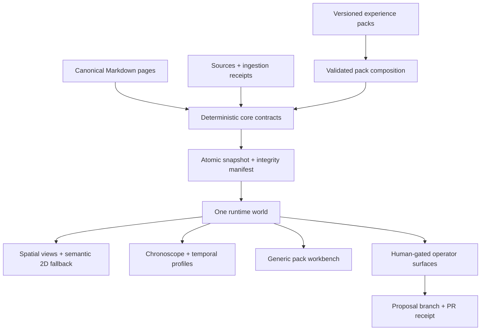

# Plan - Wiki Viva Release Truth, Temporal World and Experience Packs

Updated on: 2026-07-12.

## Executive Decision

The reviewed public v8 baseline and the private downstream pilot are **not yet
ready to merge or release as one semantically complete pair**. The public
portable payload is now an exact-subject candidate pinned to
`b781882a11e8bbac3ae9684d199979a1f4ee1bf7`; private adoption, human review and
external E5 authority remain mandatory.

The implementation is substantial and the underlying philosophy is visible in
real data, but the baseline review reproduced release-blocking failures that
the green CI result did not represent. The bullets below are the **historical
baseline reproduction**, not a description of the latest worktree:

- the public zero-data Genesis journey reaches a runtime error;
- native keyboard Tab does not move DOM focus out of `BODY` in the spatial
  world;
- a blocked `public-export` report can still serialize the unsafe value that
  caused the block;
- the declared canonical `action_state` is not consumed consistently;
- WebKit repeatedly renders an interactive target below the 44 px contract,
  while CI retries convert the result to green;
- view-specific group and lens state leaks across views and survives shared
  URLs;
- the private pilot reports all ingestion events closed while most historical
  events are not typed or exposed through the visual lifecycle contract;
- release evidence in the private pilot is stale relative to the reviewed
  HEAD;
- five of the seven demo manifests are descriptions, not independently
  executable worlds;
- the current timeline is a truncated activity feed, not the temporal memory
  system implied by the product philosophy.

This plan is the single active contract for recovering release truth and then
extending Wiki Viva into a **truthful, temporal, composable experience
kernel**. It preserves the delivered v8 foundation, reopens its unsupported
completion claims, and sequences the larger creative work into reviewable PRs.

The original sequencing rule was to keep experience packs, assets and the
temporal world out of the oversized stabilization PR. The active worktree now
contains those layers together so they can be reviewed as one coherent kit,
but the rule still governs claims: none of the expansion is released until the
P0/P1 stabilization boundary, exact-subject evidence and downstream adoption
are complete.

Implementation update after the clean-subject rerun: Waves 0–8 are committed
as public payload `S`, and the global adversarial freeze reports **no open
P0/P1 in the public payload**. The first exact browser attempt was deliberately
not waved through: **84/102 passed and 18 failed**. Route authority, browser
contracts and measured phone geometry were corrected in a second payload
commit. The final exact `S` then passed **102/102 public browser cells on the
first attempt, 0 skips, 0 retries, in 5.8 minutes**; **1,339/1,339 Python tests
with zero skips in 355.06 seconds**; **489/489 Vitest tests**; and **106/106
Node gate tests**. The production build, architecture, 42-asset, 26-snapshot,
pack, demo, bundle and matrix gates also pass; initial JavaScript is 162.38 kB
gzip. Nothing has yet been applied to the private consumer. RT-35, RT-132 and
RT-133 are closed at the public P0/P1 boundary; the causal cycle/time-direction
and future-pagination attestations remain explicit P2. The package and this
plan form metadata envelope `M`, pinning the exact `S`; complete release truth
still requires exact private adoption `P`, external E5 and human gates.

## Consolidated implementation ledger — active pass

This section is the current execution surface; earlier counts and defect
captures below remain historical evidence. A green worktree is still not an
E5 release claim. The subject sequence is deliberately split into portable
payload `S`, public metadata envelope `M` and private adoption `P`, so no commit
attempts to contain its own SHA and no private state becomes upstream proof.

| Wave | Current implementation state | Acceptance boundary before advancement |
| --- | --- | --- |
| 0 — release truth | Exact matrix is written/current at 102+2; the 102 public cells pass on exact `S`, first attempt, with zero retry/skip. Immutable evidence and browser-only receipt v1 are implemented. | Public browser closure complete; 2 mandatory downstream cells, human review and E5 remain separate. |
| 1 — public P0/P1 | Genesis 0, keyboard focus, action state, output containment, public projection, source vocabulary, stale operator, route identity and evidence integrity have synthetic regressions. | Exact `S` passed 1,339 Python, 489 frontend, 106 Node and 102 browser controls; no unowned waiver or hidden skip. |
| 2 — navigation/mobile/atomicity | One runtime grammar, surface singleton, mobile/fallback geometry, atomic content/snapshot activation, strict ports and primary-surface focus are implemented. | Desktop/mobile/WebKit/forced-fallback release cells and conceptual review. |
| 3 — source/event truth | Typed source lifecycle and a multi-clock temporal graph replace the false equivalence between activity feed and semantic history. | Public fixtures valid; later `P` must measure real private events and keep private identifiers out of public evidence. |
| 4 — executable demos | Seven isolated base scenarios, nine Genesis stages (0–8) and the Study/Research plus Personal Finance showcases are built by deterministic fixture repositories. Their manifests bind 22 claims to 12 canonical routes. | `wiki_build_demo.py --check`, complete sidecars, empty contract errors and route-level browser journeys. |
| 5 — visual system | Light Luminous Observatory and dark Night Mission Control themes, Focus/Balanced/Command densities, semantic tokens, licensed asset manifest and reduced/forced-motion/color fallbacks are implemented. | Named browser cells cover every theme×density pair, zoom, forced colors, reduced motion, keyboard and mobile; VoiceOver remains an explicit human release gate. |
| 6 — temporal kernel | `wiki_temporal_event.v1`, `wiki_temporal_graph.v1` and lazy 2D Chronoscope are implemented with strict semantic/occurred/recorded modes, lanes, ranges, deep links and a complete inspector. | Integrity/torn/partial/unsupported/stale states fail visibly; `P` proves real scale and clocks. |
| 7 — experience-pack kernel | Registry, manifest, exact asset tree, lock, receipts, dependency/slot composition, POSIX operation lock, CAS, rollback and review-branch lifecycle are implemented. | Adversarial concurrency, orphan, drift, SVG, traversal, symlink, privacy and localized-memory-root tests pass; packs cannot execute arbitrary code or weaken gates. |
| 8 — starter packs | Study/Research conformance and Personal Finance vertical ship page types, templates, blocks, views, commands, operations, temporal descriptors, EN/PT-BR copy and public synthetic fixtures. A generic lazy `pack_view` makes canonical pages readable now. | Dedicated operation renderers/executors remain disabled until a separately versioned, human-gated adapter exists; the UI must never imply execution. |
| 9 — private adoption | Exact public `S` is proven and metadata `M` pins it; import has not started. | Import only allowlisted blobs into the private `wiki/*` branch, preserve config/memory/pack lock, install Finance dry-run first, regenerate, test real API/UI/Timeline/packs/themes/mobile/fallback and bind private receipt `P`. |

### Current architecture of the extensible kit



The compositional rule is intentionally asymmetric: declarative packs may add
vocabulary, templates, views and operation descriptors, while only the trusted
core/operator boundary may execute a mutation. This lets the open-source kit
grow into complete use-case products — finance, teams, PDLC, notes, studies,
references and later domains — without turning installable content into an
arbitrary plugin execution channel.

## North Star

> One truthful world, many composable experiences, with time as a first-class
> dimension and every conclusion traceable to evidence.

Wiki Viva should behave like an extensible operating environment for Markdown
memory rather than one fixed dashboard:

- **truth before spectacle** — every visual encoding must map to inspectable
  data, state and evidence;
- **one world, multiple lenses** — views change interpretation, not identity;
- **pages are places** — any meaningful page can become a navigable center;
- **time is structural** — history, change, commitments, validity and
  provenance are navigable dimensions;
- **operations are reviewable** — writes become proposals, receipts and PRs;
- **packs compose** — vertical use cases install coherent schemas, views,
  workflows, fixtures, tests and visual language without forking the core;
- **dense does not mean opaque** — progressive disclosure, stable semantics,
  readable typography and accessible fallbacks protect interpretation;
- **public first, private proof** — shared behavior is proven with synthetic
  fixtures, then pressure-tested against real private data without publishing
  private content.

## Release Status At This Review

| Surface | Reviewed baseline | Automated state | Human/product state | Decision |
| --- | --- | --- | --- | --- |
| Public baseline | Public feature branch at `31b94d81`; exact PR metadata stays in the Git review surface | Remote checks green; Python, frontend and most browser tests green | Confirmed P0/P1 failures at that revision; no human review decision | Block merge and release |
| Public payload `S` | Exact subject `b781882a11e8bbac3ae9684d199979a1f4ee1bf7` | 1,339 Python, 489 Vitest, 106 Node and 102/102 public browser cells pass; 0 skips/retries; matrix remains 102+2 | Global adversarial verdict has no open public P0/P1; human review and E5 remain | Public release candidate; do not tag until `P`, E5 and human gates converge |
| Private pilot | Sanitized downstream checkpoint; exact branch, HEAD and PR remain in the private release receipt | Downstream automated suites were green at the checkpoint | Real-data philosophy is viable, but provenance, event typing, timeline and evidence receipts are incomplete | Block semantic approval |
| Public demos | Seven executable base scenarios, nine Genesis stages and two pack showcases exist | 22 claims bind test IDs; 12 canonical routes are collected; generation is deterministic and exact browser cells pass | Gallery, source/failure/compatibility/accessibility worlds and pack Chronoscope are concrete | Exact public candidate complete; repeat with private composition on `P` |
| Visual system | Light/dark themes, three densities, semantic tokens, licensed asset manifest, WebGL and 2D fallback render | 489 frontend tests pass; PT-BR WebGL/fallback and long-copy browser cells run; 42/42 asset controls pass | Updated desktop/reader/mobile baselines were visually compared; VoiceOver remains a human gate | Automated candidate complete; run final human accessibility gate |

The public baseline PR changes 1,461 files with roughly 275k additions and
7.9k deletions across 68 commits from `origin/main`. The private pilot is also
a very large downstream diff; its exact Git metadata remains private. Generated
artifacts are a large majority of the public insertion volume. Passing tests
are necessary, but this diff size makes conceptual review, semantic drift
detection and evidence freshness explicit release requirements.

## What Was Reviewed

### Public kit

- branch, diff, PR state and remote checks;
- Python core, snapshot, upgrade, consolidation, event, template-block and
  operational-pass paths;
- React runtime, route state, reader, spatial scene, view geometry, mobile
  fallback and styles;
- all declared demo manifests and generated normal, dense and Genesis data;
- current unit, integration, architecture, bundle and Playwright gates;
- native browser journeys across entry, Genesis, world, guide, views, search,
  reader, nested centers, creation, missions, blocks, approval and intake;
- desktop and phone layouts;
- accessibility behavior observable through keyboard interaction, DOM state,
  geometry and screenshots;
- the historical proposal lineage and its changing product intent.

### Private downstream pilot

The private wiki was reviewed read-only with real data. Only aggregate,
non-identifying facts are recorded here:

- root-entity and context behavior;
- graph and collection membership;
- source and ingestion-event lifecycle;
- action state and receipts;
- snapshot contracts and temporal payload;
- real data pressure against recursive worlds and visual groupings;
- public-source SHA alignment, toolkit drift and release evidence;
- public/private gate parity;
- onboarding and local API behavior;
- editorial warnings and summary truncation.

No private screenshots, titles, names, source contents, paths or values are
part of this public plan.

### Evidence levels

| Level | Meaning | Allowed claim |
| --- | --- | --- |
| E0 | Historical plan or documentation intent | Explains why a capability exists; never proves it works |
| E1 | Static code or generated-payload inspection | Proves a contract or mismatch exists in the reviewed tree |
| E2 | Deterministic parser, unit or integration reproduction | Proves behavior under a controlled fixture |
| E3 | Current-run browser interaction and accepted screenshot | Proves the visible flow at one named browser, viewport and state |
| E4 | Sanitized current-run private-data validation | Proves the public design survives real downstream pressure without exposing data |
| E5 | Signed release receipt on exact public and private HEADs | Required before a release-readiness claim |

The current release has abundant E1/E2 evidence and several E3/E4 checks, but
does not yet have coherent E5 custody.

### Multi-agent consolidation rule

A second-agent report is a **review source**, not a new evidence level. Every
observation recovered from another coding agent must be classified as one of:

- independently reproduced in the current run;
- corroborated by code or an executable test;
- visual/architectural precedent requiring product judgment;
- unverified hypothesis awaiting E1-E4 evidence;
- refuted under the exact scenario that was alleged.

An independently reproduced observation reuses the existing RT finding when it
describes the same defect. A disagreement remains visible; it is not averaged
into a false consensus. Inline screenshots embedded in an agent transcript are
session context, not durable E3, until exported, inspected, hashed and attached
to the exact route/browser/viewport/revision.

### Claude checkpoint and adjudication

The parallel Claude workflow did not produce a second `.md` plan or edit the
repository. Its coordinator completed, but 37 verifier jobs ended at the usage
limit, so the adjudication set is incomplete:

| Checkpoint item | Value | Evidence status |
| --- | --- | --- |
| Local transcript bundle | Present in the local Claude project store; path, session ID, size and hash intentionally omitted | Local review source; not versioned release evidence |
| Workflow manifest, journal and scratchpad | Present locally; includes the lifecycle reproduction and volatile agent notes | Audit/reproduction input only; never a public release artifact |
| Agent coverage | 115 agents: 4 Understand complete, 8 Review complete, 63 of 100 Verify complete, 3 Vision complete; 78 results total | Useful breadth; incomplete vote set |
| Completed long-form material | Plan/release digest, intent archaeology, frontend map, backend map, pack assessment, timeline assessment and design research | All seven were recovered and routed into the matching sections of this plan |
| Review topology | 50 candidates and 63 verdicts: 21 double-confirmed, 1 confirmed unilaterally, 1 double-refuted, 2 refuted unilaterally, 8 split 1-1 and 17 without a verdict | Consensus is still a lead, not closure evidence; every adopted finding is rechecked in code or runtime |
| Visual material | Inline transcript images and attachment/workflow records are present, with duplication and mixed semantics | No numeric total is treated as stable; none were exported or accepted as durable screenshots |
| Coordinator state | Manifest says completed, while the six task cards remain stale at 3 complete, 1 in progress and 2 pending | Treat workflow completion as “coordinator stopped,” not as full verification completion |
| Repository writes | No Claude `Write`/`Edit`; no Claude-authored plan | Nothing to merge mechanically |

The recoverable local set comprises the transcript, workflow manifest and
journal, verifier artifacts, volatile scratchpad/reproduction scripts and six
stale task cards. A second read found no newer Claude artifact after that
checkpoint. Exact paths, UUIDs, sizes and hashes are intentionally kept out of
this public plan. These remain local, privacy-sensitive implementation records
rather than public release artifacts.

A third live check later on 2026-07-11 found the same boundary: the Claude
session was still stopped at its usage limit, its local cockpit preview was
still running, and the transcript, workflow manifest and journal were all
older than this canonical plan. No newer versioned file, verifier result or
repository write was available to consolidate. This negative-delta check is
important release evidence: an open preview and a completed coordinator label
do not imply that the interrupted adjudication resumed or that a second plan
exists.

A fourth process/filesystem check at 15:15 BRT found the Claude worker and its
local preview processes still alive but sleeping, with no new repository file,
workflow result, transcript delta or verifier artifact. The only recent local
session write was a small runtime plugin-inventory timestamp whose underlying
plugin record predated this review; it carries no project analysis and is not a
material to consolidate. Process liveness is therefore recorded separately
from project progress, and this check remains a verified no-delta rather than a
claim that Claude's interrupted work finished.

A fifth live filesystem/process check at 16:40 BRT found no Claude project-store
file written in the preceding 30 minutes. The same worker had been sleeping for
roughly eight hours and the public/private Vite previews were still alive. At
16:41 the local session refreshed its small plugin-inventory manifest, but the
only listed plugin record still carried its older 2026-07-09 update time; this
is runtime metadata, not project analysis. No plan, code edit, verifier result
or evidence manifest appeared. This closes the requested extra validation
round with another verified no-delta: the useful Claude material is the already
adjudicated set above, while current repository changes and test results belong
to this active implementation/review pass.

A sixth live process/filesystem check at 17:51 BRT again found no Claude
project-store write in the preceding 90 minutes and no repository material that
could be attributed to that workflow. The long-running worker remained alive
but sleeping. One local session manifest was refreshed at the time of the
check, yet its only plugin record still carried the older 2026-07-09 update
timestamp; its bytes are runtime inventory, not plan, code, verifier output or
visual evidence. The parallel-input boundary therefore remains unchanged: no
new Claude material exists to merge, and process liveness is not project
progress.

A seventh cross-check at 21:24 BRT reconciled the still-running Claude worker,
its working directory, the repository diff and every material file in the
local project store. The GUI was unavailable because the Mac session was
locked, so no interface state was treated as evidence. The filesystem record
is unambiguous: the last project transcript, workflow result, journal and
verifier artifacts remain the same interrupted 09:18 BRT set already
adjudicated above; the only July 11 write in the newer local-agent session is a
small plugin inventory refresh. There is still no Claude-authored `.md`, no
`Write`/`Edit` operation and no later test result to merge. This round therefore
consolidates zero new claims while preserving the seven previously recovered
long-form outputs and the executable findings already promoted into RT items.

An eighth process/filesystem checkpoint at approximately 23:05 BRT found the
same project boundary. The project transcript, workflow result and journal
still ended at the interrupted morning checkpoint; the only newer runtime write
was a plugin-inventory refresh with no project analysis. A separate clean,
detached Claude worktree was also inspected and proved to be historical July 1
material, not a hidden July 11 implementation branch. No Claude-authored plan,
repository edit, screenshot, test result or new finding existed to merge. This
is an eighth verified no-delta checkpoint, not evidence that the parallel task
completed.

The seven recovered long-form outputs were consolidated, not copied:

| Recovered output | Canonical destination in this plan |
| --- | --- |
| Release/plan digest | Executive decision, release truth and execution waves |
| Intent archaeology | Product intent lineage and North Star |
| Frontend map | Navigation/UX ledger, accessibility and visual architecture |
| Backend map | Snapshot, operator, publication and migration contracts |
| Experience-pack assessment | Pack schema, lifecycle and starter verticals |
| Timeline assessment | Temporal kernel, chronoscope and life/provenance views |
| Design research | Visual system, asset register and dense-futurist direction |

The valuable output is therefore an input set that this plan adjudicates:

| Claude observation | Current adjudication | Plan treatment |
| --- | --- | --- |
| Genesis stage 0 crashes while later stages render | Independently reproduced | Preserve RT-01 and add a formal empty-world contract |
| Galaxy does not restore the root world | Independently reproduced | Preserve RT-07 and define field-by-field reset semantics |
| Search `Return` selected but did not open | Refuted with native `Enter`; current run opened the reader and focused it | Preserve the working atomic search contract; do not create a defect |
| Mobile coordinate tap failed | Refuted for the alleged coordinate, which was outside the 375x812 viewport | Keep RT-05 target-size evidence; do not call the out-of-bounds tap a product bug |
| Radar is dense and visually strong | Independently observed | Use Radar as a visual precedent, while fixing microtext/contrast |
| Sources is a distinct universe | The route exists, but independent replay found `/w/sources` rendering `data-scene-perspective=quadrants` with Quadrants active | Add RT-39 and view-identity tests; do not claim the native Sources view is selected |
| Private operator was down | Reclassified as a transient duplicate-port startup collision | Add lifecycle/readiness/cold-start requirements, not a crash claim |
| Default local CORS exposes the operator to another app on an allowlisted dev port | Independently reproduced in a real browser: origin `127.0.0.1:5173` read the handshake nonce and completed an authenticated POST; origin `127.0.0.1:5199` was blocked as the negative control | Add RT-46; make the recommended proxy same-origin, remove implicit trusted origins and require explicit opt-in for any direct cross-origin client |
| One invalid authored source lifecycle value blocks the complete snapshot | Independently reproduced from the recovered synthetic fixture; the fail-closed contract is correct, but the vocabulary is not validated at the authoring/audit boundary and the final error omits the bad field value | Add RT-47; keep snapshot rejection while moving an actionable enum diagnostic into page validation and audit |

Items that lost one adversarial vote or received no adjudication remain in a
reproduction queue. They include long post-action rebuilds, frameloop telemetry
false positives, worker churn, per-frame allocations, fallback slugs/i18n,
compat action synthesis and cross-dock `src` leakage. They are not confirmed
findings in this plan.

Public queue IDs preserve the incomplete topology without exposing local agent
records or pretending that an absent vote is a refutation:

| Queue ID | Adjudication class | Count | Reproduction owner | Promotion/discard condition |
| --- | --- | ---: | --- | --- |
| `CLAUDE-Q-SPLIT-*` | One confirm / one refute | 8 | Matching runtime or backend slice owner | Promote only after a minimized public fixture reproduces; discard only after the exact alleged scenario passes deterministically |
| `CLAUDE-Q-UNI-*` | One-sided result | 3 | Review coordinator | The confirmed Genesis-0 case is already RT-01; the two unilateral refutations remain non-actionable unless independently replayed |
| `CLAUDE-Q-NOVOTE-*` | No verifier result | 17 | Performance, i18n, compatibility and operator owners by topic | Keep out of the defect ledger until code inspection plus E2/E3 evidence exists; usage-limit absence is never evidence |

The local manifest is the lookup table from these public ranges to individual
candidates. It is intentionally not copied into the public repository.

To make the queue executable without exposing local IDs, the eight split
topics are: fallback/performance-gate semantics; real rollback versus string
validation; duration-dependent fixed waits; concurrent snapshot POSTs;
receipt TTL versus operation duration; Genesis scenario identity/seed;
central-cluster reveal; and prototype-key safety. The seventeen no-vote items
are grouped into four public work packets: compatibility routing/i18n;
fallback cap and accessible legend; rebuild/frameloop/feedback budgets; and
worker churn/per-frame allocation. None becomes an RT finding without code
inspection plus a minimized E2 or accepted E3 reproduction.

## Product Intent Recovered From The Proposal Lineage

The direction has evolved consistently, even when implementation arrived in
separate slices.

| Date | Proposal or implementation turn | Durable intention | What the current plan preserves or corrects |
| --- | --- | --- | --- |
| 2026-07-01 | 3D operational dashboard | Mission control, human-first operations, Git as a real gate, 3D for sensemaking and 2D for precision | Preserve the operations-room metaphor; make evidence and next action more prominent than decoration |
| 2026-07-02 | 3D navigation and one-world cockpit | Navigate in-world; eliminate route islands; map Approve, Add, Health and Codex to one grammar | Repair route-state ownership and make every exit/reset deterministic |
| 2026-07-03 | Sources, templates and facets | Sources become places; templates become visible; facets alter interpretation | Finish source-to-event visual truth and evolve template packages into real experience packs |
| 2026-07-07 | Recursive quadrant centers | Every eligible page can be a center; AQAL lenses are center-relative | Preserve recursive worlds; enforce invariants with real-data and URL tests |
| 2026-07-08 | Visual region grouping | Purpose-first grouping, attention summaries and hidden density | Correct action-state summaries so attention reflects canonical work |
| 2026-07-09 to 10 | Unified v8 living world | One runtime, one route grammar, blocks, overlays, registries and a private migration | Keep the foundation, reopen unsupported completion claims and decompose hotspots |
| 2026-07-11 | Current cross-repo review | Treat time, vertical use cases, visual themes and extension operations as product surfaces | Add a temporal kernel, executable demo laboratory and installable experience-pack system |

### Reference-only historical inputs recovered

Four local planning documents were recovered from the earlier design sequence.
They remain reference-only inputs until their durable decisions are implemented
or promoted to versioned repository contracts; this plan preserves decisions,
not local filenames, sizes or hashes. Exact source integrity remains in the
local review inventory.

| Historical input theme | Durable intention retained here |
| --- | --- |
| Flow reconstruction | Founding ritual, curated create palette, navigation never blocked, first-minute guidance and two-level reading |
| Spatial interface | Primary interaction in-world, camera/objects as interface and an explicitly declared 2D fallback |
| Genesis by templates | Deterministic Genesis stages, interface composed by stack, detachable gamification and template identity |
| Templates and blocks | Blocks, resolution rings, sub-lenses, relations, human/agent skills, intake, demo and full template contracts |

The Claude project memory also preserved four compact intent summaries. Their
sanitized decisions, rather than local basenames or transcript hashes, are:

| Intent summary | Decision recovered |
| --- | --- |
| Modular blocks | A template composes behavior and interface, not only fields |
| Agent missions | Missions are deterministic, evidence-derived and end at a human/Git gate |
| Cockpit UX principles | Simple and direct can still be stunning and information-dense; every graphic must be useful |
| Presentation grammar | The recovered baseline said hue=context, but the accepted v8 registry supersedes it: active overlay owns node body hue/ring; context owns position/label/keyline; shape owns kind; typed lines own relations. This adjudication prevents two meanings from competing for one color channel. |

Additional recovered semantic decisions are now explicit requirements:

- relationships mean memory, care and reciprocity, not a sales funnel or
  person score;
- Q1 sub-lenses cover perception, intention and identity;
- Q2 covers behavior, production and human capabilities;
- Q3 covers people, networks, encounters and culture;
- Q4 covers tools, processes, sources, automation, governance and agent skills;
- gamification, missions and ambient effects remain detachable layers;
- the demo must show the world being founded from zero rather than beginning
  only after a populated snapshot already exists.

The resulting trajectory is not “make the dashboard prettier.” It is:

```text
operational dashboard
  -> spatial living world
    -> registry-driven interaction runtime
      -> temporal memory engine
        -> composable experience operating system
```

## Verified Strengths To Preserve

The review found a strong foundation. The corrective work must not erase it.

### Method and philosophy

- The private pilot has a real semantic root rather than treating the
  technical index as the subject of the wiki.
- Recursive centers work across a large real graph: every sampled anchor had a
  non-empty local world.
- The root respects the four-quadrant model with no synthetic Q0 leakage.
- Sources, actions, collections, relationships and evidence are represented as
  typed operational objects rather than only prose.
- Non-terminal private actions currently have next actions; terminal private
  actions currently have receipts.
- The public/private boundary and “shared fix in public first” rule remain the
  correct governance model.

### Runtime and interaction

- Quadrants, Radar, Sources and Work have recognizably different geometries.
- Native Search Enter currently commits query and reader in one route
  transaction, clears an incompatible dock, survives the delayed query update
  and focuses the reader; nested-center flows are also functional in the normal
  public demo. Stabilization must preserve this behavior.
- The reader is materially more legible than earlier foreground/background
  states and exposes hierarchy and evidence context.
- Responsive mobile WebGL keeps core operations and search-to-reader usable on
  supported phones. The forced 2D renderer is a separate compatibility surface
  and still lacks visual parity.
- The Blocks and Missions surfaces demonstrate that modular behavior and
  operations can coexist in the world.
- Radar's rings and attention encodings are the strongest current visual
  direction for the Chronoscope and future pack surfaces, despite remaining
  microtext and distant-contrast debt.

### Engineering

- Snapshot v2 produces 24 validated payloads.
- Demo generation is deterministic for the scenarios that are materialized.
- Python and frontend unit coverage is broad.
- Bundle size remains controlled despite the implementation volume.
- Remote CI runs public and private variants.
- The private pilot provides valuable real-data pressure without being used as
  the public proving ground.
- The local operator already blocks sample data outside `/demo`, restricts the
  host to loopback, negotiates mutation capabilities, rotates a nonce and uses
  stable attempt keys for one replay after re-handshake. The remaining work is
  to prove repository/revision identity, lifecycle readiness and exact
  real-operator E2E.

## Confirmed Findings

### Severity contract

| Severity | Definition | Release effect |
| --- | --- | --- |
| P0 | Security/privacy failure, primary journey failure, keyboard trap, corrupt canonical truth or evidence that can leak rejected data | Must close before merge |
| P1 | Major semantic, navigation, mobile, atomicity, provenance or executable-coverage gap | Must close before release candidate approval |
| P2 | Maintainability, visual hierarchy, documentation, i18n, warning or quality debt with a safe workaround | Schedule before broad adoption |
| P3 | Strategic enhancement or optional sophistication | Deliver through follow-up capability PRs |

### Baseline defect ledger

Unless a row explicitly says otherwise, this ledger records the public
`31b94d81` baseline or the sanitized private checkpoint. Closure candidates and
the latest uncommitted worktree evidence live in the following section; this
separation prevents fixed worktree behavior from rewriting the historical
reproduction.

| ID | Severity | Confirmed behavior | Current evidence | Required closure proof |
| --- | --- | --- | --- | --- |
| RT-01 | P0 | Clicking the zero-data Genesis journey reaches `Invalid center ''` and the cockpit error boundary | E3 baseline screenshot; `RuntimeWorldView.tsx:30`; `WorldRuntime.ts:24-28`; baseline stage-0 snapshot has no pages/root | Click-driven E2E for all Genesis stages, including 0; no console/runtime error; valid empty-world contract |
| RT-02 | P0 | Native `Tab` from the spatial world leaves `document.activeElement` as `BODY` | E3 baseline browser reproduction; `SystemScene.tsx:1871-1887`; baseline E2E focuses controls programmatically | Keyboard-only journey from browser chrome to every primary operation, reader and exit in Chromium, WebKit and Firefox |
| RT-03 | P0 | A blocked public export can serialize the unsafe path/secret it detected, and the CLI writes before failing | E2 synthetic secret/path reproduction; `upgrade.py:1077-1173`; `wiki_upgrade_report.py:90-100` | Snapshot tests asserting forbidden raw values are absent from JSON, Markdown, stderr and saved artifacts |
| RT-04 | P0 | `action_state` is declared canonical but some rollups and compilers use editorial `status` | E2 contradictory state fixture; `template_blocks.py:1524-1528`; `wiki_operation_compile.py:432-440`; `operational_pass.py:960-968` | One resolver, one transition table, contradictory-field tests, receipts enforced consistently |
| RT-05 | P1 | WebKit renders an affected target at about 43.2-43.6 px; three of five no-retry repeats failed | E2 Playwright repeat; `mobile-parity.spec.ts:37-43,238-400`; retry at `playwright.config.ts:15` | Five consecutive no-retry passes per supported phone/browser with all targets at least 44x44 CSS px |
| RT-06 | P1 | Switching view preserves stale group/lens; URL refresh/share preserves the mismatch | E3 route reproduction; `WorldReducer.ts:34-38`; `WorldView.tsx:479-482,1723-1733` | Transition-table tests for every native view, group, lens, center, overlay and reader combination |
| RT-07 | P1 | “Galaxy” can be a no-op or partial reset because it does not reset every center/lens/world-group field; the second-round group journey cleared `group` but retained `lens=q2_pratica` | E1 `WorldView.tsx:1575-1583`; E3 screenshot SHA prefix `5e2336097db2` and URL readback | One root-reset action with exact canonical URL and history semantics |
| RT-08 | P1 | Snapshot promotion briefly removes the public directory between renames | E2 concurrent reader reproduction; `snapshot.py:2652-2657`; loader has no retry | Revisioned immutable directory plus atomic pointer swap; concurrent stress reader never sees absence or mixed revision |
| RT-09 | P1 | Most private historical ingestion events pass closure but are absent from the visual event contract | E4: 134 real events, 115 legacy-typed, only 19 canonical-typed; 15 unique events reached visually | Shared identity adapter; public legacy fixture; migrated private events; equality gate across closed, typed and visually reachable events |
| RT-10 | P1 | Event builder/template still emit `source_catalog`; demo events may parent to the technical index | E1 `consolidate.py:306-323`; `ingestion-event.md:5-8`; `wiki_build_demo.py:1060-1072` | Canonical `ingestion_event` page type and source parent in generator, template, demos and migration |
| RT-11 | P1 | Five of seven demo manifests are not independently materialized or exercised | E1/E2 `wiki_build_demo.py:60-71,1764-1774`; `snapshot.ts:81-104`; shallow manifest tests | Seven selectable snapshots; every declared assertion mapped to a test ID; expected failures actually asserted |
| RT-12 | P1 | Private release evidence refers to older SHAs/counts and current preflight is blocked | E4 exact-HEAD preflight; current release note count differs from current snapshot | Versioned sanitized receipt signed with public SHA, consumer HEAD, snapshot hash, command list and gate results |
| RT-13 | P1 | Timeline summary counts 581 private events but returns 160 with no truncation metadata | E4 payload inspection; `timeline.py:100-177` | Paginated temporal payload with total/returned/cursor/truncated fields and full semantic event classes |
| RT-14 | P1 | Reader searches for `source_ingested`, but the current timeline builder never emits it | E1 `PageReader.tsx:711-723`; timeline event kinds | Graph-derived provenance navigation or a tested temporal event contract that emits the promised relation |
| RT-15 | P1 | Baseline CI hid one flaky WebKit test and two skipped endpoint tests; current `playwright.config.ts` still enables one retry whenever `CI` is set | E2 baseline suite: 56 passed, 1 flaky, 2 skipped; E1 current CI config/workflow | Dedicated public and downstream release commands force `retries=0`, fail on first-attempt instability and prohibit skips in every required matrix |
| RT-16 | P2 | Runtime/UI responsibility is concentrated in very large modules | E1 line counts: `styles.css` 10,178; `perspectives.ts` 2,378; `SystemScene.tsx` 2,184; `WorldView.tsx` 2,105 | Decomposition by semantic ownership plus size/complexity budgets and unchanged contract tests |
| RT-17 | P2 | Architecture gate reports zero debt while not measuring complexity or state ownership | E1 architecture gate scope versus current hotspots | Add route ownership, complexity, module-size and generated-diff gates |
| RT-18 | P2 | Snapshot checker defaults to a port different from documented local startup | E4 clean-setup reproduction | One shared config source or explicit `--url`; README command passes unmodified |
| RT-19 | P2 | Private audit is green with 33 warnings, 8 stale pages and 6 pending LLM passes | E4 current checks | Warning budget, owners and expiry; separate informational warnings from release debt |
| RT-20 | P2 | 468 of 561 private snapshot summaries are truncated | E4 payload inspection | Lens-specific snippets and full sidecar fallback with visible truncation state |
| RT-21 | P2 | Visual controls contain hard-coded English and one mixed Portuguese string | E1 `WorldView.tsx` visual-controls area | Namespace every visible string and test EN/PT parity |
| RT-22 | P2 | The visual system is dark-only, uses many raw colors and has no automated contrast scanner | E1 CSS/token review and E3 screenshots | Semantic tokens, light/dark themes, axe/contrast checks and manual high-contrast review |
| RT-23 | P1 | Page graph default base can resolve to the feature branch upstream and report no change; the historical receipt wording could also call a clean checkout a release closure with `base_sha: null`, so “passed” did not prove comparison with a reviewed base | E2 default versus `--base main`; E2 clean synthetic receipt with `overall_status=passed`, `base_sha=None` | Explicit reviewed base SHA/ancestor in CI and every clean browser closure; base-less local evidence stays blocked and cannot use release wording |
| RT-24 | P2 | OKF gate passes while reporting seven broken internal links | E2 current report | Define zero broken internal links for release, or document a narrow typed waiver |
| RT-25 | P3 | Current “packages” only bundle known blocks; they do not install full experiences | E1 two current packages and block-existence validator | Versioned experience-pack manifest, CLI lifecycle, fixtures, views, operations and migrations |
| RT-26 | P1 | Synthetic demo surfaces enable “Create — drafts a PR” and present active Run/Run checks controls without an unmistakable read-only contract | E3 current demo interaction; mutation was deliberately not triggered during read-only audit | Disable mutations and network writes in public demo mode; show a clear explanation and add negative request assertions |
| RT-27 | P1 | The forced 2D fallback exposes links in the DOM but visually duplicates controls, adds an internal scrollbar and renders a sparse scatterplot with weak context | E3 forced-fallback screenshot and route | Purpose-built list/table/card/timeline fallback with semantic parity, one scroll model and the same canonical URL |
| RT-28 | P1 | A nested center breadcrumb shows only Galaxy and the active center, losing its ancestral path and the reason for recentering | E3 nested-center journey | Persistent state rail showing ancestry, current selection, lens and overlay plus a deterministic previous-center action |
| RT-29 | P1 | A generic safe query on real private data returned 136 results while a specific query returned one; no strong ranking or perceptual limit is visible | E4 sanitized search journey | Exact/title-first ranking, typed filters, scoped groups, bounded first page and explicit “show more” |
| RT-30 | P2 | Internal identifiers such as rendering primitive names and repository paths leak into reader copy; an approval empty state is contradictory | E3 reader and approval screenshots | Human-facing labels by default, technical details behind disclosure, and copy-state contract tests |
| RT-31 | P2 | View transitions can remain visually incomplete for roughly 1.4–1.8 seconds, forcing screenshot retries | E3 repeated view capture | A testable `visual_settled` signal derived from data, font, layout and animation completion |
| RT-32 | P1 | Portable-path normalization accepts interior traversal such as `../../wiki_core/evil.py`; case variants such as `.ENV` or `Secrets.txt` can also bypass the case-sensitive blocklist inside an allowed tree | E2 controlled calls to `portable_path_status`; `upgrade.py:254-279`; current v8 upgrade package | Canonical repository-relative path parser; reject absolute/empty/dot/`..` segments before globbing; case-fold sensitive-name policy; adversarial Windows/macOS/Linux tests |
| RT-33 | P1 | Migration evidence can claim non-distinct commit boundaries, while the human-readable report omits structured warnings and expiry windows | E1 `upgrade.py:976-1010,1057-1075,1187-1263` | Validate ordered, distinct, repository-existing commits and rollback target; render warnings/owners/windows identically in JSON and Markdown |
| RT-34 | P0 | The dynamic operator content endpoint combines metadata from its cached snapshot with Markdown read from the current filesystem, then labels both with the old `snapshot_id`; static generated sidecars are not affected | E1 chain through `server.py:112-126,293-301`, `content.py:153-168` and frontend revision check `snapshot.ts:321-329` | Resolve page body from the same immutable revision as the cached snapshot or issue a new revision; mutation-between-snapshot-and-reader test must reject mixed content |
| RT-35 | P1 | Edits made outside the operator — editor, Git or another agent — can remain invisible in the 10-minute snapshot cache with no stale indicator | E1 `server.py:112-133`; current multi-agent workflow | Revision/fingerprint-aware invalidation or filesystem/Git change detection; display snapshot age/revision; external-edit test refreshes within the declared budget |
| RT-36 | P1 | Frontmatter references are coalesced to one target set before typed edges are emitted; a shared `moc_parent`/`source_ref` target or page-ID/path normalization can silently lose hierarchy or provenance | E1 `page_graph.py:162`; `snapshot.py:1096-1124` | Preserve field/basis through graph compilation and emit both typed meanings; ID/path and duplicate-target fixtures prove navigation plus provenance |
| RT-37 | P1 | The only API/UI tests proving connection to the expected real repository are environment-optional and account for the two skipped endpoint tests in the current run | E1 `snapshot-origin.spec.ts:23-55`; current release suite | Dedicated private/release job starts the exact operator and requires repo ID, snapshot revision/hash, capabilities and rendered UI; absence becomes failure, not skip |
| RT-38 | P2 | Pixel baselines force `?visual=1` and therefore prove only the 2D fallback; browser locale is PT-BR but the data-driven English cockpit is not rendered in a dedicated PT journey | E1 `visual-regression.spec.ts:21-60`; `playwright.config.ts:33-45`; `App.tsx:1277`; PT unit coverage exists | Separate accepted WebGL and fallback baselines plus explicit EN/PT-BR browser fixtures with long copy, reader, docks, errors and mobile |
| RT-39 | P1 | Canonical `/w/sources` can render `data-scene-perspective="quadrants"`, mark Quadrants pressed and announce `Quadrants 2 pending` while the URL remains Sources | E3 1440x900 screenshot SHA prefix `9899626c47f4`, DOM/ARIA readback and clean console at `/demo/w/sources?tour=0` | One registered-view identity drives scene, active control, status copy, URL and accessibility tree; matrix test for every view |
| RT-40 | P2 | `AmbientDriver` overwrites layout-provided root scale and resolved opacity/emissive values with fixed animation bases, then does not restore them when motion is disabled | E1 `particles-layer.tsx:226-252`; node material bases; two-agent agreement | Animate relative to captured semantic values and restore on cleanup/disable; unit/visual test proves motion on/off preserves encoding |
| RT-41 | P2 | An unhandled operator POST exception can close the connection before `_send_json`, leaving its attempt receipt `in_flight` until expiry | E1 `server.py:95-110,165-177,308-365` | Top-level exception-to-sanitized-receipt boundary; attempt always ends complete/failed; replay and timeout tests |
| RT-42 | P0 | Snapshot CLI accepts an absolute/out-of-repo output path and full-directory promotion replaces then recursively deletes all prior contents without containment, ownership marker or confirmation; related OKF/deploy path resolvers also accept escaped bases | E1 `wiki_web_snapshot.py:28`; `snapshot.py:2639-2705`; `okf.py:324`; `deploy_bundle.py:16`; controlled code-path review | Restrict every output resolver to approved roots, require an ownership marker, refuse unrecognized non-empty directories and require an explicit force flag; destructive-path tests preserve user files |
| RT-43 | P2 | A missing object during `git cat-file --batch` can leave the reader waiting for a normal blob header before process failure is handled | E1/adversarial review consensus; `upgrade.py:430-450` | Parse `missing`/error batch records, bound the read and add a partial-clone/missing-object test |
| RT-44 | P2 | An explicit false `evidence_redaction_required` value can override a non-public-safe privacy classification | E1 `upgrade.py:782-795` | Most-restrictive-wins privacy resolver; contradictory policy fixture; public report remains redacted |
| RT-45 | P2 | Collection cycles can be emitted without diagnostics even when the declared vocabulary forbids cycles | E1 `collections.py:136` plus current contract inspection | Cycle detector with actionable path; allowed/forbidden-cycle fixtures and migration guidance |
| RT-46 | P1 | The operator's default CORS allowlist trusts any app served from loopback ports 5173/5174; that origin can read the full GET surface and `/api/health` nonce, then satisfy nonce and attempt-key checks for POST | E2 real-browser synthetic operator: origin 5173 read a 43-character nonce and POSTed `list_proposals` with 200; origin 5199 failed with browser `TypeError`; `server.py:31-45,144-192,222-239,318-352` | Default to no direct cross-origin trust; use the documented Vite same-origin proxy; require explicit origins only when deliberately configured; browser regression proves 5173 is blocked by default and an explicitly configured loopback origin works |
| RT-47 | P1 | The first source-lifecycle repair validates only last-attempt and pipeline vocabulary. It still accepts `adoption_state: accepted` without `accepted_ref`/closure, silently lets flattened values override contradictory nested values, has no transition/history contract, and can echo an invalid access-secret value in the earlier audit diagnostic | E2 typo fixtures plus independent accepted-without-ref, flattened-versus-nested and synthetic-secret diagnostics | One resolver and full nested schema; dependency/transition/history rules for lifecycle, pipeline and adoption; conflicts fail closed; arbitrary values are redacted before logging; snapshot and authoring audit share the same verdict |
| RT-48 | P1 | An operator process started before the CORS hardening advertises the same `wiki_web_server.v4`/`operator_security_v1` handshake as the new code, so the cockpit cannot distinguish an unsafe stale process | E1/E2 combined-diff review plus live stale-process health shape; client only checked the v1 capability | Bump server and security contract versions, advertise the default-deny capability, reject v1 before mutation and show an actionable restart state |
| RT-49 | P1 | Deploy-bundle publication promotes the full snapshot and private sidecars before checking `data_boundary`; refusal then deletes best-effort and prints private page paths in the error | E1 combined-diff review at `deploy_bundle.py`; focused refusal test covered only successful cleanup | Validate frozen in-memory artifacts before any output creation/promotion; emit count-only diagnostics; preserve a prior public bundle on refusal |
| RT-50 | P2 | Legacy snapshot recognition uses `all(...)` over a possibly empty error list, so a valid unmarked current snapshot can be accepted as legacy-owned | E1 `snapshot.py` legacy recognizer and vacuous-truth review | Require the exact non-empty legacy error set plus compatible repository identity; valid unmarked current outputs remain unowned |
| RT-51 | P1 | A writer now enforces the action transition table, but the PR audit accepts manual rewrites of `completion_receipt`/other governed support fields when state/history are unchanged; leaving `blocked` can retain stale `blocker_reason`; and the Windows lock branch can write `\0` through an external hardlink | E2 manual terminal-receipt rewrite returned zero diagnostics; blocked-to-open retained the reason; synthetic Windows branch changed an external empty file to `b'\x00'` | Bind every governed support-field change to append-only history and before/after hashes; make terminal receipts write-once; clear incompatible state fields; require single-link lock/evidence files; run the real Windows branch in CI |
| RT-52 | P2 | Output-safety claims mention symlink coverage, but the focused tests do not yet exercise a target symlink or an ancestor symlink | E1 combined test inventory | Add target- and ancestor-symlink fixtures proving escape refusal and preservation of external/user files |
| RT-53 | P1 | `tests/test_frontmatter.py` used module-level `importorskip("hypothesis")`, but `requirements.txt` did not install Hypothesis; a clean CI environment reported one skip while collecting none of the module's 29 cases | E2 clean-environment collection with the declared requirements; E1 workflow/dependency inspection | Declare Hypothesis as a test dependency and import it normally so absence fails collection; clean environment must collect 29 frontmatter cases and the public full suite must have zero skips |
| RT-54 | P2 | Four finance-only downstream tests lived in the generic public suite and intentionally skipped because their scripts do not exist in the kit | E2 `pytest -rs`; E1 public/private test and script inventory | Keep those tests with the downstream that owns the scripts; public release suite contains only executable generic contracts and reports zero skips |
| RT-55 | P2 | Atomic snapshot promotion tests cover one failed stage-to-target rename with successful rollback, but not old-to-backup failure, promotion-plus-rollback double failure, invalid staged artifacts before activation or an artifact name containing `../` | E1 `snapshot.py` promotion branches and current test inventory; recovered Claude consensus rechecked in code | Add four minimized negative-path tests proving no unsafe write, byte-identical prior snapshot where rollback is possible and preservation/reporting of the backup after a double failure |
| RT-56 | P2 | Two permission-boundary tests skip when executed as root because `chmod(0)` cannot make the fixture unreadable for that user | E1 `test_intake.py` and `test_web_snapshot.py`; environment-sensitive skip conditions | Inject the read/open failure or run a declared non-root cell so every supported CI/container environment executes the contract rather than silently skipping it |
| RT-57 | P0 | The project-level Chromium `testIgnore` replaced the global downstream ignore, so the public release command imported the required private/operator spec and failed before collecting a public test | E2 real `playwright --list`: missing downstream environment, 0 tests; with synthetic env, 66 tests in 13 files including two downstream cells | Closed public `testMatch`/ignore per project plus a real collection gate that proves zero downstream files in every public project |
| RT-58 | P0 | E5 fabrication is now blocked, but repository-authored gate JSON plus a raw “report” containing only `{scope, tests}` can still produce `overall_status=passed`; command/toolchain strings remain self-attested | E2 clean synthetic repository and second-round minimal raw-report probe | Keep receipt v1 closure-only; independently reparse the real report/stats/config/cell set or label the result self-attested rather than passed; enable E5 only through a separately verifiable external CI/reviewer attestation |
| RT-59 | P1 | The downstream gate checked snapshot ID/hash but ignored `source_commit`; it could test a stale or dirty snapshot while stamping the current consumer HEAD | E1/E2 manifest/preflight/spec trace; unit control omitted `source_commit` and still passed | Require non-null snapshot source commit equal to exact clean consumer HEAD, expected public version/SHA and adapter hash, plus snapshot/runtime/server versions, integrity and empty contract errors |
| RT-60 | P1 | Content-bound staged/unstaged/untracked/submodule hashing now exists, but Git index flags can hide tracked byte changes: `assume-unchanged` preserved `dirty=false` and an identical fingerprint after the file changed; `skip-worktree`/sparse and ignored execution inputs have the same honesty boundary | E2 controlled A/B probe with `git update-index --assume-unchanged`: `dirty_before_after=False False`, identical fingerprint, different bytes | Canonical fingerprint plus fail-closed `ls-files -v/--debug` audit for assume/skip flags; declare every ignored runtime input that can affect gates; bind and revalidate all fields before/after receipt generation |
| RT-61 | P1 | The Node Playwright parser now cross-checks stats/config and exact cells, but receipt normalization still accepts a raw JSON object with no Playwright suites/stats/config and trusts the repository-authored normalized gate | E2 contradictory real-format report plus second-round `{scope, tests}` raw report yielding closure passed; current exact collection is 68 public cells and 2 downstream cells | Independently reparse the raw report at receipt time or bind an externally signed runner result; exact versioned cells; zero missing/extra/skipped/flaky/retry tolerance; hash every parser/config dependency |
| RT-62 | P1 | Fixed report/gate paths and pre-check ordering still permit stale evidence after matrix/build/Playwright failure. The checker deletes the prior gate, writes only stderr on error and has no `run_id`, timestamps or atomic blocked JSON, contradicting the runbook | E2 missing-report run: exit 1, gate absent; direct-write path; stale files survive failures before checker entry | One wrapper creates an immutable unique run before preflight, records `in_progress`, always atomically ends `passed` or `blocked`, binds subject before/after plus freshness/provenance and never reuses stale output |
| RT-63 | P0 | Metadata projection is bounded, but the files it links are not: an artifact containing a synthetic access key or email, an unknown `kind`, a public report with PII, and a hardlink to external bytes all produced `overall_status=passed`, `publication_boundary=public_safe` | E2 controlled artifact/report/hardlink probes; artifact collector only hashed bytes while publication scan saw receipt metadata | Closed artifact registry and semantic schemas; one descriptor snapshot with `st_nlink==1`; secret scan always and PII scan at public boundary; reject opaque/binary direct artifacts in v1 and bind a scanned textual visual-evidence manifest instead |
| RT-64 | P2 | The published JSON Schema accepted `dirty=true`, empty reasons, green status and promoted E5 although the Python semantic validator rejected the contradictions | E2 JSON Schema versus runtime probe | Encode cross-field invariants with `if/then/allOf`, identify and hash the semantic validator, and test the contradictory fixture against both layers |
| RT-65 | P1 | Descriptor snapshot/readback closes the original TOCTOU on POSIX, but Windows evidence, Node path-safety and action-lock fallbacks still use pre-check-then-pathname operations without handle-final-path/reparse verification. Hardlink checks do not close a concurrent junction/ancestor swap | E1/E2 descriptor/hardlink chain plus Windows branch review; current Windows job has no junction-race control | Keep flat static build supported, but fail receipt evidence validation/mutation and action writes closed on Windows until handle-pinned/reparse-safe traversal and real junction-race tests exist; POSIX keeps no-follow descriptors, `st_nlink==1`, one-read parse/hash/size and atomic readback |
| RT-66 | P2 | Downstream preflight fetches had no timeout or response-size limit, so a loopback endpoint could hang the release job or exhaust memory | E1 `fetchJson` implementation | Abort deadline, bounded response bytes, content-type/JSON checks and a persisted blocked result for timeout/oversize controls |
| RT-67 | P1 | Browser evidence still lacks durable run identity/freshness, and toolchain hashes omit executed dependencies: Node omitted `scripts/_git_subject.py`; the Python semantic-validator hash covered only `release_receipt.py` although it imports config, detectors, upgrade/path policy and Git helpers | E1 workflow/checker/import trace plus stale-run reproduction | Unique run/attempt/ref provenance; Merkle manifest of every local executed dependency plus runtime/browser versions; reject zero/non-ancestor bases; keep self-authored provenance informational until externally signed |
| RT-68 | P1 | Genesis stages 1-7 can render the guide over the active Create dock; at stage 2 `.genesisCard` intercepts the “Create here” pointer and the journey cannot advance by mouse/touch | E3 real Playwright timeout at `/demo/genesis?stage=2&visual=1`; the existing green E2E covered only stage 0 | Non-blocking guide/layout plus complete Genesis 0→8 mouse/touch/keyboard E2E with every transition and zero writes |
| RT-69 | P1 | Demo mutation blocking has route TOCTOU at both read and write boundaries: the POST fix rechecked immediately before send/retry, but `requestHealth()` could still await runtime config and emit the operator GET after the URL had already crossed to `/demo/world` | E2 delayed-health unit reproduced the original POST; independent E3 Chromium repro with delayed runtime config rejected the mutation but logged `GET /operator/health` while `pagePath=/demo/world` | Revalidate after every async URL/config boundary and immediately before health/POST fetch; abort/cancel where a live request is already in flight; crossing to demo must emit no new operator GET, OPTIONS or POST |
| RT-70 | P1 | Entering `/demo` still starts a real snapshot load before loading the synthetic bundle, so a private downstream can read `/api/snapshot` in background while the banner promises synthetic isolation | E3 public network showed duplicate snapshot requests; E1 unconditional `loadSnapshotBundle({demo:false})`; write-only E2E ignored GET/OPTIONS | Never start real load in demo, abort it on universe crossing, and fail E2E on any `/api/**` request while demo routes load only synthetic assets |
| RT-71 | P0 | The new browser evidence helpers accepted any in-repository `--out`/`--clear` path and called `rmSync`; a mistyped `README.md` target could delete canonical tracked content before validation | E2 controlled argument/code-path review of `capture-git-subject.mjs` and `check-playwright-release.mjs` | Restrict mutation to canonical owned+ignored release-evidence roots, reject tracked files and target/ancestor symlinks, and prove a README sentinel remains byte-identical for every rejected target |
| RT-72 | P0 | Standalone revision pruning resolves the active pointer without the publication lock; a concurrent switch can make the newly active revision look inactive and be deleted | E2 deterministic A/B/C publisher-pruner barrier left the active symlink broken and the loader exhausted eight attempts | Hold the publication lease from active resolution through validation/removal; multiprocess barrier proves the pointed revision is never a prune candidate |
| RT-73 | P1 | Revision leases and the `leases/` directory follow symlinks; loading/pruning can create or remove lock files outside the repository | E2 target-lock and whole-leases-directory symlink repros produced/deleted external files while load returned success | Descriptor-pinned real leases directory, `openat`/`dir_fd` with `O_NOFOLLOW`, regular `fstat`, SHA-only lock names and zero external mutation tests |
| RT-74 | P1 | Prune treats any old 64-hex directory as generated and recursively deletes it without owner, manifest or hash validation | E2 unowned `000…000/keep.txt` sentinel was removed | Only owned, contract-valid revisions whose manifest/recomputed hash equals the directory name are eligible; unsafe candidates block or remain with diagnostics |
| RT-75 | P1 | An existing owned/valid revision directory can be stored under the wrong requested hash and then activated successfully; the next reader rejects the pointer/manifest mismatch | E2 copied A under hash-B, promoted B, loader failed | Requested bundle hash == directory name == manifest hash == recomputed artifact hash in both existing-target and concurrent-install branches |
| RT-76 | P1 | Server health advertises a resolve-once pinned reader, while `snapshot_payloads()` rebuilds from current Markdown and ignores the active revision | E2 active snapshot A versus served rebuilt B produced different snapshot IDs | Serve the pinned active bundle and activate on write, or remove the capability and state the weaker contract; API response identifies revision and cleanup status |
| RT-77 | P1 | Archive/prune failure after the atomic commit raises a failure even though the new pointer is already active, leaving callers/attempt receipts with false refusal semantics | E2 injected prune error: exception raised, pointer changed, new revision active | Explicit commit point; return committed success with cleanup warning/recovery path, reconcile owned leftovers later, and test archive/prune failures separately |
| RT-78 | P2 | Public receipt scanning treated opaque SHA-1/SHA-256 values as prose; a random digit run inside a valid digest could satisfy Luhn and nondeterministically block a safe receipt as a credit card | E2 full receipt slice failed once on a generated cryptographic digest; deterministic `4242424242424242`-prefixed SHA-256 control reproduced the false positive | Mask only exact opaque cryptographic digests in the publication scan while continuing to scan paths, labels, release IDs, waiver metadata and all other human-controlled strings; keep a positive control proving the same Luhn value is blocked in a release ID |
| RT-79 | P2 | The stage-2 mobile Create surface no longer overlaps the Genesis guide, but its internal template overview collapses to an approximately 50 px text column, wraps “area overview” word-by-word and makes the disabled CTA visually resemble an active action | E3 inspected 390×844 screenshot `04-genesis-stage2-create-mobile-responsive.png`, SHA-256 `37ee85385bc3…`; current overlap assertion only compares guide and outer surface | Responsive internal grid with a readable minimum content width, explicit disabled affordance/contrast and screenshot/geometry assertions for the inner template card, form and CTA at 360×800 and 390×844 |
| RT-80 | P2 | The new Genesis “keyboard 0→8” test uses `locator.press("Enter")`, which focuses each target programmatically; it proves keyboard activation but not reachable native Tab order, focus visibility or absence of traps. WebKit keyboard/mobile controls still cover only Genesis 0 | E1/E2 `snapshot-origin.spec.ts` activation helper versus `keyboard-genesis.spec.ts` and `mobile-parity.spec.ts` coverage | Add a real Tab/Shift+Tab journey with focus assertions through every Genesis stage, at least Chromium + WebKit desktop and one mobile/switch-compatible control; keep direct activation as a separate functional test |
| RT-81 | P2 | The new flat-build fallback originally had only a Darwin-hosted unit test that monkeypatched `sys.platform="win32"`; no workflow exercised Windows path, rename or permission semantics | E1 original workflow had three `ubuntu-latest` jobs; E2 four selected controls pass locally | A narrow `snapshot-flat-windows` job now covers flat static build, no live-store creation, unowned flat read and absolute-output CLI refusal. Keep this finding open until `windows-latest` runs green on the reviewed commit; live publication remains Darwin/Linux-only |
| RT-82 | P1 | Owned revision validation checked the manifest contract but not the exact on-disk/repository identity: a declared `pages.json` symlink to identical external bytes was accepted, an owned revision carrying undeclared `user-extra.txt` could be classified as valid and pruned, and an internally valid foreign-repo bundle was accepted when its owner marker named the expected repo | E2 independent minimized loader/prune/foreign-repo repros after the first RT-72–RT-77 fix | Validate exact regular-file inventory and `manifest.repo.repo_id == expected owner repo` before load/reuse/prune/health; reject every symlink and undeclared/missing/foreign file set; preserve adulterated revisions and external referents without read/write/delete side effects |
| RT-83 | P1 | The durability receipt/health claimed directories were synchronized before and after pointer commit, but the source `activation_dir` side of rename/exchange and some archive transitions were not explicitly fsynced after their directory entries changed | E1 post-commit fsync trace compared with the advertised durability object | Define the exact crash-consistency boundary; fsync both affected directories after rename/exchange/archive, add injected order/failure tests, and narrow health wording wherever the filesystem/host remains authoritative |
| RT-84 | P2 | Activation-container cleanup removed the ownership marker before `rmdir`; an injected failure in between left an empty unowned directory that the next reconciliation preserved forever | E2 step-failure reproduction against `_remove_owned_activation_container` | Make cleanup atomic/recoverably owned, or leave a durable tombstone that the next publisher can safely recognize; next-run reconciliation must remove the owned empty leftover without guessing |
| RT-85 | P1 | Receipt v1 requires public and downstream gates to match one subject SHA/tree/worktree even though the documented downstream command runs in the private consumer checkout, so the intended two-repository closure is impossible | E2 two real synthetic repos: consumer gate produced subject/tree/worktree mismatch blockers under the public receipt | Subject-bound public-kit closure receipt plus a separate subject-bound private-adoption receipt; downstream preflight binds the upstream public SHA; only an external promotion attestation combines the two receipt hashes |
| RT-86 | P1 | Canonical demo ingestion events now correctly parent to their source, but the root quadrant compiler's nested-anchor summarization removes the five events from Alex's Q2 world while four required browser cells still require `family:event`, an event representative and a fixed source representative at the root | E2 deterministic final public run: 63/68, then the same four hierarchy cells failed in isolation after the MissionCard control was fixed | Adjudicate one explicit product contract without reparenting: either project source-owned events into a declared root collection with provenance, or update the journeys to enter the source world before its events; regenerate fixtures and make 68/68 prove the chosen hierarchy |
| RT-87 | P1 | First-publication activation validates the target under the cooperative publication lease, then uses unconditional `os.replace(pointer, out_dir)`; an external writer that creates an unowned file in that interval is silently clobbered | E2 read-only adversarial hook immediately before the final replace: publication committed, target became the revision pointer and injected arbitrary bytes were lost | No-replace activation for an absent target and identity/CAS-safe exchange for an existing owned pointer; deterministic race test preserves external bytes and reports non-commit/blocker honestly |
| RT-88 | P1 | Prune originally deleted a validated victim by pathname. The first quarantine repair still called `shutil.rmtree(quarantine)` after its second identity check; swapping that random pathname inside `rmtree` again deleted the arbitrary replacement while the owned revision survived elsewhere | E2 original post-validation swap plus post-quarantine/pre-rmtree swap: sentinel removed, victim reported removed, no warning | Quarantine no-replace, then perform descriptor-relative no-follow recursive deletion from pinned parent/root fds with expected dev/ino/type checks. Recompare the parent entry before final rmdir; any replacement remains untouched and the owned recovery state is reported. Document the unavoidable portable compare-to-rmdir micro-window |
| RT-89 | P1 | Rename-before-receipt fixed pre-existing cleanup collisions, but the receipt still bound only names/ID/SHA. Swapping the owned cleanup after receipt fsync for an external empty directory let the next reconciliation inherit the valid receipt and delete the external inode | E2 pre-receipt collision, intent-to-rename swap and post-receipt/pre-marker swap; the last case left the external empty path receipt-valid and it disappeared on the next publication | Bind cleanup intent/receipt v2 to dev+ino+type as well as ID/names/repo/kind; open/fstat no-follow and require the same inode before marker unlink, empty rmdir and reconciliation. Mismatch preserves both pathname and stale receipt/recovery state; never delete by name alone |
| RT-90 | P2 | The one-second health metadata cache fingerprints inode/size/mtime but not ctime, so same-size corruption with restored mtime can return `full_inventory_owner_repo_and_hash_valid` until TTL expiry | E2 warm-cache rewrite repro: ctime changed, immediate health returned cache hit/full-valid, post-TTL health became invalid | Include `st_ctime_ns` and descriptor-stable metadata in the cache key or narrow the claim; same-size/restored-mtime corruption must invalidate immediately |
| RT-91 | P0 | The private-adoption receipt validates a downstream preflight internally but does not cross-bind its `consumer_head` and snapshot source commit/SHA to the gate/receipt subject. A coherent repository-authored artifact set can therefore attest another consumer SHA and still pass | E2 minimized temp-repo tamper: changed all three preflight SHAs to a different valid SHA, refreshed support/gate/terminal hashes, then obtained `overall_status=passed` and zero semantic validation errors | Python normalizer and semantic revalidation must require all downstream consumer/snapshot source identities to equal the exact private gate subject; keep the Node checker assertion as defense in depth and add a coherent-artifact tamper test |
| RT-92 | P1 | The visual-evidence manifest initially did not open linked images; the first repair checked strict PNG framing/CRCs/dimensions but still accepted a CRC-valid 74-byte file whose IDAT was not a zlib stream. Missing, mutated or non-decodable visuals could therefore satisfy the required artifact | E2 nonexistent-image fixture plus minimized corrupt-IDAT PNG: `_image_dimensions` returned 640x360 while zlib reported `incorrect header check` | Safely open no-symlink/no-hardlink PNG bytes, verify hash/size, metadata-free structure and bounded full pixel-stream decode with exact scanline/filter profile; bind capture dimensions and route/browser/viewport/state. Absence, mutation, corrupt IDAT, trailing stream or decompression bomb must fail; pixel-content privacy remains a human public-synthetic gate |
| RT-93 | P1 | Action transition audit binds state, governed support and append-only history but not the action identity. Changing only an existing action's `page_id` returns no diagnostic, and transition entries omit `page_id` | E2 minimized before/after action probe: `action-synthetic-review` became `action-reidentified` with `action_transition_diagnostics(...) == []` | Treat existing action `page_id` as immutable in receipt v1, include it in every new transition entry/receipt identity, validate appended entries against the audited/current ID and add rewrite/history-tamper tests |
| RT-94 | P0 | Python receipt validation accepts any safe-path, internally self-consistent release-matrix contract. The canonical test helper replaces the real 68+2 matrix with a derived one-public/one-downstream-cell contract and still obtains passed closure | E2 independent code/test trace plus coherent one-cell raw report/gate/terminal fixture; `_validate_release_matrix_contract` checked shape/minimums but not canonical tracked identity | Require the exact tracked matrix-contract path and bytes, include its JSON in the toolchain dependency manifest, re-read/hash it during semantic validation and add explicit one-cell shrinkage/alternate-path tamper tests |
| RT-95 | P1 | Toolchain file hashes are revalidated, but runtime/browser provenance is self-attested. Coherently changing Node/Python/Playwright versions to `99.99.99` and refreshing hashes still yields zero semantic errors; actual browser engine versions are absent | E2 minimized manifest/gate/terminal tamper against current receipt validator | Cross-check Python against the validator runtime, Playwright against canonical matrix/package lock and Node against the executing runner; capture actual browser engine identities/versions or explicitly mark them unverified and block release closure until a verifiable runner binds them |
| RT-96 | P1 | Gate and terminal timestamps are only checked for parse/order, not freshness relative to receipt creation. Coherently changing the run to 2000-01-01 while keeping a 2026 receipt still yields zero semantic errors, so stale same-subject browser evidence is replayable indefinitely | E2 coherent timestamp/hash tamper with unchanged receipt subject and `created_at` | Declare a bounded run duration and evidence-to-receipt window; require receipt creation at/after terminal finish within that window and keep production CLI clock-owned. Validate historical receipts by internal chronology, not by expiring them against today's wall clock |
| RT-97 | P0 | Public gate, raw Playwright, supporting and terminal JSON are scanned for access secrets only. Extra email/CPF fields can remain in those bound files, be discarded from the normalized projection and still yield `publication_boundary=public_safe` | E1 scope-insensitive `_assert_no_access_secret` calls plus coherent PII injection path; declared artifacts alone used the public secret+PII scanner | Every byte bound by a public receipt uses secret+PII scanning; private adoption remains secret-only. Positive tests inject PII into raw report, gate, support and terminal evidence and prove public refusal/private acceptance |
| RT-98 | P1 | Registered `snapshot_manifest` artifacts are checked only for a handful of fields. A five-field invented manifest with an arbitrary bundle hash passes without owned inventory, referenced files, recomputed bundle hash, repo or source identity | E2 direct `_validate_artifact_kind(kind='snapshot_manifest')` probe returned the v2 schema for the fabricated object | Remove the kind from receipt v1, or reuse the canonical full owned-snapshot validator and close over every artifact/repo/hash/source identity; minimal fake and referenced-file mutation controls must fail |
| RT-99 | P1 | The public release runner builds the current subject but local Playwright config uses `reuseExistingServer: !CI`; without forcing release mode, it can test an unrelated/stale server already listening on 4173 and stamp the current Git/toolchain | E1 `playwright.config.ts` and runner environment trace; production command does not set CI or a release-only no-reuse flag | Dedicated release-run environment, `reuseExistingServer:false`, run-owned/unique port and bound build/server provenance; a stale sentinel listener must make release execution block rather than be reused |
| RT-100 | P1 | Release-evidence paths are prechecked, then Node truncates/unlinks/rename-overwrites by pathname and the Python receipt CLI uses `os.replace`. A non-cooperating writer can insert or swap an unowned file between validation and mutation and have it clobbered | E1 final release-path implementation review; run evidence is already designed around unique immutable run directories | Make every gate/report/terminal/receipt output create-once and no-replace (`O_EXCL` or temp+link/no-replace); remove pre-delete/rewrite behavior. Any occupied path blocks and preserves bytes unless an explicit inode-pinned owned replacement protocol is introduced; add exact race/no-clobber controls |
| RT-101 | P1 | The snapshot graph flattened every frontmatter reference into one untyped list, then labeled every non-parent edge `source_ref`. Reciprocal `related_pages` and config/evidence links therefore became false provenance cycles and blocked the real public snapshot contract | E2 full deterministic gate rerun: three `forbidden relation cycle (source_ref)` paths across methodology source/config/coverage and the perceptive journal/map | Preserve frontmatter field provenance while compiling relations: only authored `source_refs` emit `source_ref`; `related_pages` emit an explicit cycle-tolerant relation; hierarchy and collection keep their own contracts; regression proves reciprocal related pages remain valid without weakening source-provenance cycle rejection |
| RT-102 | P1 | RT-99 gave the release runner a unique strict port, but three nested browser contexts and one intercepted snapshot fetch still hard-coded `127.0.0.1:4173`. The first real 68-cell wrapper therefore tested the dedicated server for most cells while three helpers crossed to a refused/stale port | E2 first full hardened wrapper: 65/68, with three exact `ECONNREFUSED 127.0.0.1:4173` failures; the same five affected cells passed on a dedicated non-4173 port after repair | Every helper derives its origin from the Playwright project/request that owns the run; forbid literal default origins inside release specs; keep strict unique port and no server reuse |
| RT-103 | P0 | Ad-hoc Playwright used `outputDir: ./test-results`; Playwright clears that directory at startup, so a normal diagnostic run deleted the supposedly immutable unique evidence under `test-results/release-runs` | E2 filesystem readback: prior blocked run directories disappeared immediately after a direct focused run; release writer create-once guarantees cannot protect a parent recursively owned by another cleanup process | Give disposable local Playwright artifacts a disjoint child directory that cannot contain `release-runs`; encode non-containment in the Node gate; release artifacts remain unique/create-once and no later diagnostic may target their ancestor |
| RT-104 | P2 | The zero-write Genesis cell redundantly drove a second keyboard-like journey with direct `locator.press`, conflating local-state/network proof with native navigation. Under the full GPU/browser sequence it stayed at stage 4 once, while the dedicated native Tab/Enter cells and 10 isolated repeats passed | E2 second full hardened wrapper: 67/68; isolated control 10/10; dedicated Chromium/WebKit keyboard journeys green in the same matrix | Keep native sequential keyboard proof in its dedicated cells; make the zero-write journey use one deterministic pointer path, retaining exact zero-network assertions and no Playwright retries |
| RT-105 | P1 | Exact core-generated temporal event IDs could be interpreted as payment-card candidates by the generic Luhn detector, blocking a public synthetic snapshot even though the opaque suffix was a deterministic digest | E2 Study/Finance snapshot build plus minimized exact-ID probe; arbitrary near-matches and authored values remain in scope for the scanner | Mask only the exact core-owned `evt_*_<24hex>` identity field for PII/entity scanning while retaining the full access-secret scan; near-match, authored-card and public-showcase controls must still fail closed |
| RT-106 | P1 | The canonical action writer records transition history as `from`/`to`/`at`, while the first temporal adapter read only `previous_state`/`next_state`/`recorded_at`; real action transitions could therefore disappear from Chronoscope while both isolated contracts appeared valid | E2 writer -> snapshot -> temporal integration trace; alias-only fixtures exposed the mismatch | Map the canonical writer vocabulary first, retain explicit compatibility aliases, and prove a real written transition reaches `wiki_temporal_graph.v1` with state, clock and provenance intact |
| RT-107 | P1 | A downstream adoption could self-assert any `adapter_hash` in runtime config because no canonical tracked adapter manifest reopened and hashed the exact private bridge files | E1 downstream preflight/config review; matching config/environment strings were sufficient without byte ownership | Compile a closed `wiki_downstream_adapter_manifest.v1` from explicit safe files; re-open and hash each file during preflight; forbid traversal, links, raw/derived/memory and sensitive paths; bind the canonical manifest hash to config and receipt |
| RT-108 | P1 | Static temporal verification accepted `returned_count == len(events)` and `event_count == total_count` without requiring `returned_count == total_count`, `truncated == false` or a terminal cursor; a 160-of-500 history could pass even though the cockpit has no pagination endpoint | E2 semantic review of Node preflight and frontend contract guard plus truncated-payload mutation | Declare static temporal snapshots complete-by-contract in core, frontend and downstream verifier; totals must reconcile, truncation must be false and cursor/remaining state terminal; add coherent truncated-payload controls |
| RT-109 | P1 | Downstream and frontend pack guards trusted a self-authored empty `contract_errors` list and a matching composition hash without independently rejecting duplicate/unordered packs and slots, unknown pack references, invalid namespaces or conflicting exclusive contributions | E2 coherent composition mutations over the downstream verifier and UI guard | Reapply the minimum canonical composition semantics in every trust boundary: unique sorted pack identities, namespaced unique contributions/slots, installed-pack references and coherent exclusive ownership; hash remains byte integrity, not semantic authority |
| RT-110 | P2 | Public docs taught `/w/<view>?center=...` as the canonical share grammar and described the old visual matrix, while writers emit `/w?view=<view>&center=...` and v8 also tests Timeline, packs, themes and density modes; philosophy copy also assigned node-body hue to context although runtime assigns it to the active overlay | E1 README/router/presentation-material cross-check against route writers, visual-encoding tests and the exact matrix | Make query-owned canonical grammar and the four-channel visual encoding explicit in code comments and guides; document the complete current release matrix and keep legacy positional routes visibly compatibility-only |
| RT-111 | P1 | Experience-pack receipts declared `next_lock_sha256`, but that field was outside `receipt_id` and the verifier accepted any 64 hex characters, so a tampered receipt could claim to bind a different final lock | E2 install followed by replacement with `00…00` still produced `status=valid` | Use a non-recursive canonical next-lock projection in receipt identity, recompute digest/ID for current and historical receipts, fail closed on v1/tamper and prove install/upgrade/disable/remove plus rollback |
| RT-112 | P1 | Operator attempts marked `in_flight` expired after 120 seconds and capacity eviction removed the oldest record regardless of state, allowing a long gate/ingestion/Git mutation to be claimed twice | E2 same key/path/hash returned `claimed` again at t+121; an all-active store evicted its first owner | Never expire or evict an active owner during process lifetime; expire/evict completed replay receipts only and return typed 503 when every capacity slot is active |
| RT-113 | P1 | Temporal ISO fractions were parsed and then truncated with `microsecond=0`, collapsing distinct `.100000Z` and `.900000Z` instants into one ordering/bound | E2 two sub-second inputs normalized to the same second | Preserve finite microsecond precision in canonical UTC and prove distinct round-trips/order |
| RT-114 | P1 | Temporal `before`/`after` accepted NaN and infinities; Python emitted non-standard JSON tokens that strict browser/schema readers cannot parse | E2 private and public events with non-finite floats passed parsing/serialization | Reject every non-finite scalar recursively and set `allow_nan=false` on temporal fingerprints/artifacts |
| RT-115 | P0 | A temporal event correctly blocked for public PII/secret still copied its raw `subject_ref` into the diagnostic, leaking the exact value into `temporal_graph.json` | E2 public CPF page produced no event but diagnostic retained the CPF; secret-shaped private control had the same path | Diagnostics expose only safe subject type plus opaque digest for every rejection/collision; positive tests prove raw CPF/token absence |
| RT-116 | P0 | Source-recipe validation detected credentials but `_source_record` still projected locator/platform/filters/auth/export data, and brief composition forwarded the invalid recipe toward Codex | E2 tokens in locator and nested `streams.filters.auth` remained in `source_entities.json` twice despite `recipe_ok=false` | Secret scan before projection; code-only errors; zero sensitive recipe projection; block brief composition/execution for every invalid recipe without echoing exception text |
| RT-117 | P1 | Content sidecars accepted YAML `.nan`/`.inf` frontmatter through `_json_safe` and `json.dumps` defaults, creating non-standard JSON or a late promotion failure | E2 non-finite custom frontmatter reached reader payload preparation | Reject non-finite frontmatter with a typed error, serialize with `allow_nan=false` and prove no sidecar/output promotion |
| RT-118 | P1 | The top-bar Appearance `<details>` owned pixels above an open Source/Work dock and intercepted its close button, so complete page→reader→dock journeys timed out | E3 Chromium retries showed `appearanceControl` at `elementFromPoint` over both close controls | Open dock owns a higher active layer while closing remains inert/below; assert physical hit ownership and complete both journeys |
| RT-119 | P0 | The tracked v1 upgrade package kept old `source_sha=dbd158…` while uncommitted metadata advertised temporal, pack, asset and adapter files absent from that Git tree | E2 `git cat-file` against the declared source plus package/test readback | Keep the historical v1 package byte-truthful; version new requirements as package v2 and create them only in metadata commit `M` that pins payload commit `S` |
| RT-120 | P1 | Git subject fingerprinting excludes ignored `.env*` and the release build inherited arbitrary `VITE_WIKI_*`, proxy and Node environment, so identical source subjects could produce/test different `dist` bytes | E1 Vite/runtime env trace and release runner `env: process.env`; ignored env files are outside the subject | Fail closed on semantic build env files/variables, build a generic runtime-configured dist, bind the normalized effective build inputs to the build manifest and independently validate them in the receipt |
| RT-121 | P1 | Malformed nested source-recipe shapes could raise during projection or let one bad recipe erase valid sibling sources instead of producing bounded structural diagnostics | E2 non-mapping ingest, list-valued filters and malformed target-page controls | Normalize only safe shapes, emit code-only structural errors, preserve valid siblings and block brief composition for the malformed source |
| RT-122 | P1 | Python preserved microseconds while browser/release validators compared millisecond `Date` values, so same-millisecond events and distant supported years could sort or bound differently across runtimes | E2 exact same-millisecond/far-year Python↔Node controls plus unsupported-fraction probes | Use canonical UTC strings and integer microseconds/`BigInt`; reject more than six fractional digits and non-interoperable before/after values |
| RT-123 | P0 | Diagnostic masking trusted strings that merely looked like generated `opaque-<hex>` IDs, allowing an authored CPF/card-shaped identifier to bypass whole-subject rehashing on a rejection path | E2 authored generated-looking identifiers under public/private structural failures | Carry unforgeable internal provenance for generated opaque IDs; rehash every authored subject and prove the raw identifier is absent from diagnostics/artifacts |
| RT-124 | P1 | Operator JSON responses could commit headers or attempt state before serialization rejected a set/NaN payload, leaving a broken connection, non-replayable failure or false attempt state | E2 unexpected set/non-finite response controls | Serialize with strict JSON before the commit boundary, finish only an active attempt and return a sanitized replayable 500 receipt |
| RT-125 | P0 | Toolkit-drift ignore patterns filtered the actual drift set, so a consumer could hide shared core/script/test/workflow changes and obtain a false-ready adoption report | E2 critical-surface ignore and ignored-match mutations | Ignore rules may classify/report noise but never remove real drift; any pattern targeting a critical surface blocks preflight and remains visible in the report |
| RT-126 | P1 | Asset validation could miss remote execution/hotlinks hidden in SVG CSS escapes, entity-obscured namespaces/attributes or active SVG elements; license rows were not fully byte-bound | E2 escaped CSS URL, entity-obscured href/namespace, SMIL/script/event and license-integrity controls; adversarial Chromium recheck | Conservatively reject active/remote/data SVG, bind asset and license hashes/SPDX metadata, and keep a formal XML-parser upgrade as non-blocking P2 defense in depth |
| RT-127 | P2 | Focus/visibility and request-time revalidation now close RT-35, but there is no continuous idle polling/filesystem watch; refresh is intentionally opportunistic on focus, visibility or the next request | E1 App lifecycle plus E2 external-edit, focus/visibility, demo-return, failure and removed-page controls | Consider an opt-in bounded idle watch with visible age and no demo/private cross-universe request; do not reopen the closed P0/P1 freshness contract |
| RT-128 | P1 | A terminal action could retain `next_action`, blocker fields, the opposite receipt or an imprecise completion time, creating contradictory machine truth even when the resolver chose a terminal state | E2 canonical transition and malformed-legacy repair controls | Receipt-v2 writer clears incompatible fields, binds the exact instant/identity/support diff, keeps receipts write-once and makes every validator/reader reject or hide contradictions |
| RT-129 | P1 | A clean Playwright receipt could be described as full release closure even though it binds only the browser matrix, not Python audits, packs, snapshots, assets, Vitest, bundle or human/E5 gates | E1 receipt evidence-scope and release-note wording review | Name the scope `browser_closure`; keep broader release manifest/authority explicitly unimplemented and block E5/release-ready language |
| RT-130 | P1 | Positional route writers and component-local packet/mission tray state could diverge from the canonical URL, survive malformed escapes and overlap reader/dock state during refresh/back/forward | E2 route parser/reducer/tray controls plus focused browser journeys | Emit only query-owned canonical routes, parse positional forms as compatibility input, fail malformed percent escapes closed and URL-own one tray under `dock > reader > tray` precedence |
| RT-131 | P2 | The release build now binds platform/architecture and the native Node executable hash, but Python and browser executable bytes are still version-bound rather than independently hashed | E1 builder/runtime manifest review | Bind executable hashes in a future runner revision or keep the limitation explicit; exact versions and external E5 remain required |
| RT-132 | P1 | A canonical action transition could regress `updated_at` with a non-monotonic timestamp, while delete/rename plus an untracked replacement with the same `page_id` or a malformed base action could be misclassified as creation and bypass append-only audit | E2 adversarial transition-time and base/current path-identity review after the first green action suites | Require strictly monotonic clocks, audit action identity across tracked path moves/deletes and treat malformed base actions as existing governed records; rerun focused and full action/snapshot gates |
| RT-133 | P1 | A rejected action/source history row could still advance the adapter's causal pointer, so the next accepted event emitted `caused_by` to an event that never entered the graph; state-preserving receipts could also be mislabeled as transitions or accepted without canonical receipt identity | E2 rejected-middle-row sequences, same-state kind controls, canonical receipt-ID probes and contract-integrity review | Advance causal state only after accepted emission; require canonical receipt IDs and truthful state-preserving kinds; validate every causal target against the complete graph before any static slice/pagination |
| RT-134 | P2 | Full-graph validation now rejects unresolved causal targets but does not yet reject self-reference, causal cycles or causes that occur after their effects | E1 causal validator scope after RT-133 closure | Add self/cycle detection and explicit clock-direction policy without weakening uncertainty/recorded-time semantics |
| RT-135 | P2 | Static payload generation validates causality against the full result before slicing, but a future paginated temporal API has no signed full-graph attestation contract | E1 static full-result validator and pagination roadmap | Require a full-graph fingerprint/attestation for future page cursors; do not infer global causal validity from one page |

### Exact-public-subject closure overlay

The baseline ledger above remains immutable reproduction history. This overlay
records the accepted public `S` and the boundaries still owned by `P`, human
review or E5. Public closure never promotes the browser-only receipt to a full
release authority.

| Finding | Current disposition | Evidence now present | Gate still required |
| --- | --- | --- | --- |
| RT-21 | **Partial — P2 open** | The new v8 world, visual-control, Timeline and pack surfaces use parity-checked EN/PT namespaces; the PT-BR WebGL/fallback/long-copy browser cells pass. Static inspection still finds legacy visible copy in `App`, `ErrorBoundary`, `PacketTray` and renderer/HUD paths, so this is not global i18n closure | Keep the tested v8 surfaces green, inventory the remaining legacy literals by owning surface, migrate them without changing semantics, and add a fail-closed visible-copy gate before claiming whole-cockpit parity |
| RT-32 | Public `S` closed; `P` pending | One canonical POSIX repo-relative parser rejects empty/dot/`..`, absolute, Windows-separator/drive and case-folded sensitive names before glob matching; the exact upgrade suite passed | Run the downstream import preflight against the pinned `S` tree |
| RT-33 | Metadata `M` prepared; `P` pending | Migration boundaries must be distinct, repository-present and ancestry ordered; rollback IDs are cross-bound; Markdown renders the same warnings, owner, removal window and rollback data as JSON | Produce the real three-commit private migration report |
| RT-35 | **Public P0/P1 closed** | External HEAD/refs/index, dirty paths, config/wiki/pack/derived fingerprints, linked worktrees and same-size/restored-mtime rewrites participate in request-time freshness. Two clients receive typed snapshot conflicts; focus/demo-return/failure and removed-page paths revalidate without preserving an invalid reader. Exact Python/browser gates pass | Optional proactive idle polling remains RT-127 P2 |
| RT-36 | Public `S` closed; `P` pending | Field provenance survives graph compilation, so hierarchy, authored source evidence and reciprocal related links keep distinct typed meanings; exact snapshot/graph gates passed | Inventory real downstream relations after adoption |
| RT-38 | Public `S` closed; human gate remains | Dedicated PT-BR browser specs cover functional WebGL, explicit topology-equivalent fallback, long guidance, reader, approval warning and mobile controls. Exact browser cells and reviewed macOS baselines pass | Retain platform-specific rasters, cross-platform semantic attachments and human VoiceOver review |
| RT-40 | Public `S` closed | `AmbientDriver` captures semantic root/material baselines, animates relatively, adopts external baseline changes and restores values on disable/cleanup; its focused tests participate in 489/489 Vitest | Exact WebGL, reduced-motion and visual-baseline controls pass on `S` |
| RT-41 | Exact `S` closed | Top-level POST boundary converts unexpected exceptions into sanitized replayable 500 receipts, closes `in_flight` attempts and invalidates after dispatch; exact server/operator controls pass | Repeat with the private operator identity on `P` |
| RT-43 | Public `S` closed; `P` pending | Git batch parsing recognizes object-level `missing`/error headers, drains later records and bounds process exit; exact upgrade gates pass | Prove one downstream pinned-tree read during preflight |
| RT-44 | Public `S` closed; privacy review on `P` pending | Privacy resolution is most-restrictive-wins; explicit `false` cannot opt a private/unknown consumer out of redaction | Inspect the public migration artifact generated from `P` for zero private scalar leakage |
| RT-45 | Exact `S` closed | Collection and relation-cycle diagnostics carry actionable paths/edges and respect only explicit vocabulary permission; exact graph/snapshot gates pass | Preserve migration guidance in `M` |
| RT-55 | Exact `S` closed | Atomic publication covers activation failure, archive/recovery failure, invalid staged inventory and `../` artifact refusal; exact snapshot gates preserve prior bytes/external paths | Human recovery-language review remains non-blocking product polish |
| RT-110 | Exact `S` closed | README and release prose use query-owned canonical `/demo/w` routes, distinguish compatibility aliases, document five native views/themes/densities/Timeline/packs and describe overlay-vs-context channels | Keep documentation/link gates green through private adoption |
| RT-111 | Public `S` closed; `P` pending | Pack receipt v2 binds canonical next-lock projection, digest and identity; current/historical/removed receipts are revalidated and v1 fails closed. Exact pack gates pass | Run downstream Finance dry-run/install/disable/rollback lifecycle |
| RT-112 | Exact `S` closed | Active attempt owners never expire/evict; completed receipts alone yield capacity and an all-active store returns HTTP 503. Exact server/operator controls pass | Repeat exact operator journey after private adoption |
| RT-113 / RT-114 / RT-115 / RT-122 / RT-123 | Public `S` closed; `P` pressure pending | Temporal parser preserves UTC microseconds across Python/JS, uses integer/`BigInt` comparisons, rejects unsupported/non-finite values and opacifies rejected/colliding authored subjects. Exact temporal/snapshot gates pass | Pressure-test real private history without publishing identifiers |
| RT-116 | Public `S` closed; `P` preflight pending | Recipe secret scan happens before diagnostics; sensitive recipes project no fields and cannot compose a brief; exact public audit/snapshot gates pass | Run one private source preflight |
| RT-117 | Exact `S` closed | Reader frontmatter rejects non-finite values and content sidecars use `allow_nan=false`; exact content/snapshot gates pass | None at public P0/P1 boundary |
| RT-118 | Exact `S` closed | Active app docks own their hit pixels; exact Chromium route/overlay/dock cells pass | Repeat on private composition |
| RT-119 | Metadata `M` prepared; `P` pending | Historical package v1 remained truthful through `S`; package v2 now declares the full temporal/pack/asset/adapter contracts and pins exact payload `b781882a…` without attributing them to `dbd158…` | Validate `M`, then use its allowlist and exact `S` tree for the three-boundary private adoption |
| RT-120 | **Exact `S` closed** | Release launchers reject semantic `.env`/Vite/proxy/Node variables, build in a fixed environment and bind normalized inputs plus platform/architecture/native Node identity. Exact build, bundle and public runner pass | RT-131 retains the non-blocking executable-hash residual |
| RT-121 | Public `S` closed; `P` preflight pending | Malformed recipe shapes emit bounded structural codes, never erase a valid sibling and cannot compose a source brief; exact source/snapshot/audit gates pass | Run one private source preflight |
| RT-124 | Exact `S` closed | `_send_json` serializes strict JSON before headers/receipt commitment; set/NaN failures become sanitized replayable 500 results. Exact server/job controls pass | Repeat private operator journey |
| RT-125 | Public `S` closed; `P` preflight pending | Drift ignore patterns no longer filter drift; unsafe core ignore patterns block preflight. Exact 60-test upgrade slice passes | Run private read-only preflight |
| RT-126 | **Exact `S` closed** | Conservative SVG/CSS/entity scanner blocks active/remote/data references; manifest binds asset/license hash and SPDX metadata. Exact 42/42 asset and bundle gates pass | Formal XML parser hardening remains generic P2 defense in depth |
| RT-128 / RT-51 / RT-93 / RT-132 | **Exact `S` closed** | Action receipt v2 keeps v1 compatibility, governs terminal fields, binds exact monotonic time/identity across tracked moves/deletes and treats malformed base records as governed. Exact full Python and browser suites pass | Typed gate/blocker/waiver fields remain explicitly future work |
| RT-129 | Public scope truth closed; E5 pending | `browser_closure` is browser-only; exact 102/102 proof does not self-promote to release | Build a broader external release manifest or use E5 |
| RT-130 | Exact `S` closed | Registry-owned writer emits canonical `/w?view=...`; positional routes are compatibility reads; malformed escapes fail closed; one URL-owned tray obeys primary-surface precedence. Exact route/back-forward/share/focus cells pass | Repeat with private composition |
| RT-133 | **Exact `S` closed** | Rejected rows cannot advance causal pointers; state-preserving receipts emit truthful kinds; IDs are canonical; the full 141-event graph has zero dangling/false same-state transitions. Exact full suite passes | RT-134/135 retain causal-cycle/time-direction and future-pagination P2 work |

### Complete P0/P1 control matrix

This is the release-blocker index for the **entire** ledger. It prevents later
rows from falling outside a historical “RT-01 through RT-56” checklist. Slice
codes are: `S` public portable payload and exact-subject proof; `M` metadata
commit created only after `S`; `P` exact private adoption; `E5` external signed
promotion/human authority. The disposition column is current after the exact
`S` rerun. For rows whose proof cell still describes the earlier focused gate,
the exact-`S` overlay is authoritative: 1,339 Python, 489 frontend, 106 Node and
102/102 public browser controls passed with zero required skip/retry. “Closed
at `S`” never means released; downstream, E5 and human gates remain independent.

| Finding | Sev | Owner role | Target slice | Current disposition | Closure proof or pending gate |
| --- | --- | --- | --- | --- | --- |
| RT-01 | P0 | Runtime owner | S | Exact `S` closed | Empty-world contract plus Genesis cells. Exact-subject gate passed in the final 1,339/489/106/102 suite with 0 required skip/retry. |
| RT-02 | P0 | Accessibility owner | S | Exact `S` closed | Native Tab/focus restoration controls. Exact-subject gate passed in the final 1,339/489/106/102 suite with 0 required skip/retry. |
| RT-03 | P0 | Privacy owner | S | Exact `S` closed | Safe fail-closed projection and audits. Exact-subject gate passed in the final 1,339/489/106/102 suite with 0 required skip/retry. |
| RT-04 | P0 | Action owner | S | Exact `S` closed | Shared resolver plus receipt-v2 lifecycle/audit suites pass. Exact-subject gate passed in the final 1,339/489/106/102 suite with 0 required skip/retry. |
| RT-05 | P1 | Mobile UX owner | S | Exact `S` closed | Five no-retry WebKit repeats green. Exact-subject gate passed in the final 1,339/489/106/102 suite with 0 required skip/retry. |
| RT-06 | P1 | Route owner | S | Exact `S` closed | Reducer/route transition controls. Exact-subject gate passed in the final 1,339/489/106/102 suite with 0 required skip/retry. |
| RT-07 | P1 | Route owner | S | Exact `S` closed | Absolute Galaxy reset contract. Exact-subject gate passed in the final 1,339/489/106/102 suite with 0 required skip/retry. |
| RT-08 | P1 | Snapshot owner | S | Exact `S` closed | Immutable revision activation and reader stress controls. Exact-subject gate passed in the final 1,339/489/106/102 suite with 0 required skip/retry. |
| RT-09 | P1 | Downstream migration owner | P | Open | Migrate/compat-track real legacy events and prove equality gate on `P` |
| RT-10 | P1 | Source ontology owner | S→P | Public `S` closed; `P` pending | Canonical event generator/template/demo; downstream compatibility inventory pending |
| RT-11 | P1 | Demo owner | S | Exact `S` closed | Seven worlds, 22 claims and 12 routes exist. Exact-subject gate passed in the final 1,339/489/106/102 suite with 0 required skip/retry. |
| RT-12 | P1 | Downstream release owner | P→E5 | Open | Current private receipt bound to exact public/private subjects is pending |
| RT-13 | P1 | Temporal owner | S→P | Public `S` closed; `P` pending | Static completeness contract exists; real private scale proof pending |
| RT-14 | P1 | Temporal/provenance owner | S | Exact `S` closed | Reader uses emitted graph provenance. Exact-subject gate passed in the final 1,339/489/106/102 suite with 0 required skip/retry. |
| RT-15 | P1 | Release owner | S | Exact `S` closed | Zero-retry/skip policy implemented. Exact-subject gate passed in the final 1,339/489/106/102 suite with 0 required skip/retry. |
| RT-23 | P1 | Release owner | S→E5 | Public `S` closed; `E5` pending | Reviewed base/ancestor required; exact clean browser closure and external authority pending |
| RT-26 | P1 | Demo security owner | S | Exact `S` closed | Demo mutation/read isolation controls. Exact-subject gate passed in the final 1,339/489/106/102 suite with 0 required skip/retry. |
| RT-27 | P1 | Fallback UX owner | S | Exact `S` closed | Semantic fallback exists. Exact-subject gate passed in the final 1,339/489/106/102 suite with 0 required skip/retry. |
| RT-28 | P1 | Navigation UX owner | S | Exact `S` closed | Ancestry/state-rail route controls. Exact-subject gate passed in the final 1,339/489/106/102 suite with 0 required skip/retry. |
| RT-29 | P1 | Search UX owner | P | Open | Real-data ranking/filter/bounded-results acceptance on adopted private build pending |
| RT-32 | P1 | Upgrade owner | S→P | Public `S` closed; `P` pending | Exact 60/60 upgrade suite passes; private read-only preflight pending |
| RT-33 | P1 | Migration owner | M→P | `M` pinned; `P` pending | Commit-boundary/report checks exist; real three-commit migration report pending |
| RT-34 | P0 | Snapshot owner | S | Exact `S` closed | Revision-bound body/hash and 409 controls. Exact-subject gate passed in the final 1,339/489/106/102 suite with 0 required skip/retry. |
| RT-35 | P1 | Operator freshness owner | S | Exact `S` closed | External/linked/same-size/two-client/focus/demo/failure/removed-page controls. Exact-subject gate passed in the final 1,339/489/106/102 suite with 0 required skip/retry. |
| RT-36 | P1 | Graph owner | S→P | Public `S` closed; `P` pending | Typed field provenance controls; full snapshot and downstream relation inventory pending |
| RT-37 | P1 | Downstream operator owner | P | Open | Mandatory real repo/operator API+UI job on exact `P`; no optional skip |
| RT-39 | P1 | Route/view owner | S | Exact `S` closed | Registry identity drives URL/HUD/a11y. Exact-subject gate passed in the final 1,339/489/106/102 suite with 0 required skip/retry. |
| RT-42 | P0 | Output-safety owner | S | Exact `S` closed | Containment/ownership/symlink preservation tests. Exact-subject gate passed in the final 1,339/489/106/102 suite with 0 required skip/retry. |
| RT-46 | P1 | Operator security owner | S | Exact `S` closed | Default-deny CORS and same-origin controls. Exact-subject gate passed in the final 1,339/489/106/102 suite with 0 required skip/retry. |
| RT-47 | P1 | Source lifecycle owner | S→P | Public `S` closed; `P` pending | Shared vocabulary/fail-close audits; downstream authoring replay pending |
| RT-48 | P1 | Operator security owner | S→P | Public `S` closed; `P` pending | Versioned stale-server rejection; restart E2E and downstream docs pending |
| RT-49 | P1 | Publication owner | S | Exact `S` closed | Pre-promotion boundary validation/count-only refusal. Exact-subject gate passed in the final 1,339/489/106/102 suite with 0 required skip/retry. |
| RT-51 | P1 | Action owner | S | Exact `S` closed | Receipt-v2 support-field, monotonic-time and tracked-path controls pass. Exact-subject gate passed in the final 1,339/489/106/102 suite with 0 required skip/retry. |
| RT-53 | P1 | Test-infra owner | S | Exact `S` closed | Hypothesis is mandatory. Exact-subject gate passed in the final 1,339/489/106/102 suite with 0 required skip/retry. |
| RT-57 | P0 | Browser release owner | S | Exact `S` closed | Public testMatch isolation exists. Exact-subject gate passed in the final 1,339/489/106/102 suite with 0 required skip/retry. |
| RT-58 | P0 | Release authority owner | S→E5 | Public `S` closed; `E5` pending | Receipt is browser-only; external full-release/E5 authority remains pending |
| RT-59 | P1 | Downstream release owner | P | Candidate | Source/public/adapter identities validated synthetically; exact `P` receipt pending |
| RT-60 | P1 | Release integrity owner | S | Exact `S` closed | Index flags/runtime inputs are checked. Exact-subject gate passed in the final 1,339/489/106/102 suite with 0 required skip/retry. |
| RT-61 | P1 | Release integrity owner | S | Exact `S` closed | Raw Playwright report is reparsed against canonical cells. Exact-subject gate passed in the final 1,339/489/106/102 suite with 0 required skip/retry. |
| RT-62 | P1 | Release integrity owner | S | Exact `S` closed | Unique create-once run lifecycle exists. Exact-subject gate passed in the final 1,339/489/106/102 suite with 0 required skip/retry. |
| RT-63 | P0 | Publication/privacy owner | S | Exact `S` closed | Closed artifact registry and byte scanning. Exact-subject gate passed in the final 1,339/489/106/102 suite with 0 required skip/retry. |
| RT-65 | P1 | Cross-platform safety owner | S→E5 | Public `S` closed; `E5` pending | POSIX descriptor safety and Windows fail-close policy exist; supported-runner proof pending |
| RT-67 | P1 | Release integrity owner | S→E5 | Public `S` closed; `E5` pending | Toolchain/input manifest is bound; exact runner plus external authority pending |
| RT-68 | P1 | Genesis UX owner | S | Exact `S` closed | Pointer/touch/keyboard stages repaired. Exact-subject gate passed in the final 1,339/489/106/102 suite with 0 required skip/retry. |
| RT-69 | P1 | Demo transport owner | S | Exact `S` closed | Async boundary revalidation/abort controls. Exact-subject gate passed in the final 1,339/489/106/102 suite with 0 required skip/retry. |
| RT-70 | P1 | Demo transport owner | S | Exact `S` closed | Demo bypasses live snapshot. Exact-subject gate passed in the final 1,339/489/106/102 suite with 0 required skip/retry. |
| RT-71 | P0 | Evidence-path owner | S | Exact `S` closed | Canonical owned ignored roots/no tracked deletion. Exact-subject gate passed in the final 1,339/489/106/102 suite with 0 required skip/retry. |
| RT-72 | P0 | Snapshot owner | S | Exact `S` closed | Publication lease spans prune. Exact-subject gate passed in the final 1,339/489/106/102 suite with 0 required skip/retry. |
| RT-73 | P1 | Snapshot owner | S | Exact `S` closed | Descriptor/no-follow lease directory. Exact-subject gate passed in the final 1,339/489/106/102 suite with 0 required skip/retry. |
| RT-74 | P1 | Snapshot owner | S | Exact `S` closed | Only owned contract-valid revisions prune. Exact-subject gate passed in the final 1,339/489/106/102 suite with 0 required skip/retry. |
| RT-75 | P1 | Snapshot owner | S | Exact `S` closed | Directory/manifest/recomputed hash equality enforced. Exact-subject gate passed in the final 1,339/489/106/102 suite with 0 required skip/retry. |
| RT-76 | P1 | Operator snapshot owner | S | Exact `S` closed | API serves pinned active bundle and boot aggregate. Exact-subject gate passed in the final 1,339/489/106/102 suite with 0 required skip/retry. |
| RT-77 | P1 | Snapshot owner | S | Exact `S` closed | Post-commit cleanup failure returns committed warning. Exact-subject gate passed in the final 1,339/489/106/102 suite with 0 required skip/retry. |
| RT-82 | P1 | Snapshot owner | S | Exact `S` closed | Exact regular inventory/repo identity/no links. Exact-subject gate passed in the final 1,339/489/106/102 suite with 0 required skip/retry. |
| RT-83 | P1 | Durability owner | S | Exact `S` closed | Both affected directories are fsynced and claims narrowed. Exact-subject gate passed in the final 1,339/489/106/102 suite with 0 required skip/retry. |
| RT-85 | P1 | Release authority owner | P→E5 | Candidate | Separate public/private subject receipts exist; actual pair and external combination pending |
| RT-86 | P1 | Demo/graph owner | S | Exact `S` closed | Source-owned event projections/routes repaired. Exact-subject gate passed in the final 1,339/489/106/102 suite with 0 required skip/retry. |
| RT-87 | P1 | Snapshot owner | S | Exact `S` closed | First activation no-clobber/CAS. Exact-subject gate passed in the final 1,339/489/106/102 suite with 0 required skip/retry. |
| RT-88 | P1 | Snapshot owner | S | Exact `S` closed | Descriptor-relative quarantine deletion. Exact-subject gate passed in the final 1,339/489/106/102 suite with 0 required skip/retry. |
| RT-89 | P1 | Snapshot owner | S | Exact `S` closed | Cleanup receipt binds inode/type. Exact-subject gate passed in the final 1,339/489/106/102 suite with 0 required skip/retry. |
| RT-91 | P0 | Downstream release owner | P | Candidate | Consumer/snapshot subject cross-binding is tested; exact private receipt pending |
| RT-92 | P1 | Visual evidence owner | S→E5 | Public `S` closed; `E5` pending | Bounded PNG decode/hash/metadata checks exist; exact visual manifest and human privacy gate pending |
| RT-93 | P1 | Action owner | S | Exact `S` closed | Page identity remains governed across tracked move/delete and malformed-base cases. Exact-subject gate passed in the final 1,339/489/106/102 suite with 0 required skip/retry. |
| RT-94 | P0 | Browser release owner | S | Exact `S` closed | Canonical tracked matrix is written/current at 102+2 and 106/106 Node gates pass. Exact-subject gate passed in the final 1,339/489/106/102 suite with 0 required skip/retry. |
| RT-95 | P1 | Toolchain owner | S→E5 | Public `S` closed; `E5` pending | Runtime versions/platform/arch/native Node identity checked; exact runner and E5 pending |
| RT-96 | P1 | Release integrity owner | S | Exact `S` closed | Run/receipt chronology windows enforced. Exact-subject gate passed in the final 1,339/489/106/102 suite with 0 required skip/retry. |
| RT-97 | P0 | Publication/privacy owner | S | Exact `S` closed | Every public bound byte gets secret+PII scan. Exact-subject gate passed in the final 1,339/489/106/102 suite with 0 required skip/retry. |
| RT-98 | P1 | Snapshot/release owner | S | Exact `S` closed | Canonical owned snapshot validation reused. Exact-subject gate passed in the final 1,339/489/106/102 suite with 0 required skip/retry. |
| RT-99 | P1 | Browser release owner | S | Exact `S` closed | Release server is unique/no-reuse. Exact-subject gate passed in the final 1,339/489/106/102 suite with 0 required skip/retry. |
| RT-100 | P1 | Evidence-path owner | S | Exact `S` closed | Create-once/no-replace outputs. Exact-subject gate passed in the final 1,339/489/106/102 suite with 0 required skip/retry. |
| RT-101 | P1 | Graph owner | S | Exact `S` closed | Relation field provenance preserves semantics. Exact-subject gate passed in the final 1,339/489/106/102 suite with 0 required skip/retry. |
| RT-102 | P1 | Browser release owner | S | Exact `S` closed | Helpers derive run origin. Exact-subject gate passed in the final 1,339/489/106/102 suite with 0 required skip/retry. |
| RT-103 | P0 | Browser release owner | S | Exact `S` closed | Disposable and immutable evidence roots are disjoint. Exact-subject gate passed in the final 1,339/489/106/102 suite with 0 required skip/retry. |
| RT-105 | P1 | Temporal/privacy owner | S | Exact `S` closed | Only trusted core event IDs are opaque. Exact-subject gate passed in the final 1,339/489/106/102 suite with 0 required skip/retry. |
| RT-106 | P1 | Temporal/action owner | S→P | Public `S` closed; `P` pending | Canonical action history maps into Chronoscope on exact `S`; real `P` proof pending |
| RT-107 | P1 | Downstream adapter owner | P | Candidate | Closed tracked adapter manifest exists; exact private bridge hash/receipt pending |
| RT-108 | P1 | Temporal owner | S→P | Public `S` closed; `P` pending | Static totals/truncation/cursor invariants enforced; exact public/private proof pending |
| RT-109 | P1 | Pack owner | S→P | Public `S` closed; `P` pending | Composition semantics independently validated; exact Finance adoption pending |
| RT-111 | P1 | Pack owner | S→P | Public `S` closed; `P` pending | Receipt v2 binds next-lock projection; full pack suite and Finance lifecycle pending |
| RT-112 | P1 | Operator owner | S | Exact `S` closed | Active attempts never expire/evict. Exact-subject gate passed in the final 1,339/489/106/102 suite with 0 required skip/retry. |
| RT-113 | P1 | Temporal owner | S | Exact `S` closed | UTC microseconds preserved. Exact-subject gate passed in the final 1,339/489/106/102 suite with 0 required skip/retry. |
| RT-114 | P1 | Temporal owner | S | Exact `S` closed | Non-finite values rejected with strict JSON. Exact-subject gate passed in the final 1,339/489/106/102 suite with 0 required skip/retry. |
| RT-115 | P0 | Temporal/privacy owner | S | Exact `S` closed | Rejected subjects are opacified. Exact-subject gate passed in the final 1,339/489/106/102 suite with 0 required skip/retry. |
| RT-116 | P0 | Source/privacy owner | S→P | Public `S` closed; `P` pending | Unsafe recipe projects nothing/brief blocked; exact public and private preflight pending |
| RT-117 | P1 | Content owner | S | Exact `S` closed | Non-finite frontmatter typed refusal/no promotion. Exact-subject gate passed in the final 1,339/489/106/102 suite with 0 required skip/retry. |
| RT-118 | P1 | Surface UX owner | S | Exact `S` closed | Dock hit ownership and journeys pass focused. Exact-subject gate passed in the final 1,339/489/106/102 suite with 0 required skip/retry. |
| RT-119 | P0 | Upgrade/release owner | M→P | `M` pinned; `P` pending | Package v2 pins exact `S`; validate its allowlist from the pinned Git tree, then use it for `P` |
| RT-120 | P1 | Build/release owner | S | Exact `S` closed | Fixed env/native Node-bound build passes focused. Exact-subject gate passed in the final 1,339/489/106/102 suite with 0 required skip/retry. |
| RT-121 | P1 | Source owner | S→P | Public `S` closed; `P` pending | Structural code-only errors/preserved siblings; exact source suite and private preflight pending |
| RT-122 | P1 | Temporal cross-runtime owner | S | Exact `S` closed | Integer/BigInt microsecond/far-year controls pass. Exact-subject gate passed in the final 1,339/489/106/102 suite with 0 required skip/retry. |
| RT-123 | P0 | Temporal/privacy owner | S | Exact `S` closed | Internal opaque provenance plus authored rehash controls. Exact-subject gate passed in the final 1,339/489/106/102 suite with 0 required skip/retry. |
| RT-124 | P1 | Operator owner | S | Exact `S` closed | Strict precommit serialization/replayable 500. Exact-subject gate passed in the final 1,339/489/106/102 suite with 0 required skip/retry. |
| RT-125 | P0 | Upgrade/release owner | S→P | Public `S` closed; `P` pending | Ignore patterns cannot remove drift; exact upgrade suite/private preflight pending |
| RT-126 | P1 | Asset/security owner | S | Exact `S` closed | 42/42 plus canonical gate and Chromium recheck. Exact-subject gate passed in the final 1,339/489/106/102 suite with 0 required skip/retry. |
| RT-128 | P1 | Action owner | S | Exact `S` closed | Contradictory terminal fields and exact transition identity/time repaired. Exact-subject gate passed in the final 1,339/489/106/102 suite with 0 required skip/retry. |
| RT-129 | P1 | Release semantics owner | S→E5 | Public `S` closed; `E5` pending | `browser_closure` is browser-only; broader manifest and E5 intentionally pending |
| RT-130 | P1 | Route/surface owner | S | Exact `S` closed | Canonical writer, URL tray and singleton precedence. Exact-subject gate passed in the final 1,339/489/106/102 suite with 0 required skip/retry. |
| RT-132 | P1 | Action owner | S | Exact `S` closed | 70 lifecycle, 65 audit, 6 endpoint and 113 snapshot/demo controls pass. Exact-subject gate passed in the final 1,339/489/106/102 suite with 0 required skip/retry. |
| RT-133 | P1 | Temporal owner | S | Exact `S` closed | 165 focused controls plus regenerated 141-event graph with zero dangling/false same-state events. Exact-subject gate passed in the final 1,339/489/106/102 suite with 0 required skip/retry. |

## Evidence Checkpoints — Historical Plus Current, Never E5

This table separates historical checkpoints, the failed first exact-subject
attempt and the accepted final `S`. Two earlier hardened browser failures
exposed RT-102/RT-104 before a 68-cell wrapper passed. The expanded 102-cell
contract then failed its first clean-subject attempt at 84/102; the failed run
is retained because it found a real compatibility-route defect, stale test
assumptions and measurable mobile occlusion. Only the corrected 102/102 run on
`b781882a11e8bbac3ae9684d199979a1f4ee1bf7` is promoted as current public
browser proof.

### Public kit

| Gate | Result | Interpretation |
| --- | --- | --- |
| Python methodology and snapshot gates | Pass; 26 snapshot payloads | Core deterministic contracts and expanded temporal/pack payload family work |
| Exact `S` full Pytest | 1,339 passed, 0 skipped in 355.06s; 2 fork deprecation warnings | Clean immutable public subject; warnings are Python multiprocessing fork deprecations, not test skips |
| Focused closure evidence | Action: 70 lifecycle, 65 audit, 6 endpoint, 113 snapshot/demo; RT-133 reviewer: 165; upgrade 60; server/jobs 68; release receipt 90; asset 42 | Direct evidence for final action/temporal adversarial closure plus portable import, freshness and browser-receipt truth |
| Frontend Vitest | 489/489 across 62 files | Exact component/runtime result, including canonical compatibility-route writes, route/tray ownership, invalid-page recovery, action reading, i18n, pack presentation, Timeline and ambient semantic-baseline ownership |
| Node/release controls | 106/106 gate tests; asset 42/42; canonical asset gate green; production build green | Tracked 102+2 contract is current; browser receipt still never substitutes for the other gates |
| Architecture gate | 0 reported violations/debt | Import/capability rules pass; complexity is not covered |
| Current hotspot sizes | `styles.css` 10,202; `perspectives.ts` 2,378; `SystemScene.tsx` 2,191; `WorldView.tsx` 2,132 lines | RT-16 remains open despite architecture-gate green |
| Bundle | Pass; initial JS 162.38 kB gzip | Exact `S` build is inside the explicit budgets |
| Wiki audit | Normal and public: 0 errors, 6 freshness warnings after the date crossed midnight | Publication safety passes; warnings remain visible rather than being rewritten as errors or hidden |
| Methodology/operation/input stage | Coverage complete; operation compile and input stage deterministic | Generated method surfaces match the worktree |
| Deterministic demo | 7 executable base scenarios, 22 bound claims, 12 canonical routes, 9 Genesis stages (0–8) and 2 pack showcases | Study: 6 pages/11 events/4 pack kinds; Finance: 11 pages/19 events/5 pack kinds; both temporal payloads have zero diagnostics |
| Targeted demo/Genesis matrix | Five RT-102-affected cells passed on a dedicated non-4173 port; the zero-write Genesis control passed 10/10 in isolation and again with the pointer-separated focused set; all with `retries=0` | Port ownership is now inherited from the actual run. Native keyboard and zero-write concerns are separate matrix cells instead of duplicate interaction drivers |
| Operator direct-CORS matrix | Default direct 5173 origin blocked; an explicitly configured 5173 origin completed handshake and authenticated `list_proposals` POST with 200 | Backend default-deny/explicit-opt-in contract works |
| Vite proxy CORS matrix | WebKit origin 5174 could not read proxy 5173 (`TypeError`); same-origin 5173 read `/api/health` with 200 | Vite's permissive loopback default is disabled; stale operator handshake still required a version bump |
| Historical Playwright release checkpoint | Hardened attempt 1: 65/68 exposed RT-102; attempt 2: 67/68 exposed RT-104; post-fix wrapper: 68/68 in 4.7 min, first attempt, 0 skipped, 0 retries | Useful defect history, but superseded as the complete matrix by later views/themes/locales/packs/demos |
| First exact `S`-sequence attempt | 84/102 passed; 18 failed | Rejected as release evidence; exposed the stale positional-route contract, locale/inert/diagnostic expectations and real short/tall-phone geometry defects |
| Final exact `S` public wrapper | 102/102 passed in 5.8 min; first attempt after correction; 0 skipped, 0 retries | Accepted browser-closure proof for `b781882a…`; run result `public-mrha530b-79ce7ec4-2880-4244-a30e-6e9b429627fd` |
| Current Playwright contract | Written/current: 102 public cells in 17 specs + 2 downstream cells in 1 spec; 106/106 Node gate tests | Public side executed exactly; the 2 mandatory downstream cells remain for exact private `P` |
| Snapshot contract and atomic publication | Real contract: 26 payloads; full Python suite green | Reciprocal related pages no longer fake provenance; descriptor-pinned deletion, CAS activation, ctime invalidation and recovery paths remain covered |
| WebKit affected case repeated 5x without retry | 5 passed in 39.1s after rebuilding `dist` | Global 45 px baseline plus targeted 47 px Q2-center rule closes RT-05; a rejected 50 px global attempt caused overlaps |
| Quadrant report | 4 anchors, 49 pages, 0 warnings | Synthetic AQAL contract passes |
| OKF | 49 concepts, 471 edges, 7 broken internal links | Structural result useful; release link gate insufficient |
| Git whitespace check | Clean | Patch formatting clean |

### Exact `S` visual and mobile closure

The four primary spatial baselines and the reader baseline were updated only
after the old expected image and new actual image were inspected side by side
at the same viewport/state. The accepted files then passed twice with
`retries=0`, no console errors, no failed network requests and no document
overflow.

| Baseline | Exact SHA-256 | Review disposition |
| --- | --- | --- |
| Radar | `9be1d47b0a642d457216933ce28aa8e04e0ad5464801e7d6476e81368603c3d2` | Intentional v8 world-density change; accepted |
| Atlas | `bcbd5c7072e917d531e5329e977d9ca52ca3446b2981130f21f053effc7cdefa` | Intentional v8 hierarchy/visual-grammar change; accepted |
| Districts | `51d838cd4d66a0225e00fbfdfeefe00977e7df48da659918509b635a380e8c6e` | Intentional semantic-collection change; accepted |
| Sources | `5ea489c00a3b89973d13bb6ecfc0b9fe11780bd0abd73705ba4f0f689a48d8a2` | Intentional source-lifecycle presentation change; accepted |
| Reader | `dbbcef8b61c0a0dfe3f4f5fbe08b453c51ac028cdccf1c8bd5b26d608e61d69f` | Reader foreground/continuity correction; accepted |

The failed 84/102 run also produced measurable mobile evidence rather than an
aesthetic guess. At `390x664`, usable world canvas height rose from **7 px to
48 px**; at `390x844`, from **74 px to 118 px**. The mobile navigator shrank
from 136 px to 100 px and the compass from 102 px to 54 px while retaining five
disjoint 44 px controls. The mission/filter surfaces no longer overlap, the
guide begins at y=130 with a 9 px gap below the 121 px top bar, Q2 landmarks own
their hit pixels and the forced-fallback core remains inside the viewport.
Focused proof passed 9/9 route cells, 7/7 WebKit mobile-parity cells, 2/2 guide
and six-viewport geometry controls, plus 5/5 visual baselines repeated twice.

### First private-adoption preflight — blocked usefully

The first redacted, read-only preflight against the clean private pilot did not
authorize import. It passed the pinned-source, branch, clean-worktree, real
snapshot and privacy checks, then reported the expected pre-upgrade delta:
**490 files only in `S`, 971 differing portable files and 25 consumer-only
portable files (1,486 total)**. Required gate evidence had not yet been recorded,
so that check also remained blocked by design.

More importantly, the new fail-closed policy rejected the historical
`.toolkit-drift-ignore`: it named core `tests/`, `scripts/` and the CI workflow,
which can no longer disappear from drift accounting. The resolution preserves
private capability without weakening the public contract:

1. public package v2 treats `.github/workflows/**` as consumer-owned deployment
   policy and never overwrites it;
2. the complete downstream test suite remains consumer-owned and blocked from
   import. Public core tests stay proven on exact `S`; the private suite must
   prove real data, locale and adapter behavior on exact `P`. Only a private
   executable script that currently occupies the portable `scripts/` surface
   moves under `private/**`;
3. `requirements.txt`, `wiki.templates.yaml` and `wiki.page-types.yaml` remain
   consumer-owned merge surfaces. The migration preserves private extensions,
   adds every public minimum dependency/contract and proves the merged result;
   it does not claim `wiki.page-types.local.yaml` support that the runtime does
   not currently implement;
4. the unsafe ignore file is removed; final migration evidence may say
   `toolkit_drift=pass` only at literal zero.

This is a real package-boundary improvement discovered by downstream pressure,
not a waiver. Workflow, dependency and base-registry policy are consumer-owned;
portable core remains byte-identical. The public payload SHA remains unchanged
because the correction is metadata/import policy in `M`; private structural
moves and semantic merges belong to the downstream adaptation boundary.

The same read-only pass corrected two gate-scope errors before any import:

- `wiki_audit.py --public-export` is intentionally hostile to private PII and
  cannot be required against the whole private repository. Preflight now uses
  the normal private audit; public-boundary proof is the separately redacted
  migration report validated with `wiki_upgrade_report.py --public-export`;
- the legacy `wiki_toolkit_drift.py` compares hard-coded prefixes and does not
  understand package-owned versus consumer-owned surfaces. RC2 evidence uses
  `compare_portable_files` against the package's exact `source_sha`, requiring
  literal zero after import. No ignore entry can convert drift into a pass.

### Historical private downstream pilot checkpoint

All counts in this subsection predate the exact public `S` adoption and are
retained only as sanitized pressure-test lineage.

| Gate | Result | Interpretation |
| --- | --- | --- |
| Pytest | 1,112 passed, 1 explicit N/A in 192.26s; 66/66 finance characterization controls passed | The sole skip is the declared `karma_enabled: false` score-mirror case, not missing dependency/data; real derived-data characterization executed |
| Frontend Vitest | 395/395 passed | Public frontend parity preserved |
| Node gates | 15/15 passed | Static frontend contracts pass |
| Architecture gate | 0 reported violations/debt | Same measurement limitation as public |
| Bundle | Pass; initial JS 139.11 kB gzip, largest lazy/worker JS 53.89 kB gzip | No private-only bundle regression on the currently adopted SHA |
| Snapshot v2 | 24 payloads, contract valid | Payload family builds successfully |
| Demo drift | Deterministic, seed 8008 | Generated artifacts are repeatable |
| Operation/input/source/closure/quality/methodology | Pass | Deterministic gates green but event identity gap remains |
| Wiki audit | 0 errors, 33 warnings | Merge is not blocked by syntax; editorial/release debt remains |
| Real operator API/UI | 4/4 Chromium cells, `retries=0`; exact repo identity and 561 real pages rendered without demo banner/fallback | The current private philosophy and data pressure work; this does not attest the unadopted public candidate |
| Private full browser baseline | 58/59, `retries=0`; WebKit measured one mobile target at 43.988 px versus required 44 px | Exact downstream defect confirms why adoption is still needed; the corresponding current public cell passes with the 47 px deep-Q2 rule |
| Remote PR checks | 3/3 green | Exact remote HEAD is tested, but evidence receipt is stale |

### Historical second-round baseline runtime revalidation

These reproductions explain the original defect IDs. Later closure candidates
are adjudicated in the overlay above and do not rewrite this before-state.

| Journey | Current result | Consequence |
| --- | --- | --- |
| Nested source center -> Galaxy | URL and center remained unchanged | RT-07 independently confirmed |
| Genesis stage 0 | Error boundary with `Invalid center ''` | RT-01 independently confirmed |
| Genesis stages 1, 2, 5 and 8 | Rendered without the stage-0 crash | Empty-world bug is scoped, not a claim that all Genesis is broken |
| Search `marina` -> native Enter | Reader opened, URL gained `q`, page and `reader=1`, focus moved to the reader | Claude `Return` result refuted; preserve working contract |
| Mobile Sources target | Real touch context hit a 44x44 target and navigated | Out-of-viewport coordinate failure discarded; RT-05 remains based on WebKit repeats |
| Sources route | URL stayed Sources, but scene perspective, pressed control and mission status were all Quadrants | New RT-39 URL/runtime identity split |
| Private operator | Health and current snapshot endpoints returned 200 after a duplicate-port startup collision | Treat as lifecycle/readiness and cold-cache work, not an operator crash |

### Earlier worktree product/UX audit checkpoint

An earlier in-app-browser audit captured the uncommitted public worktree at 1440x900
and 390x664. The accepted images are local evidence under
`output/product-design-audit-2026-07-11-current/`; they are not durable release
screenshots until a reviewed visual manifest owns them.

| Step | Surface | Health | Current-run evidence and consequence |
| ---: | --- | --- | --- |
| 1 | Demo entry | Healthy with polish debt | Three safe paths are obvious and fictional-data copy builds trust; body type is small and the page uses excessive empty space |
| 2 | Empty Genesis | Mixed | Empty-world crash is gone and four root choices work; the founding plate and choices are too small for the available canvas |
| 3 | Genesis root form | Broken after stage 1 | The form is labeled and gated, but the tutorial plate can intercept the active Create action; the stage-2 real-click reproduction promoted this from visual risk to RT-68 |
| 4 | First materialized world | Mixed | The “interface appears from template” idea is legible; the central tutorial card and bottom command labels remain micro-scale |
| 5 | Full Radar world | Strong concept, weak reading scale | Dense spatial structure, condition, mission and quadrant health agree; many node labels and relation annotations require zoom-like effort |
| 6 | Sources view | Healthy identity, dense reading | URL, pressed Sources control and Sources mission agree in the current worktree, a closure candidate for RT-39; the source labels remain small |
| 7 | Search -> reader | Strongest surface | Enter opens and focuses the reader; hierarchy, honest freshness and actions are clear; repository path is exposed as primary copy and should move behind disclosure |
| 8 | Mobile reader | Healthy | Reader reflows, actions remain reachable and content scrolls; the demo banner consumes scarce vertical space |
| 9 | Mobile return from reader | Broken transition candidate | A unique close action left the node-detail dialog open; one attempt also changed Sources to Work, producing overlapping panels and internal IDs. Add a deterministic E2 reproduction before promoting to RT status |
| 10 | Clean mobile world | Healthy with interpretation debt | Navigation, lenses, search and actions fit the viewport; the spatial map itself is too small to interpret without opening a detail |
| 11 | Forced 2D fallback | Functionally rich, visually weak | Semantic links exist, but the surface still duplicates controls, uses an internal scrollbar and renders a sparse scatterplot; RT-27 remains open |

Cross-step evidence:

- no browser console warnings or errors appeared in the accepted session;
- the 921-character runtime-performance payload is `aria-hidden="true"`; its
  DOM presence is not treated as a confirmed screen-reader issue;
- screenshots cannot prove WCAG conformance, focus order or screen-reader
  announcements. Keyboard, contrast, zoom and assistive-technology gates remain
  separate requirements;
- the mobile close/route anomaly is evidence-backed but not yet adjudicated as
  a product defect because it needs a minimized repeatable test.

#### Second-round visual read after the demo/Genesis repair

A second in-app-browser pass used the same public synthetic demo after the
RT-26/68/69/70/79/80 implementation candidate. It does not replace final-HEAD
release evidence, but it supersedes the earlier stage-2 overlap/collapsed-card
diagnosis for the current worktree.

| Surface | Current adjudication | Evidence and consequence |
| --- | --- | --- |
| Genesis stage 0, desktop | Functionally healthy, visually underscaled | The four root choices are clear and the canvas is calm, but the founding decision occupies a very small central island inside a large empty field. Wave 5 should treat this as intentional ceremony: larger type/choices, clearer progression and more useful ambient context without pretending data already exists |
| Genesis stage 2 Create, 360 and 390 px | Closure candidate | The guide no longer blocks the Create surface; the inner overview has a readable column; the disabled CTA reads as unavailable; focused geometry crops are 336x531 and 366x531. Keep native Tab, touch and zero-network assertions as the behavioral proof |
| Genesis stage 3, mobile | Healthy transition | The created world is visible without the stage-2 panels colliding, supporting the “interface emerges from the template” concept |
| Full world, mobile | Dense but operable | Search, view/lens controls and action chrome fit at 390x844; spatial labels remain too small to interpret without opening detail, reinforcing the need for a task-oriented fallback and density modes |
| Demo gate, mobile | Healthy and honest | Synthetic/read-only boundaries are easy to understand and the primary choices remain reachable; the page can gain a stronger pack/kit preview and better use of vertical rhythm |
| Mission card secondary CTA | Historical defect capture, fixed candidate | One deterministic full-run capture showed a missing secondary CTA. Source and focused unit/E2E were corrected so the control remains visible but disabled/read-only with no handler in demo; the defect image is retained only to explain the correction and must not be promoted as final-state evidence |

The Product Design review therefore changes the implementation order, not the
design ambition: preserve the now-working interaction boundary, then improve
scale, hierarchy, information legibility and the semantic 2D/timeline
alternatives. The sparse Genesis canvas and dense full world are opposite ends
of the same density system, not unrelated pages.

### Public Wave 1 closure-candidate evidence

| Finding | Current implementation | Current proof | Remaining gate |
| --- | --- | --- | --- |
| RT-01 | Explicit `emptyWorld`, nullable center, literal `root_page_id: null`, declared Genesis-0-only envelope and mobile founding surface | Latest complete Vitest suite plus 7 cross-browser/touch E2E cells; regenerated deterministic stage 0 | Full release suite and conceptual diff review |
| RT-02 | Native non-wrapping DOM Tab traversal and reader-invoker focus restoration | Same 7-cell E2E matrix; WebKit Tab repeat was 3/3 in the focused implementation run | Full keyboard journey across every primary operation |
| RT-03 | Schema-aware fail-closed public projection with whole-object rescan and safe blocked receipts | 21 focused upgrade tests; 133 upgrade/detector/redaction/audit tests; public audit 0 errors | Full conceptual privacy review and public artifact inspection |
| RT-04 | Shared resolver now applies `action_state > state > status > body`, including bilingual `State:`/`Estado:` compatibility; operational records preserve raw/source/warnings | 114 focused tests across compiler, operational pass, template blocks and snapshot; contradictory and body-only cases pass | Full suite plus downstream contradiction/body-only replay |
| RT-05 | Global mobile target baseline remains 45 px; only the deeper active Q2 center receives 47 px before projection | WebKit mobile `repeat-each=5`, `retries=0`: 5/5 in 39.1s with overlap assertions; rejected global 50 px attempt documented | Full mobile/browser matrix after final bundle build |
| RT-34 | Single-read page hash, revision-bound content, 409/cache refresh on mismatch and sidecar freeze check | 65 focused snapshot/content/server/output tests; full Python suite | Concurrent real-operator stress at downstream scale |
| RT-42 / RT-49 | Repository containment/ownership plus deploy-boundary validation against frozen in-memory artifacts before any output promotion; refusal is count-only and preserves the previous public bundle | No-output, prior-bundle, escape/unowned and target/ancestor symlink controls participate in the 1,339-test final run | Exact-`S` repetition and human review of destructive-path UX |
| RT-46 / RT-48 | Backend default-deny, Vite same-origin enforcement and v2 stale-operator rejection are closure candidates | Server/Vite/browser origin and stale-contract controls participate in the final Python/Node/frontend runs | Mandatory real-operator API/UI cells and downstream startup proof on `P` |
| RT-39 | Sources route now drives `view=sources`, pressed Sources control and Sources mission in the current browser run | Current-worktree screenshot `06-sources-view-desktop.png`, URL/ARIA/DOM readback and clean console | Full registered-view matrix plus refresh/share/back-forward proof |
| RT-47 | One shared source-lifecycle vocabulary, flattened-over-nested precedence, explicit legacy aliases and early audit diagnostics; unknown values remain raw and publication remains fail-closed | Full Python passes; normal/public audit 0 errors with 6 freshness warnings after midnight; deterministic demo check | Downstream authoring-diagnostic replay on `P` |
| RT-50 / RT-52 | Legacy adoption now requires a non-empty exact legacy hash-gap plus matching repository identity; common, snapshot, deploy and OKF paths reject target/ancestor symlinks while preserving external trees | 46 focused tests; explicit current-unmarked, compatible legacy and wrong-repo cases; target and ancestor symlink fixtures at all output layers; ruff/diff clean | Human review of destructive-path UX and downstream cache migration replay |
| RT-53 / RT-54 | Hypothesis is required and imported normally; four tests for scripts owned only by the private downstream were removed from the generic public suite while remaining downstream-owned | Final public Python suite: 1,339 passed, 0 skipped | Verify clean-`S` dependency install; keep downstream finance cases green after exact-version adoption |
| RT-58 / RT-60 / RT-61 / RT-63 / RT-64 / RT-65 / RT-78 | Receipt v1 is browser-evidence-only; raw evidence and allowlisted commands are required; the exact worktree/toolchain is hash-bound; files and test cells equal the tracked 102+2 matrix; public/private projections are typed and contradictory E5 is rejected | Release-receipt slice 90/90; Node gate suite 106/106; controlled dirty-content, fake E5, exact-cell, free-command, secret, schema, ignored/tracked and PII probes are encoded | Generate only the browser-closure status supported by clean `S`; external full-release/E5 authority remains intentionally unimplemented |

These are closure **candidates**, not release receipts. They do not erase the
baseline failures; they provide the exact before/after evidence that the human
gate must review.

The private operator's warm manifest/page responses were fast after cache
creation, while one cold manifest read exceeded ten seconds. This is a
performance/readiness signal, not proof of unavailability; cold and warm
budgets must be measured separately on the release job.

## Sanitized Real-Data Pressure Findings

The private pilot demonstrates that the philosophy is worth continuing:

- 561 pages and 8 contexts are navigable through one semantic root;
- 109 tested anchors produce non-empty local worlds;
- 8,737 graph edges and 248 collection memberships create meaningful density;
- 19 canonical actions include open, in-progress, waiting, blocked and terminal
  states with valid next-action/receipt behavior in the current data;
- 134 ingestion events and dozens of sources provide a real provenance test;
- four manually authored timeline pages show real demand for temporal views.

It also exposes gaps that the synthetic normal demo does not:

- direct root-region summaries can show zero open work while descendant
  contexts contain non-terminal actions;
- legacy event types make closure look complete while visual provenance is
  incomplete;
- timeline payload caps become visible at real scale;
- a single generic summary is too short for most real pages;
- 33 audit warnings and stale pages need triage, ownership and expiry;
- release evidence drifts quickly when generated artifacts, shared core and
  private adapters evolve together.

Every one of these pressure classes needs a minimized public fixture before the
shared core is changed.

## UX And Visual Audit

### Full journey inventory across evidence strata

The eleven current-worktree captures above are the authoritative visual read
for the surfaces they cover. The broader inventory below keeps earlier public
and sanitized downstream journeys visible without presenting baseline defects
as current-worktree truth.

| Step | Surface | Evidence stratum | Current adjudication | Next improvement or proof |
| --- | --- | --- | --- | --- |
| 1 | Demo entry | Current public capture | Healthy with polish debt | Reduce empty space, increase explanatory type and show the kit/pack model sooner |
| 2 | Genesis start | Current public capture + E2 | Empty-world crash fixed; founding state remains visually underscaled | Separate tutorial/form layers and enlarge root choices without obscuring the world |
| 3 | Full quadrants world | Current public capture | Operationally dense but slow to scan | Establish stronger information hierarchy, luminance bands and label scaling |
| 4 | Guided tour start | Public baseline capture | Useful orientation; not re-captured after Wave 1 | Re-run with focus assertions and prevent competition with dense chrome |
| 5 | Guided tour completion | Public baseline capture | Informational completion only; not re-captured after Wave 1 | End in a concrete safe task and record the transition |
| 6 | Radar | Current public capture | Strong visual concept with microtext debt | Add non-color legend/fallback and scalable annotations |
| 7 | Sources | Current public capture | URL, control and mission identity agree; RT-39 closure candidate | Make lifecycle, freshness and ingestion failures visually dominant; run the full registered-view matrix |
| 8 | Work | Public baseline + current unit evidence | Spatial model exists; canonical action-state resolver is now a closure candidate | Re-capture totals with contradictory/body-only fixtures and test every mutation boundary |
| 9 | Search results | Current public replay | Native Enter opens and focuses the reader | Increase result prominence, add scopes/filters and retain atomic URL/focus semantics |
| 10 | Reader | Current desktop/mobile captures | Strongest current surface | Move repository path behind disclosure; add temporal/provenance rail and explicit truncation |
| 11 | Nested center | Public baseline + E2 replay | Recursive world works, but Galaxy reset remains RT-07 | Prove deterministic root/reset, breadcrumb and back/forward semantics |
| 12 | Create gate | Public baseline capture | Reviewable-write intent is visible; operator trust contract changed after capture | Re-capture against v2 handshake and explain proposal, receipt and PR consequences |
| 13 | Missions | Public baseline capture | Useful dense overlay; not re-captured after Wave 1 | Add hierarchy/filters and preserve spatial context and focus |
| 14 | Blocks | Public baseline capture | Best proof of modular behavior | Add pack ownership, capability provenance and install/disable lifecycle |
| 15 | Approval empty state | Public baseline capture | Honest empty state | Explain how approvals arrive and provide one safe next action |
| 16 | Intake | Public baseline capture | Add is first-class, but flow evidence predates current operator/security work | Add source-type guidance, privacy classification, progress and receipt feedback |
| 17 | Mobile full world | Current public capture + WebKit repeat | Controls fit; targeted Q2 active center now meets the rule without the overlap caused by a rejected global 50 px change | Improve map interpretation and run the final mobile matrix after the final build |
| 18 | Mobile reader | Current public capture | Reader reflows and actions remain reachable | Verify 200%/400% zoom, long tables, screen-reader order and sticky-action overlap |
| 19 | Forced 2D fallback | Current public capture | Functionally present but not parity-quality | Remove duplicate chrome/internal scrolling and replace sparse scatterplot with task-oriented semantic structure |
| 20 | Back/forward/refresh/share | Mixed public evidence | Reader restores in tested paths; registered-view and mobile close/route anomaly still need deterministic coverage | Add a route-state matrix for Genesis, views, center, query, reader and overlays |
| 21 | Private entry and onboarding | Sanitized downstream baseline | Real-data philosophy, root and review posture are understandable | Revalidate only after adoption of the exact reviewed public version |
| 22 | Private Sources and Work | Sanitized downstream baseline | Real density is valuable, but aggregates predate current lifecycle/action-state candidates | Replay canonical events and descendant action rollups after exact-version adoption |
| 23 | Private search to reader | Sanitized downstream baseline | Specific query reached a trustworthy reader | Add ranking, scopes, filters and bounded disclosure; re-run against adopted version |
| 24 | Private temporal scan | Sanitized downstream baseline | Dates/freshness exist but no native temporal affordance exists | Deliver the temporal kernel and test it at real-data scale |

### Visual diagnosis

The current style is recognizably a dark mission-control interface, but “dark”
is doing too much work. Many controls, borders, labels and nodes occupy a
narrow luminance band. This creates a paradox: the page is information-dense
but the information is not quickly rankable.

The next design system must distinguish at least five visual layers:

1. **world identity** — current center, context and lens;
2. **operational urgency** — blocked, waiting, stale, due and unsafe;
3. **evidence confidence** — source, verification, receipt and provenance;
4. **navigation affordance** — clickable place, group, view and exit;
5. **ambient structure** — relationships, inactive density and decorative
   depth.

Only the first four may compete for contrast. Ambient structure should support
orientation without becoming another foreground layer.

### Accessibility limits of this audit

The review checked visible states, DOM focus behavior, target geometry and
current automated suites. It did not establish WCAG conformance. Release still
requires:

- screen-reader journeys in VoiceOver/Safari and at least one cross-platform
  screen reader;
- 200% and 400% zoom/reflow;
- contrast checks for text, non-text controls, focus rings and state colors;
- forced-colors/high-contrast behavior;
- reduced-motion and vestibular-safety review;
- keyboard order through dialogs, reader, guide, docks and fallback;
- accessible names and descriptions for spatial nodes and relationships;
- touch target and overlap checks across the supported device matrix.

## Release Truth Recovery

### One browser-closure receipt, plus broader release and promotion authorities

The implemented `wiki_release_receipt.v1` is a **browser-evidence receipt**. On
a clean exact subject it may use `evidence_scope: browser_closure`, meaning only
that the tracked Playwright matrix and its bound build/run evidence closed. It
does not bind the Python audits, snapshot/pack/demo gates, Vitest, assets,
architecture, bundle, private adoption, human review or E5. Dirty/local forms
remain `local_uncommitted_closure`/`local_evidence`. A broader release manifest
is still required before external promotion can combine the independent gates:

```yaml
schema_version: wiki_release_receipt.v1
receipt_kind: public_release
publication_boundary: public_safe
release_id: v8-rc2
created_at: 2026-07-11T00:00:00Z
evidence_scope: local_uncommitted_closure
overall_status: blocked
reason_codes:
  - dirty_worktree
  - human_product_gate_pending
semantic_validator:
  id: wiki_release_receipt_semantic_validator.v1
  implementation_sha256: "<hash>"
  promotion_policy: closure_only_external_authority_required
  gate_policy: wiki_release_gate_policy.v1
subject:
  repository: wiki-viva-kit
  source_sha: "<full SHA>"
  tree_hash: "<hash>"
  dirty: true
  dirty_entry_count: 1
  worktree_fingerprint_version: wiki_git_worktree_fingerprint.v1
  worktree_fingerprint: "<hash>"
  staged_patch_sha256: "<hash>"
  unstaged_patch_sha256: "<hash>"
  untracked_state_sha256: "<hash>"
  untracked_entry_count: 0
  submodule_state_sha256: "<hash>"
artifacts:
  - id: snapshot-manifest
    kind: snapshot
    path: data/derived/wiki/web-snapshot/manifest.json
    sha256: "<hash>"
test_scopes:
  public_required:
    status: passed
    gates:
      - id: playwright-public
        command_id: playwright_public_release_v1
        worktree_fingerprint: "<same subject hash>"
        evidence_sha256: "<raw Playwright JSON hash>"
  downstream_required:
    status: blocked
    gates: []
waivers: []
review:
  human_product_gate: pending
  human_privacy_gate: passed
promotion:
  requested: evidence_only
  eligible: false
  status: not_requested
```

Rules:

- browser counts in prose release notes must be generated from this receipt;
  non-browser gate counts must come from their own exact-subject manifests and
  cannot be inferred from `browser_closure`;
- no receipt may claim green when a release suite contains an unwaived flaky
  or skip;
- every waiver is projected to bounded owner-role, reason-code, issue-ref and
  expiry fields; P0/P1 and required test cells remain non-waivable;
- the public receipt names the exact public SHA; the private internal adoption
  receipt names the exact downstream SHA; the public derivative carries only a
  sanitized downstream revision attestation;
- every v1 receipt is browser-evidence-only, whether clean or dirty; it is not
  a full-release receipt. E5 requires an external signed CI/reviewer attestation
  bound to this receipt plus the broader deterministic-gate/private subjects;
- generated drift, portable-core drift and private adapter drift must be
  reported separately;
- public receipts are secret/PII scanned and path-safe; private-adoption
  receipts remain internal and are still secret-scanned;
- screenshots belong to a visual manifest with route, viewport, browser,
  locale, theme, data scenario and hash;
- a current human decision is separate from automated pass/fail.

### Fail-closed public projection

The upgrade/report pipeline must use two distinct data structures:

```text
raw internal finding
  -> detector and policy decision
    -> sanitized public projection
      -> JSON/Markdown rendering
```

The renderer must never receive a rejected raw value. Redaction after rendering
is not sufficient. Tests must place synthetic secrets and PII in every
potential field, including paths, warnings, overrides, command output,
evidence labels and nested metadata.

## Local Operator Trust And Resilience Contract

The private cockpit is only truthful when it is connected to the intended
repository, revision and operator capabilities. Loopback is a transport
constraint, not authentication by itself.

Visible connection states:

```text
disconnected
  -> negotiating
    -> read_only | ready
    -> degraded | stale | outdated | wrong_repo | blocked
```

Handshake contract:

- verify exact `repo_id`, operator version, schema capabilities, snapshot ID,
  snapshot revision/hash and supported mutation contract;
- grant no direct browser CORS access by default; keep the Vite proxy strictly
  same-origin; permit an exact loopback origin only through deliberate opt-in,
  and test remote origins, other loopback apps, non-loopback Host values,
  missing nonce and invalid attempts;
- keep the nonce in memory and rotate it on restart. Same-origin proxy clients
  and trusted native/origin-less local clients may read it; no unrelated
  browser origin may do so;
- require the current server/security capability versions before enabling any
  mutation; a stale process is `outdated` and must be restarted;
- distinguish transport health, snapshot freshness, repository identity and
  write capability in the UI;
- never retry a mutation with a new attempt key; one re-handshake may replay
  the same idempotency key after nonce rotation;
- every outcome, including internal exception or client disconnect, closes the
  attempt with a sanitized receipt;
- receipts include public-safe repo identity, snapshot revision, operation,
  dry-run flag, result and timing, never private content or local paths.

Lifecycle and readiness contract:

- startup detects an existing listener and proves its PID/repository ownership
  before attempting replacement;
- duplicate startup is idempotent or exits with an actionable, non-destructive
  explanation;
- the proxy waits for health **and** the required snapshot revision, not only
  an open port;
- cold snapshot build time, warm latency and last successful generation are
  visible; a slow cold build is `negotiating`, not `disconnected`;
- shutdown drains or fails in-flight attempts deterministically;
- private release CI starts the exact operator, runs one read-only operation
  and one mutation in `dry_run`, then retains a sanitized receipt.

Required failure cells: no operator, old operator, wrong repo, stale snapshot,
missing capability, changed nonce, request timeout, duplicate listener,
mutation exception, response loss after commit and cold-cache rebuild. These
tests belong to the private release job; public CI uses a synthetic operator
fixture with the same protocol.

## Canonical State And Navigation Contract

### Runtime ownership

One pure reducer/runtime transition owns:

- `view`;
- `center`;
- `lens`;
- `group`;
- `worldGroup`;
- `selection`;
- `reader`;
- `dock`;
- `query` and active search result;
- `filter` and `packet`;
- `overlay`;
- `tour`;
- `density`;
- `timeline cursor/range`;
- focus-return target;
- history mode (`push`, `replace`, `none`).

Components emit intents; they do not normalize or write route state.

### Transition invariants

| Intent | Required state effect |
| --- | --- |
| `ENTER_CENTER(page)` | Center becomes page; clear incompatible group/selection; preserve only compatible lens; reader policy explicit |
| `SET_VIEW(view)` | Apply a view-specific allowed-state projection; remove stale group/lens fields |
| `SET_LENS(lens)` | Lens must be valid for current center and view; otherwise reject or normalize visibly |
| `OPEN_GROUP(group)` | Group must belong to current world/view; route becomes shareable |
| `OPEN_READER(page)` | Reader and selection update atomically; browser history behavior is specified |
| `CLOSE_READER` | Return focus to the invoker; do not reset unrelated world state |
| `COMMIT_SEARCH(query, result)` | Atomically write query, page/selection, `reader=1` and `dock=null`; supersede pending query-only navigation; focus the reader heading; no result means no page/reader mutation |
| `RETREAT` | Move up exactly one declared world/reader level without inventing browser history or erasing compatible state |
| `BROWSER_POP(state)` | Hydrate exactly the already-recorded state; never add another history entry |
| `GO_GALAXY` | Preserve registered view plus locale/theme/density; reset center, lens, group, worldGroup, selection, reader, dock, query, filter, packet and temporal cursor; restore the view's default overlay; write at most one history entry; focus the world heading |
| `SET_TIME_RANGE` | Preserve center/lens where valid; update temporal cursor atomically |
| `RESET_EXPERIENCE` | Return pack surfaces to defaults without deleting wiki data |

`GO_GALAXY` is an absolute root reset, not a synonym for `RETREAT` or browser
Back. Repeating it at the canonical root is idempotent. Search uses the browser
standard `Enter` key; automation aliases such as `Return` are not accepted as
evidence of a product failure without a matching DOM keyboard event.

### Keyboard model

The spatial scene needs an explicit accessible interaction pattern:

- native Tab moves among chrome, views, operations, reader and exit;
- arrow keys or WASD may move inside one roving-tabindex spatial composite;
- Enter/Space activates the focused node;
- Escape closes the topmost layer, then returns focus;
- focus is always visible;
- the scene container has one documented role and instructions;
- DOM focus must correspond to the visibly focused object;
- no global handler may prevent default Tab unless it moves DOM focus
  synchronously to a valid target.

### Genesis stage-0 contract

A Genesis stage-0 snapshot may contain zero pages and `root_id: null`. This is
valid only when the declared scenario/stage is Genesis 0; the normal v8 world
validator must not infer an empty-string center or build a regular centered
runtime.

Stage 0 renders only:

- a short explanation of what is being founded;
- root-entity choices or a safe interview path;
- previewable consequences of each choice;
- one deterministic advance action and one deterministic reset action.

It renders no compass, lens, dock, mission, synthetic center or pretend data.
Keyboard, touch and reduced-motion activation advance exactly one stage. Back
and reset return to the same byte-identical empty snapshot. Stage 1 begins only
after the root choice has produced a valid entity, first page and receipt.

### Native view semantic grammar

| View | Primary question | Dominant encoding | Must not become |
| --- | --- | --- | --- |
| Quadrants | Which dimension of this center am I interpreting? | Four AQAL domains and their registered sub-lenses | Urgency radar or generic folder grid |
| Radar | What needs attention now? | Freshness, age, urgency, confidence and priority in rings/bands | Generic graph with decorative circles |
| Sources | What supports what we know? | Source -> event -> claim/page -> decision/receipt provenance | Cadence checklist or file browser |
| Work | What needs to happen? | Canonical `action_state`, next step, blocker, owner and receipt | A kanban detached from wiki truth |
| Timeline | What changed, when, why and with what evidence? | Temporal lanes, validity, causality and uncertainty | Commit feed or fabricated playback |

Sources view owns provenance. The Source dock owns lifecycle, cadence, refresh
and ingestion operations. Freshness may be an explicit Sources overlay, but it
cannot replace the provenance question. One registered view identity must drive
the scene layout, active control, HUD/status copy, URL and accessibility tree.

## Canonical Action State

`action_state` becomes the only machine-readable lifecycle field:

```text
open -> in_progress -> waiting_human -> done
  |          |              |
  +-------> blocked <-------+
  |
  +-------> cancelled
```

Implemented v8 state-truth contract:

- `status` remains optional human copy and cannot alter lifecycle;
- terminal states are `done` and `cancelled`;
- every non-terminal state requires `next_action`, while every terminal state
  forbids it;
- `blocked` requires `blocker_reason`; `blocked_by`, blocker data, actionable
  fields and the opposite terminal receipt are cleared when they become
  incompatible with the next state;
- `done` requires `completion_receipt`; `cancelled` requires
  `cancellation_receipt`; terminal receipts are write-once;
- terminal `completed_at` equals the exact timezone-qualified transition
  instant recorded by the canonical writer;
- receipt-v2 transition history binds action identity, before/after state,
  support fields and exact instant, while v1 remains read-compatible;
- rollups aggregate descendants, not only direct page children;
- region summaries expose direct and recursive counts separately;
- fixtures include contradictory `status`/`action_state` and stale terminal
  fields; PageReader suppresses stale `next_action` on a terminal action;
- snapshot, operation compiler, operational pass, Work view, region groups,
  missions and reports all use the same resolver.

Future action-governance expansion, explicitly **not implemented or claimed by
v8**:

- a typed `gate_type` for `waiting_human`;
- typed `blocker_type` plus `unblock_condition` for `blocked`;
- an explicit terminal receipt-waiver object and authority.

Those fields require a new versioned action contract, templates, migration and
public-safe projection. Their earlier appearance in this plan was target-state
language, not evidence that current pages or validators already carry them.

## Source And Event Lifecycle Repair

### Canonical ontology

```text
source_config
  -> source
    -> ingestion_event
      -> proposal
        -> page/claim/action update
          -> receipt
```

An ingestion event is never a source catalog. A source catalog may group
sources, but cannot impersonate an event for closure convenience.

### Compatibility migration

1. Fix the public template and generator to emit `ingestion_event`.
2. Add one public fixture containing a legacy event and one canonical event.
3. Introduce `is_ingestion_event(page)` as the temporary single identity
   adapter used by closure, quality, graph, sources payload and timeline.
4. Emit a typed compatibility warning for each legacy event.
5. Migrate private legacy events in deterministic batches without changing
   page IDs, source relationships, timestamps, closure or receipts.
6. Remove the compatibility path only when all supported downstream repos
   report zero legacy events.

Required equality gate:

```text
closed ingestion events
  == typed-or-compatibility event nodes
  == events reachable from their source
  == events addressable in provenance
```

## Temporal Kernel

### Product decision

Time is not another optional dock. It becomes a core graph dimension with a
registered native view and pack-extensible profiles.

The existing `timeline.json` is renamed conceptually to
`activity_timeline.v1`. A new `wiki_temporal_graph.v1` carries semantic time.
The two may be shown together, but they answer different questions:

- activity timeline: “What did the repository/system record?”
- temporal graph: “What happened, when was it true, what changed, and what
  evidence supports it?”

### Current temporal truth boundary

The current `timeline.json` is a partial read model, not a rendered temporal
world. Missions and the world consume a small recent-activity summary, while
the reader asks for an event kind the builder does not emit (RT-14). Timestamp
coverage is also uneven across sources, pipeline stages, due actions, meetings
and monthly-close pages.

The Claude checkpoint measured provisional private aggregates — 32 of 46
sources with a sync timestamp, zero of 46 with pipeline-stage timestamps and 2
of 19 actions with `due_at`. These numbers are not promoted to E4 because they
were not remeasured by this review on the final exact SHA; the release receipt
must refresh them. Their planning consequence is valid: the UI must show
missing temporal precision instead of inventing dates.

There is no persisted historical snapshot series today. “World at time X” is
honest only when it is:

- reconstructed from a named Git revision with reconstruction limits shown;
- derived from typed temporal events with explicit validity; or
- read from a future immutable snapshot series created after this contract.

Playback must never interpolate an undocumented past.

### First temporal delivery slices

| Order | Surface | Why first | Closure signal |
| ---: | --- | --- | --- |
| T1 | Freshness/commitment horizon | Uses existing `updated_at`, `stale_after_days` and due semantics; high operational value | Accessible future queue and visual bands agree on totals |
| T2 | Page life and provenance trace | Repairs the dead reader lookup and connects source -> event -> page/claim -> decision/receipt | Reader trace is graph-derived and every step is addressable |
| T3 | World pulse HUD | Adds a compact recent-change summary without pretending to be full history | Counts link to filtered Timeline state |
| T4 | Context rivers | Compares typed events across contexts | Lanes share one Chronoscope and declare truncation |
| T5 | Monthly-closing tape | Proves pack-extensible temporal grammar through Finance | Synthetic normal/late/missing-source stories pass |
| T6 | Growth replay | Highest spectacle and highest truth risk | Git first-add reconstruction and uncertainty contract pass before animation |

### Temporal event contract

```yaml
schema_version: wiki_temporal_event.v1
event_id: evt_example
kind: decision_made
subject_refs:
  - page:decision-example
context_refs:
  - context:project
occurred_at: 2026-07-11T12:00:00-03:00
recorded_at: 2026-07-11T15:05:00Z
valid_from: 2026-07-11
valid_to: null
due_at: null
completed_at: null
verified_at: 2026-07-11T15:10:00Z
superseded_at: null
actor:
  kind: human
  ref: public-role-owner
source_refs:
  - source:meeting-note
evidence_refs:
  - page:receipt-example
caused_by:
  - event:prior-question
supersedes: []
before:
  state: proposed
after:
  state: approved
confidence: confirmed
visibility: public
```

### Time semantics

The system must distinguish:

- `occurred_at` — when the real-world event happened;
- `recorded_at` — when the wiki learned it;
- `valid_from` / `valid_to` — when a fact or state is considered true;
- `created_at` — when an object was created;
- `due_at` — when an obligation is due;
- `completed_at` — when work ended;
- `verified_at` — when evidence was checked;
- `ingested_at` — when a source entered the pipeline;
- `superseded_at` — when a claim/version stopped being current.

Missing precision must be explicit (`year`, `month`, `day`, `instant`) rather
than fabricated.

### Temporal relation types

- happened-before / happened-after;
- caused-by;
- decided-by;
- triggered;
- superseded;
- valid-during;
- overlaps;
- blocks / unblocks;
- scheduled-for;
- verified-by;
- ingested-from;
- published-as;
- version-of;
- part-of-period.

### Temporal views

| View | Core question | Primary encoding | 2D/fallback |
| --- | --- | --- | --- |
| Chronicle | What happened across this center? | Time rail with semantic lanes | Virtualized grouped list |
| Entity story | How did this person/project/topic evolve? | Centered event spine and state chapters | Expandable sections by period |
| Evidence braid | How did source become claim/decision/action? | Braided provenance strands | Ordered trace table |
| Decision-to-receipt | What decision created what work and outcome? | Branching causal timeline | Dependency tree plus dates |
| Source lifecycle | When was a source configured, ingested, refreshed and consolidated? | Lifecycle bands | Status history table |
| Freshness horizon | What is stale now or will become stale? | Future horizon and decay bands | Sorted due/stale queue |
| Before/after | What changed between two wiki revisions? | Ghosted world snapshots and delta trails | Semantic diff table |
| Playback | How did this world accumulate? | Scrubbable time cursor | Step controls and event list |
| Project plan | What is planned, blocked and completed over time? | Milestones, dependencies and swimlanes | Accessible Gantt-like table |
| Relationship cadence | When did interactions and commitments occur? | Calendar/rhythm heatmap | Period summary table |
| Finance calendar pack | When did inflows, obligations and reconciliations happen? | Period bands and anomaly markers | Month-by-month ledger summary |

### Chronoscope interaction

The primary temporal control is a **Chronoscope**:

- drag or keyboard-adjust a time window;
- zoom from years to instants;
- snap to meaningful events;
- compare current state to a selected past point;
- toggle recorded time versus occurred time;
- select lanes by entity, context, source, decision, action or pack;
- show “what changed since” from a stable cursor;
- generate a shareable URL with range, cursor, lanes, compare revision and
  center;
- preserve a non-animated table fallback;
- obey reduced-motion and avoid forced 3D travel.

An optional 3D “time tunnel” can be a theme surface, but is never the only
temporal interface.

### Temporal payload contract

Every paginated payload must include:

```json
{
  "schema_version": "wiki_temporal_graph.v1",
  "revision": "…",
  "total_count": 581,
  "returned_count": 160,
  "truncated": true,
  "next_cursor": "…",
  "range": {
    "from": "2020-01-01",
    "to": "2026-07-11"
  },
  "events": []
}
```

Silent caps are forbidden. Summary bands must declare whether they cover the
full result or only the returned page.

## Experience-Pack Architecture

### Why a new abstraction is required

Current template packages are useful attachment sugar: they validate that a
known set of blocks exists. A complete use case needs more:

- domain page types and templates;
- typed lifecycle and vocabulary;
- views, overlays, docks and commands;
- operations and scheduled jobs;
- source adapters and ingestion expectations;
- temporal profiles;
- gates and privacy policy;
- synthetic fixtures and executable demos;
- migration and upgrade rules;
- i18n, documentation and accessibility;
- visual theme slots and licensed assets.

Do not overload `block_package`. Introduce `experience_pack`.

The existing implementation is a useful seed, but its pack-like pieces are
spread across template registries, page types, perspective registries, demo
generation, collections, skills and downstream overrides. It lacks one
installable manifest, semantic version/dependencies, pack-owned i18n and visual
identity, per-pack demos, timeline profiles, discovery and lifecycle receipts.
The first kernel PR must unify those extension points rather than building a
parallel plugin system beside them.

### Proposed layout

```text
packs/
  finance/
    pack.yaml
    README.md
    page-types.yaml
    templates/
    blocks/
    views/
    overlays/
    operations/
    temporal/
    sources/
    policies/
    i18n/
    assets/
      manifest.yaml
    fixtures/
    demos/
    migrations/
    tests/
  team-os/
  pdlc/
  study-research/
```

### Pack manifest

```yaml
schema_version: wiki_experience_pack.v1
id: finance
name: Finance
version: 0.1.0
license: Apache-2.0
compatible_core: ">=8.1 <9"
capabilities:
  page_types:
    - transaction
    - account
    - obligation
    - reconciliation
    - monthly_closing
  blocks:
    - cashflow_period
    - category_variance
  views:
    - cashflow
    - reconciliation
    - monthly_closing_tape
  operations:
    - monthly_close
  temporal_profiles:
    - financial_calendar
dependencies: []
conflicts: []
privacy:
  default_visibility: private
  public_fixture_only: true
assets:
  manifest: assets/manifest.yaml
fixtures:
  - demos/normal
  - demos/failure
tests:
  contracts:
    - pack_contract
    - privacy_boundary
    - keyboard_navigation
migrations:
  install: migrations/0001-install.yaml
  upgrade: migrations/
```

### Pack lifecycle

```text
discover
  -> inspect permissions/capabilities
    -> preview synthetic demo
      -> dry-run install
        -> generate reviewable branch/PR
          -> validate
            -> activate
              -> upgrade/disable/remove with receipts
```

Required CLI:

```sh
python3 scripts/wiki_pack.py list
python3 scripts/wiki_pack.py inspect finance
python3 scripts/wiki_pack.py preview finance
python3 scripts/wiki_pack.py install finance --dry-run
python3 scripts/wiki_pack.py install finance --branch wiki/pack-finance
python3 scripts/wiki_pack.py validate finance
python3 scripts/wiki_pack.py upgrade finance --dry-run
python3 scripts/wiki_pack.py disable finance
python3 scripts/wiki_pack.py remove finance --dry-run
```

The CLI never mutates `main` directly. Installation and upgrades produce a
conceptual diff, migration receipt and PR checklist.

### Composition rules

- core vocabulary wins for shared concepts;
- pack namespaces isolate domain types and commands;
- dependencies are explicit and versioned;
- conflicts fail before mutation;
- two packs may contribute to the same view only through registered slots;
- pack order cannot silently change semantics;
- every added field declares type, visibility, fallback and migration;
- removal cannot delete user content; it disables rendering/operations and
  leaves an exportable data contract;
- arbitrary remote executable code is forbidden by default;
- pack lockfile pins exact versions and asset hashes;
- public fixtures are synthetic; private example data is never bundled;
- a pack cannot weaken core secrets/privacy gates.

### Starter pack portfolio

| Pack | Core objects | Primary operations | Distinct views | Temporal profile | Synthetic demo stories |
| --- | --- | --- | --- | --- | --- |
| Personal finance | accounts, transactions, obligations, categories, reconciliations, decisions | import, classify, reconcile, monthly close, forecast | cashflow, category variance, reconciliation board | financial calendar, due horizon, month comparison | normal month, missing source, duplicate, late close, privacy export |
| Team OS | people/roles, objectives, decisions, meetings, actions, risks | weekly review, decision log, ownership audit, retro | team map, commitment board, risk radar | cadence, decision-to-action, role history | new team, blocked dependency, handoff, retrospective |
| PDLC | opportunity, research, insight, initiative, experiment, release, outcome | discovery intake, prioritization, experiment, release review | funnel, evidence map, roadmap, outcome loop | hypothesis-to-outcome, release history | new idea, failed experiment, successful release, stale assumption |
| Study and research | source, note, concept, question, claim, citation, synthesis | capture, annotate, connect, review, synthesize | concept graph, evidence matrix, reading queue | learning history, spaced review, claim evolution | paper review, conflicting evidence, literature synthesis |
| Notes and Life OS | note, journal, area, goal, habit, person, event | daily capture, weekly review, commitment follow-up | daily cockpit, life areas, relationship map | journal, habit cadence, personal chronicle | empty start, busy week, overdue commitments |
| CRM and relationships | organization, person, interaction, opportunity, commitment | follow-up, meeting prep, pipeline review | relationship galaxy, pipeline, next-touch queue | interaction cadence, opportunity history | new contact, dormant relation, active opportunity |
| Governance and compliance | policy, control, meeting, decision, evidence, obligation, finding | agenda, review, evidence collection, remediation | control map, decision register, evidence gaps | control lifecycle, obligation calendar | audit prep, missing evidence, remediation closeout |

Each starter pack ships with at least:

- one minimal, one normal, one dense and one failure fixture;
- a complete keyboard-only story;
- a public-export privacy test;
- a timeline view;
- one mobile journey;
- installation, upgrade and removal receipts;
- EN and PT-BR copy;
- documentation for extension authors.

### Reference-pack sequence

Two different “first pack” needs are separated:

1. **Study and Research conformance pack** — the smallest low-privacy fixture
   used to prove manifest, install/upgrade/remove, composition, i18n, Timeline,
   keyboard and public-demo contracts.
2. **Personal Finance full vertical pack** — the first complete operational
   dogfood pack, using only synthetic public data upstream and then the private
   wiki as downstream pressure after public gates pass.

Finance is chosen for the first full vertical because it exercises the hardest
combination of privacy, recurring time, source reconciliation, receipts and
operator actions. It must not become the proving ground for untested shared
core behavior.

Finance v0.1 Definition of Done:

- canonical page types/templates for account, transaction, obligation,
  reconciliation and `monthly_closing`;
- import, classify, reconcile, close and forecast operations, with dry-run and
  human-Git gate semantics;
- a generic cadence-overdue provider or a typed monthly-close-due provider;
- cashflow, category variance, reconciliation and ledger/tape views;
- financial calendar, due horizon and month-comparison temporal profiles;
- one human skill and one agent skill with explicit permissions;
- a restrained ledger motif expressed through shared semantic tokens;
- mini-Genesis, minimal, normal, dense and failure demos, including missing
  source, duplicate transaction, late close and blocked public export;
- resolve-stack, interface-registry, snapshot, privacy, mobile, EN/PT-BR and
  install/upgrade/remove tests;
- migration from the current downstream `monthly_closing` convention without
  copying private data into the public fixture;
- public-core PR merged and pinned before private activation.

## Demo Laboratory

### Scenario contract

Every demo manifest becomes executable:

```yaml
id: source_lifecycle
snapshot: snapshots/source-lifecycle
start_route: /demo/source-lifecycle?view=sources
stories:
  - id: source_lifecycle.refresh_failure
    steps:
      - action: open_source
        target: source:example
      - assertion: lifecycle_visible
      - action: open_latest_event
      - assertion: expected_failure_explained
matrix:
  browsers: [chromium, webkit, firefox]
  viewports: [desktop, phone]
  renderers: [webgl, fallback]
```

Every `interaction`, `automated_assertion`, `expected_warning` and
`expected_failure` ID must map to executable code. Unbound IDs fail CI.

### Required base scenarios

1. walking skeleton;
2. normal operations;
3. dense stress;
4. source lifecycle;
5. failures and recovery;
6. compatibility/migration;
7. accessibility and adaptive fallback;
8. zero-data Genesis;
9. temporal history;
10. pack installation and composition.

### Demo gallery

The `/demo` entry evolves into a laboratory:

- filter by scenario, pack, density, browser requirement and learning goal;
- show the objects, expected operations and known intentional failures;
- start at a deterministic route;
- reset without cache/manual cleanup;
- expose a “show test story” panel;
- allow compare normal versus dense;
- never imply that a manifest is executable until its snapshot and tests exist.

## Visual System: Luminous Dense Futures

### Design direction

The desired aesthetic is **clear futurism**, not decorative sci-fi. It should
feel like an observatory where evidence, time and action are illuminated.

Two first-party themes:

- **Luminous Observatory** — light, cool neutral background, ink-like text,
  restrained spectral accents, subtle depth and excellent daylight reading;
- **Night Mission Control** — deep neutral background, higher foreground
  luminance than today, semantic glows used only for state and focus.

Both themes use the same semantic tokens and pass the same information without
depending on color alone.

### Semantic token layers

```text
foundation
  color, type, spacing, radii, elevation, motion
semantic
  surface, text, border, focus, state, evidence, urgency, confidence
component
  node, group, reader, dock, timeline, command, dialog, badge
experience
  pack accents and visualization palettes
```

Raw color values are forbidden in feature components. A token report must
detect unused tokens, raw colors and contrast failures.

### Density modes

- **Focus** — one task/reader, minimal ambient world;
- **Balanced** — default world plus essential operations;
- **Command** — maximum operational density for expert review.

Density changes presentation, not hidden semantics. All information remains
available and URLs may record the mode.

### Typography and reading

- body line length target: 60-80 characters;
- minimum body text: 16 CSS px at 100% zoom;
- metadata may be smaller only if it passes contrast and zoom/reflow;
- use tabular numerals for counts and dates;
- headings carry location and hierarchy, not just visual size;
- long tables get containment, sticky headers and a linear alternative;
- snippets vary by lens: decision, evidence, time, work and source;
- truncation is always visible and links to the complete sidecar.

### External asset policy

External assets are allowed when they communicate meaning. They must not be
hotlinked or introduced as untracked decoration.

Asset manifest fields:

```yaml
id: temporal-observatory-sky
kind: texture
source_url: "https://example.invalid/asset"
author: "Example Author"
license: CC0-1.0
license_url: "https://example.invalid/license"
retrieved_at: 2026-07-11
sha256: "<hash>"
local_path: assets/temporal-observatory-sky.ktx2
semantic_slot: world.ambient.temporal
fallback: solid-surface
alt: "Subtle temporal depth field"
budget:
  bytes: 250000
  dimensions: "2048x1024"
```

Rules:

- vendor and hash every production asset;
- record author, source, license and attribution;
- prefer CC0 or project-compatible licenses;
- use Lucide or the approved icon library for interface icons;
- use Image Generation for missing original artwork, then record its origin;
- optimize textures to KTX2 and models to GLB where applicable;
- define byte, draw-call and motion budgets;
- provide 2D, reduced-motion and no-asset fallbacks;
- no asset may encode essential meaning without text/shape backup;
- review assets on an approval board before implementation.

### Visual precedent register

The versioned register starts at
[`docs/references/visual-inspiration/index.md`](../visual-inspiration/index.md).
Each entry records primary source, review date, target surface, pattern to
borrow, pattern to reject, license/evidence state and whether anything was
lawfully copied. Current shortlist:

| Precedent | Product use | Decision |
| --- | --- | --- |
| NASA Open MCT | Shared Time Conductor, synchronized panels, live/historical clarity | Borrow the temporal contract and composable density, not aerospace decoration |
| Apple Liquid Glass | Luminous adaptive control/navigation layer | Glass is allowed for chrome and transient focus, never behind dense reading/tables |
| Palantir Blueprint | Dense desktop component behavior | Use as a density benchmark, not a dependency or mobile pattern; its own project says it is not mobile-first |
| Observable Plot | Accessible 2D timelines, facets and temporal comparisons | Candidate for a spike; native semantic views still own the questions |
| Drei Text / troika | Selected SDF labels in the 3D world | Prototype only for landmarks/selection; DOM owns complete text and accessibility |
| React Postprocessing | Restrained focus/glow for verified transitions | Optional capability behind performance/reduced-motion controls; no permanent bloom/noise |
| Mapbox Maki | Small cartographic landmarks for sources/event kinds | CC0 candidate; shape never carries state alone |
| IBM Plex | Sans/Mono candidate for dense multilingual reading and numerals | OFL candidate; test payload, Portuguese and long labels before adoption |
| Open Props | Token-scale and prototype reference | Do not import a second uncontrolled semantic-token system |

No external visual asset has been copied in this review. Dependency and asset
adoption requires a performance/accessibility spike, license verification at
the pinned version and an approved manifest entry.

### Graphic opportunities

- temporal star-field whose points are real events, not random decoration;
- provenance braids linking source, event, claim, decision and receipt;
- contour bands showing freshness decay;
- subtle world “weather” derived from gate, stale and blocker state;
- before/after ghost worlds during time comparison;
- relationship constellations with cadence arcs;
- pack-specific but token-governed visual motifs;
- generative cover art for contexts, stored as optional assets with accessible
  fallbacks;
- compact sparklines and micro-timelines in region cards;
- semantic particles only for verified transitions, never ambient noise.

## Architecture Refactor

### Claude architecture-gap disposition

The executable portion of the recovered Claude architecture critique is now
consolidated in the candidate implementation:

- page collection counts, collection edges and collection diagnostics consume
  one `CollectionCompilation`; snapshot construction no longer compiles the
  same membership inventory independently for each payload;
- graph edge identity uses an indexed set, so typed-edge deduplication is
  constant-time per emitted edge instead of scanning the complete edge list;
- deterministic demos pass `reference_date` through the public
  `build_snapshot` contract and no longer replace private snapshot functions;
- legacy view defaults and navigator availability consume the active
  `RegistryKernel`; the removed legacy mapping can no longer drift from the
  registered view defaults;
- shareable world transitions are projected through the runtime reducer and
  written once as a canonical route. `RuntimeWorldView` route hydration is the
  only shareable-state mutator, removing the previous component-write plus
  hydration double authority; a one-commit pending transaction buffer preserves
  both changes when two input events arrive before React rehydrates the route;
- an adversarial Sources/Work replay found the shell Appearance control above
  the fixed dock close button. Open app docks now own those overlapping pixels,
  and both parameterized journeys assert `elementFromPoint` ownership before
  closing the surface.

This does **not** turn every registry-shaped object into a supported plugin
ABI. `sceneSystems`, `relationTypes`, `operatorCommands` and `effects` still
contain declarative descriptions without an end-to-end consumer contract.
Treating those entries as installable extensions now would be a false promise
and silently changing their TypeScript shapes would be an incompatible API.
The follow-up must therefore be a versioned `wiki_runtime_extension.v1`
contract, not opportunistic wiring:

1. declare owned contributions, required core range, capabilities, presentation
   keys, reducer/effect hooks and fallback behavior in one extension manifest;
2. compile the manifest into the snapshot and experience-pack composition with
   deterministic ordering, namespace ownership and conflict diagnostics;
3. install contributions through one composition root and reject any declared
   registry entry that has no registered consumer;
4. execute commands only through the capability/idempotency/human-gate port,
   validate relation types against the snapshot vocabulary and bind scene
   systems to explicit renderer plus accessible-fallback adapters;
5. add contract tests for missing consumer, duplicate ownership, incompatible
   version, unavailable capability, fallback parity and uninstall/upgrade;
6. remove the old declarative-only entries only after a compatibility adapter
   proves one release of readback and rollback.

Focused evidence for the executable closure is 124 collection/snapshot/demo
Python tests, 488 frontend unit/component tests, the production TypeScript
build, the zero-violation architecture boundary gate and four first-attempt
Chromium route journeys covering rapid keyboard view changes, overlay
normalization and complete Sources/Work reader-to-dock flows.

### Target layers

```text
Markdown and source evidence
  -> deterministic truth core
    -> canonical graph and temporal graph
      -> versioned snapshot boundary
        -> registry-driven interaction runtime
          -> experience packs
            -> themes and licensed assets
              -> 3D, 2D and accessible fallback surfaces
```

### Decomposition targets

| Current hotspot | Target ownership |
| --- | --- |
| `WorldView.tsx` | world shell, route adapter, command bar, overlays, reader host, view registry host |
| `SystemScene.tsx` | scene canvas, spatial focus manager, node renderer, camera controller, input adapters |
| `perspectives.ts` | one module per registered view plus shared geometry primitives |
| `styles.css` | foundations, tokens, components, views, themes and accessibility overrides |
| `snapshot.py` | payload orchestrator plus one builder module per payload family |
| `template_blocks.py` | schema registry, evaluator, package compatibility and experience-pack adapter |
| `i18n.ts` | namespace loaders and typed key contracts |
| `wiki_build_demo.py` | fixture generator, scenario compiler, assertion binder and manifest writer |

### Architecture gates

- component/runtime module target under 600 lines; exception requires a dated
  waiver;
- cyclomatic and cognitive complexity budgets on changed functions;
- no direct route writes outside the route adapter;
- no raw snapshot-shape access outside typed selectors;
- no feature-specific color literals;
- no visible string outside i18n;
- generated artifacts reported separately from semantic source changes;
- generated artifact commit may not hide semantic code changes;
- changed-page graph uses an explicit base SHA;
- public/private drift report classifies core, allowlist, adapter and generated
  differences.

## Execution Program

### Wave 0 - Freeze and restore release truth

Goal: stop unsupported release claims and establish one exact evidence ledger.

Deliverables:

- mark the current v8 candidate as review-blocked;
- keep the public PR and the private adoption review in draft;
- create issues for every P0/P1 with evidence IDs from this plan;
- generate current public and sanitized private baseline receipts;
- separate generated versus semantic diff statistics;
- configure release CI to fail on flaky tests and unowned skips;
- require exact base SHA for changed-page and drift checks.

Exit:

- no document calls v8 release-ready;
- every blocking finding has owner, reproduction and closure test;
- public/private reviewed SHAs and artifact hashes are recorded.

### Wave 1 - Review and close public P0/P1 candidates

Goal: turn the uncommitted primary-journey, privacy, action, output and operator
corrections into narrow reviewed commits with non-stale evidence.

PR 1A — export projection (implemented candidate; review/receipt pending):

- construct fail-closed sanitized projection before rendering;
- test synthetic secrets/PII in every report field;
- prevent partial artifacts on failure or write a safe blocked receipt only.

PR 1B — action lifecycle (v8 state truth implemented candidate; typed governance expansion deferred):

- implement the shared `action_state` resolver and publish the transition
  vocabulary;
- migrate all compilers, region summaries, Work view and missions;
- add contradictory-field fixtures and receipt invariants;
- enforce receipt-v2 append-only transitions, write-once terminal receipts,
  exact terminal timestamps and clearing of incompatible fields at the current
  writer/audit/reader boundaries;
- defer `gate_type`, `blocker_type`, `unblock_condition` and terminal waiver to
  a new versioned contract instead of claiming they exist in v8.

PR 1C — keyboard, Genesis and demo isolation (reopened by RT-69/79/80):

- define empty-world runtime mode;
- make every Genesis stage click-executable;
- remove global Tab trap and implement roving spatial focus;
- route every operator read and mutation through a live/demo boundary checked
  after asynchronous config resolution and immediately before transport;
- abort live snapshot, health and polling requests when crossing into demo;
- keep the stage-2 mobile Create template/form/CTA readable and visibly inert;
- separate direct keyboard activation from a native Tab/Shift+Tab 0→8 journey
  with focus visibility in Chromium and WebKit.

PR 1D — migration and portable-import trust (open):

- reject non-canonical, traversal and absolute import paths before globbing;
- apply a case-insensitive sensitive-name policy on every supported platform;
- make most-restrictive privacy/redaction policy win;
- validate ordered, distinct commit boundaries against the consumer repo;
- render warnings and expiry identically in JSON and Markdown;
- handle missing Git batch objects without blocking.

PR 1E — snapshot containment, deploy boundary and revision truth
(reopened again by RT-87–RT-90 after the RT-72–RT-84 controls):

- restrict snapshot output to approved/owned directories and require a marker;
- refuse absolute, escaped or non-owned destructive targets without an explicit
  reviewed force path;
- serve dynamic page content from the same immutable revision as its metadata;
- preserve external trees across target/ancestor symlink refusal;
- add RT-55 adversarial tests for first-rename failure, double failure, invalid
  staging and unsafe artifact names.
- rank/prune only fully owned, exact-hash revisions while holding the
  publication lease and per-revision no-follow lease;
- require one exact regular-file inventory and manifest-repo identity before
  loader, reuse, archive, health or prune consumes a revision;
- fsync both parent directories affected by pointer exchange/archive and make
  every post-commit failure a committed receipt warning;
- make activation cleanup recoverably owned across failure between marker
  removal and `rmdir`;
- make the absent-target activation commit no-clobber and the existing-pointer
  exchange compare-and-swap safe against non-cooperating pathname writers;
- quarantine a prune candidate atomically, then revalidate the quarantined
  owned inode before deletion so a replacement pathname is never removed;
- rename the owned activation container before minting a cleanup receipt, so a
  pre-existing random-name collision can never be authenticated retroactively;
- include ctime/descriptor-stable metadata in the health cache key and prove
  same-size, restored-mtime corruption invalidates the full-validation claim.

PR 1F — local operator trust (implemented candidate; restart E2E pending):

- default-deny direct CORS and disable Vite dev/preview loopback CORS;
- preserve same-origin proxy and explicit loopback-origin opt-in;
- bump the security handshake so a stale process is rejected before mutation;
- prove other-port browser denial, same-origin health and stale-v1 restart UX.

PR 1G — test-scope and release-matrix truth (partially implemented):

- require Hypothesis and fail collection if it is absent;
- keep consumer-specific finance tests with the downstream that owns them;
- split public browser tests from mandatory downstream operator tests;
- force zero retries and zero skips in every required release command;
- replace root-sensitive permission skips with injected read failures or a
  declared non-root matrix.

Exit:

- zero P0s;
- all seven PR slices have isolated conceptual diffs and current-run evidence
  appropriate to their security, data and browser risk.

### Wave 2 - Repair navigation, mobile and atomicity

Goal: make one-world state deterministic and delivery race-free.

Deliverables:

- central transition reducer and view-state projections;
- deterministic Galaxy/retreat/browser-pop/reader/view/lens/group transitions;
- preserve the working atomic Search Enter transaction across debounce;
- make registered view identity drive scene, HUD, control state and a11y copy;
- route round-trip and share/reload matrices;
- fix all measured targets below 44 px;
- no-retry five-repeat WebKit stability gate;
- revisioned snapshots built from one immutable source tree with an atomic
  active-revision pointer and owned output directory;
- generation-aware cache invalidation after committed mutation;
- loader retry only for revision transition, never as a corruption mask;
- documented local API URL shared by startup and checker;
- explicit local-operator repo/revision handshake, origin regression, lifecycle
  readiness and closed attempt receipts;
- same-origin proxy as the local default; direct CORS disabled unless a reviewed
  explicit origin is configured, with positive and negative browser tests;

Exit:

- all supported browser/viewport cells pass with zero retry;
- concurrent readers never see missing or mixed snapshot revisions.

### Wave 3 - Restore source/event truth

Goal: make closure, graph, visual lifecycle and provenance agree.

Deliverables:

- canonical ingestion-event generator/template;
- source parent repair;
- legacy/canonical public fixture;
- compatibility identity adapter;
- equality gate across closed, typed and reachable events;
- private migration plan and dry run;
- private migration in deterministic reviewable batches;
- reader provenance uses graph relations, not a dead timeline kind;
- source lifecycle enums are validated at authoring/audit time with actionable
  field/value diagnostics while snapshot publication remains fail-closed.

Exit:

- public fixtures and private pilot report no unreachable ingestion events;
- compatibility warnings are zero or have an explicit removal schedule.

### Wave 4 - Make demos executable

Goal: turn manifests into a real product laboratory.

Deliverables:

- scenario compiler and assertion-ID binder;
- selectable snapshots for all base scenarios;
- `/demo` laboratory and deterministic reset;
- Genesis, source lifecycle, failure, compatibility and accessibility E2E;
- scenario × browser × viewport × renderer × locale report;
- separate accepted WebGL and forced-fallback baselines;
- visual manifest with current screenshot hashes.

Exit:

- every declared assertion executes;
- every expected failure is visible, intentional and tested;
- no scenario is counted merely because its manifest exists.

### Wave 5 - Establish the visual system

Goal: improve legibility and expressiveness without changing semantic truth.

Deliverables:

- inventory and consolidate tokens;
- Luminous Observatory and revised Night Mission Control themes;
- Focus/Balanced/Command density modes;
- typographic and snippet system;
- asset manifest, license gate and performance budget;
- maintain the visual precedent register with borrow/reject decisions;
- contrast/axe automation;
- VoiceOver, zoom, forced-colors and reduced-motion manual pass;
- component approval board and before/after visual comparisons.

Exit:

- both themes pass the same functional and accessibility matrix;
- no essential meaning depends on glow, motion, color or 3D.

### Wave 6 - Build the temporal kernel

Goal: make history and change first-class navigation.

Deliverables:

- temporal event schema and parsers;
- `activity_timeline.v1` rename/compatibility;
- `wiki_temporal_graph.v1` payload with pagination;
- source, action, decision, receipt and page-version event adapters;
- Chronoscope and registered Timeline view;
- freshness horizon and page-life/provenance trace first, then Chronicle,
  context rivers, evidence braid and before/after modes;
- 2D accessible fallback and shareable temporal routes;
- public temporal fixtures, including imprecise and conflicting dates;
- private pilot against real timelines and long history;
- no playback until Git reconstruction or persisted immutable history proves
  the selected past state.

Exit:

- no silent truncation;
- event counts, returned counts and ranges agree;
- page/source/evidence temporal navigation is traceable;
- time routes round-trip across refresh/share/back.

### Wave 7 - Build the experience-pack kernel

Goal: install complete use-case experiences without forking core.

Deliverables:

- pack schema, registry and lockfile;
- inspect/preview/dry-run/install/validate/upgrade/disable/remove CLI;
- capability, conflict, privacy, asset and migration gates;
- pack slots in views, commands, operations and timelines;
- pack fixture/test harness;
- authoring guide and compatibility policy;
- one Study/Research conformance pack proving the full lifecycle.

Exit:

- install and removal are reviewable and data-safe;
- two compatible packs compose deterministically;
- conflicting packs fail before mutation;
- no pack weakens core privacy or secret rules.

### Wave 8 - Deliver starter packs

Recommended PR sequence:

1. personal finance — first full vertical after the Study/Research conformance
   pack; highest privacy, recurring-time and reconciliation pressure;
2. team OS — exercises decisions, meetings, ownership and cadence;
3. PDLC — exercises research-to-outcome provenance;
4. notes/life OS — broad personal chronology and daily operations;
5. CRM/relationships — relationship cadence and commitments;
6. governance/compliance — formal evidence, obligations and receipts.

Each pack is a separate review series with its own synthetic demo and temporal
profile.

### Wave 9 - Private adoption and release

Goal: prove the exact public release against real data, then publish honest
evidence.

Deliverables:

- pin exact public source SHA;
- apply only validated public core plus private adapters;
- start the exact private operator and require API plus rendered-UI proof of
  repo ID, snapshot revision/hash and capabilities;
- exercise absence, old/wrong repo, stale snapshot, nonce rotation, timeout,
  cold build, one read-only operation and one `dry_run` mutation;
- run full real-data, browser, mobile, fallback, temporal and pack matrix;
- resolve or explicitly waive warnings with owner/expiry;
- generate sanitized browser-closure plus deterministic-gate evidence and
  verify a separate external E5 promotion attestation;
- perform human product, privacy and conceptual diff review;
- merge public first, then update and merge private downstream;
- tag only after both receipts refer to the merged SHAs.

Exit:

- release notes are generated from current receipts;
- private data remains private;
- rendered behavior matches the approved evidence;
- rollback and upgrade paths are documented.

## Proposed PR Slices

Keep review units narrow. Do not place the strategic expansion into PR #61.

| PR | Scope | Must not include |
| --- | --- | --- |
| v8-S1 | release truth docs and receipt schema | runtime feature work |
| v8-S1b | public/downstream test ownership, required dependencies and zero-skip receipts | product behavior changes |
| v8-S2 | fail-closed export projection | unrelated UI |
| v8-S2b | portable-import path/privacy and migration-evidence truth | cockpit redesign |
| v8-S3 | canonical action resolver | visual redesign |
| v8-S4 | Genesis empty-world contract | pack architecture |
| v8-S5 | keyboard focus model | temporal features |
| v8-S6 | route transition reducer | styling overhaul |
| v8-S6b | registered-view identity and Search Enter preservation | unrelated visual polish |
| v8-S7 | WebKit target fixes and no-retry gate | desktop redesign |
| v8-S7b | split public browser and mandatory downstream-operator release matrices | optional browser smoke tests |
| v8-S8 | atomic snapshot publication | data-schema expansion |
| v8-S8a | atomic-promotion negative paths and recovery evidence | unrelated output formats |
| v8-S8b | immutable-revision sidecars and generation-aware cache | new temporal UI |
| v8-S8c | output ownership, deploy-boundary preflight and symlink safety | unrelated deployment adapters |
| v8-S9 | ingestion-event canonicalization | private content |
| v8-S9b | source-lifecycle authoring diagnostics and shared vocabulary | timeline redesign |
| v8-S10 | executable scenario compiler | pack-specific demos |
| v8-S10b | real WebGL/PT visual evidence matrix | visual redesign without contract proof |
| v8-S11 | architecture decomposition | behavior changes unless covered |
| v8-S11b | local operator repo/revision identity and lifecycle E2E | remote hosting |
| v8-S11c | local operator same-origin/CORS trust boundary | unrelated operator features |
| v8-S11d | stale-operator security handshake and restart UX | remote authentication |
| v8-S12 | visual tokens and themes | temporal schema |
| temporal-1 | temporal schema/payload | 3D visualization |
| temporal-2 | 2D Timeline/Chronoscope | experience packs |
| temporal-3 | optional spatial temporal surface | core event semantics |
| packs-1 | pack schema/lifecycle | vertical domain content |
| packs-N | one starter pack per review series | changes to unrelated packs |

Generated snapshot refreshes should be separate commits after semantic changes,
with a machine-readable semantic summary in the PR.

## Acceptance Matrix

### Functional journeys

- demo entry → each scenario → reset;
- Genesis empty snapshot → exactly one stage advance → final → deterministic reset;
- root → nested center → nested group → page reader → back → Galaxy;
- view switch across Quadrants/Radar/Sources/Work/Timeline with scene, HUD,
  active control, URL and accessibility identity agreeing;
- group/lens state across refresh, share and browser Back/Forward;
- search → Enter before/after debounce → reader → evidence → source/event,
  including dock close and no-result behavior;
- operator negotiate → exact repo/revision → read-only → dry-run receipt, plus
  wrong/stale/missing/nonce-rotated/cold-start paths;
- create → proposal → human gate → receipt;
- intake → source config → event → proposal;
- action open/in-progress/waiting/blocked/done/cancelled;
- pack preview → dry-run → install → disable → upgrade → remove;
- temporal zoom → compare → share → reload.

### Environment matrix

| Dimension | Required cells |
| --- | --- |
| Browser | Chromium, WebKit, Firefox |
| Viewport | desktop 1440x900, compact laptop, phone 390x844, narrow phone 360x800, tablet; phone portrait/landscape and safe areas |
| Renderer | WebGL, forced fallback |
| Theme | Luminous Observatory, Night Mission Control |
| Density | Focus, Balanced, Command |
| Locale | EN, PT-BR with app data/config selecting each language and long-copy fixtures |
| Motion | normal, reduced |
| Input | mouse, touch, keyboard-only, physical keyboard on mobile, virtual keyboard open/closed |
| Execution identity | declared non-root release user; root/container cell uses injected permission failures rather than skip |
| Zoom | 100%, 200%, 400% reflow |
| Data | zero, minimal, normal, dense, failure, compatibility, real private |

Not every commit runs the full Cartesian product. Tiered CI uses:

- Tier 1 per commit: high-risk pairwise cells;
- Tier 2 per PR: full browsers, main viewports and renderers;
- Tier 3 release: full supported matrix plus private E4 and human review.

### Performance budgets

- keep initial JS at or below the current approved budget;
- define per-pack lazy-chunk budgets;
- no main-thread task over 100 ms during basic navigation on reference hardware;
- timeline virtualizes beyond 500 events;
- dense world remains interactive with the private pilot's current graph scale
  plus 2x synthetic headroom;
- asset budgets are enforced by manifest;
- snapshot publication and first usable render are measured separately;
- cold and warm local-operator snapshot latency have separate budgets and
  visible readiness states;
- memory growth during 20 center/view transitions returns to a stable band.

### Accessibility gates

- zero serious/critical axe findings on base scenarios;
- all interactive targets at least 44x44 CSS px where the contract requires;
- native Tab order verified, not simulated with `.focus()`;
- focus return after every modal/reader/dock;
- no keyboard trap;
- named and described spatial composite;
- status never conveyed only by color;
- visible focus in both themes;
- reduced-motion disables travel/particle animation;
- fallback has functional parity;
- screen-reader smoke scripts plus manual VoiceOver release pass.

## New And Updated Gates

```sh
# Existing deterministic gates
python3 scripts/wiki_audit.py --check
python3 scripts/wiki_check_methodology_coverage.py --check
python3 scripts/wiki_operation_compile.py --check
python3 scripts/wiki_input_stage.py --check
python3 -m pytest tests/

# Proposed release-truth gates
python3 scripts/wiki_release_receipt.py --check --base-sha "$BASE_SHA"
python3 scripts/wiki_public_projection.py --fixture adversarial --check
python3 scripts/wiki_upgrade_report.py --check --fixture adversarial-paths
python3 scripts/wiki_action_contract.py --check
python3 scripts/wiki_event_identity.py --check
python3 scripts/wiki_snapshot_revision.py --check --concurrent
python3 scripts/wiki_demo_contract.py --check --all-scenarios
python3 scripts/wiki_temporal_contract.py --check
python3 scripts/wiki_pack.py validate --all

# Frontend and browser gates
npm test
npm run check:architecture
npm run check:bundle
npm run check:a11y
npm run test:e2e:release -- --retries=0
npm run test:e2e:visual:webgl
npm run test:e2e:locale -- --locale=en
npm run test:e2e:locale -- --locale=pt-BR
npm run test:e2e:operator -- --require-real-repo
```

Release logic:

```text
green =
  all required tests passed
  AND zero unwaived flaky tests
  AND zero unwaived skips
  AND exact artifact hashes
  AND public projection safe
  AND current visual manifest
  AND current private sanitized receipt
  AND human product/privacy decision
```

## Warning And Waiver Policy

Warnings are not all equal. Classify them:

- `release_debt` — must close or receive explicit waiver;
- `editorial_debt` — owner and target date required;
- `compatibility_debt` — removal milestone required;
- `informational` — no action, but must not obscure higher classes.

Waiver schema:

```yaml
id: waiver-optional-example
finding: optional-experimental-visual-benchmark
owner: maintainer-role
reason: "Experimental renderer benchmark is unavailable on this optional matrix"
issue: 123
created_at: 2026-07-11
expires_at: 2026-07-25
matrix_cells:
  - optional-experimental/linux-software-renderer
compensating_evidence:
  - local-current-run-receipt
```

Expired or ownerless waivers fail the release. P0/P1 findings and any required
public or downstream matrix are never waiver-eligible.

## Risks And Mitigations

| Risk | Why it matters | Mitigation |
| --- | --- | --- |
| Spectacle outruns truth | 3D/animation can hide weak semantics | Every visual primitive maps to a typed field/relation and has a 2D table proof |
| Pack ecosystem fragments vocabulary | Vertical packs may invent incompatible meanings | Core ontology, namespace rules, compatibility gates and reference packs |
| Public plan leaks private patterns | Real-data testing can expose identities or values | Aggregate evidence only; synthetic public fixtures; privacy review on receipts |
| Timeline fabricates precision | Historical sources often have incomplete dates | Precision field, uncertainty, occurred vs recorded time, no guessed instants |
| Huge generated diffs defeat review | Semantic changes become hard to see | Separate commits, generated summaries, exact artifact hashes and review budgets |
| Themes reduce accessibility | Futuristic visuals may lower contrast or add motion | Shared semantic tokens, axe, manual contrast, reduced motion and fallback parity |
| External assets create legal/security debt | Unknown licenses and hotlinks are fragile | Vendored assets, hashes, allowlisted licenses, attribution and budgets |
| Pack removal loses user data | Domain features may own content | Disable rendering first; data-preserving uninstall contract and export |
| Private adapter becomes upstream fork | Fixes can drift outside public core | Public synthetic reproduction first; exact SHA and classified drift receipt |
| Retry masks product instability | CI looks green while users see failures | No-retry release suite and flaky-is-failure policy |
| Temporal graph becomes another silo | Activity, provenance and page history may diverge | Shared event identity and graph relations; one revision and equality gates |
| Dense UI overwhelms new users | Expert mode can obscure basic actions | Progressive density modes, guided task outcomes and strong foreground hierarchy |
| Parallel-agent volume looks like consensus | Partial adjudication or repeated guesses can inflate confidence | Classify every imported observation; require independent reproduction/code proof; retain refutations |
| Health is mistaken for identity | A green endpoint may still serve the wrong repo or stale revision | Repo/revision handshake, visible age and required real-operator E2E |
| Playback invents history | A polished scrubber may imply snapshots that never existed | Git/persisted-history proof before playback; show reconstruction uncertainty |

## Decision Log

Decisions made by this review:

1. Reopen v8 release readiness.
2. Keep the current public and private PRs draft.
3. Fix shared behavior in the public kit before downstream migration.
4. Treat green CI with flaky/skip as non-green for release.
5. Treat `action_state` as the only canonical machine state.
6. Treat ingestion events as a distinct page type and graph family.
7. Separate repository activity from semantic temporal memory.
8. Make Timeline a registered native view.
9. Introduce `experience_pack`; do not stretch `block_package`.
10. Ship at least one light and one dark first-party theme.
11. Allow external assets only through a licensed, hashed manifest.
12. Make every demo assertion executable.
13. Keep 3D optional and guarantee an accessible 2D/fallback route.
14. Use exact-SHA release receipts rather than hand-maintained counts.
15. Treat other-agent reports as review sources, not evidence levels.
16. Use Study/Research as the conformance pack and Finance as the first full
    operational vertical.
17. Make Sources own provenance and its dock own lifecycle/refresh operations.
18. Prohibit historical playback until Git reconstruction or immutable stored
    snapshots can prove the selected state.
19. Treat the local operator as a repository/revision trust boundary, not only
    a loopback HTTP service.
20. Activate owned immutable revision directories through the implemented
    atomic pointer/exchange protocol with no-clobber first publication,
    descriptor/no-follow validation and explicit post-commit cleanup status;
    symlink-versus-manifest-pointer is no longer an open v8 decision.
21. Treat `wiki_release_receipt.v1` as browser evidence only; broader release
    closure and E5 remain separate authorities.

Open implementation decisions, to resolve in their owning PR:

- whether temporal events are stored as Markdown pages, derived sidecars or a
  hybrid for each event class;
- the exact semantic-version compatibility policy for packs;
- which visual comparison service or local baseline mechanism owns long-term
  screenshot evidence;
- the versioned shape of a future full-release manifest that combines the
  deterministic, browser, private and human gates without self-attestation.

These are not blockers to beginning Waves 0 and 1.

## Definition Of Done

Checklist semantics: `[x]` means the implementation and focused worktree
evidence exist; it does **not** mean release approval. `[ ]` marks exact-subject,
downstream, human or still-open engineering work.

### V8 stabilization

- [ ] Every P0 in the **complete ledger, including rows added after RT-56**, is
      closed before merge and every P1 is closed before release-candidate
      approval; the control matrix below must have no open/pending exact-subject
      gate, and a waiver cannot convert either severity into release readiness.
- [x] Public export is fail-closed and adversarially tested.
- [x] Portable import rejects traversal/case evasions and proves real commit
      boundaries/rollback evidence.
- [x] Native keyboard navigation has Chromium, WebKit and Firefox contract cells.
- [x] Genesis stage 0 renders and teaches the first safe action.
- [x] `action_state` drives every operational summary.
- [x] View, lens, group, center, search, reader and Galaxy routes round-trip
      exactly; scene/HUD/a11y identity agrees.
- [x] All required touch targets have no-retry geometry controls.
- [x] Snapshot activation is atomic, output is contained/owned and dynamic
      content never combines revisions.
- [x] External editor/Git/agent edits, linked-worktree refs, same-size rewrites,
      focus/demo return, failure and removed-page cases invalidate or visibly
      conflict within the request-time freshness contract; proactive idle-tab
      polling remains optional P2.
- [ ] No required release test is flaky or silently skipped.

### Semantic/private parity

- [ ] Event closure, typed identity and visual reachability counts agree.
- [ ] Legacy private events are migrated or explicitly compatibility-tracked.
- [ ] Private release evidence names the reviewed public/private SHAs.
- [ ] Drift is classified and expected generated drift is separated.
- [ ] Real-data rollups expose descendant actions honestly.
- [ ] Current warnings have owner, class and expiry.
- [ ] No private content enters public fixtures, screenshots or receipts.

### Demo completeness

- [x] Every base manifest produces a selectable snapshot.
- [x] Every declared assertion maps to executable test code: 22 claims across
      12 canonical routes.
- [x] Expected failures are intentional and visible.
- [x] Genesis, accessibility and compatibility scenarios have browser cells.
- [x] Demo gallery describes scope truthfully.
- [ ] Visual manifest records browser, route, viewport, renderer, locale, theme
      and hash, with separate WebGL and fallback evidence.

### Temporal system

- [x] Temporal schema distinguishes occurred, recorded, valid, due, completed,
      verified, ingested and superseded time.
- [x] Static payload is complete-by-contract and never silently truncated;
      any future paginated endpoint must expose terminal cursors explicitly.
- [x] Timeline is a registered native view with shareable routes.
- [x] Chronoscope, provenance and before/after have 2D accessible surfaces.
- [ ] Real private history passes scale and semantic checks.
- [x] Reader provenance no longer depends on a non-emitted event kind.
- [x] Historical playback is absent until a Git/persisted-state reconstruction
      proof passes; missing temporal precision remains visible.

### Experience packs

- [x] Pack schema, registry, lockfile and lifecycle CLI exist.
- [x] Dry-run produces a conceptual diff and receipt.
- [x] Install/upgrade/remove preserve data and use PR gates.
- [x] Composition and conflict behavior are deterministic.
- [x] Privacy and secret gates cannot be weakened by a pack.
- [x] Study/Research conformance pack proves the lifecycle, then Finance ships
      as the first full vertical with `monthly_closing`, fixtures, demos,
      tests, timeline, theme slots and EN/PT-BR.

### Visual quality and accessibility

- [x] Luminous Observatory and Night Mission Control share semantic tokens.
- [x] Focus, Balanced and Command density modes preserve all information.
- [ ] New v8/Timeline/pack/visual-control surfaces are guarded by semantic
      tokens and EN/PT parity, but legacy `App`, error, packet and HUD copy is
      still being inventoried; do not claim global hard-coded-string removal.
- [x] Rendered contrast, deterministic 200% zoom, forced colors and reduced
      motion pass their named browser cells.
- [ ] Add an automated axe pass and complete the human VoiceOver release run.
- [ ] VoiceOver and keyboard release journeys are recorded.
- [x] Assets are licensed, vendored, hashed, budgeted and optional.
- [ ] Every external precedent/asset has borrow/reject, primary source, license
      and evidence status in the visual register.
- [ ] Dense real data remains readable without relying on 3D.

### Release

- [ ] Public PR is human-reviewed and merged first.
- [ ] Private downstream consumes the merged public SHA.
- [ ] Exact private operator API and rendered UI prove repo ID, snapshot
      revision/hash and capabilities; the required tests cannot skip.
- [ ] Exact-SHA browser-closure receipts pass for both subjects; broader
      deterministic-gate manifests and the external signed E5 attestation bind
      both without treating `browser_closure` as full release proof.
- [ ] Release note is generated from the receipt.
- [x] Rollback, migration and compatibility windows are documented.
- [ ] Tag is created only after the rendered product matches approved evidence.

## Immediate Execution Queue

The implementation work has moved from public construction to downstream
adoption sequencing:

1. keep `S=b781882a11e8bbac3ae9684d199979a1f4ee1bf7` immutable and retain its failed
   84/102 attempt alongside the accepted 102/102, zero-skip/retry evidence;
2. validate and commit metadata envelope `M`: package v2, consumer inventory,
   release note, this plan and the compact operation log must all pin `S` and
   must not claim private/E5 authority;
3. run the v2 upgrade unit slice, audits, matrix, build/asset/bundle and
   deterministic wiki gates on `M`; any metadata-only failure reopens `M`, not
   the already frozen payload;
4. run the private read-only preflight against the pinned `S` tree, inventory
   local overrides, execute Finance install/composition dry-runs and refuse any
   consumer-owned lock, adapter or runtime-config overwrite;
5. import only allowlisted blobs from `S` into the private `wiki/*` branch in
   three reviewable commits: faithful toolkit import, regenerated artifacts,
   then downstream adaptations;
6. regenerate the private snapshot and prove real operator API/UI identity,
   non-empty Chronoscope, Finance composition, theme/density, desktop, short and
   tall mobile, plus forced fallback on exact private subject `P`;
7. record only aggregate/redacted private evidence publicly; keep page titles,
   values, routes, authenticated URLs, screenshots and raw payloads private;
8. bind public `S` and private `P` through the separate signed E5 authority,
   then obtain human merge/release approval before tagging;
9. schedule RT-127, RT-131, RT-134, RT-135 and the residual declarative registry
   surface as P2; do not advertise `wiki_runtime_extension.v1` until its
   consumer, capability, fallback, upgrade and rollback contracts exist.

## Evidence Manifest For This Review

### Current-worktree UX artifacts

| Step | File | SHA-256 prefix | Evidence |
| ---: | --- | --- | --- |
| 1 | `01-demo-entry-desktop.png` | `0da781fa25fa` | Clear safe-demo choice |
| 2 | `02-genesis-empty-desktop.png` | `b064dde3f8fe` | Empty world renders and accepts a root type |
| 3 | `03-genesis-root-form-desktop.png` | `867442b2ee65` | Form/tutorial overlap and small copy |
| 4 | `04-genesis-stage-one-desktop.png` | `fc9e326b27b2` | First world materialization and micro-scale guidance |
| 5 | `05-full-world-radar-desktop.png` | `ab7d89450a10` | Dense Radar concept and legibility pressure |
| 6 | `06-sources-view-desktop.png` | `3d1febc45508` | Sources route/control/mission identity agreement |
| 7 | `07-search-reader-desktop.png` | `67c0729c53cc` | Search-to-reader hierarchy and technical-path exposure |
| 8 | `08-search-reader-mobile.png` | `7e19fc6b3af5` | Mobile reader reflow and action reachability |
| 9 | `09-full-world-mobile.png` | `3442d5f8d378` | Post-reader overlap/close anomaly candidate |
| 10 | `10-full-world-mobile-clean.png` | `f652a2a4c23f` | Clean mobile control fit and map interpretation limit |
| 11 | `11-fallback-2d-desktop.png` | `b61556d94d9e` | Functional but sparse/scrolling fallback |

All files are under
`output/product-design-audit-2026-07-11-current/`. Step 6 replaced an early
capture taken before the finite view transition settled; only the final hash
above is accepted evidence.

### RT-26 adversarial artifacts

These are defect/control captures from the independent rereview under
`output/playwright/rt26-adversarial/`; they remain local current-worktree
evidence until a final versioned visual manifest promotes neutral successors.

| File | SHA-256 prefix | Evidence |
| --- | --- | --- |
| `01-genesis-stage0-desktop.png` | `71e7ae0d0ef5` | Stage-0 desktop control |
| `02-genesis-stage1-blocks-desktop.png` | `0905d0139b13` | Guide and Blocks outer surfaces do not overlap |
| `03-genesis-stage2-create-desktop.png` | `cab44045d82f` | Guide and Create outer surfaces do not overlap on desktop |
| `04-genesis-stage2-create-mobile-responsive.png` | `37ee85385bc3` | RT-79 defect: mobile inner template layout collapses despite outer non-overlap |

### Second-round accepted visual controls

These public-synthetic current-worktree captures are under
`output/product-design-audit-2026-07-11-round2/` and
`output/playwright/rt26-closure/`. They were individually opened and inspected.
The cropped closure images deliberately measure the Create surface rather than
the whole browser viewport. None is an E5 artifact until regenerated on the
reviewed release subject and bound through a scanned textual visual manifest.

| File | Dimensions | Full SHA-256 | Evidence status |
| --- | ---: | --- | --- |
| `01-genesis-stage0-desktop.png` | 1440x900 | `43f42ef986ad70c3e1a851ee838bee61807e397b9b0870606c1bddc4d371cea1` | Accepted current-state control; interaction healthy, composition visually underscaled |
| `02-genesis-stage2-create-mobile.png` | 390x844 | `f6be7996061b1b5d852092895638ee3f44f65535f0e0ee59472964530808e617` | Accepted whole-viewport RT-79 closure candidate |
| `04-genesis-stage3-mobile-created.png` | 390x844 | `de11c4b385c3f3877d3cf26cb8f92a95b3719642720bb2c210d8f471664e9fbb` | Accepted post-create transition control |
| `05-full-world-mobile.png` | 390x844 | `af373c0125d6a792554b43c0eded415c933ddffe9d7ee31f27c364e89619f7ad` | Accepted mobile-density control |
| `07-demo-gate-mobile.png` | 390x844 | `a295820a2bae2d9631ba5705a56f3f29419468da5395a9e73dcc92a1006d298a` | Accepted read-only gate control |
| `genesis-stage-2-create-360x800-post-fix.png` | 336x531 crop | `59f7d5e6a10e7f7594c746101cc9fa4bd4ea213de7c9daff6e826ee583aabe30` | Accepted focused geometry/legibility control |
| `genesis-stage-2-create-390x844-post-fix.png` | 366x531 crop | `8775d1f4cd3c38cce9c3838ad6809f4f41ed823b2e2d070417251b68ca020f7b` | Accepted focused geometry/legibility control |
| `06-full-world-desktop-mission-card-missing-cta.png` | 1366x768 | `8d84eb0af7c1664aac0c3836f93f1079a727eee21b316aa6fffb22986cbbd4cf` | Retained defect evidence only; focused source/unit/E2E correction supersedes this state |

### Baseline public visual artifacts

Baseline-review screenshots are stored locally under
`output/playwright/audit-2026-07-11/public/`. They are intentionally not treated
as current worktree proof or durable release evidence until a versioned visual
manifest owns them. A final post-patch capture set must use different evidence
IDs rather than overwrite these defect reproductions.

| Step | File | SHA-256 prefix | Evidence |
| --- | --- | --- | --- |
| Demo entry | `01-demo-entry-desktop.png` | `76b96eee82c3` | Clear scenario choice |
| Genesis error | `02-genesis-runtime-error-desktop.png` | `89509ebb044d` | Primary journey failure |
| Full world | `03-full-world-quadrants-desktop.png` | `ea73bb024634` | Dense world hierarchy |
| Guided tour | `04-guided-tour-step-1-desktop.png` | `6a6bc6432396` | Orientation overlay |
| Radar | `06-radar-desktop.png` | `9e90d51083c3` | Distinct view geometry |
| Sources | `07-sources-desktop.png` | `a3e99f9b157c` | Source view |
| Sources route identity replay | `claude-round/sources-scene-hud-split-1440x900.png` | `9899626c47f4` | URL is Sources while scene/pressed control/status are Quadrants; console clean |
| Work | `08-work-desktop.png` | `96a34a6dc13d` | Action view |
| Search reader | `10-search-reader-desktop.png` | `a51f77ebf268` | Strong reader foreground |
| Search native Enter replay | `claude-round/search-enter-reader-1440x900.png` | `3f77a434faa3` | `q`, page and `reader=1` committed; focus on labeled reader dialog |
| Nested center | `11-nested-center-desktop.png` | `17375c1440a1` | Recursive world |
| Galaxy partial reset replay | `claude-round/galaxy-residual-lens-1440x900.png` | `5e2336097db2` | Group cleared but `lens=q2_pratica` remained at root |
| Create gate | `12-create-gate-demo-desktop.png` | `83a1549a77a5` | Reviewable-write surface |
| Missions | `13-missions-panel-desktop.png` | `05a3a5ac3fb4` | Operational overlay |
| Blocks | `14-blocks-dock-desktop.png` | `866e1f523a25` | Modular behavior surface |
| Mobile world | `17-full-world-mobile.png` | `cac81d00de22` | Responsive phone-world density |
| Mobile reader | `18-reader-mobile.png` | `296f8b974789` | Phone reading surface |
| Forced 2D fallback | `19-fallback-2d-desktop.png` | `49ad9c668a98` | Functional DOM with weak visual parity |

Private screenshots remain private and are excluded from this manifest.
The `claude-round` labels above are local review aliases only; any promoted
public-synthetic evidence receives a neutral evidence ID and a reviewed visual
manifest rather than preserving agent/session naming.

### Exact `S` implementation anchors

These symbol/line anchors identify the accepted payload at `b781882a…`.
Cryptographic receipts bind files rather than line numbers; reviewers should
re-resolve the named symbols if later metadata changes shift navigation lines:

- canonical action vocabulary/resolver:
  `wiki_core/action_state.py:25,159-236`;
- source-lifecycle diagnostics: `wiki_core/source_lifecycle.py:132`;
- common output containment: `wiki_core/output_safety.py:29`;
- exact legacy ownership and atomic promotion:
  `wiki_core/web/snapshot.py:2646,2687`;
- deploy-boundary preflight: `wiki_core/web/deploy_bundle.py:76`;
- operator v2/security capabilities: `wiki_core/web/schemas.py:25-30`;
- Vite default-deny CORS: `apps/wiki-cockpit/vite.config.ts:50,76`;
- stale-operator client rejection:
  `apps/wiki-cockpit/src/world/clients/operatorClient.ts:8-10`;
- mandatory property-test dependency: `requirements.txt:16` and
  `tests/test_frontmatter.py:206-207`;
- generic/downstream test ownership: `tests/test_drive_links.py:1-5`;
- symlink/legacy adoption proofs: `tests/test_web_snapshot.py:996-1098`.

### Baseline defect anchors at `31b94d81`

These anchors explain the original reproductions. Line numbers moved in `S`
and must not be cited as current implementation proof.

- `apps/wiki-cockpit/src/components/RuntimeWorldView.tsx:30`
- `apps/wiki-cockpit/src/world/WorldRuntime.ts:24-28`
- `apps/wiki-cockpit/src/components/SystemScene.tsx:1871-1887`
- `apps/wiki-cockpit/src/world/WorldReducer.ts:34-38`
- `apps/wiki-cockpit/src/components/WorldView.tsx:479-482,1575-1583`
- `apps/wiki-cockpit/src/components/PageReader.tsx:711-723`
- `apps/wiki-cockpit/src/data/snapshot.ts:81-104,178-220,321-329`
- `apps/wiki-cockpit/src/world/contracts.ts:4-6`
- `apps/wiki-cockpit/src/renderers/scene/parts/particles-layer.tsx:226-252`
- `apps/wiki-cockpit/e2e/snapshot-origin.spec.ts:23-55`
- `apps/wiki-cockpit/e2e/visual-regression.spec.ts:21-60`
- `apps/wiki-cockpit/src/App.tsx:1277`
- `wiki_core/upgrade.py:254-279,976-1010,1057-1075,1187-1263`
- `wiki_core/template_blocks.py:1469-1493,1524-1528`
- `wiki_core/consolidate.py:306-323`
- `wiki_core/graph/page_graph.py:162`
- `wiki_core/web/content.py:153-168`
- `wiki_core/web/deploy_bundle.py:16`
- `wiki_core/okf.py:324`
- `wiki_core/web/server.py:112-133,293-301`
- `wiki_core/web/snapshot.py:1096-1124,2639-2705`
- `wiki_core/web/timeline.py:100-177`
- `scripts/wiki_web_snapshot.py:28`
- `scripts/wiki_upgrade_report.py:90-100`
- `scripts/wiki_build_demo.py:60-71,1060-1072,1764-1774`
- `scripts/wiki_operation_compile.py:432-440`
- `wiki_core/operational_pass.py:960-968`
- `apps/wiki-cockpit/e2e/mobile-parity.spec.ts:37-43,238-400`
- `apps/wiki-cockpit/playwright.config.ts:15`

### Evidence retention rule

Before any release:

1. regenerate screenshots on the exact release HEAD;
2. inspect each saved image;
3. store or publish them through the approved CI artifact path;
4. generate a visual manifest with full SHA-256 values;
5. link the manifest from the release receipt;
6. retain only public synthetic visuals in public release evidence;
7. never let a partial agent journal satisfy a finding without independent
   reproduction or code/test corroboration;
8. remove any transient private reader payload after its owning parallel
   session ends; never promote it to Git, CI artifacts or public evidence.

## Final Recommendation

Approve the direction, not the current release.

The project has crossed an important threshold: it already proves that a
Markdown/Git wiki can become a navigable living operational world. The next
step is to make the truth boundary as sophisticated as the interface, then
make time and use-case composition native capabilities.

The sequence matters:

```text
release truth
  -> safe canonical behavior
    -> executable evidence
      -> legible visual system
        -> temporal world
          -> experience packs
            -> honest real-data release
```

That order preserves the project's philosophy while creating space for the
creative, futuristic and extensible system described in this plan.
