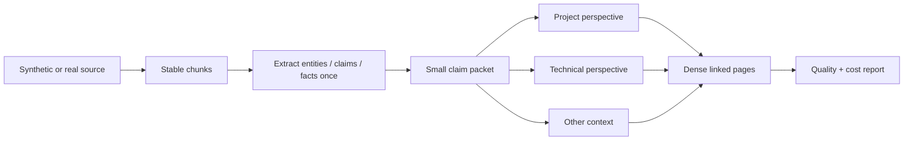

# Roadmap - Wiki Viva v6.3 quality and cost control

Status: implemented first as an open-source synthetic pilot.

v6.3 improves the v6.2 contract by making quality and cost visible before the
system touches private memory. It does not enforce a hard budget. It measures
cost so the agent can choose cheaper paths, reuse cache and avoid unnecessary
deep reads while still producing dense, linked, low-repetition pages.

## Scope

| Area | In v6.3 | Deferred |
| --- | --- | --- |
| Quality | dense pages, useful links, claim/source traceability, repetition detection | large-scale graph ranking |
| Cost | telemetry, cache reuse, token estimates, source-level comparisons | hard budget gates |
| Intelligence | extract once, then apply perspectives over a smaller claim/fact packet | embedded LLM client |
| Pilot | synthetic fixtures in the open-source kit | private data application |

## Operating principle



The agent should prefer links and concise rollups over copying the same prose
into several pages. Repetition is allowed when a page is explicitly using a
different perspective, context or zoom level; literal repetition between
equivalent pages is a quality smell.

## Metrics

| Metric | Meaning | First implementation |
| --- | --- | --- |
| `link_density_per_1000_words` | How connected each page is | [wiki_quality_report.py](../../../scripts/wiki_quality_report.py) |
| `information_density_per_1000_words` | Useful non-heading lines relative to prose volume | [wiki_quality_report.py](../../../scripts/wiki_quality_report.py) |
| `bad_repetition_blocks` | Literal repetition in the same context and page type | [wiki_quality_report.py](../../../scripts/wiki_quality_report.py) |
| `estimated_context_tokens` | Approximate deep-read input cost | [wiki_quality_report.py](../../../scripts/wiki_quality_report.py) |
| `cache_reuse_rate` | Share of chunk reads already backed by cache result | [wiki_quality_report.py](../../../scripts/wiki_quality_report.py) |
| `events_without_consolidated_into` | Ingestion that has not become integrated memory | [wiki_quality_report.py](../../../scripts/wiki_quality_report.py) |

## Synthetic pilot

The first pilot uses only synthetic reference fixtures:

- [multiperspective-source.md](../fixtures/v63-quality-cost/multiperspective-source.md)
- [contradiction-source.md](../fixtures/v63-quality-cost/contradiction-source.md)
- [no-new-information-source.md](../fixtures/v63-quality-cost/no-new-information-source.md)

The pilot validates that v6.3 can measure quality and cost without private data,
without a model client and without a hard budget gate.

## Rollout

| Phase | Scope | Exit criteria |
| --- | --- | --- |
| 1 | Implement deterministic report in the open-source kit | Unit tests pass and CLI emits Markdown/JSON. |
| 2 | Run synthetic pilot | Pilot report explains quality and cost telemetry. |
| 3 | Update docs and release notes | Command reference, release notes and fixtures are linked. |
| 4 | Backport to the private repo | Same tests/gates pass under localized paths. |
| 5 | Apply to private sources later | Only after a separate request chooses a low-risk source. |

## Validation

```sh
python3 scripts/wiki_quality_report.py
python3 scripts/wiki_quality_report.py --format json
python3 -m pytest tests/test_quality_report.py
python3 scripts/wiki_audit.py --check
python3 scripts/wiki_page_graph.py --check --impact
git diff --check
```

## Non-goals

- No hard token budget.
- No vector database or search-scale redesign.
- No automatic rewrite of private pages.
- No Python-side LLM client.
