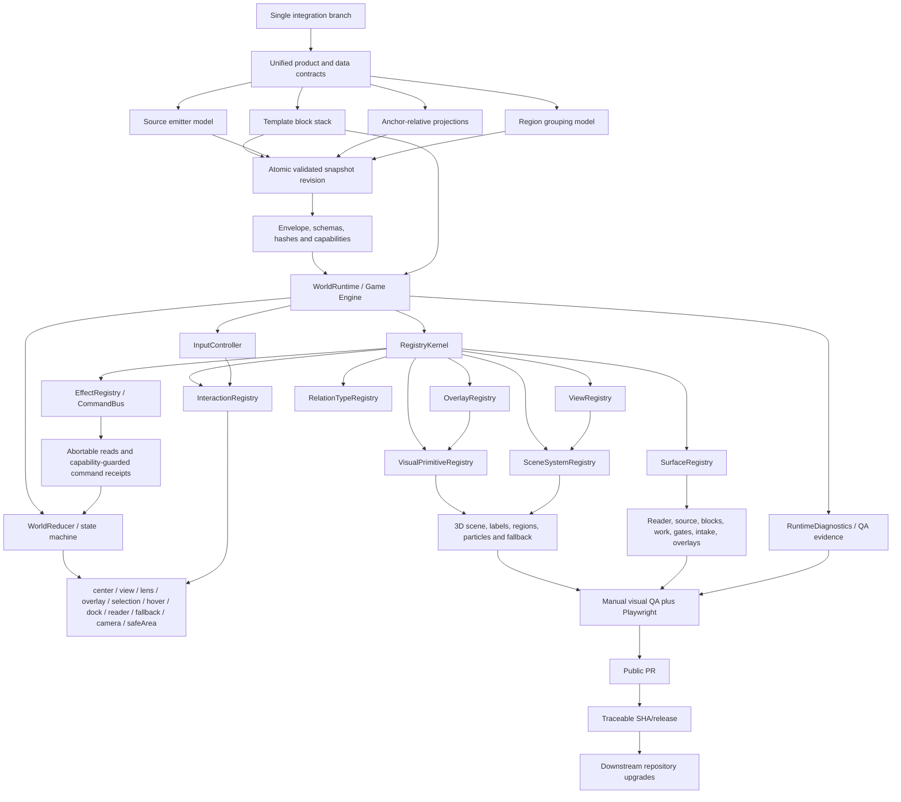
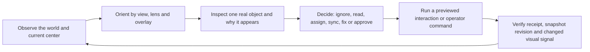

# Plan - Wiki Viva v8 Unified Living World Execution

Updated on: 2026-07-10.

## V8 Consolidation Decision

This is the only active product, architecture, UX and execution plan for the
next Wiki Viva generation. It absorbs the staged v7 planning draft and every
earlier proposal listed in this document. Those documents remain historical
evidence and design input; none remains an independent roadmap, branch target
or alternative contract.

The version boundary is deliberate:

- the released public baseline is Wiki Viva v6.9 at `origin/main` commit
  `c5de4440`;
- the former v7 document was a staged planning draft, not a shipped runtime,
  snapshot schema, route contract or downstream release;
- the integrated implementation target is therefore v8, with no fictional v7
  compatibility promise;
- the current branch lineage already contains the local-main center fix and
  visual-region work and must be continued as one history, not reconstructed
  through disconnected cherry-picks;
- every later scope, architecture or UX decision must update this document,
  its status ledger, dependencies and Definition of Done in the same PR;
- subsystem notes may explain implementation detail, but they cannot redefine
  the product contract or create a parallel execution plan.

Planning evidence is not implementation evidence. This document completed the
consolidation audit and now records the delivered implementation, automated
gates and browser evidence in the execution ledger below. The human review,
merge and release-tag gate remains deliberately separate and blocked.

## V8 Integrated Contract Map

The plan is intentionally one connected system. Each earlier plan, review gap
and brainstorm requirement has one authoritative home:

| Concern | Authoritative section | Required outcome |
| --- | --- | --- |
| Product philosophy and ontology | `Unified Vision Contract` and `Canonical Entity And Vocabulary Contract` | One world, real pages as centers, quadrants as lenses, regions as visual groupings, sources as places and blocks as behavior. |
| Interaction semantics and routes | `Interaction Semantics Contract`, route migration table and `WorldReducer / State Machine` | One canonical state grammar; no component-owned navigation and no quadrant/region entity loophole. |
| Data boundary and derivation | `Snapshot Envelope And Data Boundary Contract` | Versioned, validated public data that explains every derived and visual state. |
| Modular behavior | `Interaction Runtime / Game Engine Contract` and registry contracts | Data plus blocks plus route become testable interactions through one runtime. |
| Views and visual language | `Initial World Views Contract`, `Spatial Continuity` and `Visual And Conceptual Enhancement Backlog` | Few strong geometries, stable encodings, meaningful overlays and progressive density. |
| Operational objects | Source, action, region, relation and provenance contracts | Explicit lifecycle, ownership, evidence, expectation and failure semantics. |
| Product pressure and regressions | `Synthetic Fixture Architecture` and `Regression Evidence Matrix` | Every private bug class has a public synthetic reproduction, route, assertion and visual checklist. |
| Quality and proof | Test, accessibility, performance, visual QA and evidence sections | Green tests plus real desktop/mobile/fallback navigation and reviewable evidence. |
| Delivery and adoption | Workstreams, phases, security, downstream upgrades, documentation and release | One integration line, reversible rollout and repeatable multi-repo upgrade product. |

No phase may reinterpret one of these contracts locally. A discovered conflict
must be resolved in this v8 plan first, then implemented consistently across
snapshot, runtime, UI, fixtures, tests, documentation and downstream tooling.

## Critical Pause

Previous plans contained correct pieces of the vision, but they did not finish
the job because work advanced by slices: quadrant semantics here, template
blocks there, source docks elsewhere, visual grouping in another branch, and
private validation after the fact. The failure mode was not a lack of ideas; it
was the absence of one product, architecture and UX contract that every slice
had to obey.

This document is the consolidation contract. The older plans are inputs, not
parallel roadmaps. Implementation should proceed through one reviewed public
branch, one shared model of the world, one synthetic demo that reproduces the
real private pressure, and one visual QA gate that cannot be replaced by green
tests.

## Scope

In scope:

- Consolidate prior plans, audits and branches into a single Wiki Viva v8 work
  line and one versioned execution contract.
- Define the product/architecture/UX contract for the spatial cockpit.
- Integrate the active-center, recursive quadrant, region grouping, source
  emitter, template block, visual grammar and work-loop ideas into one model.
- Define a modular Interaction Runtime / Game Engine so cockpit interactions
  are registered, testable modules instead of scattered React component logic.
- Build synthetic public demo fixtures that reproduce the problems observed in
  the private wiki without private data.
- Require deterministic gates and browser-based visual navigation before
  calling the work done.
- Validate the private wiki only as downstream/read-only evidence until the
  public kit has passed.
- Prepare a traceable downstream migration path by public SHA or release.

Out of scope:

- Copying private personal, financial, relationship, source or transcript
  content into the public kit.
- Treating old plan branches as independent implementation tracks.
- Introducing an embedded LLM client into the deterministic Python core.
- Weakening PR/human-gate, privacy, source provenance, freshness or secret
  scanning rules.
- Shipping visual effects that do not carry real data.
- Calling green unit tests sufficient for UX correctness.

## Unified Vision Contract

Every implementation decision must satisfy this contract:

| Principle | Contract |
| --- | --- |
| One spatial world | The cockpit is one continuous navigable world, not a set of unrelated dashboards or route islands. |
| Real page as center | The world center is always a canonical page ID present in the snapshot page index: root, person, project, company, source, hub, action, meeting or another typed page. Derived objects and visual projections are never center-eligible. |
| Quadrants as lenses | Quadrants are Wilber/AQAL lenses and anchor-relative projections from the active center. They are not global page attributes, route roots or entities. |
| Regions as visual groupings | Regions summarize real pages and real family groups. They never become pages, breadcrumbs, roots or semantic centers. |
| Sources as places/emitters | Sources are navigable places with identity, config, streams, freshness, logs and the ability to emit pages, facts, actions and briefs. |
| Templates/blocks as behavior | Page type, template blocks and resolved stacks determine interpretation, surfaces, creation, missions, region grammar and gates. |
| Modular interaction runtime | Data, route and block stack are materialized by a `WorldRuntime`. Components render state and dispatch registered interactions; they do not own navigation, camera, dock or fallback semantics. |
| Views, lenses and overlays are separate | `view` chooses the world's main geometry, `lens` chooses the semantic projection inside that geometry, and `overlay` chooses the active visual metric. None of these becomes a page/entity. |
| Visuals encode data | Color, particles, halos, lines, density, motion and marks are allowed only when they encode state, type, freshness, evidence, risk, flow, relation or attention. |
| Text remains text | Diffs, PR decisions, source triage, command output and dense explanations live in docks/readers/plates, not crowded into the 3D scene. |
| Human gate remains final | The cockpit prepares, explains and delegates; GitHub PR review remains the final approval/merge gate. |
| Public-first core | Shared bugs are reproduced with synthetic fixtures in the public kit before being applied to the private wiki. |

### Canonical Entity And Vocabulary Contract

The current implementation overloads important words. In particular,
`ActionCard` means an executable operator command while `page_type: action`
means a domain work item. v8 must remove that ambiguity before the runtime API
is frozen.

| Concept | Canonical meaning | Center eligible | Runtime treatment |
| --- | --- | --- | --- |
| `PageEntity` | A canonical Markdown/wiki page with stable `page_id`, type, path and snapshot record. | Yes. | May be selected, read and explicitly made center. |
| `ActionEntity` | A domain action/work item represented as a typed canonical page with owner, state, due date, blocker and evidence/source links. | Yes, only when backed by `PageEntity`. | Appears in world/work views and opens like any other real page. |
| `OperatorCommand` | A capability-guarded command such as run gates, sync a source or prepare a PR. It is not wiki knowledge. | No. | Runs through the effect/command layer with preview, confirmation, idempotency and result receipt. Rename current executable `ActionCard` vocabulary accordingly. |
| `RuntimeInteraction` | User intent such as inspect, select, read, recenter, set lens or open dock. | No. | Registered event reduced by `WorldRuntime`; never persisted as a wiki fact. |
| `RuntimeEvent` | A transition/result event inside the cockpit, including async success/failure. | No. | Traceable in local diagnostics, redacted and bounded; not confused with domain events. |
| `DomainEvent` | A meeting, ingestion event, decision event or other dated wiki fact. | Yes only when materialized as a canonical page. | Otherwise remains a reader/selection artifact and cannot become center. |
| `SourceEntity` | A canonical source page: the navigable place/emitter. | Yes. | Owns source identity and links to config, streams, attempts, artifacts and proposals. |
| `SourceAdapter` / `SourceConfig` | Connector/configuration behavior for a source. | No unless the config itself is intentionally modeled as a canonical page. | Capability/config input; never silently substituted for the source place. |
| `Artifact` | Raw file, document, diff, log or emitted payload. | Only if promoted to a canonical page. | Opens in reader/preview with provenance; otherwise selection only. |
| `FamilyGroup` | A deterministic collection of real pages, such as `family:source` or `family:person`. | No. | May be filtered, focused and named in a route/breadcrumb as grouping context, but never becomes the world center. |
| `Region`, `view`, `lens`, `overlay`, `VisualPrimitive` | Derived interpretation or rendering constructs. | Never. | Inspection/filter/layout/render state only. |

Identity invariants:

- `center` must resolve through the current snapshot page index; “real entity”
  is not a second loophole outside `PageEntity`.
- A domain object that needs to be centered must first have a stable canonical
  page identity. Otherwise it opens as selection, preview or reader content.
- Page IDs remain stable across path/title changes. Renames emit aliases or a
  migration map so saved links do not silently retarget another object.
- IDs are unique within `repo_id`; cross-repo references use a qualified form
  such as `<repo_id>:<page_id>` at adapter/exchange boundaries.
- The snapshot must report dangling, duplicate and type-conflicting IDs as
  contract errors before rendering.

### Interaction Semantics Contract

The cockpit needs an explicit progression from looking to entering. “Open” is
too ambiguous for a modular engine.

| User intent | Registered verb | Semantic effect | Must not do |
| --- | --- | --- | --- |
| Hover/focus preview | `inspectEntity` / `inspectHover` | Ephemeral explanation and highlight. | Change URL, center, camera destination, reader or dock. |
| Single click/tap/Enter on an object | `selectEntity` | Select the real object and show an anchored summary plate or fallback summary. | Recenter or execute work implicitly. |
| Read details | `readEntity` / `openReader` | Open reader for the selected/canonical page while preserving world center. | Replace center as a side effect. |
| Enter a place/world | `selectCenter` | Explicitly make a center-eligible `PageEntity` the new center and derive a new local world. | Accept a group, region, lens or artifact without page identity. |
| Inspect a source/person/action from a dock | `openSource`, `openPerson`, `openAction` | Open the registered detail surface around the current center. | Recenter unless the user explicitly invokes `selectCenter`. |
| Run operational work | `executeOperatorCommand` | Preview and dispatch a capability-guarded effect; record a result receipt. | Masquerade as navigation or auto-approve/merge. |

Touch, mouse, keyboard, command/search and deep link inputs must converge on
these same semantics. The UI must visibly distinguish “current world center”,
“selected object”, “reader target” and “operator command”.

Non-negotiable route grammar:

```text
center=<real-page-id>
view=<world-geometry>
lens=<facet-or-quadrant>
overlay=<metric-encoding>
group=family:<real-kind>
page=<real-page-id>
dock=<surface>
reader=1
```

Canonical route vs legacy route migration:

| Current route / field | Canonical v8 route state | Normalization rule | Required test | Removal window |
| --- | --- | --- | --- | --- |
| `/w/:perspective/:context?/:group?/:pageId?` | `/w?center=<real-page-id>&view=<geometry>&lens=<semantic-lens>&overlay=<metric>&group=family:<kind>&page=<real-page-id>` | Parse the positional URL through a named compatibility mapping; do not assume every old `perspective` maps one-to-one to a native v8 view. `context/pageId` become real page references. | Router round-trip plus `WorldReducer` route-hydration tests for every old perspective. | Keep as compatibility path through v8; remove no earlier than v9 after the v8 warning release. |
| `/demo/w/:perspective/...` | `/demo/w?center=<demo-root>&view=<geometry>&lens=<semantic-lens>&overlay=<metric>&group=family:<kind>&page=<real-page-id>` | Same normalization as real routes, with explicit demo fixture source and visible synthetic-data banner. | Playwright demo route check plus sample fallback assertion. | Keep through v8; canonical links should emit query-state route. |
| `/w/quadrants/...` | `view=quadrants&overlay=actions` plus hydrated center/lens/group/page | Preserve current quadrant meaning; write canonical query-state links after hydration. | Quadrant route fixture and center/lens separation test. | Positional read through v8; canonical write immediately after v8 default. |
| `/w/radar/...` | `view=radar&overlay=freshness` for legacy links | Preserve the current freshness-radar meaning. Native v8 may use `overlay=attention` as the registry default only for newly written canonical routes. | Legacy radar screenshot/route test and explicit overlay switch test. | Compatibility mapping through v8. |
| `/w/districts/...` | `mode=compat&view=districts&lens=type&overlay=actions` | Preserve the legacy content-kind geometry as an explicit compatibility identity. A direct deep link stays valid even when a template does not advertise Districts in native navigation; compatibility context is visible and no native view control is falsely pressed. | Legacy districts fixture, direct-link hydration, compatibility-context copy and no-false-native-selection tests. | Supported compatibility view through v8; future status decided by evidence. |
| `/w/trails/...` | `mode=compat&view=trails&lens=relations&overlay=evidence&center=<real-page-id>` | Preserve the selected page ego-graph and typed relationship sectors as an explicit compatibility identity. Missing page normalizes to root with a warning, never to a synthetic trail entity. | Legacy trails route, direct-link hydration, back/forward and evidence-edge tests. | Supported compatibility view through v8; replace only after an accepted native relations geometry exists. |
| `/w/atlas/...` | `view=atlas` compatibility view | Keep the implemented hierarchy geometry as a registered compatibility view while the four native v8 views are built. | Atlas hierarchy parity fixture. | Supported compatibility view through v8; future status decided by evidence. |
| `/w/focus/...` | `view=focus&center=<real-page-id>` compatibility view | Preserve page-centered lenses. A missing/invalid page falls back to root with a warning. | Focus route and missing-page test. | Supported compatibility view through v8; future status decided by evidence. |
| `/ops` and bare `/w` | `/w?center=<root-page-id>&view=quadrants&lens=<default-lens>&overlay=actions` | Resolve root from snapshot/default block stack; no sample fallback outside `/demo`. | Snapshot-origin E2E and route-hydration unit test. | Keep as alias through v8; warn in docs once canonical route ships. |
| `?center=<id>` | `center=<real-page-id>` | Accept only real page IDs; invalid/region/lens/group IDs normalize to root with warning. | Invalid center reducer test. | Permanent canonical field. |
| `?view=<id>` | `view=<world-geometry>` | Accept only `ViewRegistry` IDs; unknown view normalizes to `quadrants` with warning. | View registry and route-hydration tests. | Permanent canonical field. |
| `?lens=<id>` | `lens=<facet-or-quadrant>` | Accept only known lens IDs; never change center. | Lens reducer test and browser Back test. | Permanent canonical field. |
| Legacy `lens=intencao|pratica|relacoes|sistemas` | `lens=q1_intencao|q2_pratica|q3_relacoes|q4_sistemas` | Read current short facet IDs and write the explicit quadrant-qualified IDs so logs/routes cannot confuse quadrant order or language. | Four-value normalization and round-trip tests. | Read through v8; canonical write when v8 runtime becomes default. |
| `?overlay=<id>` | `overlay=<metric-encoding>` | Accept only `OverlayRegistry` IDs allowed by the active view; unsupported overlay falls back to the view default with warning. | Overlay registry and visual QA tests. | Permanent canonical field. |
| `?quadrant=<id>` | `lens=<quadrant-id>` | Read as legacy alias, write only `lens`; both present means `lens` wins and warning is emitted. | Legacy quadrant normalization test. | Remove no earlier than v9 after the v8 warning cycle. |
| `?group=family:*` / `worldGroup` internal field | `group=family:<real-kind>` | Rename internal `worldGroup` to canonical `group`; reject `region:*` as semantic group. | Family group route test and no `region:*` route assertion. | Internal rename during runtime migration; legacy read through v8. |
| Positional `region:*` group URLs | `group=family:<real-kind>` plus optional `selection`/visual focus | Never write `region:*`; normalize old region links to family group or inspection-only focus. | Legacy region URL test and visual focus Playwright path. | Read-only compatibility through v8; remove written links immediately. |
| `/review` | `/w?center=<root-page-id>&view=work&overlay=actions&dock=approve` | Route alias opens approve/gate surface without leaving the world. | Router alias test and dock open/close test. | Keep as public alias through v8; docs point to canonical dock route. |
| `/sources` | `/w?center=<root-page-id>&view=sources&overlay=evidence&dock=source` | Route alias opens source/evidence world plus source surface without becoming a separate app page. | Router alias test and source dock Playwright path. | Keep as public alias through v8; docs point to canonical dock route. |
| `/health` | `/w?center=<root-page-id>&view=radar&overlay=quality&dock=gates` | Route alias opens attention/quality world plus gates surface inside the world. | Router alias test and gates dock Playwright path. | Keep as public alias through v8; docs point to canonical dock route. |
| `/pages/:id` | `/w?center=<id>&reader=1` | Standalone page alias centers the real page and opens reader; missing page shows not-found reader without changing to sample data. | Page alias route test and reader not-found test. | Keep as stable convenience alias; canonical share links should prefer world route. |
| `?reader=1` with path `pageId` | `reader=1&page=<real-page-id>` or `reader=1&center=<page-id>` for standalone pages | Reader opens only for real content; reader close does not silently change center. | Reader reducer test and manual close/reopen QA. | Permanent canonical field. |
| `?dock=<id>` | `dock=<registered-surface-id>` | Accept only `SurfaceRegistry` IDs; unknown dock closes to fallback surface with warning. | Surface registry test. | Permanent canonical field. |
| `?tray=<packet|missions|work>` | `dock=<registered-surface-id>` or `selection=<runtime-selection>` | Trays become registered surfaces or transient selection state; no parallel surface stack. | Surface singleton test. | Deprecate during v8 runtime migration. |
| `/demo/genesis` / `?genesis=1&stage=<n>` | `/demo/w?center=<demo-root>&view=quadrants&lens=<default>&overlay=actions&mode=genesis&stage=<n>` | Tutorial state remains demo-only and cannot enable operator actions. | Genesis route test and static-demo security test. | Keep until tutorial is expressed as registered demo mode. |

Forbidden states:

- `region:*` as center, page, breadcrumb, semantic route or primary node.
- hover changing route, center, lens, group, reader or camera travel target.
- component-local code directly mutating route, center, dock, reader, camera or
  fallback state outside `WorldRuntime`.
- treating views, lenses or overlays as pages/entities or dashboard islands.
- new interactions implemented by branching across disconnected components
  instead of a registered interaction plus reducer transition.
- source/config pages falling into `q0_core` because the model could not decide.
- visual particles or halos without traceable input data.
- demo proof that does not reproduce private-scale pressure.

## Branch And History Audit

Audit refreshed on 2026-07-10. The final v8 UX payload after the rendered-flow
review is `4e4ee631` in draft PR
[#61](https://github.com/kimlage/wiki-viva-kit/pull/61). The downstream safety
payload is `3e5c0867`: preflight reads the exact pinned Git tree and protects a
consumer-owned runtime config instead of comparing/importing later checkout
state. The relation-aware portable refinement is `5179dc5c`; deterministic
snapshots rebuilt from that contract are pinned by the final payload
`27f3b369`; the route-neutral guide correction accepted in the downstream
browser review is `206da2ca`. The final local-world scope and fallback review
is `d2ddcb5f`; the single-axis fallback correction is `487f7935`. The final
portable source tree is `fa65d5f9`, which repairs wildcard-bearing skill
allowlists after the downstream evidence audit exposed the mismatch. The
short-mobile P0 evidence remains pinned historically at `b942735f`;
`1d801f1c` is the canonical source-hierarchy milestone; `a483ad02` is the
reader-continuity milestone; `d4a3c890` is the all-phone group-geometry
milestone; and the current functional payload is `e14bf73b`, which keeps the
search query, selected page, reader and closed-dock state in one atomic route
transaction across the WebKit/Linux debounce boundary.

| Surface | Observed state | Treatment |
| --- | --- | --- |
| `origin/main` | `c5de4440` `feat(wiki): release recursive quadrant cockpit v6.9` | Public baseline. Most recent implementation branches have been absorbed here. |
| local `main` | `71c845f` `fix(cockpit): keep active center out of quadrants`, one commit ahead of `origin/main` | Already an ancestor of the current branch. Keep it in the final integration history and do not leave `main` as the only named ref carrying the fix. |
| current branch | `wiki/v8-unified-living-world`; rendered review payload `4e4ee631` is followed by downstream safety `3e5c0867`, relation-aware nested-world core `5179dc5c`, deterministic snapshots `27f3b369`, route-neutral guide copy `206da2ca`, compiler-scoped local worlds `d2ddcb5f`, single-axis fallback `487f7935`, portable wildcard safety `fa65d5f9`, historical short-mobile P0 payload `b942735f`, canonical source hierarchy `1d801f1c`, reader continuity `a483ad02`, all-phone group-target integrity `d4a3c890` and final atomic search-reader routing `e14bf73b`. | Sole integration/release-candidate line. Runtime code, generated artifacts, upgrade safety and release metadata remain reviewable commit boundaries. |
| current worktree | Guide, quadrant reset, route/surface synchronization and visual baselines are committed through `4e4ee631`; exact-tree preflight is in `3e5c0867`; local-world scoping, inherited quadrant ownership, Focus center semantics, fallback wrapping and portable PT/EN AQAL tests are in `d2ddcb5f`; fallback overflow ownership is in `487f7935`; wildcard-bearing skill allowlists are fixed and synthetically covered in `fa65d5f9`; generated events use canonical source parents in `1d801f1c`; reader page changes reset internal scroll and contain wide tables in `a483ad02`; semantic group targets stay disjoint at `390x664` and `390x844` in `d4a3c890`; delayed query writes cannot replay a closed dock over the reader in `e14bf73b`. | No broad WIP remains. Human review, merge and tag remain external gates. |
| `wiki/plan-ops-cockpit-3d` | two commits ahead, plan-only branch | Superseded by this plan; retain as historical input. |
| `wiki/plan-sources-templates-facets` | one commit ahead, plan-only branch | Superseded/absorbed; source/template/facet principles are consolidated here. |
| zero-ahead local/remote branches | `wiki/cockpit-layout-fixes-2026-07-02`, `wiki/codex-missions-impl`, `wiki/codex-plan-rev2-work-briefs`, `wiki/impl-sources-templates-facets`, `wiki/one-world-cockpit-plan`, `wiki/one-world-impl`, `wiki/ops-cockpit-*`, `wiki/refine-threejs-*`, `wiki/scene-culling-*`, `wiki/template-blocks-impl`, and their matching `origin/wiki/*` branches | Already absorbed in `origin/main`; use as history/context only. Do not cherry-pick unless an audit finds a missing specific diff. |
| `private-pilot-01` | Completed downstream migration with only redacted aggregate evidence retained publicly; exact branch, commits, paths and titles remain private. | Downstream validation surface only. It is not an upstream source for public code. |
| legacy private mirror | Historical downstream work, details redacted at the public boundary. | Out of scope for v8 cockpit integration. |

The branch was renamed in place, preserving `71c845f` and `a3604c11`. The plan
is the first v8 commit, the implementation is separate from generated fixture/
snapshot evidence, and source-identity/provenance fixes remain reviewable.

### Pre-implementation Baseline Review Evidence - 2026-07-09

The planning audit captured the following evidence before v8 implementation.
It is retained to explain the measured delta and must not be read as current
release state; the execution ledger and release note above are authoritative.

| Surface | Baseline evidence | Consequence for v8 |
| --- | --- | --- |
| Git line | Live `origin/main` is `c5de4440`; local `main` adds `71c845f`; current branch adds `a3604c11`; only this plan is staged while the broad cockpit/demo WIP is unstaged/untracked. | Preserve the current lineage, commit the contract separately and classify every WIP file before integration. |
| Python suite | `638 passed, 4 skipped` on `/opt/anaconda3/bin/python -m pytest tests/`. | Deterministic core is currently healthy, but this does not validate the v8 contracts or visual product. |
| Frontend unit suite | `36` files and `274` tests passed. | Existing behavior has useful coverage; it must be migrated into runtime/registry tests rather than discarded. |
| Production build | Build passes, but the main JS chunk is about `1.56 MB` minified (`440.76 kB` gzip), CSS is about `115.53 kB`, and Vite reports ineffective dynamic import plus chunks over `500 kB`. | Add bundle/loading budgets and split reader/diagram/operator/scene systems by capability and route. |
| Wiki gates | Audit, coverage, operation compile and input-stage checks pass; audit reports four existing staleness warnings. | Keep warnings explicit; do not call the repo warning-free. |
| Current E2E matrix | `playwright.config.ts` defines only `chromium-desktop`; mobile behavior is simulated inside specs rather than exercised as a browser project. | Add WebKit mobile and fallback/browser coverage before claiming input or rendering parity. |
| Runtime concentration | `App.tsx` is about 1,721 lines, `WorldView.tsx` 1,579, `SystemScene.tsx` 1,453, `perspectives.ts` 2,072, `styles.css` 7,983 and `types.ts` 752. Navigation, keyboard, camera, scene composition, data access and styling cross these files. | The engine refactor needs explicit decomposition and import-boundary gates, not only new registry names. |
| Snapshot boundary | The frontend fetches many JSON files concurrently and casts them to TypeScript types; required files are not revision-pinned or runtime-validated. | Introduce an atomic snapshot envelope, integrity metadata, boundary validation and stale-response cancellation. |
| Vocabulary | Executable `ActionCard` records and canonical `page_type: action` pages coexist. Source detail, source center and source command are also conflated. | Adopt the canonical entity/vocabulary and interaction-semantics contracts above. |
| Source demo | The source dock currently flattens state to `synced`/`never synced`; synced examples can still show `0/0 streams fresh`, and the dense demo reports all recipes needing repair. | Build the three-axis lifecycle fixture and assert agreement between world, dock, source detail and snapshot. |
| Visual system | The current CSS/scene use many hardcoded cyan/slate colors while the v8 contract changes color from fixed context hue to active overlay metric. | Add semantic visual tokens and an explicit hue/context migration; documentation cannot retain both grammars. |
| Desktop visual audit | The real center is visible but can dominate as an oversized sphere while useful nodes and labels become very small; large empty planes and competing compass/minimap/dock layers weaken hierarchy. | Add focal-scale, semantic-zoom, occlusion and surface-occupancy contracts. |
| Mobile visual audit | At `390x844`, breadcrumb/update text clips, compass and multi-row command bar consume much of the first viewport, and the world/fallback content is pushed below heavy chrome. | Add responsive occupancy budgets and adaptive command/surface composition. |
| Dock/reader audit | Source docks do not reliably receive focus, close controls expose the wrong accessible name (`Close help`), and detail surfaces can leave the world controls active behind them. | Add a formal surface stack, focus/inert contract and responsive close/escape behavior. |
| Console | No browser console warnings/errors were observed in the audited demo flow. | Preserve this baseline, but add network, context-loss and async race evidence. |

Manual audit flow captured in this review:

1. Desktop default quadrants.
2. Q2/practice lens.
3. Sources list dock.
4. Source detail.
5. Mobile quadrants.
6. Mobile sources dock.
7. Mobile 2D fallback.
8. Family-source drill and source reader.

The review did not run `npm run test:visual`; that remains an implementation
gate. The browser walk was used to find product/contract gaps, not to mark the
existing visual suite green.

## Prior Plans As Inputs

| Plan / branch | Useful content to absorb | Status in v8 |
| --- | --- | --- |
| Staged `Wiki Viva v7 Living World Integration` draft | The full consolidated product, architecture, runtime, visual, QA and downstream contract before the final version-boundary review. | Absorbed into this v8 document. It was never released and has no independent implementation line or compatibility surface. |
| `sources-templates-facets-plan-2026-07-03.md` | Sources as entities, template registry, facets, source recipes and migration discipline. | Absorbed into source emitter, template/block and snapshot tracks. |
| `one-world-cockpit-plan-2026-07-02.md` | Approve/Add/Health dissolve into the world, honest degradation, gate/weather/intake model. | Absorbed into route/world-state, docks and visual QA tracks. |
| `codex-agentic-missions-plan-2026-07-02.md` | Human-readable briefs, local Codex jobs, Work tray, draft PR handoff. | Absorbed into work-loop track; execution remains optional and degraded honestly. |
| `recursive-quadrant-centers-refactor-2026-07-07.md` | Quadrants as anchor-relative projections, `?center=`, subject/parent projection metadata, private migration inventory. | Already largely implemented in v6.9; remains a v8 invariant and regression target. |
| `visual-region-grouping-refactor-2026-07-08.md` | Regions as practical visual groupings, primitive packs, dense synthetic demo, private read-only comparison. | Superseded/absorbed; retained only as a historical input with a pointer to this contract. |
| `wiki/plan-ops-cockpit-3d` | Early decisions: quadrants as perspective, local-first cockpit, O1-O6 direction. | Superseded; cite as historical source if needed. |
| `wiki/plan-sources-templates-facets` | Earlier source/template/facet framing. | Superseded by implemented branches plus this plan. |

`docs/references/guides/modular-blocks.md` is not a separate plan, but it is a
primary architectural input: it already defines blocks as units of
interpretation, interface, gates, missions, creation, intake, score and visual
regions. v8 turns that block contract into runtime architecture through
`WorldRuntime`, `InteractionRegistry`, `SurfaceRegistry`,
`SceneSystemRegistry` and `VisualPrimitiveRegistry`.

Rule: do not add another parallel plan file for each subsystem. If a subsystem
needs detail, add it as a section or appendix here, or update the relevant
guide after implementation.

## Previous Error To New Guardrail Matrix

| Previous error | New guardrail |
| --- | --- |
| Plans fragmented by feature area. | One consolidated plan and one integration branch; old plans are marked absorbed/superseded. |
| Green tests treated as done. | Definition of done requires desktop/mobile browser navigation and critical click-through. |
| Demo too weak to trigger private bugs. | Public demo must include dense synthetic fixtures that reproduce private-scale pressure. |
| Quadrant/region treated like entity. | Route grammar forbids `region:*` as page/center/breadcrumb; tests assert it. |
| Quadrant/region treated like entity by UI state. | `WorldReducer` blocks invalid route transitions; tests prove lenses and regions never become pages or centers. |
| Hover changed navigation/camera semantics. | Hover is inspection only; route/camera travel requires explicit action. |
| Hover changed navigation through incidental component effects. | Hover only emits `inspectHover`; it cannot mutate center, route, lens, dock or camera travel. |
| Interactions scattered in components. | Every semantic interaction passes through `InteractionRegistry` and a reducer/state-machine transition. |
| Docks created manually in multiple components. | Surfaces are registered through `SurfaceRegistry` and derived from the resolved block stack. |
| New flow worked on desktop but broke mobile or fallback. | Every interaction declares desktop, mobile and fallback behavior before implementation is accepted. |
| Local-only fixes left outside PR. | Fold `main` active-center fix into the integration line. |
| Private wiki used as proving ground. | Private is read-only validation; any private-only break becomes synthetic fixture in public kit. |
| Generated snapshots obscured review. | Separate generated artifacts from code/docs when possible and document regeneration. |
| Visual polish carried no operational meaning. | Every visual primitive declares data source, purpose, slot, fallback and accessibility text. |
| Pretty visual system carried no data. | `SceneSystemRegistry` systems require real snapshot inputs; particles/effects without data are removed. |
| Dense UI passed desktop but broke mobile/PT. | Mobile, long Portuguese labels and safe-area checks are acceptance criteria. |
| Source list was static bibliography. | Sources become places/emitters with identity, streams, freshness, logs and briefs. |
| Raw extraction/indexing was labelled ingested. | Pipeline telemetry stays separate; `ingested` requires consolidation/closure and approved adoption or reviewed no-change. |
| Agent work lacked visible contract. | Work briefs are readable/editable/copyable before execution; jobs only produce draft PRs. |
| “Action” meant both wiki work item and executable command. | `ActionEntity`, `OperatorCommand`, runtime interaction and runtime/domain event have separate types and verbs. |
| “Open source/person/action” mixed inspect, read and recenter. | Runtime uses explicit inspect -> select -> read -> `selectCenter` semantics. |
| Multi-file snapshot looked typed but was only cast. | Atomic envelope, hashes, runtime schemas and torn-revision tests gate `WorldRuntime`. |
| Runtime risked becoming a new all-state component. | State is partitioned into shareable, ephemeral, derived, resource and diagnostic ownership; effects stay outside the reducer. |
| Existing `districts`/`trails` semantics could vanish during view redesign. | Every current perspective has an explicit compatibility mapping and parity fixture. |
| Existing context hue contradicted overlay color grammar. | Semantic token migration updates code, fallback, legend, docs and screenshots as one breaking visual change. |
| Mobile copied every desktop control into the first viewport. | Surface stack and viewport-occupancy budgets require adaptive command/compass composition. |
| Passing build still shipped oversized eager chunks. | Bundle budgets and real lazy boundaries are release gates; warnings are evidence. |
| Parallel tracks had no file ownership protocol. | Short-lived track branches use explicit owned paths, serialized hotspots and integrated walking-skeleton checkpoints. |

## Proposed Architecture



Core responsibilities:

| Layer | Owns | Must not own |
| --- | --- | --- |
| Python core | Config, template/block resolution, projections, source state, region summaries, snapshot schema, deterministic gates. | Visual guesses, embedded LLM calls, private-only behavior. |
| Snapshot | One atomic, validated revision consumed by cockpit: pages, graph, sources, blocks, projections, regions, gates, operations, capabilities and integrity metadata. | UI-only fabricated actions, mixed revisions or inferred risks not present in data. |
| Template registry | Fixed block vocabulary, primitive packs, author-facing composition. | Arbitrary CSS/theme API or private content. |
| Interaction runtime / game engine | Canonical world state, valid transitions, interaction verbs, input normalization, view/lens/overlay separation, extension registries, surface registration and scene-system orchestration. | Rendering markup, semantic classification not present in snapshot, private-only shortcuts. |
| Effect/resource layer | Abortable reads, capability-guarded commands, concurrency, idempotency, receipts and redacted diagnostics. | Pure semantic reduction, entity classification or direct rendering. |
| Cockpit frontend rendering | Components, scene rendering, docks, reader, labels, particles, fallback, accessibility and visual inspection. | Direct route/center/dock/camera mutation or semantic behavior outside the runtime. |
| Demo fixtures | Synthetic proof of density, gaps, sources, actions, people, events, docs, clusters and nested centers. | Private pages or sanitized-but-recognizable personal content. |
| Downstream repositories | Read-only validation, pilot/wave upgrades and later migrations from public SHA/release. | Core development proving ground or upstream source for public behavior. |

## Snapshot Envelope And Data Boundary Contract

The runtime cannot be deterministic if it can combine files from different
snapshot generations. The current loader requests multiple JSON files in
parallel and trusts TypeScript casts. v8 requires one coherent, validated
snapshot revision.

Required envelope fields:

| Field | Contract |
| --- | --- |
| `snapshot_id` | Immutable revision ID derived from the generated payload set, not only a timestamp. |
| `repo_id` | Namespace for page IDs and downstream diagnostics. |
| `root_page_id` | Canonical center fallback, validated against the page index. |
| `generated_at` | UTC generation time. |
| `source_sha` | Git SHA or explicit `uncommitted:<content-hash>` marker. Never imply a clean commit when generated from WIP. |
| `schema_versions` | Snapshot, page, graph, blocks, visual grammar, source lifecycle, runtime and content-sidecar versions. |
| `capabilities` | Read models and operator capabilities actually present; absence is explicit. |
| `files` | Per-file name, required/optional flag, content hash, byte size and schema version. |
| `bundle_hash` | Hash over the ordered file manifest so static and API bundles can be compared. |
| `warnings` | Compatibility, partial-data, deprecated-field and integrity warnings safe to show in diagnostics. |

Atomicity rules:

- The frontend loads and validates the manifest/envelope first.
- Required payloads are fetched for one `snapshot_id`. API routes should serve
  one atomic bundle or revision-pinned URLs such as
  `/api/snapshots/<snapshot_id>/<file>`.
- A changed manifest during load aborts the attempt and restarts from the new
  revision. The runtime never commits a mixed bundle.
- Static generation writes to a temporary directory, validates every required
  file/hash/sidecar and atomically promotes the directory only after success.
- Content sidecars carry the same `snapshot_id`; a reader cannot silently mix
  old page content with a new page index.
- The last-known-good cache is usable only when its ID, age and compatibility
  are visible. It never becomes sample data and never enables unsafe operator
  actions while stale.

Boundary validation rules:

- Define machine-readable schemas at the Python/TypeScript boundary. Generate
  or validate both sides from the same contract where practical; do not rely
  on `as SnapshotBundle` or generic `fetchJson<T>` casts as validation.
- Validate required fields, enum values, ID uniqueness, references, counts and
  hashes before the bundle enters `WorldRuntime`.
- Required read-model failure blocks the affected view with an explicit error.
  Optional model absence produces a declared capability gap, not an empty
  object that looks like healthy zero data.
- Old-version migration happens once at the loader boundary and emits a
  migration report. Renderers consume only the current internal model.
- Split read-only `SnapshotClient`/`ContentClient` from capability-guarded
  `OperatorClient`; scene/components do not import transport functions.
- Use abortable requests. Rapid center/view/page changes cancel stale content
  and layout loads; late responses cannot overwrite newer runtime state.

Acceptance:

- A test deliberately swaps one payload revision mid-load and proves the
  runtime never renders a torn bundle.
- Corrupt hash, duplicate ID, dangling center, invalid enum and mismatched
  sidecar fixtures fail or degrade exactly as declared.
- Static demo, local API and downstream snapshots report the same envelope
  semantics.
- Diagnostics and QA evidence record `snapshot_id`, `bundle_hash`, source SHA
  and compatibility state.

## Interaction Runtime / Game Engine Contract

The cockpit needs a modular interaction engine, not a collection of component
side effects. The runtime is the layer that converts model/wiki data,
templates/blocks, snapshots and route state into consistent interactions and
renderable UI surfaces.

Layer separation:

| Layer | Role |
| --- | --- |
| Model/wiki | Real pages, sources, people, actions, documents, events, relationships and evidence. |
| Blocks/templates | Declarative behavior available for a page type, context, source or block stack. |
| Snapshot/backend | Deterministic derived data that the cockpit can consume without guessing. |
| World runtime / game engine | Canonical state, valid transitions, views, lenses, overlays, interactions, surfaces, input normalization and scene-system orchestration. |
| UI/rendering | React components, Three.js scene, docks, reader, labels, particles, fallback and accessibility. |

### `WorldRuntime`

The runtime owns canonical cockpit state:

```text
center
view
lens
overlay
selection
hover
dock
reader
fallback
camera
safeArea
```

Runtime context additionally pins the active `snapshot_id`, capability set,
resource/effect attempts and warnings. Those are not page/entity or canonical
route fields.

Rules:

- Components may dispatch events and render runtime state.
- Components must not directly mutate route, center, view, lens, overlay, dock, reader,
  fallback, camera or safe-area state.
- Shareable semantic state must be serializable enough to preserve browser
  back, refresh and deep links. Ephemeral and derived render state must not
  pollute canonical URLs.
- Derived visual state may exist only when it can be recomputed from snapshot,
  block stack, route and viewport.

State ownership partitions:

| Partition | Fields / examples | Persistence and ownership |
| --- | --- | --- |
| Shareable semantic state | `center`, `view`, `lens`, `overlay`, `group`, `page`, `dock`, `reader`, durable filters. | Canonical URL plus reducer. Meaningful Back/Forward entries use `pushState`; normalization, hover and replaceable typing use `replaceState` or no route write. |
| Ephemeral interaction state | `hover`, pointer target, temporary selection preview, command query, toast, drag gesture. | Runtime memory only; cleared by explicit transition, Escape or relevant route change. |
| Derived render state | layout coordinates, visible labels, camera transform, safe area, density tier, LOD, collision result, fallback projection. | Recomputed from semantic state, snapshot, viewport and registered systems. Actual camera vectors and safe-area rectangles are not canonical URL state. |
| Async resource state | snapshot/content request, effect pending/success/failure, job progress, retry/cancel state. | Owned by effect/resource controllers and reduced through result events; never hidden in arbitrary component hooks. |
| Diagnostic state | transition trace, warnings, timing, snapshot origin, module failures and visual `explain()` output. | Bounded, redacted, local-only by default; exportable as a QA evidence manifest. |

Browser history policy:

- Recenter, change view, choose a durable lens/overlay, open a real page, open
  a shareable dock and enter a family group create meaningful history entries.
- Hover, pointer focus, camera interpolation, label pruning, safe-area changes,
  transient search text and performance-tier changes never create history.
- Route normalization uses replace, emits a warning/diagnostic and produces a
  canonical share URL.
- Closing reader/dock/selection reverses exactly one semantic layer; `Escape`
  and browser Back must not compete or double-pop state.

Formal state machine:

| State field | Valid transitions | Only through | Must reject or normalize | Required evidence |
| --- | --- | --- | --- | --- |
| `center` | real page -> real page; route hydrate -> real page; invalid route -> root plus warning | explicit `selectCenter`, route hydration | `region:*`, quadrant IDs, group IDs, missing page IDs, visual-only nodes, detail-dock opening as implicit recenter | reducer tests, route tests, click-through root/source/person/action/meeting |
| `view` | default -> registered view; registered view -> registered view; unknown -> `quadrants` plus warning | `setView`, route hydration | view as entity, dashboard route island, unknown view silently accepted | view registry tests and visual QA for default/radar/sources/work |
| `lens` | none/default -> quadrant/facet/type/source/person; lens -> lens allowed by active view; unknown -> default plus warning | `setLens`, route hydration | lens as center, lens changing center, lens used as overlay or view | reducer tests and browser back/forward checks |
| `overlay` | default -> metric overlay; overlay -> overlay allowed by active view; unknown -> view default plus warning | `setOverlay`, route hydration | overlay as entity, overlay changing geometry/center, decorative overlay without data | overlay registry tests and visual encoding QA |
| `hover` | null -> inspectable item; inspectable item -> null/other item | `inspectHover` | hover changing center, route, lens, dock, reader or camera travel | no-mutation unit tests and Playwright hover checks |
| `selection` | null -> real page/member/family or region focus; selection -> null/other valid selection | `selectEntity`, `focusRegion`, registered inspection actions | synthetic summary as page, hidden member without disclosure, selection changing center without explicit action | reducer tests and visual focus checklist |
| `dock` | null -> registered dock; registered dock -> null/another registered dock | `openDock`, route hydration | unknown dock, local component-only dock, dock open changing center | surface registry tests and browser route refresh |
| `reader` | closed -> real page/content; real page/content -> closed/other real page/content | `readEntity`, `openReader`, route hydration | missing content without error surface, reader changing center silently | reader error tests and manual close/reopen checks |
| `camera` | neutral -> center/selection/region intent; intent -> neutral/other intent | reducer camera intent plus `SceneSystemRegistry` | direct component camera mutation carrying semantic meaning, hover-triggered travel | state tests and viewport screenshots |
| `fallback` | auto/off/on -> explicit reasoned fallback; fallback -> same semantic route | reducer plus runtime capability checks | silent sample fallback on real/private routes, route reset in fallback, unlabelled degraded mode | snapshot API tests and WebGL/fallback visual QA |
| `safeArea` | viewport/platform update -> derived safe-area state | `InputController`/viewport observer | safe area changing semantic route or center | mobile viewport tests and overlap screenshots |

Criteria:

- No component changes center, view, lens, overlay, dock, reader, route, camera intent or
  fallback state outside the reducer/runtime.
- A transition that is not listed here is invalid until added with tests,
  fixtures and visual QA instructions.

### Runtime Effects, Commands And Concurrency

`WorldReducer` remains pure. Network calls, content loads, source sync, gate
runs, Git operations and Codex jobs execute through an effect/command layer and
return typed result events to the reducer.

Required modules:

- `EffectRegistry`: declares read effects and capability-guarded write effects.
- `CommandBus`: serializes or coordinates commands, applies confirmation and
  records receipts.
- `ResourceController`: owns abort, retry, timeout, cache and stale-response
  behavior for snapshot/content loads.
- `RuntimeDiagnostics`: records redacted transitions, warnings, module errors,
  timings and snapshot provenance.

Every effect declares:

```text
effect.id
effect.kind = read | derive | proposal_write | external_write | destructive
effect.inputs
effect.requiredCapability
effect.snapshotRevision
effect.idempotencyKey
effect.timeoutAndRetry
effect.abortPolicy
effect.confirmation
effect.redaction
effect.resultEvents
effect.rollbackOrCompensation
effect.tests
```

Concurrency rules:

- A late response cannot overwrite state for a newer center, page,
  `snapshot_id` or effect attempt.
- Center/view/page changes abort obsolete read effects where safe.
- Write effects use idempotency keys and visible attempt IDs; retry cannot
  duplicate a proposal, gate run, ingest or job.
- Git/file-writing effects carry expected base SHA, branch and worktree
  fingerprint. If another agent/process changes the repo, preflight fails and
  asks for a refreshed brief instead of executing against stale assumptions.
- Optimistic UI is allowed only for reversible local state. Source lifecycle,
  Git state, proposals and job completion update only from confirmed receipts.
- Conflicting write commands are queued or rejected with an explicit reason.
- Route changes do not hide an executing job; the work surface can reconnect
  by attempt ID without claiming success.
- When a new snapshot revision arrives, the runtime preserves semantic state
  only for IDs still valid. Removed/renamed center or page uses the ID migration
  map or shows an explicit rebase warning before root fallback.
- Reducer/effect traces are bounded and secret-safe. They may power X-ray and
  QA evidence, but never log raw private content or credentials.

Acceptance:

- Tests cover out-of-order content responses, double click/double submit,
  aborted center changes, timeout, retry, reconnect and stale snapshot writes.
- Static demo rejects every write effect before transport.
- Operator command result receipts include attempt ID, capability, dry-run/
  confirmation state, start/end time, redacted result and affected snapshot
  revision.

### Concrete Module Map

Proposed cockpit module layout:

```text
apps/wiki-cockpit/src/world/
  domain/
    entities.ts
    identity.ts
    schemas.ts
  clients/
    SnapshotClient.ts
    ContentClient.ts
    OperatorClient.ts
  runtime/
    WorldRuntime.ts
    WorldRuntimeProvider.tsx
    RegistryKernel.ts
  state/
    worldState.ts
    WorldReducer.ts
    transitions.ts
    routeHydration.ts
  interactions/
    InteractionRegistry.ts
    inspectEntity.ts
    selectEntity.ts
    selectCenter.ts
    setView.ts
    setLens.ts
    setOverlay.ts
    openSource.ts
    openPerson.ts
    openAction.ts
    openReader.ts
    openDock.ts
    inspectHover.ts
    focusRegion.ts
    seedPage.ts
    executeOperatorCommand.ts
  effects/
    EffectRegistry.ts
    CommandBus.ts
    ResourceController.ts
  registries/
    ViewRegistry.ts
    OverlayRegistry.ts
    SurfaceRegistry.ts
    SceneSystemRegistry.ts
    VisualPrimitiveRegistry.ts
    RelationTypeRegistry.ts
  systems/
    cameraSystem.ts
    layoutSystem.ts
    labelSystem.ts
    particleSystem.ts
    relationSystem.ts
    regionSystem.ts
    collisionSystem.ts
    responsiveSystem.ts
    fallbackSystem.ts
  visual/
    encodingResolver.ts
    tokens.ts
    motionGrammar.ts
  input/
    InputController.ts
    keyboardMap.ts
    touchMap.ts
    commandMap.ts
  testing/
    runtimeHarness.ts
    fixtureBuilders.ts
    assertions.ts
    architectureBoundaries.test.ts
  diagnostics/
    RuntimeDiagnostics.ts
    qaEvidence.ts
```

Legacy files such as `router.ts`, `App.tsx`, `CommandBar` and `surfaces.ts`
should become thin adapters around the runtime. The v8 extension target is that
adding a dock, interaction, visual primitive or scene system does not require
manual branching in all of those files.

### `InteractionRegistry`

All semantic verbs are registered modules. Initial required verbs:

- `inspectEntity`
- `selectEntity`
- `selectCenter`
- `setView`
- `setLens`
- `setOverlay`
- `openSource`
- `openPerson`
- `openAction`
- `openReader`
- `openDock`
- `inspectHover`
- `focusRegion`
- `seedPage`
- `executeOperatorCommand`
- `refreshSnapshot`

Every registered interaction declares:

- input contract,
- preconditions,
- semantic effect,
- visual effect,
- desktop behavior,
- mobile behavior,
- fallback behavior,
- accessibility behavior,
- fixture requirements,
- unit/state tests,
- Playwright or manual visual QA path.

No new interaction is accepted if it requires editing several disconnected
components without a registry entry and reducer transition.

Extension contract:

```text
interaction.id
interaction.inputs
interaction.preconditions
interaction.reduce(state, event, snapshot)
interaction.visualIntent
interaction.effects
interaction.fallback
interaction.accessibility
interaction.fixtures
interaction.tests
```

Adding a new interaction should mean adding one registered module, its tests
and its documentation entry. Editing the router, app shell, command bar and
multiple surfaces for the same semantic behavior is evidence that the runtime
API is still too coupled.

### `ViewRegistry`

Views are world geometries, not dashboards. A view chooses the main spatial
arrangement for the same real center and snapshot data.

Each registered view declares:

- `view.id`,
- question answered,
- layout/geometric model,
- allowed lenses,
- default lens,
- allowed overlays,
- default overlay,
- required snapshot data,
- scene systems used,
- 2D/fallback rendering,
- performance budget,
- visual QA routes,
- accessibility behavior,
- tests.

Rules:

- A view cannot create a new page root or dashboard island.
- Changing `view` preserves `center` unless the current center is invalid.
- A view may change camera/layout, but semantic navigation remains reducer-owned.
- New views start behind registry/feature-flag coverage and must include a
  walking-skeleton or dense synthetic fixture before becoming default.

### `OverlayRegistry`

Overlays are visual metrics applied over a view geometry. They do not own
layout, center or navigation semantics.

Initial overlays:

- `freshness`,
- `attention`,
- `actions`,
- `ownership`,
- `evidence`,
- `quality`.

Each overlay declares:

- `overlay.id`,
- metric/question answered,
- allowed views,
- required snapshot data,
- visual channels used,
- fallback text/list rendering,
- `explain()` copy for Blocks dock and QA,
- reduced-motion behavior,
- tests and visual QA route.

Rules:

- Color belongs to the active overlay metric, not fixed page type.
- Shape is reserved for page type.
- Pulse/halo requires real attention data.
- An overlay that lacks data must degrade to an explicit "not available" state,
  not decorative styling.

### `SurfaceRegistry`

Surfaces are registered from the block stack and runtime state, not manually
branched across unrelated components.

Registered surfaces include:

- docks,
- side panels,
- reader,
- command/search bar,
- overlays,
- source detail surfaces,
- block explanation surfaces,
- gates/intake/work/mission surfaces.

Rules:

- A new surface enters through `SurfaceRegistry`.
- Each surface declares required block/snapshot data, route parameters,
  desktop placement, mobile placement, fallback rendering and close behavior.
- Reader/dock state is semantic runtime state; it cannot be hidden local
  component state if it affects route, browser history or shareability.

Extension contract:

```text
surface.id
surface.routeParam
surface.requiredBlocks
surface.requiredSnapshotData
surface.desktopPlacement
surface.mobilePlacement
surface.fallbackRenderer
surface.closeBehavior
surface.i18nKeys
surface.accessibility
surface.tests
```

The current `extending-the-kit.md` "new dock" flow is an anti-goal for v8 when
it requires touching `router.ts`, `App.tsx`, `CommandBar`, `surfaces.ts` and
tests for one dock. After the runtime migration, that guide should describe a
single registry path plus focused tests.

### Surface Stack And Responsive Composition

The audited UI currently allows the world, quadrant compass, mission chip,
command bar, reader and docks to compete for the same viewport. v8 needs one
formal layer stack.

| Layer | Purpose | Contract |
| --- | --- | --- |
| 0. World | Continuous 3D/2D world and semantic center. | Remains visible unless the user enters explicit comfortable-reading/fullscreen detail. |
| 1. Inspection | Hover/focus tooltip and one anchored summary plate. | Ephemeral, non-modal, never changes route by itself. |
| 2. Instrumentation | Breadcrumb/state strip, live legend, compact view/lens/overlay controls and minimap. | Bounded by safe area; collapses adaptively on mobile. |
| 3. Primary surface | One dock or reader. | Shareable state, focus-managed, background world inert when modal behavior is used. |
| 4. Modal/confirmation | Command preview, destructive confirmation or expanded reading. | One at a time, focus trapped, explicit close/cancel and focus restoration. |
| 5. Status | Toast, live-region result and nonblocking progress. | Does not cover primary controls; announces state change accessibly. |

Rules:

- Only one primary dock/reader surface is active unless a registered split-view
  explicitly declares and passes desktop/mobile behavior.
- Opening a modal moves focus inside it, marks inactive background content
  inert where supported, restores focus on close and exposes a correct
  context-specific close label.
- `Escape` closes one layer at a time according to the state machine. Close
  buttons, browser Back and Escape converge on the same transition.
- Mobile command UI shows the few commands relevant to the active view and
  puts secondary destinations in an accessible menu/bottom sheet. It does not
  reproduce every desktop control as a multi-row permanent toolbar.
- Demo/privacy banners collapse after acknowledgement or into a compact status
  marker; they must not permanently displace the world.
- The current world center and active view/lens/overlay remain identifiable
  while a dock is open.

Initial viewport occupancy budgets:

| Budget | Desktop | Mobile |
| --- | --- | --- |
| World visible area with no detail surface | At least 70% of viewport area. | At least 50% of the first viewport after compact banner/chrome. |
| Persistent top instrumentation | At most 96 CSS px high in normal state. | At most 112 CSS px after compacting; long metadata moves to an inspectable detail. |
| Persistent command surface | One bounded row; no page scroll caused by chrome. | One bounded primary row plus overflow; no more than 18% of viewport height. |
| Compass/live legend | Must not occlude center or primary action target. | Compact/segmented control or collapsible sheet; no more than 22% of viewport height when expanded inline. |
| Dock/reader | Safe-area aware and leaves intentional world context on desktop. | Full-width/full-height sheet is allowed; close target >= 44 CSS px and background is inert. |
| Fallback first content | World summary visible without scrolling past all controls. | At least one meaningful region/entity and current center visible in the first viewport. |

These percentages are starting acceptance limits. Adjustments require captured
screenshots and task evidence, not preference alone.

### `VisualPrimitiveRegistry`

Visual primitives are code-owned modules, not arbitrary template CSS.

Each primitive declares:

- ID and version,
- required snapshot data,
- `dataPath`: exact snapshot path(s) read by the primitive,
- `sourceField`: field(s) that justify the visual mark,
- `explain()`: human-readable explanation used by the Blocks dock and QA
  evidence,
- "why this appears" copy for inspect/fallback surfaces,
- allowed block slots,
- render intent,
- semantic visual tokens/channels used; no raw status colors,
- fallback rendering,
- accessibility label/description,
- reduced-motion behavior,
- density/performance budget,
- visual QA fixture,
- tests.

Rules:

- Unknown primitive IDs fail validation.
- Templates may choose known primitive packs and density policies; they cannot
  define ad hoc rendering behavior.
- A primitive that has no real data source is removed or converted into static
  UI copy outside the world scene.

### `SceneSystemRegistry`

Scene behavior is split into independent registered systems:

- camera,
- layout,
- labels,
- particles,
- node relationships,
- visual regions,
- collision/overlap,
- responsiveness,
- fallback projection.

Rules:

- Systems receive snapshot/runtime inputs and return render instructions.
- Systems must not mutate semantic route state directly.
- Particles, halos, lines, motion and effects require real snapshot data and a
  declared purpose.
- Collision/overlap and safe-area systems are acceptance-critical, not polish.

### `RegistryKernel` And Architecture Boundaries

Separate registry names are insufficient if module loading, ordering and
failure behavior remain ad hoc. `RegistryKernel` is the composition root for
views, overlays, interactions, surfaces, scene systems, visual primitives and
effects, plus the typed relation vocabulary.

Every module registration declares:

- stable ID and contract version,
- owner/layer,
- required and optional dependencies,
- incompatible modules or exclusive slots,
- capabilities and snapshot paths required,
- deterministic priority/order only where order is semantically necessary,
- initialization and cleanup behavior,
- feature flag and fallback,
- diagnostics/explanation hook,
- tests and migration/deprecation metadata.

Kernel rules:

- Duplicate IDs, dependency cycles, missing required dependencies, unknown
  capability and incompatible active modules fail validation before rendering.
- Block-stack resolution selects modules declaratively; components do not
  import every possible dock/system to branch manually.
- A failed optional module is isolated behind a module-level error boundary,
  produces a diagnostic and falls back without crashing the whole cockpit.
- Registry order is deterministic for the same block stack and snapshot.
- Static demo and operator runtime resolve the same registries; only capability
  availability differs.

Architecture boundary gate:

- `components/**` may render runtime selectors and dispatch registered events;
  they cannot import router mutation helpers, transport clients or write
  `window.history` directly.
- `systems/**` are pure over declared inputs and cannot import React surfaces,
  operator clients or semantic route writers.
- `clients/**` know transport and schema validation but not React/Three.js.
- `state/**` and reducers cannot perform I/O, read the DOM or call Three.js.
- `effects/**` cannot invent semantic data absent from snapshot/command
  receipts.
- Add an automated import-boundary test or lint rule; review convention alone
  is not an enforceable architecture.

Acceptance:

- A fixture with duplicate IDs, cycle, missing capability and failing optional
  module produces deterministic validation/fallback results.
- A gate fails when a component imports `navigate`, `patchWorld`, transport or
  direct history mutation after the migration boundary is active.
- Adding one registered surface/interaction does not require edits to
  `App.tsx`, `CommandBar`, `router.ts` and unrelated systems.

### `InputController`

All inputs convert into the same registered interactions:

- mouse,
- touch,
- keyboard,
- command/search,
- browser route/deep link,
- fallback controls.

Rules:

- Hover maps only to `inspectHover`.
- Hover cannot change navigation, center, lens, reader, dock or camera travel.
- Click/tap/keyboard/command/deep link must converge on the same reducer
  transitions.
- Mobile gestures must have explicit equivalents for fallback and keyboard
  paths where applicable.

### `WorldReducer` / State Machine

The reducer or state machine owns valid transitions.

Invariant examples:

- `center` is always a real page ID.
- `lens` may be a quadrant/facet, but a quadrant/facet never becomes an entity.
- `region` may focus, filter or summarize; it never becomes a page, breadcrumb
  root or center.
- `openSource`, `openPerson` and `openAction` inspect/select a real page while
  preserving center; only an explicit `selectCenter` recenters to that page.
- fallback mode preserves semantic route state.
- reader/dock opening cannot silently change center.

The reducer must reject, normalize or warn on invalid transitions. Silent
semantic drift is a bug.

### Engine Test Harness

Required runtime coverage:

- unit tests for transitions and preconditions,
- semantic route tests,
- fallback transition tests,
- hover inspection tests,
- surface registration tests from block stacks,
- scene-system data-input tests,
- dense synthetic fixture tests,
- Playwright tests that click the real cockpit on desktop and mobile.

The harness should make it cheap to add a new registered interaction with its
contract, fixture and visual validation path in the same change.

## Experience North Star And Operator Loop

The surprising quality should come from causal clarity and continuity, not
more glow. The world should visibly explain what exists, why it matters, where
it came from and what changed after an action.

Primary operator loop:



Experience principles:

- The real center is recognizable within one glance, but never scaled so large
  that it hides the world it is supposed to organize.
- The strongest visible signal answers “what needs my attention and why?”;
  healthy structure stays quiet.
- One inspect action explains placement, active block/template, data source,
  visual primitive and available next step.
- Reader/docks provide depth without making the operator lose the world center.
- A completed action produces a receipt and then a visible state change from a
  new snapshot revision; the UI never celebrates an unconfirmed intent.
- View, lens and overlay changes preserve object identity and spatial
  continuity so the operator learns one world rather than six unrelated maps.

Candidate task-success targets to validate with real operator sessions:

| Task | Target |
| --- | --- |
| Identify current center, active view and top attention reason. | Within 5 seconds without opening a dock. |
| Explain why one visual mark exists and what data backs it. | Within 2 explicit interactions. |
| Reach source/evidence and the next safe action for a selected page. | Within 3 explicit interactions. |
| Return to the prior semantic state. | One Escape/Back step per opened layer, with no center drift. |
| Complete a previewed local command. | Receipt and changed snapshot/visual state are visible; no success before confirmation. |

These are usability hypotheses, not automated-test substitutes. Phase 8 must
record whether representative users/operators can actually complete them.

## Initial World Views Contract

The cockpit should have a few strong geometries and many overlays/encodings,
not a proliferation of dashboard pages.

Definitions:

| Concept | Owns | Examples | Must not own |
| --- | --- | --- | --- |
| `view` | Main world geometry and spatial arrangement. | `quadrants`, `radar`, `sources`, `work`, later `timeline`, `relations`, `quality`, `gates`, `focus`, `atlas`. | Page identity, source truth, dock content or semantic center changes. |
| `lens` | Semantic projection inside the active view. | `q1_intencao`, `q2_pratica`, `q3_relacoes`, `q4_sistemas`, type, source, person, action. | Layout family, color metric or route root. |
| `overlay` | Metric visual encoding over the current geometry. | `freshness`, `attention`, `actions`, `ownership`, `evidence`, `quality`. | Entity identity, layout geometry or navigation. |

Initial implementation should start with four real views and six strong
overlays. Later views are registered only after the first four prove the
runtime contract.

“Initial” means native v8 implementation scope. Existing `atlas` and `focus`
geometries may remain as registered compatibility views during migration.
Legacy `districts` and `trails` normalize through the explicit route table;
they do not silently disappear and do not force four additional native v8
geometries into the walking skeleton.

Initial views:

| View id | Question answered | Layout / geometry | Default overlay | Snapshot data required | 2D fallback | Visual test | Acceptance |
| --- | --- | --- | --- | --- | --- | --- | --- |
| `quadrants` | What exists in this world and how is it organized? | Real center in the middle; quadrants as semantic lenses; regions by family/type; page shape by type; badges/lines show actions and state. | `actions` | pages, page types, center projections, block stacks, region groups, actions, source summaries, gates. | Four-quadrant list grouped by family with counts, hidden items and action/source badges. | Open root/company/source/person/action; click each quadrant lens; switch overlays. | Center remains real page; quadrants never become entities; regions summarize real pages; overlays change encoding without moving center. |
| `radar` | What needs attention now? | Selective attention map around center; normal items quiet; blockers, failed gates, stale sources, overdue actions and hidden clusters high contrast. | `attention` | gates, stale/freshness, source lifecycle, open actions, blockers, hidden clusters, Q0 overload, pages without quadrant. | Prioritized alert/work list with route links and reasons. | Open `/demo/w?view=radar&overlay=attention`; inspect blockers and quiet items. | Important problems are visible; normal state does not dominate; every pulse/halo has real data and explanation. |
| `sources` | Where did the information come from and what is not consolidated? | Sources as places/emitters; edges to emitted pages/actions/proposals/evidence; lifecycle/freshness prominent. | `evidence` | source lifecycle/freshness/last attempt, emitted page IDs, emitted action IDs, proposals, raw artifacts, evidence links, freshness policy. | Source table grouped by lifecycle/freshness with emitted artifacts and consolidation state. | Open source center and source dock; switch freshness/evidence overlays. | Source state, dock, edges and visual marks agree; `never_synced`/stale/fresh are not conflated. |
| `work` | What do I need to resolve? | Work queue geometry around center: open actions, proposals, source sync needs, docs to review, decisions pending, missions and work briefs. | `actions` | actions, proposals, gates, source blockers, review-needed docs, mission/work brief data, owners. | Action/proposal/source-sync checklist with dock links and owners. | Open `/demo/w?view=work&overlay=actions`; open approve/work/source docks. | Work items are actionable, human-gated and do not imply auto-approval. |

Initial overlays:

| Overlay id | Metric | Visual channels | Required data | Fallback | Acceptance |
| --- | --- | --- | --- | --- | --- |
| `attention` | Gates failing, blockers, overdue work, hidden clusters and overloaded classifications. | Contrast, pulse/halo, priority badge, selective opacity. | gates, blockers, overdue actions, hidden counts, Q0 overload, blocked sources. | Prioritized attention list with reason and route. | Every attention mark has a real blocker/risk/gate/hidden-cluster reason. |
| `freshness` | Fresh, stale, never synced, recently updated, forgotten, no recent source. | Color temperature, border/age ring, small timestamp badge. | `freshness_state`, `last_sync_success_at`, `last_ingested_at`, `updated_at`, source freshness policy. | Sorted freshness list with reason. | Freshness never replaces lifecycle; source/page/dock values agree. |
| `actions` | Open, blocked, review-needed, overdue, done and next action. | Badges, line emphasis to owner/source, size for count. | action state, due date, owner, linked page/source/proposal. | Action list with page/source links. | Every badge links to a real action/proposal or explicit missing data state. |
| `ownership` | Who owns or is associated with the item. | Owner badge/avatar initials, relation line, opacity for unknown owner. | owner/person refs, relationship/cadence metadata. | Owner/person grouped list. | Unknown owner is explicit, not hidden. |
| `evidence` | Source/evidence coverage and consolidation. | Evidence lines, source badge, border completeness, opacity for weak evidence. | source refs, emitted artifacts, consolidation state, evidence links. | Evidence table per page/source. | No evidence mark appears without source/ref data. |
| `quality` | Wiki health and coverage. | Warning halo, quality badge, low-density opacity, conflict markers. | audit/quality report, missing links, missing source, stale, no quadrant, template mismatch, conflicts. | Quality issue list. | Quality warnings map to deterministic gates/reports, not subjective styling. |

Future registered views:

| View id | When to add | Primary question |
| --- | --- | --- |
| `timeline` | After source/work flows are stable. | What happened when, what changed, and what is due next? |
| `relations` | After person/cadence model is stable. | Who is connected to what, with what commitments and pending actions? |
| `quality` | After quality metrics are snapshot-backed. | Where is the wiki unhealthy or under-covered? |
| `gates` | After proposal/PR impact model is runtime-backed. | What changed, what is blocked, and what needs human approval? |
| `focus` | After reader/detail mode is runtime-backed. | What is the local world around one page? |
| `atlas` | After dense navigation/culling is stable. | What is the larger map without overloading the daily cockpit? |

Stable visual encoding rules:

| Channel | Stable meaning |
| --- | --- |
| Position | Center, view geometry, quadrant, family and proximity. |
| Shape | Page type. |
| Color | Active overlay metric, not fixed type. |
| Border/ring | Freshness, approval or lifecycle state depending on overlay. |
| Size | Volume, importance or aggregate count. |
| Opacity | Confidence, completeness or partial data. |
| Line | Relationship, source, evidence or dependency. |
| Pulse/halo | Real attention signal only. |
| Small badge | Action, blocker, source, gate or owner. |
| Aggregated region | Total/shown/hidden, type mix and pending counts. |

Acceptance:

- `view`, `lens` and `overlay` are separate runtime state fields.
- `ViewRegistry` owns geometries; `OverlayRegistry` owns metric encodings.
- The first release implements `quadrants`, `radar`, `sources` and `work`.
- The first release implements `attention`, `freshness`, `actions`,
  `ownership`, `evidence` and `quality` overlays.
- A new view or overlay is not accepted without snapshot requirements, fallback
  rendering, visual test route and visual QA evidence.

## Spatial Continuity, Motion And Visual Token Contract

### Mental Map And Semantic Zoom

- Layout is deterministic for the same `snapshot_id`, center, view and lens,
  with a stable seed based on page IDs. Refreshing an unchanged snapshot cannot
  randomly rearrange the world.
- Overlay changes recolor/re-emphasize the same geometry; they do not relayout
  nodes. Lens changes may redistribute within the active view but preserve the
  real center and animate from prior positions.
- View transitions preserve keyed object identity. A page morphs between old
  and new coordinates instead of unmounting into an unrelated scene.
- Snapshot changes keep surviving page positions stable where possible; added,
  removed and changed objects receive explicit enter/exit/change treatment.
- Semantic zoom has declared levels: aggregate regions, typed groups,
  inspectable entities, labels/relations/evidence. LOD thresholds include
  hysteresis so labels do not flicker at boundary distances.
- The center has a bounded focal scale. It must be unmistakable without
  occluding selected families, labels or evidence paths.
- Camera framing uses the computed surface safe area. Opening a dock or reader
  reframes rather than placing the center under the surface.
- Picking/raycast rules are deterministic: visible topmost target wins,
  camera-drag and object-click gestures do not conflict, touch targets have a
  forgiving hit area, and hidden/occluded objects are not accidentally
  actionable.

### Motion Grammar

| Motion | Meaning | Rule |
| --- | --- | --- |
| Morph | Same entity moving between registered geometries. | Keyed identity, interruptible, no remount flash. |
| Travel | Explicit recenter or group focus. | Never triggered by hover; respects reduced motion. |
| Pulse/halo | Current attention signal. | Bounded cadence and top-N attention budget; stops when reason clears. |
| Flow particle | Provenance/activity over a real edge. | Direction, source field and timestamp/volume are explainable. |
| Change wake | Newly changed entity/snapshot delta. | Short-lived and tied to a known revision/diff. |
| Loading | Honest pending effect/resource. | No fake latency or success animation; timeout/error replaces indefinite motion. |

Perpetual ambient motion cannot imply fresh data, activity or urgency. Under
`prefers-reduced-motion`, semantic state remains available through static
position, shape, ring, badge and text.

### Semantic Visual Tokens

The current cockpit has extensive hardcoded color values and its published
README says `hue = area`, while v8 reserves color for the active overlay. This
is a breaking visual-grammar migration and must be handled explicitly.

Required token layers:

- neutral world/surface/elevation tokens,
- focus/selection/navigation tokens,
- overlay metric scales for attention, freshness, actions, ownership,
  evidence and quality,
- lifecycle/approval/risk tokens,
- relation/evidence line tokens,
- typography, spacing, radius, stroke, opacity, glow and motion tokens,
- WebGL material tokens paired with CSS/fallback equivalents.

Rules:

- Components and scene systems consume semantic tokens through one
  `VisualEncodingResolver`; new hardcoded status colors fail review/gates.
- Color represents the active overlay metric. Context/area identity moves to
  geometry, labels, small keylines/patterns or other secondary channels; shape
  remains page type.
- Every state has a redundant non-color encoding: text, shape, ring pattern,
  icon, line style or position.
- Palettes are checked for contrast and common color-vision deficiencies in
  world, dock and fallback contexts.
- The neutral base must not collapse into a one-note cyan/slate interface.
  Signal colors remain limited, semantic and visually distinct.
- Runtime presentation overrides may map tokens/labels but cannot change the
  stable channel meanings or hide required warning states.
- README images/copy, live legend, fallback and Blocks/X-ray explanation must
  migrate together; the project cannot document both `hue = area` and
  `color = active overlay` as current truth.

Acceptance:

- Switching overlays changes only declared metric channels and live legend;
  type/context/identity remain understandable.
- A color-disabled/grayscale QA capture still exposes selection, freshness,
  blocker and evidence distinctions.
- Desktop/mobile screenshots show a recognizable center, readable hierarchy,
  stable positions and no surface/camera occlusion.
- Layout/motion tests assert deterministic coordinates, overlay no-relayout,
  keyed view morph and reduced-motion behavior.

## Visual And Conceptual Enhancement Backlog

These improvements are backlog items for the same world runtime. They should
not become separate dashboard pages. Each item must declare the real data it
represents and the operator decision it helps make.

Universal rule:

| Requirement | Meaning |
| --- | --- |
| Real data represented | A visual mark must point to snapshot data, source field, gate/report output, block stack, runtime state or explicit missing-data state. |
| Operator decision helped | The implementation must name the decision it supports: inspect, sync, approve, fix, ignore, assign, consolidate, review, defer or escalate. |
| Registry owner | The behavior enters through `ViewRegistry`, `OverlayRegistry`, `VisualPrimitiveRegistry`, `SceneSystemRegistry`, `SurfaceRegistry` or `InteractionRegistry`. |
| Fallback | The same meaning appears in 2D/fallback mode as text/list/table, not only as 3D styling. |
| Evidence | Visual QA captures route, center, view, lens, overlay, screenshot/video and explanation. |

### P0 - Must Ship With v8 Runtime

| Enhancement | Registry target | Real data represented | Operator decision helped | Acceptance |
| --- | --- | --- | --- | --- |
| Stable visual grammar | `VisualPrimitiveRegistry`, `OverlayRegistry` | Page type, overlay metric, freshness, actions, evidence, source lifecycle, region counts. | Read the world without relearning symbols per view. | Position/shape/color/ring/size/line/halo/opacity/badge mappings are documented, tested and visible in the live legend. |
| Freshness encoding | `OverlayRegistry:freshness` | `freshness_state`, timestamps, source freshness policy, last successful sync. | Decide what to refresh or trust. | Fresh/stale/never-synced/recent/forgotten states are distinguishable in world, dock and fallback. |
| Attention encoding | `OverlayRegistry:attention` | Failed gates, blockers, overdue actions, hidden clusters, Q0 overload, stale sources, missing quadrant. | Decide what needs focus now. | Strong highlights are capped to top-priority items per view; normal healthy items stay quiet. |
| Actions as first-class objects | `InteractionRegistry`, `OverlayRegistry:actions`, `SurfaceRegistry` | Action state, owner, due date, blocker, source/proposal/page relation. | Decide what to do, assign, unblock or close. | Actions can be opened, read, routed, filtered and represented consistently beyond badges. |
| Provenance trails | `OverlayRegistry:evidence`, `SceneSystemRegistry` | Source -> ingest -> proposal -> page -> action/decision chain. | Decide whether information is trustworthy and consolidated. | Provenance can be inspected as lines/trails and as fallback table. |
| Progressive density | `SceneSystemRegistry`, `ViewRegistry` | Zoom/camera level, node count, hidden counts, region summaries, label priority. | Navigate dense worlds without visual overload. | High zoom shows clusters/regions, mid zoom shows types/actions/freshness, low zoom shows labels/relations/evidence. |
| Semantic empty space | `ViewRegistry`, `OverlayRegistry:quality` | Empty region state, expected block coverage, source/page absence, healthy absence marker. | Decide whether an empty area is healthy, missing or not yet modeled. | Empty regions explain absence as healthy, concerning or unmodeled. |
| Visual QA as product | QA evidence package | Route, viewport, browser, console/network, screenshot/video, view/lens/overlay state. | Decide whether the cockpit is actually shippable. | Every initial view and overlay is clicked on desktop, mobile and fallback with dense fixtures and long PT labels. |

### P1 - Next Operational Leverage

| Enhancement | Registry target | Real data represented | Operator decision helped | Acceptance |
| --- | --- | --- | --- | --- |
| Responsibility layer | `OverlayRegistry:ownership`, `SurfaceRegistry` | Owner/person refs, agent/system ownership, unassigned state. | Decide who owns resolution. | Items show mine/agent/other/system/unowned states without implying false ownership. |
| Trust/confidence layer | Future `OverlayRegistry:confidence` or `evidence` extension | Strong evidence, weak evidence, inferred, pending, contradicted, missing source. | Decide whether to act, verify or defer. | Confidence is separate from freshness and attention. |
| Conflict/uncertainty mode | Future `OverlayRegistry:uncertainty` | Contradictions, unresolved claims, low-confidence inferences, pending decisions. | Decide what needs clarification before action. | Uncertainty is explicit and never hidden as normal state. |
| Before/after comparison | Future `OverlayRegistry:comparison`, diff surfaces | Snapshot/PR/period diffs, added/removed/updated pages, region density changes, source regressions. | Decide whether a change is improving or damaging the wiki. | Comparison can show new, removed, updated, denser and degraded regions. |
| Semantic minimap | `SceneSystemRegistry`, `OverlayRegistry` | Pending counts, hot areas, stale sources, hidden regions, attention clusters. | Decide where to navigate next. | Minimap shows operational heat, not only spatial location. |
| Interactive live legend | `SurfaceRegistry`, `OverlayRegistry` | Active view, lens, overlay, visual primitives and filters. | Decide what the symbols mean and filter/highlight intentionally. | The P0 read-only contextual legend becomes clickable for reversible highlight/filter without changing center. |
| Region operational panels | `SurfaceRegistry`, `ViewRegistry` | Region total/shown/hidden, type mix, stale count, open actions, sources, blockers, missing evidence. | Decide whether to drill into a region. | Region panels are summarized, bounded and do not become pages/entities. |

### P2 - Specialized Exploration Modes

| Enhancement | Registry target | Real data represented | Operator decision helped | Acceptance |
| --- | --- | --- | --- | --- |
| X-ray mode | Future `OverlayRegistry:xray`, Blocks dock | Data origin, active block/template, quadrant rule, source, evidence, visual primitive and `explain()` output. | Decide why something appears where it appears. | X-ray explains placement and rendering without changing route semantics. |
| Narrative/replay mode | Future `ViewRegistry:timeline` or `OverlayRegistry:replay` | Source events, ingests, proposals, pages, decisions, actions over time. | Understand how a theme evolved. | Replay is read/inspect first; it does not rewrite history or auto-act. |
| Model health mode | Future `OverlayRegistry:model_health` or `ViewRegistry:quality` | Pages without type/source/links/quadrant/template, route legacy use, block gaps, audit warnings. | Decide what maintenance work improves the wiki. | Health issues map to deterministic gates/reports. |
| Advanced relation/person mode | Future `ViewRegistry:relations` | People, commitments, cadence, meetings, related actions and ownership. | Decide who is involved and what follow-up is due. | Relationships remain sourced and actions remain first-class. |

Noise budget:

- Strong attention highlights are capped per view.
- Healthy/normal items should be visually quiet by default.
- If everything is highlighted, the overlay is wrong.
- Dense fixtures must prove progressive density before adding more marks.

### Definition Of A New Runtime Module

Every PR adding a new interaction, surface, visual primitive or scene system
must include this checklist in the PR body or implementation note:

| Field | Required content |
| --- | --- |
| Module type | `interaction`, `effect`, `view`, `overlay`, `surface`, `visual_primitive`, `relation_type`, `scene_system`, `input_mapping`, `client`, `diagnostic` or `source_adapter`. |
| Files touched | Exact files and whether each is registry, reducer, renderer, fixture, test, i18n, docs or generated artifact. |
| Runtime event | Event name, input payload and preconditions. |
| Reducer transition | State fields read/written and invalid transitions rejected. |
| State ownership | Shareable, ephemeral, derived, resource or diagnostic partition; URL/history effect if any. |
| Registry entry | Registry ID, dependencies, fallback behavior and close/cleanup behavior. |
| Async/effect contract | Capability, abort, timeout, retry, idempotency, redaction, result event and receipt where applicable. |
| Fixture | Synthetic fixture ID and route URL. |
| Unit test | Reducer/registry/system test path. |
| Playwright/manual route | Desktop, mobile and fallback route to click. |
| Fallback | Behavior when data, WebGL, reader, API or operator capability is unavailable. |
| I18n | EN/PT keys added or reused; no hardcoded display strings. |
| Accessibility | Focus behavior, ARIA label/description, keyboard path, `Escape` behavior and reduced-motion handling. |
| Visual evidence | Screenshot/video path, route, center, view, lens, overlay, viewport, console/network status and blockers. |
| Snapshot evidence | Required `snapshot_id`/schema paths, optional capability behavior and validation fixture. |
| Rollback | Feature flag/compat path or revert boundary. |
| Real data represented | Snapshot path, source field, gate/report output or runtime state that justifies the visual/interaction. |
| Operator decision helped | The concrete decision this module helps the operator make. |

## Source / Emitter Lifecycle Contract

Sources are places and emitters. They need three separate state axes visible in
snapshot, dock, demo fixtures and tests. Low-level pipeline progress is
telemetry, not a loophole around the methodology rule that ingestion means
integration.

Operational lifecycle:

| `lifecycle_state` | Meaning | Valid next states | Required UI evidence |
| --- | --- | --- | --- |
| `configured` | Source identity/config exists, but readiness has not been proven. | `ready`, `blocked` | Source dock shows config summary and next verification step. |
| `ready` | Source can be synced or read. | `syncing`, `blocked` | Source appears calm but actionable. |
| `syncing` | A source attempt is running through deterministic extraction, deep read and proposal preparation. | `proposed`, `blocked`, `ready` | Progress/log surface shows `pipeline_stage` without calling raw extraction ingested. |
| `proposed` | A reviewable ingestion proposal exists and is awaiting consolidation/human gate. | `consolidated`, `blocked`, `ready` | Proposal, affected pages and closure obligations are inspectable; no auto-approval. |
| `consolidated` | Target pages and impact closure are updated in the proposal branch, but approved-wiki adoption may still be pending. | `ingested`, `proposed`, `blocked` | Integrated diff, `consolidated_into` and impact closure are visible. |
| `ingested` | Consolidated knowledge is accepted into the approved wiki, or a reviewed no-change receipt proves no canonical update was needed. | `ready`, `syncing`, `blocked` | Canonical pages link to evidence and the accepted proposal/SHA; this state cannot mean only raw/text/chunks/index. |
| `blocked` | Config, credential, permission, parser or safety issue blocks progress. | `configured`, `ready`, `syncing` | Blocker reason is visible and secret-safe. |

Attempt telemetry may expose
`pipeline_stage=configured|manifested|extracted|indexed|deep_read|proposal_ready|integrating|gate_pending|complete`
plus stage timestamps. It does not replace `lifecycle_state` and cannot label a
source ingested before consolidation/closure.

Freshness:

| `freshness_state` | Meaning | Required UI evidence |
| --- | --- | --- |
| `fresh` | Last successful sync is inside freshness policy. | Calm state plus last-success timestamp. |
| `stale` | Last successful sync exists but is outside freshness policy. | Staleness appears in source dock, visual marks and region counts. |
| `never_synced` | Source has no successful ingest yet. | Dock and demo distinguish "never synced" from stale data. |

Last attempt:

| `last_attempt_state` | Meaning | Required UI evidence |
| --- | --- | --- |
| `ok` | Last attempt completed without operational error. | Attempt log is visible and secret-safe. |
| `failed` | Last attempt failed generically. | Error is visible without leaking raw secrets. |
| `needs_auth` | Auth/permission is missing or expired. | User sees required action without credential content. |
| `parser_error` | Source was reachable but parsing failed. | Parser error links to secret-safe log ref. |
| `secret_blocked` | Secret detector blocked output or log exposure. | Block is explicit; no unsafe content is emitted. |

Snapshot fields:

- `source_id`,
- `lifecycle_state`,
- `freshness_state`,
- `last_attempt_state`,
- `last_sync_success_at`,
- `last_ingested_at`,
- `last_attempt_at`,
- `pipeline_stage`,
- `pipeline_stage_timestamps`,
- `blocked_reason`,
- `emitted_page_ids`,
- `emitted_action_ids`,
- `proposal_ids`,
- `raw_artifact_count`,
- `secret_safe_log_refs`.

Acceptance:

- Each lifecycle state exists in the synthetic demo.
- Each freshness and last-attempt state exists in the synthetic demo.
- Source dock, source cards, regions and visual marks read from the same state.
- Tests prevent the known failure where freshness shows `never_synced` despite
  available ingest data.
- Tests prevent raw extraction/indexing from producing `lifecycle_state=ingested`
  before consolidation and reviewed acceptance/no-change closure.

## Action / Work Object Contract

Domain actions are canonical wiki objects, not badges and not executable
operator commands.

Required fields:

- canonical `page_id` and `page_type: action`,
- `action_state`: `open`, `in_progress`, `blocked`, `waiting_human`, `done` or
  `cancelled`,
- `owner_kind`: `human`, `agent`, `system`, `other` or `unassigned`, plus
  `owner_ref` when known,
- `created_at`, optional `due_at`, `completed_at` and derived `overdue`,
- priority/attention basis,
- parent page/project/decision references,
- source/evidence references,
- blocker refs/reason,
- explicit next action,
- completion/cancellation receipt or sourced rationale.

Rules:

- `overdue` is derived from due date/timezone and state; it is not a manually
  contradictory lifecycle state.
- An agent or operator command may propose/update an action through the PR
  gate; it cannot silently mark canonical work done.
- `done` requires a completion receipt/evidence or an explicit reviewed reason.
- `blocked` and `waiting_human` are distinct: one lacks a dependency/capability,
  the other intentionally waits for human judgment.
- Opening an action preserves center until explicit recenter. Executing the
  action's suggested operator command is a separate confirmed effect.
- Region/view badges aggregate real `ActionEntity` IDs and expose hidden counts;
  they cannot fabricate actions from risk styling.

Acceptance:

- Demo and snapshot include every state, owner kind, overdue derivation,
  blocker/evidence link and a no-owner case.
- Work view, action overlay, reader, region counters and fallback agree on the
  same action records.
- Tests distinguish action-page transition from operator-command attempt and
  prevent success receipts from changing the wrong action.

## Region Expectation And Empty-Space Contract

Zero members is not enough to decide whether empty space is healthy, missing or
unmodeled. The snapshot must carry the expectation basis.

Each region/family/lens summary declares:

- `expectation_state`: `required`, `optional`, `not_applicable` or `unknown`,
- `expectation_basis`: block/template rule, source contract, page-type
  obligation, operator configuration or explicit absence,
- `absence_state`: `healthy`, `concerning`, `unmodeled` or `not_empty`,
- expected member/type/source/action hints when applicable,
- suggested next safe interaction when concerning/unmodeled.

Rules:

- Frontend systems do not infer concern from `total=0` alone.
- `required` plus zero may be concerning; `optional` zero may be healthy;
  `unknown` remains honestly unmodeled.
- Empty-space visuals and create/brief affordances link to the real expectation
  source and never create a region entity.
- Aggregated region counters preserve `total/shown/hidden` independently from
  expectation/absence state.

Acceptance:

- Synthetic fixtures include healthy, concerning, not-applicable and
  unmodeled emptiness with identical zero counts.
- World, fallback, Blocks/X-ray and region work surface explain the same
  expectation basis and next action.

## Relation And Provenance Edge Contract

Lines and trails need a versioned semantic vocabulary; an arbitrary graph edge
string is not enough to support evidence, dependency or relation decisions.

Each relation type declares:

- stable relation ID/version and human labels,
- source/target entity kinds and directionality,
- semantic family: hierarchy, evidence, source emission, dependency,
  ownership, participation, citation, impact or temporal sequence,
- whether multiple/cyclic edges are valid,
- required provenance/source fields,
- confidence/approval/temporal fields when meaningful,
- visual line intent and fallback text/table representation,
- traversal rules for provenance, impact and relation views.

Each emitted edge carries a stable edge ID, source/target canonical IDs,
relation type, basis/source reference, status and relevant timestamps. Unknown
or invalid edges remain diagnosable but do not acquire a fabricated visual
meaning.

Rules:

- Provenance trails only traverse relation types explicitly marked as
  provenance-bearing.
- Direction arrows, line style, motion and emphasis come from the relation
  vocabulary plus active overlay, not component guesses.
- A relation to a non-page artifact may be inspected/read but does not make the
  artifact center-eligible.
- Relation vocabulary is versioned and validated with the snapshot/block/
  visual contracts.

Acceptance:

- Synthetic graph covers every relation family, invalid endpoint/type,
  direction, cycle and missing-provenance case.
- 3D, fallback, reader backlinks and X-ray explanation agree on direction and
  meaning.
- The `source -> ingest -> proposal -> page -> action/decision` trail is
  reconstructable from typed edges rather than title/path heuristics.

## Failure And Degradation Contract

Failure states must be designed, not discovered by accident.

| Failure | Required behavior | Tests / QA |
| --- | --- | --- |
| API offline | Show offline state; use only an explicitly valid cached snapshot; do not silently switch to sample data on real/private routes. | Snapshot API tests and visual QA route evidence. |
| Torn/corrupt snapshot | Reject mixed revision, failed hash, duplicate ID or required-file mismatch before runtime commit; retain labelled last-known-good data when compatible. | Atomicity/integrity fixtures and diagnostics evidence. |
| Old snapshot | Show schema/freshness warning; run compatible migrator or degraded mode; disable unsafe operator actions. | Old-snapshot fixtures and migration tests. |
| Invalid center | Normalize to root or nearest valid real page with warning; never promote region/lens/group to center. | Reducer and route tests. |
| Invalid dock | Close or replace with registered fallback surface; show unknown dock warning. | Surface registry tests. |
| Content not found | Preserve center and show not-found reader/surface. | Reader tests and browser refresh. |
| WebGL unavailable | Enter 2D/fallback world with same route semantics and screen-reader friendly content. | Browser capability test and manual fallback QA. |
| WebGL context lost | Pause/dispose scene resources, attempt bounded restore and fall back with the same semantic state if restore fails. | Context-loss event test and visual fallback evidence. |
| Reader error | Show reader error surface; do not mutate center. | Reader error fixture. |
| Stale async response | Ignore/abort response whose request, center, page or `snapshot_id` is no longer current. | Out-of-order content/snapshot tests. |
| Operator effect timeout/failure | Keep attempt visible with redacted reason, retry/rollback rules and no fabricated success. | Effect harness timeout, retry and idempotency tests. |
| Sample fallback blocked | Real/private routes must fail visibly if real data is unavailable; sample fallback is allowed only on explicit demo routes. | `sampleFallback=false` checks. |
| Partial data | Render known data, mark missing fields, disable unsupported interactions and keep route semantics. | Partial snapshot fixture. |

## Accessibility, I18n And Input Parity Contract

Accessibility and input parity are runtime contracts.

Required behavior:

- Keyboard-only flow reaches center selection, lens selection, source/person/
  action opening, reader, docks, command/search and close behavior.
- `Escape` closes one layer at a time: overlay/panel, dock, reader, selection,
  then optional route-level back behavior.
- Browser Back preserves semantic route history and does not skip hidden
  runtime states.
- Fallback mode exposes screen-reader friendly structure for center, lens,
  region summaries, source state, reader and docks.
- New surfaces provide ARIA labels/descriptions and focus restoration.
- Contrast, focus rings, reduced motion and touch targets are acceptance
  criteria, not optional polish.
- Touch targets should default to at least 44 CSS px in mobile controls unless
  an existing design-system constraint gives an equivalent target.
- PT and EN copy must have parity for new runtime surfaces; no hardcoded strings
  in new registered surfaces.
- Long Portuguese labels must be tested in desktop, mobile and fallback.
- Counts, plural forms, relative dates, absolute dates and durations use
  locale-aware formatting (`Intl` or equivalent) with an explicit timezone;
  concatenated English fragments are not a translation strategy.
- Truncation never removes the only visible center/state meaning. Compact
  labels expose the full value through accessible text and an intentional
  inspect surface.
- Runtime config may override display labels; it must not override semantic
  route IDs or privacy/safety rules.

## Performance And Density Budgets

Density is part of the product, but it needs budgets.

Initial acceptance budgets, adjustable only with recorded profiling evidence:

| Budget | Desktop target | Mobile target | Degradation rule |
| --- | --- | --- | --- |
| Interactive nodes | normal fixture up to 250 nodes; stress fixture up to 800 nodes | normal fixture up to 120 nodes; stress fixture up to 350 nodes | enter compact layout or summarized regions above budget. |
| Visible relation lines | up to 600 in normal mode | up to 220 in normal mode | prioritize selected/center paths and hide low-priority lines. |
| Visible labels | up to 80 after collision pruning | up to 35 after collision pruning | hide by priority, never overlap incoherently. |
| Particles/effects | up to 300 data-backed marks with reduced motion off | up to 80 data-backed marks with reduced motion off | disable effects first; preserve semantic marks in fallback. |
| Frame rate | target 60 FPS, minimum 30 FPS during dense interaction | target 45 FPS, minimum 24 FPS during dense interaction | compact/fallback when below minimum for sustained interaction. |
| Initial route usability | meaningful world or fallback visible within 3s in local demo | meaningful world or fallback visible within 4s in local demo | show loading/error/fallback state, not blank canvas. |

Loading and interaction budgets:

| Budget | Initial target | Degradation / action |
| --- | --- | --- |
| Main application JS | <= 300 kB gzip for the initial world shell; reader diagrams, operator jobs and specialized views load on demand. | Split by registry/capability; do not hide the warning by raising Vite's chunk threshold. |
| Single lazy chunk | <= 300 kB gzip unless a recorded exception covers a proven external engine. | Break optional diagrams/renderers into demand-loaded chunks. |
| CSS | <= 90 kB minified and <= 25 kB gzip for initial shell after token consolidation. | Remove duplicate/hardcoded declarations and split specialized surface styles. |
| Interaction feedback | visual acknowledgement within 100 ms desktop / 150 ms mobile for local state transitions. | Show honest pending state while an async effect continues. |
| Route-to-content | center/view shell first, reader/dock content progressively within the route-usability budget. | Keep prior valid world visible with explicit pending state; never blank the entire app. |
| WebGL lifecycle | context loss detected, animation/resources paused when hidden and disposed on teardown. | Restore from semantic runtime state or enter the same 2D fallback with a visible reason. |

The current review baseline exceeds the main-chunk target and emits an
ineffective dynamic-import warning because `snapshot.ts` is both statically and
dynamically imported. Phase 5 must treat this as architectural evidence, not a
cosmetic build warning.

The implementation should add lightweight instrumentation for node counts,
visible labels, visible lines, particle count, fallback reason and approximate
frame rate so QA evidence can quote actual numbers.

Measurement protocol:

- Record browser/version, viewport, device/hardware class, DPR, fixture,
  `snapshot_id`, cold/warm state and active view/lens/overlay.
- Report median and p95 across a bounded repeat count; do not quote one lucky
  frame sample.
- Measure the walking skeleton, normal dense demo and stress fixture separately.
- Store bundle size and performance summaries in CI/QA evidence and fail on
  unexplained regression beyond the agreed tolerance.

## Versioning And Compatibility Contract

Versioned contracts:

- `web_snapshot_version`,
- snapshot envelope/integrity version,
- block vocabulary version,
- visual grammar version,
- semantic visual token version,
- runtime contract version,
- registry module API version,
- canonical route contract version,
- source lifecycle version,
- source freshness version,
- source last-attempt version.

Policy:

- Additive fields are minor-version changes.
- Removed or renamed fields require a major-version change plus migrator.
- Deprecated fields emit warnings for at least one release cycle before removal.
- The cockpit must keep old-snapshot fixtures for the previous supported
  version.
- The snapshot loader must distinguish unsupported, stale and partial data.
- Release notes must list schema, block, visual grammar and runtime changes.

## Walking Skeleton Gate

Before broad runtime migration, v8 must ship one vertical slice through the new
architecture.

Minimum fixture:

- root center,
- one source with lifecycle/freshness/last-attempt state,
- one person,
- one action,
- one visual region/family group,
- one registered dock,
- one reader target,
- one fallback route.

Required flow:

1. Load `/demo/w?center=<demo-root>&view=quadrants&lens=<default>&overlay=actions`.
2. Hydrate route through `WorldRuntime`.
3. Click source, person, action and region/family group through registered
   interactions.
4. Open registered dock through `SurfaceRegistry`.
5. Open reader through runtime state.
6. Toggle or force fallback without changing semantic center/route.
7. Run unit reducer tests, snapshot fixture tests and Playwright desktop/mobile
   route checks.

Gate:

- No broad migration of `App.tsx`, `CommandBar`, `WorldView`, `SystemScene` or
  scene systems starts until this skeleton passes.
- The skeleton must produce QA evidence with route, center, view, lens,
  overlay, dock/reader, viewport, console/network status and screenshots.

## Feature Flag And Incremental Migration Policy

The runtime migration should be incremental and reversible.

Flags / modes:

- `runtime=legacy`: existing router/component behavior, used only as temporary
  compatibility baseline.
- `runtime=v8`: `WorldRuntime` owns state and registries own interactions,
  surfaces and scene systems.
- `runtime=compat`: legacy URLs hydrate into v8 runtime while old adapters
  still render selected surfaces.

Policy:

- The walking skeleton ships behind `runtime=v8` or `runtime=compat` before
  replacing the default runtime.
- Canonical links may emit v8 route state only after the skeleton passes.
- Legacy routes remain readable during v8 and emit warnings/telemetry when
  normalized.
- Rollback should first disable the v8 runtime flag or return to compat mode;
  full revert is the second line of recovery.
- A flag cannot weaken route grammar, secret scanning, public/private boundary
  or sample-fallback blocking.

## Local Operator And Agentic Job Security Contract

The public static demo and the real local operator are separate capabilities.

Rules:

- Static demo routes cannot execute sync jobs, shell commands, source writes or
  Codex jobs.
- Real operator capability is localhost-only by default and bound to
  `127.0.0.1` unless explicitly configured otherwise.
- The operator validates `Host` and `Origin` against loopback/allowlisted
  origins, rejects wildcard credentialed CORS and protects mutating requests
  with a per-session capability/CSRF nonce. Localhost alone is not a complete
  browser security boundary.
- Source sync and "Fix with Codex" actions require a capability manifest,
  command allowlist and visible preflight.
- Mutating endpoints are POST-only, size/time bounded, path-contained to the
  repo where applicable and idempotent by attempt key. Dry-run/preflight and
  confirmation are separate visible states.
- Jobs produce inspectable logs and draft PR/proposal output only; merge/approve
  remains a human gate.
- Logs, snapshots, screenshots and QA evidence must not contain secrets,
  tokens, cookies, passwords, private keys or authenticated URLs.
- Operator errors must be redacted by default and link to secret-safe log refs.
- Any command that can write outside the repo, delete data, push, publish or
  contact external services requires explicit operator capability and a visible
  confirmation path.
- Static demo configuration removes operator endpoints/capabilities rather than
  merely disabling buttons in the UI.

## Public / Private Adapter Contract

The private wiki is a downstream adapter, not an upstream proving ground.

Allowed local overrides:

- display labels and i18n strings,
- enabled block stacks and local template extensions,
- source adapter configuration references,
- density policies within public budgets,
- private-only page types that extend public contracts,
- local operator capability configuration.

Never allowed in local overrides:

- weakening route grammar,
- making quadrants/regions into entities,
- bypassing `WorldRuntime`,
- disabling secret scanning,
- copying private fixtures into the public kit,
- changing public demo evidence with private data,
- relaxing public/private export boundaries.

Conflict resolution:

- Public contract defaults load first.
- Local overrides extend or specialize contracts.
- Required public blocks/gates cannot be removed without a warning and a
  documented local reason.
- Any private-only bug must be reproduced as synthetic public fixture before
  shared core code changes.

## Downstream Repository Upgrade Contract

v8 is a product upgrade for repositories that consume the kit, not a one-off
private wiki migration. `private-pilot-01` is the first private
downstream pilot after the public kit passes; other repos/adopters follow in
waves using the same upgrade package and evidence standard.

This contract builds on:

- `docs/references/guides/default-open-source-process.md` for initial adoption,
- `docs/references/guides/wiki-viva-v6.2-migration.md` for review-first
  migration discipline,
- `scripts/wiki_toolkit_drift.py` for portable toolkit drift detection.

### Consumer Inventory

Maintain an upgrade inventory before applying v8 to any consumer repo:

| Field | Required value |
| --- | --- |
| Repository | Name, path, remote and owner. |
| Consumer type | Public example, private operational wiki, client/internal wiki, pilot, adapter-only repo or unknown. |
| Current kit version | Current public SHA/release/tag or "untracked". |
| Current layout | Configured paths, localized layout, cockpit location and generated/cache paths. |
| Current runtime | Legacy cockpit, compat runtime, v8 runtime, no cockpit or unknown. |
| Local operator | None, static demo only, localhost operator, source sync enabled, Codex/job surfaces enabled. |
| Local templates | `wiki.templates.local.yaml`, local page types, local block packs and local source adapters. |
| Privacy risk | Public-safe, private PII, financial/personal, client/internal, secret-adjacent or unknown. |
| Drift status | `wiki_toolkit_drift.py` result and ignored per-repo files. |
| Upgrade wave | pilot, wave 1, wave 2, paused or blocked. |

### v8 Upgrade Package

Each v8 release candidate must publish a reusable upgrade package:

- release notes with source SHA/release,
- portable import allowlist,
- non-portable/local file blocklist,
- breaking changes,
- canonical route migration table,
- snapshot/block/visual/runtime/source schema versions,
- required commands,
- feature flag/compat policy,
- rollback instructions,
- downstream visual QA checklist,
- security and privacy notes,
- known limitations and compatibility window.

### Downstream Preflight

Before importing v8 into a consumer repo:

1. Create or confirm a clean `wiki/<upgrade-topic>` branch.
2. Record `git status --short` and current HEAD SHA.
3. Run the repo's current gates before import.
4. Run `python3 scripts/wiki_toolkit_drift.py --ref-path <wiki-viva-kit-checkout>`
   or the repo-equivalent drift command where available.
5. Generate or locate the current snapshot/cockpit artifacts.
6. Inventory local overrides: `wiki.config.yaml`, `wiki.targets.yaml`,
   `wiki.templates.local.yaml`, local page types, source adapters, operator
   capability config and ignored drift files.
7. Classify privacy risks and evidence-redaction requirements.
8. Decide whether the repo is pilot, wave candidate, paused or blocked.

### Import Allowlist

Portable import candidates:

- `wiki_core/`,
- `scripts/wiki_*`,
- `tests/`,
- `.github/workflows/` when applicable,
- `apps/wiki-cockpit/` runtime/cockpit code,
- docs/guides needed for operators and adopters,
- public synthetic fixtures and demo builders,
- generated public sample snapshots only when regenerated from public fixtures.

Local or repo-owned files, imported only by explicit reviewed decision:

- `memories/` or localized memory roots,
- `wiki.config.yaml`,
- `wiki.targets.yaml`,
- `wiki.templates.local.yaml`,
- private source configs,
- private/raw/cache data,
- local operator secrets or credentials,
- downstream-specific docs/screenshots,
- generated private snapshots.

Rule: if a file can contain private content, it is not part of the default
portable import.

### Migration Report

Every downstream upgrade produces a report, stored in the consumer repo or PR:

| Field | Required content |
| --- | --- |
| Source kit | Public SHA/release/tag and plan link. |
| Consumer before | Repo path, branch, HEAD SHA, current kit version and gate status. |
| Consumer after | Branch, import commit SHA, adaptation commit SHA and generated artifact commit SHA if split. |
| Files imported | Allowlisted portable files and generated artifacts. |
| Local overrides kept | Config, local templates, local page types, adapters and ignored drift files. |
| Warnings | Drift, schema compatibility, route normalization, deprecated fields, privacy risks and blocked capabilities. |
| Fixtures added | Any synthetic public fixture added because the consumer exposed a core bug. |
| Gates | Commands run and result. |
| Visual QA evidence | Redacted route/center/viewport/browser/screenshot/console/network package. |
| Rollback point | Previous SHA/import commit and exact rollback command/path. |

### Pilot And Waves

Upgrade order:

1. `wiki-viva-kit`: implementation source, public fixtures, public gates and
   public visual QA.
2. `private-pilot-01`: private downstream pilot, read-only or allowlist
   migration only after public kit passes.
3. Wave 1: repos with clean drift, low privacy risk and no custom operator.
4. Wave 2: repos with local templates/adapters or moderate privacy risk.
5. Paused: repos with unknown drift, dirty worktrees, secret-adjacent configs,
   missing gates or unredactable QA requirements.

No wave starts until the prior wave has at least one completed migration report
and any core bug has been reproduced in the public kit with a synthetic fixture.

### Rollback Per Repo

Rollback rules:

- Revert to the previous consumer HEAD or the import commit before local
  adaptations.
- Keep private data and local configs intact.
- Do not patch shared core directly in the consumer repo before reproducing the
  failure in `wiki-viva-kit`.
- If a failure is purely local configuration, fix it in an adaptation commit and
  report it as downstream-specific.
- If generated private artifacts are bad, regenerate or revert artifacts; do
  not revert public core blindly.

### Compatibility Window

v8 compatibility policy:

| Surface | v8 behavior | Warning becomes error | Removal target |
| --- | --- | --- | --- |
| Legacy cockpit routes | Read and normalize to canonical route state. | v9 release candidate. | v9 stable unless migration reports show blockers. |
| Previous snapshot version | Load previous supported version with warnings/migrator. | After one release cycle. | Two release cycles after v8. |
| Legacy block vocabulary aliases | Read with warnings and emit canonical blocks on regeneration. | v9 release candidate. | v9 stable. |
| Legacy `quadrant` query | Read as `lens` alias, `lens` wins if both exist. | v9 release candidate. | v9 stable. |
| Legacy local dock wiring | Allowed only in compat mode. | After the v8 warning cycle. | v9 stable. |

### Downstream Visual QA

Downstream visual QA uses the same evidence package as the public kit, but
redacted:

- no private page titles,
- no personal/financial values,
- no authenticated URLs,
- no raw source content,
- no screenshots that expose private content,
- no secrets or credentials in console/network logs,
- route evidence may use hashed or generic center labels when needed.

The report should still prove route semantics, center correctness, fallback
behavior, source lifecycle, dock/reader behavior, mobile layout and
`sampleFallback=false`.

## Synthetic Fixture Architecture

The demo should be a scenario system, not one ever-growing builder whose only
assertion is “snapshot regenerated”.

Required scenario classes:

| Scenario | Purpose |
| --- | --- |
| `walking_skeleton` | Minimum root/source/person/action/family/dock/reader/fallback vertical slice. |
| `normal_operations` | Representative daily world with healthy and actionable regions. |
| `dense_stress` | Hundreds-scale pressure, hidden clusters, long PT labels, line/label/particle budgets. |
| `source_lifecycle` | Every lifecycle/freshness/attempt combination with emitted artifacts and proposals. |
| `failures` | Offline, corrupt/torn/old/partial snapshot, missing content, WebGL loss and effect failure. |
| `compatibility` | Previous snapshot/block/runtime versions and every legacy route/view mapping. |
| `accessibility` | Keyboard order, reduced motion, color-independent states, touch targets and screen-reader fallback structure. |

Each scenario manifest declares:

- stable fixture ID and deterministic seed,
- public-safe source pages and builder modules,
- expected page/entity counts and ID set/hash,
- snapshot/schema versions and required capabilities,
- canonical and legacy routes,
- runtime interactions and automated assertions,
- visual steps/viewports/browser projects,
- expected warnings/failures,
- generated files and regeneration command.

Rules:

- Build composable domain builders (`source`, `person`, `action`, `meeting`,
  `artifact`, nested center) instead of adding every case to one giant
  `build_pages()` function.
- Generated snapshots include fixture/scenario ID, seed and source input hash.
- Add a `--check`/drift command that regenerates in a temporary directory and
  fails when committed public snapshots differ.
- Stage snapshots and the final snapshot must share data through generation,
  not hand-edited duplicated JSON.
- Tests assert meaningful scenario invariants before screenshot baselines are
  accepted.
- A private-only bug first becomes the smallest relevant public scenario or a
  new scenario variant, with no recognizable private content.

## Regression Evidence Matrix

Every bug class that motivated v8 needs an operational proof.

| Bug / risk | Public fixture | URL | Interaction | Automated assertion | Visual QA checklist |
| --- | --- | --- | --- | --- | --- |
| Quadrant becomes center/entity | nested-center fixture | `/demo/w?center=project-alpha&view=quadrants&lens=q3_relacoes&overlay=actions` | click every quadrant/lens | `center` remains `project-alpha`; `lens` changes only lens state | route, center chip and scene center agree |
| Region becomes page/breadcrumb | dense-region fixture | `/demo/w?center=root&view=quadrants&overlay=actions&group=family:source` | focus/open region group | no `region:*` center/page route | breadcrumb shows real center; family is grouping context and region remains visual only |
| Hover changes navigation/camera | hover-stability fixture | `/demo/w?center=root&view=quadrants&overlay=actions` | hover node, region, label and source | route, center, lens, dock, reader and camera intent unchanged | tooltip/inspection only |
| Source shows wrong lifecycle | source-lifecycle fixture | `/demo/w?center=source-demo-drive&view=sources&overlay=evidence&dock=source` | open every source state | lifecycle/freshness/attempt match snapshot fields | dock, card and visual mark agree |
| Q0/core overload hides real source/config pages | classification fixture | `/demo/w?center=root&view=quadrants&lens=q4_sistemas&overlay=quality` | inspect source/config families | source/config pages are not dumped into default core without basis | source/config group is explainable |
| Dense PT labels overlap | long-label fixture | `/demo/w?center=long-labels-demo&view=quadrants&overlay=actions` | resize desktop/mobile and open docks | no Playwright overlap failure | labels, command bar, reader and docks remain legible |
| Sample fallback hides real failure | real-route-fallback fixture | real/private route with `sampleFallback=false` | stop API or request missing snapshot | visible error; no sample data swap | banner states failure and route remains semantic |
| Dock/reader changes center silently | reader-dock fixture | `/demo/w?center=person-demo&view=quadrants&overlay=actions&dock=blocks` | open/close reader and docks | center unchanged unless explicit `selectCenter` | center chip and route remain stable |
| View/lens/overlay collapse | view-overlay fixture | `/demo/w?center=root&view=quadrants&lens=q2_pratica&overlay=freshness` | switch view, lens and overlay independently | changing view/lens/overlay never changes center and never treats any of them as entity | geometry, semantic projection and visual metric are visibly distinct |
| Domain action confused with operator command | action-vocabulary fixture | `/demo/w?center=action-demo&view=work&overlay=actions` | open action page, then preview a gate command | action remains a canonical page; command remains non-center effect | labels, reader and confirmation use distinct concepts |
| Snapshot files mix revisions | torn-snapshot fixture | test loader route with revision swap | change manifest between payload requests | runtime commits either one complete revision or last-known-good; never mixed data | diagnostic shows one `snapshot_id`/hash |
| Late content response overwrites current page | async-race fixture | `/demo/w?center=root&view=quadrants&overlay=actions` | rapidly open two readers with delayed first response | second page remains current; first request aborts/is ignored | reader title, route and diagnostics agree |
| Overlay switch destroys mental map | layout-stability fixture | `/demo/w?center=root&view=quadrants&lens=q2_pratica&overlay=freshness` | switch all overlays repeatedly | node coordinates/identity remain stable; only declared encodings change | no jump/remount flash; legend updates |
| Legacy view loses meaning | legacy-route fixture set | `/demo/w/radar`, `/demo/w/districts`, `/demo/w/trails/...` | hydrate and copy canonical link | mapping preserves documented question and emits warning | old and canonical screenshots show equivalent entities/intent |
| Mobile chrome hides the world | mobile-occupancy fixture | canonical long-label route at `390x844` | open default, compass, dock, reader and fallback | occupancy budgets and 44px close targets pass | center/one meaningful object visible; no clipped breadcrumb/update text |
| Dock focus leaks to world | surface-focus fixture | canonical route with `dock=source` | open, Tab, Escape, close/reopen | focus enters surface, background is inert, focus restores to trigger | correct close label and one-layer Escape behavior |
| Real operator is mislabeled as demo | runtime-config fixture plus configured real endpoint | real route through `dev:proxy` | load the real endpoint after a demo session | env provenance overrides demo config; expected repo and `local operator` render; demo banner absent | header, origin and sample-fallback state agree |
| Repeated semantic family IDs collide as React keys | repeated-family projection fixture | `/demo/w?center=root&view=quadrants&overlay=attention` plus snapshot-v1 compatibility | render the same semantic family in multiple physical regions | semantic IDs stay unchanged while physical instance keys are deterministic and unique | no duplicated/omitted shell, ring, glow or fallback node; zero React key warnings |
| Dirty snapshot impersonates clean HEAD or mixes sidecars | dirty-source and promotion fixtures | snapshot builder/loader contract | edit source, change sidecar-only body and inject promotion failure | `uncommitted:<hash>` is content-bound; sidecar changes update bundle/snapshot identity; failed promotion restores prior directory | diagnostic names one revision and the previous valid world remains available |

Rows are examples, not the limit. New regressions require adding a row with
fixture, URL, interaction, automated assertion and visual checklist before
claiming the fix.

## Browser, Visual Baseline And Accessibility Matrix

Minimum automated/browser projects:

| Project | Purpose | Required scenarios |
| --- | --- | --- |
| Chromium desktop, `1440x960` and `1280x900` | Primary WebGL and dense operator flow. | Walking skeleton, all native views/overlays, docks/reader, long labels, dense/stress, canvas pixel check. |
| WebKit mobile, `390x844` | Safari-like layout, touch and mobile surface behavior. | Default world, center/lens/view/overlay changes, full-screen dock/reader, keyboard-independent close/back, fallback. |
| Chromium forced fallback | Deterministic 2D and screen-reader-oriented route parity. | Every walking-skeleton interaction, first-viewport content, source/action/person/reader/dock flow. |
| Firefox desktop smoke | Different WebGL/input/browser-history behavior. | Default route, center change, source/read flow, Back/Forward and fallback. |

Visual baseline governance:

- Baselines use committed synthetic fixtures, fixed viewport/DPR, deterministic
  layout seed, stable fonts and disabled/nonsemantic motion.
- Updating a baseline requires a review note naming the intended visual change,
  affected route/view/lens/overlay and before/after evidence. “Update snapshots”
  alone is not approval.
- Pixel comparison is paired with semantic assertions: current route, center,
  view, lens, overlay, visible object counts, no overlaps, canvas nonblank and
  correct snapshot origin.
- WebGL checks include canvas lit-pixel bounds, context-loss recovery and a
  screenshot. A nonblank canvas can still be semantically wrong, so pixel count
  is necessary but insufficient.
- Failure artifacts retain trace, screenshot, console/network summary and QA
  evidence JSON. Retention/redaction policy applies in downstream repos.
- Flaky visual tests are quarantined only with owner, reason and deadline; they
  cannot silently disappear from the release gate.

Accessibility verification combines automated checks with keyboard/screen
reader-oriented manual paths. Screenshot evidence can identify likely contrast,
clipping and target-size risks but cannot claim WCAG conformance by itself.

## Visual QA Evidence Package

Manual QA is valid only with evidence.

Each public or private visual QA pass records:

- route URL,
- current center,
- current view,
- current lens,
- current overlay,
- selection/hover if relevant,
- open dock/reader/fallback state,
- viewport size and device mode,
- browser and version,
- browser project/engine and DPR,
- snapshot path/version/SHA or demo fixture ID,
- `snapshot_id`, `bundle_hash` and compatibility state,
- `sampleFallback` status,
- console errors,
- failed network requests,
- runtime transition/effect attempt IDs relevant to the flow,
- focus target before/open/close for modal surfaces,
- screenshots or short video paths,
- performance counters when density is relevant,
- pass/fail status,
- blockers and follow-up issue/commit refs.

Private downstream evidence must stay public-safe: no private page titles,
personal details, financial values, authenticated URLs or screenshots that leak
private data.

## Execution Status Ledger

Allowed status values: `not_started`, `in_progress`, `blocked`, `done`.

This table must be updated in the PR body or in this file as the implementation
advances. A phase is not `done` without evidence.

| Phase / gate | Status | Evidence required | Current evidence / blocker |
| --- | --- | --- | --- |
| Plan versioned in repo and linked from PR | `done` | Git-tracked plan file plus PR link/reference. | Contract commit `d01b17f0`; referenced by draft PR [#61](https://github.com/kimlage/wiki-viva-kit/pull/61). |
| Human PR / merge / tag gate | `blocked` | Human review, required CI, merge to `main` and release tag. | Draft PR #61 is open. This external gate is intentionally not represented as completed implementation. |
| Final repo/product planning audit | `done` | Live remote check, branch/WIP inventory, code hotspot review, tests/build/gates and desktop/mobile/fallback browser evidence. | Pre-implementation evidence is retained as a baseline; final automated/manual evidence is recorded in this ledger, the release note and PR #61. |
| Phase 0 - work line consolidation | `done` | Branch, absorbed local fix, WIP classification and superseded-plan note. | One branch/PR preserves `71c845f` and `a3604c11`; the accepted implementation history continues through `3813ff45` (collections), `a5b1e720` (idempotent operational pass), `c84de9ac` (generic linked anchors), `fbb3e45f` (canonical action contract), `6544c810` (Node 24 CI actions), `2a1428c4` (nested source discovery), `5b09ca0b` (collection-capable page-type validation), `2da6c73a` (performance/generated-contract closure), `d27bf316` (Node 24 evidence upload), `cfa32594` (semantic quadrant/fallback closure), `39b28fe8` (short-mobile disjoint hit targets), historical payload `b942735f` (dense repeated-family routing regression), `1d801f1c` (canonical source-parent integrity), `a483ad02` (reader continuity/table containment), `d4a3c890` (all-phone semantic group geometry) and current functional payload `e14bf73b` (atomic search-reader routing). Prior plans are marked absorbed/superseded. |
| Phase 1 - unified contract | `done` | Route/state/schema tests, view/lens/overlay contract and canonical-vs-legacy route matrix. | Canonical entity/vocabulary, state ownership, history policy, `legacy`/`compat`/`v8` flags, v8 URL writer and explicit mappings for `radar`, `districts`, `trails`, `atlas`, `focus` and short lenses pass router/runtime tests; regions are rejected as centers. |
| Phase 1A - walking skeleton | `done` | Fixture, runtime path, tests and visual QA evidence package. | Root/source/person/action/family, dock, reader, fallback and inspect-select-read-recenter flow pass reducer/unit coverage and the four-project browser package; QA JSON records route/runtime/viewport/console/network/screenshots. |
| Phase 2 - backend/snapshot | `done` | Snapshot schema/version, source states, regions, warnings and deterministic tests. | `wiki_web_snapshot.v2` validates 24 payloads, sidecars, version vector, relations, work, regions, lifecycle and warnings. Clean/dirty source identity is honest; complete bundles stage, validate, atomically promote and roll back. Frontend rejects stale, partial, unsupported, corrupt and torn loads. |
| Phase 3 - templates/blocks/visual grammar | `done` | Registry validation, block docs and Blocks dock explanation. | Closed primitive IDs/packs/slots, required-slot validation, `VisualPrimitiveRegistry` installation and tests are live; Blocks dock exposes resolved stack, scene profile, active pack, slots and reason. |
| Phase 4 - interaction runtime/game engine | `done` | Runtime modules, reducer, view/overlay/surface/scene registries, input controller and harness tests. | Runtime, reducer, registries/effects/input/resource/command/diagnostic modules pass; components use injected ports, architecture reports 0 violations/0 debt, operator commands use nonce + idempotent receipts, and the server rejects non-loopback binds. |
| Phase 5 - frontend rendering | `done` | Runtime-backed views/overlays, a11y/i18n, fallback and instrumentation evidence. | Four views, six overlays, one semantic encoding resolver, 2D fallback, stable layout signature, keyed morphs, focus/inert restoration, 44px targets, safe-area handling, EN/PT controls, live legend, lazy boundaries and bounded performance evidence pass. |
| Phase 6 - dense synthetic demo | `done` | Regression fixture matrix and dense sample data. | The authored fixture retains 467 public pages. The instructional default now selects `normal_operations` (107 pages), while `dense_stress` remains an explicit 378-page snapshot and `?demo_scenario=dense_stress` route (>350 mobile threshold). Seven deterministic manifests cover every source/action state axis; region `shown + hidden = total` and regeneration drift remain green. |
| Phase 7 - tests/gates | `done` | Python gates, frontend tests, Playwright E2E and diff checks. | Python: 706 passed, 4 skipped. Frontend: 397/397 across 51 files; Node gates 15/15; architecture 0 violations/0 debt; snapshot API, bundle, demo/snapshot drift, OKF and diff checks green. The final browser matrix passed 57 scenarios with 2 real-endpoint opt-in skips across 59 scenarios in dedicated Chromium performance, Chromium desktop, WebKit mobile, forced fallback and Firefox projects; the WebKit search transaction also passed five consecutive CI-mode repetitions. Audit reports 0 errors and 3 explicit stale-page warnings. Bundle evidence is 139.11 kB initial JS gzip, 1.73 kB initial CSS gzip and 53.89 kB largest lazy chunk. Deterministic operation/input/source compilations match HEAD. Whole-tree Ruff is not a release gate and retains pre-existing bootstrap/style debt. |
| Phase 8 - visual validation | `done` | QA evidence package for desktop, mobile, fallback and private read-only pass. | The exact Alex route was traversed in the in-app Browser at `1280x900` and `390x664`: Q1-Q4, every visible real page and semantic group, collection examples and Sources -> Evidence origins. Every node-like target is a native mouse/keyboard/focus control; groups expose count, description and examples; a member reaches a reader or real center in at most two steps; recenter resets the lens to `all`; breadcrumb and center match the destination; no group loops; and one canvas survives the complete route. The mission foreground now owns mobile without the compass competing, while the closed mission and compass keep Q2 targets pointer-safe. Desktop/mobile evidence reports exact viewport dimensions and zero document overflow. The strict Chromium performance project passed both normal and dense budgets at p95 <= 33.33 ms; earlier accepted numeric windows remain historical evidence rather than being mislabeled as this run. Reader/Guide/dock foreground arbitration, reduced motion, WebKit touch and forced fallback remain green, with no current application console/network failure observed. |
| Phase 9 - downstream repository upgrades | `done` | Consumer inventory, upgrade package, migration reports, pilot/wave status and redacted QA evidence. | The portable implementation source is pinned to payload `e14bf73b`, with exact-tree comparison, inventory, allow/block lists, runtime-config protection, report compiler/schema, rollback and compatibility window. The private pilot completed the controlled real-data snapshot/action/collection refresh and remains under draft PR #208; controlled local verification of `e14bf73b` there, retaining `b942735f`, `1d801f1c`, `a483ad02` and `d4a3c890` as historical milestones, is still in progress and cannot be claimed upstream before final private CI/Browser proof. No private data was imported upstream; both human merge gates remain external. |
| Phase 10 - documentation/release | `done` | README, cockpit README, modular-blocks, extending-the-kit, examples, diagrams and release notes. | Runtime/upgrade guides, README surfaces, extension/block guidance, command reference, release candidate, implementation payload `e14bf73b` and PR #61 are versioned. Stable release remains the separate human merge/tag gate above. |

### Post-implementation UX correction ledger - 2026-07-09

This correction pass was opened from direct rendered-browser evidence after
the initial phase ledger was green. It is part of the v8 acceptance contract,
not a parallel plan. Each item remains independently statused until its code,
regression test and browser proof agree.

| Correction stage | Status | Required outcome | Current evidence / blocker |
| --- | --- | --- | --- |
| UX-R1 - rendered flow audit | `done` | Reproduce desktop overflow, mission-card compression, navigation ambiguity, quadrant drift and demo-density problems in the real browser. | The reported deep link and `/demo/world` were inspected at desktop/mobile sizes. Measurements captured document overflow, the compressed mission row, view-specific copy drift, a forced Q1 default and selection-as-center leakage before implementation. |
| UX-R2 - viewport and next-step surface | `done` | No document scrollbar in supported desktop viewports; the left surface must remain readable and secondary actions must not compress its primary copy. | The shell now consumes the exact remaining flex height. `MissionCard` is a neutral Next steps surface with view/overlay context, full-width primary copy and a dedicated action band; mobile starts collapsed and can reopen as an overlay. Playwright covers 1600x780, 1366x768 and CTA geometry. |
| UX-R3 - unified view/lens/overlay navigation | `done` | One visible navigator must explain and operate the three independent axes without duplicate v8 navigation. | Navigator + Guide explain four views, five lenses and six overlays; Sources and Work are native geometries. Shortcuts 1-4, Next steps, reader/docks/fallback and URLs write the same canonical `/demo/w` grammar; the canvas/center persist and all world controls are inert behind Guide, coach, docks and reader. |
| UX-R4 - stable quadrant semantics | `done` | Items occupy deterministic 2x2 territories; selection never recenters; Q1-Q4 work in every view without moving item positions or remounting the canvas. | Quadrants uses deterministic 2x2 territories and a fixed real center; selection never recenters. Q1-Q4 work in all four views without moving positions or remounting the canvas. The snapshot census remains 107 nodes while every view receives the same 32-node compiler-scoped root world; inherited anchors with empty assignments show the real center plus four honest empty territories. Assertions cover exact totals (`shown + hidden = total`, including the 73-item stress case), local/global census separation and capped Source/Work samples around their full perimeter. |
| UX-R5 - instructional demo | `done` | First-time learning, free exploration and from-zero formation must be distinct entry paths; normal use must not start in stress-test density. | `/demo` exposes Guided (`tour=1`), Explore (`tour=0`) and Genesis. `normal_operations` is the 107-page default; `dense_stress` is an explicit 378-page universe. Scenario/tour are allowlisted, route writes preserve scenario/tour/genesis/stage/q/filter/packet, and App switches live bundles without leaving the selected demo path. |
| UX-R6 - final regression and visual gate | `done` | Full Python/frontend/gate suites, browser regression projects, demo drift, no console/network regressions and final plan/PR evidence. | The final correction boundary passes 706 Python tests with 4 skips, 397 frontend tests across 51 files, 15 Node gates and the 57-pass browser matrix with 2 real-endpoint opt-in skips across 59 scenarios. Human review, merge and tag remain the separate external gate. |
| UX-R7 - reader foreground and information hierarchy | `done` | A reader must own the foreground in every view/fallback, preserve quadrant context without a floating instrument, expose decision-ready facts before prose and retain usable actions on desktop/mobile. | The exact reported route now hides compass, mission, navigator and visual-control surfaces through one primary-surface state; the reader uses the dock layer, modal/inert/focus restoration contract and filtered focus trap. The repeated Markdown H1 is removed, a compact Q2 position chip preserves context, action state/next step/due/owner/priority/evidence lead the page, empty relations disappear and secondary commands live in an in-bounds More menu. Unit/build/gates and manual `917x908`/`390x844`/fallback checks are green with zero overflow. |
| UX-R8 - semantic motion and surface continuity | `done` | Motion must explain view, lens, overlay, travel, retreat and surface lifecycle; it must be interruptible, reduced-motion safe, non-generic and verified in the real browser. | Payload `88bc0195` centralizes one CSS/WebGL grammar, deliberately slows spatial transitions, uses symmetric easing, stable entity staggering, per-entity 300-400 ms overlay crossfades, atomic overlay retargeting and real enter/exit presence for reader, Guide and docks. Reduced/off cuts active scene, camera and surface motion immediately; render-aborted bookkeeping cannot consume a transition. Instructive world/reader loading, focus restoration and v1 visual-setting migration were covered by the then-current 370-test frontend suite and final desktop/mobile browser evidence. Metadata `c47d6542` is published and remote `audit-and-test` passed in 1m12s. |
| UX-R9 - final navigation and explanation audit | `done` | The Guide must own the viewport without colliding with missions, quadrant focus must have an obvious All return, every surface exit must resolve URL and UI together, and fallback/reader flows must remain bounded. | Payload `4e4ee631` removes the Guide's filtered fixed-position containing block, presents all three axes in a responsive full sheet, marks each quadrant with `aria-pressed`, adds explicit All plus active-cell toggle, and synchronizes lazy-route writes through a browser-wide event. WebKit touch close, universal reader Esc, fallback first viewport, refreshed visual baselines, `1280x720` scroll checks and the final 51-pass browser matrix close the rendered regressions. |
| UX-R10 - downstream grouping and scroll closure | `done` | Real downstream worlds must use compiler-owned members, preserve inherited quadrant ownership and keep one unambiguous fallback scroll owner; migration evidence must include every allowlisted skill without admitting private overrides. | `d2ddcb5f` scopes local worlds and inherited quadrants; `487f7935` makes the fallback the sole vertical scrollport; `fa65d5f9` fixes wildcard skill allowlists after a final evidence audit. Synthetic tests plus the migrated 560-page pilot prove 109 anchors, 99 non-empty worlds, Q0 zero, toolkit drift zero, one scroll axis and complete redacted reports without publishing private paths or content. |
| UX-R11 - adaptive compatibility closure | `done` | Compatibility views, density fallback and baselines must be honest across Darwin/Linux without hiding native controls or weakening interaction semantics. | `bcb296de` latches adaptive fallback only after a measured 120-frame window, separates Darwin/Linux references and retains the compatibility identity of Districts/Trails without false native selection. `6544c810` upgrades checkout/setup actions, `2da6c73a` makes LOD consume the full scoped-world count and isolates strict frame telemetry without relaxing its budget, and `d27bf316` moves evidence upload to Node 24. |
| UX-R12 - collection and work-state contract | `done` | Transversal groupings must not rewrite hierarchy; action authoring and runtime must share one state/ownership/next-step/blocker/receipt contract; source registries must not flatten ingestion events. | `3813ff45` through `5b09ca0b` add typed `collection_member` edges, explicit/typed selectors for every collection-capable anchor, linked quadrants/relations, reader hierarchy, source-only registry membership, nested-source discovery and canonical action fields. Browser review then exposed generated events flattened under the registry hierarchy; `1d801f1c` closes that integrity blocker by assigning each generated event its canonical source path, with source ID fallback, as `moc_parent` while the registry remains a source-only collection. Synthetic context-hub/source/action/event-parent regressions pass; real private counts, source hierarchy and action normalization remain private evidence in PR #208. |
| UX-R13 - semantic quadrant/group navigation blocker | `done` | From Alex, Q1-Q4 and every visible node/group must be operable by mouse, keyboard and focus; groups must explain real collections and reach a real page in at most two steps without loop, stale breadcrumb/lens or canvas remount. | Payload `b942735f` preserves the `cfa32594` semantic-family/two-step contract and the `39b28fe8` short-mobile landmarks, then reproduces the downstream repeated-family collision in the public `dense_stress` center. The exact Chromium journey visits all four quadrants and every visible target, alternates keyboard/mouse, verifies reader/recenter/breadcrumb/lens and one canvas, then covers Sources -> Evidence origins. At `390x664`, both instructional and dense repeated-family worlds have disjoint 44 px group geometry; `elementFromPoint` resolves the intended control; and every focus/click proves the correct group, lens, breadcrumb, collection and persistent canvas. Resolved Markdown links are separately proven by mouse and keyboard. WebKit validates the two-tap mobile path and mission/compass safe area; adaptive 2D fallback preserves the same canonical family IDs and route semantics. The final matrix passes 57 + 2 opt-in skips. |
| UX-R14 - reader navigation continuity | `done` | Registry -> source -> event navigation must begin each real document at its top; wide Markdown tables must remain readable without per-character wrapping or document overflow. | Browser traversal exposed the persistent reader carrying the prior page's vertical position into the next page. Payload `a483ad02` resets the internal scrollport before paint whenever `pageId` changes and gives each Markdown table a localized, keyboard-focusable horizontal scroll region with normal word breaking and contained overscroll. Focused PageReader/i18n regressions, the 395-test frontend suite, TypeScript/Vite build, Node gates, architecture and bundle budgets pass; final private real-data CI/Browser confirmation remains in PR #208. |
| UX-R15 - all-phone semantic group integrity | `done` | The quadrant overview must keep every visible group target disjoint and correctly hit-testable on both short and tall phones, including repeated semantic families in downstream worlds. | Browser review at `390x844` exposed tall-phone captions overlapping even though the `390x664` regression was green. Payload `d4a3c890` keeps the same 44 px glyph/count control and stable per-quadrant family lanes at every phone height. The regression now exercises `390x664` and `390x844`, instructional and dense repeated-family fixtures, pairwise geometry, `elementFromPoint`, overflow, collection routing, lens/breadcrumb continuity and one persistent canvas. The complete public matrix passes 57 scenarios with 2 expected downstream-endpoint skips. |
| UX-R16 - atomic search-reader continuity | `done` | Enter from global search must keep query, page, reader and closed-dock state together after the debounce window, including adaptive WebKit fallback; repeating the same query later must still work. | Remote WebKit/Linux evidence showed a late 250 ms query write replaying the pre-close Create route over the requested reader. Payload `e14bf73b` cancels an existing timer, marks only an uncommitted direct submit, suppresses its late effect, clears the marker on query commit and never retains it for an already-committed query. Two unit regressions cross the debounce and repeat the same query; the exact WebKit flow passes five CI-mode repetitions and the complete 57-pass matrix. |

## Workstreams And Dependencies

| Track | Can start after | Can run in parallel with | Blocks |
| --- | --- | --- | --- |
| A. Contract/model | Branch audit | None; this is the root dependency | Snapshot/backend, frontend route grammar, docs. |
| A1. Walking skeleton | A plus minimal B/C schema draft | B, C and focused G tests | Broad runtime migration, frontend UX rendering and dense demo scale-up. |
| B. Snapshot/backend | A | C, A1, F test scaffolding | Runtime and frontend rendering from real data. |
| C. Templates/blocks | A | B, A1, E demo fixture design | Runtime surfaces, visual grammar, Blocks dock, author docs. |
| D. Interaction runtime / game engine | A1 plus first B/C schema draft | E, F, G | Frontend UX, visual QA and E2E acceptance. |
| E. Frontend/UX rendering | A1 and D plus first B schema draft | F, G, H | Visual QA and E2E acceptance. |
| F. Synthetic demo | A plus demo data requirements; dense scale after A1 | B, C, D, E | Meaningful Playwright/browser proof. |
| G. Tests/gates | A plus each track's contract | B, C, D, E, F | PR readiness. |
| H. Visual validation | D/E plus F fixture and runnable servers | G final gates | Definition of done. |
| I. Downstream repository upgrades | Public branch passes G and H | Documentation/release preparation | Consumer repo adoption. |
| J. Documentation/release | A, then update continuously | All tracks | PR closeout and downstream migration. |

## Parallel Delivery Protocol

“One work line” means one canonical integration history, not one agent editing
every file serially. Parallel work is allowed through short-lived track
branches/worktrees that continuously integrate into
`wiki/v8-unified-living-world`; they are not independent roadmaps or
release candidates.

Rules:

- The integration branch owns the contract, status ledger and accepted
  cross-track interfaces.
- Track branches start from the latest accepted checkpoint, stay narrow and
  merge/rebase back after a reviewable slice. No track accumulates weeks of
  private divergence.
- A contract/schema change lands first as a focused integration commit. Other
  tracks consume that commit rather than inventing parallel shapes.
- Each active file has one track owner at a time. Shared hotspots are integrated
  serially by the integration owner.
- Generated public snapshots have one generator owner. Other tracks change
  fixture inputs/assertions, then request/trigger one regeneration checkpoint.
- Package-lock, router compatibility adapter, root `types` migration, app shell,
  global tokens/styles and Playwright config are shared hotspots; do not assign
  them concurrently without an explicit handoff.
- Every track PR/commit states base SHA, owned paths, contract version,
  generated files, tests, visual route and rollback boundary.
- At least once per checkpoint, run the walking skeleton against the integrated
  branch. Track-local green status is not sufficient.

Suggested ownership:

| Track | Primary owned paths | Shared/handoff paths |
| --- | --- | --- |
| A. Contract/model | plan, route/schema contracts, `src/world/domain`, contract tests | `types.ts`, router adapter, snapshot schemas |
| B. Snapshot/backend | `wiki_core/web/**`, snapshot schema modules, Python tests, snapshot CLIs | manifest, frontend generated schemas, server routes |
| C. Templates/blocks | `wiki_core/template_blocks.py`, `wiki.templates.yaml`, block tests/guides | registry capability vocabulary, Blocks dock payload |
| D. Runtime/engine | `src/world/runtime`, `state`, `interactions`, `effects`, `registries`, runtime tests | App/router adapters, domain schemas |
| E. Frontend/UX | registered renderers, scene systems, surfaces, tokens and responsive UI | App shell, global CSS migration, registry contracts |
| F. Demo | fixture builders/scenario manifests and one controlled sample-snapshot regeneration | backend schema and visual routes |
| G/H. Tests/QA | E2E specs/config, architecture/bundle gates, QA evidence tooling | fixtures, selectors/test IDs, token baselines |
| I/J. Downstream/docs | upgrade package, guides, release notes and migration reports | public SHA, schema versions and redacted evidence |

Integration order per slice:

1. Contract/schema change and fixture expectation.
2. Backend/block/runtime implementation in parallel where paths are disjoint.
3. Integrated walking-skeleton test.
4. Frontend renderer/surface implementation.
5. Controlled fixture regeneration.
6. Automated gates plus browser evidence.
7. Documentation/status ledger update.

## Execution Phases

### Phase 0 - Consolidate The Work Line

Objective: stop fragmentation before writing more code.

Actions:

- Rename/confirm the current lineage as `wiki/v8-unified-living-world`;
  create a child branch only if publication state prevents a safe rename.
- Add this plan file to the integration branch and reference it in the PR body
  before treating it as the execution contract.
- Verify local `main` commit `71c845f` remains an ancestor of the integration
  tip; it is already present in the current lineage and must not be duplicated.
- Classify current WIP into code, generated snapshot, fixtures, tests, docs and
  experimental changes.
- Apply the WIP governance matrix before committing mixed work.
- Mark `wiki/plan-ops-cockpit-3d` and `wiki/plan-sources-templates-facets` as
  superseded in the PR description or a short follow-up note.
- Verify all zero-ahead branches are truly absorbed in `origin/main`.
- Record baseline commands and screenshots before new changes.
- Record the current bundle warning, browser matrix, visual audit findings and
  four wiki-audit staleness warnings as baseline evidence.

Acceptance:

- One active branch contains the planned work.
- This plan is git-tracked and linked from the PR body.
- No relevant branch or plan remains unclassified.
- Generated artifacts are either separated or explicitly called out.

WIP governance matrix:

| WIP kind | Required treatment |
| --- | --- |
| Intentional implementation code | Keep/absorb into the integration branch with focused tests. |
| Local-only bug fix | Absorb and add a regression test or fixture. |
| Generated snapshot/demo artifact | Regenerate from committed inputs and place in a separate commit when feasible. |
| Visual experiment | Keep only if data-backed and covered by visual QA; otherwise discard or isolate. |
| Private-derived behavior | Rewrite as synthetic public fixture before core changes. |
| Broken/partial feature | Split behind disabled registry entry or discard until contract exists. |
| Old plan text | Mark superseded/absorbed; do not preserve as parallel roadmap. |
| Unclear change | Do not flatten into the PR; inspect, document and decide keep/regenerate/discard/split. |

Existing WIP file migration map:

| Current file / area | v8 treatment | Notes |
| --- | --- | --- |
| `apps/wiki-cockpit/src/router.ts` | Keep as compatibility adapter and route-hydration layer, then move semantic transitions into `src/world/state/routeHydration.ts` and `WorldReducer.ts`. | Must keep reading legacy routes while canonical writers emit v8 route state. |
| `apps/wiki-cockpit/src/scene/worldState.ts` | Absorb as seed for `src/world/state/worldState.ts`, then expand into reducer-owned canonical state. | Existing helpers for lens/family/legacy region are useful but must stop being a side module. |
| `apps/wiki-cockpit/src/data/surfaces.ts` | Absorb into `SurfaceRegistry` and keep `composeInstruments()` as a block-stack adapter only if it stays declarative. | New docks should register through the runtime, not through manual lists in App/CommandBar. |
| `apps/wiki-cockpit/src/components/visualControl.ts` | Keep only as debug/local visual tuning behind an explicit development flag; never as theming API, semantic control or public template surface. | It may tune density/spacing/motion for QA, but cannot create data-free effects or change route/runtime semantics. Remove magic search commands from production discovery and expose diagnostics intentionally. |
| `apps/wiki-cockpit/src/types.ts` | Split by bounded contract: domain entities, snapshot schemas, runtime state/events, operator commands/receipts and presentation types. | Rename executable `ActionCard` vocabulary and remove the monolithic cross-layer type dump. |
| `apps/wiki-cockpit/src/data/snapshot.ts` | Split into validated `SnapshotClient`, `ContentClient` and `OperatorClient`; add envelope/integrity validation and abortable resources. | The current generic casts and mixed static/dynamic imports are not the v8 boundary. |
| `apps/wiki-cockpit/src/App.tsx` | Thin runtime shell after migration. | Surface branching moves to `SurfaceRegistry`; route mutation moves to runtime events. |
| `apps/wiki-cockpit/src/components/world/CommandBar.tsx` | Runtime input/surface adapter. | Destinations derive from `SurfaceRegistry` and block stack; command/search emits registered interactions. |
| `apps/wiki-cockpit/src/components/WorldView.tsx` and `SystemScene.tsx` | Rendering adapters over runtime state and scene systems. | Camera, labels, particles, regions and fallback move behind registered systems. |
| `apps/wiki-cockpit/src/scene/perspectives.ts` | Split into native/compat view modules plus shared layout primitives behind `ViewRegistry`. | Keep existing algorithms/tests as migration inputs; no new 2,000-line switch over perspective IDs. |
| `apps/wiki-cockpit/src/scene/parts/*` | Candidate `SceneSystemRegistry` modules. | Preserve useful rendering primitives, but route/center/camera semantics must be externalized. |
| `apps/wiki-cockpit/src/styles.css` | Extract semantic tokens, shell/surface/world modules and responsive contracts; delete duplicate hardcoded state colors. | Preserve working selectors during migration, but block new cross-product styling in one 8,000-line file. |
| `apps/wiki-cockpit/src/components/SourceDock.tsx` and `DockTelemetryRail.tsx` | Registered source surface reading the canonical three-axis source state and shared diagnostic primitives. | Do not maintain a second source-health vocabulary or generic telemetry UI detached from snapshot meaning. |
| `apps/wiki-cockpit/playwright.config.ts` | Expand from Chromium desktop to the browser/viewport matrix and evidence retention contract. | Mobile viewport checks inside one Chromium project are not browser parity. |
| `apps/wiki-cockpit/package.json` / build graph | Add architecture, snapshot/demo drift and bundle-size gates; make optional reader/diagram/operator systems truly lazy. | Do not silence chunk warnings by raising thresholds. |
| `apps/wiki-cockpit/e2e/world-navigation.spec.ts` | Keep and extend as canonical route/runtime E2E. | Must cover walking skeleton, legacy normalization and runtime state assertions. |
| `apps/wiki-cockpit/e2e/world-safe-area.spec.ts` | Keep as safe-area/overlap visual gate. | Extend for long PT labels and fallback/mobile. |
| `apps/wiki-cockpit/e2e/snapshot-origin.spec.ts` | Keep as real-vs-demo/sample fallback gate. | Extend for blocked sample fallback and old/partial snapshot contracts. |
| Generated `public/sample-snapshot/**` artifacts | Regenerate from committed demo fixture inputs and separate from hand-authored code when feasible. | Do not review generated density artifacts as hand-authored behavior. |

Refactor exit checks:

- Direct `navigate`, `patchWorld`, `window.history` or route writes exist only
  in route/runtime adapters.
- Global world keyboard listeners are centralized in `InputController`; modal/
  text-editor local handlers declare why they are local and stop propagation
  correctly.
- `fetch` and response casts exist only in validated clients/effects.
- `App.tsx` composes providers/error boundaries/registered surfaces without a
  switch for every dock or command.
- `WorldView` selects runtime render models; it does not compute domain state,
  own transport or normalize routes.
- `SystemScene` composes registered systems and render instructions; it does
  not own semantic keyboard/navigation policy.
- Each native/compat view is a focused module with shared layout primitives,
  not another branch inside a monolithic `perspectives.ts`.
- Status colors/materials resolve through semantic tokens in CSS, fallback and
  Three.js.
- File size reduction is evidence of improved ownership, not the goal by
  itself; tests and import-boundary gates prove the separation.

### Phase 1 - Freeze The Unified Contract

Objective: write the model before implementation details drift.

Actions:

- Encode the route grammar in router tests.
- Freeze canonical entity/vocabulary names and distinguish `ActionEntity`,
  `OperatorCommand`, `RuntimeInteraction` and domain/runtime events.
- Encode the formal runtime state machine table as reducer/state tests.
- Encode shareable, ephemeral, derived, async-resource and diagnostic state
  partitions plus browser history policy.
- Encode `view`, `lens` and `overlay` as separate route/runtime fields.
- Define `ViewRegistry` and `OverlayRegistry` contracts and allowed
  view/overlay combinations.
- Define projection, region, source and visual-grammar schema boundaries.
- Define the versioned relation/provenance edge vocabulary and traversal rules.
- Define forbidden states: `region:*` route roots, hover navigation, Q0 source
  dumping, visual-only fabricated action hints.
- Decide whether region summaries live in `block_stacks.json` or
  `region_groups.json`.
- Define schema migration rules for old snapshots.
- Define the atomic snapshot envelope, ID/integrity rules, runtime boundary
  validation and static/API revision-pinning behavior.
- Freeze explicit compatibility mappings for current `quadrants`, `radar`,
  `districts`, `trails`, `atlas`, `focus` and short lens IDs.
- Define source lifecycle, failure/degradation, accessibility/input, i18n,
  performance and versioning contracts as testable acceptance criteria.

Acceptance:

- Contract tests fail on the previous conceptual bugs.
- Frontend cannot create a route state that violates the contract.
- Snapshot schema version is explicit.
- One coherent `snapshot_id` and validated entity index are prerequisites for
  runtime hydration.
- `view`, `lens` and `overlay` cannot be conflated by route hydration,
  component state or visual rendering.

### Phase 1A - Walking Skeleton Gate

Objective: prove one end-to-end vertical slice through `WorldRuntime` before
large-scale migration.

Actions:

- Build the minimum synthetic fixture: root, source, person, action, region/
  family group, registered dock, reader target and fallback route.
- Implement enough runtime state, route hydration, interaction registry,
  view registry, overlay registry, surface registry and fallback handling for
  that slice only.
- Include one abortable content read and one inert/static-demo operator command
  preview through the effect/command layer.
- Run reducer/unit tests, snapshot fixture tests and Playwright desktop/mobile
  checks for the skeleton.
- Record the visual QA evidence package for the skeleton route.

Acceptance:

- Source, person, action, region/family group, dock, reader and fallback all
  pass through `WorldRuntime`.
- The skeleton can switch `view`, `lens` and `overlay` without changing center
  unless an explicit center interaction occurs.
- Legacy route hydration and canonical route writing both work for the slice.
- Broad migration of app shell, command bar, scene systems or generated demo
  density does not start until this gate passes.

### Phase 2 - Backend And Snapshot

Objective: make all UI behavior data-backed.

Actions:

- Emit the atomic snapshot envelope with `snapshot_id`, root ID, source SHA,
  schema versions, capabilities, file hashes/sizes and bundle hash.
- Validate generated payloads and content sidecars before atomic promotion.
- Emit anchor-relative projections with auditable basis.
- Emit stable typed relation edges with direction, basis/provenance, status and
  timestamps required by the relation vocabulary.
- Emit source summaries with identity, lifecycle state, freshness, stream/log
  data, blocked reason and emitted/proposed/consolidated artifacts.
- Emit canonical action/work records with state, owner kind/ref, due/overdue,
  blocker, parent, source/evidence and completion/cancellation receipt.
- Emit region groups with total/shown/hidden, type mix, stale/proposal/risk/raw
  counts, action hints, attention hints, expectation/absence state and member
  IDs.
- Emit resolved visual grammar from the template block stack.
- Emit snapshot version, block vocabulary version, visual grammar version,
  runtime contract version and source lifecycle version.
- Add warnings for Q0 overload, oversized core, region imbalance and source or
  governance pages in wrong buckets.
- Add machine-readable boundary schemas and fixtures for corruption, duplicate
  ID, dangling reference, torn revision, old version and optional capability
  absence.

Acceptance:

- Unit tests prove counts and projection basis with synthetic data.
- No UI component needs to infer actions or risks from styling.
- Snapshot payloads are deterministic for the same fixture.
- Required static/API payloads and sidecars share one revision and pass hash/
  schema validation; frontend loader cannot commit a mixed bundle.
- Source lifecycle states are deterministic and visible in snapshot fixtures.
- Old-snapshot and partial-data fixtures exercise compatibility/degradation.

### Phase 3 - Templates, Blocks And Visual Grammar

Objective: make behavior composable without becoming a theming free-for-all.

Actions:

- Finalize `wiki.block.ui_regions.v1` and visual primitive pack validation.
- Define `VisualPrimitiveRegistry` validation and extension contracts.
- Keep primitive IDs closed and code-owned.
- Allow templates/pages to choose known packs and density policies only.
- Expose resolved block stack and visual grammar in `?dock=blocks`.
- Update `wiki.templates.yaml`, modular block docs and extension guide after
  implementation.

Acceptance:

- Unknown primitive, pack or slot is flagged by validation.
- Pack overrides do not remove required warning/attention slots.
- Blocks dock explains what visual grammar is active and why.
- A new visual primitive can be added through registry contract plus tests,
  without arbitrary template CSS.

### Phase 4 - Interaction Runtime / Game Engine

Objective: centralize cockpit interaction semantics before adding more UI
behavior.

Actions:

- Create the `WorldRuntime` boundary for canonical state: `center`, `lens`,
  `view`, `overlay`, `selection`, `hover`, `dock`, `reader`, `fallback`,
  `camera` and `safeArea`.
- Define `WorldReducer` or state-machine transitions for center selection,
  view changes, lens changes, overlay changes, reader/dock opening, fallback
  toggles and camera intent.
- Register initial interaction verbs: `inspectEntity`, `selectEntity`,
  `selectCenter`, `setLens`, `openSource`, `openPerson`, `openAction`,
  `openReader`, `openDock`, `inspectHover`, `focusRegion`, `seedPage`,
  `executeOperatorCommand` and `refreshSnapshot`.
- Register `setView` and `setOverlay` interactions.
- Add `ViewRegistry` for world geometries and `OverlayRegistry` for metric
  encodings.
- Add `RelationTypeRegistry` for hierarchy/evidence/emission/dependency/
  ownership/participation/citation/impact/temporal edge semantics.
- Add `SurfaceRegistry` for docks, panels, reader, command/search and overlays
  derived from resolved block stacks.
- Add `SceneSystemRegistry` for camera, layout, labels, particles,
  relationships, visual regions, collision/overlap and responsiveness.
- Add `VisualPrimitiveRegistry` for data-backed visual primitives and packs.
- Add `InputController` normalization for mouse, touch, keyboard,
  command/search, route/deep link and fallback controls.
- Add `RegistryKernel`, `EffectRegistry`, `CommandBus`, `ResourceController`
  and bounded/redacted `RuntimeDiagnostics`.
- Implement inspect -> select -> read -> explicit recenter semantics and keep
  operator commands outside the entity/navigation model.
- Move direct route/dock/camera changes out of components into runtime events.
- Enforce import/layer boundaries in an automated architecture gate.
- Add runtime fixtures and unit tests for valid/invalid transitions.

Acceptance:

- Components render runtime state and dispatch registered interactions only.
- Hover maps to inspection state and cannot change route, center, lens, dock,
  reader or camera travel.
- Reducer tests prove center is always a real page, quadrants/lenses never
  become entities and regions never become pages.
- View/overlay tests prove views are geometries, lenses are semantic
  projections and overlays are metrics.
- Every registered interaction declares semantic effect, visual effect,
  desktop behavior, mobile behavior, fallback behavior and tests.
- A new dock or interaction no longer requires manual edits across router,
  app shell, command bar and unrelated surfaces.
- Async tests prove stale responses, double submits, timeout/retry and route
  changes cannot corrupt semantic state or duplicate work.

### Phase 5 - Frontend World And UX

Objective: make the cockpit follow one world grammar.

Actions:

- Render from `WorldRuntime` state instead of component-owned route state.
- Keep center, view, lens, overlay, group, selection, hover, reader, dock,
  fallback, camera and safe area coherent through runtime transitions.
- Normalize legacy `region:*` links.
- Keep hover as tooltip/inspection/focus only, never navigation.
- Implement lens selection as camera/filter/layout state around a real center.
- Implement view switching as geometry changes around the same real center.
- Implement overlay switching as metric encoding changes over the same view.
- Implement real family group drill-down without replacing the center.
- Preserve deterministic object identity/coordinates across overlay switches
  and keyed morphs across view switches.
- Render region work cards, source docks, reader, Blocks, Intake, Gates, Work,
  Missions, command/search and overlays through registered surfaces.
- Keep 2D fallback and mobile behavior first-class.
- Implement focus management, ARIA labels, contrast, reduced motion, touch
  target and keyboard-only behavior for registered surfaces.
- Add instrumentation for density budgets, fallback reason and performance
  counters.
- Introduce semantic visual tokens and one encoding resolver; migrate away from
  hardcoded status colors and the old `hue = context` documentation contract.
- Implement the surface stack, focus/inert behavior, adaptive mobile command
  UI and viewport occupancy budgets.
- Split optional reader/diagram/operator/specialized-view code and enforce JS/
  CSS bundle budgets.

Acceptance:

- Browser back/refresh/share preserve semantic state.
- Root, source, person, action, meeting and hub can each be opened without
  losing center semantics.
- Switching between `quadrants`, `radar`, `sources` and `work` preserves center
  and only changes registered geometry/encoding behavior.
- Mobile overlays do not replace the world unless entering an explicit detail
  mode.
- Keyboard-only and fallback flows can operate the same semantic interactions.
- Density/fallback instrumentation is visible in QA evidence.
- Overlay switches do not relayout nodes, dialogs receive/restore focus, the
  mobile first viewport retains meaningful world content and build chunks meet
  or explicitly block on the recorded budgets.

### Phase 6 - Dense Synthetic Demo

Objective: make public demo evidence strong enough to replace private data as
the proving ground.

Synthetic fixture requirements:

- Implement scenario manifests/builders for walking skeleton, normal
  operations, dense stress, source lifecycle, failures, compatibility and
  accessibility.
- A dense root with hundreds-scale pressure in miniature, enough to trigger
  hidden clusters.
- Sources: at least raw/source-heavy families with every lifecycle state
  (`configured`, `ready`, `syncing`, `ingested`, `proposed`, `consolidated`,
  `blocked`), every freshness state (`fresh`, `stale`, `never_synced`) and
  every last-attempt state (`ok`, `failed`, `needs_auth`, `parser_error`,
  `secret_blocked`).
- Actions: open, in-progress, blocked, waiting-human, done, cancelled,
  overdue, every owner kind and evidence/no-owner examples.
- People: relationship/cadence examples and at least one future person-sheet
  placeholder.
- Events/meetings: dated events with linked people, actions and decisions.
- Documents/artifacts/evidence: raw vs consolidated distinction.
- Empty regions: honest absence with valid create/brief affordance.
- Healthy regions: calm state, not only warning states.
- Regions with pending work: stale, unsourced, hidden and review pressure.
- Nested centers: root -> company/project/source/person where projections and
  region summaries change when `center` changes.
- Long Portuguese labels in synthetic data to pressure mobile text wrapping.
- Regression fixture rows for every bug in the regression evidence matrix.
- Old-snapshot, partial-data, WebGL/fallback and API-offline fixtures.
- View fixtures for `quadrants`, `radar`, `sources` and `work`.
- Overlay fixtures for `attention`, `freshness`, `actions`, `ownership`,
  `evidence` and `quality`.
- A deterministic demo drift check that regenerates in a temporary directory
  and compares fixture ID/seed/input hash plus outputs.

Acceptance:

- The demo can reproduce the bugs previously found only in the private wiki.
- Each regression matrix row has a fixture, URL, interaction, automated
  assertion and visual checklist.
- Each initial view/overlay combination has at least one public route and
  fallback evidence.
- If a private bug appears later, a minimal synthetic fixture is added before
  fixing core behavior.
- The demo banner clearly identifies synthetic sample data.
- Committed generated artifacts are reproducible from scenario inputs and
  cannot be silently hand-edited.

### Phase 7 - Tests And Gates

Objective: make automated validation catch contract regressions but not pretend
to replace visual QA.

Required automated coverage:

- Walking skeleton route through runtime: root, source, person, action, family
  group, dock, reader and fallback.
- Runtime reducer transitions and invalid transition rejection.
- Canonical entity/vocabulary distinctions and inspect/select/read/recenter
  semantics.
- Snapshot envelope/hash/schema validation, torn-revision rejection and
  abortable stale-response behavior.
- Registry dependency/cycle/fault-isolation and architecture import boundaries.
- Canonical route writers and legacy route normalization.
- View/lens/overlay separation and invalid conflation rejection.
- `ViewRegistry` behavior for `quadrants`, `radar`, `sources` and `work`.
- `OverlayRegistry` behavior for `attention`, `freshness`, `actions`,
  `ownership`, `evidence` and `quality`.
- Registered interaction contracts and preconditions.
- Surface registration from block stacks.
- Input normalization across mouse, touch, keyboard, command/search, deep link
  and fallback controls.
- The exact Alex P0 route visits Q1-Q4, clicks or activates every visible page
  and group, and proves that node-like targets are native focusable controls
  while decorative marks never advertise pointer/keyboard behavior.
- A group activation exposes a real collection count, short description and
  member examples; the active group cannot link to itself; one more activation
  reaches a reader or real center; recenter resets the lens to `all`; and the
  breadcrumb, center and persistent canvas remain coherent throughout.
- Projection basis and multi-center behavior.
- Route normalization and forbidden `region:*` roots.
- Hover does not mutate route, center, lens, group, reader or camera travel.
- View/overlay switches do not mutate center unless an explicit center
  interaction occurs.
- P0 visual/conceptual backlog items: stable grammar, freshness, attention,
  actions, provenance trails, progressive density, semantic empty space and
  visual QA evidence as product.
- Region totals: `shown + hidden = total` and member IDs are honest.
- Region expectation/absence states distinguish healthy, concerning,
  not-applicable and unmodeled zero counts.
- Source summaries and source state math.
- Action state/owner/overdue/blocker/evidence math and separation from operator
  command receipts.
- Primitive pack validation and fallback behavior.
- PT/EN strings for new surfaces.
- EN/PT i18n parity and absence of hardcoded strings in new runtime surfaces.
- Source lifecycle state transitions.
- Failure/degradation behavior for API offline, old snapshot, invalid center,
  invalid dock, content missing, WebGL unavailable, reader errors, partial data
  and blocked sample fallback.
- Accessibility: focus order, `Escape` behavior, ARIA, screen-reader fallback,
  contrast, reduced motion, touch targets and keyboard-only flow.
- Performance/density budgets and compact/fallback thresholds.
- Initial JS/CSS bundle budgets and real lazy-loading boundaries.
- Feature flag/compat rollback behavior for `runtime=legacy`, `runtime=compat`
  and `runtime=v8`.
- Version compatibility with old snapshot/block/visual grammar fixtures.
- Operator security boundaries: command allowlist, localhost behavior, redacted
  logs and static-demo/no-execution separation.
- Mobile safe-area and label overlap Playwright checks.
- Chromium desktop, WebKit mobile, forced fallback and Firefox smoke projects.
- Surface focus/inert/restoration and 44px touch-target checks.
- Deterministic layout, overlay no-relayout, keyed morph and color-independent
  encoding tests.
- Snapshot API real-vs-demo fallback behavior.

Acceptance:

- Python gates pass.
- Frontend tests/build pass.
- Playwright visual tests pass or failures are documented as true blockers.
- Visual baseline updates carry an intended-change note and retained evidence;
  blanket snapshot regeneration is not acceptance.
- Any fixed private-only failure has a public synthetic regression.

### Phase 8 - Mandatory Visual Validation

Objective: prove the product by operating it.

Manual browser walk, public demo:

1. Open desktop
   `/demo/w?center=root-alex-rivera&view=quadrants&lens=all&overlay=actions`.
2. Confirm one nonblank WebGL canvas.
3. Visit Q1, Q2, Q3 and Q4; activate every visible page and group by mouse and
   keyboard, including the semantic replacements for Area Hubs, People and
   Roles, Content Objects, Data Sources and Event Emitters.
4. For each group, confirm a collection count, short description and member
   examples; activate an example and reach a real page/reader in at most two
   steps, without returning to the same group list.
5. After every transition confirm the real breadcrumb/center, current lens,
   lens reset to `all` on recenter and identity of the original canvas.
6. Switch views: `quadrants`, `radar`, `sources` and `work`.
7. Switch overlays: `attention`, `freshness`, `actions`, `ownership`,
   `evidence` and `quality`.
8. Switch center to root, nested company/project, source, person, action and
   meeting.
9. Open a source and verify source dock/state/log/brief behavior.
10. Open a person and verify relation/development placeholders do not break the
   current model.
11. Open an action and verify action state/region membership.
12. Open reader and close it without changing center unexpectedly.
13. Open Blocks, Source, Intake, Gates, Approve, Work and Missions docks.
14. Use search, keyboard traversal and browser back/forward.
15. Open fallback `?visual=1`.
16. Repeat the two-step group path in mobile viewport with Missions both closed
    and open; no compass/group/reader surface may compete with the foreground.
17. Check long PT labels, top strip, command bar, minimap, reader and docks for
    overlap.
18. Check console errors and failed network requests.
19. Confirm route and visible center remain semantically correct after every
    click.
20. Capture the visual QA evidence package: screenshots/video, route, center,
    view, lens, overlay, dock/reader/fallback state, viewport, browser,
    fixture/snapshot version, `sampleFallback`, console/network status,
    performance counters and blockers.
21. Repeat representative paths in WebKit mobile and forced fallback, not only
    a resized Chromium viewport.
22. Complete the north-star operator tasks: identify attention, explain a
    visual mark, reach evidence/next action and reverse the flow one layer at a
    time.

Manual browser walk, private downstream read-only:

- Regenerate private snapshot.
- Run private operator and cockpit on clean ports.
- Confirm `sampleFallback=false`.
- Repeat root, source, person, action, meeting, dense source family, quadrant
  lens, initial views, overlays, reader, docks and mobile checks.
- Record only public-safe evidence: route behavior, counts, screenshots paths
  if safe, console/network status and blockers.
- Do not store private titles, values, authenticated URLs or screenshots that
  expose private data in public QA evidence.

Acceptance:

- Visual inspection finds no semantic route error, incoherent center, blank
  canvas, overlap, unusable mobile dock, unreadable PT label or misleading
  fallback.
- No grouping loops to itself; every semantic group is understandable from its
  count/description/examples and reaches a real page or reader in at most two
  steps, with breadcrumb, center and lens agreeing with the destination.
- QA evidence is reproducible from route, fixture/snapshot version and
  screenshots/video paths.
- If a visual defect remains, it is either fixed or documented as a blocker,
  not hidden behind green tests.

### Phase 9 - Downstream Repository Upgrades

Objective: make v8 adoptable by consumer repositories through a repeatable
upgrade package, not a one-off private migration.

Actions:

- Merge or prepare the public kit PR with all gates and visual QA complete.
- Tag or record exact public SHA/release.
- Publish the v8 upgrade package: release notes, import allowlist,
  compatibility policy, commands, rollback and visual QA checklist.
- Build the consumer inventory with repo type, current kit SHA/version, layout,
  runtime, operator, local templates, privacy risk and drift status.
- Run downstream preflight for each candidate repo: clean branch, current gates,
  `wiki_toolkit_drift.py`, snapshot, local override report and privacy risk.
- Import only allowlisted portable files from the public SHA/release.
- Keep local content/configs as downstream-owned unless explicitly reviewed.
- Apply local overrides through the public/private adapter contract and record
  conflict warnings.
- Separate commits per repo:
  1. faithful public kit import,
  2. regenerated public/demo or local snapshot artifacts if needed,
  3. downstream adaptations/overrides.
- Generate a migration report per repo.
- Run downstream gates and redacted browser QA evidence.
- Execute waves: public kit, `private-pilot-01` as the migrated private pilot,
  then additional repos by risk/drift class.

Acceptance:

- Every downstream migration references a public SHA/release.
- Every consumer repo has a migration report with imported files, overrides,
  warnings, gates, rollback point and visual QA evidence.
- No consumer-only core bug is fixed downstream before being reproduced in the
  public kit with a synthetic fixture.
- No private/local data is copied upstream.
- `wiki.templates.local.yaml` or equivalent downstream overrides do not weaken
  route grammar, runtime, secret scanning, operator security or public/private
  boundaries.
- Compatibility warnings and removal windows are documented for each migrated
  repo.

### Phase 10 - Documentation And Release

Objective: make the model maintainable after this implementation cycle.

Actions:

- Update `README.md`, `apps/wiki-cockpit/README.md`,
  `docs/references/guides/modular-blocks.md`,
  `docs/references/guides/extending-the-kit.md`, command references if needed
  and release notes.
- Explain absorbed/superseded plans.
- Document the route grammar, visual QA gate, demo fixture requirements and
  downstream migration playbook.
- Document entity/vocabulary distinctions, inspect/select/read/recenter
  interaction grammar, state partitions and async effect receipts.
- Document snapshot envelope/integrity, registry kernel/dependency rules,
  architecture boundaries and bundle budgets.
- Include "how to add a new block/source/visual primitive/person module" without
  reading implementation internals.
- Replace the old multi-file "new dock" guide with registry-first extension
  instructions.
- Include engine diagrams, state-machine table, source lifecycle, failure
  contract, QA evidence package, performance budgets, security boundaries and
  public/private adapter rules.
- Replace the old `hue = context` visual copy/assets with the accepted
  overlay-color grammar and semantic token legend in one coordinated change.

Acceptance:

- A maintainer can reproduce the demo, run the gates, understand the world
  grammar and migrate a downstream repo from the release notes.
- Documentation is treated as a release gate; v8 cannot close while README,
  cockpit README, modular-blocks, extending-the-kit, examples and diagrams
  describe the old non-runtime extension model.

## Validation Commands

Public kit gates:

```sh
/opt/anaconda3/bin/python scripts/wiki_audit.py --check
/opt/anaconda3/bin/python scripts/wiki_check_methodology_coverage.py --check
/opt/anaconda3/bin/python scripts/wiki_operation_compile.py --check
/opt/anaconda3/bin/python scripts/wiki_input_stage.py --check
/opt/anaconda3/bin/python -m pytest tests/
npm --prefix apps/wiki-cockpit test
npm --prefix apps/wiki-cockpit run build
npm --prefix apps/wiki-cockpit run test:visual
git diff --check
```

`npm --prefix apps/wiki-cockpit run test:visual` is not a static screenshot
smoke test. It runs `npm run build && playwright test` over
`apps/wiki-cockpit/e2e`, including:

- `world-navigation.spec.ts`,
- `world-safe-area.spec.ts`,
- `snapshot-origin.spec.ts`,
- `visual-regression.spec.ts`.

Required v8 validation scripts to add before Phase 7 closes:

```sh
/opt/anaconda3/bin/python scripts/wiki_build_demo.py --check
/opt/anaconda3/bin/python scripts/wiki_web_snapshot.py --check-contract
npm --prefix apps/wiki-cockpit run check:architecture
npm --prefix apps/wiki-cockpit run check:bundle
npm --prefix apps/wiki-cockpit run test:visual -- --project=chromium-desktop
npm --prefix apps/wiki-cockpit run test:visual -- --project=webkit-mobile
npm --prefix apps/wiki-cockpit run test:visual -- --project=chromium-fallback
npm --prefix apps/wiki-cockpit run test:visual -- --project=firefox-smoke
```

These commands are plan requirements, not claims that the scripts/projects
already exist. Their implementation must preserve the single public gate
entrypoint so CI and downstream upgrade reports can invoke the same contract.

Public demo visual server:

```sh
npm --prefix apps/wiki-cockpit install
npm --prefix apps/wiki-cockpit run dev
```

Real/private cockpit validation pattern:

```sh
/opt/anaconda3/bin/python scripts/wiki_web_snapshot.py --out data/derived/wiki/web-snapshot --clean
/opt/anaconda3/bin/python scripts/wiki_web_server.py --host 127.0.0.1 --port 8765
npm --prefix apps/wiki-cockpit run dev:proxy
npm --prefix apps/wiki-cockpit run check:snapshot-api
```

Use another port if one is occupied. A visual check is invalid if the real route
silently falls back to sample data.

Downstream preflight pattern:

```sh
git status --short
/opt/anaconda3/bin/python scripts/wiki_toolkit_drift.py --ref-path /path/to/wiki-viva-kit --check
/opt/anaconda3/bin/python scripts/wiki_audit.py --check
/opt/anaconda3/bin/python scripts/wiki_input_stage.py --check
/opt/anaconda3/bin/python -m pytest tests/
git diff --check
```

Repos without `wiki_toolkit_drift.py` yet must record that as an upgrade
blocker or run the equivalent comparison from the public kit checkout.

## Acceptance Criteria By Track

| Track | Acceptance |
| --- | --- |
| Contract/model | Route grammar, projection rules, source emitter model and visual primitive constraints are written, tested and reflected in docs. |
| Entity/vocabulary | Canonical pages, domain actions, operator commands, runtime interactions/events, artifacts and derived groups are distinct in types, copy, routes and tests. |
| Snapshot/backend | All visual/UX decisions needed by the frontend are present in one atomic, hash/schema-validated snapshot revision with stable IDs and explicit capabilities. |
| Templates/blocks | Blocks resolve behavior and visual grammar; unknown primitive/pack/slot IDs are flagged. |
| Interaction runtime / game engine | `WorldRuntime`, state partitions, registries, input controller and reducer/state machine own semantic transitions; components cannot bypass them. |
| Effects/concurrency | Pure reducer plus registered effects handle abort, stale response, timeout, retry, idempotency, receipts and static-demo rejection. |
| Registry/architecture | Module dependencies/order/fault isolation are deterministic and automated import-boundary gates enforce layer ownership. |
| World views/overlays | `ViewRegistry` and `OverlayRegistry` keep geometry, semantic lens and visual metric separate; initial views and overlays have fallback and QA evidence. |
| Visual/conceptual backlog | P0 items ship with real data, operator-decision statement, fallback rendering and visual QA evidence; P1/P2 remain registered backlog, not dashboard sprawl. |
| Frontend/UX rendering | Center/view/lens/overlay/group/page/dock state remains coherent across clicks, refresh, back/forward, desktop, mobile and fallback. |
| Spatial continuity/visual tokens | Stable identity/layout, semantic zoom, motion grammar, overlay no-relayout, tokenized accessible encodings and surface occupancy/focus contracts pass. |
| Source lifecycle | Every source lifecycle, freshness and last-attempt state is represented in snapshot, dock, demo and tests. |
| Action/work objects | Domain actions are canonical pages with tested state, owner, due/overdue, blocker, evidence and closure receipts; operator commands remain separate. |
| Region expectations | Empty/aggregate regions carry explicit expectation and absence basis; UI never infers concern from zero count alone. |
| Relations/provenance | Stable typed edges carry direction, basis/status/time and drive 3D lines, fallback, reader and provenance traversal consistently. |
| Failure/degradation | Offline, old snapshot, invalid route, missing content, WebGL failure, reader failure, partial data and blocked sample fallback degrade visibly and safely. |
| Accessibility/input/i18n | Keyboard-only, focus, `Escape`, Back, ARIA, screen-reader fallback, contrast, reduced motion, touch targets and EN/PT parity are validated. |
| Performance/density | Node, line, label, particle, FPS, interaction, route-usability and JS/CSS bundle budgets are instrumented and enforced through loading, compact or fallback behavior. |
| Demo synthetic | Scenario manifests/builders reproducibly cover density, hidden clusters, source pressure, actions, people, events, documents, gaps, healthy regions, source lifecycle, failures, compatibility and nested centers. |
| Regression evidence | Each real bug class has a synthetic fixture, URL, interaction, automated assertion and visual checklist. |
| Tests/gates | Python gates, frontend tests, build, architecture/bundle/demo drift checks, cross-browser Playwright and `git diff --check` pass; failures in visual QA remain blockers. |
| Visual validation | Human click-through confirms no overlap, semantic route error, wrong center, unreadable PT label, blank canvas or hidden sample fallback, with evidence package. |
| Operator/security | Static demo cannot execute jobs; real local operator uses capability manifests, command allowlists, redaction and human-gated draft output. |
| Downstream repository upgrades | Consumer repo upgrades use inventory, preflight, import allowlist, migration reports, waves, per-repo rollback and redacted visual QA evidence. |
| Documentation/release | README, cockpit README, modular-blocks, extending-the-kit, examples, diagrams and release notes explain the runtime model and extension path. |

## Rollback And Recovery

Rollback rules:

- If contract tests fail, stop feature work and repair the model first.
- If components bypass the runtime for semantic state, stop frontend work and
  move that behavior behind a registered interaction/reducer transition.
- If the walking skeleton fails, keep `runtime=legacy` or `runtime=compat` as
  default and do not start broad migration.
- If browser QA fails after tests pass, treat it as a blocker.
- If QA lacks route/center/screenshot/console/network evidence, repeat the QA
  pass instead of accepting memory-based approval.
- If a visual primitive pack causes clutter or ambiguity, revert that pack to
  the baseline `region_operations` behavior, not the whole cockpit.
- If performance budgets fail, degrade to compact/fallback behavior before
  adding more visual density.
- If v8 runtime creates a regression, roll back first by flag/compat mode; use
  code revert only after the failing transition, fixture and route are recorded.
- If operator/security boundaries are unclear, disable the job/sync surface
  until capability and redaction rules are implemented.
- If generated snapshots dominate review, split the PR or commit sequence so
  hand-authored behavior can be reviewed.
- If the private wiki exposes a new failure, reproduce it with a synthetic
  fixture in the public kit before changing shared code.
- If a downstream repository upgrade fails, roll back that repo to its previous
  SHA/import commit and keep private/local data intact.
- Do not patch shared core directly in a consumer repo before reproducing the
  failure in the public kit with a synthetic fixture, unless the failure is
  purely local configuration.

Suggested checkpoint sequence:

1. Contract/schema tests.
2. Walking skeleton under `runtime=v8` or `runtime=compat`.
3. Backend snapshot payload.
4. Interaction runtime transition harness.
5. Source lifecycle, failure and compatibility fixtures.
6. Synthetic demo fixture and regression evidence matrix.
7. Frontend route/world-state behavior.
8. Visual primitive UI plus accessibility/i18n.
9. Performance/density instrumentation.
10. Full public gates.
11. Public browser QA with evidence package.
12. Documentation gate.
13. Downstream upgrade package and consumer inventory.
14. Private pilot read-only QA.
15. Wave migration reports.
16. Public PR/release.
17. Additional downstream waves.

Each checkpoint should be independently reviewable and reversible.

## Risks And Countermeasures

| Risk | Countermeasure |
| --- | --- |
| The plan becomes another document that nobody executes. | Keep it as the PR execution checklist; update status in this file or PR body as phases close. |
| The integration branch becomes too large to review. | Commit by track/checkpoint; separate generated artifacts where feasible. |
| Route grammar breaks older links. | Normalize deprecated links and add router tests for legacy `region:*` URLs. |
| Visual richness hurts usability. | Enforce data-backed primitives, density budgets, reduced motion, fallback and mobile safe-area checks. |
| Public demo still under-proves private scale. | Add synthetic stress fixtures before claiming visual correctness. |
| Private data leaks into public examples. | Use invented names/data only; private validation remains read-only and public-safe in reporting. |
| Codex/work-loop implies auto-approval. | Keep draft PR output and explicit human-gate language on every work surface. |
| Tests pass while UX is incoherent. | Mandatory desktop/mobile/fallback click-through is part of Definition of Done. |
| Components keep accumulating one-off interaction logic. | Block new semantic behavior unless it enters through `InteractionRegistry`, `WorldReducer` and the runtime test harness. |
| `WorldRuntime` becomes a new monolith. | Partition shareable, ephemeral, derived, resource and diagnostic state; keep reducer pure and I/O in registered effects. |
| Registries become global service locators. | Use one validated `RegistryKernel` with explicit dependencies, capabilities, order, cleanup and fault isolation. |
| Domain action, runtime interaction and executable command remain conflated. | Enforce canonical vocabulary/types and inspect/select/read/recenter/execute semantics before migration. |
| Multi-file snapshot load mixes revisions or trusts malformed JSON. | Add atomic envelope, revision-pinned fetches, hashes, runtime schema validation and torn-snapshot tests. |
| Rapid navigation exposes async races. | Abort obsolete reads, key results by request/snapshot/page and test out-of-order responses. |
| View, lens and overlay collapse into one overloaded field. | Require `ViewRegistry`, `OverlayRegistry`, reducer tests and visual QA proving view geometry, semantic lens and metric encoding stay separate. |
| Visual enhancements become decoration or dashboard sprawl. | Require real-data declaration, operator-decision statement, registry ownership, fallback and QA evidence for every visual/conceptual backlog item. |
| Current `hue = context` and v8 `color = overlay` both survive. | Treat visual token/encoding migration as breaking; update code, live legend, docs and assets together. |
| Center/controls dominate instead of orienting. | Enforce focal-scale, semantic-zoom, safe-area and viewport-occupancy budgets with desktop/mobile evidence. |
| A new surface bypasses block-stack semantics. | Require `SurfaceRegistry` registration with block/snapshot dependencies, desktop/mobile/fallback placement and close behavior. |
| Scene systems mutate route or invent state. | Keep scene systems pure over snapshot/runtime inputs; semantic mutations go through interactions only. |
| Source lifecycle remains ambiguous. | Treat lifecycle as a state machine in snapshot, dock, demo and tests. |
| QA evidence becomes anecdotal. | Require route, center, viewport, browser, snapshot/fixture, console/network and screenshot/video evidence. |
| Accessibility is deferred until the end. | Make input parity, focus, ARIA, screen-reader fallback and reduced motion part of runtime acceptance. |
| Dense demo becomes unusable. | Enforce density budgets and compact/fallback thresholds with instrumentation. |
| Generated demo grows as duplicated opaque JSON. | Use scenario manifests/builders, input hashes and a temporary-regeneration drift gate. |
| Failure mode silently swaps data. | Block sample fallback on real/private routes and show explicit degraded states. |
| Snapshot/block/runtime versions drift. | Version each contract, maintain old fixtures and document migrations in release notes. |
| Operator jobs leak capability or secrets. | Keep static demo inert; require capability manifest, command allowlist and redacted logs for local operator. |
| Private adapter overrides public invariants. | Allow local specialization only; never weaken route, runtime, privacy, secret or public/demo contracts. |
| v8 works only in this repo and the private pilot. | Treat downstream upgrades as product work: inventory consumers, publish an upgrade package, run preflight/drift, require migration reports and ship in waves. |
| Consumer repo drift hides missing fixes. | Run `wiki_toolkit_drift.py` or equivalent before import and record drift/ignored files in the migration report. |
| Portable files overwrite local memory/config. | Use import allowlist and local-content blocklist; never import over `memories/`, local configs or private snapshots by default. |
| A wave spreads a core bug. | Stop the wave, reproduce in public synthetic fixture, fix in `wiki-viva-kit`, then resume from a new public SHA. |
| Documentation lags the architecture. | Treat README, cockpit README, modular-blocks, extending-the-kit, examples and diagrams as a release gate. |
| Bundle warnings are normalized as harmless. | Track initial/lazy JS and CSS budgets; fix ineffective dynamic imports and fail unexplained growth. |
| Visual baselines hide regressions through blanket updates. | Require route-specific before/after rationale and semantic assertions for every baseline change. |
| Parallel tracks create a second fragmentation cycle. | One integration branch, short-lived owned-path branches, serialized shared hotspots and walking-skeleton integration at every checkpoint. |
| Local `main` fix is lost. | Fold `71c845f` into the integration branch before PR. |
| Old branches confuse future agents. | Mark plan-only branches superseded and list absorbed implementation branches in PR/release notes. |

## Definition Of Done

The v8 unified execution is complete only when all conditions are true:

- This document is the sole active execution contract; the v7 draft and older
  proposals remain only as absorbed/superseded historical inputs.
- One public integration branch contains the real work and preserves the local
  active-center fix.
- Prior plans are explicitly absorbed or superseded.
- The unified vision contract is implemented in code, data contracts, tests and
  docs.
- Canonical vocabulary distinguishes pages, domain actions, operator commands,
  runtime interactions/events, source adapters, artifacts and derived groups.
- The public demo reproduces private pressure with synthetic dense data:
  sources, actions, people, events, documents, hidden clusters, empty regions,
  healthy regions, pending regions and nested centers.
- The plan file is git-tracked in the integration branch and referenced by the
  PR/release notes.
- The walking skeleton passes before broad runtime/frontend migration.
- Canonical route state is implemented, legacy routes normalize with tests and
  deprecation/removal windows are documented.
- Current `radar`, `districts`, `trails`, `atlas`, `focus` and short lens IDs
  have explicit compatibility mappings and parity fixtures.
- `view`, `lens` and `overlay` are separate runtime fields: views are
  geometries, lenses are semantic projections and overlays are metrics.
- `ViewRegistry` and `OverlayRegistry` exist, are tested and drive the initial
  view/overlay set.
- Initial views `quadrants`, `radar`, `sources` and `work` are implemented
  with 2D fallback and visual QA evidence.
- Existing `atlas`/`focus` compatibility behavior is either preserved through
  registered adapters or deliberately superseded with evidence and migration.
- Initial overlays `attention`, `freshness`, `actions`, `ownership`,
  `evidence` and `quality` are implemented with data-backed visual channels
  and explanations.
- P0 visual/conceptual backlog items are implemented: stable visual grammar,
  freshness, attention, first-class actions, provenance trails, progressive
  density, semantic empty space and visual QA evidence as product.
- Every visual enhancement declares the real data it represents and the
  operator decision it helps make.
- Quadrants behave as center-relative lenses/projections.
- Regions behave as visual groupings, never entities.
- Every visible quadrant/group target is a native mouse/keyboard/focus control;
  semantic groups expose count, description and real examples, never link to
  themselves, and reach a real page/reader in at most two steps while
  breadcrumb, center, lens reset and canvas identity stay coherent.
- Sources behave as places/emitters with inspectable state.
- Templates/blocks determine behavior, surfaces and visual grammar.
- `WorldRuntime` owns canonical cockpit state: `center`, `view`, `lens`,
  `overlay`, `selection`, `hover`, `dock`, `reader`, `fallback`, `camera` and
  `safeArea`.
- Runtime state is partitioned into shareable semantic, ephemeral, derived,
  async-resource and bounded diagnostic ownership; actual camera/safe-area
  render values do not pollute canonical URLs.
- Inspect, select, read, recenter and execute-command semantics are distinct
  across mouse, touch, keyboard, command/search and deep links.
- Semantic interactions are registered through `InteractionRegistry` and
  validated by `WorldReducer` or an equivalent state machine.
- Pure reducer plus `EffectRegistry`, `CommandBus` and resource control handle
  abort, stale responses, timeout, retry, idempotency and result receipts.
- `RegistryKernel` validates module dependencies, cycles, capabilities,
  deterministic order and fault isolation; architecture import gates prevent
  component/system/client boundary violations.
- Surfaces are registered through `SurfaceRegistry` and derived from block
  stacks/snapshot data rather than manual branches across components.
- Scene systems are registered, data-backed and prevented from mutating
  semantic route state directly.
- Visual primitives are registered through `VisualPrimitiveRegistry` with data
  inputs, fallback, accessibility, reduced-motion and performance contracts.
- A new interaction is ready only when it can be added as a registered module,
  with input/output contract, semantic effects, visual effects, fallback,
  synthetic fixtures, state tests and real cockpit visual validation. If it
  requires editing several disconnected components, the engine is not modular
  enough.
- Source lifecycle is formalized across lifecycle, freshness and last-attempt
  axes and visible in snapshot, dock, demo and tests.
- Source pipeline telemetry cannot label raw extraction/indexing ingested;
  `ingested` requires consolidation/closure and accepted adoption or reviewed
  no-change.
- Domain actions are canonical, first-class work objects with owner/state/due/
  blocker/evidence/closure contracts, separate from operator commands.
- Region empty space is backed by expectation/absence data, not inferred from
  a zero count.
- Relation/provenance edges use a versioned typed vocabulary and reconstruct
  trusted source-to-decision/action trails without title/path heuristics.
- Snapshot loading is atomic and runtime-validated: one `snapshot_id`, hashes,
  capabilities, stable IDs, schema versions and matching content sidecars.
- Failure/degradation states are explicit and never silently replace real data
  with sample data.
- Accessibility, input parity, EN/PT copy parity and long-label behavior pass
  desktop, mobile and fallback checks.
- Performance/density budgets are instrumented and respected through compact or
  fallback behavior.
- JS/CSS bundle budgets pass, optional reader/diagram/operator/specialized-view
  code is truly lazy and build warnings are resolved or blocking.
- Layout is deterministic, overlay switches do not relayout nodes, keyed view
  morphs preserve identity and semantic motion/reduced-motion rules pass.
- Semantic visual tokens replace hardcoded status colors; code, fallback,
  legend, README and assets agree that color represents the active overlay.
- Surface stack, focus/inert restoration, 44px mobile targets and viewport
  occupancy budgets pass with long PT/EN labels.
- Runtime rollout is controlled by legacy/compat/v8 modes with rollback by
  flag before revert.
- Snapshot, block vocabulary, visual grammar, runtime, source lifecycle,
  freshness and last-attempt versions have compatibility tests and release
  notes.
- Local operator and agentic jobs are constrained by capability manifests,
  command allowlists, localhost boundaries, redacted logs and human-gated draft
  output.
- Public/private adapter rules are documented and enforced; local overrides do
  not weaken public invariants.
- Downstream repository upgrade is a productized flow with consumer inventory,
  upgrade package, preflight, import allowlist, migration reports, waves,
  compatibility window, per-repo rollback and redacted visual QA.
- Visual/particles/halos/lines encode real data or are removed.
- Python gates, frontend tests, build, Playwright visual tests and
  `git diff --check` pass.
- Demo drift, architecture-boundary, bundle-size and snapshot-contract gates
  pass; scenario snapshots reproduce from committed inputs.
- Chromium desktop, WebKit mobile, forced fallback and Firefox smoke projects
  pass or remain explicit release blockers.
- A real browser operator has navigated desktop, mobile and fallback paths,
  clicked centers/views/lenses/overlays/sources/people/actions/readers/docks,
  and found no route-center semantic error, overlap, blank canvas, unreadable
  PT label or hidden sample fallback.
- Visual QA evidence includes route, center, view, lens, overlay, viewport,
  browser, fixture or snapshot version, console/network status,
  screenshots/video paths, performance counters where relevant and blockers.
- Private wiki validation is read-only until the public kit passes.
- Any private-only failure has a public synthetic regression before shared code
  changes.
- Downstream upgrades, if performed, use a traceable public SHA/release and
  separated commits for import, generated artifacts and consumer adaptations.
- `private-pilot-01` is treated as a private downstream pilot, not the
  only downstream target.
- Release notes and guides make the new runtime, extension API, source
  lifecycle, QA evidence, security boundaries and adapter model understandable
  to the next maintainer or agent.

## Immediate Operating Checklist

- [x] Rename/confirm the current lineage as `wiki/v8-unified-living-world`
  without duplicating its two public-ahead commits.
- [x] Commit this v8 plan as the sole execution contract and reference it in
  draft PR #61.
- [x] Classify current WIP and separate generated artifacts where possible.
- [x] Apply the WIP governance matrix: keep, absorb, regenerate, discard,
  split commit or transform into fixture/test.
- [x] Apply the existing WIP file migration map for `router.ts`,
  `worldState.ts`, `surfaces.ts`, `visualControl.ts`, App/CommandBar/scene
  files and generated snapshots.
- [x] Verify `main` commit `71c845f` remains an ancestor of the integration
  branch and document that absorption.
- [x] Mark `wiki/plan-ops-cockpit-3d` and
  `wiki/plan-sources-templates-facets` as superseded/absorbed.
- [x] Freeze route/schema contracts before more visual work.
- [x] Freeze canonical entity/vocabulary and inspect/select/read/recenter/
  execute-command semantics.
- [x] Implement canonical-vs-legacy route normalization tests and deprecation
  warnings.
- [x] Decide and test current `radar`, `districts`, `trails`, `atlas`, `focus`
  and short-lens compatibility mappings.
- [x] Freeze `view`, `lens` and `overlay` separation plus `ViewRegistry` and
  `OverlayRegistry` contracts.
- [x] Freeze `WorldRuntime`, interaction, surface, scene-system and input
  contracts before adding new cockpit flows.
- [x] Freeze state ownership partitions, browser history policy, effect/
  concurrency receipts, `RegistryKernel` and architecture import boundaries.
- [x] Freeze atomic snapshot envelope, hashes, stable IDs, machine-readable
  schemas, revision-pinned sidecars and abortable clients.
- [x] Freeze source lifecycle, failure/degradation, accessibility/i18n,
  performance, versioning, operator security and adapter contracts.
- [x] Freeze source pipeline-stage vs ingested semantics, canonical action/work
  schema and region expectation/absence schema.
- [x] Build the walking skeleton under `runtime=v8` or `runtime=compat` before
  broad migration.
- [x] Implement initial views `quadrants`, `radar`, `sources`, `work` and
  overlays `attention`, `freshness`, `actions`, `ownership`, `evidence`,
  `quality`.
- [x] Implement P0 visual/conceptual backlog with real-data source and
  operator-decision statement for each item.
- [x] Implement deterministic spatial continuity, semantic zoom/motion,
  semantic visual tokens, surface stack and responsive occupancy budgets.
- [x] Expand the public synthetic demo until it pressures the real bugs.
- [x] Split demo data into scenario manifests/builders and add a regeneration
  drift check.
- [x] Fill the regression evidence matrix with fixture, URL, interaction,
  assertion and visual checklist for each prior bug class.
- [x] Implement/validate backend snapshot, template blocks, interaction runtime
  and frontend rendering by track.
- [x] Run automated gates.
- [x] Run snapshot-contract, architecture-boundary, bundle-size and demo-drift
  gates.
- [x] Run mandatory desktop/mobile/fallback visual QA and record the evidence
  package.
- [x] Run Chromium desktop, WebKit mobile, forced fallback and Firefox smoke
  browser projects plus the north-star operator tasks.
- [x] Validate the private cockpit read-only with public-safe evidence and an
  unchanged checkout fingerprint.
- [x] Publish the downstream v8 upgrade package: release notes, import
  allowlist, breaking changes, route migration, schema versions, commands,
  rollback, compat window and visual QA checklist.
- [x] Create the consumer repo inventory and mark pilot/wave/paused status.
- [x] Compile read-only downstream preflight for the inventory candidates;
  release, branch/worktree, current-gate, drift, snapshot, override and privacy
  blockers remain explicit rather than being bypassed.
- [x] Deliver the migration-report schema/template/compiler and synthetic
  completeness checks. Real consumer reports are created only after an actual
  allowlisted import.
- [x] Complete the private-pilot allowlisted import, real snapshot v2,
  downstream adaptations, redacted visual QA and migration report.
- [x] Update README, cockpit README, modular-blocks, extending-the-kit,
  examples, diagrams, PR/release notes and downstream SHA migration notes.

The public runtime and private-pilot adoption checklists are complete. Draft PR
#61 remains the explicit human review/merge/tag gate; it is not silently
converted into an automated approval.
