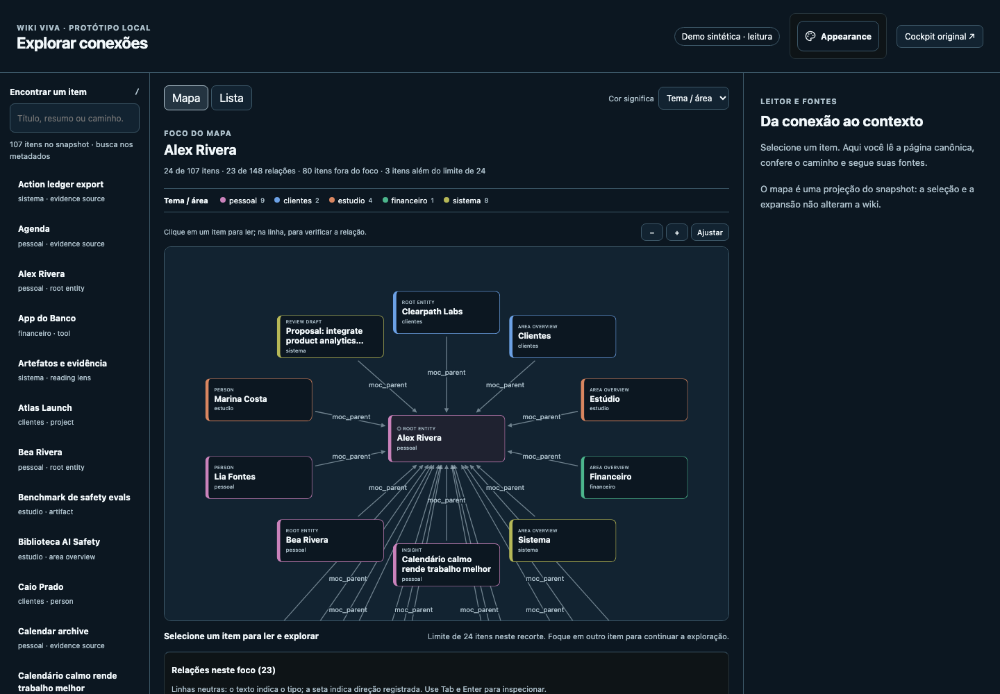
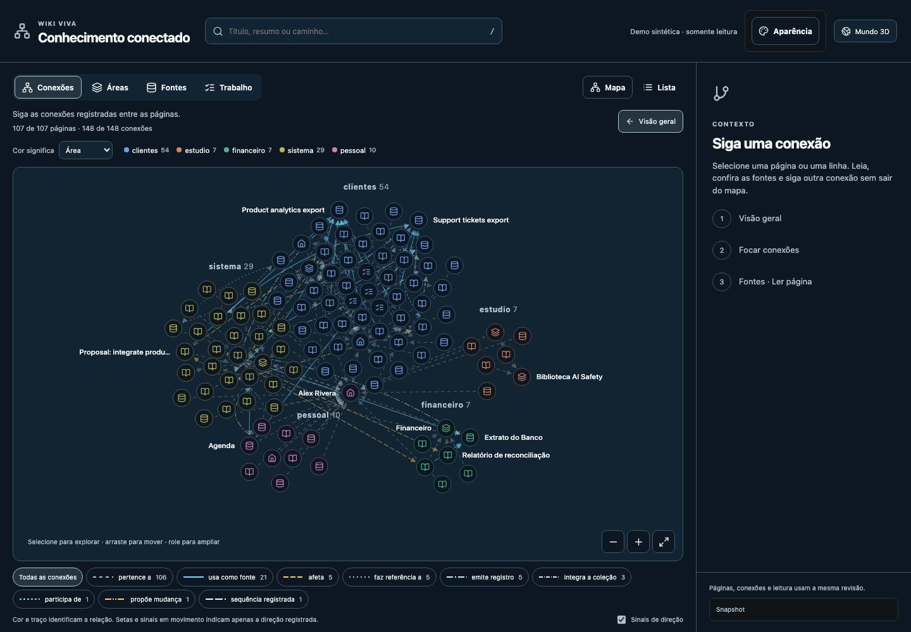
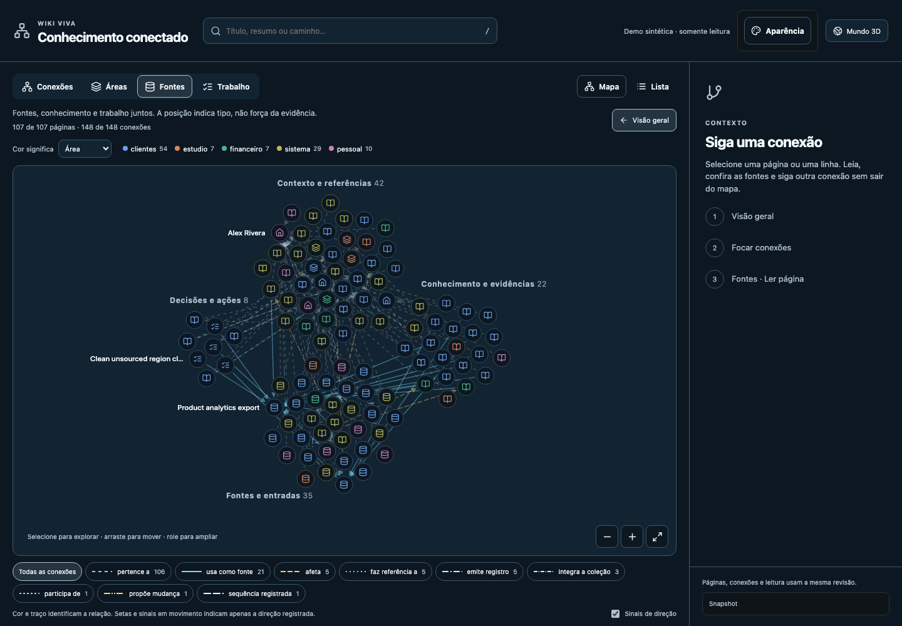
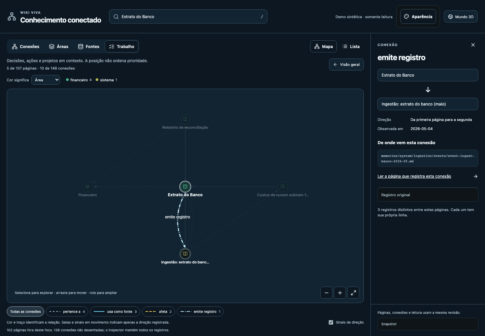
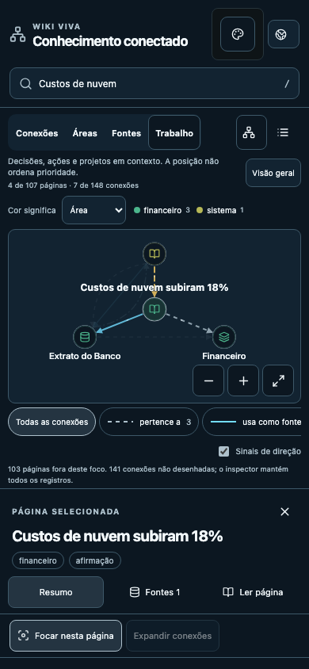
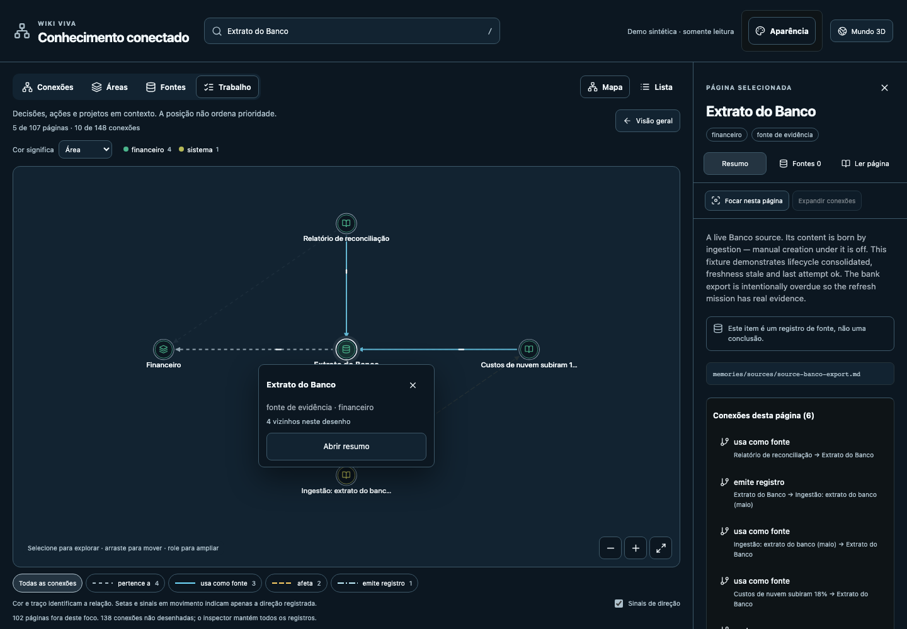
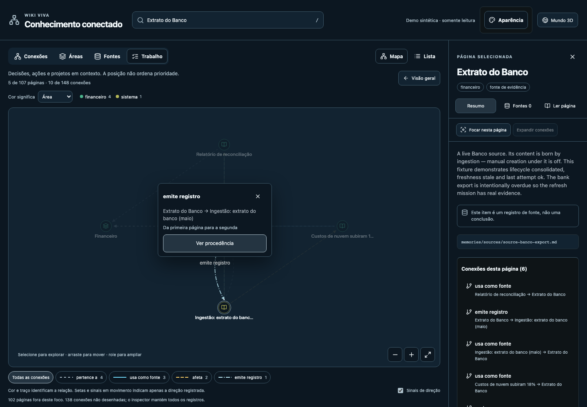

# Connected knowledge navigation

This is a frontend implementation candidate over the kit's existing
Markdown/Git and integrity-checked snapshot model. The base is
`ad34a1814266c02da3a49a378352e1aba869fea2`; the independently reviewed PR
head identifies the candidate version. Promotion follows [AGENTS.md](../../../AGENTS.md)
and normal CI. No private consumer content was used.

## Visual diagnosis before implementation

The existing cockpit and both requested public references were opened in
isolated Chromium before code changes. The reference comparison distinguishes
observed interfaces from illustrations:

- [Graphify](https://github.com/Graphify-Labs/graphify): the README's graph
  illustration demonstrates a continuous view with visible communities.
  It was inspected as an illustration; a Graphify installation, retrieval
  accuracy or runtime performance was not tested.
- [Design Psychology Foundations](https://newtribeiro.github.io/design-psychology-foundations/):
  the live Map, Evidence and search interactions were inspected. Its
  coordinated perspectives, human relation legend and source inspector
  informed the navigation pattern. Its domain model was not imported.

1. **The entry map hid the whole picture.** On the unchanged base, the
   synthetic entry showed 24 of 107 pages and 23 of 148 connections, with a
   large persistent index and a reader placeholder. The drawing extended
   beyond the available viewport. A selected-source view showed a useful
   five-page neighborhood, but it did not provide a connected overview.
2. **Connection labels exposed storage vocabulary first.** The old source
   neighborhood displayed terms such as `source_ref` and `moc_parent`.
   Reading a connection required interpreting the schema. The underlying
   directions and provenance already existed and had to be preserved.
3. **Color changes did not answer different spatial questions.** Area,
   category and state encoding existed, but the 2D navigation offered one
   neighborhood geometry. Reading, source inspection and a broader view
   needed a coordinated context rather than another isolated page.
4. **Movement needed an honest purpose.** The useful role is to show where
   recorded pages move when changing perspective and which way a directed
   record points. Motion must not suggest live processing, stronger evidence
   or new relations.

Before, using only the public synthetic fixture:

## Existing contracts versus delivered UI

| Existing foundation | Delivered increment | Boundary retained |
| --- | --- | --- |
| Canonical page IDs and graph records | Connected overview with truthful drawing counts | No new or inferred edges |
| Recorded context and page types | Connections, Areas, Sources and Work geometry | Position is not strength or priority |
| Separate world center and selected reader | Explicit local focus, progressive expansion and overview | Real world center remains independent |
| Complete page search index | Search popover, selection without recentering, list equivalent | Search covers pages outside the drawing |
| Source references and edge provenance | Human labels, source inspector, origin links, full original record | Unresolved references stay unresolved |
| Canonical lazy PageReader | Summary → sources → reading in the same inspector | Existing body integrity/revision checks |
| Typed navigation port and URL state | Additive perspective, scope and relation-emphasis query fields | Existing route normalization and history |
| Semantic themes and state encodings | Shared appearance and declared legends | No invented data color meanings |
| Original node adjacency and exact edge IDs | Hover/focus previews, pinned selection and direct provenance action | Exploration never changes the URL or reads another body |

The implementation does not add capture, source refresh, incremental
validation, work approval or resumption state. Those operations retain their
existing contracts; this increment makes their recorded knowledge easier to
reach. Source references still do not imply quotation-level support for
every sentence.

After, on the same public fixture:

## Acceptance and review corrections

The isolated browser journeys verify:

- All 107 pages and 148 edges of the public overview remain the same across
  the four perspectives. Selection, center, focus and canonical reading
  survive perspective changes, reload and Back/Forward.
- Search reaches the complete index; focus/expansion follows actual
  adjacency, and overview retains selection. Parallel/reciprocal records
  have distinct pointer curves and an exact original-record inspector.
- All six existing state metrics agree with their declared color/ring
  legend. Relation emphasis does not alter coverage or semantic geometry.
- Forged sidecar revision or content hashes fail closed. Requests stay within
  local read-only GETs, with no operator surface or browser exceptions.
- Small mobile focus keeps real node hit targets accessible above camera
  controls. Short viewports can scroll to controls/legend without sibling
  overlap. Sources/Work group names remain 12 screen pixels and do not
  overlap each other. The 390 × 844 view shows all four names; on a short
  390 × 660 view, names without safe placement are omitted while the
  perspective hint and reachable controls remain. Delayed panel focus does
  not override a reader control already chosen by the user.
- A dense eight-page graph still pins an inspected connection beyond the
  900-edge drawing budget. Recorded arrow tangents keep their orientation
  at mobile overview scale; missing direction receives no inferred arrow.
- Reduced motion removes transitions/direction signals. The finite layout
  reaches rest; a 220 ms idle observation produces no new animation-frame
  requests. Direction signals are bounded to eight selected directed edges.

Independent review identified and the implementation corrected: camera
controls covering a mobile node, endpoint recession reversing short directed
arrows, selected-edge pinning missing for small dense graphs, overflow on
short screens, and unreadable/colliding group labels. Normal architecture
and theme checks also required typed-port link construction and the shared
shadow token; their baselines were not relaxed.

The interaction follow-up corrects two later review findings: the connection
hit width used to shrink with zoom, and disabling motion during a camera fit
could strand it at an intermediate position. The hit band now stays 18 screen
pixels; an interrupted pending fit reaches its destination, while subsequent
manual pan/zoom cancels the obsolete destination. Enlarging the hit band exposed
overlap between compact parallel curves, so their lane spacing now remains in
screen pixels and visible curve centers take precedence over transparent bands.
Nodes can still cover curves at very low zoom; keyboard and recorded incident
lists remain available. This is not a claim of a free pointer region for every
edge in a dense drawing.

Hover or keyboard focus highlights the drawn neighborhood or an edge's exact
two endpoints, with human previews and a provenance action. It preserves the
route, perspective, selected reader and canonical body. Click/touch pins the
original record across perspectives; Escape or a background click clears the
pin, while a drag pans. Shared colors and distinct stroke patterns agree with
the legend; direction still comes only from the original record. Independent
review also caught focus being lost when the preview action disappeared. The
action now transfers focus to a persistent map surface before changing panels,
so Escape works after a real click or Tab/Enter without artificial focus repair.
Short canvases place the preview outside the drawing's clipped area, above the
embedded reader while retaining its expanded-dialog layer. A brief pointer
corridor preserves the originating record during transit into the card, even
when another curve is crossed; deliberate exploration can still change it.

## Cost and honest limits

Drawing budgets are 180 overview pages, 64 focused pages and 900 edges.
The index retains all original records; omitted/unresolved counts and
incrementally revealed incident lists make the boundary visible. Selected
pages/edge endpoints are pinned in large overviews.

A local measurement of the initial `bba216f` implementation, using Node 22.22.3
on an Apple M3 Max, discarded five warm-ups
and measured 20 model runs per synthetic profile. It excludes compilation,
download, integrity validation and browser rendering:

| Synthetic input | Drawn pages / edges | Index median / p95, ms | Network layout median / p95, ms |
| --- | --- | --- | --- |
| Public fixture: 107 / 148 | 107 / 148 | 0.80 / 1.02 | 9.06 / 9.75 |
| Chain: 1,000 / 999 | 180 / 179 | 3.73 / 4.38 | 29.21 / 43.30 |
| Chain: 10,000 / 9,999 | 180 / 179 | 39.22 / 47.47 | 33.28 / 34.58 |
| Parallel records: 2 / 1,000 | 2 / 900 | 3.23 / 3.95 | 3.92 / 4.43 |

These are model measurements, not a production latency, retrieval-quality
or FPS claim, and they do not measure the interaction follow-up's renderer. The
default model geometry remains unchanged. The pre-existing 3D layout worker
remains 53.11 kB. The normal
production bundle gate stays below its unchanged 300 KiB initial-JS budget.
Perspective transitions are finite, not a continuously running simulation.

The normal Python suite passed 1,508 tests with 19 existing skips after
allowing its synthetic loopback test servers. Frontend unit tests,
architecture/assets/gate contracts, TypeScript/production build, public
privacy, exact-base page graph, deterministic generators, packs and OKF
checks are recorded with the PR validation evidence. Isolated browser checks
are targeted coverage, not complete WCAG certification. Actual screenshots
come from fresh desktop/mobile contexts over the committed public fixture;
the UI is Portuguese while canonical fixture bodies retain their English.

## Compatibility and adoption

See [Connected knowledge map](../guides/connected-knowledge-map.md) for actual
controls, route grammar and **Upgrading**. Existing explicit-focus bookmarks
retain neighborhood behavior; fresh entries show overview. The five native
world views and original 3D routes remain available.

There is no snapshot/page/source schema migration or map-specific C3. Adopt
the approved source through B0 dry-run, C1 tracked-file sync and existing C2
in one consumer-owned PR. Run that consumer's gates and private visual
readback, then verify B0 idempotence. Do not layer the update into another
writer's dirty worktree. Screenshots, routes and content from a real consumer
must remain private. No hosting/account change or new deployment is part of
this increment.
