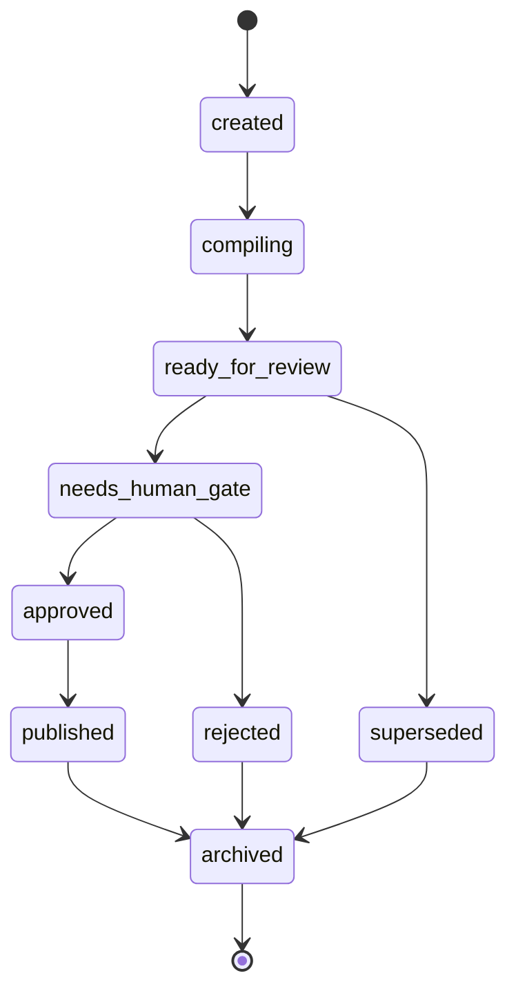

# Template - living gate

```yaml
---
gate_id: gate-example
page_id: gate-example
page_type: operational_rule
title: "Gate - example"
aliases:
  - Gate example
  - Approval example
tags:
  - wiki/gate
  - wiki/approval
  - status/template
status: template
context: system
visibility: private_self
updated_at: YYYY-MM-DD
stale_after_days: 90
sources_policy: contrato_wiki_operacional
gate: github_pr
sensitive_data_policy: private_sensitive_allowed
purpose: describe the human approval policy and proposal cycle
owner: {{owner_id}}
moc_parent: memories/system/git-approvals.md
related_pages: []
backlinks_expected: []
---
```

# Gate - example

## Policy

- Human gate: GitHub PR.
- Quorum: one human approver responsible for the context.
- Default SLA: 72 hours, except for operational urgency.

## State machine

> Illustrate by default: a gate is a state machine. Show the transitions as a
> Mermaid state diagram, and keep the table below as the readable index. See the
> representation conventions in [obsidian-conventions.md](obsidian-conventions.md).



## States

| State | Meaning | Next transition |
| --- | --- | --- |
| created | proposal created | compiling |
| compiling | agent consolidating sources and diff | ready_for_review |
| ready_for_review | diff ready for local review | needs_human_gate |
| needs_human_gate | awaiting review by the human reviewer | approved or rejected |
| approved | approved for merge | published |
| published | consolidated into `main` | archived when obsolete |
| superseded | replaced by a newer proposal | archived |
| rejected | rejected for scope, risk, or error | archived |
| archived | kept as history | end |

## Rebase and superseded

- A page/context should have one main active proposal.
- Old proposals become `superseded` when a more current proposal covers the
  same scope.
- `wiki/*` branches must rebase against `main` before the PR is ready.

## Related

- MOC:
- Related pages:
