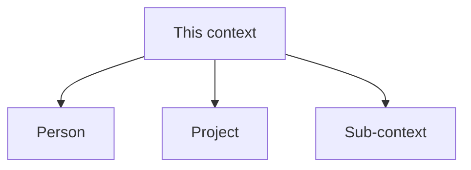

# Template - holon/context

```yaml
---
page_id: holon-example
page_type: holon
title: "Holon - example"
aliases:
  - Example context
tags:
  - wiki/holon
  - wiki/moc
  - status/active
status: active
context: system
visibility: private_self
updated_at: YYYY-MM-DD
stale_after_days: 45
sources_policy: memorias_consolidadas
gate: github_pr
sensitive_data_policy: private_sensitive_allowed
owner: {{owner_id}}
related_holons: []
roles: []
responsibilities: []
source_refs: []
claims: []
decisions: []
actions: []
evidence_refs: []
---
```

# Holon - example

> Illustrate by default: a holon holds people, projects, and sub-contexts. Sketch
> those relations with a Mermaid flowchart. See the representation conventions in
> [obsidian-conventions.md](obsidian-conventions.md).



## Scope

-

## Living sources

-

## Boundaries

-

## Related

- Parent MOC:
- People:
- Projects:
