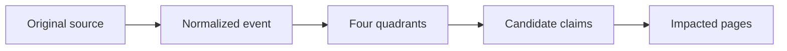

# Template - ingestion event

```yaml
---
event_id: evt-YYYY-MM-DD-slug
page_id: event-YYYY-MM-DD-slug
page_type: ingestion_event
title: "Event - title"
aliases:
  - Event topic
tags:
  - wiki/event
  - wiki/ingestion
  - status/candidate
status: candidate
context: system
visibility: private_self
updated_at: YYYY-MM-DD
stale_after_days: 30
sources_policy: evento_normalizado_com_quadrantes
gate: github_pr
sensitive_data_policy: private_sensitive_allowed
source_refs:
  - source-example
source_ref: source-example # backward-compatible singular alias
source_type: pdf | email | meeting | sheet | chat | repo | image | audio | manual_note
captured_at: YYYY-MM-DD
verified_at: YYYY-MM-DD
status_epistemologico: fato | percepcao | hipotese | insight | proposta | decisao
risk_level: low | medium | high
requires_gate: true
target_pages: []
purpose: "Why this event exists."
owner: {{owner_id}}
moc_parent: memories/system/ingestion/events/
related_pages: []
backlinks_expected: []
source_counts:
  live_sources: 0
  references: 0
  derived_artifacts: 0
attachment_policy: "Source, manifest, text, and chunks must be Markdown links."
---
```

# Event - title

> Illustrate by default: sketch the source's path through ingestion with a small
> Mermaid flowchart. See the representation conventions in
> [obsidian-conventions.md](obsidian-conventions.md).



## Source

- Original source:
- Manifest:
- Text/chunks:
- Contextual LLM passage:

## Quadrants

| Quadrant | Extracted content | Absence/limit |
| --- | --- | --- |
| Interior individual |  |  |
| Exterior individual |  |  |
| Interior collective |  |  |
| Exterior collective |  |  |

## Candidate claims

-

## Candidate decisions

-

## Candidate actions

-

## Conflicts and ambiguities

- Conflicts with existing claims/pages (use the integration packet from
  [scripts/wiki_consolidate.py](../../../../scripts/wiki_consolidate.py)) and the resolution.
- Ambiguities/uncertainties from the deep read that require a human decision.

## Risks

-

## Impacted pages

-

## Related

- MOC:
- Source:
- Ingestion proposal:
- Related pages:
