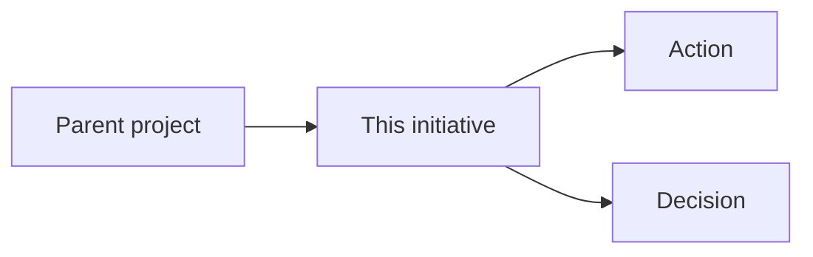

# Template - initiative

```yaml
---
page_id: initiative-example
page_type: initiative
title: "Initiative - example"
aliases:
  - Example initiative
tags:
  - wiki/initiative
  - status/active
status: active
context: system
visibility: private_self
updated_at: YYYY-MM-DD
stale_after_days: 30
sources_policy: memorias_consolidadas
gate: github_pr
sensitive_data_policy: private_sensitive_allowed
owner: {{owner_id}}
related_holons: []
roles: []
responsibilities: []
source_refs: []
claims: []
decisions: []
actions: []
evidence_refs: []
---
```

# Initiative - example

> Illustrate by default: show this initiative's cycle and where it sits between
> the project and its actions/decisions with a Mermaid flowchart. See the
> representation conventions in [obsidian-conventions.md](obsidian-conventions.md).



## Cycle

-

## Expected outcome

-

## Related

- Project:
- Actions:
- Decisions:
