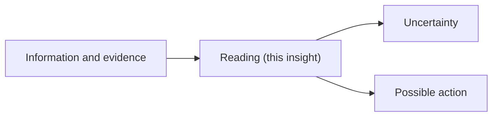

# Template - insight

```yaml
---
page_id: insight-YYYY-MM-DD-topic
page_type: insight
title: "Insight - topic"
aliases:
  - Insight topic
tags:
  - wiki/insight
  - status/candidate
status: candidate
context: system
visibility: private_self
updated_at: YYYY-MM-DD
stale_after_days: 60
sources_policy: fontes_e_incerteza
gate: github_pr
sensitive_data_policy: private_sensitive_allowed
---
```

# Insight - topic

> Illustrate by default: an insight is a step up the ladder from raw data. Show
> the information-to-insight path with a Mermaid flowchart. See the
> representation conventions in [obsidian-conventions.md](obsidian-conventions.md).



## Reading

-

## Evidence

-

## Uncertainty

-

## Possible action

-

## Related

- Source:
- Claims:
- Actions:
