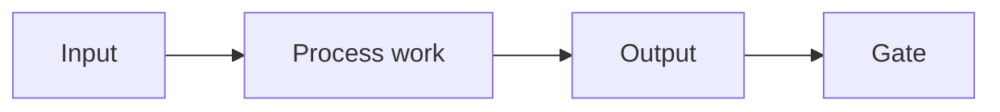

# Template - process

```yaml
---
page_id: {{page_id}}
page_type: process
title: "{{title}}"
aliases:
  - "{{title}}"
tags:
  - wiki/process
  - status/active
status: active
context: {{context}}
visibility: private_self
updated_at: {{updated_at}}
stale_after_days: {{stale_after_days}}
sources_policy: process_contract
gate: github_pr
sensitive_data_policy: private_sensitive_allowed
owner: {{owner_id}}
moc_parent: memories/index.md
cadence: on_demand
input_channels: []
related_holons: []
roles: []
responsibilities: []
source_refs: []
claims: []
decisions: []
actions: []
evidence_refs: []
---
```

# {{title}}

## Purpose

-

## Flow



## Cadence and Gates

| Item | Value |
| --- | --- |
| Cadence |  |
| Owner |  |
| Entry criteria |  |
| Exit criteria |  |

## Inputs and Outputs

| Input channel | Output artifact | Target page |
| --- | --- | --- |
|  |  |  |

## Roles and Responsibilities

| Role | Responsibility |
| --- | --- |
|  |  |

## Related

- Root entity:
- Input stage:
