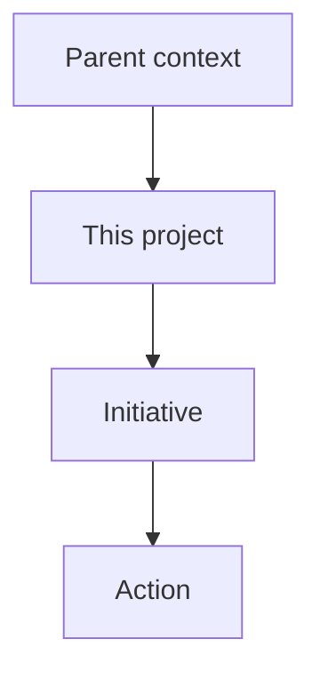

# Template - project

```yaml
---
page_id: project-example
page_type: project
title: "Project - example"
aliases:
  - Example project
tags:
  - wiki/project
  - status/active
status: active
context: system
visibility: private_self
updated_at: YYYY-MM-DD
stale_after_days: 30
sources_policy: memorias_consolidadas
gate: github_pr
sensitive_data_policy: private_sensitive_allowed
owner: {{owner_id}}
related_holons: []
roles: []
responsibilities: []
source_refs: []
claims: []
decisions: []
actions: []
evidence_refs: []
---
```

# Project - example

> Illustrate by default: show how this project sits between its context, its
> initiatives, and its actions with a Mermaid flowchart. See the representation
> conventions in [obsidian-conventions.md](obsidian-conventions.md).



## Objective

-

## State

-

## Related

- MOC:
- Initiatives:
- Actions:
