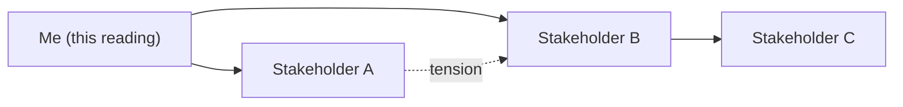

# Template - relationship map (tensions, stakeholders, context)

```yaml
---
page_id: template-relationship-map
page_type: relationship_map
title: "Relationship map - tensions and stakeholders"
aliases:
  - Relationship map
  - Tension map
  - Stakeholder map
tags:
  - wiki/template
  - wiki/perception
  - wiki/relationship-map
  - status/template
status: template
context: system
visibility: private_reference
purpose: "Map stakeholders, tensions, and the context of a situation as a perceptual reading, not as closed truth."
owner: {{owner_id}}
updated_at: YYYY-MM-DD
stale_after_days: 30
status_epistemologico: hipotese
moc_parent: memories/index.md
related_pages:
  - docs/references/templates/wiki/person.md
  - docs/references/templates/wiki/holon.md
perception_policy:
  layer: perceptiva
  is_canonical_truth: false
  preferred_outputs:
    - mapa_de_relacoes
    - diagrama_de_stakeholders
    - mapa_de_tensoes
  accessibility:
    alt_text_required: true
    color_only_encoding_forbidden: true
    plain_language_summary_required: true
source_counts:
  live_sources: 0
  references: 0
  derived_artifacts: 0
attachment_policy: "Optional diagram in data/derived with a Markdown link. Private repo: people's names are normal operational data in a private context; mark visibility as needed; never embed access secrets."
---
```

# Relationship map - tensions and stakeholders

Updated on: YYYY-MM-DD

> A relationship map is a perceptual and provisional reading
> (`status_epistemologico: hipotese`). It shows how **I interpret** the relations
> and tensions today, subject to revision. It is not the truth of those involved.

## Question it answers

-

## Audience

- Who it is for:
- Sensitivity (who should not see it):

## Stakeholders

| Stakeholder | Role/interest | Influence | Perceived stance |
| --- | --- | --- | --- |
|  |  |  |  |

## Perceived tensions

| Between whom | Nature of the tension | Intensity | Evidence or just perception |
| --- | --- | --- | --- |
|  |  |  |  |

## Context

- Situation/decision at stake:
- Relevant history:
- What I still do not know:

## Data used and transformations

- Data/observations used:
- Transformations (groupings, simplifications):
- What was left out:

## Visual artifact

> Illustrate by default: a relationship map is a diagram first. Sketch it inline
> with Mermaid, then optionally export an image. See the representation
> conventions in [obsidian-conventions.md](obsidian-conventions.md).



- Optional exported image: [map file](../../../../data/derived/) <!-- replace with the real file -->

## Accessible text alternative

- Alt text (short description of the diagram):
- Plain-language summary (main relations without depending on color):
- Encoding beyond color (label, thickness, shape):

## Limitations and confidence level

- Known limitations/biases:
- Confidence level: `low` | `medium` | `high`
- Triggers for revising this map:

## Source, authorship, version, visibility

- Authorship:
- Version:
- Visibility: `private_reference`
- Gate: PR on GitHub

## Related

- MOC: [index.md](../../../../memories/index.md)
- People: [person.md](person.md)
- Holon/context: [holon.md](holon.md)
