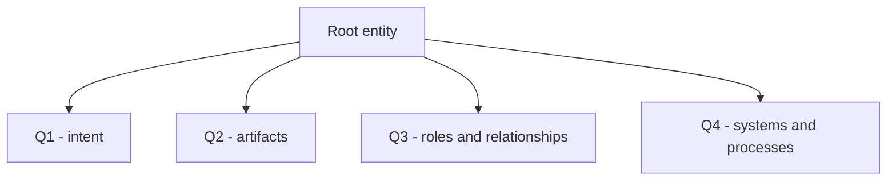

# Template - root entity

```yaml
---
page_id: {{page_id}}
page_type: root_entity
title: "{{title}}"
aliases:
  - "{{title}}"
tags:
  - wiki/root-entity
  - status/active
status: active
context: {{context}}
visibility: private_self
updated_at: {{updated_at}}
stale_after_days: {{stale_after_days}}
sources_policy: root_entity_contract
gate: github_pr
sensitive_data_policy: private_sensitive_allowed
root_entity_type: team
moc_parent: memories/index.md
primary_contexts:
  - {{context}}
input_stage_ref: memories/system/input-stage.md
input_channels: []
perspective_bundle_required:
  - perspective-identity-intent
  - perspective-artifacts-evidence
  - perspective-roles-relationships
  - perspective-systems-processes
perspective_bundle_optional:
  - perspective-privacy-publication
source_refs: []
related_holons: []
roles: []
responsibilities: []
claims: []
decisions: []
actions: []
evidence_refs: []
---
```

# {{title}}

> Illustrate by default: this page is the semantic entry point of the wiki. It
> maps identity, artifacts, relationships, processes and input channels before
> source ingestion starts.

## Identity and Scope

| Field | Value |
| --- | --- |
| Root type | `person` / `team` / `company` / `project` / `community` / `product` |
| Purpose |  |
| Boundaries |  |
| Primary contexts |  |

## Integral Quadrant Map

| Quadrant | What belongs here | Canonical pages | Input channels |
| --- | --- | --- | --- |
| Q1 - Interior individual | Identity, intent, priorities, constraints, first-person stance |  |  |
| Q2 - Exterior individual | Artifacts, outputs, observable evidence, repos, tools, documents |  |  |
| Q3 - Interior collective | People, roles, relationships, culture, rituals, expectations |  |  |
| Q4 - Exterior collective | Systems, channels, processes, cadences, governance and institutions |  |  |



## People, Roles and Responsibilities

| Person or group | Role | Responsibility | Source |
| --- | --- | --- | --- |
|  |  |  |  |

## Artifacts, Repositories and Tools

| Artifact | Type | Owner | Source/config |
| --- | --- | --- | --- |
|  |  |  |  |

## Channels and Input Sources

| Channel | Type | Status | Source page | Config | Quadrants |
| --- | --- | --- | --- | --- | --- |
|  |  | `declared` |  |  |  |

## Processes and Cadences

| Process | Cadence | Inputs | Outputs | Gate |
| --- | --- | --- | --- | --- |
|  |  |  |  |  |

## Projects and Initiatives

| Project/initiative | Objective | State | Inputs |
| --- | --- | --- | --- |
|  |  |  |  |

## Perspective Bundle

| Perspective | Quadrant | Required? | Target pages |
| --- | --- | --- | --- |
| `perspective-identity-intent` | Q1 | yes | Root entity, decisions, claims |
| `perspective-artifacts-evidence` | Q2 | yes | Source, artifact, project and claim pages |
| `perspective-roles-relationships` | Q3 | yes | Person, role, responsibility and relationship pages |
| `perspective-systems-processes` | Q4 | yes | Process, operation, source-config and project pages |
| `perspective-privacy-publication` | Boundary | optional | Publication and privacy checks |

## Source Ingestion Map

| Source | Input channel | Required perspectives | Target pages | Refresh |
| --- | --- | --- | --- | --- |
|  |  |  |  |  |

## Privacy and Publication Boundaries

- Personal data can stay on private pages when it is operational memory.
- Access secrets, cookies, tokens, passwords and individualized secure links are
  blocked everywhere.
- Public candidates require redaction and `--public-export` validation.

## Open Questions and Blocked Sources

| Item | Status | Owner | Next step |
| --- | --- | --- | --- |
|  |  |  |  |

## Related Pages

- Root MOC:
- Input stage:
- Source registry:
