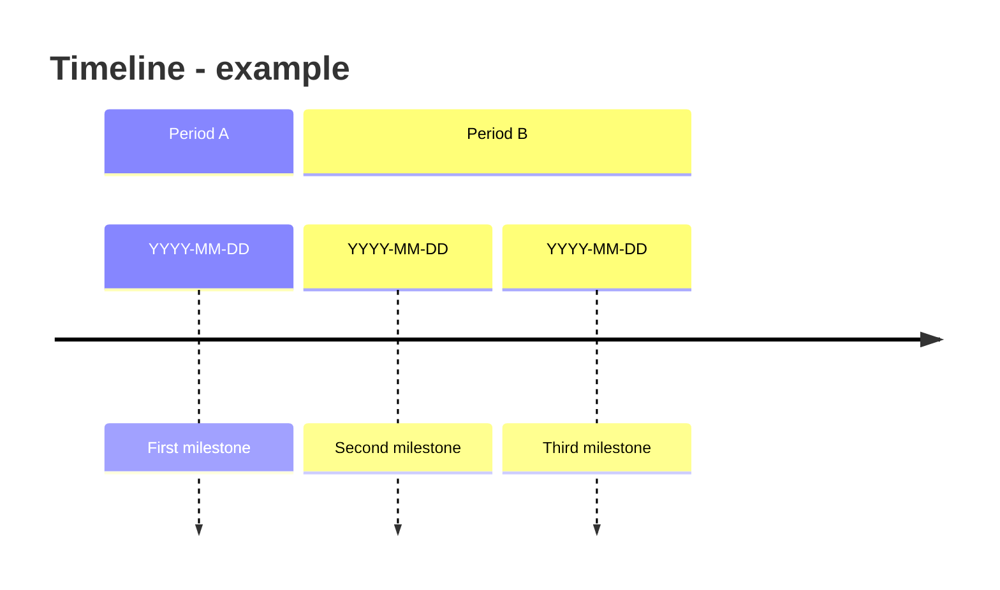

# Template - timeline

```yaml
---
page_id: timeline-example
page_type: timeline
title: "Timeline - example"
aliases:
  - Timeline example
tags:
  - wiki/timeline
  - status/active
status: active
context: system
visibility: private_self
updated_at: YYYY-MM-DD
stale_after_days: 45
sources_policy: log_e_evidencia
gate: github_pr
sensitive_data_policy: private_sensitive_allowed
owner: {{owner_id}}
related_holons: []
roles: []
responsibilities: []
source_refs: []
claims: []
decisions: []
actions: []
evidence_refs: []
---
```

# Timeline - example

> Illustrate by default: a timeline is a diagram first. Render it inline with a
> Mermaid timeline, and keep a parallel table for the facts. See the
> representation conventions in [obsidian-conventions.md](obsidian-conventions.md).

## Diagram



> If you need durations or dependencies instead of points in time, use a Gantt
> chart (`gantt`) rather than a timeline.

## Milestones

| Date | Milestone | Source/evidence | Status |
| --- | --- | --- | --- |
| YYYY-MM-DD |  |  |  |

## Related

- MOC:
- Sources:
- Evidence:
