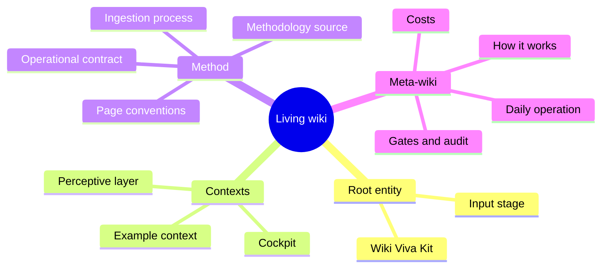

# Memory - root MOC

Updated at: 2026-08-26.

[memories/](./index.md) is the main consolidated memory. [docs/](../docs/README.md) holds
references, templates, and snapshots; [data/raw](../data/raw) and
[data/derived](../data/derived) are cache (gitignored).

This is the technical root map of content and the entry point to the kit's
**meta-wiki**: this repository uses its own Wiki Viva contracts to document how
Wiki Viva works. The semantic top page for this kit is
[Wiki Viva Kit](system/wiki-viva-kit.md), and the generated input catalog is
[Input stage](system/input-stage.md). Opening this MOC means you are already
inside the living wiki — there is no separate documentation site. The wiki has
four kinds of content: the **root entity** (what this wiki is about), the
**contexts** (the actual subject matter), the **method** (how the wiki is built
and kept honest), and the **meta-wiki** (the wiki documenting itself).

## Memory policy

- `main` is the approved wiki. `wiki/*` branches are live proposals; the PR is the
  human gate.
- On private pages, memory may record personal data (PII) when useful; access
  secrets never go anywhere.
- Every local reference to a file inside the repo must be a clickable Markdown link.

## Meta-wiki (the wiki documenting itself)

The meta-wiki is a first-class part of this wiki, not a separate manual: it is the
living wiki used to explain how the living wiki works, kept honest by the same
gates. It is the place to start if you want to understand the system itself.

- Entry point: [system/wiki/index.md](system/wiki/index.md) — map of the whole meta-wiki.
- Architecture and module map: [system/wiki/architecture.md](system/wiki/architecture.md).
- Daily operation: [system/wiki/daily-operation.md](system/wiki/daily-operation.md).

## Method and operation

| Topic | Page |
| --- | --- |
| Semantic root entity | [system/wiki-viva-kit.md](system/wiki-viva-kit.md) |
| Input stage | [system/input-stage.md](system/input-stage.md) |
| Cockpit | [operations.md](operations.md) |
| Ingestion process | [system/ingestion-process.md](system/ingestion-process.md) |
| Wiki contract | [system/operational-wiki-contract.md](system/operational-wiki-contract.md) |
| Page conventions (Mermaid + tables by default) | [obsidian-conventions.md](../docs/references/templates/wiki/obsidian-conventions.md) |
| Docs vs. memory boundary | [system/docs-review.md](system/docs-review.md) |
| Change log | [system/log.md](system/log.md) |
| Method coverage | [system/methodology-coverage-v5.md](system/methodology-coverage-v5.md) |

## Contexts

- [example/index.md](example/index.md) — demonstration context.

## Sources and perception

- Root entity: [system/wiki-viva-kit.md](system/wiki-viva-kit.md).
- Input stage (root/channels/sources compilation):
  [system/input-stage.md](system/input-stage.md) — generated by
  [scripts/wiki_input_stage.py](../scripts/wiki_input_stage.py).
- Canonical source registry (ingestion state + last update + next refresh):
  [system/source-registry.md](system/source-registry.md) — generated by
  [scripts/wiki_source_registry.py](../scripts/wiki_source_registry.py); cadence guide:
  [source-refresh-cadence.md](../docs/references/guides/source-refresh-cadence.md).
- Methodology (source): [sources/wiki-viva-methodology-v5.md](sources/wiki-viva-methodology-v5.md).
- Perceptive layer: [system/perception/index.md](system/perception/index.md).
