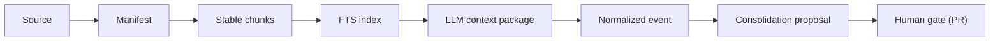

# Living wiki methodology (source)

Updated on: 2026-08-26.

This page is the methodological source of the kit: it describes, at a high level, the model of
the living operational wiki that the code implements. Implementation coverage is
tracked in [methodology-coverage-v5.md](../system/methodology-coverage-v5.md).

## Principles

| Principle | What it means |
| --- | --- |
| Markdown/Git as a portable foundation | The wiki is versioned text; the PR is the gate. |
| Ingestion as compilation | A source becomes a manifest, text/chunks, an index, a context package, a normalized event, and consolidation. |
| Code first, LLM for deep context | The Python is deterministic; the deep reading belongs to the agent that runs the repo, recorded in the cache (gate `required_context_pass`). |
| Privacy per page | PII is welcome on private pages; secrets are always blocked; PII only becomes an error at the public boundary. |
| Four quadrants | Wilber/AQAL lens crossing interior/exterior with individual/collective: Q1/I identity-intent, Q2/It output-evidence, Q3/We shared meaning/roles-as-lived, Q4/Its systems-processes-governance, with explicit absence. |
| Operation page (cockpit) | The first resumption screen. |
| Karma gamification | A by-product, without toxic ranking. |
| Perceptive layer | Journal and map, before becoming canonical memory. |
| Rich representation by default | Pages illustrate structure with Mermaid diagrams and tables; prose stays for nuance. |

## Ingestion as compilation

The "ingestion as compilation" principle is a pipeline: each stage is deterministic
except the deep reading, which the agent performs and records back into the cache.

## Rich representation by default

Pages SHOULD illustrate what they describe with **Mermaid diagrams** and **Markdown
tables** by default, keeping prose for nuance. Architecture, flow, relationship, and
process pages MUST carry at least one diagram. The full guideline — including the
"which diagram for what" mapping and the diagram authoring rules — lives in the page
conventions: [obsidian-conventions.md](../../docs/references/templates/wiki/obsidian-conventions.md).

## Related

- Conventions (rich representation, frontmatter, links): [obsidian-conventions.md](../../docs/references/templates/wiki/obsidian-conventions.md).
- Coverage: [methodology-coverage-v5.md](../system/methodology-coverage-v5.md).
- Process: [ingestion-process.md](../system/ingestion-process.md).
