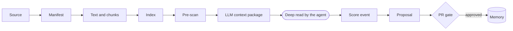

# Ingestion process

Updated on: 2026-06-09

This process turns a new source into a reviewable proposal, consolidated memory,
or a decision not to ingest.

## Automated flow (orchestrator)

The deterministic steps 4-7 stopped being standalone CLIs: the orchestrator
[scripts/wiki_ingest.py](../../scripts/wiki_ingest.py) chains, in a single command,
**manifest -> text/chunks -> index -> pre-scan (secret blocks; PII only informs)
-> LLM context package (emits the `-request.json` that the auditor requires)
-> score-event `ingestar_fonte_valida`**. The proposal is born with `gate_state:
created`. The LLM pass remains delegated to the agent that runs the repo (the skill
reads the package and writes the result to the cache); the auditor only releases
the merge when the deep reading is recorded (`required_context_pass`). The manual
steps below are the breakdown of that flow, useful when running it step by step.

To close the **Information -> Insight** cycle, [scripts/wiki_insight_job.py](../../scripts/wiki_insight_job.py)
gathers events+chunks+pages by theme and emits a PROPOSAL of an insight (candidate)
for a human gate — without writing canonical memory.

The orchestrated path, end to end:

The deterministic stages, the command that runs each, and what gates it:

| Stage | Command | Gate |
| --- | --- | --- |
| Manifest | [wiki_extract_source_manifest.py](../../scripts/wiki_extract_source_manifest.py) | none |
| Text + chunks | [wiki_extract_text.py](../../scripts/wiki_extract_text.py) | none |
| Index | [wiki_build_index.py](../../scripts/wiki_build_index.py) | none |
| Pre-scan + context package | [wiki_ingest.py](../../scripts/wiki_ingest.py) | secret blocks (exit 2); emits the `-request.json` |
| Deep read | [wiki_llm_context_pass.py](../../scripts/wiki_llm_context_pass.py) | `required_context_pass` requires a recorded result |
| Consolidation + audit | [wiki_audit.py](../../scripts/wiki_audit.py) | contract/links/secrets; human approval on the PR |

## Flow

1. Identify the source without copying access secrets into the conversation.
2. Classify the source as `memory`, `reference`, `artifact`, `raw`, or
   `no_ingest`.
3. Define the target context among those declared in [wiki.config.yaml](../../wiki.config.yaml)
   (`contexts`); `system` is always valid.
4. Generate a manifest with [scripts/wiki_extract_source_manifest.py](../../scripts/wiki_extract_source_manifest.py)
   when the source is a file, URL, or traceable artifact.
5. Extract text and chunks with [scripts/wiki_extract_text.py](../../scripts/wiki_extract_text.py)
   when there is new semantic content.
6. Record a normalized event in [memories/system/ingestion/events/](ingestion/events/)
   with four quadrants or an explicit absence.
7. Plan the contextual LLM pass with [scripts/wiki_llm_context_pass.py](../../scripts/wiki_llm_context_pass.py)
   and record the cache/plan or a skip justification.
8. If the decision is not trivial, generate a proposal in
   [memories/system/ingestion/YYYY-MM-DD-<topic>.md](ingestion/).
9. Open or update a `wiki/*` branch.
10. Consolidate the synthesis into the context memory, not just link the source.
11. Turn every cited local path into a clickable Markdown link. The label may be
   the original path; the target must point to the existing file, directory, or
   original source.
12. Update related pages and [memories/system/log.md](log.md).
13. Run the audit and review the diff in a PR.
14. Merge only after human approval.

## Private extraction criteria

In a private repo, personal data is no reason to leave only a link. When the
information improves operational memory, classification, reconciliation, decision,
CRM, procedures, or context, the wiki may extract sensitive content into private
Markdown: values, dates, counterparties, documents, CPF/CNPJ, relationships, roles,
responsible parties, decisions, and meeting excerpts.

Do not turn Markdown into a full copy of the source when a tabular structure or the
original file would be more appropriate. Even so, excerpts and explanatory tables
may enter the wiki when they are the clearest way to preserve context.

## Non-ingestion criteria

Do not ingest into Markdown when the source is:

- a token, cookie, secret, or credential;
- an individualized secure link, access code, meeting password, or URL with an
  embedded credential;
- an indiscriminate dump of email, spreadsheet, messaging app, browser, or a
  live system;
- a complete ledger when the spreadsheet, [data/raw](../../data/raw), or
  [data/derived](../../data/derived) is the correct operational surface;
- third-party material without an explicit operational or relational need;
- public content that needs to be verified live before use.

In those cases, record only minimal metadata, a safe location, and the handling
decision, when that is necessary to operate. Documents, spreadsheets, contracts,
emails, and chats may be read and summarized when the task requires it; the
restriction is against full copying without criteria and against access secrets.

## Link rule

- Every local reference to a file or directory within the repo must be a real
  Markdown link, not loose text and not inline code.
- Accepted examples: [memories/example/index.md](../example/index.md),
  [data/derived/](../../data/derived/), and external links (Drive, spreadsheet, etc.).
- If the historical file no longer exists, the label may keep the historical path,
  but the target must point to the nearest real directory or to the current page
  that replaced the original.
- Commands remain in inline code when they are commands; if the command cites a
  script as an operational source, also cite the script as a link on a separate
  line or in the sources section.
- [scripts/wiki_audit.py](../../scripts/wiki_audit.py) `--check` must fail when it
  finds an existing local path written without a link in the wiki/process pages.

## Conflicts

- Memory vs. old doc: memory governs until an immutable reference or a live source
  proves otherwise.
- Memory vs. live source: record the divergence, update the memory in a PR, and
  note the verification date.
- Live system vs. spreadsheet/app: do not resolve automatically without a current
  readback and an explicit rule.
- External source (Drive, etc.) vs. [data/raw](../../data/raw): trust the external
  source first and record the divergence before reorganizing.

## Expected result

Every ingestion ends in one of these states:

- updated memory;
- preserved reference;
- versioned operational artifact;
- raw source preserved outside the wiki;
- pending proposal;
- recorded non-ingestion.

## Mandatory quadrants

Relevant events must record:

- Interior individual: the person's perception, intention, tension, or reading;
- Exterior individual: speech, task, commit, payment, document, or measure;
- Interior collective: agreement, conflict, narrative, culture, or relationship;
- Exterior collective: rule, system, process, contract, tool, or structure.

When a quadrant does not appear in the source, fill in the `Absence/limit`
column. The absence is an operational finding, not an empty field.
