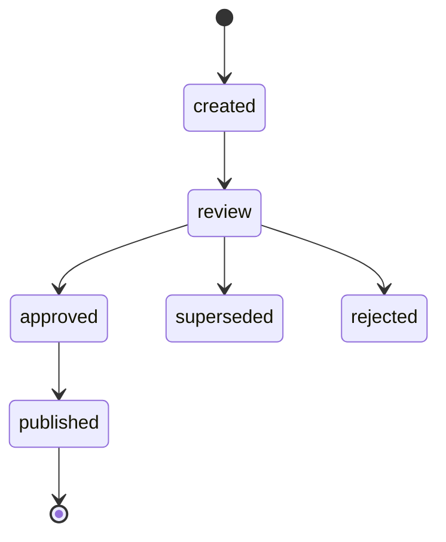

# Ingestion - proposals

Updated at: 2026-06-09.

Each ingestion proposal is born from [scripts/wiki_new_ingest.py](../../../scripts/wiki_new_ingest.py)
or from the orchestrator [scripts/wiki_ingest.py](../../../scripts/wiki_ingest.py), with
`gate_state: created` and one `rebase_key` per logical target. Normalized events
live in [events/](events/README.md).

## States of a proposal

A proposal is born `created` and advances through review toward `approved` and
`published`; when two proposals compete for the same logical target, the rebase keeps
the most recent one and marks the rest `superseded`. The full state machine is in
[gates-and-audit.md](../wiki/gates-and-audit.md).

The auditor requires a valid `gate_state` on every proposal in this directory.

## Related

- Process: [ingestion-process.md](../ingestion-process.md).
- Events: [events/README.md](events/README.md).
