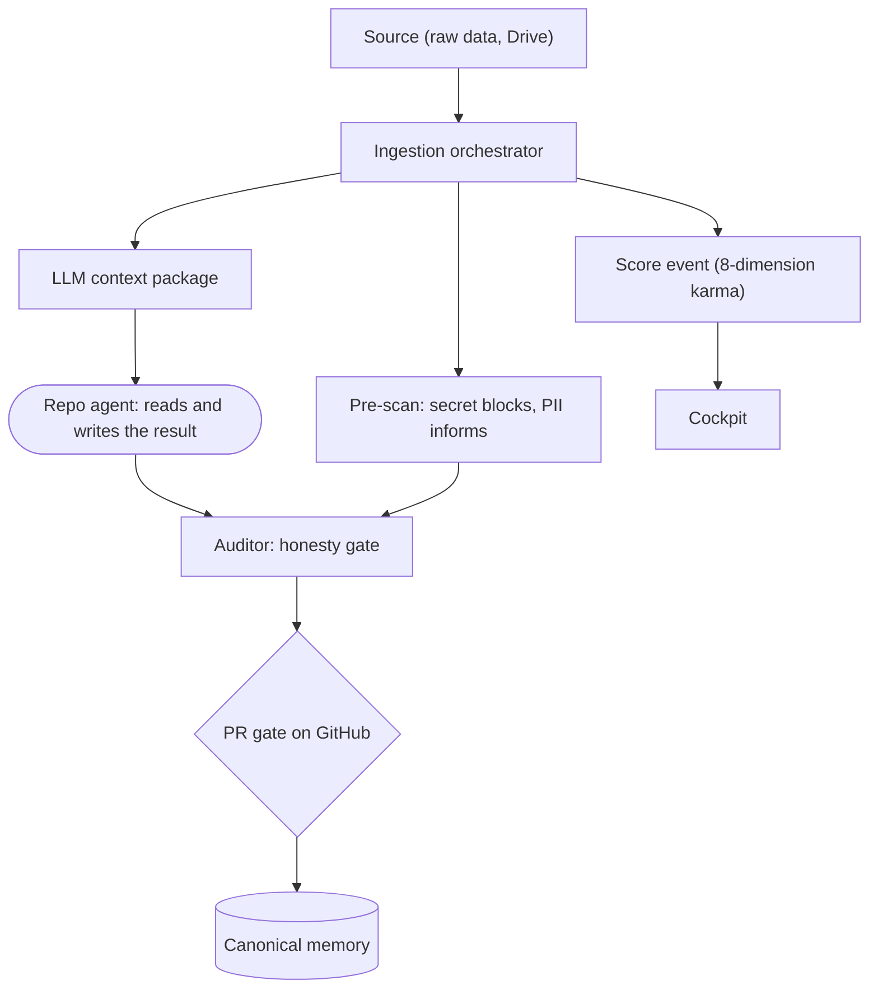

# Relationship map - living wiki system

Updated on: 2026-06-09.

> **Private** page and **perception** (an at-a-glance reading of the architecture),
> not a contract. The source of truth for the modules is the code in [wiki_core/](../../../wiki_core/README.md)
> and [scripts/](../../../scripts/README.md).

## Plain-language summary

A text diagram of how the system pieces connect: ingestion pulls the source,
generates artifacts, triggers the privacy pre-scan, assembles the package for the
reading agent, and feeds the scoreboard and the cockpit. The gate by PR sits in
the middle, watching.

## Diagram (graph, accessible)

The graph below uses friendly labels and is readable as source text on GitHub; the
plain-language summary above and the edge table below carry the same relations
without relying on the rendered shapes or any color.

## Main edges (origin -> target : relationship)

| Origin | Target | Relationship |
| --- | --- | --- |
| orchestrator | detectors | privacy pre-scan at capture (secret blocks) |
| orchestrator | LLM package | emits the `-request.json` that the auditor watches |
| orchestrator | score | records `ingestar_fonte_valida` (karma) |
| LLM package | repo agent | deep reading delegated (no LLM in Python) |
| agent | cache | writes the result; closes the `required_context_pass` gate |
| score | cockpit | the cockpit displays karma per dimension |
| auditor | PR gate | blocks the merge while there is a pending pass or secret |
| PR gate | canonical memory | only after human review does the proposal become memory |

## Perceptive reading

The drawing makes clear what was previously invisible: no module is an island.
Ingestion is the axis; privacy and scoreboard are by-products of the same pass; the
gate by PR is the valve that keeps honesty. Wherever an arrow disappears, an island
reappears.

## Related

- MOC: [index.md](index.md).
- Journal: [2026-06-09-wiki-construction-journal.md](2026-06-09-wiki-construction-journal.md).
- Coverage: [methodology-coverage-v5.md](../methodology-coverage-v5.md).
