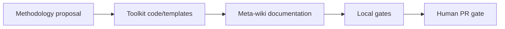

# Wiki methodology maintenance

## Purpose

Keep the reusable open-source methodology, deterministic code, templates,
skills and documentation aligned before downstream private repos migrate.

## Flow

## Cadence and Gates

| Item | Value |
| --- | --- |
| Cadence | Event-driven by methodology or source-model changes. |
| Owner | Wiki owner and repo agent. |
| Entry criteria | A proposal or source change affects the reusable kit. |
| Exit criteria | Code, docs, templates, skills and gates align in the open-source repo. |

## Inputs and Outputs

| Input channel | Output artifact | Target page |
| --- | --- | --- |
| [Methodology reference input](../input-channels/methodology-reference.md) | Updated root/input-stage/source model | [Wiki Viva Kit](../wiki-viva-kit.md) |

## Roles and Responsibilities

| Role | Responsibility |
| --- | --- |
| Repo agent | Implements deterministic core and updates docs. |
| Wiki owner | Reviews conceptual diff and approves merge. |

## Related

- Root entity: [Wiki Viva Kit](../wiki-viva-kit.md)
- Input stage: [input-stage.md](../input-stage.md)
