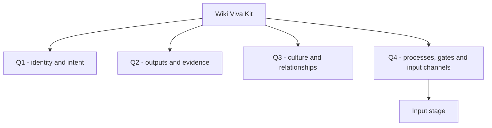

# Wiki Viva Kit

Updated on: 2026-07-11.

This is the root entity of the open-source Wiki Viva Kit itself. It is the
semantic entry page for the product/method, while [memories/index.md](../index.md)
remains the technical root MOC.

## Identity and Scope

| Field | Value |
| --- | --- |
| Root type | `product` |
| Purpose | Reusable Markdown/Git living operational wiki toolkit. |
| Boundary | Open-source method, templates, gates, deterministic Python and agent playbooks; no private downstream content. |
| Primary contexts | `system`, `example` |

## Integral Quadrant Map

| Quadrant | What belongs here | Canonical pages | Input channels |
| --- | --- | --- | --- |
| Q1 - Identity and intent, upper-left | Declared method identity, design intent, tradeoffs, scope and operating stance | This root page, [architecture.md](wiki/architecture.md), [pr-governance.md](wiki/pr-governance.md) | Methodology reference |
| Q2 - Outputs and evidence, upper-right | Observable outputs of the kit as a product: code, templates, tests, releases, docs and generated artifacts | [command-reference.md](wiki/command-reference.md), [source-registry.md](source-registry.md), [docs/README.md](../../docs/README.md) | Methodology reference |
| Q3 - Culture and relations, lower-left | Shared review culture, lived roles, expectations, agent/human collaboration norms and perspective lenses | [git-approvals.md](git-approvals.md), [perspectives/index.md](perspectives/index.md) | Methodology reference |
| Q4 - Systems and governance, lower-right | Coordination systems: deterministic pipelines, source processes, input stage, gates, tools, governance rules and publication boundary | [input-stage.md](input-stage.md), [ingestion-flow.md](wiki/ingestion-flow.md), [gates-and-audit.md](wiki/gates-and-audit.md) | Methodology reference |

Boundary rule: apply the quadrant to the root holon and the fact being
extracted. Code, templates and docs are Q2 when treated as observable outputs of
this product. The same repo's CI, gates, source configs, channels and automation
workflows are Q4 because they coordinate the system. Roles are Q3 when they
preserve shared expectations or collaboration culture; formal governance rules
and assignments are Q4.

Source basis: the position and axis names follow Integral Life's
[Four Quadrants](https://integrallife.com/four-quadrants/) and
[The Four Quadrants: A Guided Tour](https://integrallife.com/the-four-quadrants-a-guided-tour/);
the broader AQAL container follows
[The Five Elements of AQAL](https://integrallife.com/five-elements-aqal/).
The kit-specific boundary review is documented in the
[AQAL quadrant alignment check](../../docs/references/reports/aqal-quadrant-alignment-2026-06-25.md).

Q0 is not a fifth content category. It is the active root/center that relates
the four quadrants. Source pages, source catalogs, source registries, logs,
ingestion events, dashboards and other generated traces are Q2 when they serve
as observable evidence of the wiki's work. Operational rules, input channels,
source configs, processes, gates and governance surfaces are Q4 because they
coordinate the system.

## People, Roles and Responsibilities

| Person or group | Role | Responsibility | Source |
| --- | --- | --- | --- |
| Wiki owner | Maintainer/reviewer | Reviews conceptual changes before `main` becomes approved memory. | [git-approvals.md](git-approvals.md) |
| Repo agent | Operator | Runs deterministic gates, prepares proposals and records delegated deep reads. | [AGENTS.md](../../AGENTS.md) |

## Artifacts and Observable Outputs

| Artifact/output | Type | Owner | Source/config |
| --- | --- | --- | --- |
| [wiki_core](../../wiki_core/__init__.py) | Python package | Toolkit | Methodology source |
| [scripts](../../scripts/wiki_input_stage.py) | CLI surface | Toolkit | Methodology source |
| [docs/references/templates/wiki](../../docs/references/templates/wiki/page-contract.md) | Templates | Toolkit | Methodology source |
| [memories/system/wiki](wiki/index.md) | Meta-wiki docs | Toolkit | Methodology source |

## Channels and Input Sources

| Channel | Type | Status | Source page | Config | Quadrants |
| --- | --- | --- | --- | --- | --- |
| [Methodology reference](input-channels/methodology-reference.md) | `document` | `configured` | [Living wiki methodology](../sources/wiki-viva-methodology-v5.md) | [config](../sources/config/wiki-viva-methodology-v5.md) | Q1, Q2, Q3, Q4 |

## Processes and Cadences

| Process | Cadence | Inputs | Outputs | Gate |
| --- | --- | --- | --- | --- |
| [Wiki methodology maintenance](processes/wiki-methodology-maintenance.md) | Event-driven | Methodology docs, release notes, template changes | Updated toolkit/docs/tests | PR + local gates |

## Projects and Initiatives

| Project/initiative | Objective | State | Inputs |
| --- | --- | --- | --- |
| Integral root entity + input stage | Make initial wiki setup and source routing root-driven. | Implementing in open-source kit first. | This root page and [input-stage.md](input-stage.md) |
| V8 release truth, temporal world and experience packs | Stabilize the unified living world, make time first-class and support complete installable use-case experiences. | Review-blocked; execute P0/P1 stabilization before extension work. | [Evidence-backed execution plan](../../docs/references/proposals/wiki-viva-release-truth-temporal-world-experience-packs-plan-2026-07-11.md) |

## Perspective Bundle

| Perspective | Quadrant | Required? | Target pages |
| --- | --- | --- | --- |
| [Identity and intent](perspectives/identity-intent.md) | Q1 | yes | Root entity, architecture, decisions, claims |
| [Outputs and evidence](perspectives/artifacts-evidence.md) | Q2 | yes | Source, artifact, project and release pages |
| [Culture and relations](perspectives/roles-relationships.md) | Q3 | yes | Person, role, responsibility and governance pages when they preserve shared meaning, lived expectations or relationship context |
| [Systems and governance](perspectives/systems-processes.md) | Q4 | yes | Process, source config, operation and gate pages |
| [Privacy and publication](perspectives/privacy-publication.md) | Boundary | optional | Public boundary, release and publication pages |

## Source Ingestion Map

| Source | Input channel | Required perspectives | Target pages | Refresh |
| --- | --- | --- | --- | --- |
| [Living wiki methodology](../sources/wiki-viva-methodology-v5.md) | [Methodology reference](input-channels/methodology-reference.md) | Q1/Q2/Q3/Q4 core bundle | Root entity, meta-wiki, command reference, gates | Event-driven |

## Privacy and Publication Boundaries

- The open-source kit must stay free of private downstream facts and credentials.
- Examples and fixtures use synthetic data only.
- Run `wiki_audit.py --check --public-export` before publication-sensitive docs.

## Open Questions and Blocked Sources

| Item | Status | Owner | Next step |
| --- | --- | --- | --- |
| Downstream personal migration | Pending | Wiki owner + repo agent | Start only after the open-source implementation and docs are green. |

## Related Pages

- Root MOC: [memories/index.md](../index.md)
- Input stage: [input-stage.md](input-stage.md)
- Source registry: [source-registry.md](source-registry.md)
