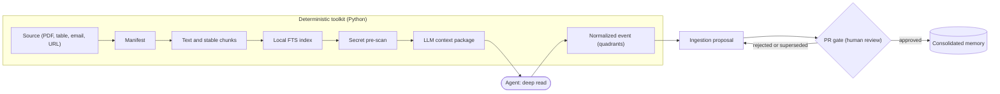

# Living wiki architecture

Updated on: 2026-06-09.

This page is the overview of the **living wiki**: what the system is, the principles
that sustain it, and the map of the modules. For the step-by-step ingestion, see
[ingestion-flow.md](ingestion-flow.md); for the honesty gates, see
[gates-and-audit.md](gates-and-audit.md); for the list of CLIs, see
[command-reference.md](command-reference.md).

## What the system is

The living wiki is a Markdown/Git kit for operating a **living operational** wiki: a
body of pages that ingests external sources (PDFs, spreadsheets, emails, CSVs, URLs),
compiles those sources into consolidated knowledge, passes through a human gate via
Pull Request, and maintains health indicators (freshness, coverage, karma) over
time. The kit has two complementary halves:

- A deterministic Python package, [wiki_core](../../../wiki_core/ingest/pipeline.py),
  that does everything that can be done in a reproducible and auditable way: manifests,
  extraction, chunking, index, secret/PII detection, the gate state machine,
  karma, and assembly of the context packages.
- A layer of CLIs in [scripts](../../../scripts/wiki_audit.py) (all prefixed with
  `wiki_*`) that exposes each module of [wiki_core](../../../wiki_core/ingest/pipeline.py)
  on the command line, plus the auditor and the cockpit compiler.

The deep read (the LLM pass that extracts meaning from each excerpt) does **not**
live in Python: it is delegated to the AGENT that runs the repo. The contract of this division
is in [operational-wiki-contract.md](../operational-wiki-contract.md) and
[AGENTS.md](../../../AGENTS.md).

The flowchart below is the canonical picture of the system: a source flows through
the deterministic pipeline (manifest, chunks, index, pre-scan) into a context
package; the agent performs the deep read; the proposal then passes the PR gate
before it becomes consolidated memory. The deterministic toolkit and the agent are
two distinct actors, joined at the context package and the cache.



Read the diagram alongside the prose links: the toolkit lives in
[wiki_core](../../../wiki_core/ingest/pipeline.py) and [scripts](../../../scripts/wiki_audit.py),
the secret pre-scan is in [the detectors](../../../wiki_core/detectors/__init__.py),
the context package is built by [context_pass.py](../../../wiki_core/llm/context_pass.py),
and the gate is the GitHub PR described in [pr-governance.md](pr-governance.md).

## Principles

- **Markdown/Git as substrate.** All canonical memory is Markdown versioned in
  Git. There is no real database nor external service: the wiki is the repository.
  The portable configuration lives in [wiki.config.yaml](../../../wiki.config.yaml), read
  by [wiki_core/config.py](../../../wiki_core/config.py) with a proprietary and
  minimal YAML parser (no runtime dependency to load config).
- **Ingestion as compilation.** A source does not become memory directly. It passes
  through a deterministic pipeline (manifest -> text -> chunks -> index -> pre-scan
  -> context package -> event), exactly as source code is compiled into a
  binary. The intermediate artifacts are derived and live outside Git (in
  [data/derived/wiki/](../../../data/derived/wiki/)); only the consolidated result is promoted. The orchestrator is
  [wiki_core/ingest/pipeline.py](../../../wiki_core/ingest/pipeline.py); details in
  [ingestion-flow.md](ingestion-flow.md).
- **Code first, LLM via agent.** Everything that can be deterministic is testable
  Python; the intelligence (the deep read of the chunks, the synthesis of insight) is
  delegated to the agent. The Python assembles the context PACKAGE and the agent writes the
  RESULT into a cache versioned by key; there is no embedded LLM client. See
  [wiki_core/llm/context_pass.py](../../../wiki_core/llm/context_pass.py).
- **Per-page privacy, on two axes.** PII (CPF, CNPJ, card, email) is
  WELCOME in private pages of this personal repo and never blocks; it merely
  labels sensitivity and governs the export boundary. Access secrets (keys,
  tokens, PEM) are ALWAYS blocked, in any file. This separation is
  encoded in the detectors and in the config (`private_sensitive_allowed`). See
  [privacy.md](privacy.md) and [gates-and-audit.md](gates-and-audit.md).
- **Quadrants (integral read).** Each chunk read by the agent must fill the
  four quadrants (`interior_individual`, `exterior_individual`,
  `interior_collective`, `exterior_collective`) — an integral read that avoids the
  bias of only capturing external facts. Filling all four is mandatory and
  validated; see `validate_result` in
  [wiki_core/llm/context_pass.py](../../../wiki_core/llm/context_pass.py).
- **Operational cockpit.** The living state (what to resume, what is stale, what is
  pending) is compiled into a daily panel from the wiki and the Git state, in
  [operations.md](../../operations.md). See [daily-operation.md](daily-operation.md).
- **Karma as a byproduct, with no leaderboard.** Each useful action (ingesting a source,
  fixing a metadata field, closing an action) generates an append-only event that feeds a karma
  of 8 dimensions and the context vitality. There is no person-versus-person ranking.
  See [karma-gamification.md](karma-gamification.md).
- **Perceptive layer.** Beyond the factual consolidated body, the system has an
  Information -> Insight cycle: journal/relations map and a job that gathers signals already
  existing and opens an insight PROPOSAL (status `candidato`, i.e. candidate) for the human gate.
  See [perceptual-layer-insight.md](perceptual-layer-insight.md).
- **Human gate by PR.** `main` is the approved wiki; `wiki/*` branches are living
  proposals; each PR shows sources, changed pages, privacy risks, validations
  and pending items. See [pr-governance.md](pr-governance.md) and
  [git-approvals.md](../git-approvals.md).

## Map of the wiki_core modules

The package [wiki_core/__init__.py](../../../wiki_core/__init__.py) exports the minimal
core (`WikiConfig`, `WikiPaths`, `load_config`); the rest is imported by the
modules and by the scripts. Each package has a single responsibility and is exposed by
at least one `wiki_*` CLI. The table summarizes the module map; the subsections
below carry the detail and the links to each module.

| Module | Responsibility | Deterministic? |
| --- | --- | --- |
| config + paths | Portable per-repo config, derived-path resolution, deterministic ids (`sha256`, `slugify`) | Yes |
| source_manifest | Classify the source and compute a stable `source_id` + JSON manifest | Yes |
| extractors | Turn each source type into text + structured units | Yes |
| chunking | Split text into stable `TextChunk`s with a per-excerpt hash | Yes |
| index | Build/search the SQLite FTS index over chunks | Yes |
| detectors | Secrets (always blocked), PII (informational), entities | Yes |
| llm | Assemble the context package; validate and cache the agent's result | Yes (package only) |
| ingest | Chain the deterministic steps end to end into one `run` | Yes |
| gate | Proposal state machine, history, rebase/supersede | Yes |
| score | 8-dimension karma, vitality, append-only events | Yes |
| insight | Gather signals and emit a skeleton insight proposal | Yes (signals only) |
| deep read | The interpretive read of each chunk | No (delegated to the agent) |

### config and paths (portable foundation)

- [wiki_core/config.py](../../../wiki_core/config.py): defines `WikiConfig` (a frozen
  dataclass) and `load_config`, which reads [wiki.config.yaml](../../../wiki.config.yaml) with
  a proprietary and simple YAML parser. It loads `repo_id`, `owner_label`, the list of
  `contexts` (each context must have a hub memories/<ctx>/index.md), the derived
  `paths`, the `approval` policy, and the `llm` parameters (chunk size,
  prompt versions). It makes the config portable per repo, with no hardcoding.
- [wiki_core/paths.py](../../../wiki_core/paths.py): defines `WikiPaths`, which resolves
  all derived directories from the root and the config — `source-manifests`,
  `source-text`, `chunks`, `indexes`, `extraction-events`, `llm-cache`, `coverage` —
  and the helper `ensure()` that creates them. It is the single source of truth about where each
  derived artifact lives.
- [wiki_core/ids.py](../../../wiki_core/ids.py): deterministic utilities
  reused across all the rest — `sha256_file`, `sha256_text` and `slugify`.

### source_manifest (pipeline entry)

[wiki_core/source_manifest.py](../../../wiki_core/source_manifest.py) classifies the
source (URL, PDF, markdown, table, spreadsheet, document, email), computes a
stable `source_id` from the hash, and assembles a JSON manifest with hash, size,
mime, capture date, risk level and privacy policy. For directories, it
generates a hash of the recursive listing. It is the first step of any ingestion.
Exposed by [wiki_extract_source_manifest.py](../../../scripts/wiki_extract_source_manifest.py).

### extractors (source -> text)

[wiki_core/extractors/text.py](../../../wiki_core/extractors/text.py) transforms each
source type into text + structured units: PDF via `pdftotext`, CSV/TSV line by
line, XLSX via openpyxl, DOCX via python-docx, email (.eml/.mbox) with headers and
body. It reconciles the generic type with the actual extension so as not to dump raw bytes
from binaries into the index, and returns `warnings` when a system dependency is missing.
Exposed by [wiki_extract_text.py](../../../scripts/wiki_extract_text.py).

### chunking (text -> stable excerpts)

[wiki_core/chunking.py](../../../wiki_core/chunking.py) splits the text into `TextChunk`s
of a configurable target size (default ~1200 tokens, with overlap), each with a
deterministic `chunk_id` (derived from the `source_id`, ordinal and hash of the excerpt). The
stability of the per-chunk hash is what enables per-excerpt LLM pass caching.
Also exposed by [wiki_extract_text.py](../../../scripts/wiki_extract_text.py).

### index (local search)

[wiki_core/index/sqlite.py](../../../wiki_core/index/sqlite.py) builds an index
SQLite with FTS5 over the chunks (`build_index`), offers `check_index` for
statistics, and `search` by BM25 relevance with `sanitize_fts_query` (which escapes
tokens so as not to break the FTS5 MATCH). It is the retrieval layer used by the
ingestion and by the insight job. Exposed by
[wiki_build_index.py](../../../scripts/wiki_build_index.py).

### detectors (secrets, PII, entities)

[wiki_core/detectors/__init__.py](../../../wiki_core/detectors/__init__.py) centralizes
detection so that the auditor imports a single surface instead of ad-hoc
regexes. Three detectors compose `scan_text`/`scan_file`:

- [wiki_core/detectors/secrets.py](../../../wiki_core/detectors/secrets.py): high-confidence
  secrets (AWS/Google keys, Slack/GitHub tokens, JWT, PEM, bearer) plus
  a generic `name=value` rule that only fires when the value looks random
  (high Shannon entropy). These are ALWAYS BLOCKED.
- [wiki_core/detectors/sensitive_terms.py](../../../wiki_core/detectors/sensitive_terms.py):
  PII (CPF, CNPJ, Luhn-validated card, IBAN), with versions with and without punctuation
  validated by check digit to reduce false positives. Informational, does not
  block on a private page.
- [wiki_core/detectors/entities.py](../../../wiki_core/detectors/entities.py):
  low-severity entities (emails), only to label personal data at the export
  boundary.

Every `Finding` carries an already-redacted `excerpt` — never the raw secret. The detectors
are consumed by the pipeline, by the insight job and by the
[wiki_audit.py](../../../scripts/wiki_audit.py).

### llm (delegated context pass)

[wiki_core/llm/context_pass.py](../../../wiki_core/llm/context_pass.py) assembles the context
PACKAGE (`build_context_request`) that the agent executes: it includes the text of each
chunk, the versioned prompt, the output schema (`RESULT_REQUIRED_KEYS`, mandatory
quadrants) and the per-chunk cache status. `validate_result` requires the four
quadrants filled and the sensitivity field; `write_result` only writes if the
result passes. [wiki_core/llm/cache.py](../../../wiki_core/llm/cache.py) defines the
deterministic `cache_key` (hash of source + chunk + prompt/schema version + model
profile), guaranteeing idempotence. `source_pending` counts how many chunks still have
no result — that number feeds the gate. Exposed by
[wiki_llm_context_pass.py](../../../scripts/wiki_llm_context_pass.py) and inspected
by [wiki_cache_inspect.py](../../../scripts/wiki_cache_inspect.py).

### ingest (end-to-end orchestrator)

[wiki_core/ingest/pipeline.py](../../../wiki_core/ingest/pipeline.py) chains the
deterministic steps in a single `run` call: manifest -> text + chunks ->
index -> secret/PII pre-scan -> LLM context package (emits the
`-llm-context-request.json` that the gate watches) -> score event
`ingestar_fonte_valida`. It does NOT write canonical memory nor call a model: it returns an
`IngestResult` with `gate_state=created` and the LLM pass status derived from the
real chunks. It supports dry-run (`write=False`). Exposed by
[wiki_ingest.py](../../../scripts/wiki_ingest.py); the corresponding private proposal
generator is [wiki_new_ingest.py](../../../scripts/wiki_new_ingest.py). See
[ingestion-flow.md](ingestion-flow.md).

### gate (proposal state machine)

[wiki_core/gate/state_machine.py](../../../wiki_core/gate/state_machine.py) defines the
life cycle of a proposal as a state machine (`created`, `compiling`,
`ready_for_review`, `needs_human_gate`, `approved`, `published`, `superseded`,
`rejected`, `archived`) with explicit valid transitions. It reads and writes the
`gate_state` in the frontmatter (auditing each transition in `gate_history`) and implements
`rebase_pending`: when several proposals target the same page/`rebase_key`, it keeps the
most recent one and supersedes the rest. The proposal's identity hash is that of the body,
not the frontmatter, so that changing state does not change the identity of the content. Exposed
by [wiki_gate.py](../../../scripts/wiki_gate.py); see
[pr-governance.md](pr-governance.md).

### score (karma and vitality)

[wiki_core/score/karma.py](../../../wiki_core/score/karma.py) implements the
gamification layer: 8 dimensions, event types with base points, anti-gaming
multipliers (quality, collaboration, rarity, impact, soft decay by
half-life), qualitative badges and journey levels. The log is append-only
(`record_event` writes one JSON line per event, with idempotence by `dedup_key`);
`compute_karma` aggregates by dimension and context and `context_vitality` produces an index
0-100 of context health — with no global ranking. Exposed by
[wiki_score.py](../../../scripts/wiki_score.py); see
[karma-gamification.md](karma-gamification.md).

### insight (Information -> Insight)

[wiki_core/insight/job.py](../../../wiki_core/insight/job.py) closes the
perceptive cycle deterministically: it gathers signals already existing (score events,
indexed chunks, memory pages that mention a theme), assembles a context PACKAGE
and emits a skeleton insight PROPOSAL with `status_epistemologico:
candidato` (candidate). It does not write canonical memory and does not call a model — the synthesis is the agent's,
the promotion is by PR. Exposed by
[wiki_insight_job.py](../../../scripts/wiki_insight_job.py); see
[perceptual-layer-insight.md](perceptual-layer-insight.md).

## Scripts that do not map 1:1 to a package

Some CLIs orchestrate several modules or implement their own policy:

- [wiki_audit.py](../../../scripts/wiki_audit.py): the auditor of the Markdown/Git contract
  (links, frontmatter, secrets/PII, freshness, quadrants, LLM pass). It imports
  `detectors`, the config and the gate states. Detailed in
  [gates-and-audit.md](gates-and-audit.md).
- [wiki_check_methodology_coverage.py](../../../scripts/wiki_check_methodology_coverage.py):
  checks the presence AND content of the v5 methodology; cross-references with
  [methodology-coverage-v5.md](../methodology-coverage-v5.md).
- [wiki_pr_summary.py](../../../scripts/wiki_pr_summary.py): summarizes the diff of the current PR
  (sources, pages, risks) from the Git state.
- [wiki_operation_compile.py](../../../scripts/wiki_operation_compile.py): compiles the
  daily cockpit [operations.md](../../operations.md) from the wiki and Git.

The complete invocation reference for each CLI is in
[command-reference.md](command-reference.md). Before opening or finalizing a wiki
PR, the basic routine is:

```sh
python3 scripts/wiki_audit.py --check
python3 scripts/wiki_pr_summary.py
git diff --check
```
