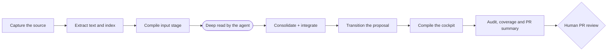

# Command reference

Last updated: 2026-07-11.

This page catalogs the deterministic CLIs of the living wiki system. They all live in [scripts/](../../../scripts/README.md) with the `wiki_` prefix, are pure Python (with no external dependency beyond PyYAML), call no language model and read the repo profile from [wiki.config.yaml](../../../wiki.config.yaml) via [wiki_core/config.py](../../../wiki_core/config.py). The deep reading (LLM) is always delegated to the agent that runs the repo, as per [ingestion-process.md](../ingestion-process.md). The gates and the audit are detailed on the sister page [gates-and-audit.md](gates-and-audit.md), and the PR approval cycle in [git-approvals.md](../git-approvals.md).

General convention: most accept `--dry-run` (computes without writing) and `--check` (exits with a code != 0 when something is pending/invalid, for use in CI). Output paths are printed relative to the repo root.

## Quick map

| CLI | Role | When to use |
| --- | --- | --- |
| [wiki_ingest.py](../../../scripts/wiki_ingest.py) | Orchestrates ingestion end to end | Ingest a source from scratch in a single command |
| [wiki_new.py](../../../scripts/wiki_new.py) | Creates a typed page from the registry template | Start a page from `wiki.page-types.yaml` instead of a blank file |
| [wiki_migration_inventory.py](../../../scripts/wiki_migration_inventory.py) | Inventories legacy pages and suggests v6.2 frontmatter | Plan a migration before manually editing existing memory pages |
| [wiki_migrate_templates.py](../../../scripts/wiki_migrate_templates.py) | Assisted source-entity + template migration (dry-run first) | Bring legacy source pages to the platform/locator/owner + recipe contract, and report pages missing pinned template fields |
| [wiki_new_ingest.py](../../../scripts/wiki_new_ingest.py) | Creates the ingestion proposal (Markdown) | Open the private proposal that enters the gate |
| [wiki_extract_source_manifest.py](../../../scripts/wiki_extract_source_manifest.py) | Generates the deterministic source manifest | Record the identity/hash of an isolated source |
| [wiki_extract_text.py](../../../scripts/wiki_extract_text.py) | Extracts text and stable chunks | Prepare the chunks before the LLM pass |
| [wiki_build_index.py](../../../scripts/wiki_build_index.py) | Builds/inspects the SQLite index | (Re)index chunks for FTS search |
| [wiki_llm_context_pass.py](../../../scripts/wiki_llm_context_pass.py) | Assembles the context package and records the result | Emit/check the LLM pass delegated to the agent |
| [wiki_consolidate.py](../../../scripts/wiki_consolidate.py) | Consolidates the deep read into the wiki | Generate the event from the cache + integration packet; --check in CI |
| [wiki_page_graph.py](../../../scripts/wiki_page_graph.py) | Builds/checks the page graph and impact set | Validate orphans, reachability, wanted pages and same-PR impact |
| [wiki_quality_report.py](../../../scripts/wiki_quality_report.py) | Reports quality and cost telemetry | Measure density, hierarchy-parent gaps, repetition, consolidation gaps and cache/token use without a hard budget gate |
| [wiki_cache_inspect.py](../../../scripts/wiki_cache_inspect.py) | Inspects the LLM cache and derived coverage | Diagnose the state of the derived artifacts |
| [wiki_export_batch.py](../../../scripts/wiki_export_batch.py) | Exports pending requests in the Batches API format | Run the deep read in batch (-50%), no LLM client |
| [wiki_gc.py](../../../scripts/wiki_gc.py) | Garbage-collects orphan derived artifacts | Remove manifest/text/chunks of old source versions and prune the index |
| [wiki_archive.py](../../../scripts/wiki_archive.py) | Archives resolved proposals (and events) into ingestion/archive/ | Take immutable history out of the flat, re-audited dir |
| [wiki_drive_publish.py](../../../scripts/wiki_drive_publish.py) | Publishes non-versioned artifacts to Drive + manifest | Give a stable (Drive) link to what git ignores |
| [wiki_toolkit_drift.py](../../../scripts/wiki_toolkit_drift.py) | Detects toolkit drift between branches | Find fixes not yet backported between main and opensource |
| [wiki_upgrade_inventory.py](../../../scripts/wiki_upgrade_inventory.py) | Validates the public-safe v8 consumer inventory | Review pilot/wave/paused status before downstream preflight |
| [wiki_upgrade_preflight.py](../../../scripts/wiki_upgrade_preflight.py) | Compiles a read-only downstream upgrade preflight | Prove release pin, branch, gates, drift, snapshot, overrides and privacy before import |
| [wiki_upgrade_report.py](../../../scripts/wiki_upgrade_report.py) | Validates evidence and compiles v8 migration reports | Close a downstream upgrade with SHAs, allowlisted files, gates, QA and rollback |
| [wiki_adapter_manifest.py](../../../scripts/wiki_adapter_manifest.py) | Builds or verifies the downstream adapter identity manifest | Bind a private consumer's explicit adapter files to tracked, no-follow hashes without importing private content into the kit |
| [wiki_pack.py](../../../scripts/wiki_pack.py) | Operates versioned experience packs through a review-first lifecycle | Inspect/preview/dry-run/install/validate/upgrade/disable/remove a declarative use-case experience |
| [wiki_gate.py](../../../scripts/wiki_gate.py) | Living gate: lists, transitions, rebases | Move proposals between states and supersede old ones |
| [wiki_score.py](../../../scripts/wiki_score.py) | Operational karma and vitality | Record/view append-only scoring |
| [wiki_insight_job.py](../../../scripts/wiki_insight_job.py) | Closes the Information -> Insight cycle | Gather signals about a theme for an insight proposal |
| [wiki_okf_export.py](../../../scripts/wiki_okf_export.py) | Exports an Open Knowledge Format bundle | Share or test the wiki through OKF v0.1 without weakening internal contracts |
| [wiki_okf_check.py](../../../scripts/wiki_okf_check.py) | Checks OKF v0.1 conformance | Validate an exported or external OKF bundle |
| [wiki_okf_import.py](../../../scripts/wiki_okf_import.py) | Previews an OKF import | Inspect how an OKF bundle would map into Wiki Viva pages |
| [wiki_okf_visualize.py](../../../scripts/wiki_okf_visualize.py) | Generates an HTML OKF viewer | Browse a bundle as concepts, links and backlinks |
| [wiki_operation_compile.py](../../../scripts/wiki_operation_compile.py) | Compiles the daily cockpit | (Re)generate [memories/operations.md](../../operations.md) |
| [wiki_operational_pass.py](../../../scripts/wiki_operational_pass.py) | Compiles sources, actions and next steps by context | (Re)generate [operational-pass.md](../operational-pass.md) before a consolidation round |
| [wiki_source_registry.py](../../../scripts/wiki_source_registry.py) | Generates the canonical source registry | (Re)generate [source-registry.md](../source-registry.md) with state/date/next refresh |
| [wiki_input_stage.py](../../../scripts/wiki_input_stage.py) | Generates the root/channel/source input stage | (Re)generate [input-stage.md](../input-stage.md) before source routing or setup changes |
| [wiki_quadrant_contract.py](../../../scripts/wiki_quadrant_contract.py) | Prints the canonical Wilber/AQAL quadrant contract | Give external consumers the authoritative `q1/q2/q3/q4` mapping without scraping prose |
| [wiki_quadrant_projection_report.py](../../../scripts/wiki_quadrant_projection_report.py) | Inventories anchor-relative quadrant projections | Review nested centers, `parent_projection`, `subject_ref` and ambiguous/Q0-heavy scopes before migrating pages |
| [wiki_audit.py](../../../scripts/wiki_audit.py) | Audits the wiki contract | Validate contract/links/secrets at commit and in CI |
| [wiki_check_methodology_coverage.py](../../../scripts/wiki_check_methodology_coverage.py) | Checks the presence AND content of methodology v5 | Ensure the methodology is in fact implemented |
| [wiki_pr_summary.py](../../../scripts/wiki_pr_summary.py) | Summarizes the PR diff by context/entity | Generate the PR review summary |
| [wiki_git_subject.py](../../../scripts/wiki_git_subject.py) | Emits a stable path-safe Git/worktree fingerprint | Bind Python and Node release evidence to the same exact staged, unstaged, untracked and submodule state |
| [wiki_release_receipt.py](../../../scripts/wiki_release_receipt.py) | Binds release evidence to an exact Git/worktree subject | Generate/check public + downstream closure hashes; v1 blocks local E5 until external signed authority exists |
| [wiki_web_snapshot.py](../../../scripts/wiki_web_snapshot.py) | Generates the web cockpit snapshot | Produce JSON read models for static/local cockpit execution |
| [wiki_web_deploy_bundle.py](../../../scripts/wiki_web_deploy_bundle.py) | Prepares web cockpit deployment inputs | Write runtime config, snapshot JSON and deploy proof for one implementation |
| [wiki_web_server.py](../../../scripts/wiki_web_server.py) | Runs the local web cockpit operator API | Serve snapshots and allowlisted actions on localhost |
| [wiki_build_demo.py](../../../scripts/wiki_build_demo.py) | Builds the cockpit demo (fixture-wiki → sample-snapshot) | Regenerate the reproducible demo MOC that exercises templates, blocks, lenses and the relations module |

## Ingestion pipeline

### [wiki_ingest.py](../../../scripts/wiki_ingest.py) - end-to-end orchestrator

Chains: manifest -> text/chunks -> index -> pre-scan (secrets BLOCK; PII is informational and welcome on a private page) -> LLM context package (emits the `-llm-context-request.json` that the auditor's gate watches) -> score-event. It replaces the manual step-by-step execution. The LLM pass itself remains delegated to the agent.

- `--source` (required): path or URL of the source.
- `--context` (required): target context (e.g.: `system`).
- `--dry-run`: computes without writing artifacts.
- `--no-score`: does not record the final score-event.
- `--actor`: id of whoever ran it (for the score).

Returns exit `2` if the pre-triage finds a SECRET in the source (block at the origin).

```sh
python3 scripts/wiki_ingest.py --source data/raw/example.pdf --context system
python3 scripts/wiki_ingest.py --source X.md --context system --dry-run
```

### [wiki_new_ingest.py](../../../scripts/wiki_new_ingest.py) - creates the ingestion proposal

Generates the Markdown file of the private proposal (in [memories/system/ingestion/](../../../memories/system/ingestion/README.md)) with frontmatter, quadrants, privacy risks and checklist. It classifies the source (raw/memory/reference/artifact), does a pre-triage (secrets block; PII is only reported) and, on writing, applies a rebase to supersede pending proposals of the same logical target. The context -> pages/entities map comes from `wiki.targets.yaml` (per-repo profile), keeping the script generic.

- `--source` (required): path or URL.
- `--context` (required): restricted to the contexts declared in the profile.
- `--status` (default `draft`): initial epistemological status.
- `--date` (default today): ISO date used in the `page_id` and in the file name.
- `--dry-run`: prints the proposal without writing (exit `2` if there is a secret).

```sh
python3 scripts/wiki_new_ingest.py --source data/raw/example.pdf --context system
python3 scripts/wiki_new_ingest.py --source X.md --context system --dry-run
```

### [wiki_new.py](../../../scripts/wiki_new.py) - creates a typed page

Instantiates a page from [wiki.page-types.yaml](../../../wiki.page-types.yaml)
and the resolved base template plus optional overlay. It refuses unknown types,
adds template provenance (`template_id`, `template_version`, `template_ref` and
optional `template_overlay`) and writes to the first allowed directory unless
`--output` is provided.

- `--type` (required): page type declared in the registry.
- `--title` (required): title used for the slug and generated `page_id`.
- `--context`: context slug (default from config).
- `--output`: explicit repo-relative destination.
- `--dry-run`: print without writing.

```sh
python3 scripts/wiki_new.py --type perspective --title "Technical perspective" --context system --dry-run
python3 scripts/wiki_new.py --type perspective --title "Publication perspective" --context system
```

### [wiki_migration_inventory.py](../../../scripts/wiki_migration_inventory.py) - migration inventory

Scans the configured memory root for Markdown pages without frontmatter and
prints conservative v6.2 metadata suggestions. It never edits pages. Use it when
adopting v6.2 in an existing wiki before adding frontmatter manually or via a
reviewed patch. The migration guide is
[wiki-viva-v6.2-migration.md](../../../docs/references/guides/wiki-viva-v6.2-migration.md).

- `--format markdown|json`: output format, default `markdown`.
- `--show-frontmatter`: also print suggested frontmatter blocks.

```sh
python3 scripts/wiki_migration_inventory.py
python3 scripts/wiki_migration_inventory.py --show-frontmatter
python3 scripts/wiki_migration_inventory.py --format json
```

### v8 downstream upgrade package

[wiki_upgrade_inventory.py](../../../scripts/wiki_upgrade_inventory.py),
[wiki_upgrade_preflight.py](../../../scripts/wiki_upgrade_preflight.py) and
[wiki_upgrade_report.py](../../../scripts/wiki_upgrade_report.py) implement the
read-only productized migration flow documented in the
[v8 downstream runbook](../../../docs/references/guides/wiki-viva-v8-downstream-upgrade.md).
They never copy toolkit files. The package allowlist/blocklist remains the
review boundary.

```sh
python3 scripts/wiki_upgrade_inventory.py --check
python3 scripts/wiki_upgrade_preflight.py \
  --consumer-root /path/to/consumer \
  --consumer-id <inventory-id> \
  --checked-on 2026-07-09 \
  --gate-evidence /path/to/gate-evidence.json \
  --check
python3 scripts/wiki_upgrade_report.py --template > wiki-v8-migration-evidence.yaml
python3 scripts/wiki_upgrade_report.py \
  --evidence wiki-v8-migration-evidence.yaml \
  --consumer-root /path/to/consumer \
  --json-out wiki-v8-migration-report.json \
  --markdown-out wiki-v8-migration-report.md \
  --check
```

Add `--redact` to preflight evidence that may leave a private repo and
`--public-export` to a migration report only after route, center, paths and
screenshots are public-safe. Both commands fail while the public release SHA is
unpinned or required evidence is incomplete.

### [wiki_adapter_manifest.py](../../../scripts/wiki_adapter_manifest.py) - downstream adapter identity

Builds the tracked `wiki.adapter-manifest.json` only from repository-relative
adapter files named explicitly with repeated `--file` arguments. The writer is
POSIX no-follow, atomic and fsynced; `check` requires the manifest and every
listed file to be tracked and clean, then recomputes their hashes. The manifest
is consumer-owned release evidence and is intentionally blocked from the
portable toolkit import surface.

```sh
python3 scripts/wiki_adapter_manifest.py --root /path/to/consumer build \
  --file wiki_core/web/private_adapter.py \
  --file tests/test_private_adapter.py
python3 scripts/wiki_adapter_manifest.py --root /path/to/consumer check
```

### [wiki_pack.py](../../../scripts/wiki_pack.py) - experience-pack lifecycle

Validates the versioned pack registry and manifest before any mutation. It
blocks executable or remote pack content, secrets and public-boundary PII,
checks dependencies/capability/slot conflicts, pins installed bytes in
`wiki.packs.lock.yaml` and emits a deterministic conceptual diff plus receipt.
Real mutations are accepted only from an already checked-out `wiki/*` branch.
Disable/remove never delete user-authored wiki pages.

```sh
python3 scripts/wiki_pack.py list
python3 scripts/wiki_pack.py inspect study-research
python3 scripts/wiki_pack.py preview study-research
python3 scripts/wiki_pack.py install study-research --dry-run
python3 scripts/wiki_pack.py validate study-research
python3 scripts/wiki_pack.py disable study-research --dry-run
python3 scripts/wiki_pack.py remove study-research --dry-run
```

The manifest, registry and lock schemas plus the authoring/compatibility policy
are documented in the
[experience-pack authoring guide](../../../docs/references/guides/experience-pack-authoring.md).

### [wiki_migrate_templates.py](../../../scripts/wiki_migrate_templates.py) - assisted source + template migration

Brings legacy `source`/`source_config` pages up to the source-entity contract
and scaffolds the ingestion recipe. **Deterministic, additive-only,
dry-run-first, PR-gated.** It only *adds* missing keys (never overwrites a value
you wrote) and **never invents data** — values it cannot infer become explicit
`TODO` placeholders for you to complete before the change is merged. Source pages
gain `platform` / `source_locator` / `owner` + a `sync` block (seeded to
`never`); `source_config` pages with no fenced `recipe:` block gain a scaffolded
one. See the [template-authoring guide](../../../docs/references/guides/template-authoring.md).

- `--apply`: write the source changes (default is a dry-run plan).
- `--no-sources`: skip the source migration.
- `--pinned`: also report (never write) pages whose type is missing pinned
  template fields — the cockpit's template inspector fills these interactively.

```sh
python3 scripts/wiki_migrate_templates.py             # dry-run source plan
python3 scripts/wiki_migrate_templates.py --pinned    # + template pinned-field gaps
python3 scripts/wiki_migrate_templates.py --apply     # write, then review the PR
```

### [wiki_extract_source_manifest.py](../../../scripts/wiki_extract_source_manifest.py) - source manifest

Creates the deterministic manifest (source_id, type, SHA256 hash) of a single source and writes it in [data/](../../../data/README.md) under `derived/wiki/source-manifests/` (created at runtime). Useful when you only want the stable identity of a source, without running the whole pipeline.

- `--source` (required), `--context` (required).
- `--dry-run`: prints the manifest in JSON without writing.

```sh
python3 scripts/wiki_extract_source_manifest.py --source data/raw/example.pdf --context system --dry-run
```

### [wiki_extract_text.py](../../../scripts/wiki_extract_text.py) - text and stable chunks

Extracts the source's text and breaks it into stable chunks (with a per-chunk hash) BEFORE any LLM pass, using `chunk_target_tokens`/`chunk_overlap_tokens` from the config. It writes text and chunks to [data/](../../../data/README.md) under `derived/wiki/` (created at runtime) and also the manifest.

- `--source` (required), `--context` (required).
- `--dry-run`: prints a preview (count of units/chunks) without writing.
- `--write-derived`: forces the writing of the derived artifacts even with `--dry-run`.

```sh
python3 scripts/wiki_extract_text.py --source data/raw/example.pdf --context system --dry-run
python3 scripts/wiki_extract_text.py --source data/raw/example.pdf --context system
```

### [wiki_build_index.py](../../../scripts/wiki_build_index.py) - local SQLite index

Builds or inspects the SQLite chunk index ([data/](../../../data/README.md) under `derived/wiki/indexes/wiki.sqlite` (created at runtime)), which serves the FTS search used by the `--query` pass. Since v6.1, `--rebuild` also indexes the wiki's OWN pages (the body of each page with a `page_id`, indexed as `page:<page_id>`), so that retrieval — including the integration packet of [wiki_consolidate.py](../../../scripts/wiki_consolidate.py) — finds the knowledge already consolidated, not just the source chunks.

- (no flags): inspects and prints the state of the index in JSON.
- `--rebuild`: rebuilds the index from the derived chunks and reindexes the wiki pages (`page:<page_id>`).
- `--check`: exit `1` if the index does not exist.

```sh
python3 scripts/wiki_build_index.py --rebuild
python3 scripts/wiki_build_index.py --check
```

### [wiki_llm_context_pass.py](../../../scripts/wiki_llm_context_pass.py) - delegated LLM pass

Calls no model at all. It gathers/selects chunks (by source or by sanitized FTS search), assembles a context PACKAGE (prompt + schema + chunk text), records in the cache the RESULT that the agent produced and serves as a gate (`--check`). When the source is a repo-local source page, it applies the root/input-stage context: root entity, input channel, quadrant map, inherited perspectives and target pages. The `--emit-request` writes the `-llm-context-request.json` that [wiki_audit.py](../../../scripts/wiki_audit.py) watches. Gate details in [gates-and-audit.md](gates-and-audit.md).

- `--context` (required). Use ONE of: `--source`, `--query` or `--record-result`.
- `--source` / `--query`: selects chunks by source or by FTS search. If
  `--source` points to a repo-local source page, the CLI looks up its
  `source_config` through `config_ref` or matching `source_refs`, reads
  [input-stage.md](../input-stage.md)'s deterministic inputs and automatically
  merges root/channel/source-config `perspectives_required` /
  `perspectives_optional` into the request.
- `--profile`: model profile (default comes from `default_model_profile`).
- `--emit-request`: writes the package in extraction-events (instead of printing).
- `--record-result PATH`: writes the agent's result to the cache (JSON object/array, or `-` for stdin).
- `--check`: exit != 0 if there is a pending chunk and `required_context_pass` is enabled.

```sh
python3 scripts/wiki_llm_context_pass.py --source X.pdf --context system --emit-request
python3 scripts/wiki_llm_context_pass.py --query "pending decisions" --context system
python3 scripts/wiki_llm_context_pass.py --record-result result.json --context system
python3 scripts/wiki_llm_context_pass.py --source X.pdf --context system --check
```

### [wiki_consolidate.py](../../../scripts/wiki_consolidate.py) - consolidation and integration

Closes the half of ingestion that was missing: it turns the deep read recorded in the cache into a normalized event + integration packet, and serves as a gate until the agent INTEGRATES what it read into the target pages. Ingesting = integrating: the source is only `ingested` when the wiki concepts reflect the new information, every conflict/ambiguity is resolved or recorded and the event's `consolidated_into` is closed (each target referencing the source in `source_refs`). The corresponding audit gate (`audit_consolidation`) is in [gates-and-audit.md](gates-and-audit.md).

- `--source SOURCE_ID`: the source (the manifest's source_id) to consolidate.
- `--emit-event`: generates the normalized event from the llm cache — quadrants filled (never a placeholder), candidate claims/decisions/actions and `consolidated_into: []` for the agent to close during integration.
- `--packet`: emits the integration packet (gitignored): related pages, overlapping claims and potential conflicts per claim/entity.
- `--source-page`: repo-relative path of the source's canonical page (linked in the event).
- `--source-ref`: `page_id` of the source's canonical page (becomes the event's `source_ref`).
- `--check`: exit `1` while there is a source with a complete deep read but no event, or with an event whose `consolidated_into` is empty (runs in CI).
- `--all-pending`: lists every pending consolidation (JSON).
- `--force`: overwrites an already existing event of the source.
- `--context` (default `system`) and `--date` (default today) complement.

```sh
python3 scripts/wiki_consolidate.py --source source-example-abc123def456 --emit-event --packet
python3 scripts/wiki_consolidate.py --source source-example-abc123def456 --emit-event --source-page memories/sources/example.md --source-ref source-example
python3 scripts/wiki_consolidate.py --all-pending
python3 scripts/wiki_consolidate.py --check
```

### [wiki_page_graph.py](../../../scripts/wiki_page_graph.py) - page graph and impact

Builds the derived page graph once and reuses it for deterministic checks:
inbound/outbound links, aliases, wanted pages, orphan pages, reachability from
the root MOC and impact caused by the current diff.

- `--write`: writes [data/](../../../data/README.md) under `derived/wiki/page-graph/page-graph.json`.
- `--check`: exits non-zero when graph invariants fail.
- `--impact`: emits one parseable `wiki_page_graph_impact.v1` JSON object with
  tracked, staged, unstaged and untracked changes, removed memory pages, their
  exact-base backlinks, affected pages and graph diagnostics.
- `--base`: required for impact. The ref is frozen to its full commit SHA and
  must be an ancestor of `HEAD`; a divergent base or any Git read failure stops
  the command instead of silently reducing the impact set.

```sh
python3 scripts/wiki_page_graph.py --write
python3 scripts/wiki_page_graph.py --check
BASE_SHA="<reviewed-base-commit-sha>"
python3 scripts/wiki_page_graph.py --check --impact --base "$BASE_SHA"
```

### [wiki_quality_report.py](../../../scripts/wiki_quality_report.py) - quality and cost telemetry

Builds the quality report. It measures information density, link density,
relation pages without a hierarchy parent, same-context/same-type repetition,
ingestion events without consolidation closure, estimated context tokens and
cache reuse. Cost is telemetry for control and comparison; this command does
not impose a hard budget.

- `--format markdown|json`: output format, default `markdown`.
- `--output`: write the report to a repo-relative path.
- `--check`: fail when bad repetition, low-density pages or configured
  hierarchy/coverage thresholds are exceeded.
- `--max-bad-repetition`: threshold for `--check`; default comes from
  `audit.quality_max_bad_repetition` or `0`.
- `--max-low-density`: low-information-density page threshold for `--check`;
  default comes from `audit.quality_max_low_density` or `0`.
- `--max-relation-pages-without-parent`: relation pages without a declared
  `moc_parent`/parent hub; default comes from
  `audit.quality_max_relation_pages_without_parent` or unlimited.

```sh
python3 scripts/wiki_quality_report.py
python3 scripts/wiki_quality_report.py --format json
python3 scripts/wiki_quality_report.py --check
```

### [wiki_ingestion_closure_report.py](../../../scripts/wiki_ingestion_closure_report.py) - ingestion closure report

Reports whether normalized ingestion events have been integrated into durable
wiki pages. It counts unclosed events, candidate claims/decisions/actions and
`ingested` source pages that do not yet have a matching closed event.

- `--format markdown|json`: output format, default `markdown`.
- `--output`: write the report to a repo-relative path.
- `--check`: fail when an event lacks `consolidated_into` or source closure
  gaps exceed the allowed budget.
- `--allow-ingested-source-gaps`: temporary budget for ingested sources without
  a matching closed event.

```sh
python3 scripts/wiki_ingestion_closure_report.py
python3 scripts/wiki_ingestion_closure_report.py --format json
python3 scripts/wiki_ingestion_closure_report.py --check --allow-ingested-source-gaps 0
```

### [wiki_cache_inspect.py](../../../scripts/wiki_cache_inspect.py) - cache/coverage inspection

Summarizes the LLM cache and the coverage of the derived artifacts (how many manifests, texts, chunks, context plans exist). With `--source`, it shows whether the manifest/text/chunks/plan of that source already exist.

- `--summary`: prints the aggregated summary.
- `--source`: focuses on a specific source.
- `--context` (default `system`).

```sh
python3 scripts/wiki_cache_inspect.py --summary
python3 scripts/wiki_cache_inspect.py --source data/raw/example.pdf
```

## Gate, governance and cockpit

### [wiki_gate.py](../../../scripts/wiki_gate.py) - living proposal gate

Lists proposals, applies valid state transitions and rebases/supersedes pending proposals of the same logical target. By default it operates in [memories/system/ingestion/](../../../memories/system/ingestion/README.md) (proposals live flat). It requires exactly one action: `--list`, `--transition` or `--rebase`. States and transition machine detailed in [gates-and-audit.md](gates-and-audit.md).

- `--dir`: proposals directory (default [memories/system/ingestion/](../ingestion/README.md)).
- `--list`: lists proposals and their `gate_state`.
- `--transition PATH --to STATE [--reason ...]`: transitions a proposal (records in the `gate_history`).
- `--rebase [--page ... | --context ... | --rebase-key ...]`: applies `rebase_pending` filtering the logical target.

```sh
python3 scripts/wiki_gate.py --list
python3 scripts/wiki_gate.py --transition memories/system/ingestion/2026-06-09-system-example.md --to approved --reason "reviewed"
python3 scripts/wiki_gate.py --rebase --rebase-key system-example
```

### [wiki_score.py](../../../scripts/wiki_score.py) - karma and vitality

Gamification layer: records and aggregates append-only scoring events in [data/](../../../data/README.md) under `derived/wiki/score-events.jsonl` (created at runtime), without a toxic global ranking. It acts as a Score Keeper (never edits history). It requires one action: `--add`, `--summary` or `--dashboard`.

- `--add`: records an event; requires `--event`, `--actor`, `--context`.
- `--summary`: karma by dimension, vitality by context, badges and level.
- `--dashboard`: prints the Markdown of the vitality section.
- Event modifiers: `--quality` (0..1, default 1.0), `--collaborators` (splits credit), `--rare` (+50% for caring for a forgotten page), `--impact` (impacted contexts), `--ts` (ISO date).
- `--events-path`: path of the JSONL (default: [data/](../../../data/README.md) under `derived/wiki/score-events.jsonl`, created at runtime).

```sh
python3 scripts/wiki_score.py --add --event ingestar_fonte_valida --actor owner --context system
python3 scripts/wiki_score.py --add --event criar_insight_aceito --actor owner --context example --quality 1.0 --impact 3 --rare
python3 scripts/wiki_score.py --summary
python3 scripts/wiki_score.py --dashboard
```

### [wiki_insight_job.py](../../../scripts/wiki_insight_job.py) - Information -> Insight cycle

Gathers already existing signals (score events + indexed chunks + memory pages) about a THEME, assembles a context package and emits a PROPOSAL of insight for the human gate. It calls no model and does not write canonical memory: the synthesis is delegated to the agent; the promotion to memory goes through a PR. Artifacts go to [data/derived/wiki/insight-jobs/](../../../data/derived/wiki/insight-jobs/) (gitignored).

- `--theme` (required): theme/subject of the insight.
- `--context` (default `system`).
- `--limit` (default 10): maximum of gathered chunks.
- `--dry-run`: computes without writing artifacts.

```sh
python3 scripts/wiki_insight_job.py --theme "honesty gate" --context system
python3 scripts/wiki_insight_job.py --theme "reconciliation" --context example --dry-run
```

## OKF interoperability

### [wiki_okf_export.py](../../../scripts/wiki_okf_export.py) - OKF bundle export

Exports the configured memory tree as an Open Knowledge Format v0.1 bundle. The
export is an adapter, not a migration: the internal wiki keeps its richer
`page_type`, privacy, perspective, quadrants and PR-gate fields. The OKF bundle
gets the required `type` field plus recommended fields where available, while
Wiki Viva metadata is preserved as extension fields.

- `--out` (required): output bundle directory.
- `--source-root`: optional repo-relative source root; defaults to
  `paths.memory_root`.
- `--clean`: delete the output directory before exporting.

```sh
python3 scripts/wiki_okf_export.py --out tmp/okf-bundle --clean
```

### [wiki_okf_check.py](../../../scripts/wiki_okf_check.py) - OKF conformance check

Checks OKF v0.1 requirements: every non-reserved Markdown file has frontmatter
and a non-empty `type`; reserved `index.md`/`log.md` files follow the OKF
reserved-file contract. Broken internal links are warnings because the OKF
specification requires permissive consumers.

- `--bundle` (required): bundle root.
- `--check`: return non-zero when conformance errors exist.

```sh
python3 scripts/wiki_okf_check.py --bundle tmp/okf-bundle --check
```

### [wiki_okf_import.py](../../../scripts/wiki_okf_import.py) - OKF import preview

Reads an OKF bundle and prints a dry-run mapping into Wiki Viva page identities,
page types and output paths. It does not write canonical memory; external
knowledge still enters through an ingestion proposal and PR review.

- `--bundle` (required): bundle root.
- `--context`: target context; defaults to the repo default context.
- `--memory-root`: target memory root; defaults to `paths.memory_root`.
- `--dry-run`: required.

```sh
python3 scripts/wiki_okf_import.py --bundle tmp/okf-bundle --context system --dry-run
```

### [wiki_okf_visualize.py](../../../scripts/wiki_okf_visualize.py) - OKF HTML viewer

Generates a local HTML artifact with concept search, detail, outgoing links and
backlinks. It embeds the bundle data directly in the file and does not require a
backend.

- `--bundle` (required): bundle root.
- `--out`: output HTML path; defaults to `<bundle>/viz.html`.
- `--name`: display name.

```sh
python3 scripts/wiki_okf_visualize.py --bundle tmp/okf-bundle --name "Wiki Viva OKF"
```

### [wiki_operation_compile.py](../../../scripts/wiki_operation_compile.py) - daily cockpit

Compiles the operational cockpit [memories/operations.md](../../operations.md) from real sources (config, decisions, actions, vitality of the context hubs and karma), never from hardcoded content. Branch and commit are not written to the versioned cockpit because they become stale after merge; check live Git state separately. The `--check` compares only the DETERMINISTIC view (ignores date, legacy Git provenance and karma) with a recompile at HEAD, so that CI can require the cockpit to be up to date.

- (no flags): prints the cockpit to stdout.
- `--write`: writes to [memories/operations.md](../../operations.md) and records a score-event idempotent per day.
- `--check`: fails if the deterministic content diverges from the one recompiled at HEAD.
- Pending-action queue rows can carry operational detail after the first
  `action-*` or `acao-*` id; the compiler still extracts the id for the
  generated cockpit.

```sh
python3 scripts/wiki_operation_compile.py --write
python3 scripts/wiki_operation_compile.py --check
```

### [wiki_operational_pass.py](../../../scripts/wiki_operational_pass.py) - sources/actions/context pass

Compiles a cross-context operational pass from canonical source pages, action
pages, decisions, claims, context hubs and the pending-action queue. It is the
bridge between "sources are known" and "the wiki has next steps compressed in the
right place": the top section is a daily short-term memory, then every context
gets a summary of source freshness, actions needing attention, claims/decisions
and the top next steps. The report also exposes a consolidation-output matrix
(actions, problems, claims, decisions, dense context notes and explicit
non-ingestion outcomes) plus actions gated by pending decisions.

For a cross-context consolidation round, pair the generated pass with the
[operational-pass-closeout.md](../../../docs/references/templates/wiki/operational-pass-closeout.md)
template. The closeout records requirement-by-requirement evidence and keeps
unopened live sources visible as actions, decisions or blocked source rows.

- (no flags): prints the operational pass to stdout.
- `--write`: writes the configured page
  ([operational-pass.md](../operational-pass.md) in the default layout).
- `--check`: fails if the generated page is out of date.
- `--format json`: emits the same compilation as structured data.
- `--context`: restricts to one context; repeatable.

```sh
python3 scripts/wiki_operational_pass.py --write
python3 scripts/wiki_operational_pass.py --check
python3 scripts/wiki_operational_pass.py --format json
```

### [wiki_source_registry.py](../../../scripts/wiki_source_registry.py) - canonical source registry

Generates the [source registry](../source-registry.md) (deterministic): one row per canonical source page with link, type, ingestion state, last update and next suggested refresh. Each source page is the hierarchical node that holds that source's ingestion log; the registry is the index over those logs. The `--check` regenerates using the date already recorded on the page and fails if the content diverges (a CI gate, like the cockpit). Refresh cadence fields are documented in [source-refresh-cadence.md](../../../docs/references/guides/source-refresh-cadence.md).

- (no flags): prints the registry to stdout.
- `--write`: writes the registry page.
- `--check`: fails if the registry is out of date.

```sh
python3 scripts/wiki_source_registry.py --write
python3 scripts/wiki_source_registry.py --check
```

### [wiki_input_stage.py](../../../scripts/wiki_input_stage.py) - root/entity input stage

Compiles [wiki.config.yaml](../../../wiki.config.yaml)'s `root_entity`, the root
entity page, `input_channel` pages, canonical `source` pages and `source_config`
sidecars into [input-stage.md](../input-stage.md). The page is the deterministic
staging list that tells the agent which channels are configured, which sources
are ready, which warnings exist, and which perspectives/target pages will be
injected into the LLM context package.

- (no flags): prints the generated Markdown.
- `--write`: writes [input-stage.md](../input-stage.md) and the optional
  gitignored derived catalog.
- `--check`: fails when the generated page differs from a recompile at HEAD; if
  the gitignored JSON catalog exists, it is checked too.
- `--format json`: prints the compiled catalog.
- `--ready`: prints only source rows whose input status is `staged` or
  `ready_for_ingest`; configured sources stay in the catalog but are not treated
  as immediate work.

```sh
python3 scripts/wiki_input_stage.py --write
python3 scripts/wiki_input_stage.py --check
python3 scripts/wiki_input_stage.py --format json
python3 scripts/wiki_input_stage.py --ready
```

### [wiki_quadrant_contract.py](../../../scripts/wiki_quadrant_contract.py) - canonical quadrant contract

Prints the authoritative Wilber/AQAL quadrant contract used by the kit and by
generated input-stage catalogs. Use it when a downstream application needs to
map `q1/q2/q3/q4` without inferring semantics from templates, diagrams or
historical proposals.

- `--format json`: prints the machine-readable contract.
- `--format markdown`: prints the same contract as a compact reference table.

```sh
python3 scripts/wiki_quadrant_contract.py --format json
python3 scripts/wiki_quadrant_contract.py --format markdown
```

### [wiki_quadrant_projection_report.py](../../../scripts/wiki_quadrant_projection_report.py) - anchor-relative projection report

Generates a read-only JSON report from the compiled block stack: anchors,
`anchor_tree`, per-center quadrant assignments, projection bases, pages that
legitimately land in different quadrants under different centers, inferred
parent projections and Q0-heavy scopes. Use it before migrating a downstream
wiki or before adding explicit `parent_projection`, `subject_ref`,
`subject_role` or `projection_overrides`.

- `--out`: required JSON output path.
- `--markdown-out`: optional human-readable Markdown report.
- `--q0-warn-threshold`: page count that triggers a Q0 overload warning for a
  center.

```sh
python3 scripts/wiki_quadrant_projection_report.py --out data/derived/wiki/quadrant-projection-report.json
python3 scripts/wiki_quadrant_projection_report.py --out data/derived/wiki/quadrant-projection-report.json --markdown-out data/derived/wiki/quadrant-projection-report.md
```

## Audit, coverage and PR review

These three typically run at commit and in CI; the complete semantics of gates are in [gates-and-audit.md](gates-and-audit.md).

### [wiki_audit.py](../../../scripts/wiki_audit.py) - contract auditor

Audits the Markdown/Git wiki contract: required frontmatter, ontology relations, clickable local links (repo paths ONLY as Markdown links), page graph invariants, same-PR impact closure, absolute blocking of secrets in any versioned file, PII only at the public boundary, cockpit, ingestion events with quadrants, gate state, visibility promotion gate, LLM pass gate and log update. It is the same auditor that validates this page. For detailed rules, see [operational-wiki-contract.md](../operational-wiki-contract.md).

- (no flags): prints warnings/errors and the total.
- `--check`: exit `1` if there are errors (use in CI).
- `--public-export`: pre-publication mode; PII becomes an error on ANY page, not just the public ones.
- `--strict-local`: requires that links to derived/raw artifacts (gitignored) actually exist on disk.

```sh
python3 scripts/wiki_audit.py --check
python3 scripts/wiki_audit.py --public-export --check
```

### [wiki_check_methodology_coverage.py](../../../scripts/wiki_check_methodology_coverage.py) - methodology v5 coverage

Checks the PRESENCE AND CONTENT of methodology v5: each required file (pages, templates in [docs/references/templates/wiki/](../../../docs/references/templates/wiki/README.md), support scripts, config, core) must exist with real content, not empty nor a placeholder. It also requires REAL use of the perceptive layer (at least one real journal and one real map/infographic) and that the coverage matrix mention visibility, agents, perceptive and karma. The LLM pass gate is portable (discovered from the versioned derived artifacts) and never accepts a mere LLM PLAN as proof of an executed pass.

- (no flags): prints the report of checks in JSON.
- `--check`: exit `1` if any check has `ok=false`.

```sh
python3 scripts/wiki_check_methodology_coverage.py --check
```

See also the system page [methodology-coverage-v5.md](../methodology-coverage-v5.md).

### [wiki_pr_summary.py](../../../scripts/wiki_pr_summary.py) - PR summary

Summarizes the current diff (against `main`, the working tree and the index) grouping the changed files by context and by entity type, and prints privacy review hints and a validation checklist. It takes no flags. Output in Markdown, ready to paste into the PR.

```sh
python3 scripts/wiki_pr_summary.py
```

## Web cockpit

The web cockpit is local-first. Static mode reads generated JSON only. Operator
mode runs on localhost and executes only allowlisted actions; it is not an
arbitrary shell.

The frontend reads `apps/wiki-cockpit/public/wiki-cockpit.config.json` at
runtime. `api_base`, `snapshot_base`, `repo_label` and `mode` let the same build
run as localhost operator, static read-only review or future controlled operator
adapter without recompiling.

### [wiki_git_subject.py](../../../scripts/wiki_git_subject.py) - cross-runtime exact subject

Uses only the Python standard library so Node-only cockpit CI can call it
without installing the toolkit dependencies. It resolves the exact repository
root twice and outputs only commit/tree identifiers, counts and hashes for the
staged patch, unstaged patch, untracked paths/bytes and initialized clean
submodules. It never emits dirty file names or contents and fails closed if the
repository changes during collection.

```sh
python3 scripts/wiki_git_subject.py --root . [--base-sha "$BASE_SHA"]
```

### [wiki_release_receipt.py](../../../scripts/wiki_release_receipt.py) - exact-subject release receipt

Consumes a JSON evidence manifest that references normalized
`wiki_test_gate_result.v1` files under the two required scopes
(`public_required` and `downstream_required`) plus repo-local release artifacts.
It hashes every referenced file and records HEAD SHA, HEAD tree plus exact
staged, unstaged, untracked and submodule state under
[wiki_release_receipt.v1](../../../docs/references/schemas/wiki-release-receipt-v1.schema.json).
Browser gate results must include a hashed release-matrix contract; the
downstream scope must also include its hashed same-origin operator preflight.

- `--evidence PATH`: evidence manifest used to generate the receipt.
- `--out PATH`: ignored receipt output; defaults to
  [data/derived/wiki/release-receipt.json](../../../data/README.md).
- `--base-sha SHA`: exact release base, recorded and checked as an ancestor.
- `--promote-e5`: request E5. Version 1 always exits `2` with
  `e5_external_authority_required`; the output remains closure evidence because
  only an external signed CI/reviewer authority can promote E5.
- `--check [--require-e5]`: re-hash evidence and compare the receipt to the
  current repository subject.

```sh
python3 scripts/wiki_release_receipt.py \
  --evidence data/derived/wiki/release-evidence.json \
  --base-sha "$BASE_SHA" \
  --promote-e5
python3 scripts/wiki_release_receipt.py --check --base-sha "$BASE_SHA"
```

### [wiki_web_snapshot.py](../../../scripts/wiki_web_snapshot.py) - web snapshot

Generates the JSON read model consumed by the Vite/React + Three.js cockpit:
manifest, operations, graph, pages, sources, actions, decisions, freshness,
gates, Git state, ingestion closure, quality and commands.
The manifest repo block includes `memory_root`, `default_context` and
`karma_enabled`, so downstream/localized repos can avoid
[memories/](../../index.md) or `system` assumptions in the frontend.

Successful writes install a validated immutable revision in a managed sibling
store and atomically replace one relative active pointer. Files remain readable
at `<out>/<artifact>` for compatibility, but a multi-file filesystem consumer
must resolve and pin the pointer once; reopening the active path per file can
cross an activation boundary and therefore is not the supported atomic read
contract. The pinned reader rejects every symlink, non-regular or undeclared
entry before reading payloads, then reads manifest/owner/artifacts through
descriptor-relative no-follow opens. Owner repo, manifest repo, directory SHA,
manifest SHA and recomputed SHA must agree. A cross-process sibling lock
serializes first-store bootstrap and later activation/pruning. Automatic cleanup
keeps the active revision plus two recent **owned, validated** inactive
revisions and defers any leased revision until a later publish or explicit
prune. Invalid/unowned SHA-like directories remain visible for review but never
consume a retention slot. A committed write may return cleanup warnings/recovery
paths; this means activation succeeded and housekeeping remains, not that the
old revision was lost. Cleanup first fsyncs a parent-side receipt in the owned
revision store, binding repo/kind/activation/cleanup names to a random ID and
SHA-256, then renames the empty activation container to `.cleanup-*`. A failure
between marker removal and `rmdir` therefore remains recognizable. Prefix alone
never authorizes deletion: an arbitrary empty `.cleanup-*` directory is
preserved, while a valid orphan receipt is retired on a later serialized pass.
Revision install/archive also use Darwin `RENAME_EXCL` or Linux
`RENAME_NOREPLACE`, so broken or external-target SHA symlinks are preserved
rather than overwritten.

- `--out`: output directory; defaults to
  [data/derived/wiki/web-snapshot](../../../data/README.md).
- `--clean`: compatibility flag; full-revision activation always excludes stale
  artifacts, so no per-file destructive cleanup is performed.
- `--mode static|local_operator|github_connected`: marks the snapshot mode.
- `--flat-build`: emit an offline flat artifact whose host must activate the
  whole build atomically; never update its target while serving it.

Live revision publication requires Darwin/Linux POSIX leases, per-file and
directory `fsync`, and migration of an existing directory additionally requires
Darwin `RENAME_SWAP` or Linux `RENAME_EXCHANGE`. Windows `static/auto` and
explicit `--flat-build` use the offline flat path; Windows local-operator/live
mode fails before creating a pointer/store.

The local operator health separates these surfaces:
`snapshot_publication` describes the filesystem output, while
`api_snapshot_serving.source=live_repository_build_cache` and
`uses_published_snapshot_pointer=false` describe `/api/snapshot` honestly.
Filesystem publication health validates under the same shared revision lease as
a reader. Its cold path performs full inventory/owner/repo/SHA validation; a
successful result is cached for at most one second, but every warm hit still
rechecks the complete no-follow metadata fingerprint. The response exposes
`cache_hit`, `artifact_count`, `duration_ms`, a 100 ms diagnostic budget and
`within_budget`, plus separate activation/empty-cleanup/owned-cleanup/ambiguous
cleanup/orphan-receipt/invalid-receipt recovery counts. The duration budget is
observational rather than a destructive timeout.
Filesystem reads retry at most eight times with bounded exponential wait; the
publisher has no automatic byte quota, and lease tombstones plus preserved
invalid/recovery trees can outlive the three-revision default until reviewed.

```sh
python3 scripts/wiki_web_snapshot.py --out data/derived/wiki/web-snapshot --clean
```

### [wiki_web_deploy_bundle.py](../../../scripts/wiki_web_deploy_bundle.py) - deployment bundle

Prepares implementation-owned deploy inputs without choosing a host inside the
core kit. It writes `wiki-cockpit.config.json`, deterministic `snapshot/*.json`
and a `DEPLOYMENT.md` proof with target, runtime mode, data boundary and review
checklist.

- `--out`: output directory; defaults to
  [data/derived/wiki/web-cockpit-deploy](../../../data/README.md).
- `--snapshot-base`: runtime snapshot base path or URL, default `/snapshot`.
- `--api-base`: trusted operator API base URL; leave empty for static/read-only
  deploys.
- `--repo-label`: display label for the deployed cockpit.
- `--mode static|local_operator|github_connected|controlled_operator`: runtime
  mode written to the config and snapshot manifest.
- `--data-boundary`: declared boundary for the deploy proof, e.g.
  `synthetic_or_public` or `private_internal`.
- `--target`: deployment target label, e.g. `vercel_static` or
  `cloud_run_operator`.
- `--clean`: removes existing snapshot `*.json` before writing.

```sh
python3 scripts/wiki_web_deploy_bundle.py --out data/derived/wiki/web-cockpit-deploy --target vercel_static --mode static --clean
```

### [wiki_web_server.py](../../../scripts/wiki_web_server.py) - local operator API

Serves the same snapshot model and runs allowlisted read/derive actions on
`127.0.0.1` by default. The UI uses it through `/api/snapshot/*.json` and
`/api/actions/run`; mutating workflows stay branch/PR-oriented.

Operator endpoints:

- `GET /api/snapshot/*.json`: deterministic web read model.
- `POST /api/actions/run`: allowlisted fixed actions such as status, gates,
  PR summary and cockpit refresh.
- `POST /api/git/workflow`: proposal Git workflows (`list_proposals`,
  `start_proposal`, `switch_proposal`, `stage_paths`, `commit_proposal`,
  `publish_proposal`, `open_draft_pr`, `update_draft_pr`, `sync_main`).
  Mutating operations are dry-run by default in the UI.
- `POST /api/sources/triage`: source manifest preview, target lookup and
  secret/PII pre-triage before ingestion persistence.
- `POST /api/ingestion/plan`: source triage plus the ordered ingestion pipeline
  stages for proposal preview, ingest dry-run, proposal write, LLM request
  preview/emit and PR handoff.
- `POST /api/ingestion/run`: executes a single ingestion wizard step using the
  existing CLIs; read/dry-run steps can run immediately, while write steps are
  dry-run by default and still require the proposal branch conditions enforced by
  the backend.

- `--host`: bind host, default `127.0.0.1`.
- `--port`: bind port, default `8765`.

```sh
python3 scripts/wiki_web_server.py --host 127.0.0.1 --port 8765
cd apps/wiki-cockpit && npm run dev
```

## Typical order of use

The command lifecycle, from capture to a reviewed PR — each box is run by the CLI
linked in the numbered list below it:



1. Capture: [wiki_new_ingest.py](../../../scripts/wiki_new_ingest.py) (or [wiki_ingest.py](../../../scripts/wiki_ingest.py) for the full flow).
2. Derived: [wiki_extract_text.py](../../../scripts/wiki_extract_text.py) -> [wiki_build_index.py](../../../scripts/wiki_build_index.py).
3. Input stage: [wiki_input_stage.py](../../../scripts/wiki_input_stage.py) `--write` / `--check` when root/channel/source config changed.
4. Deep reading: [wiki_llm_context_pass.py](../../../scripts/wiki_llm_context_pass.py) `--emit-request`, the agent reads and responds, then `--record-result`.
5. Consolidation and integration: [wiki_consolidate.py](../../../scripts/wiki_consolidate.py) `--emit-event --packet`; the agent integrates into the target pages (hubs/concepts/claims, conflicts resolved or recorded, `consolidated_into` closed with reverse `source_refs`) and confirms with `--check`.
6. Gate: [wiki_gate.py](../../../scripts/wiki_gate.py) to transition/supersede; see [git-approvals.md](../git-approvals.md).
7. Cockpit and validation: [wiki_operation_compile.py](../../../scripts/wiki_operation_compile.py) `--write`, optionally [wiki_web_snapshot.py](../../../scripts/wiki_web_snapshot.py) for the local UI, [wiki_input_stage.py](../../../scripts/wiki_input_stage.py) `--check`, then [wiki_audit.py](../../../scripts/wiki_audit.py) `--check`, [wiki_consolidate.py](../../../scripts/wiki_consolidate.py) `--check`, [wiki_quality_report.py](../../../scripts/wiki_quality_report.py) `--check`, [wiki_check_methodology_coverage.py](../../../scripts/wiki_check_methodology_coverage.py) `--check` and [wiki_pr_summary.py](../../../scripts/wiki_pr_summary.py).

For each agent's protocol, see [AGENTS.md](../../../AGENTS.md). Back to the root MOC in [memories/index.md](../../index.md) and to the cockpit in [memories/operations.md](../../operations.md).
