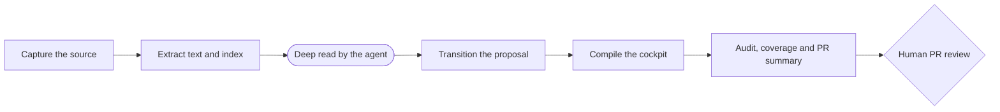

# Command reference

Last updated: 2026-06-09.

This page catalogs the deterministic CLIs of the living wiki system. They all live in [scripts/](../../../scripts/) with the `wiki_` prefix, are pure Python (with no external dependency beyond PyYAML), call no language model and read the repo profile from [wiki.config.yaml](../../../wiki.config.yaml) via [wiki_core/config.py](../../../wiki_core/config.py). The deep reading (LLM) is always delegated to the agent that runs the repo, as per [ingestion-process.md](../ingestion-process.md). The gates and the audit are detailed on the sister page [gates-and-audit.md](gates-and-audit.md), and the PR approval cycle in [git-approvals.md](../git-approvals.md).

General convention: most accept `--dry-run` (computes without writing) and `--check` (exits with a code != 0 when something is pending/invalid, for use in CI). Output paths are printed relative to the repo root.

## Quick map

| CLI | Role | When to use |
| --- | --- | --- |
| [wiki_ingest.py](../../../scripts/wiki_ingest.py) | Orchestrates ingestion end to end | Ingest a source from scratch in a single command |
| [wiki_new_ingest.py](../../../scripts/wiki_new_ingest.py) | Creates the ingestion proposal (Markdown) | Open the private proposal that enters the gate |
| [wiki_extract_source_manifest.py](../../../scripts/wiki_extract_source_manifest.py) | Generates the deterministic source manifest | Record the identity/hash of an isolated source |
| [wiki_extract_text.py](../../../scripts/wiki_extract_text.py) | Extracts text and stable chunks | Prepare the chunks before the LLM pass |
| [wiki_build_index.py](../../../scripts/wiki_build_index.py) | Builds/inspects the SQLite index | (Re)index chunks for FTS search |
| [wiki_llm_context_pass.py](../../../scripts/wiki_llm_context_pass.py) | Assembles the context package and records the result | Emit/check the LLM pass delegated to the agent |
| [wiki_cache_inspect.py](../../../scripts/wiki_cache_inspect.py) | Inspects the LLM cache and derived coverage | Diagnose the state of the derived artifacts |
| [wiki_export_batch.py](../../../scripts/wiki_export_batch.py) | Exports pending requests in the Batches API format | Run the deep read in batch (-50%), no LLM client |
| [wiki_gc.py](../../../scripts/wiki_gc.py) | Garbage-collects orphan derived artifacts | Remove manifest/text/chunks of old source versions and prune the index |
| [wiki_archive.py](../../../scripts/wiki_archive.py) | Archives resolved proposals (and events) into ingestion/archive/ | Take immutable history out of the flat, re-audited dir |
| [wiki_drive_publish.py](../../../scripts/wiki_drive_publish.py) | Publishes non-versioned artifacts to Drive + manifest | Give a stable (Drive) link to what git ignores |
| [wiki_toolkit_drift.py](../../../scripts/wiki_toolkit_drift.py) | Detects toolkit drift between branches | Find fixes not yet backported between main and opensource |
| [wiki_gate.py](../../../scripts/wiki_gate.py) | Living gate: lists, transitions, rebases | Move proposals between states and supersede old ones |
| [wiki_score.py](../../../scripts/wiki_score.py) | Operational karma and vitality | Record/view append-only scoring |
| [wiki_insight_job.py](../../../scripts/wiki_insight_job.py) | Closes the Information -> Insight cycle | Gather signals about a theme for an insight proposal |
| [wiki_operation_compile.py](../../../scripts/wiki_operation_compile.py) | Compiles the daily cockpit | (Re)generate [memories/operations.md](../../operations.md) |
| [wiki_audit.py](../../../scripts/wiki_audit.py) | Audits the wiki contract | Validate contract/links/secrets at commit and in CI |
| [wiki_check_methodology_coverage.py](../../../scripts/wiki_check_methodology_coverage.py) | Checks the presence AND content of methodology v5 | Ensure the methodology is in fact implemented |
| [wiki_pr_summary.py](../../../scripts/wiki_pr_summary.py) | Summarizes the PR diff by context/entity | Generate the PR review summary |

## Ingestion pipeline

### [wiki_ingest.py](../../../scripts/wiki_ingest.py) - end-to-end orchestrator

Chains: manifest -> text/chunks -> index -> pre-scan (secrets BLOCK; PII is informational and welcome on a private page) -> LLM context package (emits the `-llm-context-request.json` that the auditor's gate watches) -> score-event. It replaces the manual step-by-step execution. The LLM pass itself remains delegated to the agent.

- `--source` (required): path or URL of the source.
- `--context` (required): target context (e.g.: `system`).
- `--dry-run`: computes without writing artifacts.
- `--no-score`: does not record the final score-event.
- `--actor`: id of whoever ran it (for the score).

Returns exit `2` if the pre-triage finds a SECRET in the source (block at the origin).

```sh
python3 scripts/wiki_ingest.py --source data/raw/example.pdf --context system
python3 scripts/wiki_ingest.py --source X.md --context system --dry-run
```

### [wiki_new_ingest.py](../../../scripts/wiki_new_ingest.py) - creates the ingestion proposal

Generates the Markdown file of the private proposal (in [memories/system/ingestion/](../../../memories/system/ingestion/README.md)) with frontmatter, quadrants, privacy risks and checklist. It classifies the source (raw/memory/reference/artifact), does a pre-triage (secrets block; PII is only reported) and, on writing, applies a rebase to supersede pending proposals of the same logical target. The context -> pages/entities map comes from `wiki.targets.yaml` (per-repo profile), keeping the script generic.

- `--source` (required): path or URL.
- `--context` (required): restricted to the contexts declared in the profile.
- `--status` (default `draft`): initial epistemological status.
- `--date` (default today): ISO date used in the `page_id` and in the file name.
- `--dry-run`: prints the proposal without writing (exit `2` if there is a secret).

```sh
python3 scripts/wiki_new_ingest.py --source data/raw/example.pdf --context system
python3 scripts/wiki_new_ingest.py --source X.md --context system --dry-run
```

### [wiki_extract_source_manifest.py](../../../scripts/wiki_extract_source_manifest.py) - source manifest

Creates the deterministic manifest (source_id, type, SHA256 hash) of a single source and writes it in [data/](../../../data/) under `derived/wiki/source-manifests/` (created at runtime). Useful when you only want the stable identity of a source, without running the whole pipeline.

- `--source` (required), `--context` (required).
- `--dry-run`: prints the manifest in JSON without writing.

```sh
python3 scripts/wiki_extract_source_manifest.py --source data/raw/example.pdf --context system --dry-run
```

### [wiki_extract_text.py](../../../scripts/wiki_extract_text.py) - text and stable chunks

Extracts the source's text and breaks it into stable chunks (with a per-chunk hash) BEFORE any LLM pass, using `chunk_target_tokens`/`chunk_overlap_tokens` from the config. It writes text and chunks to [data/](../../../data/) under `derived/wiki/` (created at runtime) and also the manifest.

- `--source` (required), `--context` (required).
- `--dry-run`: prints a preview (count of units/chunks) without writing.
- `--write-derived`: forces the writing of the derived artifacts even with `--dry-run`.

```sh
python3 scripts/wiki_extract_text.py --source data/raw/example.pdf --context system --dry-run
python3 scripts/wiki_extract_text.py --source data/raw/example.pdf --context system
```

### [wiki_build_index.py](../../../scripts/wiki_build_index.py) - local SQLite index

Builds or inspects the SQLite chunk index ([data/](../../../data/) under `derived/wiki/indexes/wiki.sqlite` (created at runtime)), which serves the FTS search used by the `--query` pass.

- (no flags): inspects and prints the state of the index in JSON.
- `--rebuild`: rebuilds the index from the derived chunks.
- `--check`: exit `1` if the index does not exist.

```sh
python3 scripts/wiki_build_index.py --rebuild
python3 scripts/wiki_build_index.py --check
```

### [wiki_llm_context_pass.py](../../../scripts/wiki_llm_context_pass.py) - delegated LLM pass

Calls no model at all. It gathers/selects chunks (by source or by sanitized FTS search), assembles a context PACKAGE (prompt + schema + chunk text), records in the cache the RESULT that the agent produced and serves as a gate (`--check`). The `--emit-request` writes the `-llm-context-request.json` that [wiki_audit.py](../../../scripts/wiki_audit.py) watches. Gate details in [gates-and-audit.md](gates-and-audit.md).

- `--context` (required). Use ONE of: `--source`, `--query` or `--record-result`.
- `--source` / `--query`: selects chunks by source or by FTS search.
- `--profile`: model profile (default comes from `default_model_profile`).
- `--emit-request`: writes the package in extraction-events (instead of printing).
- `--record-result PATH`: writes the agent's result to the cache (JSON object/array, or `-` for stdin).
- `--check`: exit != 0 if there is a pending chunk and `required_context_pass` is enabled.

```sh
python3 scripts/wiki_llm_context_pass.py --source X.pdf --context system --emit-request
python3 scripts/wiki_llm_context_pass.py --query "pending decisions" --context system
python3 scripts/wiki_llm_context_pass.py --record-result result.json --context system
python3 scripts/wiki_llm_context_pass.py --source X.pdf --context system --check
```

### [wiki_cache_inspect.py](../../../scripts/wiki_cache_inspect.py) - cache/coverage inspection

Summarizes the LLM cache and the coverage of the derived artifacts (how many manifests, texts, chunks, context plans exist). With `--source`, it shows whether the manifest/text/chunks/plan of that source already exist.

- `--summary`: prints the aggregated summary.
- `--source`: focuses on a specific source.
- `--context` (default `system`).

```sh
python3 scripts/wiki_cache_inspect.py --summary
python3 scripts/wiki_cache_inspect.py --source data/raw/example.pdf
```

## Gate, governance and cockpit

### [wiki_gate.py](../../../scripts/wiki_gate.py) - living proposal gate

Lists proposals, applies valid state transitions and rebases/supersedes pending proposals of the same logical target. By default it operates in [memories/system/ingestion/](../../../memories/system/ingestion/README.md) (proposals live flat). It requires exactly one action: `--list`, `--transition` or `--rebase`. States and transition machine detailed in [gates-and-audit.md](gates-and-audit.md).

- `--dir`: proposals directory (default [memories/system/ingestion/](../ingestion/)).
- `--list`: lists proposals and their `gate_state`.
- `--transition PATH --to STATE [--reason ...]`: transitions a proposal (records in the `gate_history`).
- `--rebase [--page ... | --context ... | --rebase-key ...]`: applies `rebase_pending` filtering the logical target.

```sh
python3 scripts/wiki_gate.py --list
python3 scripts/wiki_gate.py --transition memories/system/ingestion/2026-06-09-system-example.md --to approved --reason "reviewed"
python3 scripts/wiki_gate.py --rebase --rebase-key system-example
```

### [wiki_score.py](../../../scripts/wiki_score.py) - karma and vitality

Gamification layer: records and aggregates append-only scoring events in [data/](../../../data/) under `derived/wiki/score-events.jsonl` (created at runtime), without a toxic global ranking. It acts as a Score Keeper (never edits history). It requires one action: `--add`, `--summary` or `--dashboard`.

- `--add`: records an event; requires `--event`, `--actor`, `--context`.
- `--summary`: karma by dimension, vitality by context, badges and level.
- `--dashboard`: prints the Markdown of the vitality section.
- Event modifiers: `--quality` (0..1, default 1.0), `--collaborators` (splits credit), `--rare` (+50% for caring for a forgotten page), `--impact` (impacted contexts), `--ts` (ISO date).
- `--events-path`: path of the JSONL (default: [data/](../../../data/) under `derived/wiki/score-events.jsonl`, created at runtime).

```sh
python3 scripts/wiki_score.py --add --event ingestar_fonte_valida --actor owner --context system
python3 scripts/wiki_score.py --add --event criar_insight_aceito --actor owner --context example --quality 1.0 --impact 3 --rare
python3 scripts/wiki_score.py --summary
python3 scripts/wiki_score.py --dashboard
```

### [wiki_insight_job.py](../../../scripts/wiki_insight_job.py) - Information -> Insight cycle

Gathers already existing signals (score events + indexed chunks + memory pages) about a THEME, assembles a context package and emits a PROPOSAL of insight for the human gate. It calls no model and does not write canonical memory: the synthesis is delegated to the agent; the promotion to memory goes through a PR. Artifacts go to [data/derived/wiki/insight-jobs/](../../../data/derived/wiki/insight-jobs/) (gitignored).

- `--theme` (required): theme/subject of the insight.
- `--context` (default `system`).
- `--limit` (default 10): maximum of gathered chunks.
- `--dry-run`: computes without writing artifacts.

```sh
python3 scripts/wiki_insight_job.py --theme "honesty gate" --context system
python3 scripts/wiki_insight_job.py --theme "reconciliation" --context example --dry-run
```

### [wiki_operation_compile.py](../../../scripts/wiki_operation_compile.py) - daily cockpit

Compiles the operational cockpit [memories/operations.md](../../operations.md) from real sources (config, decisions, actions, vitality of the context hubs, karma and Git state), never from hardcoded content. The `--check` compares only the DETERMINISTIC view (ignores date/commit/karma) with a recompile at HEAD, so that CI can require the cockpit to be up to date.

- (no flags): prints the cockpit to stdout.
- `--write`: writes to [memories/operations.md](../../operations.md) and records a score-event idempotent per day.
- `--check`: fails if the deterministic content diverges from the one recompiled at HEAD.

```sh
python3 scripts/wiki_operation_compile.py --write
python3 scripts/wiki_operation_compile.py --check
```

## Audit, coverage and PR review

These three typically run at commit and in CI; the complete semantics of gates are in [gates-and-audit.md](gates-and-audit.md).

### [wiki_audit.py](../../../scripts/wiki_audit.py) - contract auditor

Audits the Markdown/Git wiki contract: required frontmatter, ontology relations, clickable local links (repo paths ONLY as Markdown links), absolute blocking of secrets in any versioned file, PII only at the public boundary, cockpit, ingestion events with quadrants, gate state, visibility promotion gate, LLM pass gate and log update. It is the same auditor that validates this page. For detailed rules, see [operational-wiki-contract.md](../operational-wiki-contract.md).

- (no flags): prints warnings/errors and the total.
- `--check`: exit `1` if there are errors (use in CI).
- `--public-export`: pre-publication mode; PII becomes an error on ANY page, not just the public ones.
- `--strict-local`: requires that links to derived/raw artifacts (gitignored) actually exist on disk.

```sh
python3 scripts/wiki_audit.py --check
python3 scripts/wiki_audit.py --public-export --check
```

### [wiki_check_methodology_coverage.py](../../../scripts/wiki_check_methodology_coverage.py) - methodology v5 coverage

Checks the PRESENCE AND CONTENT of methodology v5: each required file (pages, templates in [docs/references/templates/wiki/](../../../docs/references/templates/wiki/), support scripts, config, core) must exist with real content, not empty nor a placeholder. It also requires REAL use of the perceptive layer (at least one real journal and one real map/infographic) and that the coverage matrix mention visibility, agents, perceptive and karma. The LLM pass gate is portable (discovered from the versioned derived artifacts) and never accepts a mere LLM PLAN as proof of an executed pass.

- (no flags): prints the report of checks in JSON.
- `--check`: exit `1` if any check has `ok=false`.

```sh
python3 scripts/wiki_check_methodology_coverage.py --check
```

See also the system page [methodology-coverage-v5.md](../methodology-coverage-v5.md).

### [wiki_pr_summary.py](../../../scripts/wiki_pr_summary.py) - PR summary

Summarizes the current diff (against `main`, the working tree and the index) grouping the changed files by context and by entity type, and prints privacy review hints and a validation checklist. It takes no flags. Output in Markdown, ready to paste into the PR.

```sh
python3 scripts/wiki_pr_summary.py
```

## Typical order of use

The command lifecycle, from capture to a reviewed PR — each box is run by the CLI
linked in the numbered list below it:



1. Capture: [wiki_new_ingest.py](../../../scripts/wiki_new_ingest.py) (or [wiki_ingest.py](../../../scripts/wiki_ingest.py) for the full flow).
2. Derived: [wiki_extract_text.py](../../../scripts/wiki_extract_text.py) -> [wiki_build_index.py](../../../scripts/wiki_build_index.py).
3. Deep reading: [wiki_llm_context_pass.py](../../../scripts/wiki_llm_context_pass.py) `--emit-request`, the agent reads and responds, then `--record-result`.
4. Gate: [wiki_gate.py](../../../scripts/wiki_gate.py) to transition/supersede; see [git-approvals.md](../git-approvals.md).
5. Cockpit and validation: [wiki_operation_compile.py](../../../scripts/wiki_operation_compile.py) `--write`, then [wiki_audit.py](../../../scripts/wiki_audit.py) `--check`, [wiki_check_methodology_coverage.py](../../../scripts/wiki_check_methodology_coverage.py) `--check` and [wiki_pr_summary.py](../../../scripts/wiki_pr_summary.py).

For each agent's protocol, see [AGENTS.md](../../../AGENTS.md). Back to the root MOC in [memories/index.md](../../index.md) and to the cockpit in [memories/operations.md](../../operations.md).
