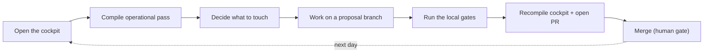

# Daily operation

Last updated: 2026-06-09.

This page describes the daily operational loop of the living wiki: how to resume
work, what to watch, how to run the gates before opening the PR and how to
recompile the cockpit at the end. It is a method page about the tool, not a
record of data from any concrete repo.

The cockpit itself is generated by
[scripts/wiki_operation_compile.py](../../../scripts/wiki_operation_compile.py) and
materialized in [memories/operations.md](../../operations.md). The human gate is the
GitHub PR, configured in [wiki.config.yaml](../../../wiki.config.yaml) (`gate:
github_pr`) and described in [git-approvals.md](../git-approvals.md). The process of
incorporating sources lives in [ingestion-process.md](../ingestion-process.md), and the
detailed automatic gates are in [gates-and-audit.md](gates-and-audit.md).
For consolidation rounds, also compile the operational pass with
[scripts/wiki_operational_pass.py](../../../scripts/wiki_operational_pass.py), which
materializes source freshness, action pressure, claims, decisions and next steps
by context in [operational-pass.md](../operational-pass.md).

## Overview of the loop

The operational day is a short and repeatable cycle:

1. Open the cockpit as the first screen and read the consolidated state.
2. Compile/read the operational pass when the round is about sources, actions or
   cross-context consolidation.
3. Decide what to touch (pending decisions, owner actions, queue, stale contexts).
4. Work on a proposal branch (`wiki/<theme>`), never directly on the approved wiki.
5. Run the local gates before opening the PR.
6. Recompile the cockpit and operational pass, then open/update the PR.
7. After the merge, the cockpit goes back to reflecting the approved wiki on the next compilation.



The contract that governs what can enter and how is in
[operational-wiki-contract.md](../operational-wiki-contract.md). The golden rule:
`main` is the approved wiki; `wiki/*` branches are living proposals; every PR must
show sources, changed pages, privacy risks, validations and pending items.

## 1. Open the cockpit as the first screen

The first action of the day is to open [memories/operations.md](../../operations.md). It is the
resumption screen: a dashboard compiled from real sources (memories,
Git state, derived artifacts), never from hand-written content.

To ensure you are reading an up-to-date cockpit, recompile it before reading (see
final section) or run `--check` to find out whether the committed cockpit still matches
what would be recompiled at HEAD:

```sh
python3 scripts/wiki_operation_compile.py --check
```

If `--check` fails, the cockpit is out of date relative to the deterministic
content of memories/ at HEAD; recompile before trusting it.

For a deeper consolidation pass across sources, actions and contexts, generate or
check [operational-pass.md](../operational-pass.md):

```sh
python3 scripts/wiki_operational_pass.py --check
python3 scripts/wiki_operational_pass.py --write
```

## 2. What to look at in the cockpit

[scripts/wiki_operation_compile.py](../../../scripts/wiki_operation_compile.py)
assembles the cockpit in fixed sections. In the daily loop, read in this order:

- State now: branch and last commit from which the cockpit was compiled, a reminder
  to check the open PR on GitHub and the biggest current risk. It is the
  provenance anchor (`generated_from_commit` in the frontmatter).
- Pending decisions: table derived from the memory's decision pages (one decision per
  file). These are choices the owner needs to make before the wiki advances.
- Owner actions: table derived from the memory's action pages, with the state read from the
  body of each action (`State:`). It is the active work list.
- Pending action queue: identifiers listed on the action pending page,
  in the queue's priority order. It is the explicit "next in the queue".
- Context vitality: for each context hub (memories/<ctx>/index.md
  of type `context_hub`), it compares `updated_at + stale_after_days` with today's
  date and marks `fresh` or `stale`. `stale` contexts are priority candidates
  for review and also appear repeated in Alerts.
- Alerts: invariant reminders of the method (the operation page goes stale after 1
  day; ingestion events must declare the quadrants or their explicit absence; PII
  is welcome on a private page but access secrets never enter) plus the
  day's stale contexts.
- Karma and vitality (gamification): total of score events and karma with
  decay, read from the derived event log. It signals, in a lightweight way, whether the
  curation work is happening. The scoring detail is in
  [scripts/wiki_score.py](../../../scripts/wiki_score.py) and in the score layer in
  [wiki_core/score](../../../wiki_core/score/).
- Resumption links: shortcuts to the root MOC, the system log and the coverage
  pages.

In short, what decides the day's focus: pending decisions (what unblocks),
owner actions and queue (what to execute), stale contexts (what is aging) and
the karma level (whether the curation is up to date).

## 3. Work on a proposal branch

Every wiki change happens on a proposal branch, with the `wiki/` prefix
(defined as `branch_prefix` in [wiki.config.yaml](../../../wiki.config.yaml)).
Never edit the approved wiki (`main`) directly. The flow of incorporating new
sources (generate an ingestion proposal with real links, guided reading and extraction)
is in [ingestion-process.md](../ingestion-process.md); the PR approval cycle
is in [git-approvals.md](../git-approvals.md).

```sh
git switch -c wiki/<topic>
```

When consolidating durable memory, first update the relevant context hub,
then the related pages, then the root MOC if the map changed, and add
an append-only entry to the system log.

## 4. Run the gates before the PR

Before opening or finalizing any wiki PR, run the three local gates. They
are the deterministic door that the human PR trusts. The details of each gate (what
the auditor blocks, secret and PII detection, page contract) are in
[gates-and-audit.md](gates-and-audit.md).

Structural and link audit (the rule of "only Markdown links for repo paths",
frontmatter, sources for facts, secret detection, staleness):

```sh
python3 scripts/wiki_audit.py --check
```

PR summary (files changed by context and by entity type, privacy review hints
and the validation checklist):

```sh
python3 scripts/wiki_pr_summary.py
```

Git whitespace/diff hygiene:

```sh
git diff --check
```

The paths of the scripts: [scripts/wiki_audit.py](../../../scripts/wiki_audit.py) and
[scripts/wiki_pr_summary.py](../../../scripts/wiki_pr_summary.py). The ingestion-proposal
gate (list, transition, rebase) uses
[scripts/wiki_gate.py](../../../scripts/wiki_gate.py); run it when the round
involves proposals in [memories/system/ingestion/](../ingestion/):

```sh
python3 scripts/wiki_gate.py --list
```

Only open the PR after the three central gates pass. The PR is the human gate:
show sources, changed pages, privacy risks, validations run and
pending items. The approval rules are in
[git-approvals.md](../git-approvals.md) and the approval parameters in
[wiki.config.yaml](../../../wiki.config.yaml) (`require_operation_update`,
`require_log_update`).

## 5. Recompile the cockpit

At the end of the round (and whenever memories/, decisions or actions change), recompile
the cockpit and the operational pass so that they reflect the new state:

```sh
python3 scripts/wiki_operation_compile.py --write
python3 scripts/wiki_operational_pass.py --write
```

Recompiling is idempotent per day and records a curation score event
(`recompilar_pagina_antiga`), feeding the karma section of the cockpit itself. The
deterministic content of the cockpit is verified in CI by the same `--check` from
section 1: "up to date" means that the deterministic body matches a recompile
at HEAD. Commit hash equality is not required (by design, the recompilation commit
cannot contain its own hash, and merge commits always differ); the
gate is the content, and `generated_from_commit` serves only as provenance.

Include the recompiled cockpit in the same PR as the change that motivated it, together with the
log entry. After the merge, on the next compilation the cockpit already reflects the approved wiki
and the cycle begins again.

## Summary of the daily cycle

```sh
python3 scripts/wiki_operation_compile.py --check   # cockpit up to date?
git switch -c wiki/<topic>                           # proposal branch
# ... edit memories/, decisions, actions ...
python3 scripts/wiki_audit.py --check                # gate 1: structure/links/secrets
python3 scripts/wiki_pr_summary.py                   # gate 2: PR summary + checklist
git diff --check                                     # gate 3: diff hygiene
python3 scripts/wiki_operation_compile.py --write    # recompile the cockpit
python3 scripts/wiki_operational_pass.py --write     # recompile source/action/context pass
# ... open/update the PR (human gate) ...
```

## Related

- Generated cockpit: [memories/operations.md](../../operations.md)
- Root MOC: [memories/index.md](../../index.md)
- Gates and audit: [gates-and-audit.md](gates-and-audit.md)
- Approvals by Git/PR: [git-approvals.md](../git-approvals.md)
- Ingestion process: [ingestion-process.md](../ingestion-process.md)
- Operational wiki contract: [operational-wiki-contract.md](../operational-wiki-contract.md)
- Methodology coverage: [methodology-coverage-v5.md](../methodology-coverage-v5.md)
- Agent conventions: [AGENTS.md](../../../AGENTS.md)
