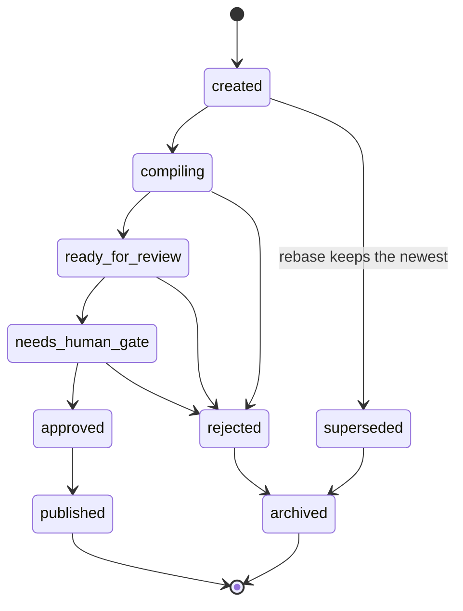

# Gates and auditing

Updated on: 2026-06-25.

The gates are the honesty layer of the living wiki: deterministic scripts that
fail (non-zero exit code) when the repository violates the contract, omits the
deep read, leaves a read source without integration, lets relation pages drift
outside the hierarchy or leaves generated pages out of date. They run in CI on
the [gate by PR](../git-approvals.md) and locally before opening the proposal.
The families cover distinct dimensions: contract auditing
([wiki_audit.py](../../../scripts/wiki_audit.py)), methodology coverage
([wiki_check_methodology_coverage.py](../../../scripts/wiki_check_methodology_coverage.py)),
generated-page freshness ([wiki_operation_compile.py](../../../scripts/wiki_operation_compile.py),
[wiki_operational_pass.py](../../../scripts/wiki_operational_pass.py),
[wiki_source_registry.py](../../../scripts/wiki_source_registry.py) and
[wiki_input_stage.py](../../../scripts/wiki_input_stage.py)), closed
consolidation ([wiki_consolidate.py](../../../scripts/wiki_consolidate.py)) and
quality/hierarchy telemetry ([wiki_quality_report.py](../../../scripts/wiki_quality_report.py)).
The audited contract itself is described in [operational wiki contract](../operational-wiki-contract.md);
here we document how it is verified.

Running the local gates (check mode, fails with code != 0):

```sh
python3 scripts/wiki_audit.py --check
python3 scripts/wiki_check_methodology_coverage.py --check
python3 scripts/wiki_operation_compile.py --check
python3 scripts/wiki_operational_pass.py --check
python3 scripts/wiki_source_registry.py --check
python3 scripts/wiki_input_stage.py --check
python3 scripts/wiki_consolidate.py --check
python3 scripts/wiki_quality_report.py --check
```

The honesty gates at a glance — what each verifies and where it runs in CI:

| Gate | What it verifies | CI step |
| --- | --- | --- |
| Contract audit | Frontmatter, ontology relations, clickable local links | `wiki_audit.py --check` |
| Secret block | No access secret in any versioned text file | `wiki_audit.py --check` (`audit_secrets`) |
| PII boundary | PII only crosses the public boundary when redacted | `wiki_audit.py --check` (`audit_pii`) |
| LLM pass | Every requested chunk has a recorded, valid result | `wiki_audit.py --check` (`audit_context_pass_gate`) |
| Consolidation closed | New event needs `consolidated_into` + each target references the source back in `source_refs` + candidate claims linked or `sem_claim` | [wiki_audit.py](../../../scripts/wiki_audit.py) `--check` and [wiki_consolidate.py](../../../scripts/wiki_consolidate.py) `--check` (CI) |
| Quality and hierarchy | Low-density/repeated pages, open integration flags, operational-coverage gaps and relation pages without `moc_parent` when configured | [wiki_quality_report.py](../../../scripts/wiki_quality_report.py) `--check` |
| Gate state | Every proposal carries a valid `gate_state` | `wiki_audit.py --check` (`audit_ingestion_proposals_gate_state`) |
| Methodology coverage | Required pages/templates exist with real content | `wiki_check_methodology_coverage.py --check` |
| Cockpit freshness | The deterministic cockpit body matches a recompile at HEAD | `wiki_operation_compile.py --check` |
| Operational pass freshness | The source/action/context pass matches a recompile at HEAD | `wiki_operational_pass.py --check` |
| Source registry freshness | The generated source registry matches source page frontmatter | `wiki_source_registry.py --check` |
| Input stage freshness | The generated root/channel/source input stage matches a recompile at HEAD | `wiki_input_stage.py --check` |
| Public export | PII becomes an error on ANY page before publishing | `wiki_audit.py --check --public-export` |

## Contract auditing (wiki_audit)

[wiki_audit.py](../../../scripts/wiki_audit.py) scans the versioned files (and the non-ignored untracked ones, via `git ls-files`) and accumulates errors and warnings. With `--check`, any error returns code 1; warnings (stale pages, cockpit not recompiled today) never bring down the gate on their own. Each `audit_*` function covers an invariant:

- `audit_frontmatter`: for each primary page (the core of the method + one `index.md` hub per context declared in [wiki.config.yaml](../../../wiki.config.yaml)) and for every page under an ontology directory, it requires the mandatory frontmatter keys, valid `updated_at`/`stale_after_days`, and — on the ontology pages — the relation keys and a `page_type` allowed in that directory. Expired pages (`updated_at + stale_after_days < today`) become a stale-page warning.
- `audit_relations`: builds the `page_id` catalog (flagging duplicates), validates that each relational reference (`owner`, `claims`, `decisions`, etc.) points to an existing `page_id` with the expected prefix, and that each versioned `evidence_refs` exists on disk — URLs, absolute paths and gitignored caches ([data/raw](../../../data/raw/), [data/derived](../../../data/derived/)) are tolerated.
- `audit_secrets`: absolute block. It runs the detectors of [wiki_core/detectors](../../../wiki_core/detectors/__init__.py) over every versioned text file (except fixtures and the detector itself) and fails any finding of category `secret` (AWS/Google credential, JWT, PEM, Slack, high entropy) anywhere.
- `audit_pii`: the public boundary. PII (CPF/CNPJ, values, dates, counterparties) is WELCOME in a private page of this personal repo — silent, with no error or warning, because keeping that data is the very purpose of the operational memory. PII only becomes an error when it crosses the public boundary: a `public` or `public_candidate` page, or a pre-publication export (`--public-export`). The strict-by-PII-in-private mode is opt-in, turned on only when the owner sets `private_sensitive_allowed=false`.
- `audit_clickable_local_links`: the core of the rule this page obeys. Over memory pages, wiki templates, [AGENTS.md](../../../AGENTS.md) and the PR template, it requires that every repo path be a clickable Markdown link whose target exists; it fails a local path in inline code (backtick), a path cited in a command without a link on the same line, and a loose path in prose. Fenced code blocks are exempt.
- `audit_context_pass_gate`: gate of the LLM pass in the context of the auditing (detailed below).
- `audit_consolidation`: gate of the integration (detailed below). Every new event (with a `source_id`) needs `consolidated_into` filled in, each target page must reference the source back in `source_refs`, and candidate claims require linked `claims:` or an explicit `sem_claim: <reason>`. Legacy events without a `source_id` become only a warning.
- `audit_ingestion_proposals_gate_state`: every flat proposal in [memories/system/ingestion](../../../memories/system/ingestion/README.md) must carry a valid `gate_state` (see [state machine](#gate-state-machine)). Without it, the living gate has nowhere for the proposal to enter.

Other invariants of the same script: `audit_operation_page` (the cockpit must be `page_type: dashboard` with `stale_after_days: 1`); `audit_ingestion_events` (every normalized event has the integral quadrants section, with no empty cell or placeholder); `audit_ingestion_absolute_paths` (an absolute source path becomes a link, and disguised traversal up to the home is not portable); `audit_public_candidates` (every `public_candidate` page requires a redaction checklist and zero secret/PII); `audit_promotion_gate` (promoting visibility requires the consent/anonymization/reversion fields); `audit_llm_cache_metadata` (each cache result carries `prompt_version`, `schema_version`, `cache_key`); and `audit_log_changed` (changing [memories/](../../index.md) without updating the change log fails). The flow of these last ones is detailed in [ingestion process](../ingestion-process.md).

### LLM pass gate (required_context_pass)

The deep read is delegated to the agent that runs the repo, not to a Python client — the architecture is in [wiki_core/llm/context_pass.py](../../../wiki_core/llm/context_pass.py). The deterministic code assembles a context PACKAGE (request) with the text of the chunks, the versioned prompt and the per-chunk cache status; the agent executes the read and writes the RESULT. The honesty gate closes that circuit from two sides:

- `validate_result` (in [context_pass.py](../../../wiki_core/llm/context_pass.py)) rejects a result that is missing any mandatory key, leaves any quadrant empty, or does not declare `sensitivity.has_pii`. Only a valid result is written to the cache.
- `source_pending` counts the chunks with no written result. With `required_context_pass: true` in [wiki.config.yaml](../../../wiki.config.yaml), `audit_context_pass_gate` (in [wiki_audit.py](../../../scripts/wiki_audit.py)) scans each `*-llm-context-request.json` in [data/derived/wiki/extraction-events](../../../data/derived/wiki/) and fails if any listed chunk does not have its corresponding `<cache_key>.json` in the cache. The existence of an LLM *plan* never counts as proof of an executed pass.

Triggering the pass manually (recording of the result by the agent via skill):

```sh
python3 scripts/wiki_llm_context_pass.py --record-result
```

### Consolidation gate (ingesting = integrating)

The deep read written to the cache does not end the ingestion: the source is only ingested when the wiki concepts reflect the new information. The gate closes that circuit from two sides — `audit_consolidation` (in [wiki_audit.py](../../../scripts/wiki_audit.py)) validates the events already emitted, and [wiki_consolidate.py](../../../scripts/wiki_consolidate.py) `--check` (in CI) fails while any source with a complete deep read has no event, or has an event with an empty `consolidated_into`. The gate's row in the honesty-gates table above is "Consolidation closed".

`--all-pending` lists the pending consolidations in JSON, and the cockpit ([memories/operations.md](../../operations.md)) shows the alert "Sources awaiting consolidation: N" while anything is pending. Legacy events (without a `source_id`) do not block: they become a warning to be closed when the source is revisited.

## Methodology coverage (presence AND content)

[wiki_check_methodology_coverage.py](../../../scripts/wiki_check_methodology_coverage.py) goes beyond checking whether the files exist: each required file must have real body (above a byte floor, not a placeholder), frontmatter with the minimum fields and the expected sections. It emits JSON with the list of checks; with `--check`, any `ok=false` check returns code 1.

- Mandatory pages (methodology source, [coverage matrix](../methodology-coverage-v5.md), cockpit) need a non-empty body and a `page_id` in the frontmatter; wiki templates need real body (accepting raw frontmatter or inside a ```yaml block); supporting scripts/config/core only need to exist.
- The coverage matrix must actually mention `visibility`, `agents`, `perceptive` and `karma` — sections that were previously missing.
- The real USE of the perceptive layer, not just the presence of templates: `check_perceptive_usage` requires at least one real journal and at least one real map/infographic — pages with a perceptive `page_type`, a `status` other than `template`, a `perception_policy` marker in the frontmatter and a non-empty body.
- `check_llm_context_pass` reimplements the pass gate in a portable way: it discovers the request files in [data/derived/wiki/extraction-events](../../../data/derived/wiki/), and only fails if there is a request with a pending chunk. With no request files (clean clone/CI), it does not fail. The derived manifests are gitignored, so their absence is merely informational, never an error.

## Cockpit freshness (--check compares the whole body)

[wiki_operation_compile.py](../../../scripts/wiki_operation_compile.py) recompiles the cockpit ([memories/operations.md](../../operations.md)) from the content of [memories/](../../index.md) and, with `--check`, fails if the result diverges from what is versioned. The comparison uses `stable_cockpit_view`: it covers the ENTIRE deterministic body (stable frontmatter, state now, decisions, actions, queue, alerts, links) — not just three sections — and removes the volatile parts (date, legacy git provenance, karma/score) so that "up to date" means "the deterministic content matches a recompile at HEAD". Branch and commit are not versioned in the cockpit because they become stale after a PR merge; agents must check live Git state before acting.

Recompiling and writing the cockpit before committing:

```sh
python3 scripts/wiki_operation_compile.py --write
```

## Input stage and source registry freshness

[wiki_input_stage.py](../../../scripts/wiki_input_stage.py) compiles the
configured root entity, input channels, source pages and source configs into
[input-stage.md](../input-stage.md). Its `--check` compares the generated page
against a recompile using the page's existing `updated_at`; if the gitignored
catalog exists under the derived input-stage cache, it is checked too. This
keeps root/channel/source routing deterministic without
requiring cache files in a clean clone.

[wiki_source_registry.py](../../../scripts/wiki_source_registry.py) performs the
same freshness check for [source-registry.md](../source-registry.md), where
canonical source pages are indexed by state, last update and refresh cadence.

```sh
python3 scripts/wiki_input_stage.py --check
python3 scripts/wiki_source_registry.py --check
```

## Quality and hierarchy telemetry

[wiki_quality_report.py](../../../scripts/wiki_quality_report.py) measures
quality surfaces that are too semantic for the link audit but still fully
deterministic: density, same-context repetition, unclosed ingestion events,
operational model coverage and relation pages without a declared parent hub. The
hierarchy signal deliberately ignores `source_refs`: provenance tells where a
fact came from, while `moc_parent`/parent hub tells where the page belongs.

The gate is opt-in per threshold, read from
[wiki.config.yaml](../../../wiki.config.yaml). This kit sets
`audit.quality_max_relation_pages_without_parent: 0` so new typed relation pages
cannot accumulate beside the conceptual hubs.

```sh
python3 scripts/wiki_quality_report.py --check
```

## --public-export and --strict-local modes

Two modes of [wiki_audit.py](../../../scripts/wiki_audit.py) harden the auditing for specific situations:

- `--public-export`: pre-publication mode. PII becomes an error in ANY page, not just the public ones — used before exporting any slice outside the private boundary.
- `--strict-local`: real-environment mode. By default, links to gitignored derived/raw artifacts ([data/raw](../../../data/raw/), [data/derived](../../../data/derived/)) are tolerated, because a clean clone/CI does not have them. With `--strict-local`, those links must actually exist on disk — it catches a dangling derived reference in a real working environment.

```sh
python3 scripts/wiki_audit.py --check --public-export
python3 scripts/wiki_audit.py --check --strict-local
```

## Gate state machine

The ingestion proposals traverse an explicit state machine ([wiki_core/gate/state_machine.py](../../../wiki_core/gate/state_machine.py)): `created` -> `compiling` -> `ready_for_review` -> `needs_human_gate` -> `approved` -> `published`, with exits `superseded`, `rejected` and `archived`.



 `can_transition` validates each passage against the transition graph; `write_state` applies the change in the frontmatter and records an auditable history in `gate_history` ({from, to, reason}), refusing invalid transitions (e.g.: `rejected` -> `approved`, or any exit from `archived`). When several proposals compete for the same page/context, `rebase_pending` keeps the most recent one and marks the rest as `superseded` — a system action, also audited in the history. It is this coherence that `audit_ingestion_proposals_gate_state` guarantees by requiring a valid `gate_state` in every proposal. The human approval flow over this machine is in [git approvals](../git-approvals.md).
