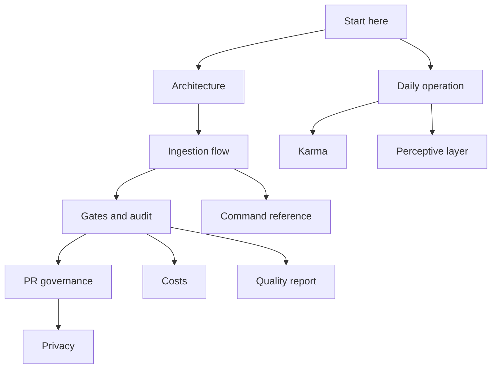

# Meta-wiki: how the living wiki works

Last updated: 2026-06-09.

This is the **meta-wiki**: the living wiki itself used to document, in a
complete and organized way, how the system **operates** and what its **process** is.
It serves equally the personal project and the open-source version — the system (method +
tools) is the same in both. It is reached from the root map of content in
[memories/index.md](../../index.md), as a first-class context, not a side manual.

The pages group into three clusters — getting started, the pipeline, and the
governance and by-products that keep the wiki honest.

## Where to start

| If you want to... | Read |
| --- | --- |
| Understand the system for the first time | [architecture.md](architecture.md), then [daily-operation.md](daily-operation.md) |
| Ingest a source | [ingestion-flow.md](ingestion-flow.md) |
| Open or review a PR | [pr-governance.md](pr-governance.md) and [gates-and-audit.md](gates-and-audit.md) |

## Map of the meta-wiki

| Page | What it covers |
| --- | --- |
| [architecture.md](architecture.md) | Overview, principles and map of the modules. |
| [daily-operation.md](daily-operation.md) | The daily loop: cockpit, resumption and gates before the PR. |
| [ingestion-flow.md](ingestion-flow.md) | Source -> manifest -> chunks -> index -> LLM -> event -> consolidation. |
| [gates-and-audit.md](gates-and-audit.md) | The honesty gates: audit, coverage, freshness, LLM pass. |
| [perspectives/index.md](../perspectives/index.md) | Reusable viewpoints for perspective-aware deep reads. |
| [privacy.md](privacy.md) | Two axes: PII free in private; secrets blocked always. |
| [karma-gamification.md](karma-gamification.md) | 8-dimension karma as a by-product, without a leaderboard. |
| [perceptual-layer-insight.md](perceptual-layer-insight.md) | Journal/map and the Information -> Insight cycle. |
| [pr-governance.md](pr-governance.md) | Human gate by PR, review, split and status across two dimensions. |
| [operation-costs.md](operation-costs.md) | Where the cost goes (agent session, human) and levers: Batches, model by profile, budget. |
| [command-reference.md](command-reference.md) | Reference of all the `wiki_*` CLIs, including [wiki_quality_report.py](../../../scripts/wiki_quality_report.py). |

## Related method pages

- Ingestion process: [ingestion-process.md](../ingestion-process.md).
- Operational wiki contract: [operational-wiki-contract.md](../operational-wiki-contract.md).
- Methodology coverage: [methodology-coverage-v5.md](../methodology-coverage-v5.md).
- Approvals and gate by PR: [git-approvals.md](../git-approvals.md).
- Operational cockpit: [operations.md](../../operations.md).
