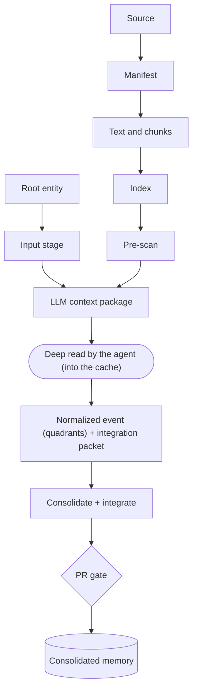
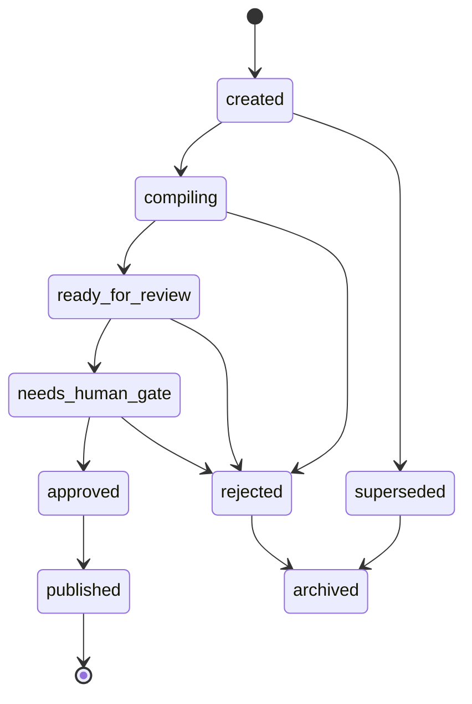

# End-to-end ingestion flow

Updated on: 2026-06-25.

This page describes the path a source travels in the living wiki, from the moment
it is captured until it becomes consolidated memory via Pull Request. The deterministic
code lives in the orchestrator [ingestion pipeline](../../../wiki_core/ingest/pipeline.py)
and in the scripts [wiki_ingest.py](../../../scripts/wiki_ingest.py) and
[wiki_new_ingest.py](../../../scripts/wiki_new_ingest.py). The only
non-deterministic step, the deep read, is delegated to the agent that runs the repo. The
corresponding high-level operational process is in
[ingestion process](../ingestion-process.md); the blocking criteria and the
gate mechanics are in [gates and auditing](gates-and-audit.md).
Before a source is interpreted, the repo's configured root entity and generated
input stage define the default perspective bundle, channels, processes and
target pages; in this kit those pages are [Wiki Viva Kit](../wiki-viva-kit.md)
and [Input stage](../input-stage.md).

## Overview of the path

The deterministic sequence chained by the orchestrator
([ingestion pipeline](../../../wiki_core/ingest/pipeline.py)) is shown below. The
deterministic steps run inside the toolkit; the deep read is the one step the agent
owns; consolidation, INTEGRATION and the PR gate close the loop into memory.



The same path as a stage table — each stage maps to a command and an output, and the
gate column says what can stop the source from advancing:

| Stage | Command | Output | Gate |
| --- | --- | --- | --- |
| Root/input stage | [wiki_input_stage.py](../../../scripts/wiki_input_stage.py) | Generated [input-stage.md](../input-stage.md) + optional cache catalog | stale generated page fails `--check` |
| Manifest | [wiki_extract_source_manifest.py](../../../scripts/wiki_extract_source_manifest.py) | `<source_id>` manifest JSON | none |
| Text + chunks | [wiki_extract_text.py](../../../scripts/wiki_extract_text.py) | Extracted text + stable chunks | none |
| Index | [wiki_build_index.py](../../../scripts/wiki_build_index.py) | SQLite FTS index | none |
| Pre-scan | [wiki_ingest.py](../../../scripts/wiki_ingest.py) | Secret/PII findings | secret BLOCKS (exit 2); PII informs |
| Context package | [wiki_llm_context_pass.py](../../../scripts/wiki_llm_context_pass.py) `--emit-request` | `-llm-context-request.json` | `required_context_pass` watches this file |
| Deep read | [wiki_llm_context_pass.py](../../../scripts/wiki_llm_context_pass.py) `--record-result` | Per-chunk result in the cache | `validate_result` rejects empty quadrants |
| Event | [wiki_consolidate.py](../../../scripts/wiki_consolidate.py) `--emit-event` (template as manual fallback) | Quadrants event with `consolidated_into: []` | empty/placeholder quadrant fails the audit |
| Integration | [wiki_consolidate.py](../../../scripts/wiki_consolidate.py) `--packet`, then the agent integrates | Targets updated, conflicts resolved/recorded, `consolidated_into` closed | [wiki_consolidate.py](../../../scripts/wiki_consolidate.py) `--check` fails a read source without integration (CI) |
| Consolidation + PR | [wiki_audit.py](../../../scripts/wiki_audit.py), then a PR | Updated memory | human approval on `main` |

Invariant points of the design:

- The deterministic code never calls a model nor writes canonical memory. It
  prepares artifacts and a request package; the agent reads that package, executes the
  deep read and writes the result into the cache.
- The input stage does not fetch Slack, Drive, Jira, email or any other system.
  It compiles already-declared root/channel/source-config pages so the source
  enters the LLM pass with the correct perspective bundle and target pages.
- The pre-triage separates two types of finding: an access secret BLOCKS at the origin;
  PII (personal data) merely INFORMS, because this repo is private and personal data is
  welcome in a private page.
- Nothing becomes memory until it passes through the gate by PR with human approval.

## Step 0 - Root entity and input stage

The initial context is not inferred from the source alone. The repo declares
`root_entity` in [wiki.config.yaml](../../../wiki.config.yaml), pointing to a
`page_type: root_entity` page such as [Wiki Viva Kit](../wiki-viva-kit.md). That
page describes the subject of the wiki, the integral quadrant map, default
perspectives, people/roles, artifacts, processes, input channels and source map.

[wiki_input_stage.py](../../../scripts/wiki_input_stage.py) then compiles that
root page together with `input_channel`, `source` and `source_config` pages into
[input-stage.md](../input-stage.md). The generated catalog carries:

| Field | Why it matters |
| --- | --- |
| Root entity | The semantic top entity that every source can update. |
| Input channel | The declared source system/type, refresh policy, quadrants and process links. |
| Perspective bundle | Required and optional lenses inherited from root, channel and source config. |
| Target pages | Root page, context hub and source-specific pages that must be considered during integration. |
| Ready inputs/warnings | Deterministic staging state before the agent reads anything. |

```sh
python3 scripts/wiki_input_stage.py --write
python3 scripts/wiki_input_stage.py --check
python3 scripts/wiki_input_stage.py --ready
```

## Step 1 - Manifest

Capture begins in [build_manifest](../../../wiki_core/source_manifest.py), which
classifies the source (URL, PDF, markdown, table, spreadsheet, document, email or
generic file), computes the SHA256 (file) or a hash of the listing (directory),
derives a stable `source_id` (`source-<slug>-<hash12>`) and records metadata:
existence, size, mime, modification date, `risk_level` and
`visibility_initial: private_self`. The manifest is written to
[data/derived/wiki/source-manifests/](../../../data/derived/wiki/) by the
orchestrator. For a URL, no content is copied automatically: the
manifest keeps only the reference, and the extraction depends on a directed read.

## Step 2 - Text and chunks

When the source is a local file, [extract_source](../../../wiki_core/extractors/text.py)
extracts the text and [chunk_text](../../../wiki_core/chunking.py) partitions it into
chunks with `chunk_target_tokens` and `chunk_overlap_tokens` (defaults 1200/150,
configurable in [wiki.config.yaml](../../../wiki.config.yaml)). Each chunk receives
a deterministic `chunk_id` and its own `hash_sha256`. The extracted text and the
chunks are written to
[data/derived/wiki/source-text/](../../../data/derived/wiki/) and
[data/derived/wiki/chunks/](../../../data/derived/wiki/). URLs and sources without
local semantic content skip this step (no chunks).

## Step 3 - Index

With chunks written, the orchestrator calls
[build_index](../../../wiki_core/index/sqlite.py) and (re)builds the SQLite
FTS index in [data/derived/wiki/indexes/](../../../data/derived/wiki/). It is this index that
allows, later, assembling context packages by search (`--query` mode of the LLM
pass step) in addition to the by-source mode.

## Step 4 - Pre-scan (a secret blocks; PII informs)

Over the raw file, [scan_file](../../../wiki_core/ingest/pipeline.py) runs
the reusable detectors ([detectors](../../../wiki_core/detectors/secrets.py))
and separates the findings by category:

- `secret` (token, key, password, cookie, PEM, etc.) goes into `secret_findings`. If
  there is ANY secret, the CLI [wiki_ingest.py](../../../scripts/wiki_ingest.py)
  prints BLOCKED and returns exit code 2: the source must not be consolidated without
  removing the secret. This is a block at the ORIGIN, even before reaching the PR gate.
- `pii` (CPF, CNPJ, names, values) goes into `pii_findings`, which is merely
  informational. Personal data is welcome in a private page; it just needs to be redacted
  before exporting or publishing.

Every finding `excerpt` already comes redacted by the detectors: neither the reports nor
the logs carry the raw secret. The complete rationale of this asymmetric criterion
is in [gates and auditing](gates-and-audit.md).

## Step 5 - LLM context package (-request.json)

When chunks exist, [build_context_request](../../../wiki_core/llm/context_pass.py)
assembles the PACKAGE that the agent will execute. For each chunk it computes the
deterministic `cache_key` ([cache.py](../../../wiki_core/llm/cache.py)) from
`source_hash | chunk_hash | prompt_version | schema_version | model_profile`,
checks whether a result already exists in the cache and marks `result_exists`. The package gathers:
the versioned prompt (`context_deep_read`), the `schema_version`
(`wiki_llm_context_pass.v4`), the mandatory quadrants, the list of
`result_required_keys`, the text of each chunk and the count `pending_llm_calls`.
When `--source` points to a repo-local source page, the package also includes
`root_entity`, `input_channel`, `quadrant_map`, `target_pages` and
`input_stage_status` inherited from the generated input-stage catalog. The
orchestrator writes this package as
`<source_id>-llm-context-request.json` in
[data/derived/wiki/extraction-events/](../../../data/derived/wiki/). This
`-request.json` file is exactly what the auditor watches to require the deep read.

## Step 6 - LLM pass written to the cache by the agent

Here the design separates code from intelligence. The module
[context_pass.py](../../../wiki_core/llm/context_pass.py) makes it clear: there is no
embedded LLM client in Python. The agent that runs the repo (Claude, Codex, Gemini,
via skill) reads the package, executes the deep read of each chunk with
`result_exists=false` and produces one object per chunk according to
`result_required_keys`: `quadrants` (the four filled quadrants),
`claims`, `decisions`, `actions`, `risks`, `uncertainties`, `relationships` and
`sensitivity` (with `has_pii`), using the same `cache_key` of the chunk.

The result is written to the cache via
[wiki_llm_context_pass.py](../../../scripts/wiki_llm_context_pass.py) with
`--record-result`, which validates the object in
[validate_result](../../../wiki_core/llm/context_pass.py) (rejects a missing key,
an empty quadrant or `sensitivity` without `has_pii`) before persisting it in
[data/derived/wiki/llm-cache/](../../../data/derived/wiki/). The agent NEVER writes
canonical memory directly: it only feeds the cache. It is the consolidation step
that turns the cache into integration: [wiki_consolidate.py](../../../scripts/wiki_consolidate.py)
generates the normalized event and the integration packet from the cache, the agent
integrates what it read into the target pages, and the canonical change lands via
PR (step 8). [wiki_llm_context_pass.py](../../../scripts/wiki_llm_context_pass.py)
with `--check` serves as a gate: it returns a non-zero exit while there is a pending chunk and
`required_context_pass` (turned on in [wiki.config.yaml](../../../wiki.config.yaml))
is active.

When `--source` points to a repo-local source page, the CLI looks up its
`source_config` through `config_ref` or matching `source_refs`, then merges
root, input-channel and source-config perspectives automatically. Source-level
reading contracts travel with the source instead of depending on the operator
remembering flags.

```sh
python3 scripts/wiki_llm_context_pass.py --source X.pdf --context system --emit-request
python3 scripts/wiki_llm_context_pass.py --record-result result.json --context system
python3 scripts/wiki_llm_context_pass.py --source X.pdf --context system --check
```

## Step 7 - Normalized event (quadrants)

The deep read feeds the normalized event: a record with the four
quadrants (Interior individual, Exterior individual, Interior collective, Exterior
collective), following the template
[ingestion-event.md](../../../docs/references/templates/wiki/ingestion-event.md).
When a quadrant does not appear in the source, the absence is filled in explicitly
as an operational finding, never left blank. The event lives in the ingestion
events folder, referenced by the proposal. Since v6.1 it is generated directly
from the cache by [wiki_consolidate.py](../../../scripts/wiki_consolidate.py)
`--emit-event` (quadrants filled — never a placeholder — and
`consolidated_into: []` for the agent to close during integration). The proposal created by
[wiki_new_ingest.py](../../../scripts/wiki_new_ingest.py) already includes the
quadrants table to be filled and points to the manifest, the chunks and the expected event.

## Step 8 - Consolidation, integration and PR

Consolidation transforms the synthesis into context memory - not just a link
to the source. Ingesting = integrating, and the stage has its own tool:
[wiki_consolidate.py](../../../scripts/wiki_consolidate.py) with
`--source <source_id> --emit-event --packet` generates the normalized event
(step 7) and the integration packet (gitignored) with related pages, overlapping
claims, `root_impact`, target pages and potential conflicts per claim/entity.
Guided by the packet, the agent
updates the target hubs/concepts incrementally, creates/updates load-bearing
claim pages (fields `supersedes`/`superseded_by`/`conflicts_with`/
`conflict_resolution` when claims collide), resolves or records every conflict
and ambiguity and fills in the event's `consolidated_into` — each target page
references the source in `source_refs`. The `--check` (in CI) fails while there
is a source with a complete deep read but no closed event; only then does the
source page receive `ingestion_state: ingested` + `last_ingested_at` + a line in
the ingestion log, and the source registry is regenerated.

Local paths become clickable Markdown links, related pages
and the [system log](../log.md) are updated, the auditing is run
([wiki_audit.py](../../../scripts/wiki_audit.py)) and the diff is reviewed in a PR. The
merge only occurs after human approval - the gate-by-PR mechanics are in
[git approvals](../git-approvals.md) and [gates and auditing](gates-and-audit.md).

Every ingestion ends in one of these states: memory updated, reference
preserved, artifact versioned, raw source preserved outside the wiki, proposal
pending or non-ingestion recorded.

## Proposal gate_state

The proposal is born with `gate_state: created`, both in the `IngestResult` of the
[pipeline](../../../wiki_core/ingest/pipeline.py) and in the frontmatter generated by
[wiki_new_ingest.py](../../../scripts/wiki_new_ingest.py). The life cycle is a
state machine ([state_machine.py](../../../wiki_core/gate/state_machine.py))
with valid transitions:



Any pending state may move to `superseded`, `rejected` or `archived` along the valid
edges of the graph; the gate machine is documented in full in
[gates-and-audit.md](gates-and-audit.md).

The states `created`, `compiling`, `ready_for_review` and `needs_human_gate` are
PENDING: while pending, proposals that target the same page/context
compete for the same target. That is why [wiki_new_ingest.py](../../../scripts/wiki_new_ingest.py)
calls [rebase_pending](../../../wiki_core/gate/state_machine.py) when creating a new
proposal: it keeps the most recent one for a `rebase_key` (context + source name)
and marks the previous ones as `superseded`, with the transition recorded in
`gate_history`. The `llm_context_status` field in the proposal reflects the
real artifacts: `skipped` (no chunks), `pending` (chunks without a result in the cache) or
`recorded` (deep read written).

## Karma: the score-event

When there are chunks and `record_score` is turned on, the pipeline records a score-event
`ingestar_fonte_valida` via [record_event](../../../wiki_core/score/karma.py),
with `dedup_key` by `source_id`, in
[data/derived/wiki/score-events.jsonl](../../../data/derived/wiki/). This event
feeds the karma/vitality layer (Section 13 of the v5 methodology, see
[v5 methodology coverage](../methodology-coverage-v5.md)). It is the only write
of the pipeline tied to gamification; it does not touch canonical memory.

## Orchestrator vs manual steps

The orchestrator [wiki_ingest.py](../../../scripts/wiki_ingest.py) exists precisely
because the deterministic steps used to be standalone CLIs, one per module. Today a
single command chains manifest, text/chunks, index, pre-scan, context
package and score-event:

```sh
python3 scripts/wiki_ingest.py --source data/raw/example.pdf --context system
python3 scripts/wiki_ingest.py --source X.md --context system --dry-run
```

With `--dry-run` (`write=False`) nothing is written: chunks and package are computed in
memory, the index and the score are not touched - useful for inspecting what would come out.
Exit code 2 signals a secret in the source. The manual steps remain available and
are the detailing of this flow, useful when running piece by piece:
[wiki_extract_source_manifest.py](../../../scripts/wiki_extract_source_manifest.py),
[wiki_extract_text.py](../../../scripts/wiki_extract_text.py),
[wiki_build_index.py](../../../scripts/wiki_build_index.py) and
[wiki_llm_context_pass.py](../../../scripts/wiki_llm_context_pass.py). The LLM
pass is always the step that the orchestrator prepares but does not execute: it belongs to the agent.

## Cross-references

- [Ingestion process](../ingestion-process.md) - the high-level operational procedure
  corresponding to this flow.
- [Gates and auditing](gates-and-audit.md) - blocking (secret) vs
  informing (PII) criteria and the gate-by-PR mechanics.
- [Operational wiki contract](../operational-wiki-contract.md) - general rules of the
  wiki, including links and sensitive data.
- [Git approvals](../git-approvals.md) - branch and PR convention.
- [v5 methodology coverage](../methodology-coverage-v5.md) - where karma,
  quadrants and gate fit into the methodology.
- [AGENTS.md](../../../AGENTS.md) and [wiki.config.yaml](../../../wiki.config.yaml) -
  agent configuration and parameters (chunk, prompts, gate).
- Operational cockpit: [operations.md](../../operations.md). Root MOC:
  [index.md](../../index.md).
