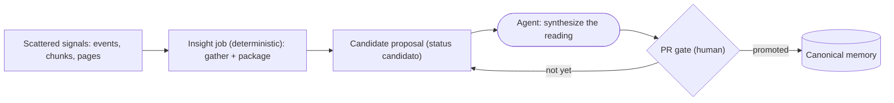

# Perceptive layer and Information -> Insight cycle

Updated on: 2026-06-09.

The living wiki separates two natures of content. On one side, the **canonical
memory**: pages with declared sources, gate by PR and auditing, which the wiki treats as
shareable truth. On the other, the **perceptive layer**: subjective, provisional
and private records that exist **before** anything becomes truth. The
perceptive layer is where the owner's perception is admitted without disguising itself as fact;
the Information -> Insight cycle is the controlled path by which a slice of that
perception (or a signal gathered by the system) can, with consent and review,
be promoted to canonical knowledge.

This page documents the method and the tool. For the deterministic part that
gate, auditing and ingestion impose, cross-reference the sibling pages listed at the end.

## Why a separate layer

Mixing perception with fact corrupts both. If perception enters as truth,
the wiki begins to assert things no one validated; if perception is forbidden, the
owner loses the place to think out loud and the system goes blind to tensions,
mood and context readings that only exist in the head of whoever operates. The solution is to
give perception its own space, marked, private and non-canonical, with an
explicit promotion boundary.

This boundary is encoded in the frontmatter of the perceptive pages, in the
[perception_policy](#perception_policy-the-mark-of-the-layer), and does not depend on
isolated human discipline: the gate by PR and the auditing guarantee that nothing
crosses the boundary by accident. See
[operational-wiki-contract.md](../operational-wiki-contract.md) and
[git-approvals.md](../git-approvals.md).

## The three perceptive artifacts

The perceptive layer has three forms of record, each with its own
template in [docs/references/templates/wiki](../../../docs/references/templates/wiki/journal.md).

### Journal (private perceptive entry)

The journal is the rawest form: a dated entry with context, state/mood, what
became clear, where there was tension and learning about one's own role. The template
is [journal.md](../../../docs/references/templates/wiki/journal.md). Three structural
points deserve highlighting:

- `page_type: journal_entry` and `status_epistemologico: percepcao` — declare that
  the page is perception, not truth.
- `visibility: private_self` and `stale_after_days: 30` — private by default and with a
  short validity window, because perception ages fast.
- The `## Promote? (consent)` section — the controlled exit point: the author
  decides whether some **slice** (never the entire entry) may become insight, claim
  or context note, with anonymization applied and target visibility
  `private_reference`, always via PR.

### Relations map (tensions and stakeholders)

The relations map is a perceptive read of a situation: stakeholders, roles,
perceived tensions and context. The template is
[relationship-map.md](../../../docs/references/templates/wiki/relationship-map.md). It
carries `status_epistemologico: hipotese` — it is how the author **interprets** the
relations today, subject to review, and not the truth of those involved. Tables separate
what is evidence from what is mere perception, and the page requires a confidence level and explicit
review triggers.

### Infographic / visual artifact

When the read becomes a diagram (tension map, stakeholder diagram,
infographic), the visual artifact is treated as a derived output, never as a source
of truth. The map template itself points the diagram to a derived area
via a Markdown link and does not embed the binary in the page.

## Accessibility as a requirement of the layer

The `perception_policy` of the templates makes accessibility mandatory, not
optional. Every visual artifact of the perceptive layer needs:

- `alt_text_required: true` — a short textual description of the diagram.
- `color_only_encoding_forbidden: true` — information can never depend only on
  color; it needs a label, thickness or redundant shape.
- `plain_language_summary_required: true` — a plain-language summary that
  conveys the main relations without the visual.

The templates already reserve the `## Accessible text alternative` section for this.
The rule exists because an insight that can only be read in the colored diagram is not
promotable: no one besides the author can audit the read.

## perception_policy: the mark of the layer

The `perception_policy` block in the frontmatter is what distinguishes a
perceptive page from a canonical page. The fields that matter:

- `layer: perceptiva` — declares the layer.
- `is_canonical_truth: false` — the page is never a source of truth, by construction.
- `subjective_inputs_allowed: true` (in the journal) — subjective inputs are
  legitimate here.
- `preferred_outputs` — expected formats (free text, tension list, relations
  map, etc.).
- `accessibility` — the three requirements above.
- `promotion` — the exit contract: `requires_consent: true`,
  `requires_anonymization: true`, `target_visibility: private_reference`,
  `gate: github_pr`.

The real hub of the layer is [index.md](../perception/index.md), in
[memories/system/perception](../perception/index.md), which lists the living perceptive
pages and reaffirms: nothing there is a source of truth and every promotion requires
consent + PR.

## The Information -> Insight cycle

Manual promotion (the journal's `## Promote?` section) covers the case where the author
**already knows** what they want to promote. The **insight job** covers the other case: when the
signal is scattered across events, chunks and pages and no one has yet formulated the
read. The job closes the Information -> Insight cycle by gathering the evidence and
proposing — never deciding — an insight.

The cycle turns scattered information into a reviewable insight without ever letting
the deterministic job decide truth: the job gathers signals and opens a candidate
proposal, the agent synthesizes the read, and only a human promotes it through the PR
gate into canonical memory.



The honesty rule is absolute:
[wiki_core/insight/job.py](../../../wiki_core/insight/job.py) **never calls a
model** and **never writes canonical memory**. It gathers deterministic signals,
assembles a context package and emits a skeleton proposal. The synthesis (the read
itself) is delegated to the agent that runs the repo; the promotion to memory passes through PR.
It is the same architecture as the LLM pass of the ingestion, documented in
[ingestion-process.md](../ingestion-process.md): the Python code is
deterministic and honest about its limits; the interpretive intelligence lives
in the agent, behind a human gate.

### What the job gathers

The `run` function in [wiki_core/insight/job.py](../../../wiki_core/insight/job.py),
triggered by the CLI [wiki_insight_job.py](../../../scripts/wiki_insight_job.py),
receives a `--theme` and a `--context` and joins three sources of signal already existing:

- **Score events** — read from the karma event trail and filtered by the
  context; the job also computes the total karma of the context. The scoring and the
  karma mechanics are in [karma-gamification.md](karma-gamification.md).
- **Indexed chunks** — searches the text index for the theme; each excerpt is
  truncated and flagged if it contains a secret. PII is allowed in a private repo, but
  secrets are flagged (`has_secret`), consistent with the detection described in
  [gates-and-audit.md](gates-and-audit.md).
- **Memory pages** — a scan of [memories/](../../index.md) for pages
  that mention the theme, returning the relative paths.

### What the job produces

With `--theme` and `--context` defined, the job writes two **derived and
gitignored** artifacts (in [data/derived/wiki/insight-jobs/](../../../data/derived/wiki/insight-jobs/), under the derived area
configured in [wiki.config.yaml](../../../wiki.config.yaml) and ignored by
git):

1. **Insight package** (`insight_request`, JSON) — contains the theme, the context,
   a `prompt` for the agent, the list of expected `proposal_fields` and all the
   `evidence` gathered (events, karma, chunks, pages). The prompt itself instructs:
   "NEVER write canonical memory; declare uncertainty honestly; do not invent
   evidence."
2. **Skeleton proposal** (Markdown) — a `page_type: insight` page with
   `status: candidato`, `status_epistemologico: candidato` (candidate) and
   `gate: github_pr`, with `## Reading`, `## Gathered evidence`, `## Uncertainty`
   and `## Possible action` sections. The interpretive fields come with "To be
   filled by the agent"; only the counted evidence comes pre-filled.

The fields the proposal must contain are fixed in `INSIGHT_PROPOSAL_FIELDS`:
title, reading (the read in one sentence), evidence (list of chunk/page/event),
uncertainty, possible_action and status_epistemologico — this last one always
`candidato` until the human gate.

The `--dry-run` flag computes everything in memory without writing anything, useful for inspecting
how much evidence exists about a theme before opening a proposal.

```sh
# Gather evidence and emit package + proposal (derived artifacts, gitignored)
python3 scripts/wiki_insight_job.py --theme "honesty gate" --context system

# Only inspect the evidence, without writing artifacts
python3 scripts/wiki_insight_job.py --theme "reconciliation" --context example --dry-run
```

### Who closes the cycle

The complete cycle has three distinct roles, and none of them accumulates too much
power:

1. **The job** (deterministic Python) gathers signals and opens the proposal. It does not decide
   truth, does not call a model, does not touch canonical memory.
2. **The agent** that runs the repo reads the package, synthesizes the insight in the fields of the
   proposal and declares uncertainty. It interprets, but does not publish.
3. **The human** reviews the proposal and promotes it (or not) to memory via PR, under the
   auditing described in [gates-and-audit.md](gates-and-audit.md) and the flow
   of [git-approvals.md](../git-approvals.md).

A candidate only becomes canonical truth when it crosses the PR. Until then, it is
exactly what the name says: a candidate.

## How this looks in the cockpit

The perceptive layer and the insight job appear in the daily operation through the cockpit in
[operations.md](../../operations.md), and the living hub of the layer is
[index.md](../perception/index.md). The cycle does not replace the manual perception of the
journal; it complements it, giving an honest way to transform scattered signal
into a reviewable proposal.

## Related

- Operational cockpit: [operations.md](../../operations.md).
- Root MOC of the memories: [index.md](../../index.md).
- Hub of the perceptive layer: [index.md](../perception/index.md).
- Journal template: [journal.md](../../../docs/references/templates/wiki/journal.md).
- Relations map template: [relationship-map.md](../../../docs/references/templates/wiki/relationship-map.md).
- Insight job (code): [job.py](../../../wiki_core/insight/job.py) and CLI [wiki_insight_job.py](../../../scripts/wiki_insight_job.py).
- Same architecture in the ingestion (LLM pass): [ingestion-process.md](../ingestion-process.md).
- Gates, auditing and secret detection: [gates-and-audit.md](gates-and-audit.md).
- Karma and scoring: [karma-gamification.md](karma-gamification.md).
- Page and promotion contract: [operational-wiki-contract.md](../operational-wiki-contract.md).
- PR approval flow: [git-approvals.md](../git-approvals.md).
- Method coverage matrix: [methodology-coverage-v5.md](../methodology-coverage-v5.md).
- Conventions and the AGENT contract: [AGENTS.md](../../../AGENTS.md).
- Wiki auditor: [wiki_audit.py](../../../scripts/wiki_audit.py).
