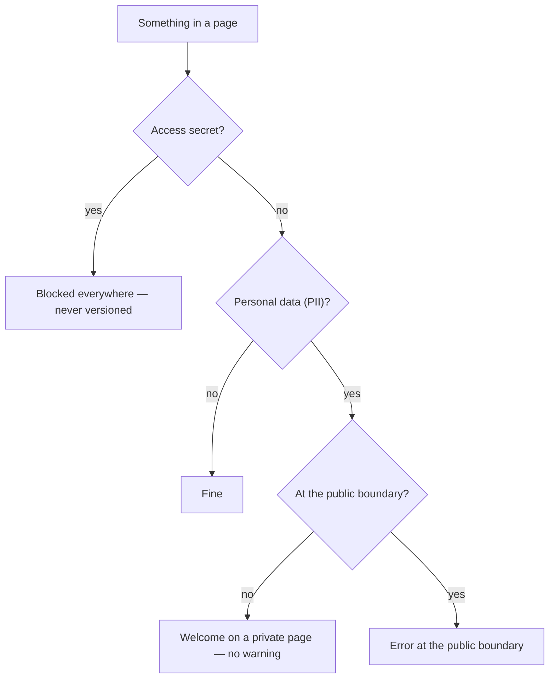

# Privacy model

Last updated: 2026-06-09.

The living wiki holds personal operational memory: CPF, CNPJ, amounts, counterparties,
dates and names are the content itself, not an accident. At the same time, it lives
in a Git repository and may, at some point, export pages outward. The privacy
model resolves that tension with **two independent axes**, and not with a
single "redact everything that looks sensitive" filter. This page documents the method and the
deterministic detectors; the PR gate that applies all of this lives in
[gates and audit](gates-and-audit.md) and [Git approvals](../git-approvals.md).

## The two axes

| Axis | What it is | Where it can be | Who decides |
| --- | --- | --- | --- |
| **Personal data (PII)** | CPF, CNPJ, credit card, IBAN, email | Welcome on a private page, **without warning**; error only at the public boundary | The page's `visibility` + the repo's policy |
| **Access secrets** | API keys, tokens, private keys, passwords | **Never** versioned, in **any** file | Absolute block, always |

The decision an item goes through:



The classic confusion is to treat "owner's CPF" and "AWS token" as the same thing. They
are not: the first is the memory you want to preserve; the second is a credential
that, once leaked, grants access to systems. The kit separates the two into distinct modules under
[wiki_core/detectors/](../../../wiki_core/detectors/secrets.py) and audits them through
different paths in [scripts/wiki_audit.py](../../../scripts/wiki_audit.py).

## Axis 1 — Personal data (PII): welcome in private

The function [audit_pii in scripts/wiki_audit.py](../../../scripts/wiki_audit.py)
walks the Markdown files under [memories/](../../), reads the `visibility` from the frontmatter (falling back to the
`default_visibility` of [wiki.config.yaml](../../../wiki.config.yaml) when absent)
and decides:

- **Private page** (`private_self` etc.) with `private_sensitive_allowed: true`
  (the default in [wiki.config.yaml](../../../wiki.config.yaml)): PII is **silent**,
  with no error or warning. Storing CPF/CNPJ, amounts and counterparties is the purpose of the memory.
- **Public boundary** — `visibility` set to `public` or `public_candidate`, or the
  run with the `--public-export` flag: each PII finding becomes an **error**, identified
  by file, line, type and redacted excerpt.
- **Opt-in strict mode** (see below): with `private_sensitive_allowed: false`, PII on a
  private page also becomes an error.

The set of public visibilities is the constant `PUBLIC_VISIBILITIES`
(`{"public", "public_candidate"}`) in
[scripts/wiki_audit.py](../../../scripts/wiki_audit.py). PII never blocks on its own
on a private page — it only beeps when it crosses outward.

### PII detectors

The module
[wiki_core/detectors/sensitive_terms.py](../../../wiki_core/detectors/sensitive_terms.py)
favors **precision over recall** — it prefers to let a doubtful case through rather than flood
with false positives:

- **Punctuated CPF and CNPJ**: fixed-format regex (`000.000.000-00`, `00.000.000/0000-00`).
- **CPF and CNPJ without punctuation**: a sequence of 11 or 14 digits is only reported when
  the **check digit matches** (functions `_cpf_valid`/`_cnpj_valid`). This avoids
  matching phone numbers and random numbers; sequences of repeated digits are discarded.
- **Credit card**: a candidate of 13 to 19 digits (with optional spaces/hyphens)
  validated by the **Luhn checksum** (`_luhn_valid`). Most random digit runs
  fail Luhn and are not reported.
- **IBAN**: `XX00` format followed by 11 to 30 alphanumerics.

Emails are in [wiki_core/detectors/entities.py](../../../wiki_core/detectors/entities.py),
category `entity`, severity `baixo` (low; persisted pt severity id) — purely informational, to label personal
data without implying a leak. Since `audit_pii` filters by `category == "pii"`, email
does not trigger the boundary block on its own.

## Axis 2 — Access secrets: blocked always

The function [audit_secrets in scripts/wiki_audit.py](../../../scripts/wiki_audit.py) is
unconditional with respect to visibility: as long as `forbid_access_secrets` is enabled in the
`audit` block of [wiki.config.yaml](../../../wiki.config.yaml) (default `true`), it
scans **every versioned text file** (`.md`, `.py`, `.yaml`, `.json`, `.txt`,
`.csv`, `.sh` etc.) and turns any finding of category `secret` into an **error**.
It does not matter whether the page is private — an access secret simply cannot be in Git.

To avoid failing on itself, the auditor skips the prefixes of
`SECRET_SCAN_SKIP_PREFIXES` in [scripts/wiki_audit.py](../../../scripts/wiki_audit.py)
(`tests/` and `wiki_core/detectors/`), where example secret patterns live on purpose.

### Secret detectors

[wiki_core/detectors/secrets.py](../../../wiki_core/detectors/secrets.py) combines two
strategies:

- **Known-shape patterns**: AWS access key (`AKIA…`), Google API key
  (`AIza…`), Slack token (`xox…`), JWT (`eyJ…`), PEM private key
  (`-----BEGIN … PRIVATE KEY-----`), GitHub tokens (`ghp_`/`github_pat_…`) and
  `Bearer …`. Each pattern targets a form of real credential, with severity
  `critico`/`alto` (critical/high; persisted pt severity ids).
- **Generic assignment with entropy filter**: names like `api_key`, `secret`,
  `token`, `senha` (Portuguese for password), `password`, `client_secret`,
  `refresh_token` followed by `:` or `=`.
  The value is only reported if it "looks random": at least **16 characters** and
  **Shannon entropy above 3.0 bits/character** (`_looks_random`). Thus,
  `password: my usual phrase` does not beep, but `password: 9f3aK7xQ2mZ…` beeps. The calculation is
  in `_shannon_entropy` in the same module.

## Excerpt redaction: the report never carries the raw secret

Both PII and secrets never appear in plain text in the audit result. Every
finding is a `Finding` (frozen dataclass in
[wiki_core/detectors/__init__.py](../../../wiki_core/detectors/__init__.py)) whose field
`excerpt` already comes masked by the `redact` function: it keeps at most the 4 characters
at the ends and replaces the middle with `*`; short values (up to 8 chars) are masked
entirely. That is why the log, PR report and the auditor's error message are safe to
share — they say **which** type of data was found and **on which line**, without
revealing the content. The `scan_file` entry point in
[wiki_core/detectors/__init__.py](../../../wiki_core/detectors/__init__.py) also skips
binaries (any file with a NUL byte) and deduplicates findings by `(kind, line, excerpt)`.

## Strict mode (opt-in)

The default is free PII on private pages. Whoever wants a stricter posture changes one
line in [wiki.config.yaml](../../../wiki.config.yaml):

```sh
# from:
private_sensitive_allowed: true
# to:
private_sensitive_allowed: false
```

With this, `audit_pii` starts treating PII on **any** page (even private) as an
error. It is a choice of the repo owner, not an imposed default. Regardless of this, the
secrets axis stays on and blocking always.

## The export boundary and the promotion to public

Two doors reinforce the PII axis when exposing something:

- **`--public-export`**: running
  [scripts/wiki_audit.py](../../../scripts/wiki_audit.py) with this flag is a
  pre-publication rehearsal — it treats PII as an error on **every** page, useful before generating a package
  for outside the repo.

```sh
python3 scripts/wiki_audit.py --check --public-export
```

- **`public_candidate`**: the function `audit_public_candidates` scans **all** the pages
  marked `public_candidate` (not just the current diff), requires a **redaction/publication
  checklist** in the body and fails if any secret **or** PII is still
  exposed. It is the gate between "private draft" and "publication candidate". The formal
  promotion of specific fields (with consent and a reversal plan) is audited
  separately — see [Git approvals](../git-approvals.md) and the
  [operational wiki contract](../operational-wiki-contract.md).

## Operational summary

- Personal data is memory: leave it on a private page, without guilt and without warning.
- An access secret never enters Git — if it did, the auditor stops the PR.
- Want to publish? Mark `public_candidate` (or run `--public-export`) and PII becomes
  a barrier until it is redacted.
- Everything the auditor reports already comes redacted; the pipeline that triggers these checks is in
  [ingestion process](../ingestion-process.md) and the method coverage in
  [methodology coverage v5](../methodology-coverage-v5.md).
